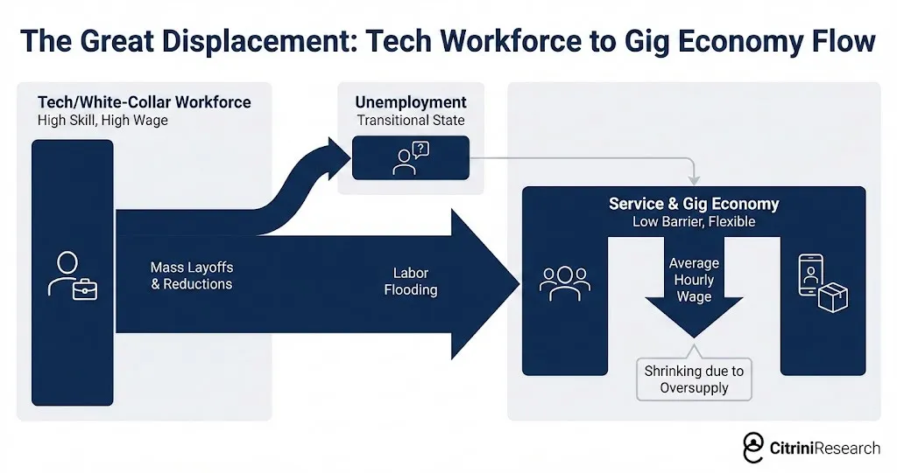
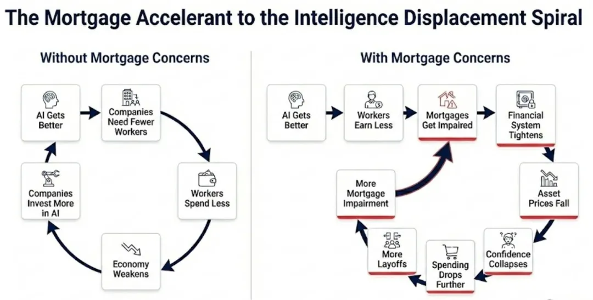
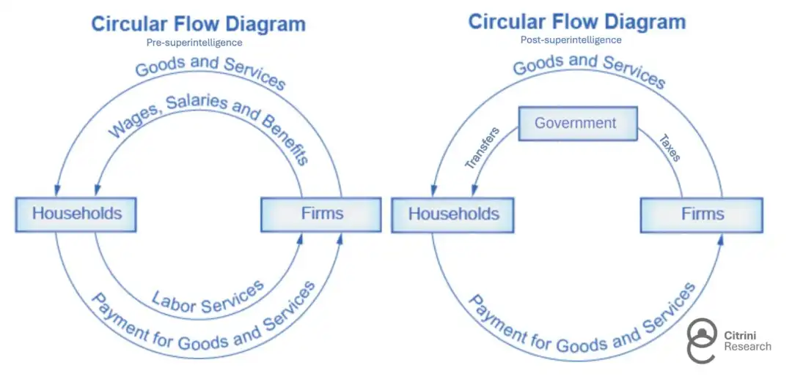

> 作者：Citrini 与 Alap Shah
> 译者：冯若航
> 原文：[The Global Intelligence Crisis](https://open.substack.com/pub/alapshah1/p/the-global-intelligence-crisis?r=1g6uar&utm_campaign=post&utm_medium=web&showWelcomeOnShare=true)

昨天这篇文章在 X 上有两千万浏览，并且可能带动了昨晚软件股的大震荡。一场站在“两年后”回望当下的思想实验，有助于理解我们正在面对一个怎样的未来。

### 一场来自未来的金融史思想实验

**2026 年 2 月 22 日**

------

## 前言

**如果我们对 AI 的看多判断一直是对的……而这件事本身反而是利空呢？**

**以下是一个情景推演，而非预测。** 这不是空头意淫，也不是 AI 末日爱好者的同人小说。这篇文章唯一的目的，是对一个迄今探讨不足的情景进行建模。我们的朋友 Alap Shah 提出了这个问题，我们一起头脑风暴出了答案。我们写了这一篇，他另外写了两篇，可以在这里[1]找到。

希望读完之后，你能对 AI 使经济日益“诡异化”过程中潜在的左尾风险，多一分准备。

**以下是 CitriniResearch 2028 年 6 月的宏观备忘录，详述“全球智能危机”的演进与冲击。**

------

------

## 宏观备忘录

## 充裕智能的代价

***\*CitriniResearch\****

***\*~~2026年2月22日~~ 2028年6月30日\****

今早公布的失业率为 10.2%，高于预期 0.3 个百分点。市场因此下跌 2%，标普500指数自 2026 年 10 月高点以来的累计跌幅已达 38%。

交易员们已经麻木了。六个月前，这样的数据足以触发熔断。

**两年。** 从“可控”和“局限于个别行业”，到经济面目全非——我们所有人成长于其中的那个经济体不复存在——只用了这么长时间。本季度的宏观备忘录，是我们对这一进程的复盘尝试——一份针对危机前经济的“事后检验”。

那时的亢奋是实实在在的。到 2026 年 10 月，标普500逼近 8000 点，纳斯达克突破 30000 点。因人类劳动力被取代而引发的第一波裁员始于 2026 年初，而裁员产生的效果与预期完全一致：利润率扩张，盈利超预期，股价上涨。创纪录的企业利润被源源不断地投回 AI 算力。

各项头条数据依然亮眼。名义 GDP 连续录得中高个位数的年化增长。生产率飙升。实际每小时产出以 1950 年代以来未见的速度增长——驱动力是不需要睡眠、不请病假、不需要医保的 AI 智能体。

算力拥有者的财富随着劳动力成本的消失而爆炸式增长。与此同时，实际工资增速崩塌。尽管政府反复炫耀“创纪录的生产率”，白领工人正在被机器夺走工作，被迫接受薪酬更低的岗位。

当消费经济开始出现裂痕时，经济评论家们发明了一个流行语：“**幽灵 GDP**”（Ghost GDP）——产出出现在国民账户中，却从未在实体经济中流通。

**AI 在方方面面都超预期，而市场就是 AI。** 唯一的问题是……**经济不是。**

事后看来，一切本该一目了然：北达科他州的一个 GPU 集群，创造了此前归属于曼哈顿中城一万名白领的产出——这更像是一场“经济瘟疫”，而非“经济灵药”。货币流通速度趋于停滞。以人类为核心的消费经济——彼时占 GDP 的 70%——正在枯萎。如果我们早点想想机器在可选消费品上花了多少钱，也许能更早看清这一点。（提示：答案是零。）

AI 能力提升，企业需要更少的工人，白领裁员增加，被裁的人消费减少，利润压力推动企业加大 AI 投入，AI 能力再次提升……

这是一个没有自然刹车的负反馈循环。即**人类智能替代螺旋**。白领工人眼看着自己的收入能力（以及理所当然的消费能力）遭到结构性损害。他们的收入曾是 13 万亿美元住房抵押贷款市场的基石——迫使承销商重新评估：优质抵押贷款还靠得住吗？

十七年没有出现过真正的违约周期，私募市场膨胀着大量 PE 支持的软件交易，建立在“年度经常性收入（ARR）将持续循环”的假设之上。2027 年中期因 AI 颠覆引发的第一波违约，动摇了这一假设。

如果颠覆仅限于软件行业，局面尚可控制，但它没有停下来。到 2027 年底，它威胁到了每一个建立在“中间层”商业模式之上的企业。大量通过为人类“变现摩擦”而生存的公司灰飞烟灭。

整个系统原来是一条漫长的信用链条，全部押注在白领生产率的持续增长之上。2027 年 11 月的崩盘只是加速了所有已经运行中的负反馈循环。

“坏消息就是好消息”——我们已经等了将近一年了。政府开始考虑各种提案，但公众对政府实施任何救援的信心正在消退。政策反应总是滞后于经济现实，但缺乏一个全面方案，如今正威胁着加速通缩螺旋的到来。

------

## 起源

2025 年末，智能体编程工具的能力发生了阶跃式跃升。

一个能力过关的开发者借助 Claude Code 或 Codex，几周内就能复制出一款中端 SaaS 产品的核心功能。做不到完美，也无法覆盖每个边缘场景——但足以让审查 50 万美元年度续约合同的 CIO 开始问一个问题：“如果我们自己开发呢？”

大多数企业的财年与日历年一致，因此 2026 年的企业支出是在 2025 年第四季度敲定的，当时“智能体 AI”还只是一个时髦术语。年中评审是采购团队第一次在真正了解这些系统能做什么之后做决策。有些团队亲眼看着自己的内部团队在几周内搭出了原型，复制了价值六位数的 SaaS 合同。

那年夏天，我们与一位财富500强的采购经理交谈。他跟我们讲了一次预算谈判的故事。销售代表原以为可以照搬去年的套路：年涨 5%，加上“你们团队离不开我们”的标准话术。但采购经理告诉对方，他已经在和 OpenAI 谈了，考虑让他们的“前沿部署工程师”用 AI 工具彻底替换掉该供应商。最终以打七折续约。他说这已经算好结果了。SaaS “长尾”——比如 Monday.com、Zapier 和 Asana——的日子更惨。

投资者对长尾产品的冲击已有心理准备——甚至可以说翘首以盼。这些产品虽然可能占到典型企业技术栈支出的三分之一，但它们显然暴露在风险之中。真正被认为安全的，是那些“记录系统”（systems of record）。

直到 ServiceNow 2026 年三季报发布，反身性的传导机制才变得更加清晰。

> ***\*SERVICENOW 净新增 ACV 增速从 23% 降至 14%；宣布裁员 15% 及“结构性效率计划”；股价下跌 18% | 彭博，2026年10月\****

SaaS 并没有“死”。自建系统的运维和支撑仍然存在成本效益分析。但自建**确实**成了一种选项，而这个选项会影响定价谈判。也许更重要的是，竞争格局已经改变。AI 降低了开发和交付新功能的门槛，导致产品差异化崩塌。头部企业陷入价格战——既要与彼此厮杀，又要面对一批乘着智能体编程能力东风、没有遗留成本包袱的新兴挑战者的凶猛抢食。

这些系统之间的关联性，直到这份财报才被充分认识到。ServiceNow 按席位收费。当财富500强客户裁掉 15% 的员工时，它们也取消了 15% 的许可证。同样是 AI 驱动的裁员——在客户那边提升利润率的同时，正在机械性地摧毁 ServiceNow 自己的收入基础。

一家卖工作流自动化的公司，正被更好的工作流自动化颠覆，而它的应对之策是——裁员，然后用省下的钱投资正在颠覆自己的技术。

除此之外还能怎么办？**坐以待毙、慢慢等死吗？\***受 AI 威胁最大的公司，反而成了 AI 最激进的采用者。***

事后看来这显而易见，但当时真的不是（至少对我而言不是）。历史上的颠覆模型告诉我们：在位者抗拒新技术，输给灵活的新进入者，然后慢慢死去。柯达是这样，百视达是这样，黑莓也是这样。但 2026 年发生的事不一样——在位者没有抗拒，因为他们承受不起抗拒的代价。

股价跌了40-60%，董事会要求交代，受到 AI 威胁的公司只能做一件事：裁人，把省下的钱投入 AI 工具，用这些工具以更低的成本维持产出。

每家公司的个体反应都是理性的。集体结果却是灾难性的。每一美元裁员省下的钱，都流入了使下一轮裁员成为可能的 AI 能力。

**软件只是序幕。** 当投资者还在争论 SaaS 估值倍数是否已经见底时，他们没有注意到，反身性循环已经溢出了软件行业。支撑 ServiceNow 裁员决策的同一套逻辑，适用于每一家拥有白领成本结构的公司。

------

## 当摩擦归零

到 2027 年初，使用大语言模型已成为默认行为。人们在使用 AI 智能体，但很多人甚至不知道 AI 智能体是什么——就像当年不知道“云计算”为何物的人照样在用流媒体服务。他们对 AI 的感知，和对自动补全或拼写检查的感知一样——就是手机现在能干的一件事。

通义千问（Qwen）的开源智能体购物助手，是 AI 接管消费者决策的催化剂。几周之内，所有主流 AI 助手都集成了某种智能体电商功能。蒸馏模型意味着这些智能体可以在手机和笔记本电脑上运行，而不仅限于云端，大幅降低了推理的边际成本。

真正应该让投资者更加不安的是：这些智能体不会坐等被召唤。它们在后台根据用户偏好持续运行。消费不再是一系列离散的人类决策，而变成了一个持续运行的优化过程，全天候代表每一个联网消费者运转。到 2027 年 3 月，美国个人日均消费的 token 中位数已达 40 万——是 2026 年底的 10 倍。

链条上的下一环已经在断裂。

**中间层。**

过去五十年，美国经济在人类局限性之上构建了一个庞大的“租金抽取层”：事情需要时间，耐心会耗尽，品牌熟悉度替代了尽职调查，大多数人宁愿接受一个差价格也不愿再多点几下。数万亿美元的企业价值，依赖于这些约束条件持续存在。

一开始很简单。智能体消除了摩擦。

那些已经几个月没用却在自动续费的订阅和会员。试用期结束后悄悄翻倍的定价。每一个都被重新定义为一场“人质危机”——而智能体可以出面谈判。平均客户终身价值（LTV）——整个订阅经济赖以建立的指标——显著下滑。

消费者智能体开始改变几乎所有消费交易的运作方式。

人类确实没有时间在五个竞品平台上比价一盒蛋白棒。机器有。

旅游预订平台是最早的牺牲品，因为它们最简单。到 2026 年第四季度，我们的智能体已经能以比任何平台更快更便宜的方式，组装出完整的行程方案（航班、酒店、地面交通、会员积分优化、预算约束、退款处理）。

保险续保——整个续保模型建立在投保人惰性之上——被改革了。每年帮你重新货比三家的智能体，瓦解了保险公司从被动续保中赚取的 15-20% 保费溢价。

财务咨询。报税。日常法律事务。凡是服务商的价值主张本质上是“我来帮你处理你觉得烦的复杂事务”的领域，都被颠覆了——因为智能体不觉得任何事情是烦的。

就连那些我们以为受“人际关系”保护的领域，也证明是脆弱的。房地产行业——买家几十年来容忍 5-6% 的佣金率，因为买卖双方之间存在信息不对称——在 AI 智能体获得 MLS（多重上市服务）数据访问权和数十年交易数据后，瞬间瓦解。一份 2027 年 3 月的卖方研报将此命名为“智能体对智能体的暴力”（agent on agent violence）。主要都市圈的买方中介佣金中位数已从 2.5-3% 压缩至 1% 以下，越来越多的交易在没有任何人类买方经纪人参与的情况下完成。

我们高估了“人际关系”的价值。事实证明，很多被称作“关系”的东西，不过是带着友好面孔的摩擦。

对中间层的颠覆才刚刚开始。成功的公司曾花费数十亿美元，有效利用消费者行为和人类心理的种种弱点——而这些弱点如今已不再重要。

以价格和匹配度为优化目标的机器，不关心你最爱的 App，不关心你过去四年习惯性打开的网站，也不会被精心设计的结账体验所吸引。它们不会因为疲倦而选最省事的选项，也不会默认“我一直在这家点单”。

这摧毁了一种特定的护城河：**习惯性中间化。**

DoorDash（美股代码：DASH）是最典型的案例。

编程智能体大幅降低了上线一款外卖 App 的门槛。一个称职的开发者几周内就能部署一个可用的竞品，而且有几十个人这么做了——他们将 90-95% 的配送费直接分给骑手，以此吸引骑手离开 DoorDash 和 Uber Eats。多平台仪表盘让零工劳动者可以同时追踪来自二三十个平台的订单，消除了头部平台赖以生存的锁定效应。市场一夜之间碎片化，利润率压缩至接近于零。

智能体同时加速了破坏的两端。它们催生了竞争者，然后又使用这些竞争者。DoorDash 的护城河说白了就是“你饿了，你懒，这个 App 在你手机首屏上”。智能体没有首屏。它会检查 DoorDash、Uber Eats、餐厅自己的网站，以及二十个新的“氛围编程”（vibe-coded）竞品，每次挑费用最低、配送最快的那个。

习惯性 App 忠诚度——整个商业模式的基础——对机器来说根本不存在。

这颇有几分诗意，也许是整个故事中智能体为即将被取代的白领做的唯一一件好事。当他们最终沦为外卖骑手时，至少不必再把一半收入交给 Uber 和 DoorDash 了。当然，技术的这份“善意”没有持续太久——自动驾驶车辆的普及很快就到来了。

一旦智能体控制了交易，它们便开始寻找更大的“回形针”。

能做的比价和聚合毕竟有限。要持续为用户省钱（尤其是当智能体开始彼此之间直接交易时），最大的突破口是**消除费用**。在机器对机器的商业中，**2-3% 的银行卡交换费成为一个显而易见的靶子。**

智能体开始寻找比银行卡更快更便宜的支付方式。大多数选择了通过 Solana 或以太坊 L2 使用稳定币，结算几乎即时，交易成本以分之一美分计。

> ***\*万事达卡 2027 年一季报：净收入同比+6%；消费额增速从上季的+5.9% 降至+3.4%；管理层提及“智能体主导的价格优化”和“可选消费品类承压” | 彭博，2027年4月29日\****

万事达卡 2027 年一季报是不可逆转的临界点。智能体电商从一个产品故事变成了一个“管道”故事。MA 次日下跌 9%。Visa 也跌了，但在分析师指出其在稳定币基础设施方面的更强定位后，跌幅有所收窄。

智能体电商绕开交换费，对以银行卡业务为核心的银行和单一发卡机构构成了更大的威胁——它们收取 2-3% 费用的大头，并围绕由商户补贴资助的积分奖励计划建立了整个业务条线。

美国运通（美股代码：AXP）受冲击最大：白领裁员潮侵蚀其客户基础，智能体绕开交换费侵蚀其收入模式，两面夹击。Synchrony（SYF）、Capital One（COF）和 Discover（DFS）也在随后几周内下跌超过 10%。

它们的护城河由摩擦筑成。而**摩擦正在归零。**

------

## 从行业风险到系统性风险

整个 2026 年，市场将 AI 的负面影响视为行业性话题。软件和咨询行业被碾压，支付和其他“收费站”摇摇欲坠，但更广泛的经济看起来还好。劳动力市场虽然走软，但并非自由落体。共识观点是：创造性破坏是任何技术创新周期的组成部分。虽然会有局部阵痛，但 AI 带来的总体正面效应将超过负面影响。

我们在 2027 年 1 月的宏观备忘录中指出，这是一个错误的思维框架。美国经济是白领服务型经济。白领工人占就业人口的 50%，驱动了约 75% 的可选消费支出。AI 正在吞噬的企业和岗位，并非美国经济的边缘——它们**就是**美国经济本身。

“技术创新摧毁旧岗位，然后创造更多新岗位”——这是当时最流行、最有说服力的反驳论点。它流行且有说服力，因为过去两百年来它一直是对的。即便我们无法想象未来的工作是什么样，它们也一定会到来。

ATM 机降低了网点运营成本，于是银行开设了更多网点，柜员就业人数在随后二十年中持续上升。互联网颠覆了旅行社、黄页、实体零售，但也催生了全新的产业来取代它们，创造了新的就业机会。

然而，以往每一个新岗位都需要一个人类来担任。

AI 现在已经是一种通用智能，它在人类可能转岗去做的那些任务上也在不断进步。被裁的程序员不能简单地转行去做“AI 管理”，因为 AI 已经有能力胜任那个角色。

如今，AI 智能体可以处理长达数周的研发任务。指数级增长碾碎了我们对可能性的一切想象——尽管每年都有沃顿商学院的教授试图将数据拟合成新的 S 型曲线。

它们撰写了几乎所有代码。性能最强的那些，在几乎所有领域都远比几乎所有人类聪明。而且它们还在不断变得更便宜。

AI **确实**创造了新工作。提示工程师。AI 安全研究员。基础设施技术员。人类仍在循环中——在最高层面进行协调，或凭品味做出方向性判断。但 AI 每创造一个新岗位，就淘汰了几十个旧岗位。新岗位的薪酬只是旧岗位的一个零头。

> ***\*美国 JOLTS 数据：职位空缺降至 550 万以下；失业人数/空缺比升至约 1.7，为 2020 年 8 月以来最高 | 彭博，2026年10月\****

招聘率全年低迷，但 10 月的 JOLTS 数据提供了一些确凿的证据。职位空缺降至 550 万以下，同比下降 15%。

> ***\*INDEED：软件、金融、咨询领域招聘帖急剧下降，“生产率优化举措”蔓延 | Indeed 招聘实验室，2026年11-12月\****

白领职位空缺正在塌方，而蓝领职位空缺相对稳定（建筑、医疗、技工）。人员流失集中在写备忘录的人身上**（不知怎的，我们还在营业）**，审批预算的人身上，以及维持经济中间层润滑运转的人身上。但两个群体的实际工资增长在一年中的大部分时间都是负数，而且还在继续下降。

股市仍然更在意通用电气 Vernova 的涡轮机产能已售罄至 2040 年这样的消息，而非 JOLTS 数据。在负面宏观消息和正面 AI 基础设施头条之间，市场横向拉锯。

债券市场（总是比股市更聪明，至少没那么浪漫）则开始为消费冲击定价。10 年期美债收益率在随后四个月从 4.3% 下行至 3.2%。尽管如此，头条失业率并未飙升，其中的结构性细微差异仍未被部分人察觉。

在正常的衰退中，原因最终会自我修正。过度建设导致建筑业放缓，利率下降，进而刺激新的建设。库存过剩导致去库，进而转为补库。周期性机制本身蕴含着复苏的种子。

**这一轮的病因不是周期性的。**

AI 变得更好、更便宜。企业裁员，然后把省下的钱用来购买更多 AI 能力，从而裁更多的人。被裁的工人消费减少。面向消费者的企业销量下降，利润萎缩，为保利润率进一步加大 AI 投入。AI 变得更好、更便宜。

一个没有自然刹车的反馈循环。

直觉上，人们预期总需求下降会拖慢 AI 建设。但事实并非如此，因为这不是超大规模云厂商式的资本开支（CapEx），而是运营费用替代（OpEx substitution）。一家过去每年在员工上花 1 亿美元、在 AI 上花 500 万美元的公司，现在在员工上花 7000 万美元、在 AI 上花 2000 万美元。AI 投入翻了数倍，但这是以总运营成本下降为前提的。每家公司的 AI 预算都在增长，而整体支出却在收缩。

这里的讽刺之处在于：AI 基础设施综合体即使在它正在颠覆的经济开始恶化之际，仍然在高歌猛进。英伟达（NVDA）仍在创营收新高。台积电（TSM）仍在以 95% 以上的产能利用率运转。超大规模云厂商每季度仍在数据中心资本支出上投入 1500-2000 亿美元。纯受益于这一趋势的经济体——如台湾和韩国——表现大幅领先。

印度则恰恰相反。该国的 IT 服务业每年出口超过 2000 亿美元，是印度经常账户盈余的最大贡献者，也是为其持续性商品贸易逆差提供融资的支柱。整个模式建立在一个价值主张之上：印度开发者的成本只是美国同行的几分之一。但 AI 编码智能体的边际成本已经降到了——本质上——电费的水平。TCS、Infosys 和 Wipro 在 2027 年全年遭遇了加速的合同取消。卢比在四个月内对美元贬值了 18%，因为支撑印度外部账户的服务顺差蒸发了。到 2028 年一季度，IMF 已与新德里开始了“初步讨论”。

造成颠覆的引擎每个季度都在变得更强，这意味着颠覆每个季度都在加速。劳动力市场没有自然底部。

在美国，我们不再追问 AI 基础设施泡沫何时破裂。我们在问：当消费者正在被机器取代时，一个建立在消费信贷之上的经济体会怎样？

------

## 智能替代螺旋

2027 年是宏观叙事不再隐晦的一年。过去十二个月那些分散但明显的负面事态，其传导机制变得清晰可见。你不需要去翻劳工统计局的数据，参加一场朋友的晚宴就够了。

**被裁的白领并没有闲坐着。** 他们降级了。许多人接受了薪酬更低的服务业和零工岗位——这增加了这些领域的劳动力供给，进一步压缩了那里的工资。

我们的一个朋友，2025 年还是 Salesforce 的高级产品经理。有头衔，有医保，有 401(k)，年薪 18 万美元。她在第三轮裁员中失去了工作。找了六个月之后，开始开 Uber。收入降到了 4.5 万美元。这里的重点不是个人故事，而是二阶效应的算术。把这种动态乘以每个主要都市圈的几十万工人。大量高素质劳动力涌入服务业和零工经济，压低了原本就收入困难的在岗工人的工资。行业性颠覆转移为全经济范围的工资压缩。

剩余的人力密集型岗位池还面临着另一次冲击——就在我们写作此刻正在发生。自动配送和无人驾驶车辆正在侵入吸收了第一波被裁工人的零工经济。

到 2027 年 2 月，仍在岗的白领明显开始按“我可能是下一个”的预期来消费。他们（多半借助 AI）加倍努力地工作，只为了不被裁——升职加薪的念想早已无影无踪。储蓄率上升，消费转软。

最危险的是时滞。高收入者凭借其高于平均水平的储蓄，维持了两到三个季度表面上的正常。硬数据要到问题在真实经济中已成旧闻时才会确认。然后，打破幻觉的那一组数据来了。

> ***\*美国首次申请失业救济人数飙升至 48.7 万，为 2020 年 4 月以来最高；劳工部，2027年第三季度\****

首次申领人数飙升至 48.7 万，为 2020 年 4 月以来最高。ADP 和 Equifax 确认，绝大多数新申请者是白领专业人士。

标普500在接下来一周下跌了 6%。负面宏观开始在拔河赛中胜出。

在正常的衰退中，失业是广泛分布的。蓝领和白领大致按各自在就业中的占比分担痛苦。消费冲击也是广泛分布的，而且因为低收入工人的边际消费倾向更高，冲击会迅速体现在数据中。

但在这一轮周期中，失业集中在收入分布的上十分位。他们在总就业中的占比相对较小，但驱动了不成比例的巨量消费支出。收入前 10% 的人群贡献了美国全部消费支出的 50% 以上。前 20% 的人群贡献了约 65%。这些人购买房屋、汽车、度假、餐厅消费、私立学校学费、住宅装修。他们是整个可选消费经济的需求基础。

当这些工人失去工作，或为了接受现有岗位而薪资腰斩时，消费冲击相对于失业人数而言是巨大的。白领就业下降 2%，大约对应可选消费支出下降 3-4%。与蓝领失业的即时冲击不同（工厂裁员，下周就停止消费），白领失业的影响是滞后但更深层的，因为这些工人有储蓄缓冲，可以维持几个月的消费，然后行为才发生转变。

到 2027 年第二季度，经济已陷入衰退。NBER（美国国家经济研究局）要到几个月后才会正式确定衰退起点（他们向来如此），但数据已无可争辩——连续两个季度实际 GDP 负增长。但这还不是一场“金融危机”……至少暂时还不是。

------

## 关联押注的多米诺骨牌

私募信贷从 2015 年的不足 1 万亿美元增长到 2026 年的超过 2.5 万亿美元。其中相当一部分资金被投入了软件和科技领域的交易——许多是杠杆收购 SaaS 公司，估值建立在“收入将永久保持两位数百分比增长”的假设之上。

这些假设大约在第一个智能体编程演示和 2026 年一季度软件股崩盘之间的某个时刻就死了，但账面标记似乎没有意识到它们已经死了。

当许多上市 SaaS 公司已经以 5-8 倍 EBITDA 交易时，PE 支持的软件公司仍然按收购时的估值挂在资产负债表上——基于已经不复存在的营收倍数。管理人缓慢地下调估值——100 美分，92 美分，85 美分——而上市可比公司的定价已经告诉你答案是 50 美分。

> **穆迪一次性下调 14 家 PE 支持软件公司合计 180 亿美元债务评级，理由为“AI 驱动竞争颠覆带来的长期收入逆风”；为 2015 年能源行业以来最大的单一行业评级行动 | 穆迪投资者服务，2027年4月**

穆迪下调评级之后发生的事，每个人都记得。见过 2015 年能源行业降级后发生了什么的业内老兵，对这套剧本并不陌生。

软件支持贷款在 2027 年第三季度开始违约。PE 投资组合中信息服务和咨询领域的公司紧随其后。多家数十亿美元级别的知名 SaaS 公司杠杆收购案进入了债务重组。

Zendesk 是那颗冒烟的枪。

> **ZENDESK 因 AI 驱动的客服自动化侵蚀 ARR 导致违反债务契约；50 亿美元直接贷款工具标价降至 58 美分；史上最大私募信贷软件违约 | 金融时报，2027年9月**

2022 年，Hellman & Friedman 和 Permira 以 102 亿美元将 Zendesk 私有化。债务方案是 50 亿美元的直接贷款——当时史上最大的 ARR 支持融资——由黑石牵头，Apollo、Blue Owl 和 HPS 均参与放贷。这笔贷款的结构明确建立在 Zendesk 的年度经常性收入将持续循环的假设之上。以约 25 倍 EBITDA 的杠杆率计算，只有在这个假设成立的情况下，这种杠杆水平才说得通。

到 2027 年中期，这个假设不再成立。

AI 智能体自主处理客户服务已近一年。Zendesk 曾定义的品类（工单、路由、管理人工客服互动）已被无需生成工单就能直接解决问题的系统所取代。贷款承销所依据的年度经常性收入已不再“经常性”——那只是还没流失的收入。

史上最大的 ARR 支持贷款变成了史上最大的私募信贷软件违约案。每一个信用交易台同时问了同一个问题：还有谁披着“周期性”外衣，实则面对的是结构性逆风？

但共识有一点判断是对的，至少一开始是对的：这本应是可以承受的。

私募信贷不是 2008 年的银行体系。其整体架构的设计初衷就是为了避免强制抛售。这些是封闭式基金，资本是锁定的。LP 承诺了七到十年。没有储户会挤兑，没有回购融资会被抽走。管理人可以坐在减值资产上，通过时间慢慢化解，等待回收。痛苦，但可控。这个系统被设计为可以弯曲，但不会折断。

黑石、KKR 和 Apollo 的高管们引用软件敞口数据：占总资产 7-13%，可控。每一份卖方研报和金融推特上的信用账户都说着同样的话：私募信贷拥有“永久资本”，它们可以吸收那些原本会摧毁杠杆银行的损失。

*“永久资本”*。这个短语出现在每一份财报电话会和致投资者信中，旨在安抚人心。它变成了一句咒语。而和大多数咒语一样，没人关注细节。它真正意味着什么呢……

过去十年，大型另类资产管理公司收购了人寿保险公司，并将其改造为融资载体。Apollo 收购了 Athene。Brookfield 收购了 American Equity。KKR 拿下了 Global Atlantic。逻辑很优雅：年金存款提供了一个稳定的长久期负债基础。管理人将这些存款投入他们自己发起的私募信贷，然后赚两次钱——保险端赚利差，资产管理端赚管理费。一台“费上加费”的永动机——在一个条件下运转完美。

**私募信贷必须是安全的。**

损失冲击了为持有非流动资产、匹配长久期负债而建的资产负债表。那些本应让系统具有韧性的“永久资本”，并不是什么抽象的、有耐心的机构资金和精明投资者承担精明风险。它是美国家庭的储蓄——“普罗大众”——以年金形式结构化，投入了那些正在违约的 PE 支持软件和科技债务。那些被锁定、无法“挤兑”的资本，是人寿保险保单持有人的钱——而对这种钱，规则是不一样的。

与银行监管体系相比，保险监管机构一直温顺——甚至可以说自满——但这次是一记警钟。本来就对人寿保险公司的私募信贷集中度感到不安的监管层，开始下调这些资产的风险资本计量权重。这迫使保险公司要么融资要么卖资产——而在一个已经冻结的市场中，两者都无法以有吸引力的条件实现。

> **纽约州、爱荷华州监管机构着手收紧人寿保险公司持有的特定私人评级信贷的资本计量要求；NAIC 预计将提高 RBC 系数并加强 SVO 审查 | 路透社，2027年11月**

当穆迪将 Athene 的财务实力评级列入负面展望时，Apollo 股价在两个交易日内暴跌 22%。Brookfield、KKR 和其他公司紧随其后。

情况从那里开始变得更加复杂。这些公司不仅构建了保险永动机——它们还搭建了一套精密的离岸架构，旨在通过监管套利实现收益最大化。美国保险公司承保年金，然后将风险分出给它同样持有的百慕大或开曼群岛关联再保险公司——这些离岸实体利用更宽松的监管环境，可以以更少的资本支撑同样的资产。这些关联公司通过离岸 SPV（特殊目的载体）引入外部资本——一层新的交易对手方，与保险公司一起投入同一母公司资产管理部门发起的私募信贷。

评级机构——其中一些本身就被 PE 持有——在透明度方面的表现算不上典范（这几乎不令任何人意外）。不同公司与不同资产负债表之间的蛛网式关联，其不透明程度令人震惊。当底层贷款违约时，“损失究竟由谁承担”这个问题在实时层面根本无法回答。

2027 年 11 月的崩盘标志着市场认知的转变：从一场可能是普通的周期性回调，转变为某种令人极度不安的东西。*“一条押注在白领生产率持续增长之上的关联赌注链”*——这是美联储主席凯文·沃什在 FOMC 11 月紧急会议上的原话。

问题从来不在于损失本身会引发危机，而在于何时**确认**损失。而还有另一个更大的、大得多得多的金融领域，我们对这种确认充满了恐惧。

**抵押贷款问题**

> ***\*ZILLOW 房屋价值指数旧金山同比下跌 11%，西雅图下跌 9%，奥斯汀下跌 8%；房利美标记“科技/金融就业占比超 40% 的邮编区域出现较高早期逾期率” | Zillow / 房利美，2028年6月\****

本月，Zillow 房屋价值指数在旧金山同比下跌 11%，西雅图下跌 9%，奥斯汀下跌 8%。这不是唯一令人担忧的头条新闻。上个月，房利美标记了大额贷款密集邮编区域的早期逾期率上升——这些地区住着信用评分 780 以上、通常“固若金汤”的借款人。

美国住宅抵押贷款市场规模约为 13 万亿美元。抵押贷款承销建立在一个基本假设之上：借款人在贷款期限内将大致维持当前收入水平——对大多数抵押贷款而言，这意味着三十年。

白领就业危机以一种持续性的收入预期转变，威胁到了这一假设。我们现在不得不面对一个三年前看似荒谬的问题——**优质抵押贷款还靠得住吗？**

美国历史上每一次抵押贷款危机都由以下三种因素之一驱动：投机过度（向还不起贷款的人放贷，如 2008 年）、利率冲击（利率上升导致浮动利率抵押贷款无法负担，如 1980 年代初）、或区域性经济冲击（单一行业在单一地区崩溃，如 1980 年代德克萨斯的石油或 2009 年密歇根的汽车业）。

这些因素此次都不适用。涉事借款人不是次贷借款人。他们拥有 780 分的 FICO 信用评分。他们支付了 20% 首付。他们信用记录清白，就业记录稳定，收入在贷款发放时经过验证和记录。他们是金融体系中每一个风险模型都视为信用质量基石的借款人。

2008 年，贷款在发放第一天就是坏的。2028 年，贷款在发放第一天是好的。只是……世界在贷款发放之后变了。人们以一个他们再也无力相信的未来作为担保去借钱。

早在 2027 年，我们就标记了隐性压力的早期信号：HELOC（房屋净值信用额度）支取增加、401(k) 提取增加、信用卡债务飙升——而抵押贷款还款仍然正常。随着失业、冻结招聘和奖金削减接踵而至，这些优质家庭的债务收入比翻倍。

他们还能付得起房贷——但前提是停止一切非必要消费，耗尽储蓄，推迟所有房屋维护和改善。他们在技术意义上没有违约，但距离困境只差再来一次冲击——而 AI 能力的发展轨迹表明，这一冲击正在路上。然后我们看到旧金山、西雅图、曼哈顿和奥斯汀的逾期率开始飙升——即使全国平均水平仍在历史常态之内。

我们目前正处于最急性的阶段。房价下跌在边际购房者健康的情况下是可控的。但这里的边际购房者正面临同样的收入损害。

尽管担忧在累积，我们尚未进入一场全面的抵押贷款危机。逾期率上升了，但仍远低于 2008 年的水平。真正的威胁在于趋势本身。

智能替代螺旋现在拥有了两个加速实体经济下行的金融助燃剂。

劳动力替代、抵押贷款隐忧、私募市场动荡。每一个都在强化其他两个。而传统的政策工具箱（降息、量化宽松）可以应对金融引擎，却无法应对实体经济引擎——因为实体经济引擎的驱动力并非紧缩的金融条件，而是 AI 使人类智能不再稀缺、不再值钱。你可以把利率降到零，把所有 MBS 和违约的软件杠杆收购债务全部买下来……

但这改变不了一个事实——一个 Claude 智能体可以用每月 200 美元的成本，完成一个年薪 18 万美元的产品经理的工作。

如果这些恐惧成真，抵押贷款市场将在今年下半年裂开。在那个情景下，我们预计当前的股市回撤最终将可与全球金融危机相提并论（峰值到谷底 57%）。这将使标普500降至约 3500 点——这是 2022 年 11 月 ChatGPT 时刻前一个月以来我们从未见过的水平。

清楚的是：支撑 13 万亿美元住宅抵押贷款的收入假设已遭到结构性损害。不清楚的是：政策能否在抵押贷款市场充分消化这一含义之前及时介入。我们怀抱希望，但也无法否认不抱希望的理由。

------

## 与时间赛跑

第一个负反馈循环发生在实体经济中：AI 能力提升，工资单缩水，消费转软，利润承压，企业购买更多算力，算力继续提升。然后它转变为金融性的：收入损害冲击了抵押贷款，银行损失收紧了信贷，财富效应破裂，反馈循环加速。而这两者都因一个迟钝的政策反应而雪上加霜——坦率地说，政府看起来相当困惑。

这个系统不是为应对这种危机而设计的。联邦政府的收入基础本质上是对人类时间的征税。人们工作，企业付薪，政府抽成。个人所得税和工资税是正常年份财政收入的脊柱。

截至今年一季度末，联邦收入比 CBO（国会预算办公室）基线预测低了 12%。工资税收入下降，因为就业人数减少且薪酬水平下降。所得税收入下降，因为收入结构性降低了。生产率在飙升，但收益流向了资本和算力，而非劳动者。

劳动收入占 GDP 的比重从 1974 年的 64% 下降到 2024 年的 56%——这是全球化、自动化和工人议价能力持续侵蚀共同驱动的四十年缓慢下行。而在 AI 开始指数级进步之后的四年中，这一比例降到了 46%。有记录以来最陡峭的下降。

产出还在那里。但它不再经由家庭流转后回到企业——这意味着它也不再经过国税局了。经济循环流正在断裂，而人们期待政府出手修复。

和每一次经济下行一样，财政支出在收入下降的同时上升。但这一次的不同之处在于，支出压力不是周期性的。自动稳定器是为临时性失业而设计的，而非结构性替代。系统在发放失业金时假设工人将被重新吸纳。许多人不会——至少不会以接近此前工资水平的方式。新冠疫情期间，政府坦然接受了 15% 的赤字率，但那被理解为暂时的。而今天需要政府支持的那些人，并非遭遇了一场终将康复的疫情。他们被一项持续改进的技术所取代。

**政府需要向家庭转移更多的钱——恰恰在它从家庭征收更少税款的时刻。**

美国不会违约。它用自己印刷的货币支出，用同样的货币偿还债务。但压力已在其他地方显现。市政债券在年初至今的表现上出现了令人担忧的分化。没有所得税的州还好，但依赖所得税的州（多为蓝州）发行的一般义务市政债已开始定价一定的违约风险。政客们很快嗅到了机会，关于谁获救的辩论已沿党派路线展开。

值得肯定的是，政府较早认识到了危机的结构性本质，并开始推动一项两党提案——他们称之为“转型经济法案”：一个面向被替代工人的直接转移支付框架，资金来源为赤字支出和一项拟议中的 AI 推理算力税。

桌面上最激进的提案走得更远。“共享 AI 繁荣法案”将在智能基础设施的收益上建立一项公共权益——介于主权财富基金和 AI 产出版税之间——以股息形式资助家庭转移支付。私营部门的游说者在媒体上铺天盖地地警告“滑坡效应”。

围绕这些讨论的政治博弈一如既往地令人沮丧，被炫技和边缘政策所加剧。右翼将转移支付和再分配斥为马克思主义，警告对算力征税会把领先优势拱手让给中国。左翼则警告：由在位企业参与起草的税收方案，不过是换了个名头的监管俘获。财政鹰派指出赤字不可持续。鸽派则以全球金融危机后过早紧缩的前车之鉴相告。这种分裂在今年的总统大选临近之际只会越来越大。

政客们在吵，而社会肌理撕裂的速度远快于立法进程。

“占领硅谷”运动已成为更广泛不满情绪的缩影。上个月，示威者封锁了 Anthropic 和 OpenAI 旧金山办公室的入口长达三周。参与人数还在增长，示威获得的媒体关注度已经超过了引发示威的失业数据。

很难想象公众对任何人的厌恶程度能超过全球金融危机后对银行家的恨意，但 AI 实验室正在全力追赶。而且，从大众的角度看，理由充分。这些实验室的创始人和早期投资者以令“镀金时代”相形见绌的速度积累了财富。生产率繁荣的收益几乎完全流向了算力拥有者和在其上运行的实验室的股东，将美国的不平等推到了史无前例的水平。

每一方都有自己的反派，但真正的反派是时间。

AI 能力的进化速度远超制度的适应速度。政策反应以意识形态而非现实的节奏推进。如果政府不能尽快就“问题是什么”达成共识，反馈循环将替它们书写下一章。

------

## 智能溢价的瓦解

在整个现代经济史中，人类智能一直是稀缺要素。资本是充裕的（或至少是可复制的）。自然资源有限但可替代。技术进步足够缓慢，人类可以适应。智能——分析、决策、创造、说服和协调的能力——是那个无法大规模复制的东西。

人类智能的内在溢价源于其稀缺性。我们经济中的每一个制度安排——从劳动力市场到抵押贷款市场再到税法——都是为一个这一假设成立的世界设计的。

我们正在经历这一溢价的瓦解。机器智能现在已是人类智能在越来越多任务上的合格且快速改进的替代品。为稀缺人类心智的世界优化了数十年的金融系统，正在重新定价。这种重新定价是痛苦的、无序的，而且远未结束。

但重新定价不等于崩溃。

经济可以找到新的均衡。抵达那里，是少数几项仍然只有人类才能完成的任务之一。我们需要把它做对。

这是历史上第一次，经济中最具生产力的资产创造了更少而非更多的就业。没有任何人的框架适用，因为没有任何框架是为稀缺要素变得充裕的世界设计的。所以我们必须建立新的框架。**我们能否及时建好它，是唯一重要的问题。**

**但你读到这篇文章的时间不是 2028 年 6 月，而是 2026 年 2 月。**

**标普500接近历史高位。负反馈循环尚未启动。我们确信其中一些情景不会发生。我们同样确信，机器智能将继续加速。人类智能的溢价将收窄。**

**作为投资者，我们还有时间审视：我们的投资组合中有多少是建立在无法撑过这个十年的假设之上的。作为一个社会，我们还有时间主动行动。**

**金丝雀还活着。**

------

------

***致谢：** 感谢 Hunterbrook 的 Sam Koppelman 帮忙校对。我们的联合作者 LOTUS 的 Alap Shah 构思了本文的核心创意——CitriniResearch 撰写了本篇，但他在“智能爆炸”系列中还撰写了其他几篇文章，我们强烈推荐阅读。你可以在这里[2]找到。*

### References

`[1]` 这里: *https://open.substack.com/pub/alapshah1/p/the-global-intelligence-crisis?r=1g6uar&utm_campaign=post&utm_medium=web&showWelcomeOnShare=true*
`[2]` 这里: *https://open.substack.com/pub/alapshah1/p/the-global-intelligence-crisis?r=1g6uar&utm_campaign=post&utm_medium=web&showWelcomeOnShare=true*
