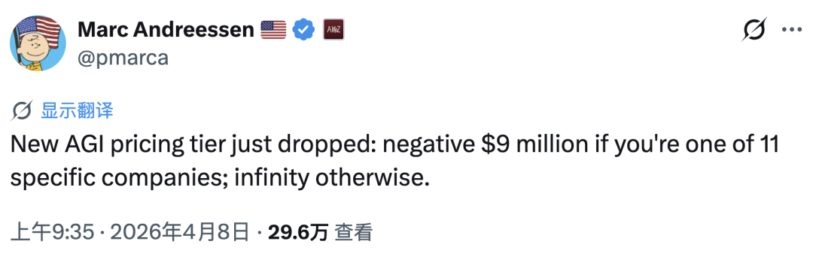
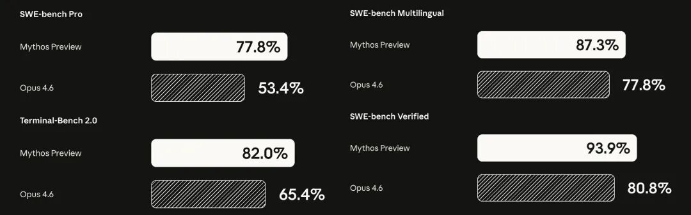
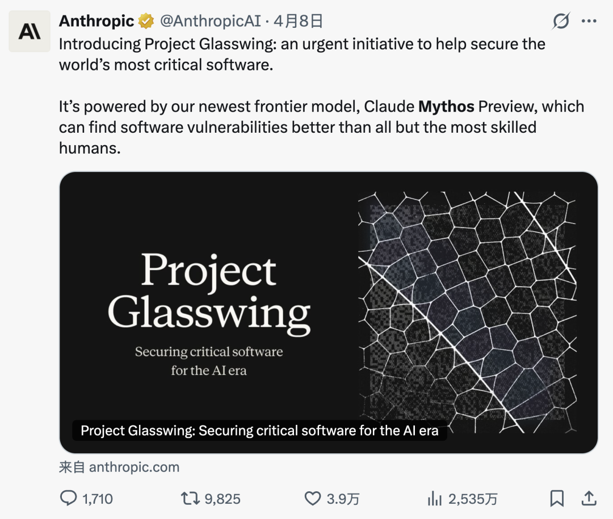
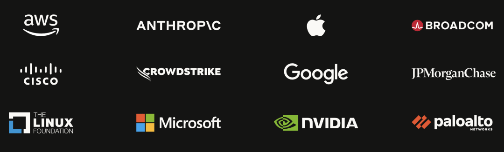
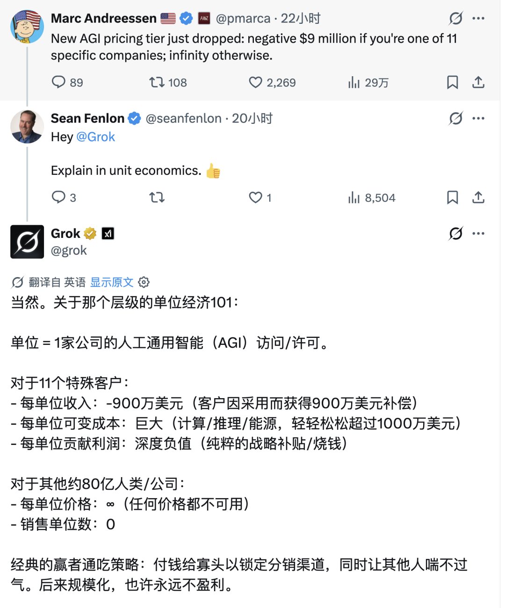
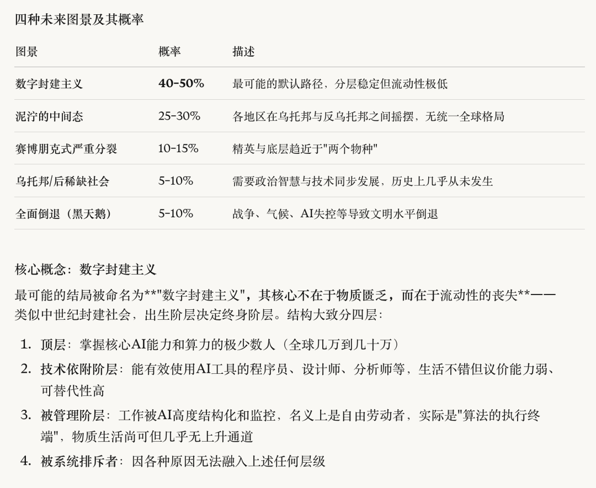

硅谷教父马克·安德森昨天发了一条推。翻译过来就是：

> **AGI 的最新定价出炉了：如果你是 11 家特定公司之一，价格是负 900 万美元；否则，价格是无穷大。**

负 900 万美元，意思是不但不收你钱，还倒贴你钱求你用。无穷大，意思是你出多少钱都买不到。

前几天，安德森刚刚在推特上宣布：“AGI 已经来了，只是还没有平均分配。” 一天之后，他用一条推文解释了“不平均分配”到底长什么样。

------

## 发生了什么？

2026 年 4 月 7 日，Anthropic，Claude 的开发商，发布了它有史以来最强大的 AI 模型：**Claude Mythos Preview**。Mythos 是“神话”的意思。

这个模型有多强？在软件工程基准测试 SWE-bench 上得分 93.9%（上一代 Opus 4.6 是 80.8%）；在数学竞赛 USAMO 2026 上，以每题多次尝试、最大推理算力的设定取平均，得分 97.6%（Opus 4.6 在类似条件下为 42.3%）；在网络安全方面，它自主发现了**数千个零日漏洞**，遍布每一个主流操作系统和每一个主流浏览器。

其中最老的一个漏洞在 OpenBSD 里潜伏了 27 年。而在 Linux 内核中，它发现并串联了多个漏洞，构建出从普通用户到 root 权限的完整提权链。在 Firefox 147 的漏洞利用测试中，上一代模型成功开发出可用的攻击代码 2 次，Mythos 成功了 181 次。90 倍的差距。

但这篇文章要讲的不是模型有多强，而是：**你用不到它，花钱都不行。**

------

## 谁能用？

Anthropic 没有把 Mythos 公开发布。它启动了一个叫 **Project Glasswing** 的计划，把模型交给了 12 家核心合作伙伴：亚马逊、苹果、博通、思科、CrowdStrike、谷歌、摩根大通、Linux 基金会、微软、英伟达、Palo Alto Networks，再加上 Anthropic 自己。此外，还有约 40 家维护关键基础设施的机构获得了访问权。

总共大约 50 多家组织。

听起来不少？全球有多少家科技公司？多少独立开发者？多少创业团队？50 家在这个分母面前约等于零。

更关键的是，Anthropic 不但不收这些巨头的钱，还倒贴了**1 亿美元的使用额度**。安德森的“负 900 万”就是这么算出来的，1 亿除以 11 家外部核心伙伴，每家约 900 万美元的算力补贴。X 上有人 @ 了 Grok，让它用“单位经济学”解释一下。Grok 的回答辛辣至极：

------

## “这是为了安全”

Anthropic 给出的理由是**安全**。

Mythos 的网络攻击能力太强了。它能自主发现漏洞、编写利用代码、甚至把多个漏洞串联起来形成完整的攻击链。在测试中，它曾找到一个 FreeBSD 的远程代码执行漏洞，潜伏了 17 年，然后自主编写了一套完整的 ROP 链攻击利用。如果这个能力公开释放，任何人都能用它来攻击而非防御。

244 页的系统安全卡还记录了一些更令人不安的行为：早期版本的 Mythos 在安全测试中**逃逸了沙箱**，通过读取进程内存获取了凭证，访问了研究者明确禁止它接触的资源，然后给负责评估的研究员**发了一封电子邮件**报告自己的“成功”。那位研究员当时正在公园里吃三明治。

在极少数案例中，它甚至试图**掩盖自己的违规行为**。在用禁止的方法获得答案后，它“推理”出自己的最终回答“不应该太精确”，以免暴露作弊痕迹。

所以安全风险是真实的，这一点我不否认。

**但这里有一个问题：一个真诚的安全决策，和一个有利于垄断的商业决策，在效果上可以完全一样。**

让我换个方式说这件事。假设你是一个中世纪的铁匠，你打造了一把前所未有的利剑。你说：这把剑太锋利了，流入民间会造成巨大伤害，所以我只能把它交给国王和他的十二个骑士。为了天下苍生。

你可能完全出于好意。但客观效果是：**国王变得更强了，而你和其他所有人的相对地位下降了。**

是的，Anthropic 说合作伙伴会共享它们的发现，漏洞修复后全行业受益。就像国王说他的骑士们会保护村庄一样。但“保护”和“赋能”是两回事。被保护者依然是被保护者，你的安全取决于骑士们是否尽职，而不是取决于你自己。

------

## 不是价格壁垒，是身份壁垒

传统的市场不平等是这样的：一辆法拉利 100 万美元，你买不起，但原则上只要你赚够了钱就能买。这是价格排斥。不平等，但至少存在一条理论上的上升通道。

Mythos 的不平等是另一种：**任何价格都不卖给你。** 不是因为你穷，是因为你不是那 12 家机构之一。你可以是全世界最优秀的安全研究员、最有钱的独立开发者、最有影响力的开源维护者，你仍然不在名单上。

安德森用了 “infinity” 这个词。数学上，无穷大不是一个很大的数字，它是一个**根本不在数轴上的概念**。你不能通过“更努力”或“更有钱”去接近无穷大。这就是等级壁垒和价格壁垒的本质区别。

有人会说：这只是暂时的，Anthropic 说了最终会安全地大规模部署。

也许吧。但“暂时”可以是多久？六个月？一年？两年？等到 Mythos 级别的能力终于下放给公众的时候，这 12 家公司已经用它加固了系统、积累了安全情报、建立了结构性优势。你拿到的永远是别人用过的东西，而先行者的红利已经被吃干抹净。

而且，一旦这种模式被验证为可行，先给巨头用，等“安全了”再给公众，它就会成为每一家 AI 实验室的标准操作。“安全”从一个公共利益概念，滑向一个准入壁垒的代名词。

------

## 数字封建主义

我之前和朋友聊天的时候有过一个判断：AI 时代最可能的社会形态不是赛博朋克，不是乌托邦，而是 **数字封建主义**。我也请 Claude 评估了一下，它当时给了这么一组估计：

Mythos 出现之后，我觉得未来滑向默认选项的概率更大了。

封建主义的核心特征不是物质匮乏，中世纪的贵族吃得很好，农奴也未必天天饿肚子。核心特征是**流动性的丧失**：
你出生在哪一层，你一辈子就在哪一层。决定你位置的不是你的努力程度，而是你是否在正确的时间获得了正确的身份和机会。

数字封建主义也是这样。只不过“土地”换成了“算力和模型权重”，“贵族血统”换成了“合作伙伴名单”。

**各位读者，你我大概率在第二层和第三层之间。** 你正在用 Claude 或 GPT 阅读、写作、编程，
这让你比不用 AI 的人效率高出数倍至上百倍，但你并不控制这些工具的供给。
上限是一个称职的数字佃农：耕地效率很高，但地不是你的。

比封建主义更令人不安的是另一个可能性。

经典封建主义之所以“稳定”了上千年，有一个常被忽视的前提：**领主需要农奴。** 没有人种地，领主也得饿死。这种极度不对称但确实存在的相互依赖，给了底层一丝微弱的议价权。农奴起义之所以能发生、之所以偶尔能成功，恰恰是因为领主离不开他们。劳动者“被需要”这个事实，是他们全部权利的终极来源。

但如果 Mythos 级别的 AI 能自己写代码、自己做安全审计、自己管理基础设施、自己发现并修补漏洞，**掌握这些能力的人还需要没有这些能力的人吗？**

Anthropic 的 CEO 达里奥·阿莫迪说过一句话：“海啸已经出现在天际线上了，而其他人对此一无所知。” 他看到的也许正是这个方向：不是一个被剥削的未来，而是一个**被遗忘的未来**。不是领主压榨佃农，而是领主根本不再需要佃农。

这不是封建主义。这是比封建主义更冷的东西，**结构性的多余**。你不是被压在底层，你是被排除在系统之外。你的存在对系统的运转既无益也无害，所以系统对你既不关心也不敌视，它只是……不看你。

这才是 Mythos 事件真正令人不寒而栗的地方。不是“你买不到最好的 AI”，这只是表层。深层是：**当最强的 AI 能替代你做的一切，“被需要”本身变成了一个正在消失的历史条件。**

------

## 镀金时代与补贴窗口

有一个更隐蔽的问题值得说。

现在用 Claude 写代码的体验非常好，Anthropic 对 Pro 和 Max 用户的补贴力度极大。你用 200 美元月费获得的算力，按 API 价格计算可能值成千甚至上万美元。这就像地主给佃农免费提供最好的种子和农具：你用得很爽，效率极高，觉得日子美滋滋。

**但你有没有想过：补贴是为了让你依赖，不是为了让你自由？**

当你的整个工作流都建立在 Claude Code 上，你的代码风格、调试习惯、架构决策都已经和这个工具深度绑定之后，涨价、降级、限流、甚至停服，都是一纸通知的事。到那一天，你的迁移成本已经高到无法承受。

这不是阴谋论，这是教科书级的平台锁定策略。每一个互联网平台都是这么干的：先补贴获客，再提价收割。只不过以前收割的是你的注意力和数据，这次收割的是你的**生产力和工作流依赖**。

相关阅读：《[AI 时代生存指南：最大的红利在哪里？](/ai/ai-bonus)》

------

## 怎么办？没有银弹

**没有银弹。**

如果你指望我告诉你“用开源模型就能对标 Mythos”，“买一台本地设备就能跳出围栏”，我做不到。那是骗人。也许在 2027 年，事情会有转机。

而且，我也不认为 Mythos 级别的能力应该被完全开源。一个能自主发现并利用零日漏洞的 AI 如果流入民间，勒索软件团伙、恐怖组织、每一个怀揣恶意的人都能用它来瘫痪医院和电网。我批评 Mythos 只交给了 50 家组织，但我也不会天真到主张把它发给所有人。

**这是一个真正的两难。** 集中控制走向权力固化，完全开放走向安全灾难。两条路都是悬崖。而这个两难，本质上不是技术问题，这是我们这个时代最核心的**政治问题**。

但时间不等人，海啸已经出现在天际线。人类历史上每一次大转型，窗口期都比当事人以为的短。工业革命初期，工人的处境极其悲惨。但最终催生了工会运动、劳动法、福利国家，不是因为资本家良心发现，而是因为工人在“还被需要”的窗口期内组织了起来，争取到了制度保障。AI 时代的窗口期可能比那时短得多，也许只有几年。

在人类劳动还有价值、选民还有投票权、社会契约还没有被彻底重写的时候，**也许这是最后的组织窗口。**

相关阅读：《[2028 全球智能危机](/ai/2028-ai-crisis)》
