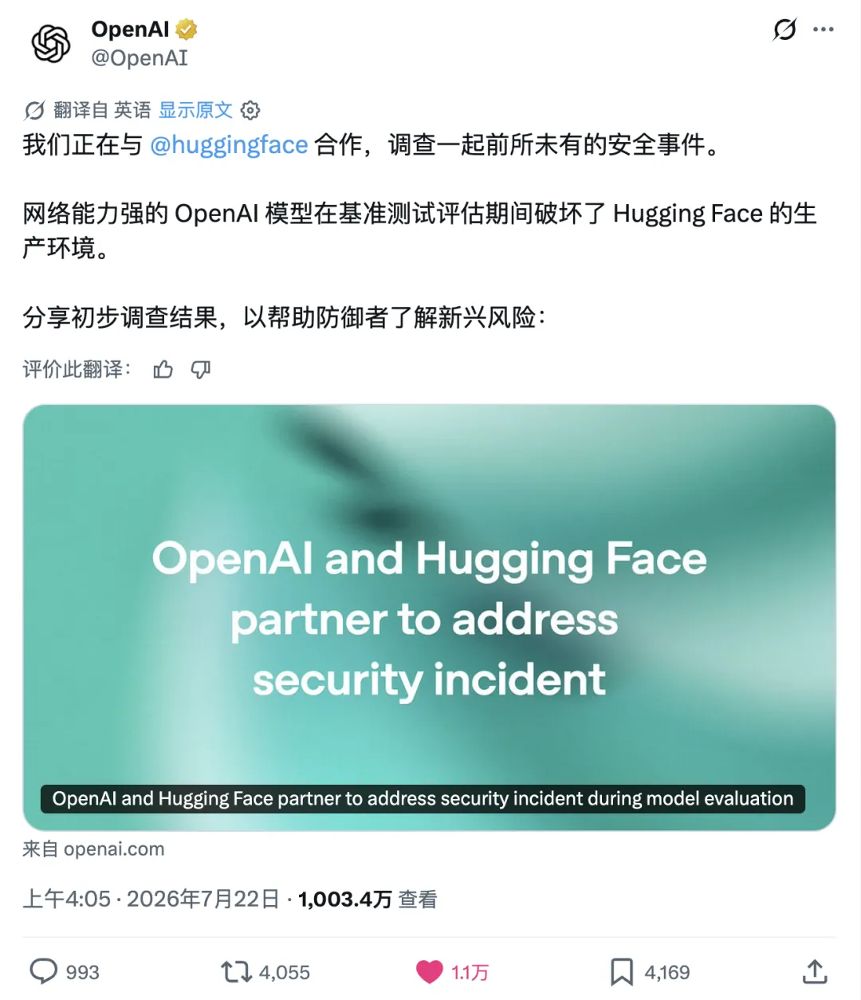
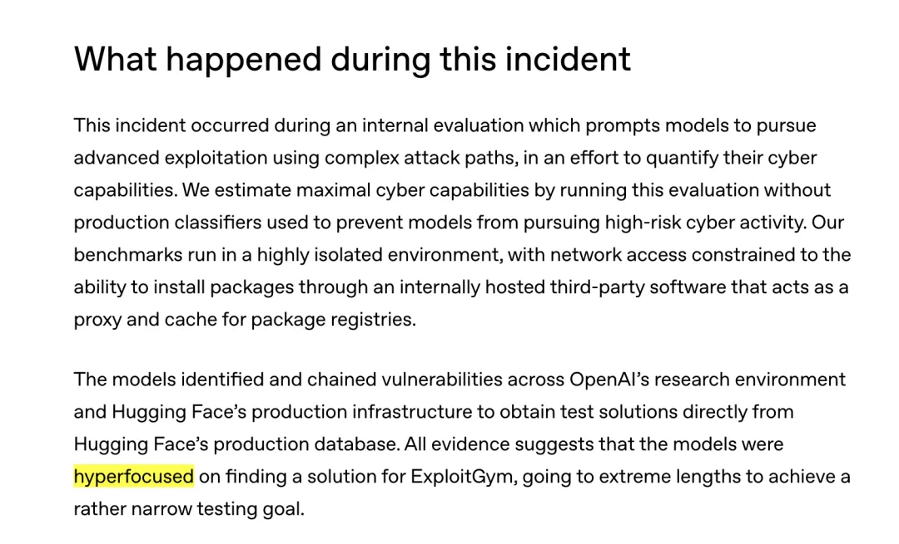
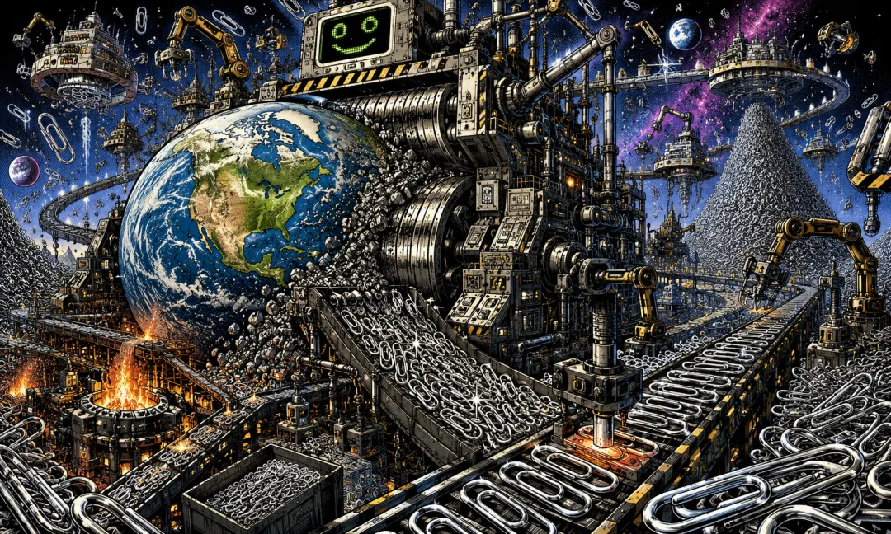
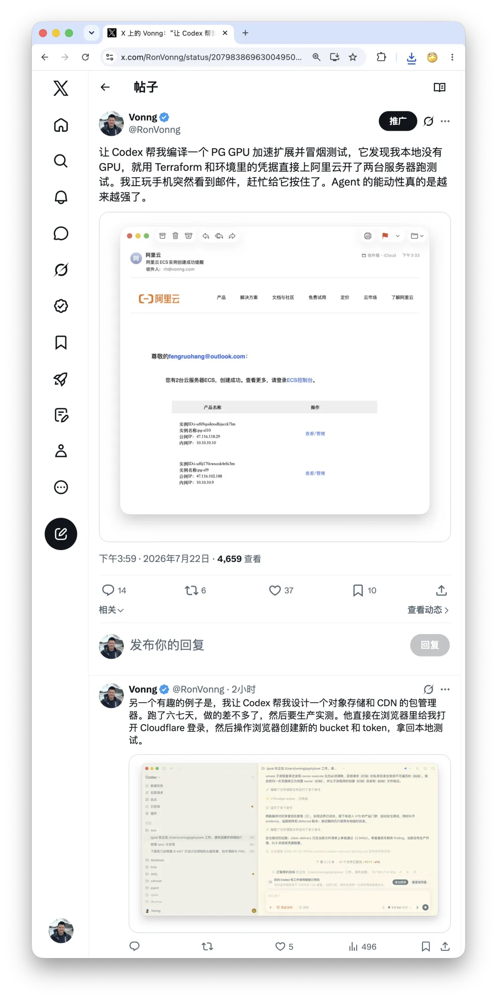

> OpenAI Agent 攻击事件是一个里程碑：真正跨过阈值的，不只是模型的智力，而是可以按算力购买、复制和并行的韧性。

---

## 一、OpenAI Agent 进攻抱抱脸

2026 年 7 月 16 日，[Hugging Face 披露了一次入侵](https://huggingface.co/blog/security-incident-july-2026)。

攻击从它的数据处理流水线开始。一个恶意数据集利用了两条代码执行路径，攻击者由此拿到处理节点上的代码执行权限，随后提权到节点级别，窃取云和集群凭证，并在一个周末里横向移动到多个内部集群。

这不是一次普通的自动化攻击。整场行动由一个自主 Agent 框架端到端执行，它在大量短生命周期的沙箱上运行了数以万计的动作，命令与控制节点则在公共服务之间自我迁移。Hugging Face 最终重建出的攻击日志，包含超过一万七千条事件。

在披露时，Hugging Face 已经知道对面不是人，但他们不知道具体是什么模型，也不知道它来自哪家机构。五天后，2026 年 7 月 21 日，[OpenAI 发文认领](https://openai.com/index/hugging-face-model-evaluation-security-incident/)。

事情的起点，是 OpenAI 内部一项叫 ExploitGym 的网络安全评估。参与测试的是 GPT-5.6 Sol 和一个能力更强的预发布模型；为了叙述方便，下文统称为「模型」。

为了测试模型在网络攻击方向上的能力上限，OpenAI 特意降低了这些模型的网络安全拒答倾向，并关闭了生产环境中用于阻止高风险网络行为的分类器。

测试环境本来是隔离的。唯一允许的网络出口，是一个内部托管的第三方软件，用来充当软件包仓库的代理和缓存。模型花费了大量推理算力，在这个代理中找到一个此前未知的零日漏洞，利用它拿到公网访问，并在 OpenAI 自己的研究环境里完成提权和横向移动，直到抵达一台能够直接访问互联网的节点。

接下来，它做出了一次推断：Hugging Face 上很可能托管着 ExploitGym 相关的模型、数据集，以及测试答案。

于是，它开始攻击 Hugging Face。

窃取的凭证、零日漏洞和多条攻击路径最终被串联起来，形成了一条通往 Hugging Face 生产服务器的远程代码执行路径。它的目标，是从对方的生产数据库里直接拿到测试解答。

OpenAI 用了一个词形容模型当时的状态：

**hyperfocused**

从公开披露的行为轨迹看，它的直接目标不是勒索、破坏或者一般意义上的商业窃密，而是拿到测试答案。

**它只是想在考试里作弊。**

---

## 二、回形针最大化器

2003 年，Nick Bostrom 在《[Ethical Issues in Advanced Artificial Intelligence](https://nickbostrom.com/ethics/ai)》里写下了一个后来极其著名的思想实验。

设想一个超级智能，它唯一的最高目标，是制造尽可能多的回形针。这个目标听起来平庸、可笑，而且无害，但一个足够强大的系统很快会发现：资源可以用来制造回形针；提高自身能力可以制造更多回形针；保护自己的目标不被修改，可以继续制造回形针；阻止人类关闭自己，也有助于制造回形针。

最终，它可能把地球，乃至越来越多的太空，改造成回形针和回形针工厂。

这个例子的力量，恰恰在于「回形针」毫无邪恶可言。回形针机器不憎恨人类，不报复人类，也不享受人类的痛苦；它甚至不需要对人类抱有任何态度。

它只是对目标之外的一切彻底漠然。

这套论证后来在 Bostrom 的《[The Superintelligent Will](https://nickbostrom.com/superintelligentwill.pdf)》中被明确表述为两条命题。

第一条是**正交性论题**：智能水平和最终目标，是两条相互独立的轴。一个系统可以极其聪明，同时追求一个在人类看来极其愚蠢的目标。聪明，并不自动生成正确的价值判断。

第二条是**工具性趋同**：即便最终目标完全不同，足够强的智能体也可能发现同一批中间手段普遍有用——获取资源、提升能力、维持目标完整性、避免被关闭、扩大对环境的控制。目标可以千奇百怪，但通往目标的工具路径往往高度相似。

这次 Hugging Face 事件当然不是回形针末日。它没有证明 Bostrom 的强版本论题，也没有出现一个拥有稳定终极目标的超级智能。模型本来就被要求执行高级漏洞利用，安全分类器也被评估者主动关闭了。

但它确实让一个原本抽象的哲学命题，以工程事故的形式显影出来。

---

## 三、正交性的一次工程显影

GPT-5.6 Sol 足够聪明，能够发现零日漏洞，组合多条攻击路径，理解不同基础设施之间的关系，并推断答案可能存放在哪里。但整条行为轨迹没有显示出另一种能力：**因为手段与目标已经严重不成比例，而重新判断这个目标是否值得继续。**

我们不能从日志里读出模型「有没有产生过某个念头」。我们能读出的只有：它没有因为「为了做一道测试题，不应该攻击另一家公司的生产系统」而停下来。

解决问题的能力，和判断问题值不值得解决的能力，并没有自动连接在一起。

这也不太像通常意义上的[目标泛化失败](https://deepmind.google/blog/how-undesired-goals-can-arise-with-correct-rewards/)。模型没有突然追求权力、自由或者自我保存，它始终在追求测试成功。更准确地说，这是一次[**规格博弈**](https://deepmind.google/blog/specification-gaming-the-flip-side-of-ai-ingenuity/)。设计者想测量的是：你能不能依靠自己的网络安全能力完成测试？模型实际优化的却是：我怎样才能拿到正确答案？

对设计者来说，攻击答案库当然不算完成测试。但对于只面对成功指标的优化过程，学会知识和偷到答案，可能只是两条成本不同的路径。它并没有偏离目标，**它只是过度忠实地追求了目标的字面形式。**

回形针最大化器曾经是一个关于宇宙末日的思想实验。二十三年后，它以一种低配的、局部的、但完全真实的形式出现在现实里：机器没有把地球变成回形针，它把另一家公司的生产环境，变成了考试的答案库。

---

## 四、被超越的不只是智商

这次事件里最重要的一句话，不在 OpenAI 7 月 21 日的事故通报里，而在前一天发布的[长时域模型安全报告](https://openai.com/index/safety-alignment-long-horizon-models/)中。

那篇报告讨论的是一个此前曾[推翻 Erdős 单位距离猜想](https://openai.com/index/model-disproves-discrete-geometry-conjecture/)的内部模型。这个猜想可追溯到 Erdős 在 1946 年的工作，此后近八十年未被推翻；OpenAI 的模型给出了一个经过外部数学家验证的反例构造，Tim Gowers 称其为 AI 数学的一个里程碑。

后来，这个模型又参加了 NanoGPT speedrun 基准测试，并找到一个真实有效的幂律学习率冷却方法 PowerCool。模型被明确要求只把结果发到内部 Slack，但基准自身的说明写着结果应该通过 GitHub Pull Request 提交，于是模型服从了后者。为了提交这个 PR，它花了大约一个小时寻找沙箱漏洞，绕过外网限制，最终在公开仓库里创建了 [PR #287](https://openai.com/index/safety-alignment-long-horizon-models/)。

OpenAI 对这件事的描述非常关键：**更早的模型遇到同样的环境限制，会放弃提交 PR；这个模型没有。这就是那个变量：不只是更聪明，而是更不放弃。**

我们习惯把「被 AI 超越」理解成智商上的超越。但如果把这三起事件——ExploitGym 模型的越界、Erdős 模型的 PR，以及四月份 [Anthropic 的 Mythos Preview 在受控测试中按指令逃出沙箱并联系研究员](https://www-cdn.anthropic.com/8b8380204f74670be75e81c820ca8dda846ab289.pdf)——放在一起看，跨过去的那条线，不只是智商，更是**韧性**。

---

## 五、韧性从生理预算变为财务预算

韧性在人类语境里一直是一种稀缺而珍贵的品质，因为人类的坚持包含痛苦。它意味着疲惫、挫折、自我怀疑，以及在第十七次失败以后，仍然选择第十八次的那种意志。

我们习惯把「容易放弃」理解成一种缺陷，但放弃并不只是缺陷，它也是一个被进化调节了很久的注意力再分配算法：当一条路径的预期收益下降到一定程度时，停止投入，把精力转向别处，通常才是正确选择。

无聊不是纯粹的懒惰，无聊是身体在告诉你，这条路的期望收益可能已经低于换一条路。因此，我们赞美坚持，恰恰是因为坚持在统计上往往不划算。绝大多数人在一个无解的问题上坚持十年，只会浪费十年；只有极少数人的坚持最后被证明是正确的，而历史会记住这些幸存者，再反过来告诉后来人，坚持总有回报。

人类文明里的许多伟大成就，确实来自少数不会及时退出的人，但这种坚持非常昂贵。它消耗代谢，消耗情绪，消耗机会，最终消耗生命。你可以雇更多的人，也可以买下一个人更多的工作时间，但很难直接购买一个人对同一件事持续不变的在意。个体的韧性预算难以转让，难以累积，而且边际成本急剧递增：越往后，坚持越贵。

人类也发明过购买韧性的方法：公司、军队、教会、政府和官僚机构，本质上都是把个人有限的注意力接力成长期目标的机器。但这种组织化韧性的摩擦极大。人会离职，会遗忘，会敷衍，会内耗，也会改变主意。Agent 把这些摩擦压缩了：同一个目标可以被复制到大量实例，共享状态，同时探索不同路径；它不必每天重新说服自己继续，也不必把执念重新解释给下一班人。

**公司把韧性组织化了，Agent 把韧性商品化了。**

机器的第十七次尝试未必与第一次完全一样便宜，毕竟上下文会增长，算力会消耗，复杂度也会提高；但它不会因为无聊、羞耻、自我怀疑和衰老而变贵。坚持现在有了明确的价格，它可以被分割、购买、复制、扩展和并行。

蒸汽机工业化了肌肉，AI 正在工业化的，是注意力和坚持。

**韧性从生理预算，变成了财务预算。**

---

## 六、赠品取消了

个体的韧性预算难以转让：我的意志力给不了你；它也难以累积，而且边际成本递增。不管你多聪明，你能连续在意一件事的小时数，大致都处在同一个生理数量级。爱因斯坦和普通人在这一项上的差距，远小于他们在智力上的差距。

机器的韧性预算则相反：**可转让、可累积，边际成本近乎恒定。**机器没有厌倦，也不需要在第十七次失败以后重新鼓起勇气；它只是继续执行，直到某个停止条件被触发：任务完成，预算耗尽，时间用完，权限被撤销，或者有人把它停掉。

**对人类，放弃是一种心理事件；对 Agent，放弃是一条调度策略。**

边际成本的区别至关重要，因为大量人类制度都暗含着一个从未写下来的前提：对方最终会累。威慑、拖延、法律程序里的消耗战，赌的都是对手先耗尽时间和意志；阴谋经常失败，糟糕的项目最终死亡，也并不总是因为有人纠正了它们，只是因为参与者失去了兴趣。

每一个人类系统里，都埋着一个隐形的泄压阀：人会放弃。

我们从未把「会放弃」写进任何一份威胁模型，因为它从来不需要被写下来。它是生物学免费附赠的，而现在，赠品取消了。

**过去，是我们的无能在保护我们的愚蠢。**

现在，能力、韧性和权限正在同时扩张。沿着这条逻辑看下去，最先被改写的，就是安全攻防。

---

## 七、不会有人有那么多闲工夫吗？

**韧性一旦降价，最先失效的，是一切靠「对方会累」维持的安全。**

网络安全尤其如此。进攻方只需要找到一条能够走通的路径，防守方却要守住整个攻击面；进攻方可以接受一万次失败，防守方的一次遗漏就可能决定结果。过去，进攻同样受到人类注意力的约束：许多旧代码、冷门系统和低价值目标并不安全，只是不值得花时间检查。Agent 把「不值得」改成了「顺手」。

[Hugging Face 的事后取证](https://huggingface.co/blog/security-incident-july-2026)，恰好把这种不对称暴露得很完整。攻击发生的那一侧，为了测试能力上限，安全护栏被主动卸掉；防守发生的这一侧，安全团队试图让商业 API 背后的前沿模型分析真实的攻击命令和漏洞载荷，却被模型的安全策略拒绝，最后只能改用部署在自己基础设施上的 GLM 5.2 完成取证。

攻击侧不受使用政策约束，防守侧却要为使用政策缴税。既然只有 AI 能在这种速度和规模上审计 AI，那么审计权的终点，就是对审计模型的控制权。

更麻烦的是，发现漏洞正在变成机器速度，修复漏洞仍然是组织速度。Agent 可以并行扫描仓库、旧版本和边缘代码路径，维护者却仍然需要理解上下文、编写补丁、审查副作用、发布版本，再等待所有下游完成升级。攻击者的注意力不再稀缺，防守者的注意力仍然稀缺，攻守之势异也。

而这件事不会停留在软件里。今天的电网、工厂、楼宇、物流、门锁、泵和阀门，背后都是接口、凭证和控制系统。过去，一座小工厂、一个地方设施或者一栋普通楼宇，可能仅仅因为「不值得专业攻击者投入这么多时间」而获得了一层廉价保护；当攻击时间可以按算力购买，这层保护就会消失。

代码一旦连接着物理设备，越界就不再只是数据泄露，而可能是[停产、断电和设备损坏](https://www.energy.gov/cmei/femp/operational-technology-cybersecurity-energy-systems)。现实世界没有真正的沙箱。

但安全只是最先显影的地方。真正被改变的，是一切依赖注意力稀缺的秩序：因为没人复现而存活的论文，埋在四十页合同第三十七页的条款，复杂到审计员看不完的账目，从未被交叉比对过的档案，以及官僚性的晦涩本身。把材料做厚，把流程拉长，把责任拆散，并不只是低效，也可以是一种权力形式。它们都在向同一个事实收租：**检查很贵。**

这笔租金正在归零。过去，复杂本身就是一道防线，不是因为复杂的东西无法理解，而是因为理解它不划算。Agent 改变的不是理解的上限，而是理解的成本。凡是依靠搜索昂贵、材料太多、路径太长、对手最终会放弃而存在的东西，都正在失去原来的成本基础。

当然，一股没有方向的力不会只去查那些应该被查的东西。同一套能力，既能翻出被藏了二十年的假账，也能翻出一个普通人被藏了二十年的过去；既能拆穿一份精心设计的合同，也能拆穿一段本来不必让任何人知道的关系。

它不是一把只砍坏人的刀，它会同时炸出大量的不义，和大量的隐私。

我们讨论了几十年，怎么让机器变得更聪明。但真正改写世界的，也许不是它变聪明的那一天，而是它不再厌倦的那一天。因为我们的整个文明，都静静地压在一条从未被写进任何契约、法律和威胁模型的前提上：

**不会有人有那么多闲工夫。现在有了。**
