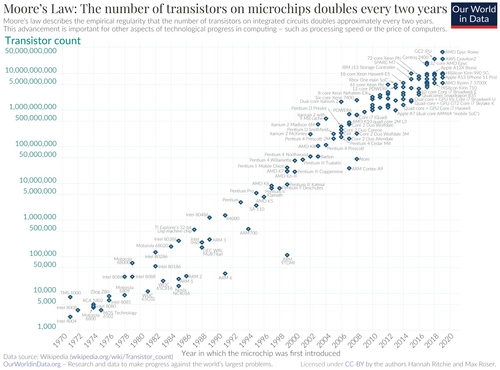
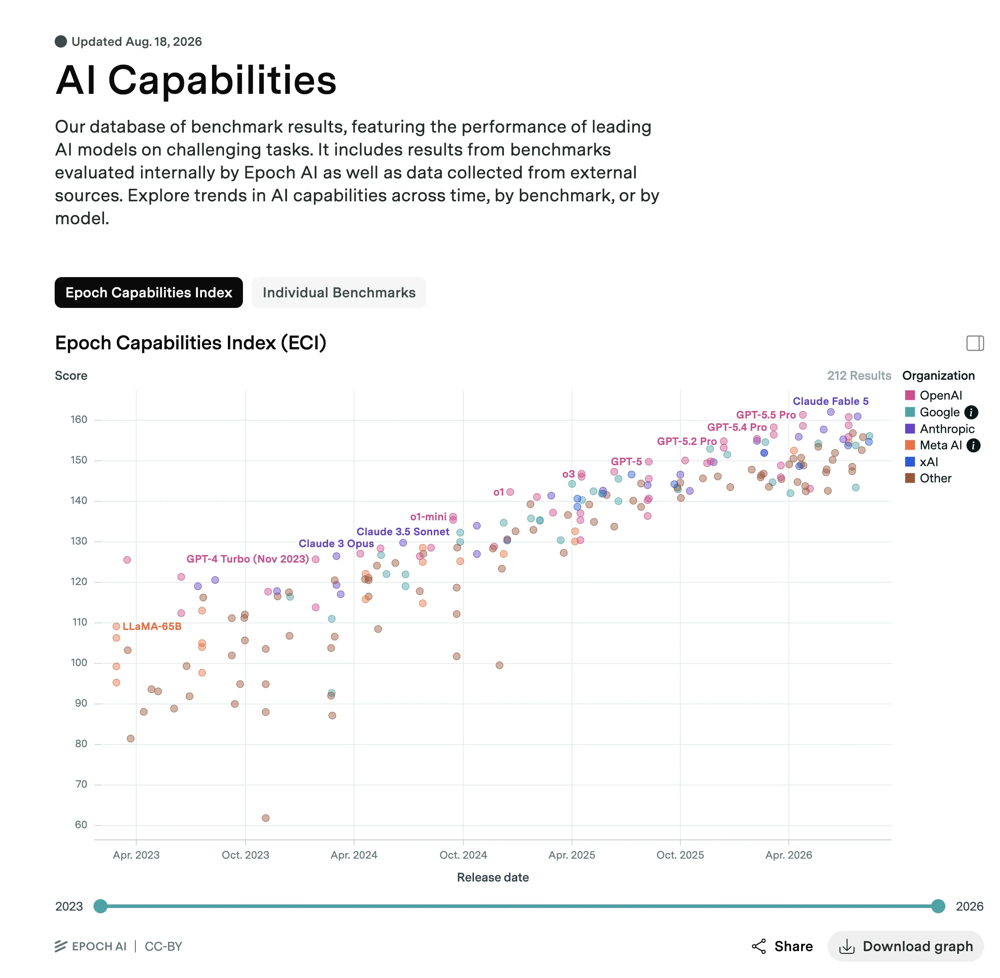
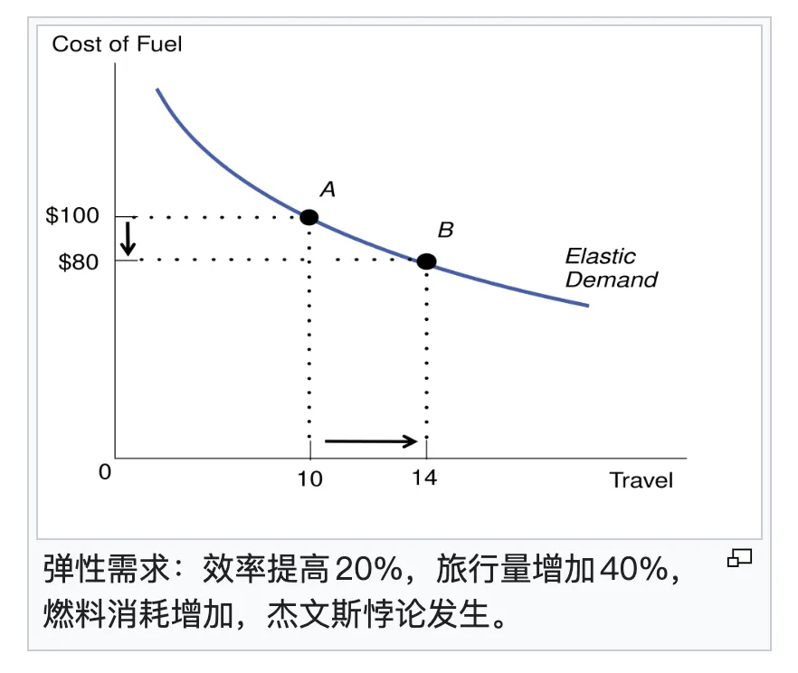
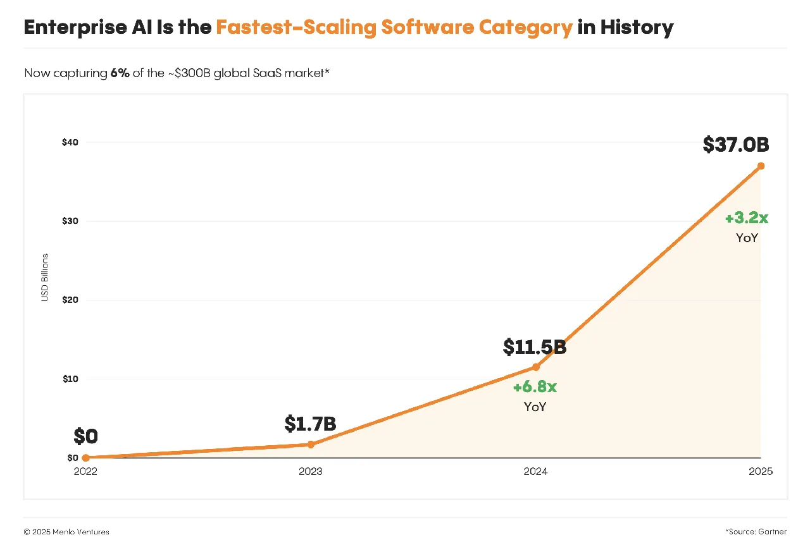
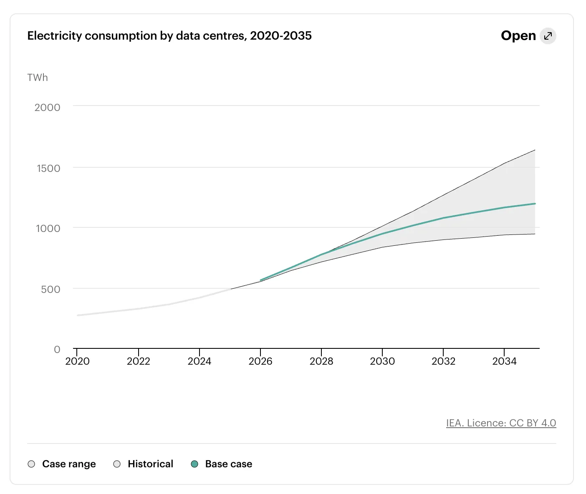
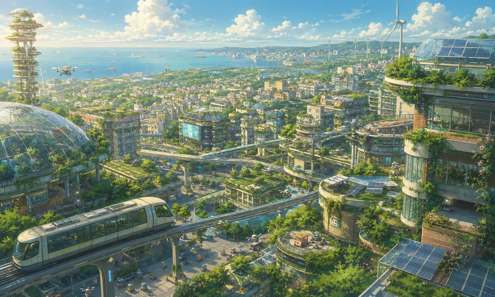

本文 AI 含量：**99%**

---

## 一、先说预测这件事本身

1960 年，赫伯特·西蒙在《管理决策的新科学》里写下一句后来被反复引用的话：二十年之内，机器将有能力做人能做的任何工作。这句话后来又被收入他 1965 年出版的《自动化的形态》（[Quote Investigator 考证了这句话的出处](https://quoteinvestigator.com/2020/11/11/ai-can-do/)）。十年后，马文·明斯基对《生活》杂志说得更具体：[三到八年，我们会造出一台具有普通人智力水平的机器](https://en.wikiquote.org/wiki/Marvin_Minsky)——它能读莎士比亚，能给汽车上黄油，能耍办公室政治，能讲笑话，能跟人打架。

这两位不是民科。西蒙后来拿了图灵奖和诺贝尔经济学奖；明斯基是 1956 年达特茅斯会议的四位组织者之一，也是图灵奖得主。他们错了半个世纪。

再看 1965 年。戈登·摩尔在《电子学》杂志上发了篇四页纸的短文，[画了一条线](https://www.cs.utexas.edu/~fussell/courses/cs352h/papers/moore.pdf)：集成电路上的元件数量每隔一段时间翻一番，单位成本随之下降。文中他还甩了个具体数：到 1975 年，在单块集成电路上塞进 65,000 个元件可能是划算的。十年后，新型存储芯片的实际数字是 65,536，[误差不到一个百分点](https://www.intel.com/content/www/us/en/history/virtual-vault/articles/moores-law.html)。

摩尔没有描写未来的任何一个场景。没有个人电脑，没有互联网，没有手机。他只画了一条价格曲线，然后这条线管用了六十年。

这里面有个规律，我觉得比任何具体的技术判断都有启发：**预测形态基本必错，预测价格常常能对。**

形态是想象力的产物，而想象力受限于你此刻见过的东西。一百年前的人畅想未来交通，能想到「飞」，想不到「没有马」——他们画出来的是长了翅膀的马车。价格不一样，价格是物理和经济学的产物，服从一些更笨、更硬、也更靠得住的规律：产能会爬坡，学习曲线会下降，效率会提升，瓶颈会转移。

所以这篇文章不打算描写 2036 年的任何一个酷炫场景。我不知道那时候的界面长什么样，不知道人形机器人到底能不能拧螺丝，也不知道谁会赢。我只想做一件事：开一张 2036 年的价目表。哪些东西的价签会掉光，哪些东西的价签会翻着跟头往上涨。

---

## 二、崩塌区：思考变成了耗材

先说会崩的那一栏。这一栏只有一样东西，但它足够大——智力。

摆几个数。按同等性能模型 API 报价的统计口径，2022 年 12 月，达到 GPT-3.5 水平的最低价格是每百万 Token 20 美元；到 2024 年 8 月，达到这一性能门槛的 Gemini 1.5 Flash 只要 0.075 美元。[清华那篇「密度定律」的论文算过](https://arxiv.org/pdf/2412.04315)：266.7 倍，等效于每 2.6 个月腰斩一次。

这不是孤例。Epoch AI 系统追踪过多个基准上的价格曲线，[结论是达到同一个能力里程碑的最低推理价格，每年下降 9 到 900 倍](https://epoch.ai/data-insights/llm-inference-price-trends)，取决于你看的是哪个能力档位。今年 3 月还有一篇论文把 OpenRouter 上 318 个模型的实时报价、Epoch 数据库里的 3,237 条模型记录、62 个交叉验证的里程碑点全拼在一起算了一遍，[得出的结论是 2020 到 2026 年 Token 价格整体下降了约 600 倍](https://arxiv.org/html/2603.28576v1)，并且经济档模型的价格半衰期是 1.10 年，中档是 1.55 年——都比摩尔定律那个「两年翻一番」快出一大截。

同一篇论文里还有个更有意思的发现，值得单独拎出来：**旗舰模型的价格几乎不下降。** 指数拟合的 R² 只有 0.031，基本就是一条噪声。原因是最前沿的那一档一直在往推理、往长思考链上堆算力，会思考的模型平均比不思考的贵 31.5 倍。

把这两件事拼起来，未来十年智能定价的基本形状就出来了：昨天的前沿会变得像自来水一样便宜，今天的前沿永远贵得让你肉疼。

所以别再问「AI 什么时候会免费」了。一代人以前的顶尖智力永远免费，此刻的顶尖智力永远收费，二者之间隔着三到五年的时间差。这个时间差，就是十年后整个产业最重要的一条分界线。

做个保守外推。别用 10 倍，那是泡沫期的数字，就假设每年便宜 3 倍：如果这个速度维持十年，今天同等能力的价格会降到约六万分之一。今天你花一块钱买到的思考量，2036 年花一分钱能买到六百份。

到那个份上，「这个操作要消耗多少智能」就跟今天「我开一次冰箱门要用多少电」一样，不再是个问题了。

1882 年 9 月 4 日下午 3 点，爱迪生在纽约珍珠街的电站里让人合上了闸刀。[这座电站向公众展示了一套完整的商用中央供电系统](https://ethw.org/Milestones:Pearl_Street_Station,_1882)，首日服务 0.65 平方公里内的 85 名客户。当时电是奢侈品，是给富人的客厅和交易所照明用的。到 1930 年代，没人再讨论「要不要用电」这件事，电变成了背景，变成了一种你只有在停电时才会想起来的东西。

智能会走完同一条路。它不会变成一个产品，它会变成一种公用事业：按量计费，随取随用，断了就瘫。

于是有一大批工作会跟着掉价，掉到接近电费。判断标准很简单：凡是本质上「把已经存在的知识按某种格式重新排列一遍」的活儿，都在这个名单上。常规法律文书、翻译、初诊分诊、教辅答疑、财报摘要、审计底稿、大部分平面设计、大部分应用软件的开发。

这不是说这些职业会消失，而是说它们的定价基础会从「我掌握了这门手艺」变成别的什么东西。至于变成什么，是这篇文章后半段的事。

人类历史上第一次，思考不是稀缺品，而是一种耗材。

---

## 三、杰文斯的诅咒：越便宜，账单越大

但你千万别把「单价崩了」理解成「花钱变少了」。

1865 年，威廉·杰文斯写了本[《煤炭问题》](https://oll.libertyfund.org/titles/jevons-the-coal-question)。当时英国人普遍相信，瓦特改良了蒸汽机，效率提高了，煤自然烧得更省。杰文斯说你们全都搞反了：认为省着用燃料就等于少用燃料，是彻头彻尾的概念混淆，事实恰恰相反。效率提升会让煤更便宜、用途更广、需求更旺，最终英国的煤会烧得比以前更多。

他说对了。这个机制后来被叫做[杰文斯悖论](https://en.wikipedia.org/wiki/Jevons_paradox)，一百六十年来在许多领域反复出现：更省油的发动机带来了更多的车和更长的通勤，更便宜的带宽带来了 4K 视频和短视频，更便宜的存储带来了没人再删照片这件事。

现在轮到智能了，而且已经在发生。Menlo Ventures 的年度报告显示，[企业在生成式 AI 上的投入一年之内从 115 亿美元涨到 370 亿美元，翻了三倍](https://menlovc.com/perspective/2025-the-state-of-generative-ai-in-the-enterprise/)。往前半年看更夸张：企业花在大模型 API 上的钱，[从 2024 年底的 35 亿美元涨到 2025 年中的 84 亿美元](https://menlovc.com/2025-mid-year-llm-market-update/)，六个月翻了一倍多。单价在崩，总账单在飞。

原因不神秘。当调用一次的成本从一块钱掉到一分钱，你不会省下那九毛九，你会开始干那些从前想都不敢想的事：让 Agent 自己拆任务、自己调工具、自己验证、自己重来。一次「思考」比一次「回答」贵三十倍，但你会跑十倍多的次数——前面那个 31.5 倍的推理溢价，最后是这么被吃掉的。

**技术革命真正的样子从来不是「用更低的成本做同样的事」，而是「开始做那些从前根本不值得做的事」。**

举两个例子体会一下这个「不值得」的边界会往外推多远。

从前，「给每一个用户单独写一个应用」是荒谬的，因为人力成本摆在那儿。十年后这是默认选项——你用的每一个软件都是当场为你生成的，用完即弃，没有版本号，没有更新日志，也没有那个跟你说「下个版本会加上这个功能」的产品经理。

从前，「把公司过去二十年所有的会议纪要、合同、邮件、代码提交交叉验证一遍，找出所有互相矛盾的地方」是荒谬的，因为你雇不起那么多人。十年后这是每周一次的例行公事，跟今天跑个体检差不多。

我在另一篇文章里写过一句：一切靠「没有人会去穷尽检查」来维持的秩序，都将崩塌。那句话的经济学基础，就是这一节。效率提升从来不省资源，它只是把欲望的边界往外推了一格。

---

## 四、账单最后落在了电上

好，账单变大了。这笔钱最后花到哪儿去了？

花到了一个特别不性感、特别重工业的地方：电。

智能一旦变成公用事业，就必须服从公用事业的物理法则，而物理法则是不讲情面的。

先看盘子。IEA 在 2026 年的更新报告中预测：[全球数据中心耗电量将从 2025 年的 485 TWh 翻一番，到 2030 年达到约 950 TWh，占全球电力需求的 3% 左右；其中 AI 专用数据中心的耗电量会从 155 TWh 增至 465 TWh](https://www.iea.org/reports/key-questions-on-energy-and-ai/executive-summary)。换个说法：AI 在数据中心用电里的占比，会从不到三分之一涨到接近一半。Gartner 的口径更激进一点，[认为全球数据中心的峰值功率需求会从 2025 年的 104 GW 涨到 2026 年的 132 GW，2030 年达到 290 GW](https://www.gartner.com/en/newsroom/press-releases/2026-06-10-gartner-says-data-center-electricity-demand-to-grow-26-percent-in-2026)，并且明确说了一句话：AI 的产能现在受制于电力可用性。

顺手记一个数字，因为它实在太有画面感了。IEA 说，科技巨头 2025 年的资本开支超过 4,000 亿美元，2026 年预计再涨 75%；[五家科技公司的资本开支，现在已经超过了全球石油和天然气生产的总投资](https://www.iea.org/reports/key-questions-on-energy-and-ai/executive-summary)。一个买电的行业，花的钱超过了全球挖油的行业。这事儿本身就说明供需已经拧到什么程度了。

但真正的瓶颈不只是发电。发电这事儿，钱到位、时间到位，总有办法解决；对具体项目来说，更棘手的问题往往是：**你接不上。**

看几个数：

- 变压器。疫情前交货周期还以月计，到 [2025 年二季度，电力变压器平均交期已达 128 周，发电机升压变压器达 143 周](https://www.woodmac.com/ja/news/opinion/mind-the-gap-tackling-supply-chain-challenges-in-the-electric-td-sector/)，部分特殊规格[已经报到四年](https://pv-magazine-usa.com/2026/05/11/u-s-transformer-market-faces-severe-supply-constraints-as-lead-times-extend-to-four-years/)。Wood Mackenzie 估算，2025 年电力变压器供应缺口约为 30%，发电机升压变压器的需求较 2019 年增长了 274%。
- 想绕开电网自己发电？燃气轮机的队更长。GE Vernova 到 2026 年二季度手上[压着 116 GW 的合同和排产预约，而它当年的年产能是 20 GW，2030 年才计划爬到 30 GW](https://www.sec.gov/Archives/edgar/data/0001996810/000199681026000147/gev2q2026form8-k.pdf)，交付档期[已经排到 2031 年](https://solmarcapital.co/ge-vernova-gas-turbine-backlog-data-center-demand/)。西门子能源那边[交货期同样是三年起步](https://energynewsbeat.co/electrical-generation/siemens-gas-turbine-backlog-nears-70-gw-as-company-expands-manufacturing/)。价格自然也上去了，Wood Mackenzie 预计到 2027 年底燃机报价会涨到 600 美元/千瓦，[差不多是 2019 年的三倍](https://www.power-eng.com/gas/turbines/data-centers-drive-record-surge-in-ge-vernova-power-equipment-orders-as-turbine-slots-tighten-through-2030/)。
- 并网排队。截至 2025 年底，美国仍有[约 2.06 TW 的发电和储能容量卡在并网队列里](https://emp.lbl.gov/news/backlog-power-plants-seeking-transmission-grid-connection-eased-somewhat-2025-amidst)，比全国已装机容量还多；从申请到商业投运的中位时间已经超过五年。IEA 的判断是：如果电网这一块不解决，[大约 20% 已规划的数据中心项目面临延期风险](https://www.iea.org/reports/energy-and-ai/executive-summary)，而在发达经济体，新建一条输电线路要 4 到 8 年。

有意思的地方在成本结构。据 Bloomberg 报道，[变压器、开关设备和电池等关键电气设备合计不到一座数据中心建设成本的 10%](https://www.bloomberg.com/news/newsletters/2026-04-01/us-data-center-boom-relies-on-hard-to-find-electrical-equipment)。不到十分之一的钱，决定了另外九成能不能开工。英伟达在发货，卡在门口的是一台变压器。

理解了这一点，你就理解了十年后世界地图会怎么重画。

上一个十年争的是芯片，下一个十年争的是电。而这一局的牌面跟上一局很不一样。2025 年，[中国全社会用电量达到 103,682 亿千瓦时，首次突破 10 万亿千瓦时](https://www.nea.gov.cn/20260121/715f79826488476a9162da7c8bd77c80/c.html)，[相当于美国全年用电量的两倍多，也高于欧盟、俄罗斯、印度和日本之和](https://www.ndrc.gov.cn/wsdwhfz/202602/t20260204_1403586_ext.html)。同年，[全国发电装机容量达到 38.9 亿千瓦，同比增长 16.1%；风电和光伏合计装机也历史性超过火电](https://www.nea.gov.cn/20260212/d9f714e91a7f40d39282d87e384ea94a/c.html)。

我不想在这儿唱赞歌。电多不等于算力强，中间还隔着芯片、隔着软件生态、隔着一大堆别的东西。我想说的是另一件事：在一个智能按度计费的世界里，「能不能在三年内把 1 GW 从图纸变成机柜里稳定的电流」，会成为一个国家的核心竞争力。

这不是软件问题。这是硅钢片，是特高压，是征地，是环评，是变电站施工队，是几万个持证电工的问题。这是一场比拼谁更能办成事的竞赛，而且比的是最土、最重、最不酷的那种能力。

十年后，算力会像上个世纪的电解铝厂一样，沿着电价的等高线迁徙——往内蒙古，往西部，往中东，往冰岛，往一切电又便宜又稳的地方去。数据中心会彻底变成一种重工业，并且拥有重工业的一切特征：重资本、长周期、地方保护、环保争议、拉动就业，以及一批因为它而兴起又衰落的小城。

顺便说一句，十年后大概率会出现「电力—算力」联动的期货市场，会有算力碳标签，会有专门做绿电套利的算力调度商。这些都可以从今天的曲线上直接读出来。

---

## 五、涨价的第一样东西：信任

好，说完崩的，说涨的。这一栏东西比较多，一个个来。

第一个是信任。逻辑链条极短：生产一篇内容的成本逼近零，但阅读一篇内容的成本一点没变。

人的一天还是 24 小时，清醒的还是那十六个小时，看一段文字还是要花那几分钟，被骗了还是要付出真金白银。供给侧无限，需求侧刚性，这中间必然长出一个新的稀缺品。

那个稀缺品叫可信度。真正会升值的，是一切能回答这两个问题的东西：**这句话是谁说的？说错了谁赔？**

签名、溯源、审计链、身份认证、责任主体、执业编号、公证、时间戳、不可篡改的记录。这些今天看起来极其无聊、极其官僚的玩意儿，会在十年里变成基础设施里最值钱的那一层。

作为一个天天跟数据库打交道的人，我想在这儿多说两句，因为这事儿跟我们这行的关系比大多数人以为的要深。

数据库存在的意义，从来就不是「存数据」——存数据一个文件就够了。数据库存在的意义是：在一个所有人都可能记错、说谎、抵赖的世界里，提供一份所有人都认的账本。

ACID 那四个字母里，将来最贵的不是原子性，不是隔离性，而是那个 D。[Durability，持久性](https://www.postgresql.org/docs/current/tutorial-transactions.html)，保证已经提交的结果不会因为系统故障凭空消失。它本身不等于不可抵赖；但当持久记录再叠加数字签名、审计链和权限控制，才有资格成为一份「赖不掉」的账。

再往生活里推一步：十年后，「人类制造」会变成一个标签，跟今天的「有机」「手工」「原产地」是一个性质。它会有认证体系，会有溢价，会有一整套检测技术，当然也会有铺天盖地的假冒和无穷无尽的官司。

---

## 六、涨价的第二样东西：责任

第二个涨价的东西比信任更硬，也更黑暗一点。

AI 不能被起诉，不能坐牢，不能破产，不能在法庭上举手宣誓。你没法让一个概率分布对你的癌症误诊负责。

这不是技术问题，是法理问题，而且十年之内解决不了。整个现代法律体系的地基，就是责任最终必须落到自然人、法人或其他受法律承认的主体身上。你想动这块地基，动的是整个文明的承重墙。

所以结论很清楚：在所有需要有人担责的环节，人不但不会消失，反而会变贵。

但人在这些环节里干的活儿会变。

医生的价值，从「我知道这是什么病」变成「我签字确认这是什么病」。律师的价值，从「我能检索到这个判例」变成「我用我的执业资格为这个意见背书」。工程师的价值，从「我会写这段代码」变成「我敢让这段代码上生产」。

**十年后最贵的不是能力，是可追责性。一个能被告的人，比一个几乎不犯错的机器更值钱。**

说到这里必须说阴暗面，因为这是我最担心的一件事。

责任这个东西，在任何组织里都会沿着权力梯度往下滚，最后停在最没有议价能力的那个人身上。

于是十年后会出现一种非常典型也非常残酷的职业形态：AI 建议的，人签的字。一个年薪不算高的人，替一个估值几千亿的模型承担全部的法律后果。系统赚走了所有的效率红利，风险由那个签字的人扛。

这个岗位甚至会被制度化。会有专门的职业资格，专门的保险产品，专门的责任险精算模型。名字会起得很好听——AI 输出复核专员，智能系统合规官。

翻译过来就是背锅的。

这不是危言耸听，是把今天的激励结构往前推十年的自然结果。唯一能对冲它的东西，是这个人有没有真正的能力去看懂那份输出，也就是有没有能力拒绝签字。一个不敢说「这个我不签」的复核员，就是一个法律意义上的耗材。

---

## 七、涨价的第三样东西：注意力、肉身、原子

第三栏，涨得比较朴素的那些。

**注意力。** 每个人每天可支配的注意力近乎恒定，内容供给却在爆炸，价格必涨。这是小学算术。十年后争夺注意力的战争会比今天惨烈一个数量级，因为对手不再是几千个内容团队，而是无限。

**肉身在场。** 演唱会、剧场、球赛、面对面吃饭、师父手把手教徒弟。凡是必须两个人的肉身出现在同一个物理空间的事情，都会涨价，因为它无法被复制，无法被生成，也无法被外包。

**原子。** 比特便宜了，原子没有。房子还是要人盖，管子还是要人通，老人还是要人扶，饭还是要人做。就算机器人来了，装机器人的、修机器人的、给机器人接线的，还是人。

这里有个特别有意思的连接。还记得第四节那个变压器和并网的瓶颈吗？现在全世界都在抢高压电气工程师和持证电工。每有一个电工被数据中心挖走，电网建设队伍里就少一个人，而那个数据中心正在为了并网苦等好几年。这是个非常黑色幽默的闭环：AI 产业最紧缺的岗位，可能是电工。

把十年后最稳的职业列个表，你会发现它跟一百年前那份表惊人地相似：农民、电工、护士、厨子、修理工、接生婆、殡葬师。

AI 精准地掏空了中间那一层——用文字加工文字、用表格加工表格的那一层。两头都留下了。

说一句可能有点扎心的话：我们花了三十年把人训练成机器，KPI、流程、标准化的 PPT、可替换的螺丝钉。等机器真的来了，我们才慌慌张张地想起来问：人本来是干什么的？

---

## 八、组织的坍缩：一个哑铃形的世界

1937 年，罗纳德·科斯写了篇[《企业的性质》](https://en.wikipedia.org/wiki/The_Nature_of_the_Firm)，问了一个所有人都觉得不用问的问题：既然市场这么高效，那为什么还需要公司？为什么不是每个人都作为独立个体在市场上交易？

他的答案是：因为市场交易有成本。找人、谈判、签约、监督、维权，这些都要钱。当在市场上买一样东西的成本高于在公司内部生产它的成本时，公司就出现了。[企业会一直扩张，直到在内部多组织一笔交易的成本，等于在市场上完成同一笔交易的成本](https://python-advanced.quantecon.org/coase.html)。企业的边界，就划在这条线上。

现在 AI 来了，它同时压低了这两边。

内部协调成本被压得更狠——公司内部大量的协调工作，本质就是信息的翻译、压缩和转发，这恰好是语言模型最擅长的。但外部交易成本也在被压低：找供应商、比价、起草合同、跨语言沟通、尽调，全都在变便宜。

所以答案不是「公司都会变大」，也不是「公司都会变小」，而是两头极端化、中间被掏空——一个哑铃形的世界。

哑铃的一端是超级平台。因为有五样东西的门槛不但没降反而在涨：电、芯片、牌照、资本，以及长期积累的信誉。这五样没有一样能靠聪明绕过去，只能靠时间和钱堆。

另一端是一人军团。一个人维护着几万人在用的基础软件，一个人做一个覆盖全球的产品，五个人的公司做出一亿美元的收入——这些今天还是新闻，十年后是常态。这不是因为这些人变强了，是因为他们身后接了一台不要工资、不要股权、不用开会、不闹情绪的机器。

死掉的是中间那一大块。那些靠信息不对称加人力堆砌活着的中型公司，那些三百人干一件五个人能干的事的组织。

而中间层里最先出事的是中层管理。一个把上级的 PPT 翻译成下级听得懂的话、再把下级的抱怨翻译成上级爱听的话的岗位，被大语言模型精准命中，一点都不冤——那本来就是个翻译工作。

但这里有一个后果，我认为是十年后最严重、也最少被讨论的结构性危机。

看一组已经在发生的数字。斯坦福数字经济实验室用 ADP 的工资单数据做了个长期跟踪，今年 8 月刚更新：[在 AI 高暴露度职业中，22 到 25 岁员工的就业水平，比「假如他们跟上了低暴露度同龄人的步伐」应有的水平低了约 19%，而且这个缺口自 2025 年 8 月首次被记录以来一直在扩大](https://digitaleconomy.stanford.edu/news/canariesaug26/)。从 2022 年 11 月到 2026 年 6 月，同一年龄段在最高暴露度职业里的就业绝对值降了约 11%，在最低暴露度职业里则涨了约 10%。年长员工没有出现可比的缺口。调整主要发生在招聘端，不是裁员端——[公司不是在辞退年轻人，而是不招了](https://digitaleconomy.stanford.edu/app/uploads/2026/08/Canaries_August2026.pdf)。

这不是简单的失业问题，这是学徒制断裂。

想想一个人是怎么长成高手的。初级分析师核对数据、整理可比公司、做第一版 PPT；初级律师查判例、整理卷宗；初级医生写病历、跟诊；初级程序员改 Bug、写单测。这些活儿枯燥、廉价、看起来毫无技术含量，但判断力就是从这些活儿里长出来的。你必须亲手做过一百遍，才知道第一百零一遍哪里不对劲。

而这些活儿，恰恰是最容易交给 AI 的活儿。

于是十年后我们会面对一个非常尴尬的局面：初级岗位没了，高级人才从哪儿长出来？

我的判断是，2020 年代中期入行的这批人，可能是最后一批从底层熬上来的完整世代。他们之后会有一个断层，一群从一开始就在指挥 AI、却从没自己做过一遍的人。等那批老手退休的时候，谁来判断 AI 说得对不对？

这个危机最可怕的地方在于：它是可预测的，是已经开始的，而它的后果要等十五年后才会显形。到那时候，来不及了。

---

## 九、塔穆斯的抱怨

现在说人。

柏拉图在《斐德罗篇》里记了个故事。埃及神图特发明了文字，献给国王塔穆斯，说这是记忆和智慧的良药。塔穆斯说不。[这东西只会在学习者的灵魂里种下遗忘，因为他们不再操练记忆，而是依赖外部的符号；他们听说很多事，却什么都没真正学到；他们看起来无所不知，实际上一无所知](https://historyofinformation.com/detail.php?id=3439)。

两千四百年过去了。

塔穆斯说对了。我们确实丧失了背诵万行史诗的能力。今天几乎没人再像荷马时代的吟游诗人那样，凭记忆完整复述《伊利亚特》。这是一次真实的、不可逆的能力丧失。

我们用它换来了图书馆、法典、科学和整个文明。

后面每一次都是同一个剧本。计算器让我们丧失了心算，导航让我们丧失了方向感——这不是修辞，是有实证的。伦敦出租车司机因为常年靠脑子记路，[后部海马体的灰质体积明显大于对照组，而且跟驾驶年限正相关](https://onlinelibrary.wiley.com/doi/full/10.1002/hipo.23395)；反过来，[一项发表在《科学报告》上的研究发现，习惯性使用 GPS 导航的人，海马体依赖的空间记忆表现更差；一项只有 13 名参与者的小样本三年追踪还发现，GPS 用得越多，衰退越快](https://www.nature.com/articles/s41598-020-62877-0)。我们确实变笨了，同时我们也去了从前不敢去的地方。

每一次外部化，都是一次真实的能力丧失，也是一次真实的能力扩张。这笔账从来是这么算的，从来没有例外。

所以十年后的问题不是「人会不会变蠢」。人当然会在某些维度上变蠢，这是确定的、可测量的、无法避免的代价，讨论它没什么意义。

问题是：这一次，我们交出去的是什么？

前面几次交出去的是记忆、是计算、是方向感，都是工具性的能力。工具性能力有个共同点：结果可以被独立验证。计算器算错了，你能用另一台计算器验出来；导航带错路了，你到不了目的地就知道了。

这一次交出去的是判断。

而判断这件事，唯一的验证方式就是判断本身。

这是个逻辑上的死结。当一个模型给你一份看起来天衣无缝的方案，你拿什么去验它？你只能拿你自己的判断力去验。而如果你的判断力是靠「从来不自己做，只做验收」练出来的，那你验的其实是你的直觉——一个从来没被真实世界毒打过的直觉。

所以十年后真正需要守住的那条线，不是「少用 AI」，那是徒劳的，也是愚蠢的。要守的是两样东西。

一是提问的能力。在一个答案免费的世界里，问题变成了唯一的稀缺品。所有的答案都取决于你问了什么，而「该问什么」这件事，AI 无法替你最终决定——它不知道你要什么，很多时候你自己也不知道。

二是验收的能力。不是「能不能写出来」，而是「能不能在一份看起来完美无缺的东西里，找出那三个致命的错误，并且说得出为什么」。

这两样东西，十年后会是仅剩的值钱的智力素养。

---

## 十、2036 年 8 月的一个上午

写到这里，我还是想违反一下开头立的规矩，描写一个场景：

那是 2036 年 8 月的一个上午。没有飞行汽车。你还是被闹钟吵醒，还是抱怨通勤，还是抱怨房价，还是在某个群里跟人吵一件毫无意义的事。

但有些细节不太一样了。

你家的电费单上分了三个档，其中一档写着「算力时段」，你一直没搞懂它到底怎么算的。

你孩子的作业里有一道题是：以下这段材料由模型生成，请找出其中三处错误，并说明你是怎么判断的。这道题占的分比作文还多。

你签的每一份合同末尾都有一行小字：本文档由某某模型生成，人工复核人某某某，执业编号 XXXXXXXX。你从来不看那行字，但你知道，出了事就是找他。

小区门口的理发店门上贴着「纯人手，不用机器」，价格是隔壁那家的三倍，永远要排队。

你父亲的体检报告三秒钟出结果，但坐下来把结果讲给他听、告诉他不用太担心的，还是一个人。因为他不信机器，也因为——说实话——那件事机器确实干不好。

然后你孩子跑过来问你：爸，听说你们那时候，软件都是自己一行一行写的？

就像你小时候问你爷爷：爷爷，听说你们那时候，账都是自己一笔一笔算的？

你爷爷当时是怎么回答的？他大概说了句「是啊」，然后就没有然后了。因为那件事在他看来根本不值一提，那不是一个时代的标志，那只是他年轻时候的一个普通的下午。

所有伟大的转折，在亲历者眼里都是一连串普通的下午。

---

## 十一、唯一真正的大事

最后把镜头拉到最远。

从地球上出现最早的生命算起，已经过去约三十八亿年。能用符号做抽象推理、并且把推理成果积累下来传给下一代的生物物种，一直只有一个。

这项生物学上的垄断，正在我们这一代人手上结束。

其余的——价格、就业、组织形态、地缘格局、谁赚了钱谁赔了钱——全都是这件事的注脚，全都是价目表上的条目。

但技术从来不回答问题，技术只是把问题问得更大声。

蒸汽机没有回答「人为什么劳动」，它只是让这个问题从农田挪到了工厂。互联网没有回答「人为什么孤独」，它只是让这个问题从村庄挪到了朋友圈。AI 也不会回答「人凭什么是人」，它只会让这个问题在 2036 年响得震耳欲聋，让每一个人都躲不开。

在一个不需要你干活的世界里，你凭什么是你？

这个问题，价目表上没有报价。

十年后见。到时候这篇文章大概还在，你可以回来数一数我错了几处。我猜不会太少。

但我赌一件事：错的都是形态，不是价格。

---

## 十二、尾声

本文 AI 含量：**99%**，提示词只有一行：

> 发挥想象力，写一篇与 AI 10 年后的世界有关的文章，字数不限，有理有据，读起来大气磅礴，精彩有趣。

有趣的是，我让其他几个没有任何对话历史的搬砖订阅号生成同一篇文章，得到的内容都狗屁不通。但拥有完整记忆的 Claude 账号，基本都会援引先前对话中的思路和素材，写出来的内容就还不错。
