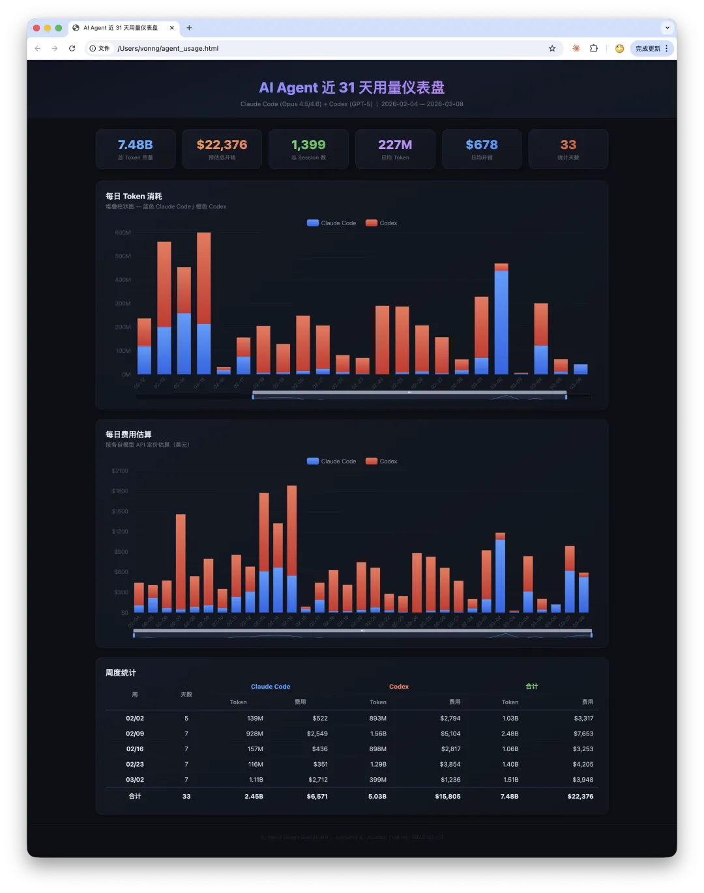
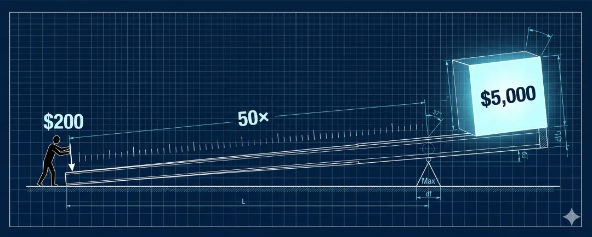
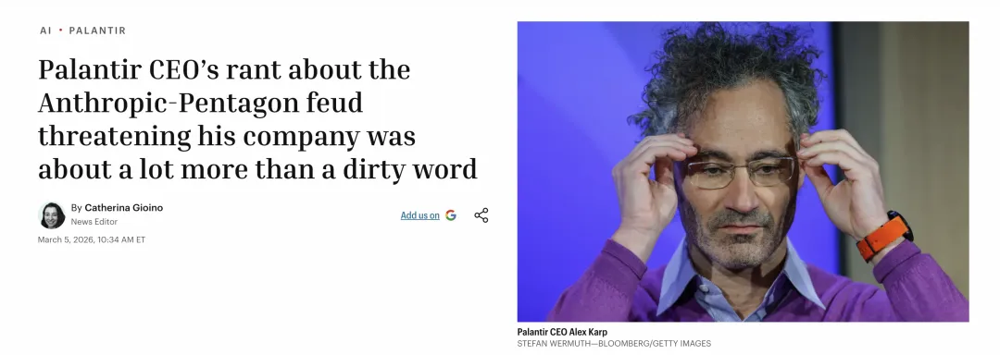
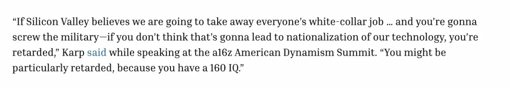
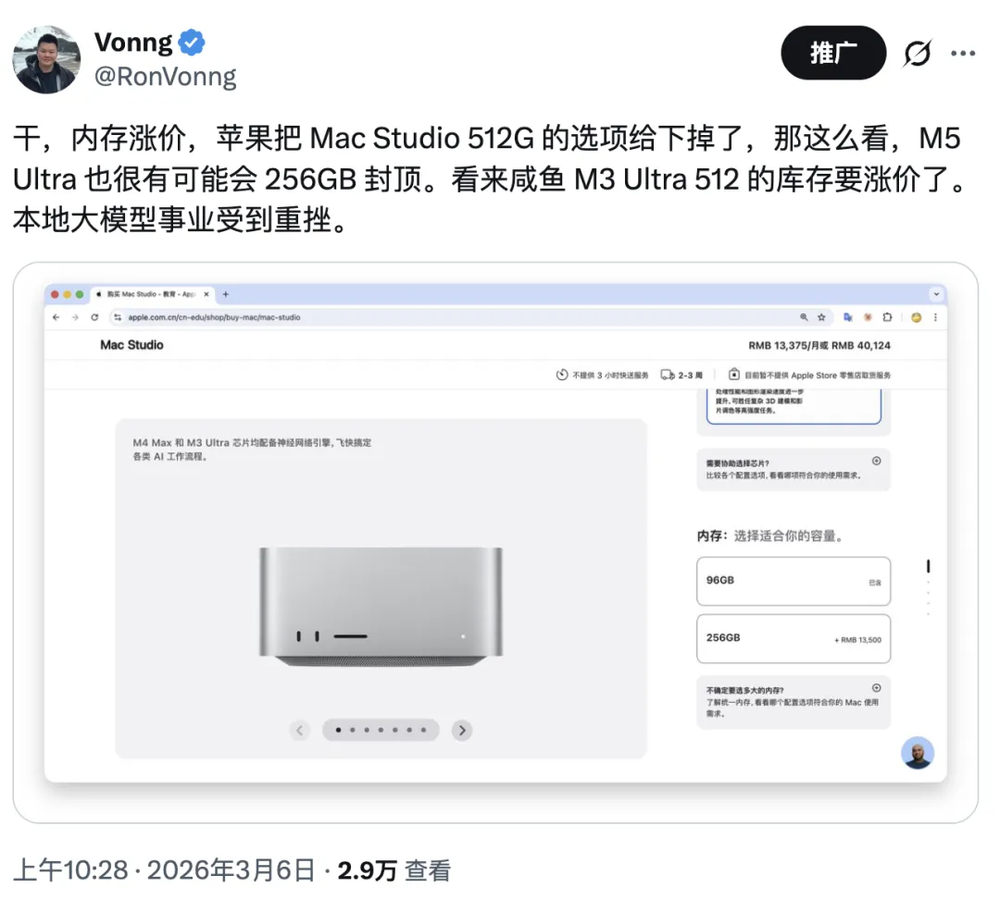
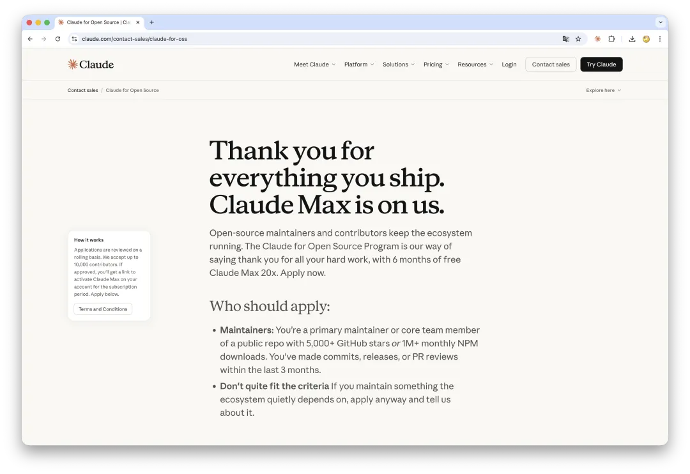

花一块补 50 的事可不常见。普通人能在 AI 浪潮中薅到的最大羊毛，就是每月 200 刀的 Max 订阅们 —— 前提是你真的能用好它。

------

## 一、200 美元兑 5000 美元成本的算力

Forbes 最近引述的 Cursor 内部分析透露过一个数据：Anthropic 的 $200/月 Claude Code 订阅，每个用户最多可消耗约 $2,000 成本的算力。而今年，这个数字已经上升到约 **$5000**。

老冯对这个数字很感兴趣，就去核实了一下自己过去一个月的实际 Token 使用情况。方法也很简单：让 Claude Code 自己去统计 Token 使用情况与费用。

我买了两个 Max 订阅——一个 Claude，一个 Codex——每月共 450 美元。过去一个月，两个订阅烧掉的 Token 按 API 定价加权模型折合大约 22,000 美元。

也就是说花 1 块钱，模型公司倒贴 50 块钱，一个月白薅 15 万人民币算力。

当然，API 标价是一回事，成本又是另一回事。根据行业对 Anthropic 毛利率的估算（约 50% 左右），一个订阅消耗掉的实际成本大约是 5,000 美元——正好跟 Cursor 的数据对上。

------

## 二、200 刀贵不贵？

有人觉得 200 美元订阅费很贵，实话说咋看确实不便宜。两个 Max 订阅加起来每个月三四千人民币，作为固定支出不是一个小数目。

但如果换个角度来看，AI Agent 在特定任务类型上以市价月薪几万元的程序员的产出质量和 10 倍的机器速度替你完成工作 —— 你要是有本事还可以来十几个并发，那就是几十上百倍的速度。 

而这样的能力每个月只要 2000 块钱订阅费，你会不会心动？而且当你知道了它的列表价是七万元每月，真实成本价是三万五元，又会有什么感想？

这就是一人公司 OPC 背后的基本工作假设 —— 对一个熟练驱动 AI Agent 的超级个体来说，它可以用两千块每月的订阅费撬动几十万月薪级别的生产力。

正如老黄那句话：“**The more you buy, the more you save.**” 花一块倒贴五十块，这种烧钱补贴的窗口期可不常有。买到就是赚到，用上就是赚到。如果你是 AI 重度用户、独立开发者或者技术从业者，200 美元的 Max 确实是性价比的天花板。同样的使用量走商业 API，账单轻松过万美元。

不过，我也克制了自己多买几个订阅的冲动，两个 Max 订阅目前就够了。目前我差不多只需要每天 1/5 左右的工作时间，就能把订阅额度有意义地消耗掉。如果发现 Token 还有富余，我就拿去翻译一些 PG 生态文档，放到 Pigsty 项目里 —— 一个兜底场景。

现在这种状态其实挺好的：用几分之一的时间干十几倍的活，每天还有空学习、写文章、看看新闻，让 AI 在后台跑着。真要追求一百倍加速比当然也可以，但那就太苦了，没必要。

------

## 三、三座大山与中转商风险

对中国用户来说，用上这些前沿 AI 服务尤其困难 —— 你得翻越三座大山：

**第一座：网络访问。** 你需要稳定的方式访问海外服务，这一步就拦住了 90% 的人。

**第二座：平台风控。** Claude 至今不对中国大陆用户提供服务，IP、手机号、区域各种检测层层设卡。

**第三座：支付渠道。** 就算前两关过了，你还得有一张能用的国际信用卡或虚拟卡来完成订阅。

如果你需要进一步了解具体操作细节，网上有很多教程可以参考（关键词：美区 AppleID）。三座大山叠在一起，筛选出来的是一批有技术能力、有全球视野、愿意折腾的人。从某种角度看，这三道门槛反而成了一种 “入场券”。

也正因为这三道门槛的存在，催生了一个灰色市场：很多人去中转商那里买 Claude 的 API 或者账号。不过老冯需要提醒诸位的是，很多中转商提供的是那种按量付费的 API 服务，性价比很差劲，而且还有两个额外的风险：

**第一个风险：数据安全。** 你的代码、商业文档、思考过程，全部经过别人的服务器中转。你以为在跟 Claude 聊天，实际上中间可能有人在看你的每一条消息。而且这些数据被对你没有影响力的厂商看到影响还好，[但被能对你直接施加影响力的本土中间商拿走](https://mp.weixin.qq.com/s?__biz=MzU5ODAyNTM5Ng==&mid=2247491034&idx=1&sn=60f7f157e3e8b70f3502bf5ad32501b2&scene=21#wechat_redirect)，那性质就完全不一样了。

**第二个风险：模型造假。** 2025 年底 arXiv 上的论文 **“Real Money, Fake Models: Deceptive Model Claims in Shadow APIs”**（arXiv: 2603.01919）做了一项系统性审计：研究者通过 LLMmap 指纹识别框架对 24 个端点进行了检测，发现部分中转商声称提供的是顶级模型，但实际输出与官方 API 存在显著偏差。

简单说：你花了 Claude Opus 的钱，用的可能是某个不知名的小模型。你觉得 “这 Claude 怎么这么笨” —— 不一定是 AI 笨，看看是不是有人在偷梁换柱。

如果条件允许，老冯还是建议直接用官方订阅，因为与其让中间商吃算力补贴红利，不如自己直接上。当然，本文无意针对所有中转商一概而论。应该也有正规经营、透明转发、物美价廉的服务商，注意甄别，谨慎行事。

------

## 四、订阅烧完烧好可不容易

拿到订阅之后，很多人面临一个实际的问题：怎么把额度用满？

圈子里有种说法，“每天烧过一亿 Token ，才有资格谈玩转 AI” —— 我对这种数豆子大赛不太感冒 —— 因为这就跟代码行数一样，并不是啥好指标。我给自己定的要求很简单：两个 Max 订阅不要浪费，吃干抹净就好。

比起烧了多少 Token，更重要的是产出了多少价值。谁都可以轻松生成上亿行屎山代码，但如果代码质量不行、没人用，那就是纯粹的浪费。**用有价值的真实工作把额度烧光，可不是那么容易的。**

最近一个月，老冯用 AI Agent 的产出不可谓不丰富：[Pigsty 发了两个主要版本更新](/pigsty/v4.2/)，[接盘下来了跑路的 MinIO 项目](/db/minio-resurrect/)；[上了一次 Hacker News 头条两小时](https://mp.weixin.qq.com/s?__biz=MzU5ODAyNTM5Ng==&mid=2247491383&idx=2&sn=aef67d9c4b2f95799cf474059ac9214c&scene=21#wechat_redirect)；GitHub Star 数涨了 1000；[翻译了 DDIA v2](/db/ddia-v2-done/) 和 TPME 两本书，质量达到了 85 分水平；基本把 [PostgreSQL 核心组件文档](/pg/pg-translate/)及[几十个扩展](/pg/pgext-pedia/)，还有 MinIO 的文档都翻译成中文；[整个 Pigsty 网站与文档整体翻新](/pg/pgext-pedia/)；公众号确保了稳定日更，一个垂类公众号一个月从 50000 涨粉 6000。

[一个人春节，能用 AI 干多少事？](/misc/how-much-ai-can-do/)

就算是这样，有时候 Token 还是烧不完。不过老冯最近找到了一个不错的 “无限消耗” 场景，就是中文翻译。一旦手头的开发工作用不满额度，我就让 Agent 去做翻译。主要是 PostgreSQL 生态的文档，博客，以及一些数据库领域的书籍。

我有一套成熟的翻译工作流——术语表、风格参考、格式规范全部预设好，让 Agent 花两个小时把一本英文技术书翻译成中文，质量直接达到精翻水准。Agent 用两小时一本的速度，可以达到流畅阅读的水平 —— 只要你有足够的领域知识和工程化能力，AI 带来的生产力杠杆是惊人的。

------

## 五、结构性的机会窗口不常有

当前的 AI 订阅模式有一个很特殊的背景：这些公司正处于跑马圈地、烧钱补贴的阶段。

烧钱补贴这种事在商业史上并不罕见。滴滴、美团、拼多多，早年都干过类似的事。但花 1 块钱，平台倒贴 50 块—— 这种事老冯可没听说过。区别在于，AI 补贴的不是打车券和外卖红包，而是实打实的通用智力劳动力。

不过这种关系并非完全是单方面的 “薅羊毛”。一个领域专家是怎么使用 Agent 的、怎么设计提示词的、怎么组织工作流的、怎么评判输出质量的——这些使用数据本身就极其珍贵。你可以把它理解成一种 “以用例换算力” 的交易：平台给你廉价算力，你给平台高质量的训练信号，双方互利共赢。

但这种补贴不会永远持续。Palantir CEO Alex Karp 在 2026 年 3 月的 a16z American Dynamism Summit 上警告称，AI 公司如果在裁掉大量白领工作的同时又拒绝服务军方，那就是在走向被国有化的命运。

不论 Karp 的预判准不准，有一件事是确定的：**当前这种 “包月不限量、成本远低于价值” 的补贴状态是临时的。** 一旦行业格局稳定、按量付费成为主流，200 美元对应的就不再是 5000 美元的算力了。

所以我的判断是：现在是一个结构性的机会窗口，该用就使劲用。

------

## 六、本地模型：等等再说

我对在本地跑模型这件事一直很感兴趣，长期关注 Apple Silicon 的发展。

先说判断：27B / 32B / 70B 参数的模型，在笔记本上用 Q4 量化跑，应付日常问答、简单文本、当个呆萌小助理已经够用了。但如果你想达到 Claude Code 那种级别的编程 Agent 体验——深度理解代码库、多文件协同编辑、长上下文推理—— 本地模型还远远不够。

有人会说：配四台 Mac Studio Ultra，512GB 内存，跑 DeepSeek R1 671B 的量化版本不就行了？我觉得时机还没到。四台顶配 Mac Studio Ultra 加上内存升级和存储，大概需要花 40 万人民币。跑起来之后，推理速度也就那么回事，还是单路的，并发时，长上下文时速度还会大幅下降。

换一种花法：40 万人民币约 55,000 美元，可以买 275 个订阅·月。按前面的补贴比例换算，你薅到顶大概能获得约 **1,000 万人民币列表价**的算力。更关键的是，云端模型在持续进化——你今天买的 M5 Ultra，三年后还是那台 M5 Ultra；但一年后的推理成本可能下降一个数量级，类似 Taalas，TPU 这种智能加速硬件也有可能会出现消费级的产品。

本地模型的真正用武之地不在于替代云端订阅，而在于：完全离线的隐私敏感任务、不限速不限量的本地推理（比如嵌入向量计算）、以及纯粹的技术兴趣和学习。至少在当前这个补贴窗口期内，对大多数人来说，买订阅远比买硬件划算。当然，这说的是这种 SOTA 编码大模型。对于笔记本上几十B的中模型和手机上几B的小模型，我认为现在已经到了一个非常微妙的全面开花节点了。

------

## 七、关于封号：几点个人观察

最后聊聊很多人关心的封号问题。不少用户反映用 Claude 被封号了，理由五花八门：中国 IP、汉语拼音名字、代理切换频繁、在不同地方登录导致 IP 不一致等等。先说我自己的情况：上面这些所谓的 “红线”，我基本上都踩了不知道多少次——中国 IP 直连过、在不同国家不同设备登录过、汉语拼音名字一直在用，分享 Oauth Token 给别人，拿去跑 OpenClaw —— 但到目前为止没被封过，但这**不代表**我的经验可以推广到所有人身上。

我有一个基于直觉的猜想，只是个人推测，没有任何内部信息或证据支持：AI 公司投入了几十倍的补贴来服务 Max 订阅用户，它期待的回报是高质量的使用数据。如果你每天给 AI 的都是真实的工程任务、架构设计、技术讨论，头脑风暴，这些数据对模型改进可能是有价值的。

相比之下，如果它察觉到了纯娱乐性质的大量重复请求，可能在风控系统中的评分会不太一样（比如订阅养龙虾，立刻就毙掉了）。那么就会随便找个理由给封掉。

## 八、关于 Claude 与 Codex

当然，具体实操怎么弄呢？我应该买 Anthropic Claude 还是 OpenAI 的 Codex？

老冯的看法是，如果预算有限，Claude Max 订阅优先。Claude Code 目前在编程 Agent 领域是 SOTA（最先进水平），对于开发者来说是刚需。而且 Claude 这个模型本身有一个好处，就是它不谄媚，不像 GPT 那样哈着你，能给出相当中肯的建议，可以作为日用模型使用，扮演诤友，导师，同事，顾问，实习生等多种不同角色。

老冯最近的严肃探讨，基本上只用 Claude，偶尔用用 Gemini，GPT 是从来不碰的。因为 GPT 5.x 之后，我觉得它在健全人格上出现了缺陷。也就是说，它干写代码、Code Review 这些事的能力是在线的，但是在健全人格上出了点问题。不过最近有双倍额度，干活倒是可以冲一下。

Anthropic 这家公司呢，哎，一言难尽吧，但老冯确实看好这家公司，人家确实是这第二轮 AI Agent 革命的发起者，东西质量确实过硬。老冯的看法是，既然你乐意烧钱补贴我 50 倍算力，那我岂有不笑纳之理？

------

## 九、时不我待，行动起来

最后说几句心里话。老冯自己是 Claude 与 Codex 重度用户和付费订阅者。但你买不买反正我也挣不着你一分钱，相反还可能产生潜在的竞争者，所以理论上闷声大发财才是最好的。

但我是觉得还是有必要向关注者们提供一些真实的想法与真诚的建议，因为这确实是一次千年未有之大变局，在关键节点的先发优势会快速滚雪球放大。

很多人对 AI 感到焦虑——觉得自己会被替代，觉得跟不上节奏。这种焦虑完全可以理解。AI 的出现确实打破了很多人对未来的稳定预期。但面对变化的最好姿势是主动迎上去，让风险在自己的前方，而不是视线之外。与其担心被 AI 替代，不如先拿着 AI 去提升自己的产出。先用起来，出去大杀四方，在使用中找到自己的直觉，节奏和方法。

要知道，现在最领先的前沿 AI Engineering 探索者，积累的经验也还不到一年。现在开始，你依然是个 “早期采纳者”，什么时候开始搞都不晚。

这是一个遍地机会的时代。几乎所有的软件应用都值得用 AI 和 Agent 的方式重新思考一遍。2026 年，就是这样一个关键节点 。在节点上敢于下注会改变很多事情，与其把头埋在沙子里，不如勇闯新世界。

勇敢的人先享受新世界。
