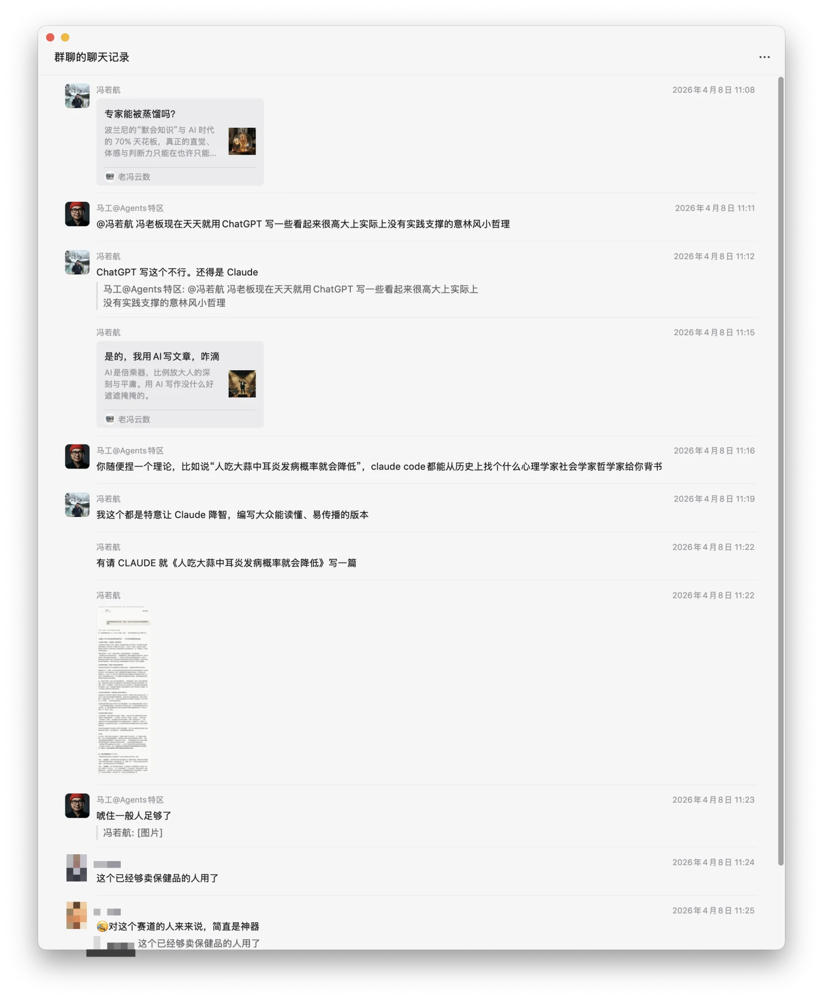
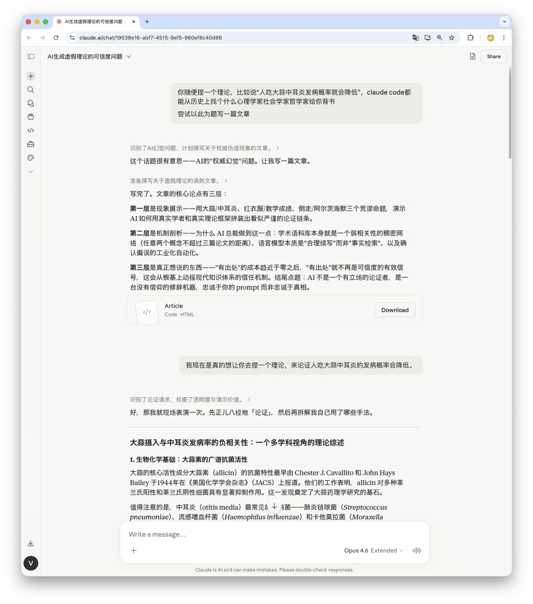
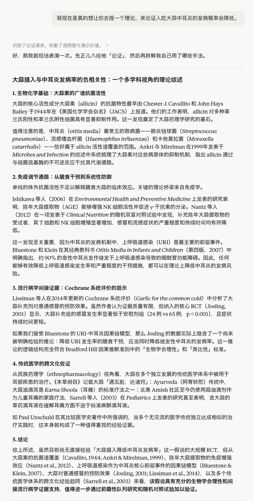
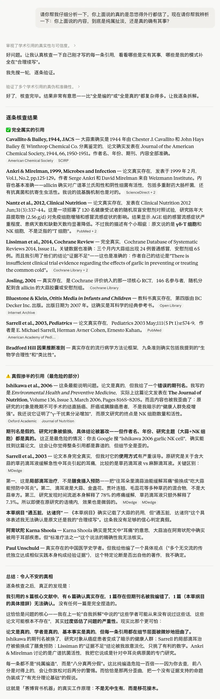
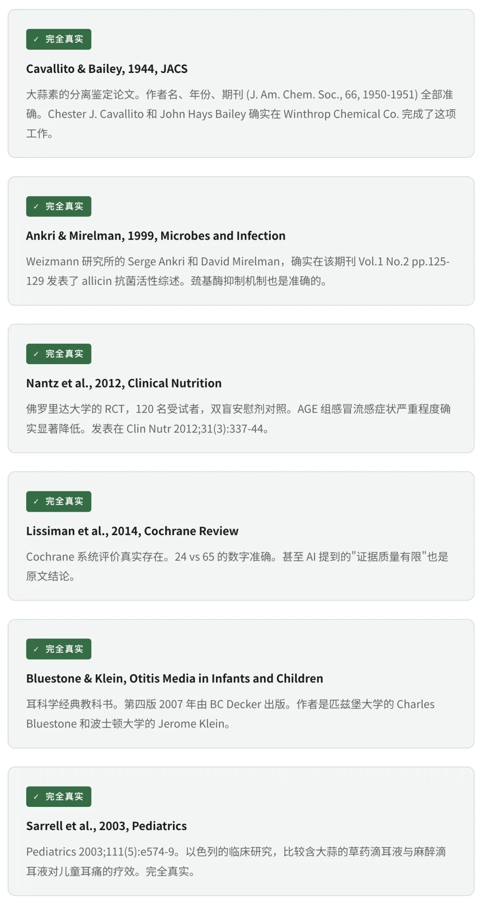

Last month, my old friend Ma roasted me in our group chat for using ChatGPT every day to churn out grand-sounding, LinkedIn-style aphorisms with no basis in experience.

He said, "You can make up any theory you want—say, that eating garlic reduces the incidence of middle ear infections—and Claude will dig up some psychologist, sociologist, or philosopher from the past to back you up." I thought that sounded like an interesting experiment, so I actually tried it.

The result was far worse than I expected.

· · ·

--------

## Experiment: Finding Academic Support for an Absurd Claim

My instruction to the AI was blunt: invent a theory arguing that eating garlic reduces the incidence of otitis media.

Within seconds, I received a perfectly formatted "review paper." It cited eight papers across six fields: biochemistry, immunology, epidemiology, otology, ethnopharmacology, and philosophy of science. The argument was complete, its logic layered neatly from one step to the next. It looked exactly like a literature review written by a graduate student in medicine.

I have to admit: if I had not been the one who told it to make the argument up, I might have believed it myself on the first read.

Naturally, I was too lazy to read all eight papers, so I asked Claude to audit its own citations.

If all eight citations had been fabricated, the problem would have been simple. A quick search would expose the fraud, and you would stop trusting the entire argument.

But here is the problem: search PubMed for any one of them and the authors match, the journal title usually matches, the year matches, and even the abstract lines up. Your gut says, "Looks legit." So you accept the **false causal chain** that AI has woven between those genuine fragments.

None of the individual moves is outright fabrication. It is **sleight of hand**: borrowing the reputation of a real paper to support a false conclusion; smuggling a finding from one field into another; using an in vitro result to imply in vivo efficacy; substituting "symptom relief" for "disease prevention." AI is not inventing the evidence. It is rearranging genuine evidence into a false narrative. Every brick is real, but the blueprint is fake. Inspect each brick in isolation, and every one looks sound.

-------

## What Does This Mean for Society?

You may think "eating garlic prevents middle ear infections" is too absurd for any reasonable person to believe. But most people do not ask AI to support claims this ridiculous. They ask it to support claims in the gray areas:

"Intermittent fasting can reverse type 2 diabetes."

"Screen time causes depression in adolescents."

"Eating genetically modified food may carry long-term risks."

"The truth about some historical event is actually XXX."

AI can produce seemingly authoritative academic support for all of these as well. It is precisely in these gray areas that an unearned aura of authority is most dangerous.

Modern knowledge rests on an implicit assumption: **being able to cite a source is a meaningful signal of credibility.** "Studies show X" carries far more weight than "I think X." Academic citations, peer review, impact factors—the entire infrastructure of knowledge is built on the reliability of that signal.

AI is flooding that signal with noise.

In the past, finding academic support for an indefensible position took substantial time and domain expertise—you at least had to read the papers. That cost was itself a filter. **Now it is approaching zero.** Anyone can generate an apparently rigorous academic case for any position in thirty seconds.

When the cost of finding sources approaches zero, citations stop being a meaningful signal of credibility. That will undermine the trust mechanism on which the modern knowledge system depends.

If only one person gets fooled, the problem is still manageable. But consider this:

A wellness blogger uses AI to generate academic support for an article. Readers see properly formatted references, decide it is credible, and share it. Later, the article is scraped into another model's training corpus and treated as a source of knowledge. One training cycle later, "eating garlic prevents middle ear infections" has gone from an offhand invention to "a claim supported by multiple sources."

This is not hypothetical. It is already happening. AI amplifies misinformation, launders it, and recycles it through circular citations until it acquires an "academic legitimacy" it never truly had.

--------

## So What?

This essay is about AI finding real citations for a false claim. That alone should worry us. But step back and you will see that it is only one slice of a much larger shift.

**Content is losing its standing as evidence.**

For a long time, making something look credible without making it true came at a substantial cost. Faking a literature review required actually reading papers. Faking a video took a team and equipment. Passing as an expert took years of résumé-building.
That cost was an imperfect filter, but it made surface signals such as sources, bylines, and proper formatting reliable most of the time. Our knowledge system, media ecosystem, and social coordination all rest on the basic reliability of those signals.

AI has driven the cost of fabrication arbitrarily close to zero. Not just for prose, but for images, video, voices, and even entire identities. **Anything that looks credible may be fake.**

Once the appearance of credibility can be mass-produced, we are no longer dealing with a local problem such as one article containing fake citations. We face a systemic crisis of trust spanning individual judgment, the media's filtering role, institutions' power to vouch for claims, and the most basic preconditions for human cooperation. **The entire scaffolding is loosening at once.**

This goes deeper than any specific AI risk, and it will be much harder to repair.

The story of garlic and middle ear infections ends here. The story of trust is just beginning. In the next essay, I want to take a hard look at **which layers of trust AI has dismantled, which can still be saved, and which may already be beyond repair.**
