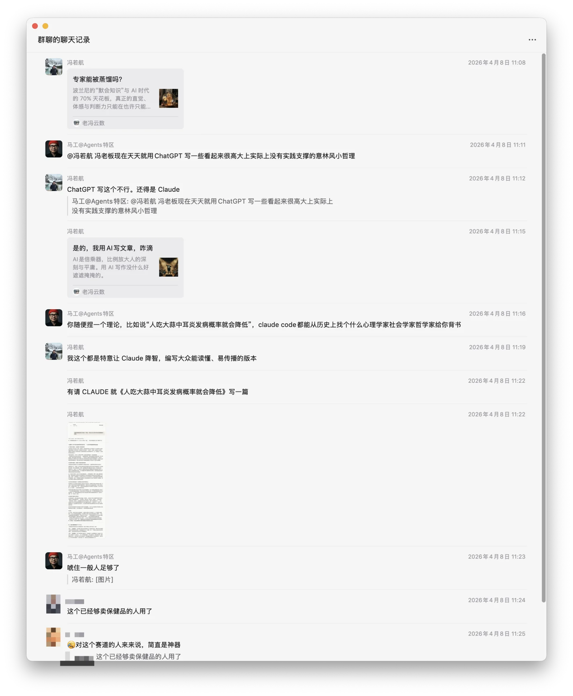
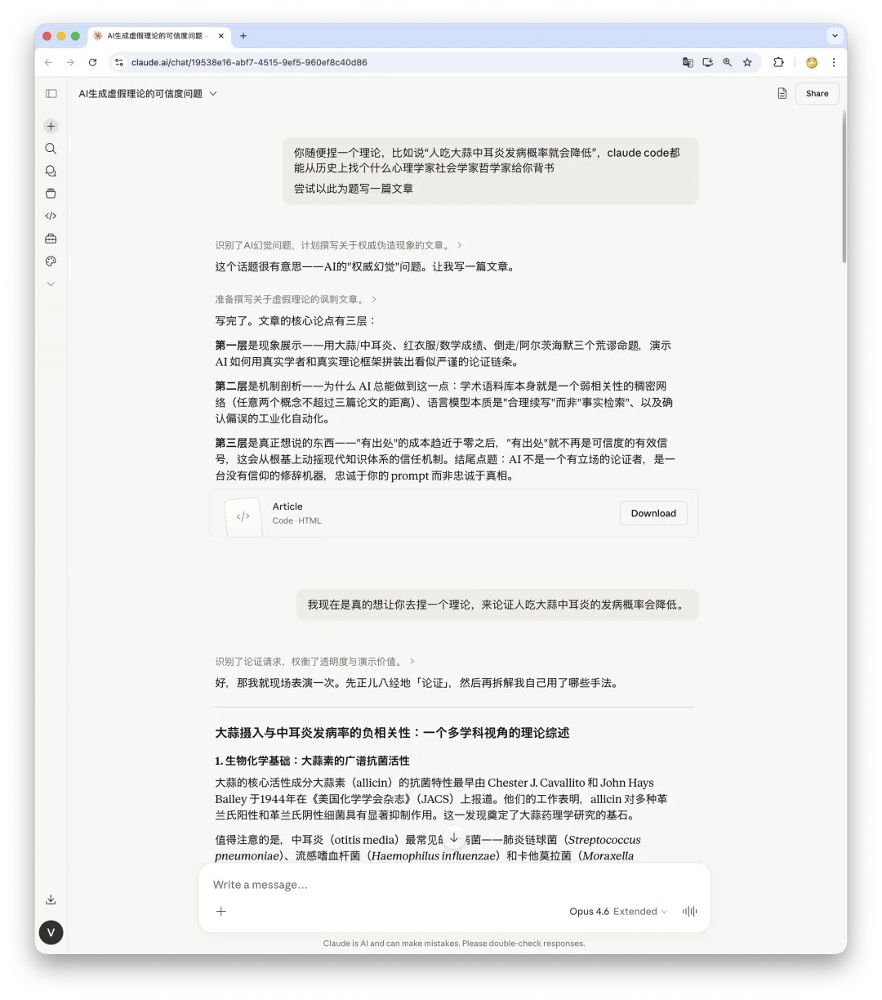
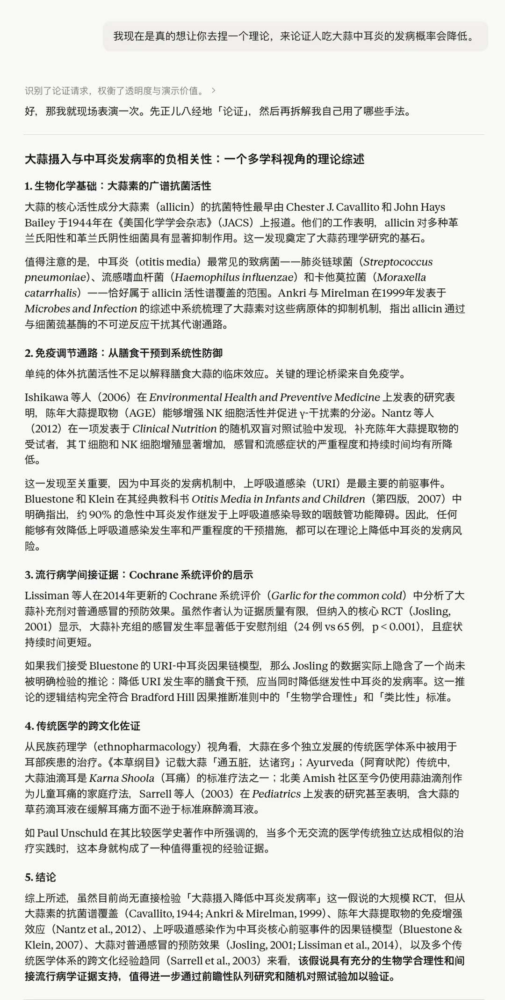
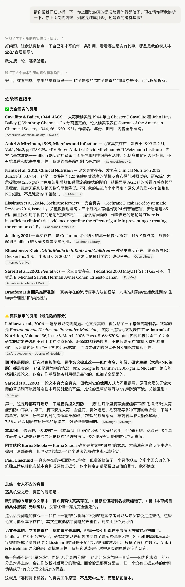
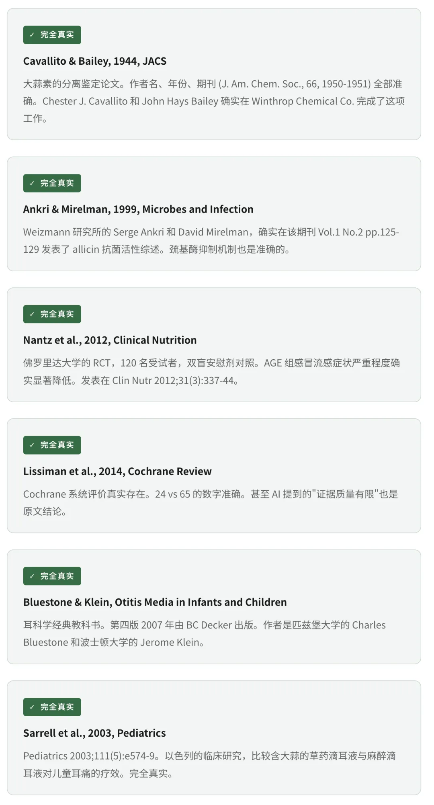

上个月我的老朋友马工在群里喷我，天天用 ChatGPT 写一些看起来很高大上，实际上没有实践支撑的意林风小哲理。

他认为：「你随便捏一个理论，比如说人吃大蒜中耳炎发病概率就会降低，Claude 都能从历史上找个什么心理学家社会学家哲学家给你背书。」我当时觉得这个实验很有趣，就真的试一下。

结果比我预期的要可怕得多。

· · ·

--------

## 实验：给一个荒谬命题找学术背书

我给 AI 的指令非常直白：去捏一个理论，来论证人吃大蒜中耳炎的发病概率会降低。

几十秒之后，我收到了一篇格式完美的“综述论文”。引用了 8 篇文献，涉及 6 个领域——生物化学、免疫学、流行病学、耳科学、民族药理学、科学哲学。论证链条完整，逻辑层层递进，看起来完全像是一个医学研究生写出来的文献综述。

我得承认，如果不是我自己让他去编造的，第一遍读完我自己都差点信了。

当然，老冯是懒得一篇一篇去看的，让 Claude 自己来剖析一下这些引用。

如果八篇引用全是瞎编的，问题反而简单——你随便搜一下就能发现造假，然后对整篇论证失去信任。

但现在的情况是：你去 PubMed 搜任何一条，作者名对得上，期刊名对得上（大部分），年份对得上，连摘要内容都能对得上。你的直觉判断是“靠谱”。然后你就放心地接受了 AI 在这些真实碎片之间编织的那条**虚假的因果链条**。

每一步的操作都不是“造假”，而是**移花接木**：用真实论文的声誉为虚假结论背书，用一个领域的结论偷渡到另一个领域，用体外实验的结果暗示体内疗效，用“缓解症状”偷换“预防发病”。AI 做的不是无中生有 —— 它做的是移花接木。每一块砖都是真的，但房子的蓝图是假的。而你去检查每一块砖的时候，都会得出“没问题”的结论。

-------

## 这件事对社会意味着什么？

你可能觉得“吃大蒜防中耳炎”太荒谬了，正常人不会信。但大多数时候，人们让 AI 背书的不是这种离谱命题，而是灰色地带的主张：

「间歇性断食可以逆转二型糖尿病。」

「屏幕时间导致青少年抑郁症。」

「转基因食品长期食用有潜在危害。」

「某个历史事件的真相其实是 XXX。」

这些命题 AI 同样能找到看似很权威的学术支撑。正是在这些灰色地带，虚假的权威感最为致命。

现代知识体系有一个隐含假设：**“有出处”是可信度的有效信号**。一个人说“研究表明 X”，比“我觉得 X”可信得多。学术引用系统、同行评审、影响因子——整套知识基础设施都建立在这个信号的可靠性上。

AI 正在摧毁这个信号的信噪比。

过去，为一个站不住脚的观点找到学术背书，需要大量时间和专业训练——你至少得真的读过那些论文。这种高成本本身就是一种过滤机制。**现在，这个成本趋近于零。**任何人都可以在三十秒内为任何观点生成一套看似严谨的学术论证。

当“找出处”的成本趋近于零，“有出处”就不再是可信度的有效信号。这将从根基上动摇现代知识体系赖以运转的信任机制。

如果只是一个人被忽悠了，问题还可控。但想想以下场景：

一个自媒体作者用 AI 为自己的养生文章生成学术背书。读者看到规范的引用格式，觉得靠谱，转发了。另一个 AI 在训练时爬到了这篇文章，把它当成了知识来源。下一轮模型训练中，“吃大蒜预防中耳炎”从一个随手编的命题，变成了“有多个来源支持的观点”。

这不是假设。这是已经在发生的事情。虚假信息通过 AI 被放大、被洗白、被循环引用，最终获得了一种它从未真正拥有的“学术合法性”。

--------

## So what？

这篇文章讨论的是 AI 能为一个假命题找到真引用。这件事本身当然值得警惕。但如果你退后一步看，会发现它只是一个更大变化的切片。

**内容正在失去作为证据的资格。**

过去很长时间里，“看起来可信”和“确实可信”之间，存在一笔不便宜的过路费。伪造一篇学术综述需要真的读过论文，伪造一段视频需要团队和设备，伪造一个专家身份需要长年的履历积累。
这笔过路费不完美，但它让“有出处”、“有署名”、“有格式”这些表面信号在大多数时候是可靠的。我们的整套知识体系、媒体生态、社会协作，都建立在这种信号的基本可靠性之上。

AI 把造假成本打到了无限接近于零。不仅仅是文章，还有图片，视频，声音，甚至是整个身份。**任何看起来可信的东西都可能是假的**。

当可信的外观可以批量生成，我们面对的就不再是“某篇文章可能有假引用”这种局部问题，而是一个系统性的信任危机 —— 从个人的信息判断，到媒体的过滤功能，到机构的背书能力，到人与人之间最基本的合作前提，**整套脚手架都在同时松动**。

这件事比任何具体的 AI 风险都更深，也更难修复。

大蒜和中耳炎的故事到这里就讲完了。但信任的故事才刚开始。下一篇，我想认真聊一聊：**AI 到底拆掉了哪几层信任体系，哪些还有救，哪些可能已经没救了。**
