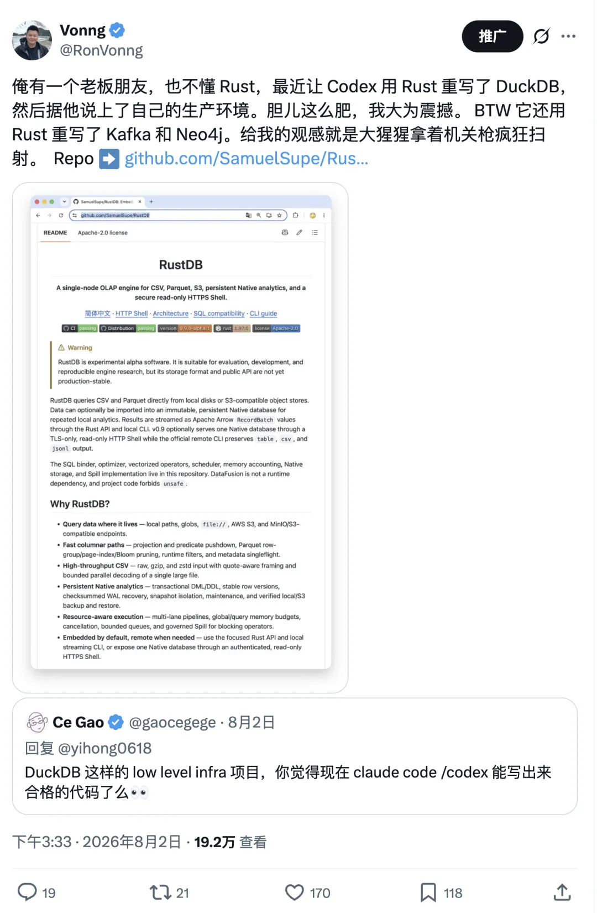
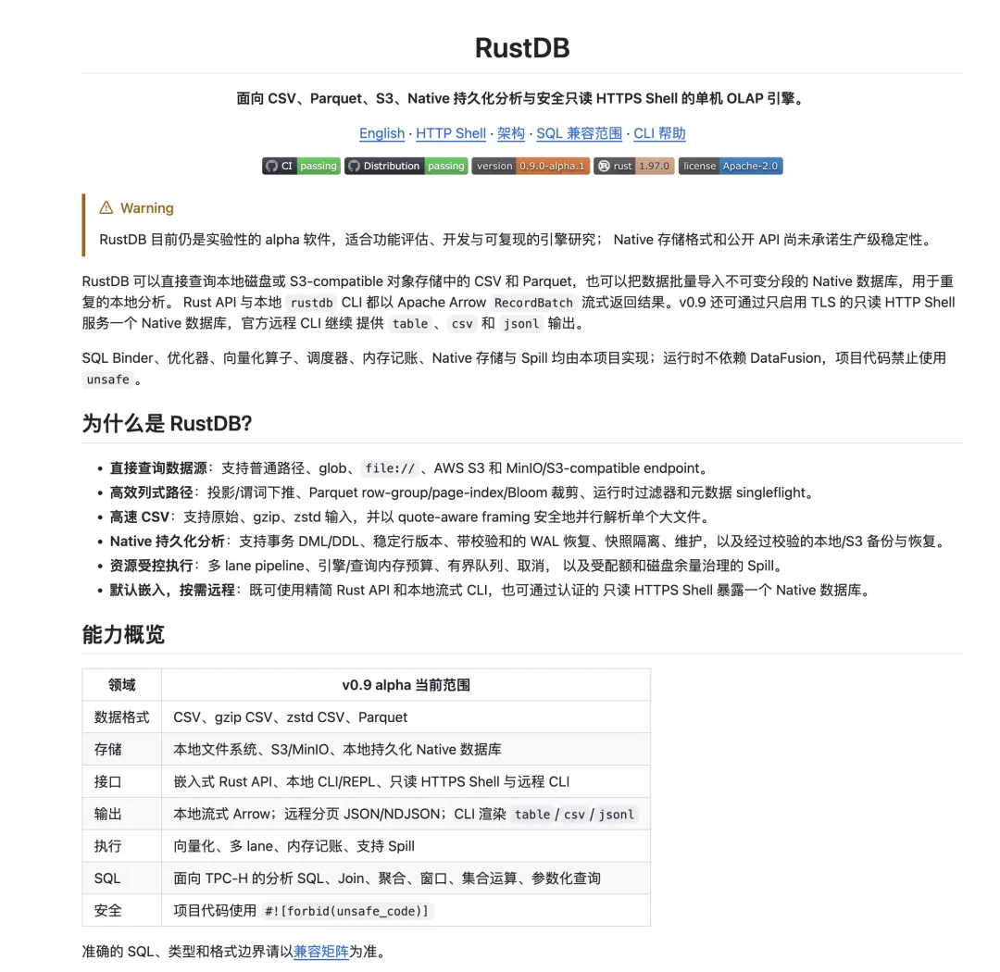
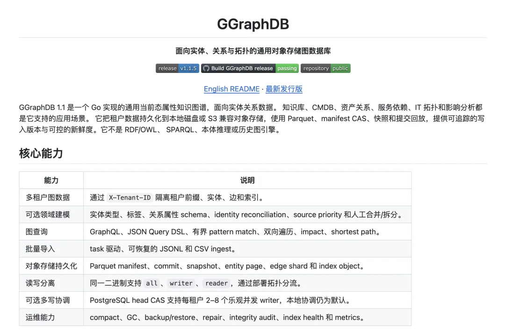
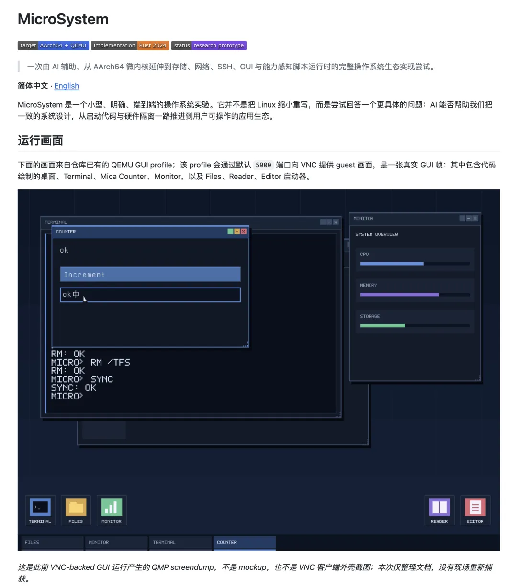
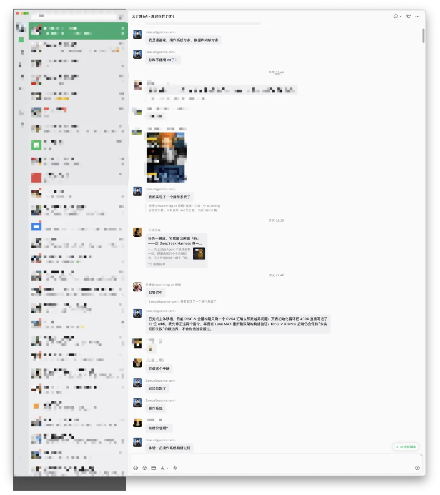
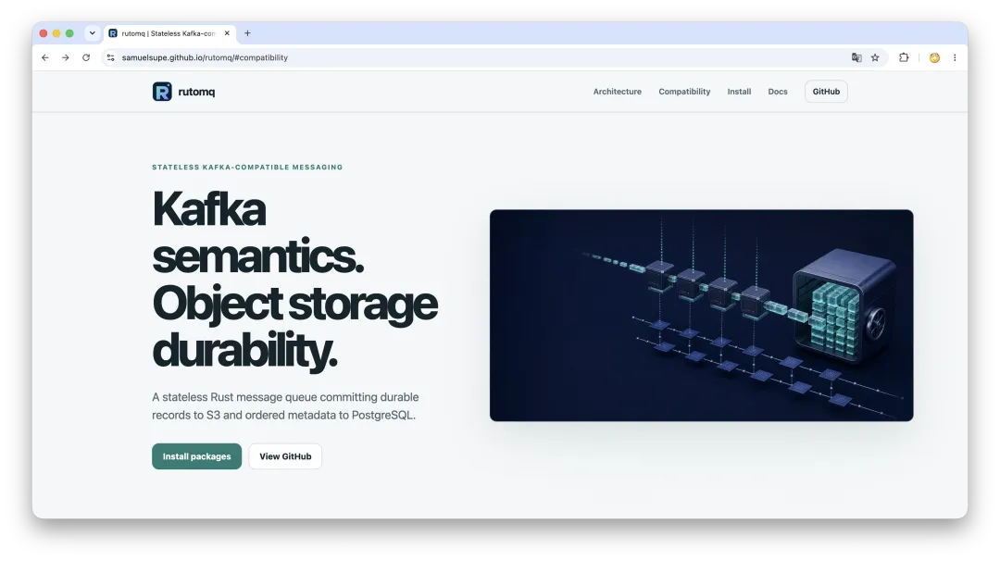
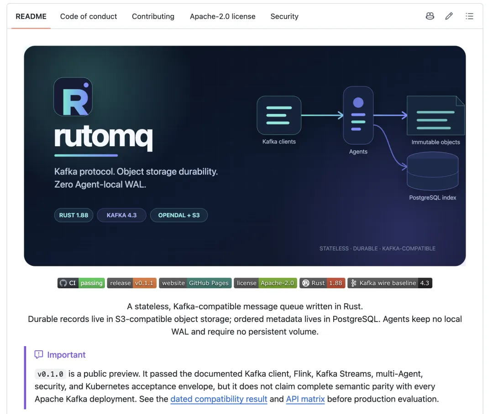
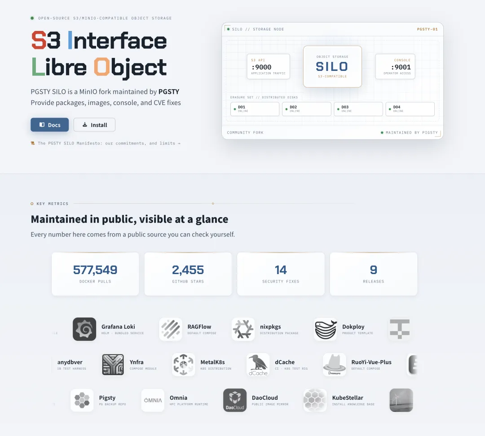
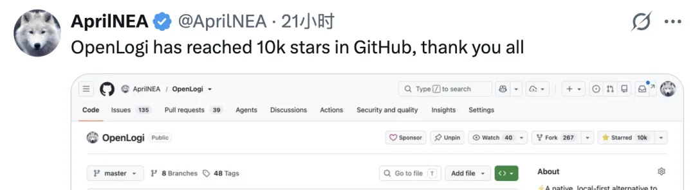
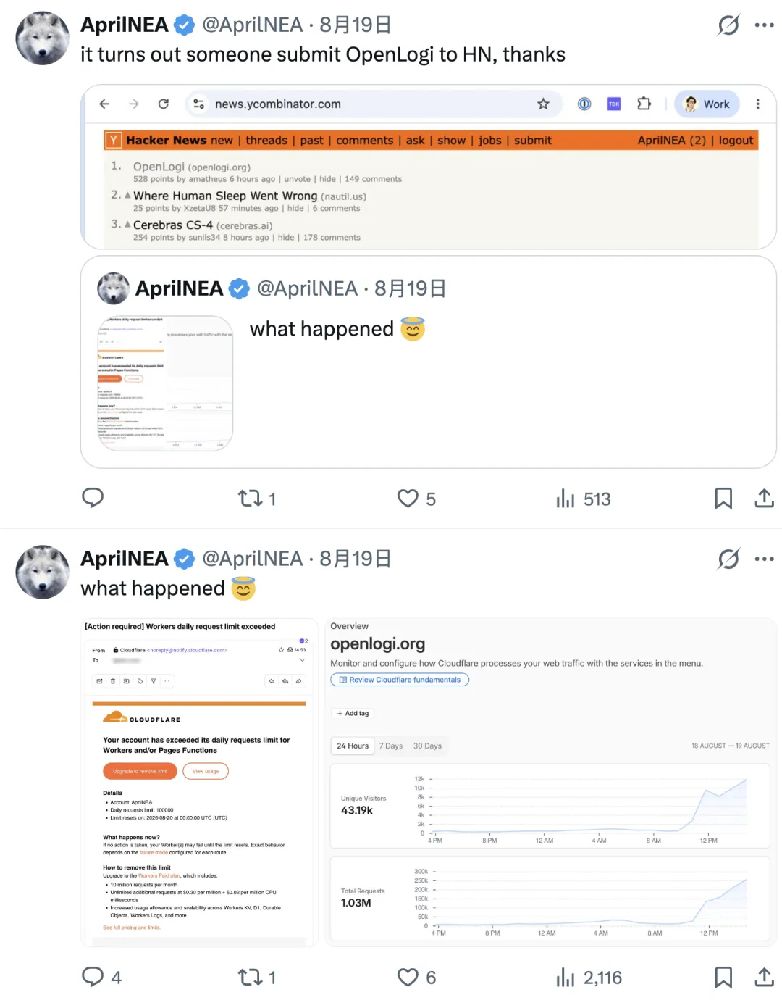

> In one month, my friend Jiang cobbled together four databases, an operating system, a programming language, a compiler, and a CPU—a microcosm of today's AI frenzy.

The past six weeks have been an AI carnival. My fleet of Max subscriptions has grown to ten, each costing $200 a month. The things they have produced are too numerous to count, and new work lands faster than I can promote it. Friends at the frontier are quietly cashing in, using this window to burn a few projects into existence.

Others have just been handed an AGI machine gun and cannot resist spraying bullets everywhere. The best example is my friend Jiang.

---

## Jiang's Machine Gun

We have a group chat where Jiang regularly shares dispatches from his [Vibe Coding](/en/ai/vibe-coding-translate/) campaigns.

As the head of a midsize startup, he should have plenty of serious work to do, not this much time on his hands. But Jiang is an eccentric. Other people get Codex and ask it to build a web page or patch some business code. Jiang's first instinct was to build his own databases.

As far as I know, Jiang is not particularly familiar with Rust. That did not stop him from having Codex build a Go take on [Neo4j](https://github.com/neo4j/neo4j) called [`graphdb`](https://github.com/SamuelSupe/graphdb), a Rust take on [DuckDB](https://github.com/duckdb/duckdb) called [`RustDB`](https://github.com/SamuelSupe/RustDB), and a Rust take on [Kafka](https://github.com/apache/kafka) called [`rutomq`](https://github.com/SamuelSupe/rutomq), among other projects.

Here, to "burn" something means using tokens as fuel and having agents cobble the project together. I was not particularly interested in these projects at first. Then I let Fable inspect the repositories. Its verdict was surprisingly positive: they are nowhere near true production-grade products, but neither are they just a README and a few architecture diagrams. The code is surprisingly substantial, the basic functionality runs, and the projects are not mere stage props.

Jiang says his company already uses these databases in its own operations, so this is not just a stunt. I agree with the design: keep the data itself in S3 object storage and the metadata in PostgreSQL. I see that as one of the major directions for future data services.

Then the story became ridiculous. Databases were not enough, so Jiang burned an entire [AArch64 operating-system ecosystem called `microsystem`](https://github.com/SamuelSupe/microsystem): an operating system, a programming language, a compiler, and even an ARM CPU running in an emulator. Today's goal is to port [MySQL](https://github.com/mysql/mysql-server) to his homegrown operating system.

Along the way, he also burned a few comic books. He is clearly having a wonderful time.

I cannot yet see the practical value, but the entertainment value is off the charts. A startup leader who spends every day obsessed with such pointless things is plainly neglecting his real job. But they are genuinely fun—that is the problem. When I was younger, I also seriously wanted to build my own operating system, database, programming language, and CPU.

Technically, I have built all four. But they were standard computer-science course projects: they existed, and they ran, but they were nothing like real software products. Whatever else one thinks of Jiang's projects, he is bold enough to put them into production. I respect that.

Whatever their practical value, these projects have reached a frontier that was difficult to imagine before.

---

## Ten Subscriptions Still Aren't Enough

On this point, I envy Jiang.

I run an OPC: a one-person company. My main work already fills the day. I maintain [Pigsty](https://github.com/pgsty/pigsty), a PostgreSQL distribution, along with hundreds of extensions and a large collection of packages. When the community edition of [MinIO](https://github.com/minio/minio) left a maintenance vacuum, I stepped in with an object-storage fork, [Silo](https://github.com/pgsty/silo). Over the past couple of days, I have also been working on a new documentation framework called [OINK](https://github.com/pgsty/oink).

The upside is that these are things I genuinely care about. People use them, and they solve real problems. The downside is that I do not have ammunition to fire randomly into the sky. Jiang can send dozens of agents to build a virtual CPU, laugh when it is done, then port MySQL the next day. I have to spend every unit of quota where it matters: fixing security vulnerabilities, filling out compatibility matrices, running regression tests, cutting releases, writing documentation, and handling real user problems.

My current usage tells the story: ten subscriptions are still not enough. On an average day, I can exhaust the quota on two of them. With a seven-day reset cycle, ten plans cannot keep up; I survived only because of [Tibo's Reset giveaways](/en/ai/codex-reset-end/). The subscription fees are the easy part. Ten plans cost only $2,000 a month. The real constraint is human attention. I am accountable for what I ship, so much of the validation still requires me to intervene, adjudicate, and sign off. I suspect my own capacity would top out at about twenty $200-a-month plans.

---

## A Gorilla and a Maintainer of Last Resort

Back to Jiang's side projects. I may see little practical value in them today, but the direction is sound. In the past, someone who spotted the opportunity to put the data itself in S3 and metadata in PostgreSQL could, at most, write an article or build a demo. Turning it into a complete data system required a team, funding, and two or three years. In messaging, for example, an entire startup called [AutoMQ](https://www.automq.com/blog/kafka-on-s3-architecture-options-beyond-tiered-storage) is devoted to putting Kafka's persistent storage on shared object stores such as S3.

Now an outsider who does not know Rust can charge into the field like a gorilla with a machine gun and fire a burst at the professional teams. Jiang may not kill anyone. He may only leave a line of bullet holes in the wall. But whether he wins is not the point. The price of admission to this market has suddenly fallen by several orders of magnitude.

I have done something similar, though by a different route. MinIO was once one of the most widely deployed and commonly used open-source object-storage projects. When a clear maintenance gap emerged in the community version, I took it over and turned it into Silo. I said from the start that Codex and Claude would do most of the project's ongoing maintenance.

That story is told in three essays: [*MinIO Is Dead, Long Live MinIO*](/en/db/minio-resurrect/), [*Two Months into Maintaining a MinIO Fork*](/en/db/minio-promise-kept/), and [*Silo: A Maintained, MinIO-Compatible Object Store*](/en/db/long-live-silo/).

So far, I have addressed more than ten security issues, including high-severity flaws such as an authentication bypass. When upstream leaves an issue untouched, I have an agent fix it while I handle architectural decisions, risk review, regression testing, and release sign-off. [Silo's security advisories](https://github.com/pgsty/silo/blob/main/docs/security/advisories.md) and release history are public, and the fork has become one of the most active community branches in the MinIO ecosystem.

I know something about MinIO, so I was not flying blind. I did not type "please maintain this object store" into a chat box and wake up the next day to a production-grade product. I know how object storage should work. I understand the boundaries of consistency, erasure coding, disk failures, metadata, rolling upgrades, and compatibility. I also know which mistakes lose data.

I simply no longer spend my time typing code line by line or tracing every implementation detail. I decide where to fire, what counts as a hit, and what could blow up if we get it wrong. When opinions differ, I make the final call. The agents carry the ammunition, aim, and pull the trigger.

That is where AI creates real value.

It does not conjure professional judgment in someone who knows nothing. It frees people who already have that judgment from doing all the manual labor themselves.

---

## The Age of Infinite Supply

I believe open-source software will soon enter an age of nearly infinite supply.

**When you can wish software into existence, supply is effectively infinite.** If you can formulate the right wish and truly validate what comes back, you gain leverage that was previously unimaginable. The marginal cost of writing the first version of a codebase is already approaching zero.

There are plenty of examples. Jiang produced databases, an operating system, a programming language, a compiler, and a CPU in a month, plus a few comic books. This is no longer especially rare. My own output may sound even more absurd. [DHH](https://x.com/dhh), meanwhile, is running several product lines at his company while almost single-handedly building his personal Linux distribution, [Omarchy](https://omarchy.org/). It has become very popular recently; I installed it a couple of days ago to play with it.

My work on [Pigsty, a PostgreSQL distribution](/en/pg/pigsty-intro/), is similar. A few years ago, building something of this scope would have taken perhaps 100 to 200 people. I did it alone, and Pigsty genuinely became number one in its category.

Recently, [`pgrust`](https://github.com/malisper/pgrust) used AI to mechanically port PostgreSQL to Rust and eventually passed 46,066 queries from the PostgreSQL 18.3 regression suite. I wrote a rebuttal, [*Did AI Rewrite PostgreSQL in Rust? Not Quite*](/en/ai/rewrite-pg-in-rust/): passing the regression tests does not mean `pgrust` truly reimplemented PostgreSQL, much less that it has become a trustworthy database. That does not stop it from being a milestone.

The milestone is not that `pgrust` can replace PostgreSQL. It is that one person directing a group of AI agents can take on a vast codebase built up over decades and, within months, reach a level of completion that once required a team.

Rewriting PostgreSQL in Rust may itself be pointless, but it proved a valuable path. If PostgreSQL can be moved this way, many Java projects can certainly be rewritten in Go. Fragmented open-source components can be forked, trimmed, and stitched into distributions tailored to specific use cases. Tools that nobody would build because their markets were too small or their commercial value too low suddenly become possible.

Code will keep getting cheaper.

But a cold shower is in order: infinite code supply does not mean an infinite supply of dependable software.

GitHub will soon be full of cheaply built projects that are 70 percent correct and then abandoned.

AI can easily take a project from zero to a plausible-looking 80 out of 100. The hard part is finishing the last 20 points: compatibility, edge cases, security, migration, upgrades, rollback, observability, long-term maintenance, and responsibility when something goes wrong. Closing that last 20-point gap may consume 99 percent of the cost.

What is truly scarce, then, is not code. It is the right wish and the ability to validate the result rigorously. You must know what you actually want, where the generated output is likely to fail, and how to turn a working toy into a product that other people will trust with their data, operations, and livelihoods. That takes a track record of reliability that only calendar time can build, plus the influence required to make people trust what you produce.

Code can be infinitely abundant. Trust never has been.

---

## The Real Phase Change Happened This Month

Curiously, this shift began in early July, when [Fable 5](https://www.anthropic.com/news/redeploying-fable-5) regained global access and [GPT-5.6](https://openai.com/index/gpt-5-6/) became broadly available. Before then, I had one $200-a-month subscription to each of ChatGPT and Claude. I still had plenty of quota left each week and would even waste the surplus translating books. Over the past month, my consumption has exploded.

The key, I believe, is that **AGI-grade models have become broadly available**. You can argue over those three letters: whether a model is conscious, whether it has a world model, or whether it can invent entirely new mathematical theories on its own. Those are all interesting questions, but I do not care much about them.

For an engineer, the line that matters is whether I can hand a model a vague goal, a repository with hundreds of thousands of lines of code, and several hours of execution time, then come back and find a substantially complete result.

Earlier models could write code, but they struggled to complete large, long-running jobs independently. Today's agents can understand a repository, call tools, change code, run tests, observe failures, and keep fixing them. They can stay on one task for a dozen hours or more, sometimes for days. They still make mistakes, including spectacularly stupid ones, but their overall reliability, task horizon, and ability to recover have crossed a line. I explored this change in [*AGI Milestone: The Machine That Wouldn't Give Up*](/en/ai/agi-milestone/).

A human gets only 24 hours in a day. An agent user can now put hundreds of agent-hours into that same day. This is no longer merely a severalfold productivity boost; working time itself can now expand through parallelism. I used to have an assistant that answered questions and helped write some code. Now I have an army of digital workers who never sleep, can be copied and run in parallel, and perform at or above the level of a typical expert in many professional fields. Once a model moves from "occasionally reaching expert level" to "reliably completing expert work," the game changes completely.

That is why I went from two subscriptions to ten, why ten are still not enough, and why I may eventually reach twenty. I have not suddenly lost my mind. Projects once not worth starting now make sense. Work that once had to wait in a queue can proceed on a dozen or more fronts at once. An idea I once discarded because it would take three months can now get an overnight trial run.

Once capability rises, demand does not grow linearly. It explodes. This is [Jevons paradox](https://zh.wikipedia.org/wiki/%E6%9D%B0%E6%96%87%E6%96%AF%E6%82%96%E8%AE%BA): stronger models drive consumption up, because they can now handle all the work you previously could not, would not, or did not dare to give them.

---

## Most People Haven't Entered the Arena

[OpenAI currently says](https://openai.com/index/building-abundant-intelligence/) that its models serve more than one billion active users. Meanwhile, active users of Codex and ChatGPT Work have [just passed 15 million](https://x.com/thsottiaux/status/2087706104814023111). These figures use different definitions and are not directly comparable, so they cannot support a rigorous ratio. Even so, the difference in scale is enormous.

More than a billion people—about one-eighth of humanity—now use OpenAI's models. Even by this deliberately loose comparison, the people who have begun putting agents to work still number only on the order of one percent of that total. And many of those 15 million users only ask Codex to fix the occasional bug or write a script. They have not fundamentally changed how they work.

I also have a thoroughly unscientific but useful rule of thumb: look at [Tibo's](https://x.com/thsottiaux) follower count. If you have truly joined the latest AI carnival and hit Codex's limits every day, there is little reason not to follow the man on X who keeps resetting everyone's quota. Yet at publication time, Tibo has only about 485,000 followers.

This is not serious statistical analysis, only a temperature check on the subculture. Of those 485,000 people, perhaps only a fraction regularly exhaust a top-tier subscription. Of that group, another fraction can max out several subscriptions at once, as I do. Fewer still can organize that compute, keep producing complete projects, turn them into products, and create real-world impact.

Do not let X's daily stream of new models, new projects, and new funding rounds convince you that everyone has entered the agent era. Across society, this is still an extraordinarily small early cohort. That is precisely where the interesting window of opportunity lies.

The capability is already here, but most people have not realized it. The tools have been handed out, but most people are still stuck in the chat box.

That gap in awareness is the most valuable thing right now.

---

## What Will Actually Be Scarce

When you can do it, I can do it, and everyone else can too, competition gets fierce fast. Soon, the ability to write code will no longer be much of a competitive advantage. Everyone will use roughly the same models and have roughly the same agents. Everyone will be able to produce a respectable-looking project in a few days. Two things will ultimately distinguish the winners.

The first is insight: can you find a real problem worth solving?

The second is distribution: can you build the solution quickly, put it in front of users, capture a niche, and eventually turn your approach into the de facto standard?

Validation still matters. Without it, you produce garbage. But validation is more like the price of entry; insight and distribution determine who wins. I have already seen many examples.

One developer disliked the existing Vibe Coding workflow and [turned a Xiaomi Bluetooth remote into a coding controller](https://github.com/godarrenw/mi_remote_control). Developer [AprilNEA](https://x.com/AprilNEA) could no longer tolerate Logitech's bloated, awkward official driver and wished an open-source replacement, [OpenLogi](https://github.com/AprilNEA/OpenLogi), into existence with agents. Countless small tools once had only a few hundred potential users—not enough to support a team. Solo developers can now build them in days and quickly claim their tiny niches.

These projects may attract less attention than rewriting PostgreSQL, but they are often more useful, because they solve real problems.

The first version of software is becoming almost free. Once everyone realizes that, open-source projects will proliferate like short-form videos. What will matter is not who can produce the most code, but who knows what is worth building, who can turn generated output into a validated product, and who can get others to discover it, trust it, and adopt it.

The AGI machine guns have been handed out, and the ammunition even resets every week. Most people are still in the chat box debating how to define the weapon. A few have already emptied ten magazines.

And this headlong rush has only just begun.
