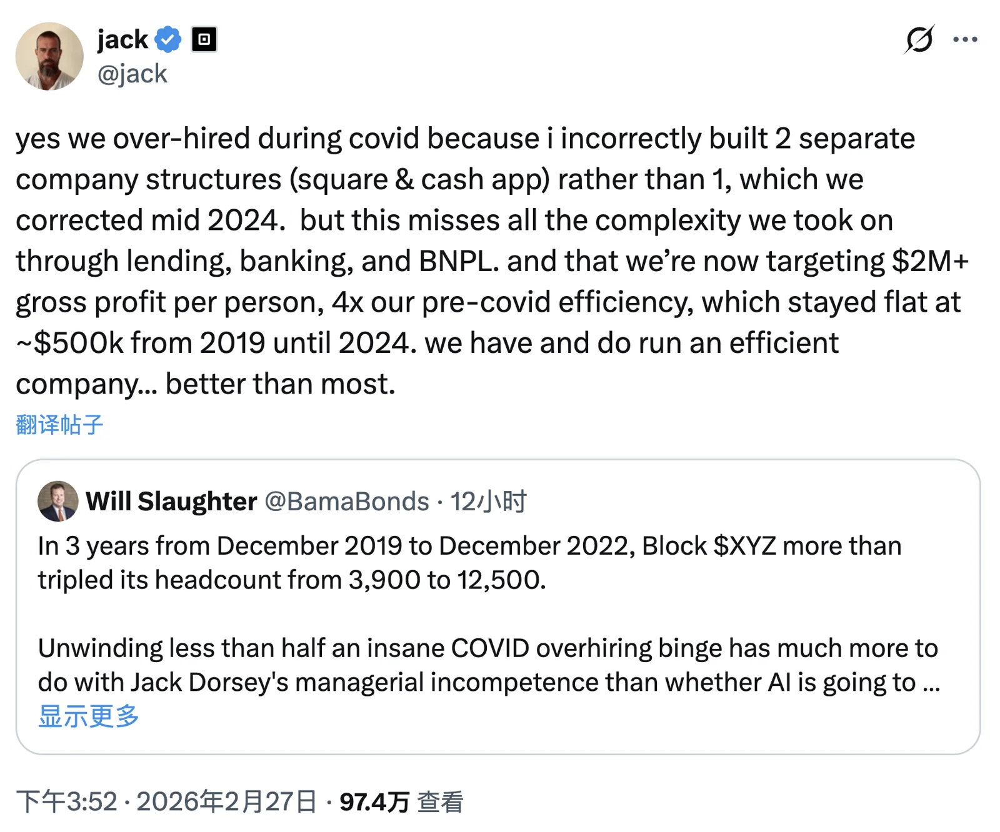
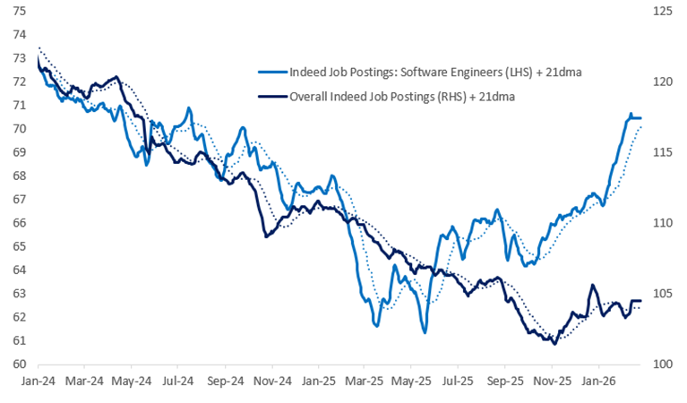
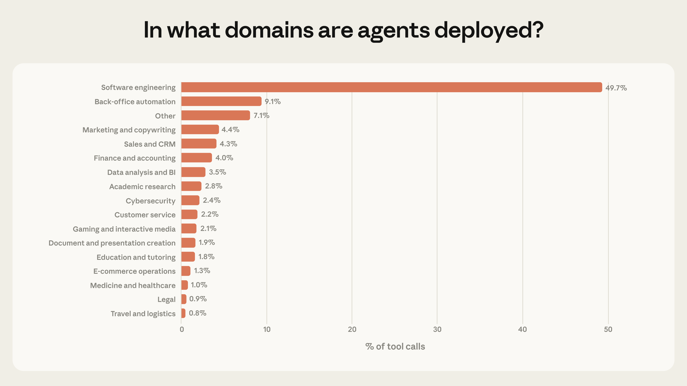

Yesterday brought a bombshell. Twitter founder Jack Dorsey's Block cut 40% of its staff in one stroke. More than 4,000 people are leaving, shrinking the workforce from over 10,000 to fewer than 6,000.

The explanation, of course, was AI. Dorsey went further: within a year, most companies will make similar structural changes.

Block's stock surged 24% after hours. The market voted with its wallet: good move.

But look more closely. Block had just 3,800 employees at the end of 2019. Its headcount ballooned past 10,000 during the pandemic, while its stock fell 75% over roughly the same period.

This is not AI replacing people. It looks much more like the pandemic bubble finally coming due.

AI merely gave management a respectable story to tell. Not "we screwed up," but "the times have changed."

**The AI narrative is becoming the perfect excuse for corporate layoffs.**

That is the first layer.

------

But the story is only beginning.

That same week, a macro note from Citadel Securities observed that US software engineer hiring was up 11% year over year at the start of 2026.

Not down. Up—and against the backdrop of an otherwise flat hiring market.

> https://www.citadelsecurities.com/news-and-insights/2026-global-intelligence-crisis/

Block is cutting 40% of its workforce while hiring across the industry is rising. How can both be true?

This is the Jevons paradox. When steam engines became more efficient, coal consumption rose instead of falling. Coal became cheaper to use, so the number of things worth doing with it exploded.

AI is doing the same thing to programming. As the cost of producing software approaches zero, demand does not disappear. Instead, it is unleashed at massive scale.

The Citadel report makes another apt comparison. In 1930, Keynes predicted that rapid productivity growth would leave humans working just 15 hours a week.

He got the direction right and the outcome completely wrong. Humans did not choose to work less. They chose to consume more and want more.

**Big companies are optimizing existing headcount. New demand across the wider economy is exploding.**

That is the second layer.

------

The third layer is what I really want to talk about.

YC's Garry Tan shared a striking figure: software engineering accounts for nearly 50% of AI agent tool calls.

Healthcare, law, finance, and more than a dozen other verticals, meanwhile, remain almost blank canvases. Jensen Huang made a similar point at Davos: models for these industries are, "for the first time, good enough to build applications on top of."

> Source: [Anthropic: Measuring AI agent autonomy in practice](https://www.anthropic.com/research/measuring-ai-agent-autonomy-in-practice)

What does that mean? The entire AI engineering toolkit is beginning to spread outward.

AI-assisted development, agent building, and automated engineering practices will follow programmers spilling out of Big Tech into traditional industries. Over the next year or two, these people will drive explosive productivity gains across every industry. (And bring a genuinely staggering unemployment rate with them.)

There is a brutal and obvious logic at work: **people who cannot use AI will be steamrolled by people who can.**

--------

Turn that around, though. If you are a programmer—even a junior one—you already have an enormous head start.

You know SSH. You know the command line. That alone puts you ahead of the vast majority of people in most industries.

You also know how to get around the Great Firewall, giving you access to Codex and Claude Code. That leaves another large group behind.

And if you understand a little context and harness engineering—if you know how to harness the open-source ecosystem—you can run circles around people in many industries.

Everyone says AI will wipe out programmers. I think the opposite: **if you have already crossed the threshold into programming, you have little to worry about in the short term.**

AI really is eliminating jobs that consist purely of coding. But compared with people in other industries, you have every advantage. The key is deciding where to go.

AI is a force multiplier. The old 10x programmer is now 100x and may eventually become 1,000x. If you are not near the top, life inside the software and internet sector will only get harder.

Move into another industry, however, and you start much farther ahead. That is not boasting; it is simply the reality of today's skill distribution.

In most industries, digital competence still stops at basic office software (Windows + Office). It is not that these people lack ability. Most have simply never had the chance to work with terminals, command lines, and automated workflows.

Take Claude Code into those industries to automate processes, analyze data, or build agent pipelines, and your productivity advantage will be almost unfair.

------

I am watching this happen firsthand.

I build Pigsty, an open-source PostgreSQL distribution designed to lower the barrier to using databases.

In the past, self-hosting a PostgreSQL service still meant provisioning a server, setting it up yourself, and following the documentation. The barrier was already low, but some friction remained.

Lately, fewer people have been asking me setup questions.

Instead, a completely new kind of user has appeared: **they know nothing about the stack, yet use AI to get Pigsty running on their own.**

How? I had already published tutorials on Claude Code and on using it to teach yourself PostgreSQL.

I also showed readers how to buy a GLM API key without needing a VPN and how to set up a learning environment. These users simply tell the agent: "Find me a solution and deploy PostgreSQL."

The AI discovers Pigsty on its own, downloads it, configures it, and deploys it from end to end. The barrier drops straight to zero.

--------

Now consider something else I have long advocated: leaving the cloud and self-hosting. Plenty of people can do the math.

For steady, predictable workloads, self-hosting can cost one-tenth to one-twentieth as much as the public cloud. Even self-hosting on cloud VMs can cut costs severalfold.

But people were afraid to do it before because they lacked the skills. Operating a self-hosted database cluster was beyond them.

Now a junior operations engineer with AI can do work that once required a mid-level or senior DBA or SRE.

This is AI's **second-order effect**.

Everyone talks about the first-order effects: replacing programmers, making coding more efficient, and cutting jobs.

But the second-order effect is what truly changes the landscape. Once barriers fall to zero, all that latent demand erupts.

Leaving the cloud and self-hosting is only one example. Behind it are countless things people once wanted to do but could not. Now they are not only possible; they are economically compelling.

Those use cases are where the growth is now.

That is why I say programmers do not need to panic. AI is not coming to steal your livelihood. You can use it to carry your skills into a much wider range of industries.

Even if you start learning Claude Code or Codex from scratch today, you are already several strides ahead of the average person.

What are you waiting for?
