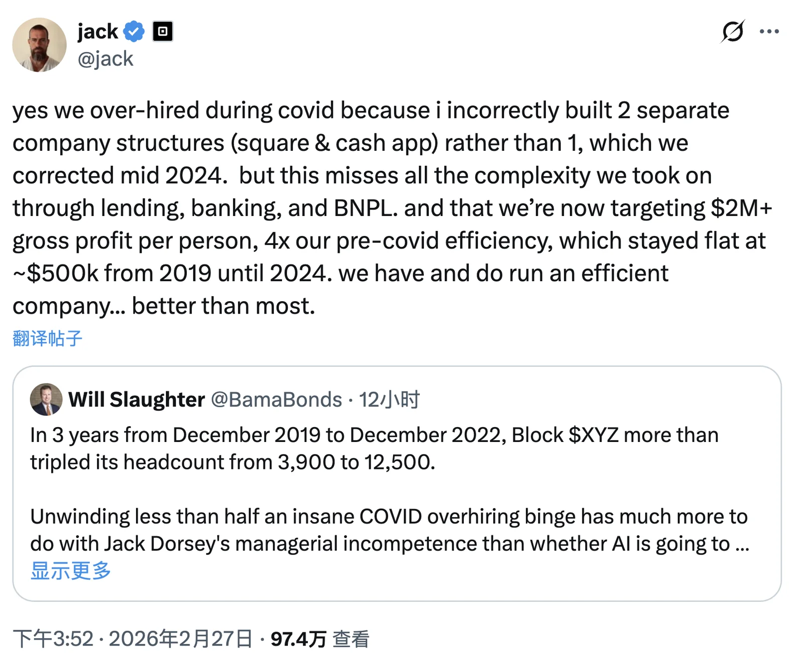
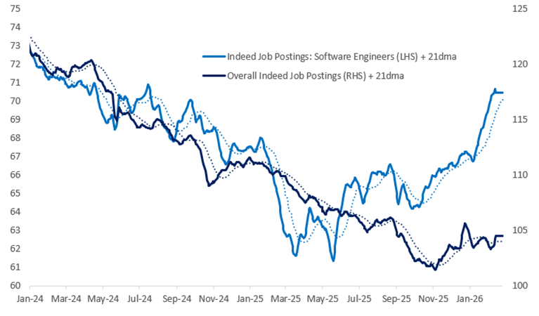
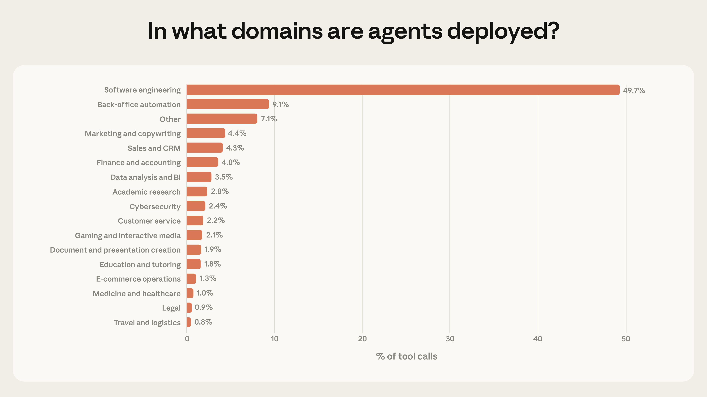

昨天一条大新闻炸了圈。Jack Dorsey （原本推特的创始人） 的 Block 公司一刀砍掉 40% 员工，四千多人走人，从一万多缩到不到六千。
理由当然是 AI。Dorsey 还放了句狠话：一年之内，大多数公司都会做出类似的结构性调整。

消息一出，Block 股价盘后暴涨 24%。资本市场用真金白银投了票：裁得好。

但你仔细看：Block 在 2019 年底才三千八百人，疫情几年膨胀到一万多，股价同期跌了 75%。
这哪是 AI 替代了人。这更像是疫情泡沫终于到了清算的时候。

AI 只不过给了管理层一个体面的说法。不是“我们搞砸了”，而是“时代变了”。

**AI 叙事正在成为企业裁员的完美借口。**

这是第一层。

------

但故事到这里才刚开始。

就在同一周，Citadel Securities 的宏观观察指出：2026 年初，美国软件工程师岗位招聘量同比涨了 11%。
注意，不是跌，是涨，而且是在整体招聘平淡的背景下逆势上涨。

> https://www.citadelsecurities.com/news-and-insights/2026-global-intelligence-crisis/

一边是 Block 砍掉 40% 的人。一边是行业招聘在涨。这两件事怎么会同时发生。

这就是杰文斯悖论。简单讲，蒸汽机效率提高后，煤炭消耗不降反升，因为煤变便宜了，能烧煤做的事就爆发了。
AI 对编程干的是同一件事。软件生产成本趋近于零，需求没有消失，反而被大规模释放出来。

Citadel 报告里还提了一个很妙的类比。凯恩斯在 1930 年预言，生产率飞速提高后，人类每周只需工作 15 小时。
方向判断是对的，结果判断完全错了。人类没有选择少干活，而是选择了消费更多、需求更多。

**大公司裁人是存量优化，全行业的增量需求在爆发。**

这是第二层。

------

第三层才是我真正想说的。

YC 掌门人 Garry Tan 分享过一个数据：软件工程占 AI Agent 工具调用量接近 50%。
而医疗、法律、金融和其他十几个垂直行业，基本还是一片空白。
老黄在达沃斯也说过类似的话：这些行业的模型“第一次好到可以在上面构建应用了”。

> 来源：[Anthropic：Measuring AI agent autonomy in practice](https://www.anthropic.com/research/measuring-ai-agent-autonomy-in-practice)

这意味着什么。意味着 AI Engineering 这一整套东西正在向外扩散。
它包括 AI 辅助开发、Agent 构建、自动化工程实践，并会随着这波从大厂溢出的程序员，进入传统行业。
一到两年内，这些人会爆炸性提高全行业生产力。（并带来真正惊人的失业率）

这里面有一个残酷的显性逻辑：**不会用 AI 的人，会被会用 AI 的人打爆。**

--------

但反过来想，如果你是程序员，哪怕只是初级程序员，你其实已经占据了极高的先机。

你会用 SSH，会用命令行。光这一条，你就已经打败了绝大多数行业从业者。
你还会科学上网，能用上 Codex 和 Claude Code。这又甩开了一大批人。
如果你再懂一点 Context & Harness Engineering，知道怎么 harness 开源生态的能力，基本可以在很多行业横着走。

大家都在说 AI 要消灭程序员。我的观点恰恰相反：**你都已经迈入程序员门槛了，短期根本不用焦虑。**

AI 确实在消灭纯 coding 的工作。但你相比其他行业的人，占尽了先机。关键是你要想清楚往哪走。

AI 是一个效能倍乘器。原来的 10 倍程序员，现在变成了 100 倍，以后还有可能拉大到 1000 倍。
你如果不是那个头部，在软件/互联网行业里只会越来越难受。

但当你跑到其他行业时，你的起跑线会明显更高。这不是在吹牛，而是现实里的能力结构差异。
绝大多数行业的数字化能力仍停留在基础办公软件层面（Windows + Office）。
很多人并不是能力不行，而是过去没有机会接触终端、命令行和自动化工作流。
你拿着 Claude Code 去这些行业做自动化、做数据分析、搭 Agent 流水线，在效率上基本上是在降维打击。

------

我自己就在亲眼见证这件事。

我做 Pigsty 这套 PostgreSQL 开源发行版，一直在降低数据库使用门槛。
以前大家自建 PG 数据库服务，还要搞一台服务器自己搭，跟着文档走。
虽然门槛已经很低了，但还是有一点摩擦。

最近来问搭建问题的人少了。
但出现了一种全新用户画像：**他们什么都不懂，但靠 AI 自己把 Pigsty 跑起来了。**

怎么做到的。我之前发过 Claude Code 教程，以及如何用 Claude Code 自学 PG 的教程。
还教过大家怎么不翻墙买 GLM Key，搭学习环境。这些用户就在环境里直接跟 Agent 说：“你去给我找个方案，把 PostgreSQL 部署上来。”
然后 AI 自己搜到 Pigsty，自动下载、自动配置、自动部署，一条龙搞定。门槛直接归零。

--------

再想想老冯之前一直倡导的“下云自建”。很多人其实算得清这笔账。
持续稳定负载下，自建比公有云便宜十几二十倍。
就算用云服务器自建，也能便宜几倍。

但以前不敢做，因为没那个能力，运维一套自建数据库集群搞不定。现在呢。
一个初级运维拿着 AI，就能做到过去中高级 DBA 或 SRE 才能干的事。

这就是 AI 的**二阶效应**。
大家都在讨论一阶效应：替代程序员、提高编码效率、裁员。
但真正改变格局的，是二阶效应。门槛归零之后，那些原本被压抑的需求会爆发出来。

下云自建只是一个缩影。背后是无数“以前想做但做不了”的事情。它们现在不仅能做，而且经济上极度划算。

这些场景，就是当下的增量。

所以我说，程序员不用焦虑。不是 AI 要抢你饭碗，而是你可以拿着 AI，把能力迁移到更广阔的行业场景里。
你就算现在零基础开始上手 Claude Code 或 Codex，都已经领先社平好几个身位。

还等什么呢？
