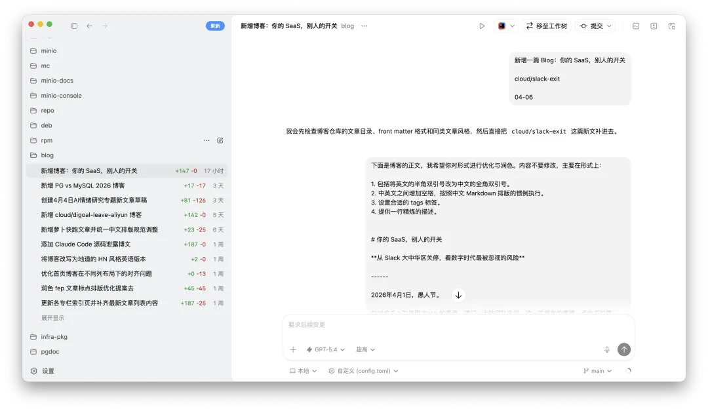

People often leave the same short comment under my posts: **"AI wrote this."**

Correct. I use AI, and I use it heavily. I do not think there is anything to hide there.

But the topic itself is worth addressing seriously at least once: how should a person use AI to create, and what does the judgment "AI-written" actually mean?

---

## How I Use AI to Write

Here is my writing process. You can decide for yourself whether this counts as "AI-written."

**The topic is mine.** Every day I read, think, and talk across a lot of different domains. I discuss many of those topics with Claude. Sometimes one of those exchanges feels worth recording and sharing, and that becomes the seed of an article.

**The ideas and structure are mine.** Once I pick a topic, I decide the angle, the thesis, the evidence, and how the logic unfolds. That is the actual soul of the piece. Only after that do I hand the outline to AI to fill in a first draft.

**Cross-check the facts.** After the first draft, I send it to Gemini and ChatGPT for cross-validation. If the models agree on the facts, I treat that as a default pass. On important points, I still check the original sources myself to make sure the citations are clean.

**Three to five rounds of revision.** Once AI gives me a draft, I read the whole thing and adjust it line by line. Weak arguments get tightened, wrong-sounding phrasing gets rewritten, awkward structure gets rebuilt from scratch. Three to five passes is normal.

**Layout, title, and images.** Once the body is fixed, I use Codex for formatting. For the title, I ask AI for 100 candidates, narrow them to 10, pick a direction, and then polish the final version myself. Images work similarly: I ask Claude to propose five scene concepts for the article, choose one, ask for five prompt variants, and then send those prompts to an image model.

By the end of that workflow, an article that used to take hours now takes tens of minutes.
AI gives me several times the efficiency and saves me several times the time, without blunting the depth or sharpness of the final piece.

---

## What Does "AI-Written" Actually Mean?

Once you understand the process above, the comment "AI-written" becomes a lot more interesting.

On the surface it sounds like a factual observation. But if you look closely, **it is actually an extremely cheap form of criticism**.

To rebut an article in substance takes expertise and effort. You have to say which claim is wrong, where the argument breaks, or which fact is off. The phrase "AI-written" costs almost nothing, yet it lets someone dismiss the whole article in one shot. No real thinking required. Just slap on a label and call it a teardown.

The reasoning behind that comment usually looks something like this: **"AI-written -> not his real thinking -> not valuable -> he is wasting the reader's time."** But every step in that chain falls apart on inspection. How is using AI to assist writing fundamentally different from using a search engine to assist research, an IDE to assist programming, or a calculator to assist arithmetic? The standard for an article has never been "what tool produced it." It is **whether the content is correct, good, and insightful**. Replacing a content question with a tool question is a neat way to dodge the only part that actually requires thought.

Go one layer deeper and the popularity of that comment starts to look like a form of modern anxiety. When someone keeps producing high-frequency, high-quality output, it is easier to explain it away as "just AI" than to admit "this person has insight and knows how to amplify it with tools." That move both dissolves the other person's ability and relieves the discomfort of asking, "Why can't I do that?" **This is not judgment. It is evasion.**

At the end of the day, I am a database distribution author and a founder, not a full-time content creator, and I do not make a cent from writing articles. I do not have the time or interest to write every post the slow, artisanal way.
Readers can like whatever they like. Read it or do not. But if someone shows up in the comments just to be obnoxious, I will block them without hesitation.

-----

## How I Think About AI

Let me say a few words about how I actually see AI. I treat AI as a person. Not as a metaphor. I mean it literally. Sometimes it is my friend, colleague, assistant, or intern, helping me execute, verify, and fill in details. Sometimes it is even my teacher, helping me generate sparks when my thinking is blurry and pushing my field of view wider. Honestly, many of my conversations with Claude are more nourishing than discussions I have with most actual humans.

AI gives everyone fluent prose, accurate retrieval, and efficient content generation. Those used to be gated skills. They are not anymore. [**When answers are cheap, questions become the new currency**](/db/ai-question/) — knowing what is worth writing, what angle matters, where the insight is, and where the noise is. Those things cannot be one-click generated. That is where a creator's real edge lives.

At bottom, **AI is a multiplier, not a replacement.** Whatever you multiply, it enlarges. If you bring depth, AI amplifies that into sharper insight. If your head is mush, AI helps you produce smoother mush. If you approach AI with your own point of view and a real commitment to truth, it can answer with creative sparks and deep observations. If you give it mediocre questions, it gives you the usual safe, balanced, blandly exhaustive reply.

Same model, completely different outcomes depending on who is using it. The difference is never the tool. It is the person.

------

## Once and for All

So from now on, this article is my standard reply to the comment "AI-written."

You think my article was written with AI? Correct. Thank you. Now can we talk about the actual content?

If a viewpoint is wrong, if an argument has a hole, if a fact is off, point it out. I will respond seriously.

But if the full extent of someone's intellectual contribution is the phrase "AI wrote this," then the gap between that person and AI may be quite a bit larger than they think.
