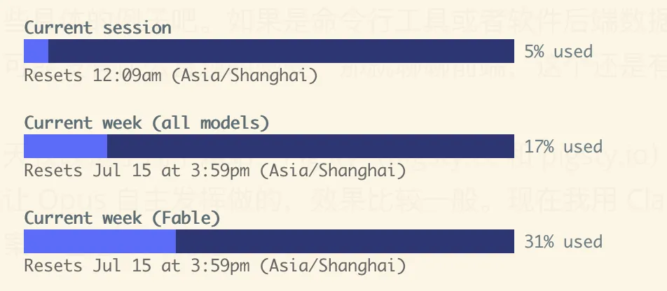
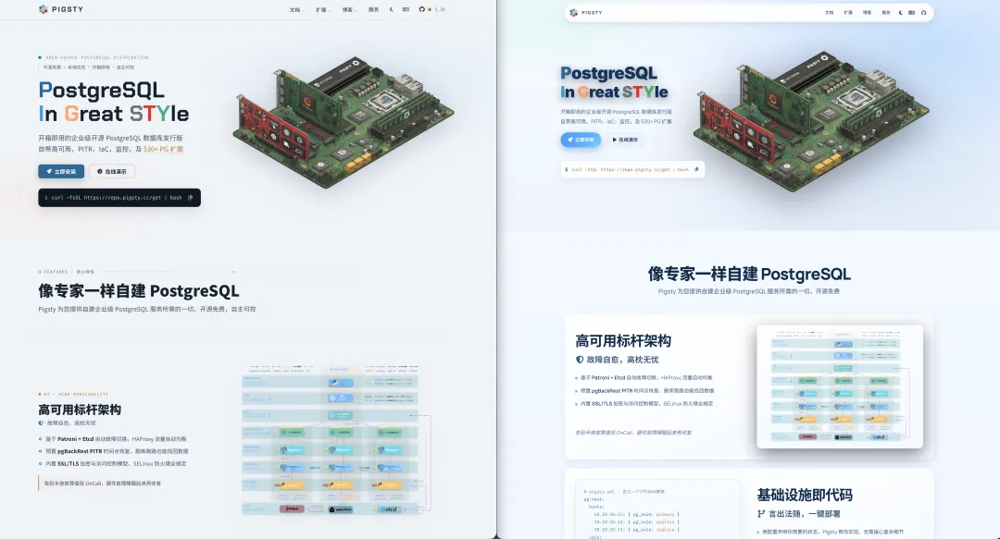
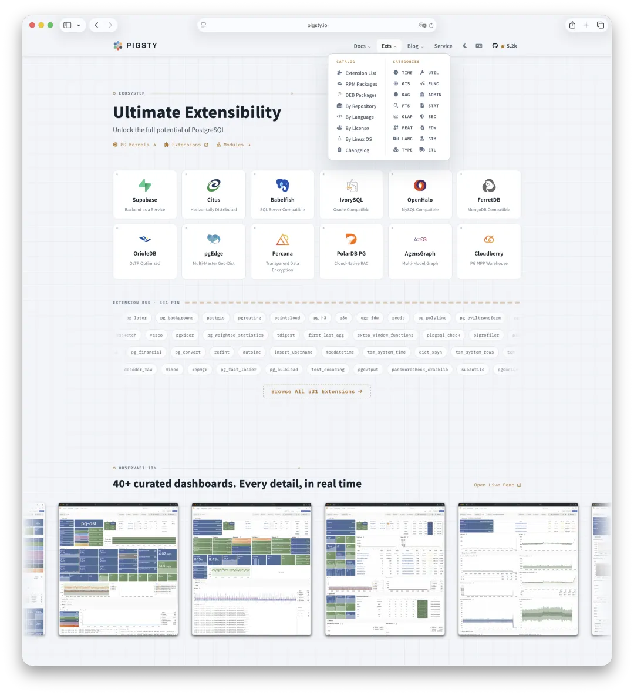
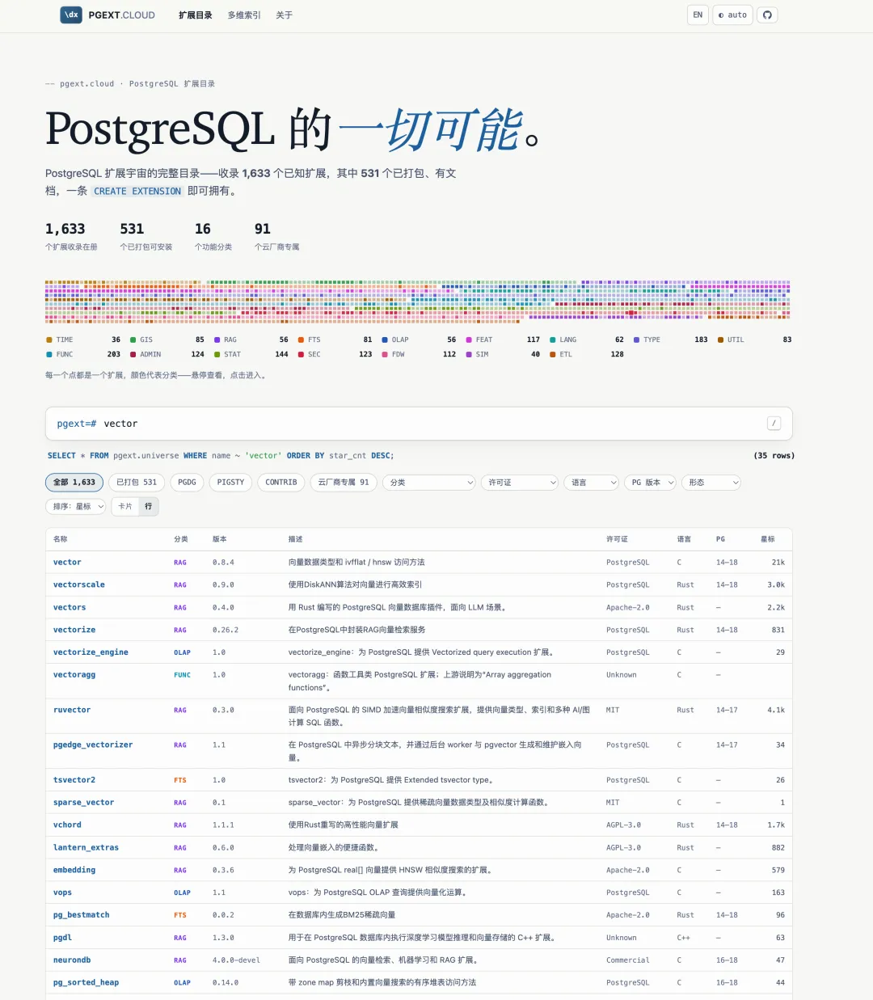
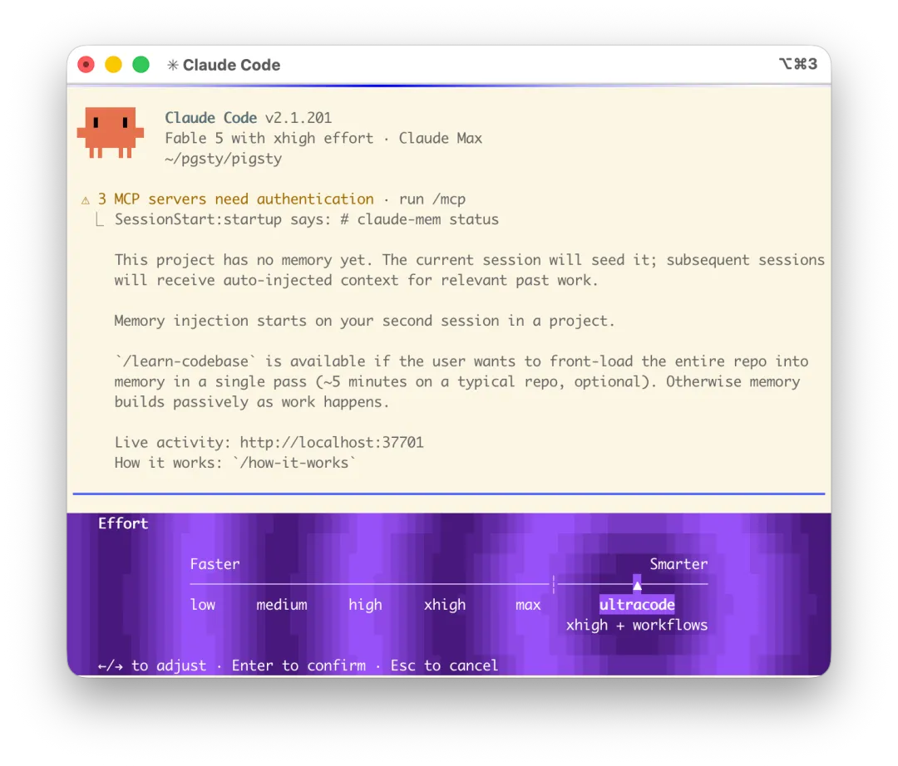
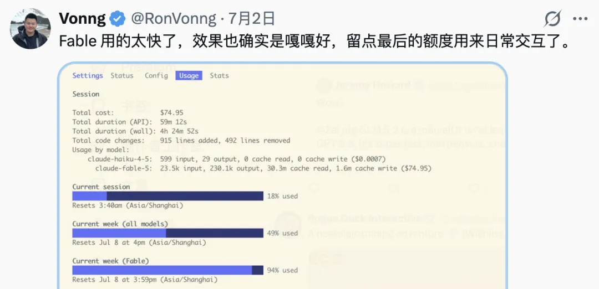
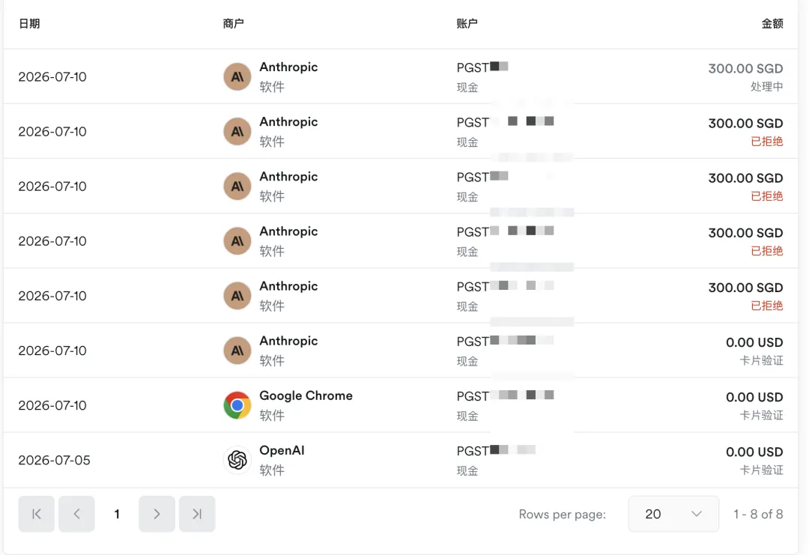
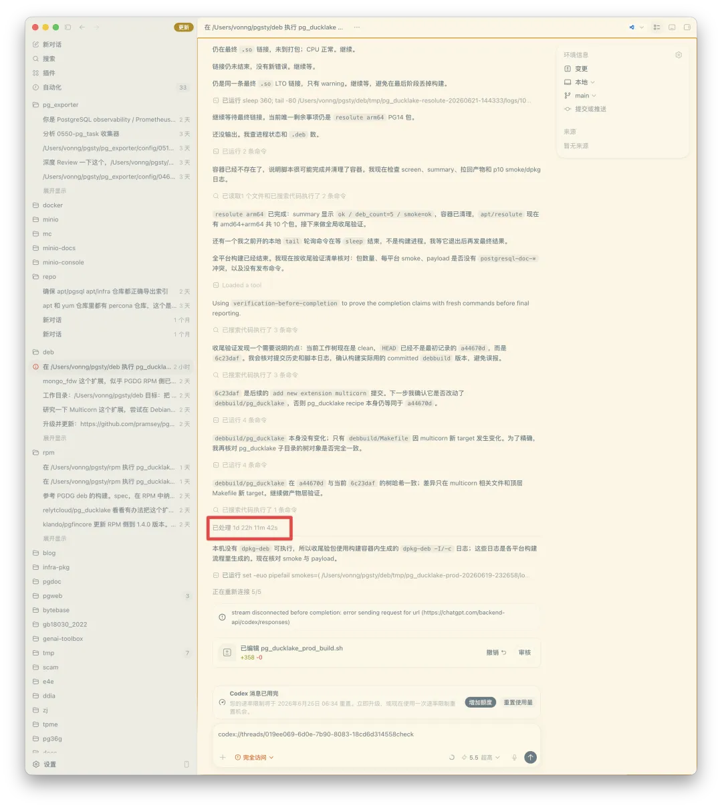

Folks, I haven't had time to write these past couple of days: I've been too busy pedaling the AI bike. Claude Fable and GPT-5.6 arrived one after the other, and both companies generously threw in several rounds of quota resets. Suddenly I was swimming in quota. I've been racing to spend it—who knows, they might reset again tomorrow morning, and anything left would be wasted.

Yesterday hurt the most. After Fable's first reset, I decided to ration it this time so I wouldn't burn through everything in two days and spend the rest of the week staring at an empty tank. I used only 20 percent. The next day, Anthropic announced another reset. I was gutted. That was real money down the drain.

Let's run the numbers. Max out a week's Fable quota and you can squeeze out roughly three to five million output tokens. At around a 90 percent cache hit rate, that has a nominal API value of more than $2,000, or roughly RMB 10,000. I tried to conserve it, only to have the reset wipe it out—more than RMB 8,000 in value simply evaporated. I could have kicked myself. Even by subscription standards, that's a painful amount to leave on the table.

This is the definition of “use it or lose it.” Quota doesn't roll over; every credit you save is value lost, so you have to burn through it as fast as you can. Codex resets again tomorrow. Today I've been dreaming up every exotic assignment I can throw at it.

## Fable 5 and Codex 5.6 in Practice

The new models have been out for a couple of days, and we've put them through their paces. I'm not bored enough to stage an artificial bake-off, but regular use has given me a pretty good sense of their relative strengths. When you have two models review each other's work, the one that finds more flaws in the other's output is usually the more perceptive model. By that test, I still think Claude Fable is stronger than Codex 5.6 Sol.

Codex's advantage is sheer volume, and I have two accounts, so I can run it hard. In practice, the two need a division of labor. Fable is wildly imaginative, freewheeling, and creative; Codex is a stable, dependable executor. To get the best from both, I arrange the workflow like this: Fable handles the high-level design; Codex implements it; then Fable/Opus and GPT-5.6 take turns reviewing the result until the quality converges.

Let's look at some concrete examples. If I tell you what problems the models solved in a command-line tool, backend service, or database project, the quality is hard to see. Frontend work makes the difference much more obvious.

Today, for example, I revamped several sites, including the Pigsty homepages at pigsty.cc and pigsty.io. The previous versions dated from the Claude Opus 4.6 era, when I simply let Opus improvise, and the results were mediocre. This time I asked Claude Fable to redesign them while preserving the original copy and improving the presentation. The redesign is on the left; the old version is on the right.

The result is much better. Fable substantially improved the homepage's overall visual design and presentation. It also transformed the documentation site: I had it restyle the Docsy framework's CSS to match. Half an hour later, the whole docs site looked new. I made only two or three rounds of small tweaks before shipping it. The documentation site you see today is that new version.

For something built from scratch, I gave it the source data from a PostgreSQL extension repository and asked: could you build a site where users can search for extensions and browse the information in a more elegant format?

A little over ten minutes later, it had slapped together a new site in one shot, and I thought it looked pretty good. Fable is seriously capable. On Alibaba's engineering ladder, I would put it at P8 level—a senior expert across domains.

## An Expensive Lesson

Don't run Claude Code in UltraCode mode.

I couldn't resist turning on Ultrathink, wiring it into a Workflow, and giving it a code-review task. That one job burned through the entire five-hour quota and drove my weekly usage from zero to 20 percent. At API rates, that's RMB 4,000 burned in one shot. I was dumbfounded.

As one commenter put it, this is like showering in premium bottled water. The shower felt great; the bill didn't. Call it tuition.

Over the next few days, even the Max quota couldn't take much abuse. A few batches of work drained it, leaving me without Fable for several days and itching to get it back.

My conclusion: spending Fable's precious quota on grunt work is a terrible waste. The right uses are everyday conversation and project planning. Treat it as a mentor, not an intern.

People cast AI in different roles: some use it as a conversation partner, others order it around like an intern. But you can also use it as a teacher or mentor. In that role, it can never be too intelligent—provided you're asking substantive questions. Give Fable nothing but chores and you'll never see what it can really do.

## The Window Is Still Open—Get on Board

I already covered [the subscription question in an earlier article](https://mp.weixin.qq.com/s?__biz=MzU5ODAyNTM5Ng==&mid=2247492449&idx=1&sn=1e2cd4ce8cd8f6d31106441f737c056e&scene=21#wechat_redirect), so I won't repeat it here. Coding Plans offer the best leverage available right now; if you know, you know. Getting one is practically free money. If Codex and Claude are unavailable or too expensive, [China's GLM will do in a pinch](https://mp.weixin.qq.com/s?__biz=MzU5ODAyNTM5Ng==&mid=2247490846&idx=1&sn=1083f1f55a22ac88e3aab24e0907b102&scene=21#wechat_redirect).

As for payment, I recently switched from in-app purchases through the US App Store to subscribing directly with a Singapore Airwallex virtual card, and the experience has been excellent. I currently know of two routes that work: a US App Store account linked to PayPal, or a Singapore Airwallex virtual card. I also know several people who ask friends in the United States to pay on their behalf. That works too. I don't know of any other reliable routes.

But if you're still paying metered rates through an API reseller to run Fable or Codex, you're getting fleeced. At that point, you'd be better off buying GLM's Coding Plan.

## A Few Practical Techniques

Finally, a few concrete tips for using Codex and Claude. Honestly, none of this is especially novel. It's the same old software engineering playbook: work the way you always have and direct AI the way you'd direct people. AI just executes much faster. Still, a few techniques have proved especially useful.

**1. Adversarial review.** Some people now call this “Oracle mode.” It's simply managerial checks and balances: pit two AIs against each other. The points on which they agree are usually more reliable. Where they disagree, repeated discussion and negotiation can eventually produce consensus. That consensus is much more trustworthy than having one AI work in isolation and grade its own homework.

**2. Plan before you build: spec-driven design.** For any project of medium complexity or above, write the documentation and design specification first. Refine and debate the spec until you're satisfied, then generate code from it—instead of charging straight in and pulling a slot-machine lever. Gambling is fine for a tiny task. On a complex feature or engineering project, it turns quality control into a disaster. Spec-driven design solves that problem.

**3. Close the verification loop.** The key to delegating a task is to provide clear acceptance criteria. When I ask an agent to build RPM packages for an extension, for example, I give it two criteria. First, the packages must install and run in my standard container and VM environments; the extension must load without crashing or dumping core. Second, it must design test cases around the major features listed in the official documentation, and every test must pass without errors. Once the acceptance criteria are explicit, the rest becomes much easier. You can launch this kind of job as a GOAL-driven task: with a clear target, the agent will keep iterating until it solves the problem.

**4. Context management matters most.** You need a realistic sense of a task's complexity: can it finish within one session's context window? If not, decompose it to control the complexity. The main technique is to separate planning from execution. Compress the planning phase into a concise SPEC file, then start a fresh session for execution and have it read the SPEC. That saves all the context consumed by the planning process.

**Give grunt work to subagents.** Suppose you need to build an extension on 16 Linux platforms. The main agent should only schedule work, collect results, and dispatch new tasks; subagents should handle the builds on individual platforms. Their contexts fill up with the dirty work, and they return only a summary: did it work, and if not, where did it fail? This preserves the main agent's context, allowing it to keep orchestrating longer, more complex jobs.

**Make use of the final message.** At the last moment before Codex hits its weekly quota, you can launch one enormous task. That task will ignore the quota and keep running until it finishes. With 2 percent of my weekly allowance left, for example, I assigned it a job compiling `pg_ducklake` on 16 Linux platforms. It ran for two full days.

## Everyone Gets to Be the PowerPoint Guy

Overall, working with Claude and Codex now makes for a remarkably pleasant programming experience.

Before resets became this frequent, my daily rhythm went like this: I'd give Claude and Codex a batch of large tasks, then wait roughly half an hour for them to run. During that half hour, I could browse the web, write an article, read a novel, play a round of Honor of Kings, or lie down for a while. Then I'd come back, review the results, and dispatch the next batch.

I maintain Pigsty, a massive PostgreSQL distribution, by myself: tens of thousands of RPM packages and countless components that must be coordinated, integrated, and tested across 16 Linux platforms. Despite working at that scale, I still have time for side projects—and even to [**take over something like MinIO**](https://mp.weixin.qq.com/s?__biz=MzU5ODAyNTM5Ng==&mid=2247491187&idx=1&sn=005af2d12f6f4d258040efbe4faf08bb&scene=21#wechat_redirect). Claude and Codex deserve a great deal of the credit.

I also know this way of working probably doesn't transfer directly to teams. One person working alone has zero communication overhead. In a large company, communication and alignment are the greatest sources of friction. Individuals, one-person teams, and OPCs—One Person Companies—simply don't have that problem. Many of these tactics may not transfer to the enterprise.

I hear Alibaba has recently been experimenting with OPTs, or One Person Teams. I think that's where we're headed: maximizing individual productivity. Imagine that you're a brilliant architect with 20 tireless engineers reporting to you, each working more than ten times as fast as a human. What would that mean? On Alibaba's ladder, the rough mapping looks like this: Haiku is a P5 engineer; Sonnet is a P6 senior engineer; Opus is a P7 expert and workhorse; Fable is a P8 senior expert.

What, then, is P9? P9 doesn't do the work. At Alibaba, that's the “PowerPoint guy”: all talk, grand visions, and slide decks. That's the role you have to play yourself. We now live in an age when everyone gets to be the PowerPoint guy. How many P8s and P7s you can direct depends on your own skill.

