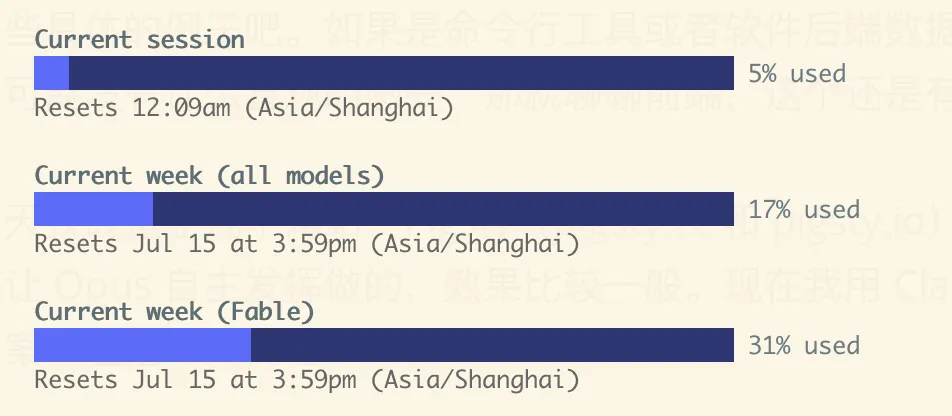
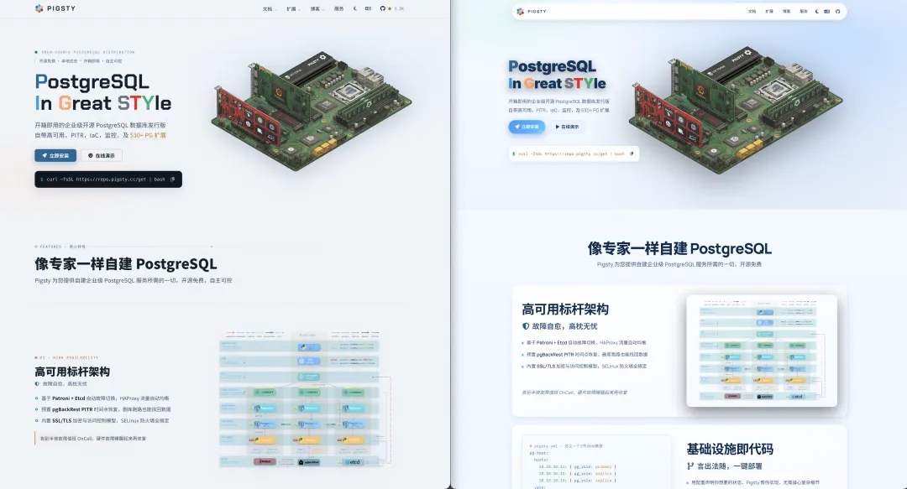
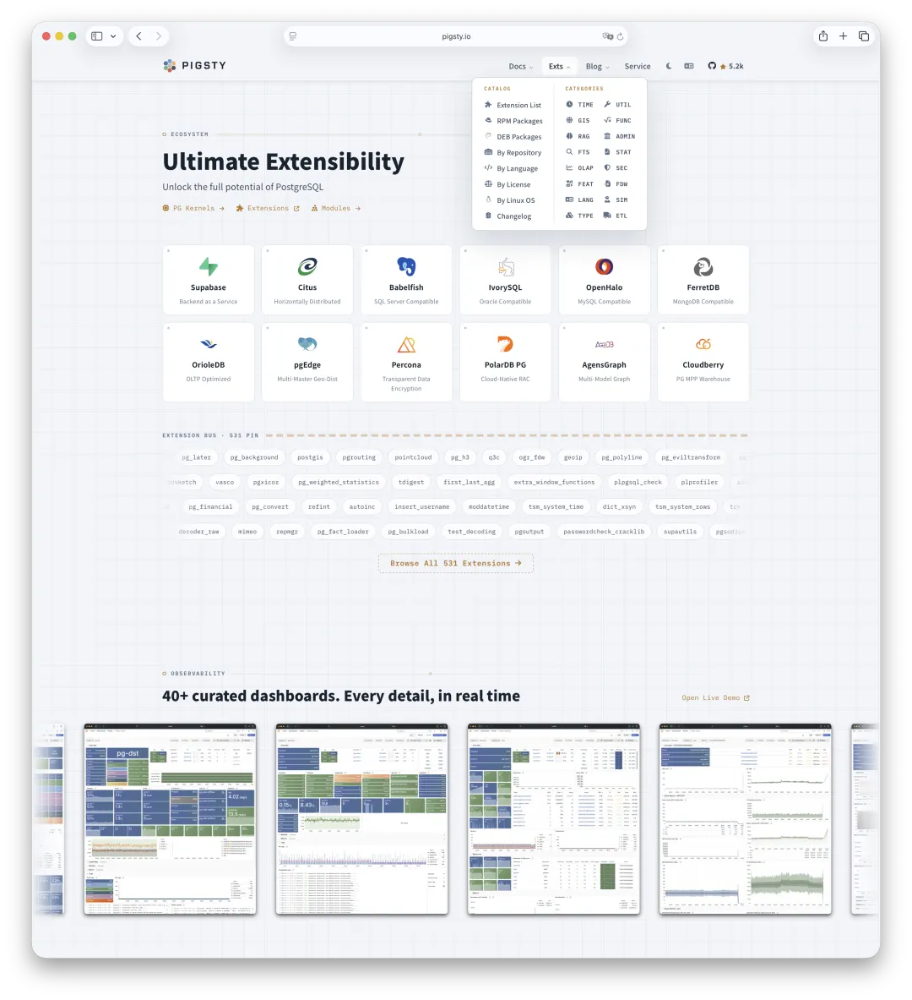
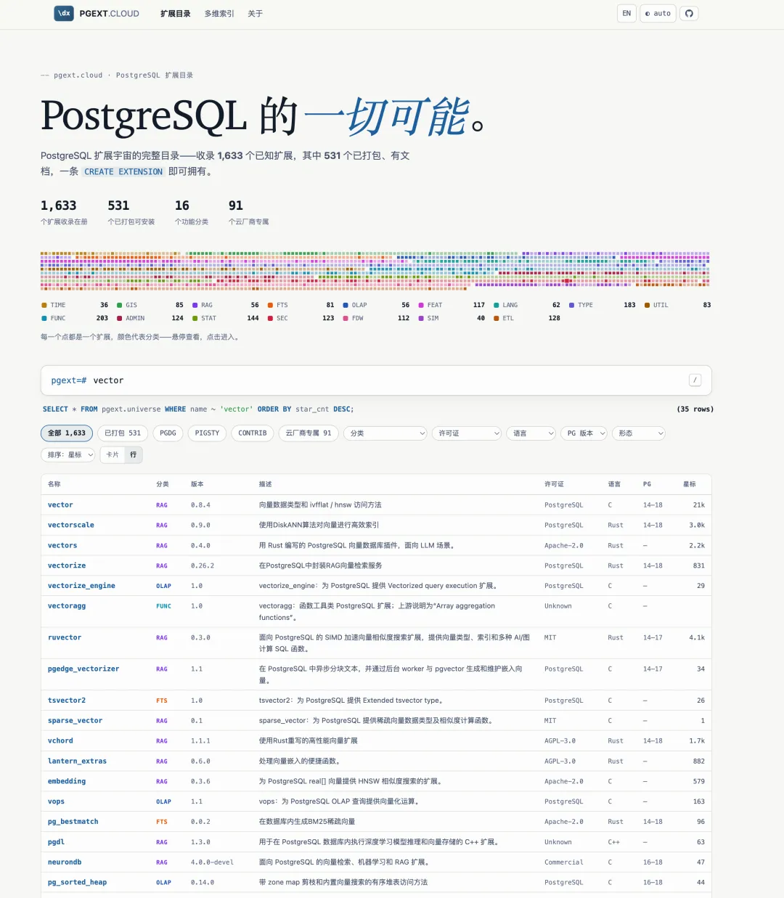
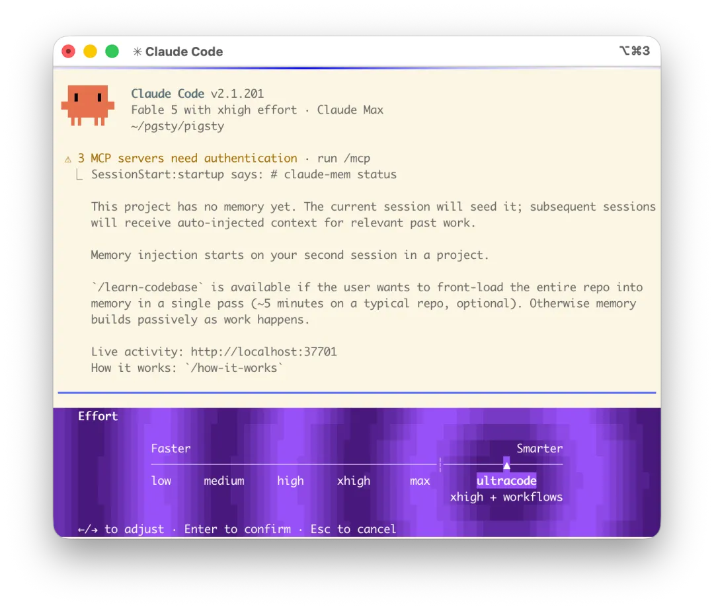
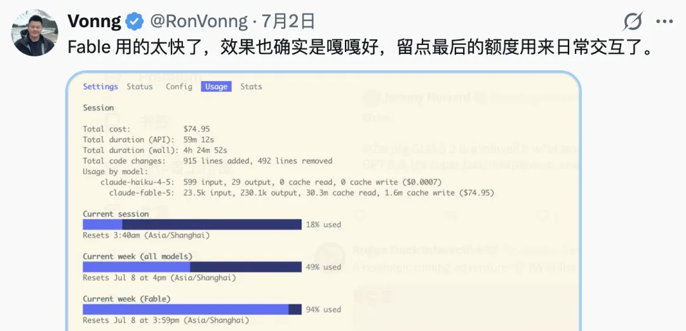
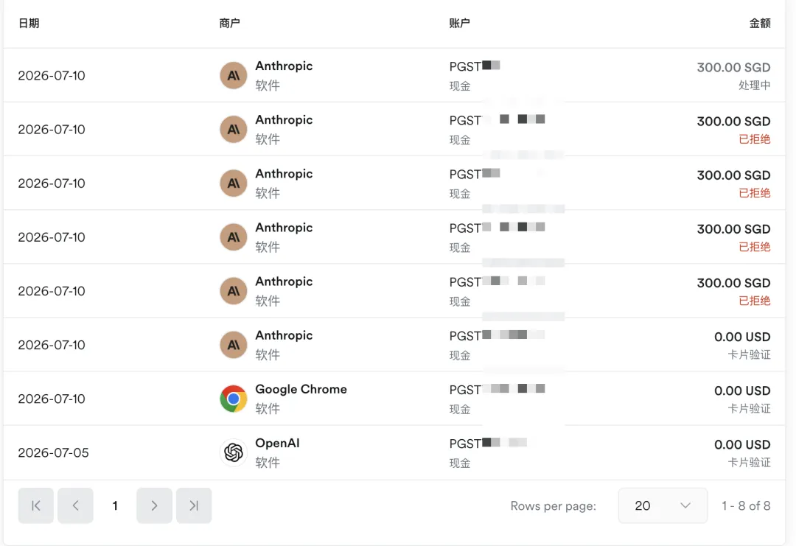
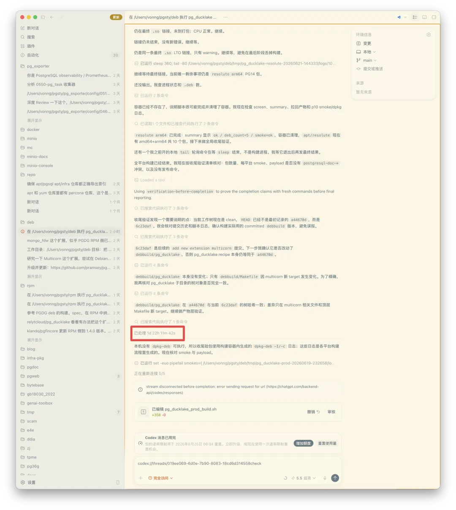

朋友们，这两天没顾上写文章，因为老冯都在忙着蹬 AI 脚踏车。最近 Claude Fable 和 GPT-5.6 前后脚发布，两家还大方地附赠了好几轮额度重置，额度一下子爆炸起来。我正抓紧赶工往外花 —— 说不定明天一睁眼又重置了，那不就白瞎了？

最让我心痛的是昨天：Fable 第一轮重置之后，我寻思这回可得省着点用了，免得和上次一样两天烧完干瞪眼。结果才用掉 20%，第二天官方就宣布——再重置一轮。哎呀，给我后悔的！这可是真金白银的损失。

给大家算笔账：一周的 Claude，如果把 Fable 的额度用满，差不多能榨出三五百万 token 的输出，按照 90% 左右的缓存命中率算，账面价值 2000 多美元，折合人民币一万块钱上下。想省着用结果到期直接清零，相当于白白蒸发八千多块。老冯当场拍断大腿 —— 按订阅计价，那也是损失了老鼻子钱了。

这就是 “有水快流” 的含义：额度这东西攒不住，攒下的每一分都是损失，只能可着劲儿花出去。明天 Codex 又要再进行一轮重置。今天我是变着法儿、变着法儿再给他派各种花活儿。

## FABLE 5 和 Codex 5.6 的体验

这两天新模型发布了，我们也在进行充分的测试。当然，我没那么无聊去专门测试哪个模型更强，但用下来大概也心里有数了。为什么呢？就是你让他们相互 review 的时候，谁能发现对方的问题更多，通常来说这个模型就更有洞察力。在这一点上，我认为 Claude Fable 还是比 Codex 5.6 Sol 更强的。

但 Codex 的好处是量大管饱，而且我还有两个号，可以使劲地造、使劲烧。所以在具体使用上，我个人认为还是要做一个分工。Fable 想象力狂野、天马行空、极有创意；Codex 则是一个稳定可靠的执行者。要把两边的长处都榨出来，工作流应该这么排：Fable 做顶层设计，出总体 Design；Codex 照着做具体实现；然后 Fable/Opus 与 GPT 5.6 轮流 Review 收敛质量。

我们弄一些具体的例子吧。如果是命令行工具或者软件后端数据库项目，我说解决了什么问题，大家对质量可能没有什么直观的感受，那就聊聊前端，这个还是有比较明显例子的。

比如说今天我改造了几个网站，Pigsty（pigsty.cc 和 pigsty.io）的官网。原来在 Claude Opus 4.6 时代，是让 Opus 自主发挥做的，效果比较一般。现在我用 Claude Fable 让它重新设计改进，保留原来的文案，但把形式优化一下。左边是改版的，右边是原来的。

现在这个样子就比之前好多了：官网重新设计：整体视觉和形式上有了很大优化。文档站焕然一新：我甚至让它把 Docsy 文档框架的 CSS 按照这个风格重新定制。半个小时之后，整个文档站焕然一新，我后面只微调了两三轮，基本上就直接上线了。现在大家看到的文档站已经是全新的了。

对于一些从零开始的东西，比如说我手头有一份 PG 扩展仓库的源数据，我说你能不能帮我做一个网站，让用户可以在这里搜索扩展，然后把信息更优雅地呈现出来。

也是这么搞了十几分钟，它就给我糊出来一个新版本的网站，一把出，我觉得看上去还不错。所以 Fable 的能力还是很强的。要我说的话，能比得上一个全领域阿里 P8 的水平了。

## 血泪教训

别在 Claude Code 里开着 UltraCode 模式跑。

老冯手贱开了 Ultrathink 挂上 Workflow，让它跑一个 Code Review 任务，结果一个任务下来，五小时的额度直接被干穿，周额度也从 0 一口气烧到 20%。这要按 API 计费，等于一把火烧掉 4000 块钱，看得我目瞪口呆。

用网友的话说，这叫"用恒大冰泉洗澡"。澡是洗上了，亏也吃下了，就当交学费。

后面几天 Max 档也不太经造，跑了几组活额度就见了底，害得老冯连着几天没有 Fable 可用，心痒难耐。

所以我的结论是：Fable 这点宝贵额度，拿去干杂活是真浪费。正确用法是—— 日常聊天 + 项目规划。把它当导师，别当实习生。

日常聊天时，不同的人把 AI 当不同的角色：有人当聊天搭子，有人当实习生使唤。但你还可以把它当老师、当导师。当导师用的时候，你永远不会嫌它智力过剩——前提是，你问的问题得真有含金量。净派杂活，是发挥不出 Fable 的真实水平的。

## 红利还在，抓紧上车

订阅的事儿，[老冯之前的文章里写过了](https://mp.weixin.qq.com/s?__biz=MzU5ODAyNTM5Ng==&mid=2247492449&idx=1&sn=1e2cd4ce8cd8f6d31106441f737c056e&scene=21#wechat_redirect)，不再重复：Coding Plan 是你当下能撬动的最高红利，懂的都懂，买到就是赚到。买不起、买不到 Codex 和 Claude 的，[国产的 GLM 也能凑合凑合](https://mp.weixin.qq.com/s?__biz=MzU5ODAyNTM5Ng==&mid=2247490846&idx=1&sn=1083f1f55a22ac88e3aab24e0907b102&scene=21#wechat_redirect)。

说到怎么付钱，老冯最近从美区 App Store 内购切到了 Airwallex 新加坡虚拟卡直接订阅，体验相当不错。目前我知道能跑通的路子有两条：一是美区 App Store 绑 PayPal；二是新加坡 Airwallex 虚拟卡。另外也见过几个朋友是请美国朋友帮忙代付的，这也行。别的路子我就不知道了。

但你要是还在用中转站跑 Fable Codex 啥的按量付费，那就真是大冤种了。真到这份上，你还不如去买 GLM 的 Coding Plan。

## 几条实用技巧

最后聊几个使用 Codex 和 Claude 的具体技巧。老实说，没什么特别新鲜的玩意儿，归根结底还是软件工程那老一套：你原来怎么做事、怎么指挥人干活，现在就怎么指挥 AI 干活，只不过 AI 执行得快得多。但具体技巧确实还是有的，老冯觉得最管用的是这么几条。

**一、对抗性 Review（Adversarial Review）。**现在也有人管这叫 “Oracle 模式”，说白了就是管理学里的制衡术：找两个 AI 互相对抗。能达成共识的部分，通常更为可靠；有分歧的部分，通过反复讨论协商，最终也能收敛出共识。这种共识状态，比一个 AI 埋头苦干、自己审自己，要靠谱得多。

**二、先规划再干活，即"规格驱动设计"（Spec-Driven Design）。**中型复杂度以上的项目，先写文档、写设计规格，把 Spec 打磨讨论到你满意为止，再照着规格去生成代码——而不是像抽卡摇骰子一样一股脑上去就干。小活可以赌一把，复杂特性和工程要还这么玩，质量控制就是一场灾难。Spec-Driven Design 就是解这个问题的。

**三、验证闭环。**派任务的关键，是给出清楚的验收标准。比如我让它构建扩展的 RPM 包，验收标准就两条：第一，构建出来的包在我的标准容器和虚拟机环境里装得上、跑得通，加载不 crash、不 core dump；第二，按官方文档列出的主要功能点设计测试用例，全部跑通不报错。有了清楚的验收标准，事情就好办了：这类任务可以用 GOAL-driven 的方式发起——目标明确，它自己就会不断迭代，直到把问题干掉。

**四、上下文管理，重中之重。**你得对一个活的复杂度心里有数：它能不能在一个 session 的上下文里跑完？跑不完，就要靠拆解来控制复杂度。办法主要两个：先规划再执行。规划阶段的思考被压缩成一份凝练的 SPEC 文件；执行阶段直接开新会话读 SPEC，规划过程的上下文就全省下来了。

**让 Sub-agent 干杂活。**比如要在 16 个 Linux 平台上构建扩展，主 Agent 只管调度、收拢结果、派发新任务，具体平台上的构建交给 Sub-agent。Sub-agent 的上下文被脏活累活填满，最后只吐回一句摘要——成没成、挂在哪。主 Agent 的上下文因此得到极大节约，就能撑着调度更久、更复杂的工作。

**利用最后一条消息**，Codex 在周额度打满的最后时刻，可以拉起一个巨无霸任务，这个任务会无视配额，直到完成为止。比如我这里趁着周额度还剩 2%，给它派了个编译 16 系统下 pg_ducklake 的任务，足足跑了两天整。

## 人人都能当嘴哥

总的来说，现在用 Claude 和 Codex 干活，是一种很舒服的编程体验。

在重置还没这么密集之前，我的日常节奏是：给 Claude 和 Codex 派一组大活，它们差不多要跑半个小时。这半小时里，我可以上网冲浪、写文章、看小说、打把王者，或者躺一会儿。半小时后回来验收，再派下一波任务。

老冯一个人维护 Pigsty 这么一个巨型 PostgreSQL 发行版——几万个 RPM 包，无数组件要在 16 个 Linux 平台上协调、集成、测试。面对这种超大规模的工程，我居然还能做到时间有余，可以搞搞副业，甚至去[**接盘个 MinIO** ](https://mp.weixin.qq.com/s?__biz=MzU5ODAyNTM5Ng==&mid=2247491187&idx=1&sn=005af2d12f6f4d258040efbe4faf08bb&scene=21#wechat_redirect)什么的，说起来，Claude 和 Codex 功不可没。

但我也清楚，这套模式多半没法直接外推到团队。一个人干活是不需要沟通的，零 communication 成本；而在大公司里，沟通对齐才是最大的摩擦。个人、一人团队、或者像我这样的 OPC（One Person Company），完全没有这个问题——所以很多打法未必能照搬到 B 端去。

听说阿里最近在搞 OPT（One Person Team），我觉得这确实是大方向：极致释放个人的生产力。想象一下，你是个牛逼的架构师，手下配了二十个不知疲倦、速度是人类十几倍的工程师，那会是什么概念？大致可以这么对号入座一下：Haiku：P5 工程师；Sonnet：P6 高级工程师；Opus：P7 专家、主力；Fable：P8，资深专家。

什么，你问 P9 是什么？P9 是不干活的，在阿里俗称 “嘴哥”。出嘴画饼写PPT —— 这个角色，就得你自己来演了。如今是人人当"嘴哥"的时代，你能使唤动多少个 P8、P7，那就看你自己的本事了。

