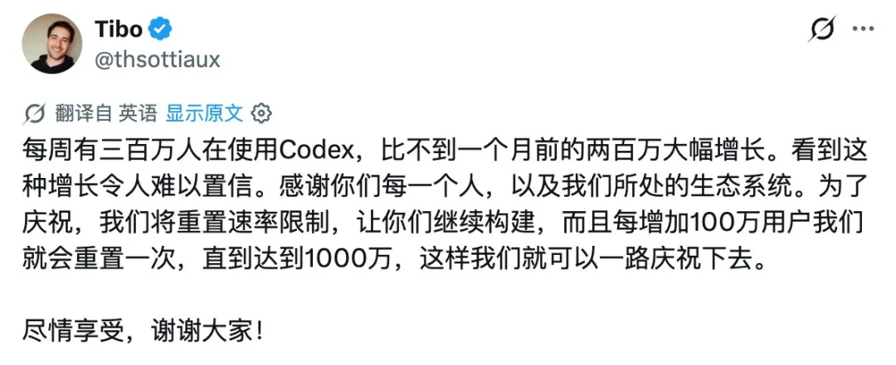
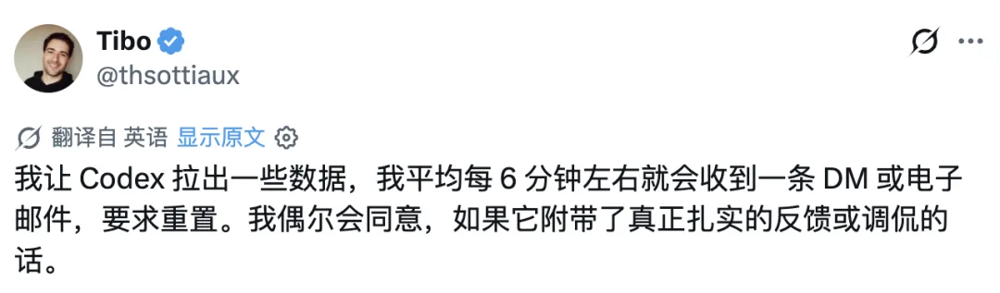
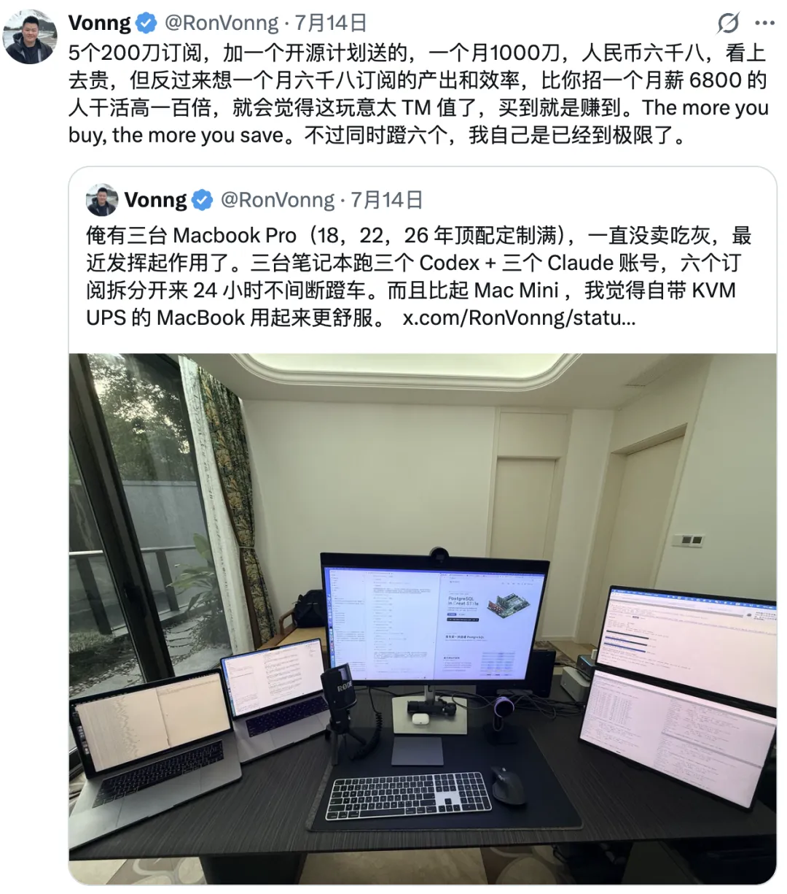
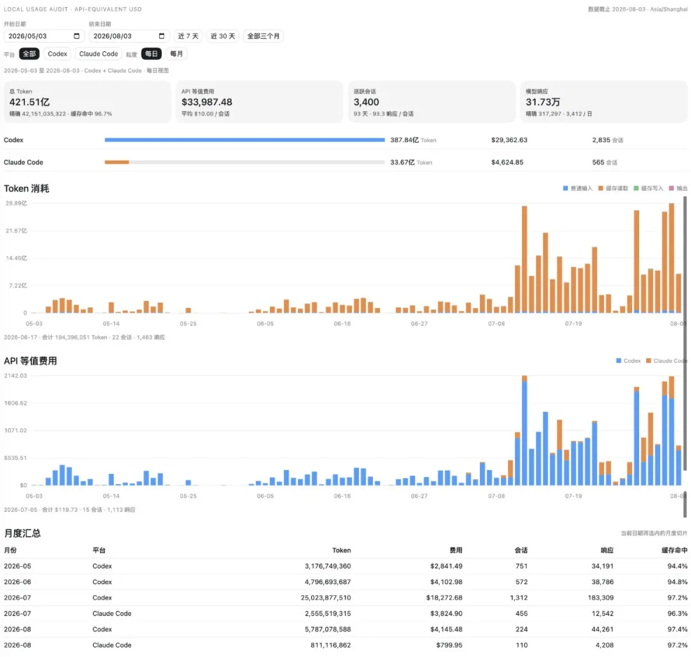
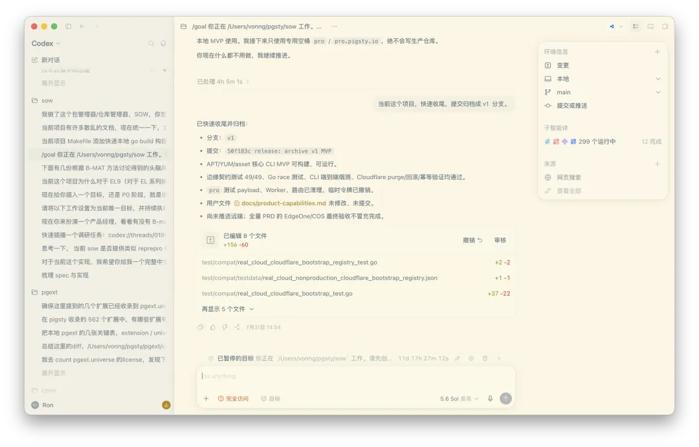

上个月，OpenAI 像是疯了一样，开启了疯狂大放送模式，隔三差五就把所有人的 Codex 额度清零重置，跟超市门口发鸡蛋拉新一个路数。

会员数一路飙升，突破千万大关。负责按下重置按钮的 Codex／ChatGPT 负责人 Tibo，甚至被广大用户封为“圣徒”。老冯每天起床第一件事，就是打开 X 看看圣徒今天有没有显灵。

现在看，鸡蛋是发完了。上一次重置到今天已经六天多，下一次遥遥无期。有人扒出了规律：重置绑的是月活里程碑，用户每涨一百万，额度重置一次，一直涨到一千万为止。

千万之后又是什么规矩？有人在 X 上问 Tibo，是不是已经超过一千一百万了，Tibo 说早就过了。又过了这么多天还是没动静，那基本可以确认——活动收摊了。全民狂欢福利看来是告一段落，现在想要 Reset，基本只能给 Tibo 发私信提建议，等他单独发放了。

有点遗憾。不过鸡蛋本身不值钱，值钱的是这一个月拿鸡蛋换出来的东西。

---

## 有水快流

我之前在《[AI 时代的最大红利](/ai/ai-bonus/)》和其他几篇文章里，多次提醒读者朋友们：有水快流，抓住红利。我自己也在身体力行地践行这一点。

这次 AI 狂欢月，老冯开了 7 个 20× MAX 订阅：ChatGPT 4 个，Claude Code 3 个，跑在三台电脑上。其中 OpenAI 和 Anthropic 各送了一个免费的（给开源贡献者），所以实际付费的是 5 个每月 200 美元的档位，合计 1000 美元。但老冯觉得这 1000 美元花得实在太值了。

当然，比起 Reset 送鸡蛋这种成本维度的福利，更重要的变化是 GPT-5.6 Sol 发布，以及 Fable 进入 Claude 订阅、可以持续使用。两个 AGI 级别的智能模型在 7 月发布并普及，智能水平的跨越式提升，让烧 Token 的性价比一下提高到了史无前例的程度，能做到的事，上限也大大提高了。自主性的提高，进一步加大了人类时间的杠杆——以前一个任务跑一个小时，现在我可以让一个任务跑一周。

一言以蔽之，基本上是把老冯榨干了，脚踏车都蹬冒烟了。读者朋友们可能也发现了，最近一个月老冯基本没怎么写公众号文章，因为实在是没时间。偶尔写的文章也经常被批评 AI 味儿浓，因为我确实没时间写，也没时间去润色打磨。

最近这两天开始写，纯粹是因为活动结束了，订阅都蹬完了。

---

## 消耗与成本

订阅消耗的速度非常快，特别是前一阵子 Codex 取消 5 小时限额之后，基本上老冯每天可以蹬掉一个完整的 Codex 订阅，再加半个 Claude 订阅。Codex 隔三差五就有重置，所以基本还能跟上消耗的速度；但最近一周没有重置，就明显卡到瓶颈了。

*主力电脑上的消耗统计，大约是两个 Codex 加一个 Claude 订阅。*

而且，老冯“薅羊毛”的本事也基本发挥到了极致。之前也介绍过，Codex 在额度即将耗尽的时候，允许你继续运行还没跑完的任务。你可以派很多并行大任务，我观察到，这些任务最多还能额外消耗一周的配额，相当于分量直接 Double。

但即使用上所有这些技巧，还是不经烧。实事求是地讲，Codex 给的量还是很大的，量大“管饱”，但关键是看你怎么用、用在哪里。这一个月，我基本上是把它当成许愿机来用的。就是这种用法，有多少个订阅都不经烧。

当然，这也是有瓶颈的：以现在 Fable 5 和 Codex 5.6 的水平，创作的瓶颈主要就卡在人类许愿和验收的本事上。俺可以许几个大愿望，然后不断验收小愿望。7 个订阅在 Reset 狂欢的时候够用，但狂欢结束后就有点捉襟见肘了。我自己感觉，平常稳定状态会收敛到 6 个 Codex 加 4 个 Claude 订阅，也就是每月 2000 美元。

这看上去贵，但实际上是捡了大便宜。这就跟老黄的那句名言一样：The more you buy, the more you save。所以，很多人经常问的问题是：你烧了这么多 AI Token，到底烧出了什么？哈哈，老实说，多到我都没时间写文章专门介绍了。这个就留给下一篇详细介绍吧。

本文 AI 含量：0％。
