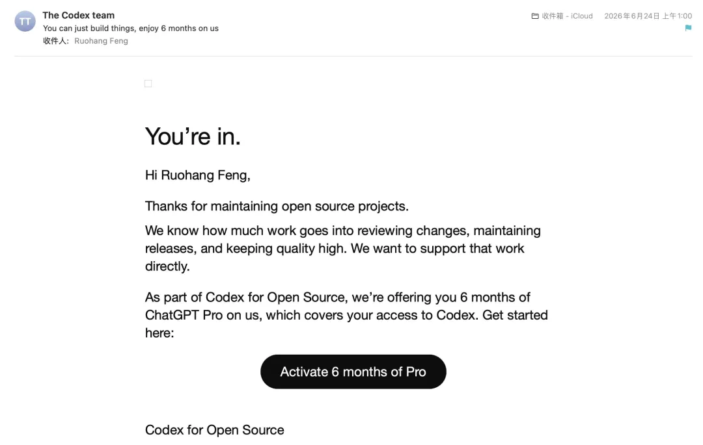
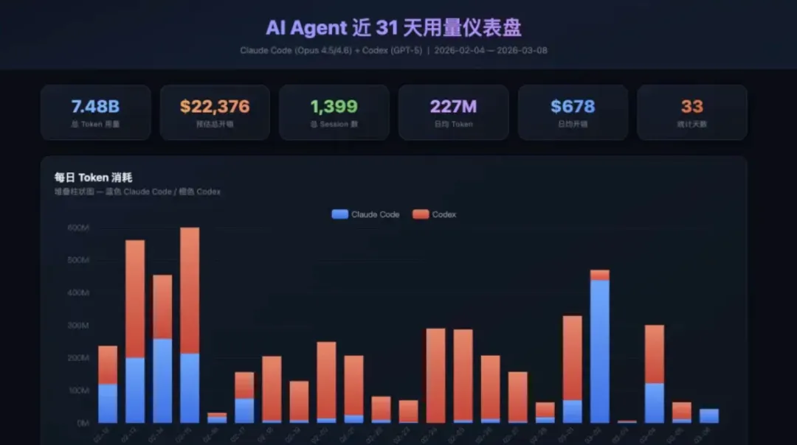
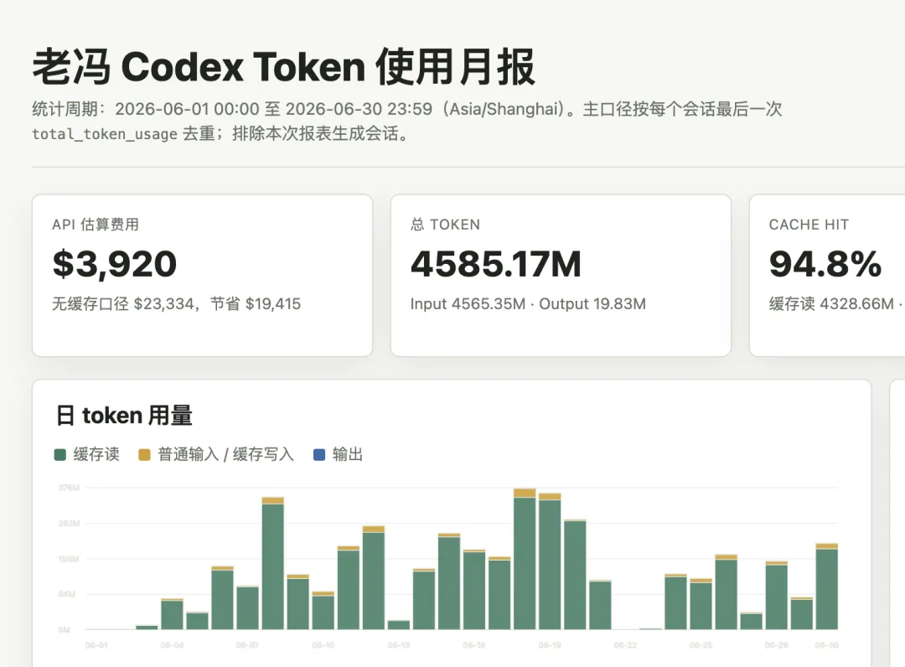
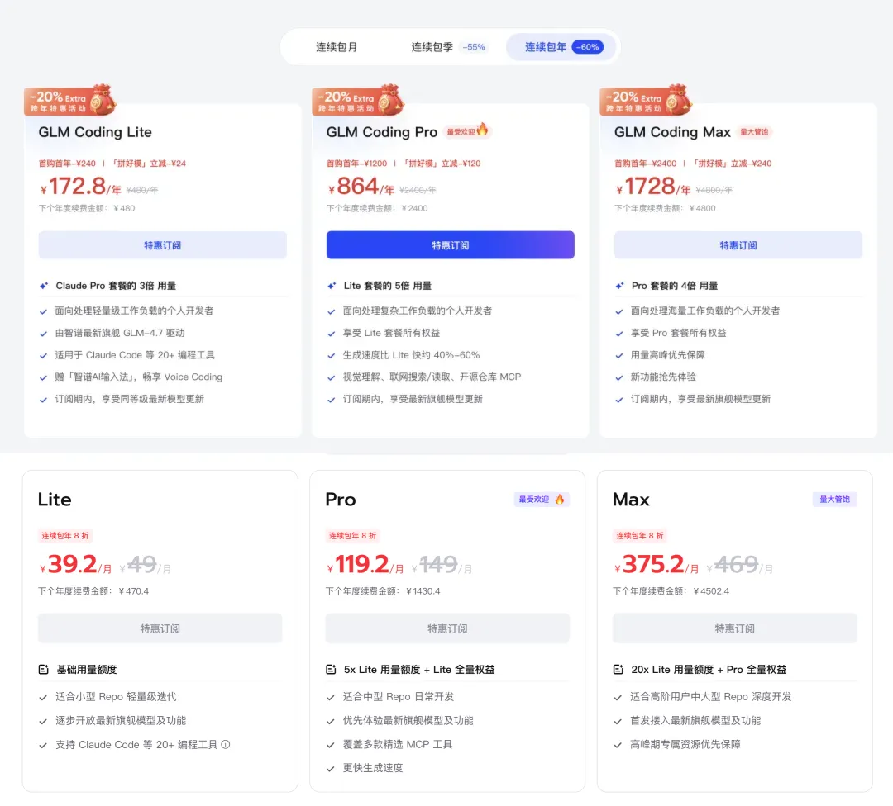
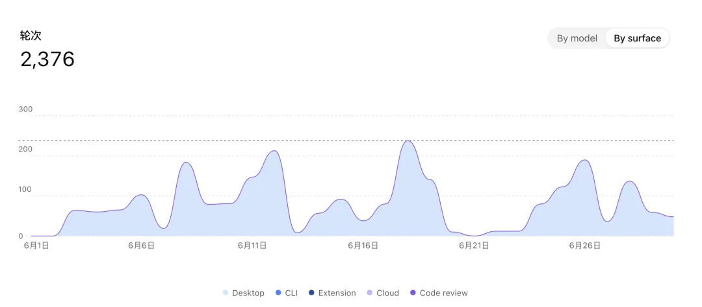

One of the biggest windfalls of the AI era is the Coding Plan.

A few months ago, I applied to OpenAI's Codex program for open-source developers. A few days ago, I was finally approved: six free months of ChatGPT Pro on a new account.

The timing could not have been better. Lately I have been burning through Codex tokens faster and faster. My weekly quota is usually gone in two or three days, leaving me to make do with Claude and GLM for the rest of the week.
Now I have a second $200 ChatGPT subscription, plus the occasional complimentary quota reset. At last, I can keep producing without constant interruptions.

That is why I have been so busy burning tokens lately that I have barely had time to write.

--------

## The Best Arbitrage Right Now Is the Coding Plan

Three months ago, in "[AI Survival Guide: Where the Biggest Arbitrage Really Is](/en/ai/ai-bonus/)," I argued that the best deal available right now is the Coding Plans offered by the major AI vendors.

If you max out the allowance every week, a $200 monthly subscription can unlock roughly $10,000 worth of AI compute at API list prices—a 50x multiple on what you paid.

Of course, that was the situation in March. The Codex 2x quota promotion has since ended, and my latest numbers show that maxing out a plan now gets you only around $4,000 worth.
Even after that haircut, the pricing is clearly unsustainable. This is a transitional subsidy: a narrow window that you need to seize and use down to the last token.

> Over the past month, maxing out one Codex account yielded only about $4,000 per month in tokens at API list prices.

--------

## What Coding Plans Buy You

You may wonder: if the economics are so attractive, why do companies not simply use Coding Plans instead of paying dozens of times more for metered API access?
Companies are not stupid, and neither are AI vendors. Every major vendor restricts its Coding Plan to individual use, while companies are expected to pay for metered enterprise API access.
Subscription terms typically emphasize that Coding Plans are intended for "ordinary personal use."

So why become an OPC—a One Person Company? This is one of the perks: as a one-person business, you can legitimately use an individual Coding Plan to get work done.
If you are a company of any real scale, sorry: you are generally stuck paying many times more for the enterprise API. The value proposition is much worse, and at sufficient scale even Big Tech can struggle to afford the burn.

Many startups therefore ask employees to obtain their own Codex or Claude Code plans, then reimburse them.
A friend of mine at a startup has three $200 Codex plans plus one Claude Max plan, all reimbursed by the company but held in his own name.
If all four are maxed out, the effective price is only a few cents on the dollar compared with metered access. Strictly speaking, though, this crosses the line. If the accounts get banned, there is little room to complain.

Another important difference is that data generated through these Coding Plans is usually used for training by default.
Enterprise plans, by contrast, typically promise explicitly that it will not be. The underlying bargain is simple: a Coding Plan exchanges your data, usage signals, and use cases for subsidized compute.
With the enterprise tier, the crucial distinction is that your data will *not* be used for training—probably. If you work with confidential or sensitive data or codebases, a Coding Plan is therefore not a viable option.

For someone like me who works in open source, however, this is not a drawback. It is a double win.
My code is public anyway, so I lose nothing by letting vendors train on it. I also get free GEO in return: the more familiar the models become with my work, the better it is for my open-source projects.

--------

## A Chinese Open-Source Alternative?

For anyone getting started, my recommendation is to have at least one Codex plan.
If you cannot get past the Great Firewall or sort out payment with a foreign card, a Chinese model such as GLM is also an option.

GLM 5.2 is probably the strongest open-source model available today. It feels roughly on par with Sonnet 4.6 and can get real work done. DeepSeek is less capable—closer to the Sonnet 3.7 era—but its tokens are cheap and plentiful.

I explained how to configure GLM in "[Claude Code Quick Start: Using Alternative LLMs at 1/10 the Cost](/en/ai/claude-code-intro/)." At the time, GLM Coding Max cost only RMB 1,728 per year. I urged Chinese users to jump on it; now the price is RMB 375 per month, or RMB 4,500 per year, and it has reportedly been selling like crazy.

And now, a quick plug: if you buy this plan, my referral code saves you 5%, while I receive a 10% token rebate—assuming you can actually buy one.

> ### A Quick Ad
>
> 🙋 Looking for people to join a Zhipu Coding Plan group buy! 👉 Join "Pinhaomo" here:
>
> https://www.bigmodel.cn/glm-coding?ic=AUWYSKOKLN
>
> 

Zhipu's marketing team previously approached me about sponsored content, and I could not be bothered. Referral tokens, though, I am happy to accept.
So far, 101 people have subscribed through this link, and I have happily banked RMB 10,000 worth of tokens. I can put those toward projects such as a DBA Agent.

GLM does have one annoying limitation: it still does not support OpenAI's new Responses API.
Connecting through Claude Code or OpenCode works fine. But if you want Codex to use GLM's official service, things get awkward.
You need to run a protocol-conversion proxy yourself or have a service such as OpenRouter translate for you. GLM should adopt the industry standard and offer an OpenAI-compatible API so Codex users can run against it directly.

## The Window Is Narrowing

I currently have two Codex plans, one Claude plan, and one GLM plan—four Max-tier subscriptions in total. That is about enough.
Codex does the main work. Claude provides a different perspective for adversarial review. GLM is the fallback after the others run dry, or for grunt work.

My first Codex account is usually exhausted less than two days after each reset, at which point I switch to the other one and keep going.
During the Codex 2x promotion, one account was almost enough, with a little quota to spare.
Now, even if I race to max it out and use every reset, I burn only about $4,000 worth of quota. That is a substantial reduction, and two accounts fill the gap nicely.

The Coding Plan window is narrowing not only through quota cuts, but through product-policy moves around the edges.
The new top models, Mythos and Fable, for example, have been moved to pay-as-you-go pricing and excluded from Coding Plans—after giving you a three-day taste.
The vendors are dressing the change in increasingly high-minded justifications while moving, step by step, from subscriptions to API billing.

- [Hands-On with Claude's New Fable Model: How the Tables Have Turned](https://mp.weixin.qq.com/s?__biz=MzU5ODAyNTM5Ng==&mid=2247492389&idx=1&sn=058eb23d67bd78a1a2eda645698115b1&scene=21#wechat_redirect)

- [Claude Fable 5 Access Has Been Shut Down Across the Board](https://mp.weixin.qq.com/s?__biz=MzU5ODAyNTM5Ng==&mid=2247492415&idx=1&sn=efb4d02ee4d76afd52aa87ac2e0cd741&scene=21#wechat_redirect)

Many Claude users I know have also had their accounts banned by Anthropic recently.
My guess is brutally simple: Anthropic decided that the data it received in exchange for subsidized Coding Plans was not worth the cost. If your data was too low-quality or offered nothing novel, it found a pretext to cut you off.
My sense is that today's flat-rate Coding Plan is a targeted acquisition offer for high-value users, or simply a subsidy that has not yet outlived its promotional phase—quota at one-fiftieth of the normal price, available first come, first served.

I do not know how long this will last. My guess is until OpenAI and Anthropic go public, roughly sometime between the second half of this year and the first half of next year.
So take the bargain while it is there. Once this window closes, it may be gone for good.

Overall, I do not think this AI windfall will last long. If you have tokens, keep them flowing—token flow is king. I hope everyone can make the most of the window while it remains open.

