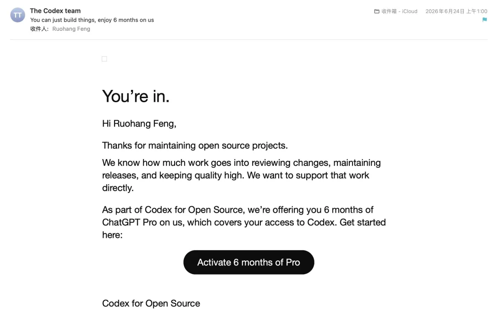
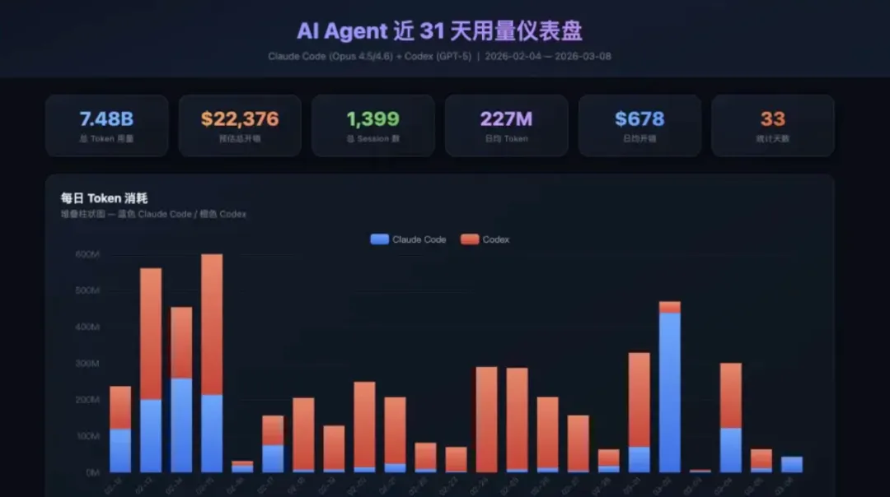
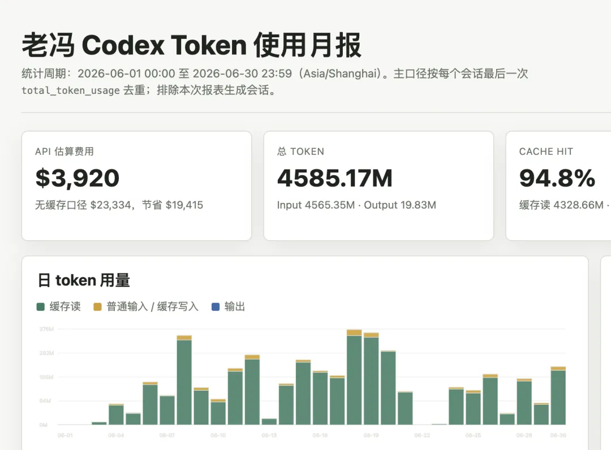
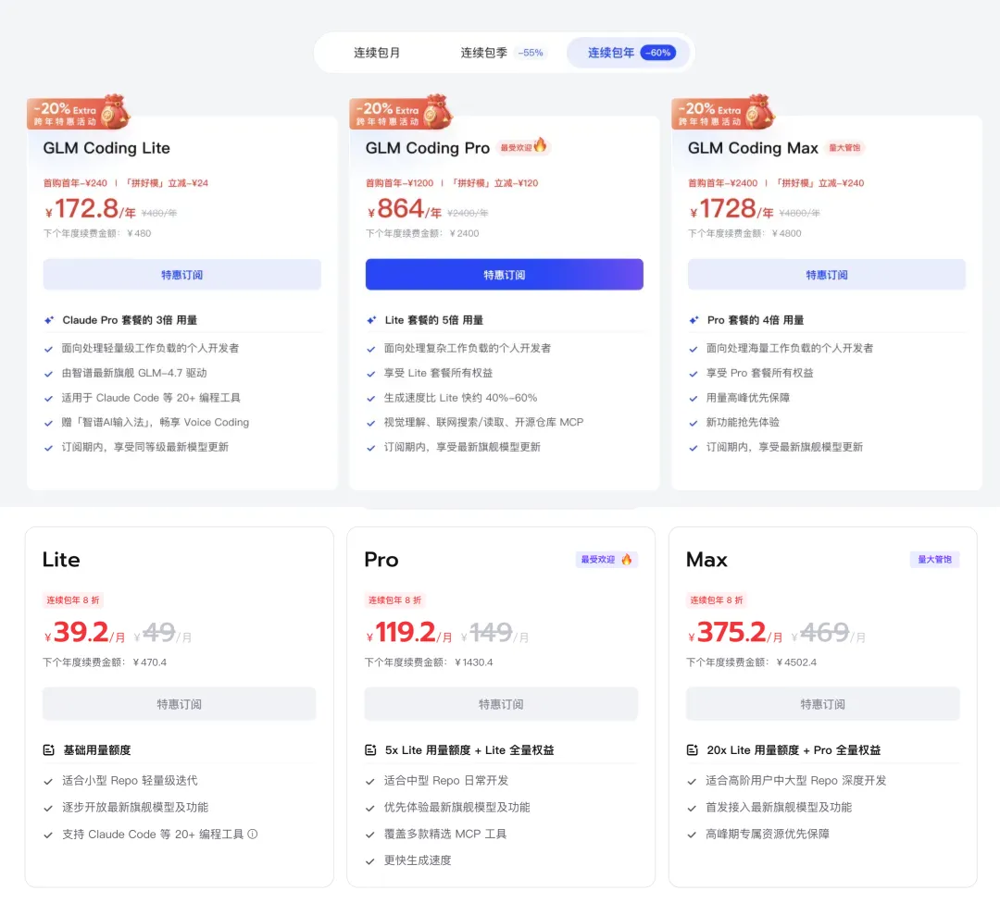
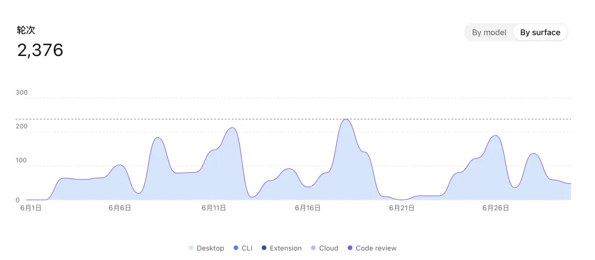

AI 时代最大的红利之一，就是 Coding Plan。

老冯几个月前申请的 OpenAI Codex 开源开发者计划，前几天批下来了，白送六个月的 ChatGPT Pro 订阅，一个新账号。

这真是救了急。最近 Codex 的 token 烧得越来越快，每周配额通常两三天就见底，剩下的日子只能用 Claude 和 GLM 凑合着。
现在手上有了第二个 200 刀的 GPT 订阅，再加上各种赠送的重置机会，总算能稳定连贯地输出了。

所以，最近忙着把这些 Token 烧完，连文章都没空写了。

--------

## 当下最大的羊毛，就是 Coding Plan

三个月前，老冯在《[AI 时代的最大红利](/ai/ai-bonus/)》里说过：眼下最大的羊毛红利，就是各家 AI 厂商提供的 Coding Plan。

一个每月 200 刀的订阅，如果你每周都能把额度打满，差不多能撬动价值一万美金的 AI 算力——也就是列表价的 50 倍。

当然这是3月份的状态，现在Codex 2x 额度的福利期过去了，我看了下打满大概只能撬动 4000 刀左右了。
尽管少了一半，这个价格显然也不是可持续的。而是一个过渡期的红利，一个必须抓住、必须吃干抹净的窗口期机会。

> 最近一个月烧满，一个 Codex 号只有 4000 美元/月的 API 列表价 Token

--------

## Coding Plan 的福利

当然了，你可能会问，那么为什么企业不都去用 Coding Plan，而要去用贵几十倍的 API 按量付费呢？
企业不傻，AI 公司更不傻 —— 因为各家 AI 公司都限制 Coding Plan 只能个人使用，而公司必须用企业版 API 按量付费。
各家订阅的条款里通常都会强调 Coding Plan 是给 “普通个人使用” 的。

所以为什么要当 OPC？OPC 就有这个好处与福利：一人公司嘛，你可以名正言顺地用 Coding Plan 干活。
如果你是一家上了规模的企业，那对不起，通常你只能乖乖按 API 按量付费的方式去用几十倍价格的企业版。这个价格性价比就很难看了，玩大了连大厂都烧不起。

所以现在很多创业公司的做法是，让员工自己想办法去用 Codex / Claude Code Coding Plan，公司给补贴与报销。
老冯有个在创业公司的朋友，开了三个 Codex（200 刀）外加一个 Claude Max，公司给报销，个人走 Coding Plan。
如果都能打满，相当于打了零点几折，比起按量付费的冤大头划算太多了。但严格来说这是踩线行为，抓住封号也没什么好说的。

另一个重要的区别是，这类 coding plan 产生的数据通常默认会被拿去用于训练。
而企业版通常明确承诺不会。这背后的逻辑是：Coding Plan 本质上是用数据/使用信号/应用场景换算力补贴。
如果你用的是企业版，关键的区别就是你的数据是“不会”被作为训练数据的（大概）。所以如果你在机密敏感的数据与代码库上工作，那么使用 Coding Plan 并不是一个可行选项。

但是对老冯这样搞开源的人来说，这不仅不是缺陷还是双喜临门。
我的代码反正都是开源的，你拿去训练不仅我不会有什么损失，而且相当于还有免费的 GEO，
大模型对这套东西越来越了解与熟悉，对我这种开源项目来说反而更是利好。

--------

## 国产开源替代？

总之，对于想入门上手的朋友，老冯的建议是至少有个 Codex 的 Plan。
如果你实在是解决不了科学上网和外卡支付的问题，那么也可以用 GLM 这种国产模型。

GLM 5.2 应该是目前开源模型的天花板，感觉有 Sonnet 4.6 水准，也能干点活了。Deepseek 反而差点意思，感觉只有 Sonnet 3.7 时代水准，但胜在 Token 便宜量大管饱。

怎么配置 GLM ，老冯在 《[Claude Code 免翻上手指南](/ai/claude-code-intro/)》已经介绍过了。当时 GLM Coding Max 一年才 1728 ¥/年，我那时候建议国内用户赶紧冲，现在价格已经变成 375 ¥/月（一年 4500）了，而且据说也已经卖爆了。

当然这里顺便打个广告，你要是去买这个 Plan，可以用老冯的推荐码立省 5%，老冯也能有 10% 的 Token 返点 —— 前提是你真的买的到。

> ### 广告时间
>
> 🙋蹲队友拼智谱 Coding Plan！👉立即参与「拼好模」：
>
> https://www.bigmodel.cn/glm-coding?ic=AUWYSKOKLN
>
> 

之前智谱后台找我做商单我都懒得理，但推荐朋友送 Token 我还是乐意收下的：已经有 101 位朋友通过此链接订购，老冯也开心的攒下了一万块 token，可以用来干点 DBA Agent 之类的东西。

不过 GLM 有一个比较蛋疼的地方，就是目前还不支持提供 OpenAI 新的 Response API。所以如果你用 Claude Code / OpenCode 接是没有问题的。
但如果想要用 Codex 来对接 GLM 官方，就比较麻烦。还要自己跑一个协议转换代理，或者 OpenRouter 之类的地方替你转换。这个我觉得 GLM 应该适配一下行业标准，提供 OpenAI 兼容的 API，让 Codex 用户能跑起来。

## 窗口正在收紧

老冯自己呢，目前两个 Codex ，一个 Claude，一个 GLM ，四个 Max 订阅，差不多够用了。
主力干活用 Codex，Claude 提供一个不一样的视角做对抗性 Review 用，GLM 负责烧干后应急用或者干点粗活。

老冯第一个 codex 账号，基本上一 Reset 没两天就烧干了，然后换一个接着烧。之前 Codex 2x 福利期，一个号差不多够用还略有富裕。
现在紧赶着用满 + 重置用完，烧掉的额度也就四千刀，确实缩水了很多，两个号正好能补上。

Coding Plan 的窗口也正在收紧，不仅体现在额度缩水上，而且也体现在各种场外操作上。
比如，新的最强模型 Mythos / Fable 也强制变成 “按量付费”，不在 Coding Plan 里提供了（给你限时用3天爽一下）。
官方正在用一套更冠冕堂皇的理由，一步步把订阅模式切换成 API 计费模式。

- [Claude 新模型 Fable 体验：风水轮流转](https://mp.weixin.qq.com/s?__biz=MzU5ODAyNTM5Ng==&mid=2247492389&idx=1&sn=058eb23d67bd78a1a2eda645698115b1&scene=21#wechat_redirect)

- [Claude Fable5 全面停止访问](https://mp.weixin.qq.com/s?__biz=MzU5ODAyNTM5Ng==&mid=2247492415&idx=1&sn=efb4d02ee4d76afd52aa87ac2e0cd741&scene=21#wechat_redirect)

然后再比如最近就有很多用 Claude 的朋友被 Anthropic 封了号。老冯觉得他们的封号逻辑就是单纯的觉得卖 Coding Plan 换来的数据赔本了，比如质量太差或者没有什么新花样，就给你找个由头封号了。
我感觉现在的 Coding Plan 包月计划，就是针对高净值用户、或者还在福利期里做的一个定向投放 —— 价格便宜 50 倍，先到先得的窗口期羊毛而已。

我也不知道这个会持续到什么时候，我猜测是大概会持续到 OpenAI / Anthropic 上市，大概也就是下半年到明年上半年，所以羊毛该薅还是要抓紧薅。过期可能就没有了。

总的来说，我觉得这个 AI 红利机会窗口不会太长久，有 Token 快流才是王道，也希望各位朋友能把握好这个机会。

