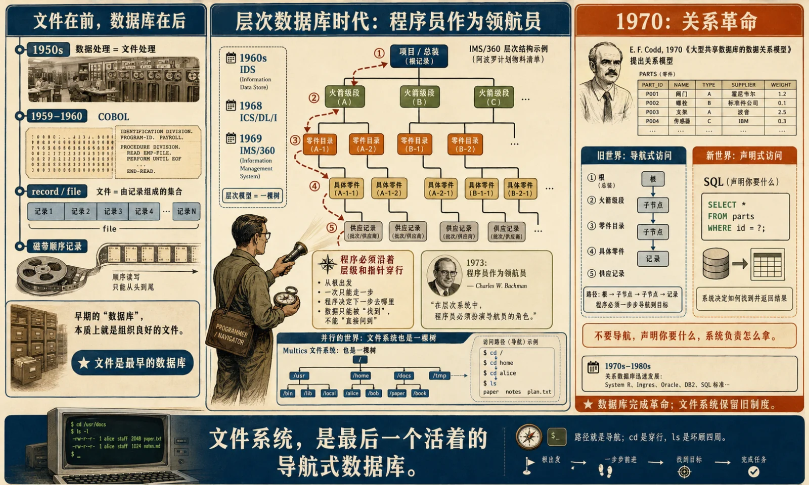

## Prologue: Several Database People Independently Built File Systems

Something curious has happened in agent infrastructure over the past six months: several veteran database people have started building "file systems for AI agents."

Timescale's TigerFS mounts PostgreSQL as a directory tree: each file is a row, directories are tables, writes are transactional, and changes can be versioned. Turso's AgentFS puts an agent's files, key-value state, and tool-call audit trail into a SQLite-backed file system that can be snapshotted, isolated, moved, and forked. AGFS exposes resources such as databases, message queues, and object storage through a file interface, with an explicit nod to Plan 9. I experimented with a PostgreSQL-based PGFS design myself a year ago. More recently, several harness teams have approached me with similar questions. The space is clearly heating up.

When a group of database people all start building file systems at once, it looks as though file systems have won.

But dissect these projects and every heart inside is a database. TigerFS projects a file-shaped face from PostgreSQL. AgentFS projects a POSIX-like workspace from SQLite/Turso. Under AGFS sits a collection of storage engines and service interfaces. In implementation, "agents love file systems" invariably becomes "databases learn to speak the file system's dialect."

This is nothing new. It is the latest round in a war that has lasted more than fifty years. File systems and databases share an ancestor, went their separate ways, learned to despise each other, and then repeatedly proposed marriage. Every high-profile attempt at union failed. Quietly stealing each other's techniques, however, has never stopped.

To judge how this round will end in the agent era, we first need to reopen the books on the earlier rounds. I want to do two things here: tell those fifty years of conflict as one continuous story, then extend that line into a few predictions about agent-era storage that are specific enough to be proven wrong.

## I. One Root: Files Were the First Databases

Let us settle the family tree first: files came before databases, and databases were born from files.

In the 1950s, data processing meant file processing. Magnetic tape held reels of sequential records. COBOL, which took shape in 1959 and 1960, was built around two core abstractions: the record and the file. In that era, "database" often meant nothing more than a well-organized collection of files. In the early 1960s, Charles Bachman built IDS at General Electric, turning "programs navigating between records" into a general-purpose system for the first time. In 1968, IBM delivered ICS/DL/I, the precursor to IMS, for the Apollo program. Renamed IMS/360 the following year, it managed bills of materials for the millions of parts in the Apollo spacecraft and the Saturn V's second stage. Its hierarchical model was a tree.

At almost exactly the same time, the Multics file-system design introduced a hierarchical directory structure. Another tree. The file structure described in the Multics papers is essentially a basic tree hierarchy plus access mechanisms such as links.

That was no coincidence. In the storage world of the 1960s, file systems and databases looked like siblings: both were hierarchical namespaces, and both found data by walking downward from a root. The real fork came in 1970, when Codd published his paper on the relational model. Its target was precisely this kind of navigation. Programmers should not have to steer through pointers and hierarchies like navigators; they should declare what they want and let the system decide how to retrieve it. Bachman's 1973 Turing Award lecture was titled "The Programmer as Navigator." The relational revolution set out to kill that navigator.

The revolution succeeded on the database side. The relational model marginalized hierarchical and network models, and SQL eventually became the de facto mainstream language. But that same revolution never reached the file system next door. A path is navigation. `cd` is traversal. `ls` is looking around.

Looked at another way, a file system is itself a kind of database—just a navigational database without relational algebra, a query optimizer, a schema, or transactional semantics. In fact, **the file system is the last surviving navigational database.**

Pedantic readers may offer DNS, LDAP, or the registry as counterexamples. Fair enough, but those are primarily for machines and administrators. The one great survivor that ordinary users and programmers still `cd` through and `ls` every day is the file system.

The database world had its revolution. The file system preserved the old regime. That regime survived for a simple reason: navigation was good enough for files. Humans could name things and browse directories themselves. Whatever structure lived inside a file was the application's business.

And the question of whose business content structure should be became the fuse for the next fifty years of war.

## II. The Split: Who Owns Semantics?

After the 1970s, the two camps separated completely. Each raised its own flag, but the flags carried two different answers to the same question: **who owns the meaning of data?**

The file system's answer: the application. The storage platform remains ignorant of content. It manages byte streams and namespaces—open, read, write, close—and asks no further questions. Ignorance buys universality: every program, format, and purpose receives the same treatment. Unix pushed this philosophy to its limit with "everything is a file," pulling even devices and pipes into the file interface wherever possible.

The database's answer: the platform. First declare the structure—your schema—and in return I will guarantee a set of expensive properties: integrity, correctness under concurrency, crash recovery, and query optimization. The term ACID was not coined until 1983, but those guarantees had already taken shape in System R and Oracle by the late 1970s.

This was more than a philosophical disagreement. The camps openly looked down on each other. Stonebraker put the database position bluntly in CACM in 1981: the buffering, scheduling, file systems, interprocess communication, and consistency control supplied by an operating system were often ill-suited to a database, sometimes pulling in the opposite direction entirely.

Serious databases of that era therefore often bypassed file systems and wrote directly to raw devices. They built their own buffer pools, WAL, and recovery systems. To database engineers, a file system was not a completely trustworthy durability boundary: the `fsync` contract had to pass through the OS page cache, file system, block layer, controller, and disk cache. Reordering, caching, error handling, or mismatched hardware semantics at any layer could complicate the database's recovery model. Mechanisms such as O_DIRECT are, in essence, back doors that file systems had to open so databases could shorten that chain of trust.

The file-system camp had equal contempt for databases: a semi-closed world with its own priesthood, demanding DBAs, schemas, and specialized protocols, when most of the world's data needed none of that ceremony.

In fairness, both were right because they defended different territory. Shared, contended data that cannot be wrong is worth the tax of schemas and transactions. Charging that tax for casually stored bytes is absurd.

The problem is that ambitious people keep refusing to accept the divide. Someone always wants to unify both sides.

## III. Precedent: Three Proposals, Three Rejections

From the 1990s through 2006, the dream of unification returned again and again. The attempts came from three directions, with remarkably consistent outcomes.

**First: the file system swallows everything.**

The canonical example is Plan 9. It took "everything is a file" to its logical extreme: networks were files, windows were files, processes were files, and resources from other machines could be mounted as files. Technically it was poetry; commercially it never became mainstream. Its genes survived, however, echoing through designs such as per-process namespaces, union and overlay mounts, and resource-as-file interfaces. Today's container mount namespaces and overlayfs at least share Plan 9's aesthetic: give every execution context its own customizable tree. AGFS's explicit homage to Plan 9 is an echo three decades later.

Plan 9 left a lesson worth remembering: a universal interface does not imply universal semantics. You can call everything a "file," but where are the transactions, queries, delegated permissions, and audits? Force non-files into file form and all the semantics beyond `open/read/write` are still missing.

**Second: the file system grows database organs.**

BeFS indexed file attributes and supported live queries. Its author, Dominic Giampaolo, later joined Apple and carried the idea into Spotlight. ReiserFS was more direct: Hans Reiser wanted a file system with database-like efficiency for small objects.

The outcome? BeOS died, and Reiser4 never entered the mainline Linux kernel. What survived was Spotlight—importantly, as a sidecar search service, not part of the POSIX file system's core semantics.

Query can survive as an add-on. It struggles to survive as part of the file system's core contract.

**Third: the database swallows files.**

This campaign was the largest and left the most bodies. In the Oracle8i era, Oracle launched iFS—the Internet File System. It stored files in a relational database while making the database look like a shared network drive. Oracle's documentation explicitly said that iFS let users access database-managed files as though they were on a file server, through Windows Explorer, browsers, FTP, email clients, and other tools.

Microsoft made several attempts of its own: OFS in the 1990s Cairo project, the Web Storage System in Exchange 2000, and finally the grand synthesis, WinFS. Unveiled with fanfare at PDC 2003, WinFS was supposed to give all of Windows a relational foundation. In 2004 it was removed from the initial Longhorn/Vista release. In 2006 it ceased to be delivered as a standalone product, with surviving technology flowing into SQL Server, ADO.NET, and elsewhere.

WinFS deserves a postmortem. Microsoft never published a complete engineering autopsy, but I would reduce the causes of death to three.

First, the performance tax: make the 99 percent of operations that need no query support pay for the 1 percent that do.

Second, compatibility: millions of applications assumed file semantics, not tables.

Third, and deepest: **files and records have different update models.** Files favor in-place byte modification. Records favor transactional logical updates. Impose either update model on the other's workload and both sides suffer.

All three marriages reached the same conclusion: **interfaces can imitate each other; semantic models cannot be merged.**

That is the first reproducible law of this fifty-year war.

## IV. The Secret Convergence: Separate Interfaces, Converging Engines

None of the public marriages worked. Behind the scenes, both sides spent decades stealing techniques from each other.

File systems stole from databases. Journaling file systems such as ext3 share WAL's core idea: write intentions or changes to a recoverable log first, so system state can be replayed and repaired after a crash. ZFS's copy-on-write design and snapshots gave file systems MVCC-like multiversion views.

Databases stole from file systems. Ideas from log-structured file systems gave rise to the LSM tree, which now underpins half the NoSQL world. Append-only became the default aesthetic across much of storage engineering.

Yet the biggest event of those decades was rarely framed as a marriage at all: **SQLite.**

SQLite's official self-description is the most precise product positioning I have ever seen: "SQLite does not compete with client/server databases. SQLite competes with `fopen()`." In other words, it was not taking Oracle's job. It was taking the file system's job: local application storage. It did so by disguising a complete transactional database as an ordinary file—zero configuration, no process, and portable by simple copying. According to SQLite itself, it is likely one of the most widely deployed software modules in existence, with an estimated total of more than one trillion active SQLite databases.

The only file-system/database marriage in fifty years to truly work was not some grand unified semantic model. It was a database dressed as a file and deployed at the edge. From that point, the direction was set: **databases were taking over work once done by files**, not the other way around.

At the other end of the spectrum, file systems made an even more decisive move: they stripped away semantics to gain scale. S3 gutted POSIX. Rename disappeared. In-place updates disappeared. Directories became an illusion simulated with prefixes. For years it did not offer full strong consistency either; only at the end of 2020 did S3 bring strong consistency to GET, PUT, LIST, and some metadata operations. Object storage is less a file system than a giant distributed key-value database. In effect, the file-system camp conceded that POSIX could not cross into large-scale distributed systems unchanged.

Then the story curled into an ouroboros.

Cut open a modern data lakehouse. Its tables are Parquet, ORC, or Avro files in object storage, and inside those files sit columnar pages and statistics. File collections are managed by table formats and catalogs such as Iceberg, Delta, and Hudi. Iceberg's metadata, snapshots, manifest lists, and manifest files maintain table state, the set of data files, and the commit protocol. The catalog often lands back in a database or a database-like metadata service.

Proprietary cloud warehouses such as Snowflake take another route to the same destination. Tables are divided into internally managed compressed columnar micro-partitions, then stored in cloud object storage. On the cloud-database side, Aurora pushes redo logs into a distributed storage layer. Neon puts PostgreSQL on top of disaggregated compute and storage with copy-on-write branches.

Databases sleep on objects. Objects contain columnar pages. Table formats, catalogs, and transactional commit protocols manage collections of objects. At the engine layer, the two sides have long been intertwined. Only the interface layer still maintains a border drawn in the 1970s.

This is the second law of the fifty-year war: **engines converge; semantics remain plural.**

Whoever tries to force unification at the semantic layer dies.

## V. The Fourth Proposal: Do Agents Really Love Files?

In 2026, the war reignited. This time the spark was not a traditional operating system or desktop search. It was the coding agent. These agents quickly converged on files: project instructions are files, Skill entry points are files, configuration comes in JSON or YAML, patches are diffs, and logs, test results, and temporary reports are all files. Agents roam repositories with `ls`, `cat`, `grep`, and `edit`, like tireless interns rummaging through a directory tree. The meme followed: **agents love file systems.**

That is true, but only half true. At a deeper level, a file system offers navigational access, and that is exactly how a model works: look, take one step, look again, then change its mind. The thing the relational model tried to kill—"the programmer as navigator"—has returned fifty years later in the form of an agent.

History does not repeat, but the rhyme is uncanny. AGFS echoes Plan 9 by exposing everything as files. TigerFS carries a trace of BeFS: the file system grows beyond byte streams to acquire queries, versions, and indexes. A database projecting a file interface sounds like WinFS's dying wish, except that this time it has learned restraint. It does not replace the operating system's foundation or make every desktop application pay the tax. It offers one convenient entry point to a new user: the agent.

The first three attempts failed because they tried to force two semantic systems into one. Databases are wiser this time: do not merge, project; do not swallow the world, just give agents an entrance.

But a convenient entrance is not the final storage semantics. There is also a sampling bias to puncture: **generalizing from coding agents that "agents love file systems" is programmer parochialism. Coding agents are a special case. They understand their world through files and change it through files: reading code means reading files, changing code means writing files, a commit is a set of diffs, and rollback returns to an earlier file version. For them, the file system is both map and control panel, context and execution surface. Coding agents love files because the world of code is already file-native. That is one neighborhood, not the whole world.**

The success of coding agents can amplify a category error: mistaking the ontology of a code repository for the ontology of all organizational work. Much of the real value in the software economy does not look like a repository. Tickets, invoices, orders, inventory, medical records, claims, payments, and approval workflows are not shaped like files. They are records, events, state machines, and transactions.

Step outside the world of code and the picture changes immediately. A customer-support agent may read ticket summaries, chat histories, user emails, and knowledge-base documents. But when it closes a ticket, it does not edit `ticket.md`. A finance agent may read invoice PDFs, expense explanations, and contract terms. But when it approves a payment, it does not modify `invoice.json`. A medical agent may read clinical notes, test reports, and physicians' records. But when it updates a chart, issues an order, or triggers a claim, it cannot do so by patching a Markdown file.

This is the true dividing line in the agent era: not reading, but writing.

You can understand the world through files. To change the world, you need `COMMIT`. A commit turns something from "a model-generated candidate" into "a fact the organization accepts." An order changed state. Inventory was deducted. Money was paid. Permission was granted. A medical record was updated. These are not changes to text. They are commitments in the real world, and they cannot depend on a probabilistic model's good judgment or a collection of files behaving themselves.

At this point, an astute reader may pound the table: **databases do not have a monopoly on COMMIT. Git has COMMIT too. Is that not a transaction for the file world?** It has atomic commits, conflict detection, version history, and rollback, and it manages files. Exactly—and that makes it the perfect test. The documentation for both TigerFS and AgentFS explicitly compares them with git worktrees and explains how they are better. Better how? Git's transaction model is built around a **single writer; it is coarse-grained and provides no domain-level concurrency constraints or referential integrity**. It can guarantee that "this commit is atomic." It cannot guarantee that "inventory may never go negative," that "two agents may not sell the last ticket at the same time," or that a third agent will not modify files outside the worktree.

Once an agent starts changing reality, then, the question is no longer whether it can understand files. It is whether it can **commit facts safely**. That is the real dividing line between file systems and databases in the agent era.

## VI. The Workspace Can Be Files; the Ledger Is a Database

File systems excel as workspaces. They are cheap, intuitive, readable, editable, diffable, forkable, and disposable. Agents can experiment comfortably inside them, and humans can inspect the results. Code, drafts, intermediate results, tool output, patches, test logs, and generated artifacts all fit naturally into file-shaped space.

Databases excel as ledgers. A ledger's job is not to let you write whatever you want. Its job is to stop you at the critical moment. No duplicate payments. No negative inventory. No two agents selling the same last ticket. No medical-record changes that bypass permissions. No half-finished transaction becoming fact. No committed result disappearing after a crash.

The file system's virtue is that it leaves you alone. The database's virtue is that it refuses to indulge you.

For humans, being left alone feels like freedom. For agents, it can quickly become an accident scene. Agents act in batches, act concurrently, and act with incomplete context. They also amplify mistakes. The more capable the model, the less freedom it should have over authoritative state. You need a harder, dumber, less forgiving system to enforce its boundaries.

Agent-era storage will therefore not be unified under a single abstraction. The more plausible arrangement is simple: **the workspace can be files; the ledger must be a database.**

The workspace is the agent's scratchpad. It can be messy, restarted, forked, rolled back, and audited. The ledger is the organization's record of fact. It cannot be written carelessly, guessed at, or repaired with a retrospective summary. It needs transactions, constraints, permissions, auditing, recovery, and concurrency control.

The real end state may go one step further: **the workspace will be a database disguised as a file system.** That explains the puzzle from the beginning. Why do TigerFS, AgentFS, and AGFS look like file systems while running on databases? Because once an agent workspace stops being a disposable temporary directory and needs snapshots, isolation, forks, history, auditing, and rollback, it starts growing database organs. You think you are building a file system; then you pull up the requirements and find nothing but classic database machinery.

What is happening in this round is not a file-system restoration. It is a database in a new skin. Outside is a tree that agents can read, write, modify, and roll back. Inside are logs, transactions, indexes, versions, permissions, auditing, and recovery. The shape invites model exploration; the kernel gives the system its guarantees.

This follows the same script as SQLite. SQLite's achievement was not inventing a new file system. It was disguising a database as an ordinary file and taking over local application storage. The agent era pushes that script one step further: the database is no longer disguised as one file, but as a file tree that an agent can explore, fork, audit, and roll back—and that can take over the agent workspace.

The file system wins the interface and the entry point. The database wins the endgame.

## Epilogue: Workspaces Belong to Files; Facts Belong to Databases

File systems and databases have fought for more than fifty years. On the surface, the dispute was about storage. Underneath, it was always about ownership of semantics. The file system says semantics belong to the application; the platform manages names and bytes. The database says semantics belong to the platform; declare the structure and I will provide guarantees.

The agent era reopens this old case with one new variable: the model. The model says, "I can read semantics that were never declared."

That really does change a great deal. Models can now directly read the Markdown, logs, email, contracts, and error messages that machines previously could not understand. Some context that once had to be modeled in advance can now be dropped into files and interpreted on the spot. File systems have won back a round, especially with coding agents, and they have won it handsomely.

But a model cannot overturn the database's verdict.

A model's ability to read is not an ability to commit. Its ability to generate changes does not let those changes bypass transactions. Its ability to interpret state does not make constraints optional. Its ability to write files does not make the file system a suitable ledger of organizational fact.

Once agents enter production, the question immediately changes from "Can they understand it?" to "Can they change it safely?" Safe change depends not on natural-language understanding but on old machinery: transactions, constraints, logs, permissions, auditing, recovery, and concurrency control.

Old, but solid.

The agent endgame is therefore not the file system. The file system is the agent's workspace, scratchpad, sandbox, and context plane. The database will continue to hold authoritative state, the commit path, and the ledger of facts. One lets the model experiment; the other keeps the experiment from breaking the world. Ultimately, the file-system interface will remain, but the underlying engine will converge on the database.

Several database people independently building file systems may look like a file-system restoration. It is not. They have not betrayed databases. They have all recognized the same direction: agents need the file system's entrance and the database's heart. Outside is a tree the model can explore. Inside, logs, transactions, indexes, constraints, and recovery are still beating.

The workspace can be files. The ledger must be a database.
