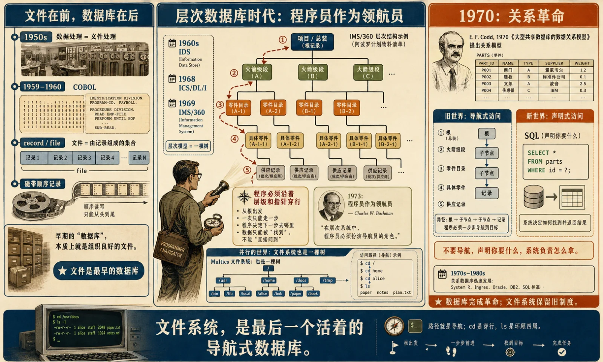

## 引子：几个数据库人，不约而同做了文件系统

最近半年，Agent 基础设施圈发生了一件耐人寻味的事：几位资深数据库人，先后做起了“给 AI Agent 用的文件系统”。

Timescale 的 TigerFS，把 PostgreSQL 挂载成一棵目录树，每个文件是一行记录，目录是表，写入带事务，变更可版本化。Turso 的 AgentFS，把 agent 的文件、KV 状态、工具调用审计痕迹装进一个 SQLite-backed 的文件系统里，可以快照、隔离、搬走、fork。AGFS 则把数据库、消息队列、对象存储等资源暴露成文件接口，明说向 Plan 9 致敬。老冯自己一年前也折腾过基于 PostgreSQL 的 PGFS 方案，最近也有几个 Harness 团队来问类似问题，明显感到这个赛道的热度在升温。

一堆做数据库的人同时去做文件系统，一眼看上去，像是文件系统赢了。

但把这几个项目解剖开，心脏全是数据库。TigerFS 是 PostgreSQL 投影出一张文件的脸，AgentFS 是 SQLite/Turso 投影出 POSIX-like 工作区，AGFS 底下也是一组存储引擎和服务接口在撑。所谓“Agent 爱文件系统”，落到实现上，全部变成了“数据库学会说文件系统的方言”。

这不是新鲜事。这是一场打了五十多年的战争的最新一轮。文件系统和数据库这对冤家，同根同源，分道扬镳，互相蔑视，又反复求婚——历史上几次高调的联姻尝试，全部以失败告终；私底下的技术互偷，却五十年没停过。

要判断 Agent 时代这一轮会怎么收场，得先把前几轮的账翻出来算清楚。这篇文章我想做两件事：把这五十年的恩怨讲成一条线；然后在这条线的延长线上，对 Agent 时代的存储下几个敢被打脸的判断。

## 一、同源：文件是最早的数据库

辈分还是要先理清楚：文件在前，数据库在后，而且数据库是从文件肚子里生出来的。

上世纪五十年代，数据处理就是文件处理。磁带上一卷卷顺序记录，1959—1960 年成型的 COBOL，核心抽象就是 record 和 file，那个年代的“数据库”一词，指的常常就是一堆归档好的文件。六十年代初，Charles Bachman 在通用电气做出 IDS，第一次把“程序穿行于记录之间”这件事做成了通用系统；1968 年，IBM 为阿波罗计划交付了 IMS 的前身 ICS/DL/I，次年更名 IMS/360，用来管理阿波罗飞船和土星五号第二级火箭数百万零件的物料清单——层次模型，一棵树。

有意思的是，几乎同一时刻，Multics 的文件系统设计给出了分层目录结构。也是一棵树。Multics 论文里的文件结构，本质上就是一棵基本的树形层级，外加链接等访问机制。

这不是巧合。六十年代的存储世界，文件系统和数据库长得像亲兄弟：都是层级命名空间，都靠“从根往下走”来定位数据。真正的分岔发生在 1970 年——Codd 发表关系模型论文，矛头直指的就是这种“穿行”：程序员不该像领航员一样在指针和层级里导航，你只需要声明要什么，系统负责怎么拿。Bachman 1973 年的图灵奖演讲标题就叫《作为领航员的程序员》（The Programmer as Navigator），而关系革命要杀死的，恰恰就是这个领航员。

数据库这边的革命成功了。层次模型、网状模型被关系模型边缘化，SQL 后来成了事实上的主流语言。但同一场革命，从来没有波及隔壁的文件系统——路径就是导航，`cd` 就是穿行，`ls` 就是环顾四周。

反过来说，文件系统未尝不是一种数据库。只不过它是一个没有关系代数、没有查询优化器、没有 schema、没有事务语义的导航式数据库。实际上，**文件系统是最后一个活着的导航式数据库。** 

较真的读者会举 DNS、LDAP、注册表当反例——成立，但那些主要是给机器和管理员用的；天天被普通人和程序员 `cd` 来 `ls` 去的，只剩文件系统这个最大遗民。

数据库世界经历了革命，文件系统保留了旧制度。旧制度活下来的原因很简单：对文件这种东西，导航够用了——人类自己起名字、自己翻目录，天经地义；至于文件内容是什么结构，那是应用程序自己的事。

而“内容结构是谁的事”，正是接下来五十年战争的导火索。

## 二、分家：语义所有权之争

七十年代之后，两边彻底分家，各自立起了旗帜，而旗帜上写的其实是同一个问题的两种不同答案：**数据的语义归谁管？**

文件系统的答案：归应用。存储平台对内容保持无知，我只管字节流和命名空间，打开、读、写、关，其余一概不问。无知换来的是普适——任何程序、任何格式、任何用途，一视同仁。Unix 把这个哲学推到极致：“一切皆文件”，连设备和管道都尽量纳入文件接口。

数据库的答案：归平台。你先把结构声明给我，也就是 schema；我拿这份结构向你保证一堆昂贵的性质：完整性、并发正确、崩溃恢复、查询优化。ACID 这个词 1983 年才被造出来，但那套保证七十年代末就在 System R 和 Oracle 里成型了。

两边不只是理念不合，是真刀真枪地互相看不上。数据库阵营的态度，Stonebraker 1981 年在 CACM 上写得很不客气：操作系统提供的缓冲、调度、文件系统、进程间通信、一致性控制，对数据库来说经常不合用，甚至方向相反。

所以那个年代的严肃数据库经常绕开文件系统直接写裸设备，自建缓冲池、自建 WAL、自建恢复。在数据库人眼里，文件系统不是完全可信的耐久性边界：`fsync` 的合同要穿过 OS 页缓存、文件系统、块层、控制器和磁盘缓存，任何一层的重排、缓存、错误处理或硬件语义偏差，都可能让数据库的恢复模型变复杂。O_DIRECT 这些东西，本质上都是数据库试图缩短这条信任链，文件系统被迫给数据库开的后门。

文件系统阵营看数据库，同样一肚子鄙夷：一个自带祭司阶层的半封闭世界——要 DBA、要 schema、要专用协议，而世界上大部分的数据根本不需要这套繁文缛节。

平心而论，双方都对，因为守的地盘不同。共享的、争用的、错不起的数据，值得付 schema 和事务的税；随手一存的字节，付这个税就有些荒谬了。

问题在于，总有野心家不信邪，想把两边统一起来。

## 三、先例：三次求婚，三次失败

从九十年代到 2006 年，大一统的梦做了一轮又一轮。按方向可以分成三路，三路的结局出奇一致。

**第一路：文件系统吞掉一切。** 

代表作 Plan 9。它把“一切皆文件”贯彻到极致：网络是文件，窗口是文件，进程是文件，别的机器的资源挂过来也是文件。技术上美得像诗，商业上没有成为主流。但它的基因并没有消失，而是反复回响在 per-process namespace、union/overlay mount、资源文件化接口这些设计里。今天容器技术的 mount namespace 与 overlayfs，和 Plan 9 至少共享同一种审美：给每个执行上下文一棵可定制的树。AGFS 明说向 Plan 9 致敬，是三十年后的回声。

Plan 9 的教训值得记下：接口的普适不等于语义的普适。你可以把万物都叫“文件”，但事务在哪、查询在哪、权限委派在哪、审计在哪？把非文件硬说成文件，`open/read/write` 之外的语义依然缺席。

**第二路：文件系统长出数据库器官。** 

BeFS 给文件属性建索引、支持实时查询，作者 Dominic Giampaolo 后来去了苹果，把这套思路带进了 Spotlight；ReiserFS 更直白，Hans Reiser 的野心就是让文件系统拥有接近数据库的小对象效率。

结局呢？BeOS 死了，Reiser4 没能进入 Linux 内核主线。真正活下来的是 Spotlight——注意它活下来的身份：一个旁挂的搜索服务，而不是 POSIX 文件系统的本体语义。

查询作为外挂能活，作为文件系统的核心合同很难活。

**第三路：数据库吞掉文件。** 

这一路阵仗最大，尸体也最多。Oracle 在 Oracle8i 时代推出 iFS——Internet File System，把文件存在关系数据库里，让数据库看起来像共享网络盘。Oracle 当年的文档明确说，iFS 可以让用户像访问文件服务器一样，通过 Windows Explorer、浏览器、FTP、邮件客户端等访问数据库管理的文件。

微软前后也扑腾过几次：九十年代 Cairo 计划里的 OFS，Exchange 2000 那套 Web Storage System，最后是集大成的 WinFS——2003 年 PDC 上高调登场，要给整个 Windows 换上关系型的底座；2004 年被移出 Longhorn/Vista 首发范围；2006 年不再作为独立产品交付，残余技术流进 SQL Server、ADO.NET 等方向。

WinFS 值得验尸。微软没有公布过一份完整的工程死因清单，我把它的工程死因归纳为三条。

第一，性能税。为了让 1% 的操作能被查询，让 99% 不需要查询的操作陪着交税。

第二，兼容性。几百万应用假设的是文件语义，不是表。

第三，也是最深的一条：**文件和记录的改写模型不同。** 文件偏向就地的字节改写，记录偏向事务性的逻辑更新。把一种改写模型强加给另一种负载，两边一起受罪。

三次联姻，结论一致：**接口可以互相模仿，语义模型无法合并。**

这是五十年战争里第一条经得起复验的规律。

## 四、暗度陈仓：接口分居，引擎合流

台面上的婚一场没结成。台面下，两边偷技术偷师得飞起，而且是双向的。

文件系统偷数据库的：ext3 这类 journaling 文件系统，和数据库的 WAL 共享同一个想法——先把意图或变更写进可恢复日志，再让系统状态在崩溃后可重放、可修复；ZFS 的写时复制加快照，让文件系统有了类似 MVCC 的多版本视图。

数据库偷文件系统的：日志结构文件系统（LFS）的思想孕育了 LSM-Tree，如今撑起半个 NoSQL 世界；append-only 成了大半个存储圈的默认审美。

但这几十年里最大的一桩事，当时几乎没人用“联姻”的框架去讲它：**SQLite。**

SQLite 官方的自我定位是我见过的最精准的产品定义：“SQLite 不和客户端/服务器数据库竞争，SQLite 和 `fopen()` 竞争。”翻译一下：它抢的不是 Oracle 的活，是文件系统的活——应用本地存储这份工。抢法是把一个完整的事务型数据库伪装成一个普通文件：零配置、零进程、拷走就能用。按 SQLite 官方说法，它很可能是部署量最大的软件模块之一；官方估算活跃 SQLite 数据库数量可能超过万亿。

FS 和 DB 届五十年里唯一修成正果的联姻，不是什么宏大统一语义模型，而是数据库穿上文件的衣服，嫁到了端侧。方向从此定了调—— **是数据库吃掉了文件的工作**，不是反过来。

同一时期在光谱的另一端，文件系统干了件更决绝的事：主动把语义剥掉以换取规模。S3 把 POSIX 剥了个精光——rename 没了，就地改写没了，目录是假的，靠前缀模拟；一致性模型也长期不是完整强一致（直到 2020 年底，S3 的 GET、PUT、LIST，以及部分元数据操作，才统一补齐强一致）。对象存储与其说是文件系统，不如说是一个巨型分布式 KV 数据库。这等于文件系统阵营自己承认：POSIX 没能原样穿越过大规模分布式。

然后，故事绕成了一条衔尾蛇。

切开今天的数据湖仓：表是对象存储上的 Parquet/ORC/Avro 文件，文件内部是列式页和统计信息；管这些文件集合的，是 Iceberg、Delta、Hudi 这类表格式和 catalog。Iceberg 的 metadata、snapshot、manifest list、manifest file 维护表状态、数据文件集合和提交协议；catalog 则往往落回数据库或数据库化的元数据服务。

Snowflake 这类云数仓走专有路线，殊途同归：表被切成内部管理的压缩列式 micro-partitions，底层托管在云对象存储上。云数据库那头，Aurora 把 redo log 推到分布式存储层；Neon 把 PostgreSQL 架在存算分离和 copy-on-write 分支之上。

数据库睡在对象上，对象里装着列式页，管对象集合的是表格式、catalog 和事务提交协议。引擎层早就你中有我、我中有你。只有接口层，还维持着 1970 年代画下的楚河汉界。

这就是五十年战争的第二条规律：**融合发生在引擎层，语义保持复数。**

谁试图在语义层强行统一，谁死。

## 五、第四次求婚：Agent 真的爱文件吗

2026 年，战火重燃。导火索不是传统操作系统，也不是桌面搜索，而是 coding agent。这批 agent 的行为很快收敛到了文件：项目说明是文件，技能入口是文件，配置是 JSON/YAML，补丁是 diff，日志、测试结果、临时报告，也都是一堆文件。Agent 在仓库里 `ls`、`cat`、`grep`、`edit`，像个不会累的实习生，在目录树里来回翻东西。于是 meme 出来了：**Agent 爱文件系统。**

这话不假，但只对了一半。更深一层看，文件系统是导航式访问，而模型干活正是这个节奏：看一眼，走一步，再看一眼，再改主意。当年关系模型要杀掉的—— “程序员作为领航员”，五十年后在 agent 身上还魂了。

历史不重演，但押韵的可怕。AGFS 是 Plan 9 的回声：把万物都暴露成文件。TigerFS 有 BeFS 的影子：文件系统不再只是字节流，还要长出查询、版本和索引。数据库投影出文件接口，则像是 WinFS 的遗愿——只不过这次它学乖了：不给整个操作系统换底座，不逼所有桌面应用陪它交税，只把一个好用的入口，单独献给 agent 这个新用户。

前三次失败，是因为有人想把两套语义强行合并。这次数据库聪明多了：不合并，只投影；不吞世界，只递给 agent 一个入口。

但"好用的入口不是 “终局的存储语义”。而且这里有个采样偏差得先戳破：**从 coding agent 归纳出 “Agent 爱文件系统”，是程序员的乡党偏见。coding agent 这个场景太特殊——它认识世界靠文件，改变世界也靠文件：读代码是读文件，改代码是写文件，提交是一组 diff，回滚还是文件版本。文件系统对它既是地图又是操作台，既是上下文又是执行面。Coding agent 爱文件，是因为代码世界本来就是 file-native。 可老乡都这样，不代表天下人都这样。

Coding agent 的成功会放大一种误判：把代码仓库的本体论，当成了所有组织工作的本体论。软件经济里真正值钱的部分，并不都长成代码库。工单、发票、订单、库存、病历、理赔、支付、审批流——这些东西不是文件形状，是记录、事件、状态机和事务。

离开代码世界，事情立马变样。客服 agent 可以读工单摘要、聊天记录、用户邮件和知识库文档；但它关闭工单的时候，不是去编辑一个 `ticket.md`。财务 agent 可以读发票 PDF、报销说明和合同条款；但它批准付款的时候，不是去改一个 `invoice.json`。医疗 agent 可以读病历文本、检查报告和医生记录；但它修改病历、开具医嘱、触发理赔的时候，不可能靠 patch 一个 Markdown 文件来完成。

这才是 Agent 时代真正的分界：不在“读”，而在“写”。

认识世界，可以靠文件；改变世界，必须靠 `COMMIT`。它让一件事从"模型生成的候选方案"，变成"组织承认的事实"。订单状态改了，库存扣了，钱付了，权限授予了，病历更新了——这些都不是文本变化，是现实承诺，不能靠概率模型的自觉，也不能靠一堆文件的自律。

聪明的读者这时会拍桌子：**又不是只有数据库有 COMMIT，git 也有 COMMIT，这不就是文件世界的事务吗？** 原子提交、冲突检测、版本历史、回滚，一样不缺，而且管的正是文件。这恰恰是绝好的试金石——TigerFS、AgentFS 的官方文档，都专门拿 git worktree 当对手，说自己比它强在哪。强在哪？git 的事务性是**单写者、粗粒度、无并发约束、无引用完整性**的：它能保证 “这一次提交是原子的”，但保证不了 “库存不许扣成负数”，保证不了 “两个 agent 不许同时卖掉最后一张票”，更拦不住第三个 agent 在 worktree 外头乱改。

所以 Agent 一旦真正动手改现实，问题就不再是它能不能读懂文件，而是它能不能**安全地提交事实**。这，才是文件系统和数据库在 Agent 时代的真正分野。

## 六、工作区可以是文件，账本是数据库

文件系统擅长当工作区。它便宜、直观、可读、可改、可 diff、可 fork、可丢弃。Agent 在里面试错很舒服，人类也容易检查。代码、草稿、临时结果、工具输出、patch、测试日志、生成物，都适合放在文件形状的空间里。

但数据库擅长当账本。账本的任务不是让你随便写，而是在关键时刻拦住你。不许重复付款，不许库存扣成负数，不许两个 agent 同时卖掉最后一张票，不许绕过权限改病历，不许半截事务提交成事实，不许崩溃后丢掉已经承诺的结果。

文件系统的美德，是它不管你。数据库的美德，是它不惯着你。

对人类来说，这种不管叫自由；对 agent 来说，很容易变成事故现场。agent 会批量行动、并发行动、在上下文不完整时行动，还会把错误放大。模型越能干，越不能把权威状态交给它自由发挥。你需要一个更硬、更笨、更不讲情面的系统，替它守边界。

所以 Agent 时代的存储，不会被一种抽象统一。更合理的格局很简单：**工作区可以是文件，账本必须是数据库。**

工作区是 agent 的手稿。手稿可以乱写，可以重来，可以 fork，可以回滚，可以留痕。账本是组织的事实。账本不能乱写，不能靠猜，不能靠补救性总结。账本需要事务、约束、权限、审计、恢复和并发控制。

而真正的终局很可能再进一步：**工作区会是伪装成文件系统的数据库。** 这也正好解释了开头那个谜——为什么 TigerFS、AgentFS、AGFS 看着像文件系统，底层却全是数据库。因为一旦 agent 工作区不再是一次性临时目录，而要支持快照、隔离、fork、历史、审计、回滚，它就开始长数据库器官。你以为在做文件系统，需求表一拉出来，全是数据库的祖传手艺。

这一轮真正发生的，不是文件系统复辟，是数据库换皮。表面一棵树，agent 可以读、写、改、回滚；里面是日志、事务、索引、版本、权限、审计和恢复。外形给模型探索，内核给系统兜底。

这跟 SQLite 当年的剧本一脉相承。SQLite 的伟大，不是发明了新文件系统，而是把数据库伪装成一个普通文件，吃掉了应用本地存储。Agent 时代把剧本又推进一步：数据库不只伪装成一个文件，而是伪装成一棵可探索、可 fork、可审计、可回滚的文件树，来吃掉 agent 工作区。

文件系统赢了接口与入口，数据库赢了终局。

## 尾声：工作区归文件，事实归数据库

文件系统和数据库打了五十多年，表面是存储之争，底层一直是语义所有权之争。文件系统的答案：语义归应用，平台只管名字和字节。数据库的答案：语义归平台，你声明结构，我提供保证。

Agent 时代把这桩旧案翻出来重审，新变量是模型。模型说：未声明的语义，我也能读。

这句话确实改变了很多。过去机器读不懂的 Markdown、日志、邮件、合同、报错信息，这些散乱的非结构化原始文件，现在模型能直接读了；过去必须提前建模的一部分上下文，现在可以先扔进文件，让模型临场解释。所以文件系统赢回了一局，尤其在 coding agent 这里，赢得很漂亮。

但数据库的那份判决，模型翻不了。

因为模型能读，不等于模型能承诺；模型能生成修改，不等于修改可以绕过事务；模型能解释状态，不等于状态可以没有约束；模型能写文件，不等于文件系统可以承担组织的事实。

Agent 真正进入生产环境以后，问题马上从“它能不能看懂”变成“它能不能安全地改”。而安全地改，靠的不是自然语言理解，靠的是老东西：事务、约束、日志、权限、审计、恢复、并发控制。

旧，但硬。

所以 Agent 的终局不是文件系统。文件系统是 agent 的工作区、草稿纸、沙盘和上下文平面；数据库会继续承担权威状态、提交路径和事实账本。一个负责让模型试，一个负责让世界别被试坏。但最终，文件系统的接口会保留，但底层引擎会收敛到数据库。

几个数据库人不约而同做文件系统，看上去像文件系统复辟，实际上不是。不是因为他们背叛了数据库，而是因为他们看懂了同一个方向：Agent 需要文件系统的入口，但需要数据库的心脏。外面是一棵可以被模型翻看的树，里面跳动的，还是日志、事务、索引、约束和恢复。

工作区可以是文件，账本必须是数据库。

