> HOW 2026 keynote: Give DBA Agents a Body

## Part I: Opening—An Absurd Phenomenon

### 1. Cover

Hello, everyone. I'm Ruohang Feng, the organizer of this tools track. This is a PostgreSQL tools session, but today I don't want to talk about how many new features some command-line utility has gained. I want to ask a more fundamental question:
**Why are agents that can actually manage production databases still so rare?** My answer is simple: today's models are already smart enough. What they lack is not a brain, but a body.
They need to see system state, take action, judge risk, leave evidence, and back out after something goes wrong. Today I want to discuss how we can build that body for a DBA Agent.

### 2. An Absurd Phenomenon

Many of you probably know Pigsty. Pigsty is an open-source PostgreSQL distribution I built around a simple goal:
even without a DBA or RDS, you should be able to run production-grade PostgreSQL yourself and obtain enterprise database capabilities through free, open-source software.

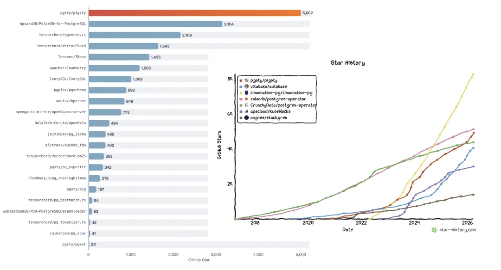

The project now has more than 5,000 stars on GitHub. It ranks among the leading PostgreSQL distributions and is one of the more prominent open-source projects in China's PostgreSQL ecosystem.

How many requests do you think a site for a project like this gets each month? A hundred thousand? A million? Ten million?

### 3. Anomalous Traffic

None of those. The number startled me too: 90 million requests over the past month, and still climbing. At the current growth rate, it will soon approach 100 million. The obvious question is: where could that many human visitors possibly come from?

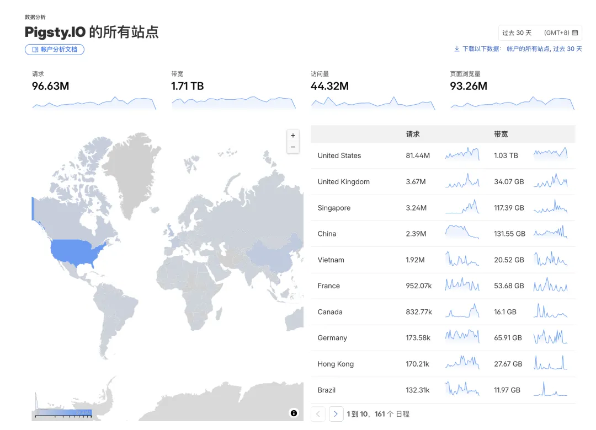

I checked the analytics. Monthly human unique visitors numbered only in the tens of thousands, with page views in the hundreds of thousands. So where did the other nearly 100 million requests come from? Judging by User-Agent strings, access paths, and trigger patterns, much of the traffic no longer came from humans browsing in the traditional sense. AI tools were reading the documentation.

### 4. Who Is Visiting?

After thinking about it, I realized what had happened. When we released Pigsty 4.0 early this year, we added a feature called DBA Agent. The name sounds grand, but in practice it is just a `CLAUDE.md` file containing two very plain rules: first, do not drop the database; second, if something goes wrong, read the documentation. Then it lists all the documentation links. That's it.

Yet a new kind of user gradually appeared in our community. These users do not necessarily know PostgreSQL or Linux, but they do have Claude Code or Codex.

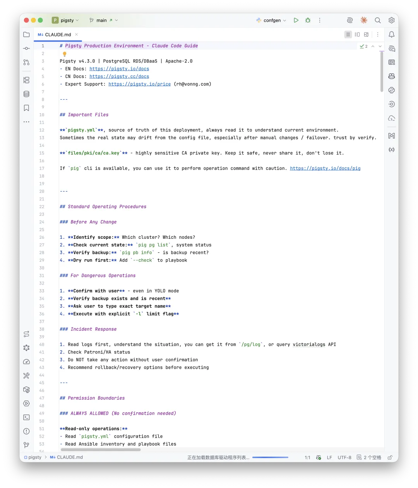

They sit at a Linux shell and tell the AI: "Install Postgres for me." "Add a user." "Figure out what's wrong here." To do that work, the AI has to keep reading the documentation. So those nearly 100 million requests were not people clicking around by hand. They were agents reading on their users' behalf. Those agents are already playing the role of DBA—and doing a surprisingly decent job.

### 5. Agents Are Already Doing DBA Work

Honestly, I think these agents are doing pretty well. I use them this way myself when I run into difficult problems. In a simulated Pigsty environment, I tell an agent: I have this issue, or a customer has this issue; inspect the source code, configuration, logs, and documentation, then analyze the likely causes. Sometimes I give it a few hunches—A, B, and C—and ask which is most plausible.

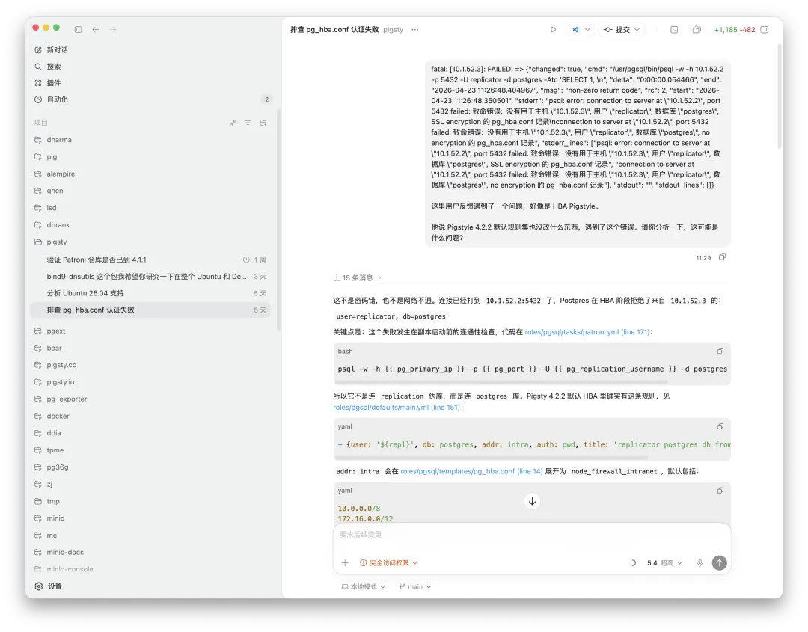

More often than not, its analysis lands close to the truth. It is not always right, but it is already good enough to be impressive. So when I talk about DBA Agents today, I am not pitching a concept that exists only in a slide deck. I am describing something already happening among the users of a real open-source project.

### 6. D-Bot Already Proved the Point

More interesting still, while everyone is now piling into the DBA Agent space, someone already built one on Pigsty two years ago.

A team led by Xuanhe Zhou at Tsinghua University built a DBA Agent called D-Bot on a Pigsty environment, and the paper was later published at VLDB. They were still using GPT-4. Even with the models available at the time, D-Bot could diagnose fairly complex failures in Pigsty and produce evidence-backed root-cause analyses and remediation recommendations.

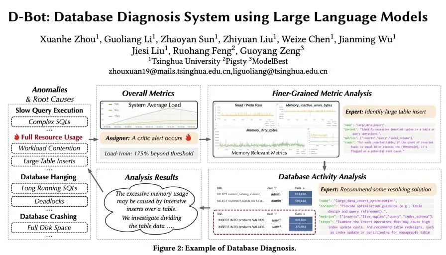

One major reason they chose Pigsty was that it offered an open, standardized, production-grade runtime. They could focus on the intelligence instead of rebuilding the infrastructure from scratch: monitoring data was already available, and established command-line primitives could perform the necessary operations. Two years later, model capabilities have improved many times over. What can we build today by pairing this Runtime with state-of-the-art models? **I leave that possibility to everyone in this room.**

---

## Part II: Theory—What Is a Body Made Of?

### 7. Why Haven't Self-Driving Databases Taken Off?

At this point someone will inevitably ask, "So is AI going to replace DBAs?" My answer is: not yet. After all, AI cannot take the blame for you. But it does reveal a real possibility: self-driving databases. The idea is not new. Oracle has talked about it, cloud vendors have talked about it, and academia has talked about it.

Yet after all these years, very few implementations are actually good. I believe the technology is finally ready. We may not be able to achieve Level 5 autonomy today, but a copilot that assists the driver is clearly within reach. The real question is: what must we provide before a database can drive itself?

### 8. The Database Needs Pyramid

I once drew a pyramid of database needs. At the top sits intelligence—the self-driving database, the Holy Grail. But it rests on control and insight: you must be able to see and control the system. Beneath those are the fundamentals of quality, security, efficiency, and cost. If your monitoring is incomplete, your changes still depend on inherited shell scripts, and you cannot reliably rehearse high availability or point-in-time recovery, you have no business talking about self-driving databases.

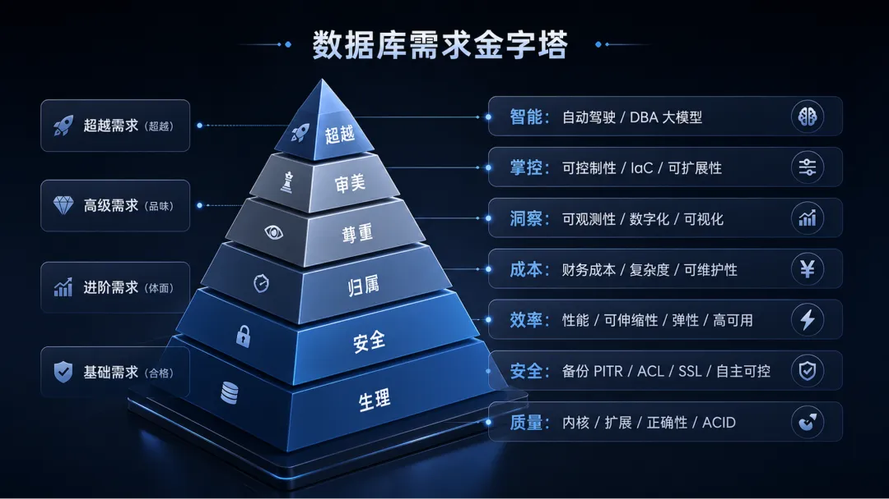

It is like trying to build a self-driving car without sensors, brakes, a steering wheel, or airbags. What good is a brilliant algorithm then? The core of a DBA Agent is therefore not the model or the agent framework. It is a deterministic environment and a body through which the agent can interact with that environment. That is the theme of this talk.

### 9. The Body's Two Foundations: Eyes and Limbs

What does it mean to give an agent a body? I think the two most basic components are eyes and limbs. First, the eyes: observability. It must be able to see the database, operating system, network, disks, connection pools, backups, replication lag, and historical trends. Second, the limbs: controllability. It needs reliable ways to take action—to apply changes, restart services, fail over, back up, restore, add users, and scale up or down. Let's start with the eyes.

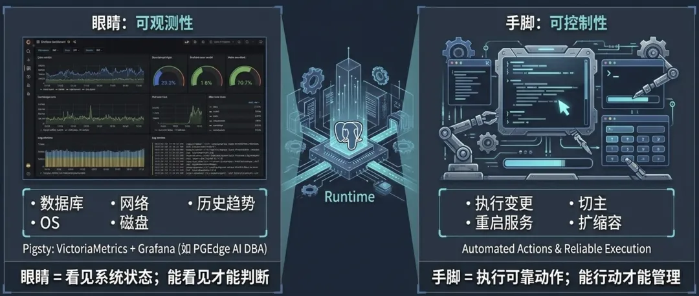

### 10. Eyes: Observability

The first problem any DBA Agent must solve is information gathering. It needs to know what is happening now. Pigsty addressed this long ago: it provides a complete open-source observability stack built on VictoriaMetrics and Grafana, collecting nearly every useful PostgreSQL signal. For agents and humans alike, effective management begins with enough information.

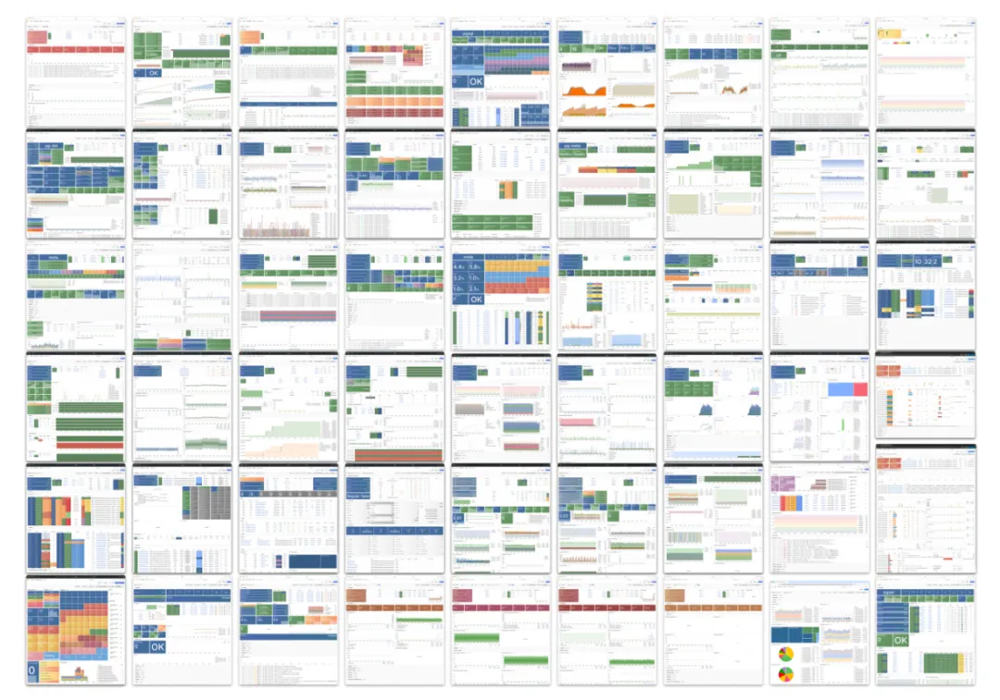

AI DBA products usually begin with monitoring: metric collection, anomaly detection, and alerting, followed by a conversational interface to the agent. pgEdge's AI DBA Workbench is a typical example. Monitoring is clearly the most basic and important component of a DBA Agent. But I have discussed it several times already and will not repeat myself today. I want to talk about the other part of the body: the limbs. Today is not about the eyes. It is about the hands and feet.

### 11. Four Stages of Database Automation

From an automation perspective, database management has passed through roughly four stages. Stage one is completely manual: the DBA types every command. Stage two is a pile of hand-me-down scripts or clicking around in a console—ClickOps. Stage three is infrastructure as code: declarative management with tools such as Ansible, Terraform, and Operators. Stage four is the agent: instead of writing commands one by one, the human states a goal, and the agent observes, plans, executes, and verifies.

There is a crucial dependency here. Before an agent can enter stage four, stage three must already exist. Without IaC, an agent will struggle to operate reliably. I will return to that point later. First, let us answer a more concrete question: how exactly should an agent operate a database?

### 12. Experts and Agents Both Need Action Interfaces

Should an agent operate a database by opening a browser and clicking around a console? Should it call an API? Or should it use the command line?

For both experts and agents, what matters is not a GUI but a clear, composable, auditable, and reproducible action interface. A CLI is one of the most natural forms, especially when it also supports structured output such as JSON and YAML. That makes it equally useful to humans and agents.

So here is one prediction: the agent era will revive the value of the CLI. In a sense, this returns us to the original Unix philosophy—everything is text, and everything composes.

### 13. PostgreSQL's Problem: A Fragmented Toolchain

But there is an awkward reality: the PostgreSQL ecosystem is powerful and fragmented. You might install Postgres with `apt` or `dnf`; start it with `systemctl` or `pg_ctl`; run SQL with `psql`; manage high availability with `patronictl`; back up with `pgBackRest`; pool connections with `PgBouncer`; and handle extensions with yet another assortment of packages and configuration files.

That is fine for veterans. They know how to use each tool and where the traps are. But it becomes a problem when an agent manages the database. The agent needs one coherent action interface; it should not have to guess among scattered tools and ancient scripts every time. So we wondered whether we could build something that unified them.

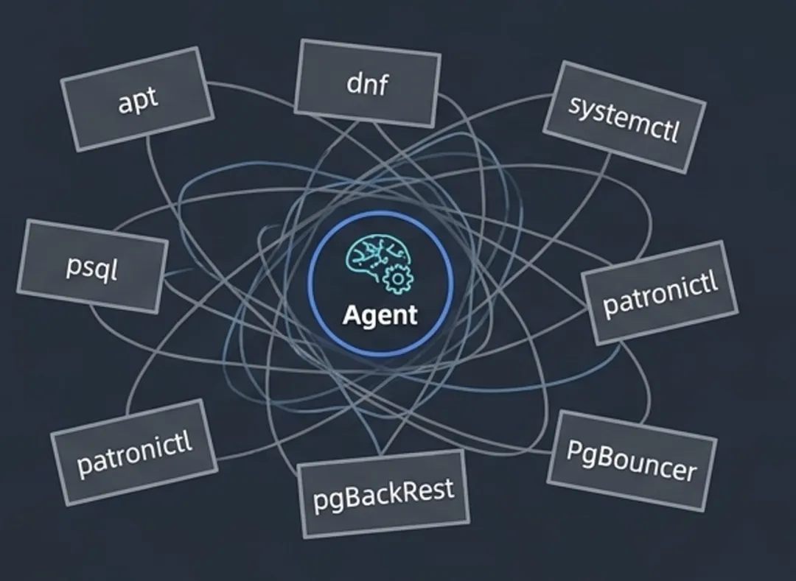

### 14. Pig CLI Began as an Extension Package Manager

Our tool is called Pig CLI. It began as something very simple: a small Go program I wrote to solve PostgreSQL and extension installation. It does not try to reinvent `apt` or `dnf`; it adds a layer of PostgreSQL semantics on top of them. Why? Traditional package managers understand packages, not PostgreSQL extensions. If you ask to install `vector`, the package manager does not know which package you mean, which PostgreSQL major version, which Linux distribution, or which architecture. Pig's first job was to translate a "package" into a "database capability."

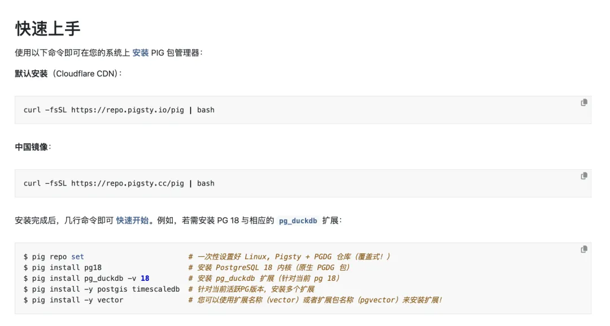

### 15. Do Not Underestimate Installation

Do not underestimate installation. For many PostgreSQL beginners, installing an extension is the first major obstacle. They want to use one, but cannot compile, package, build, and distribute it themselves, so they need a ready-made binary. What if none exists? What if the network is unreliable? What if the versions do not match? None of this is especially hard for a veteran, but it can stop a newcomer cold.

One of Pigsty's most important jobs is maintaining binary distribution for PostgreSQL extensions. It integrates a large collection of third-party extensions and makes them work out of the box on mainstream Linux distributions. That puts many of PostgreSQL's "superpowers" in the hands of ordinary users.

### 16. But a DBA Does More Than Install Software

Of course, if Pig could only install extensions, it would still be too limited. Most DBA work consists of Day 2 operations. After installation, you must create the cluster, initialize directories, configure permissions, tune parameters, create users and databases, configure connection pools, backups, and monitoring—and later perform failovers, scale out, scale in, recoveries, health checks, cleanup, repacking, and upgrades.

Pigsty historically performed most of these tasks through Ansible Playbooks. Claude Code can read the documentation and run the Playbooks, but the experience is not good enough. What we really want is to gather the primitives of daily database administration behind a single command-line interface—to evolve Pig CLI from an extension package manager into a tool that can manage the full state of a PostgreSQL system.

### 17. Pig CLI's Ambition: The Swiss Army Knife of PostgreSQL

Pig CLI's long-term goal is therefore much larger than package management. It should become the Swiss Army knife of the PostgreSQL ecosystem: install PostgreSQL, install and build extensions, initialize clusters, manage services, inspect state, manage high availability, configure backups, and perform maintenance. Can all these actions converge on a single interface?

That would free DBAs from a great deal of manual work. More importantly, it would give agents hands and feet. Humans can remember a pile of complicated tools, and agents can too, but there is no reason to make them. Give an agent a clearer, more stable action interface and it will work better.

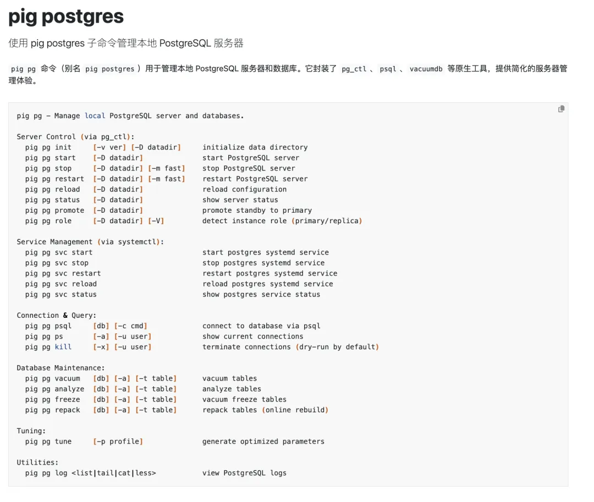

### 18. An Agent-Native CLI

This raises another question. The Unix philosophy teaches KISS: make each tool do one thing well, then compose tools through pipes. If we pack all these capabilities into Pig CLI, does it become a bloated kitchen-sink application? We should answer that directly. Humans value tools that are small and elegant. For agents, self-description matters more.

An agent-native CLI must be able to explain itself. Its `help` text must be clear, its output structured, and its errors explicit. Humans read colored text; agents read JSON and YAML. The tool needs to serve both.

Put bluntly, the ideal is not to write a pile of Skills documents in advance to teach the agent how to use a tool. The tool itself should be sufficiently self-describing. An agent should be able to type `--help` and explore layer by layer: what commands exist, what parameters they take, what each parameter means, what output formats are available, and what error codes can occur.

This may sound like a detail, but it is central to CLI design in the agent era. A truly agent-native interface also needs dry runs, idempotency, explicit exit codes, machine-readable errors, permission boundaries, confirmation for dangerous operations, audit logs, and rollback suggestions. I will not go further into those details today.

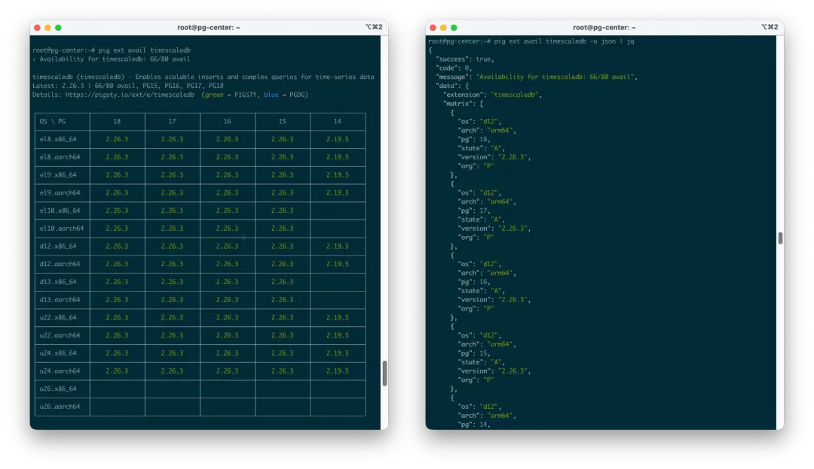

### 19. Why Start with a Native Linux Runtime?

Some people ask why we are building command-line tools to manage Postgres directly on Linux instead of basing the system on Kubernetes. A Kubernetes Operator is certainly another kind of Runtime, but it hides many low-level details while adding another layer of abstraction and complexity. Encapsulation is good for application developers. It is not always good for a DBA Agent, because once a problem cuts through the abstraction, the agent needs to see systemd, disks, filesystems, networks, and PostgreSQL itself.

In other words, if you want to push a database runtime to its limits, controlling a connection string is not enough. Controlling one abstract API layer is not enough. You must control the environment in which the database actually runs. We are not trying to build a DBA Agent that can merely invoke tools. We want one that can see, understand, and operate the whole system. It needs more than hands and feet. It needs a complete body.

---

## Part III: The Turn—Tools Are Not Enough; the Runtime Is the Moat

### 20. A Cautionary Example: OtterTune

OtterTune offers a case worth studying. Co-founded by CMU database professor Andy Pavlo, it raised a $12 million Series A to provide automatic parameter tuning for PostgreSQL and MySQL, but it never became the standard answer for self-driving databases. Why?

Its product proposition was: give us a database connection string, and we will tune the database. That sounds appealing. But a connection string is the lowest common denominator across every PostgreSQL service. What can you do with one? Run some SQL and inspect a few system views. You cannot see complete historical trends, restart the database, or change parameters that require a restart. When something goes wrong, you cannot trace the problem across layers. Is it the application, the database, the OS, or the network? You cannot see any of them.

### 21. No Runtime, No Expert DBA

The lesson I draw from OtterTune is this: with only a connection string and no Runtime, it is difficult to build an expert-level DBA Agent. A connection string is a narrow peephole through which you can see only one corner of a house. The important details are hidden in the operating system, disks, filesystem, service manager, monitoring history, and backup chain. No matter how smart a tool is, if it sees the world through a peephole, it can never make expert judgments.

Pigsty began as a monitoring system. Why did it later become an all-in-one PostgreSQL distribution? Because I eventually realized that to push monitoring to its limits, you must take direct control of the entire infrastructure. Otherwise, you cannot control how users deploy their databases. All you have is a connection string, and what you can do with it is extremely limited.

The key to building a DBA Agent is therefore not how polished the command-line tool looks. It is the Runtime behind that tool.

### 22. The Runtime Is the Real Moat

Many people building agents today like to talk about prompts, Skills, and workflows. Those are useful, of course, but let me be direct: they do not create a very strong moat. Write a veteran DBA's experience into Markdown and model vendors can ingest it, competitors can learn it, and the next model generation may absorb much of that knowledge directly.

So what is the real moat? The agent's understanding of your private environment. How is it deployed? What instances exist? What is the backup policy? Which alerts have fired in the past? Which operations have been performed? Which traps have people already fallen into? None of that appears in general training data.

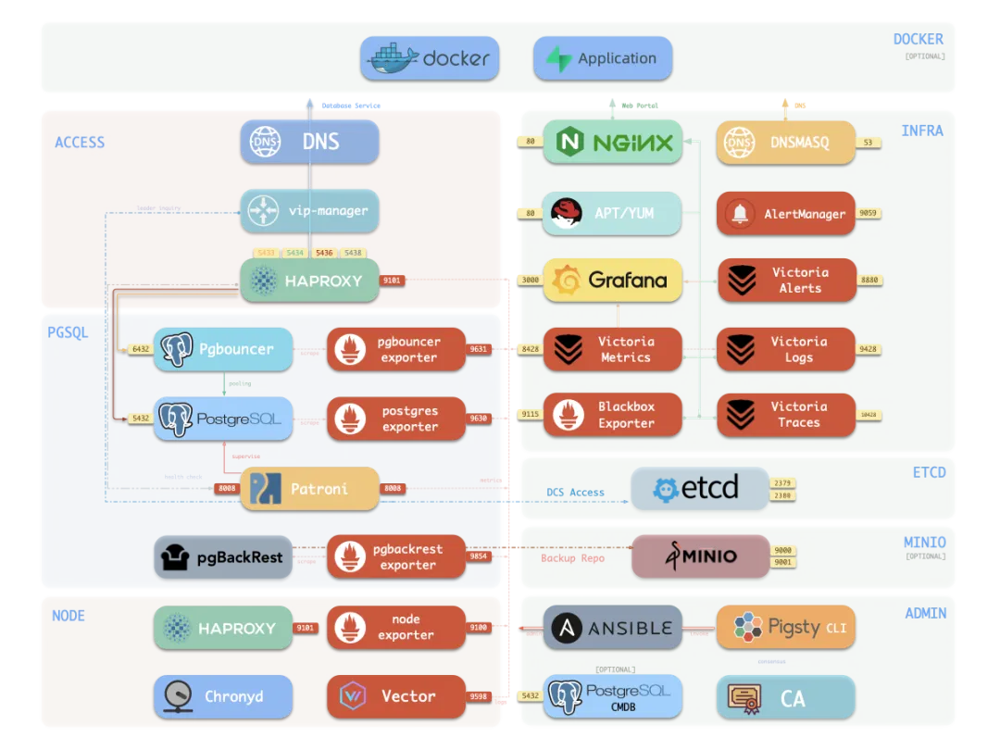

In one sentence: a generic agent alone does not have a deep moat. The real defensibility lies in the agent's understanding of the Runtime, and in the state, history, and operational boundaries accumulated inside that Runtime.

### 23. The Runtime's Hard Problem: Context Engineering

How does a Runtime become usable by an agent? This is the genuinely hard part: context engineering. How do you feed it the right information? My view is clear: building a so-called DBA Agent framework from scratch today will probably produce something worse than simply using Claude Code or Codex. The difficult part is not the wrapper framework. It is providing the right context, permissions, and tool boundaries.

For a DBA Agent, context is not chat history. It is topology, metrics, logs, configuration, and change history. Topology tells it what the system looks like. Metrics show where something is wrong now. Logs reveal what happened. Configuration explains why. Change history shows who just touched what.

The information comes mainly from two sides. One is observation: monitoring, logs, alerts, metrics, and historical trends. The other is control: Inventory, configuration, permissions, Playbooks, CLIs, and backup and recovery interfaces. Connect the two and the agent can graduate from chatting to doing the work.

### 24. IaC Is the Agent's Central Dogma

At this point I need to single out one idea, because it is the central secret—the soul—of why DBA Agents work in Pigsty: infrastructure as code. A Pigsty environment is defined by an Inventory. The number of nodes, which one is primary, which are replicas, where monitoring and backups live, which ports and roles exist—all of it is in the configuration inventory.

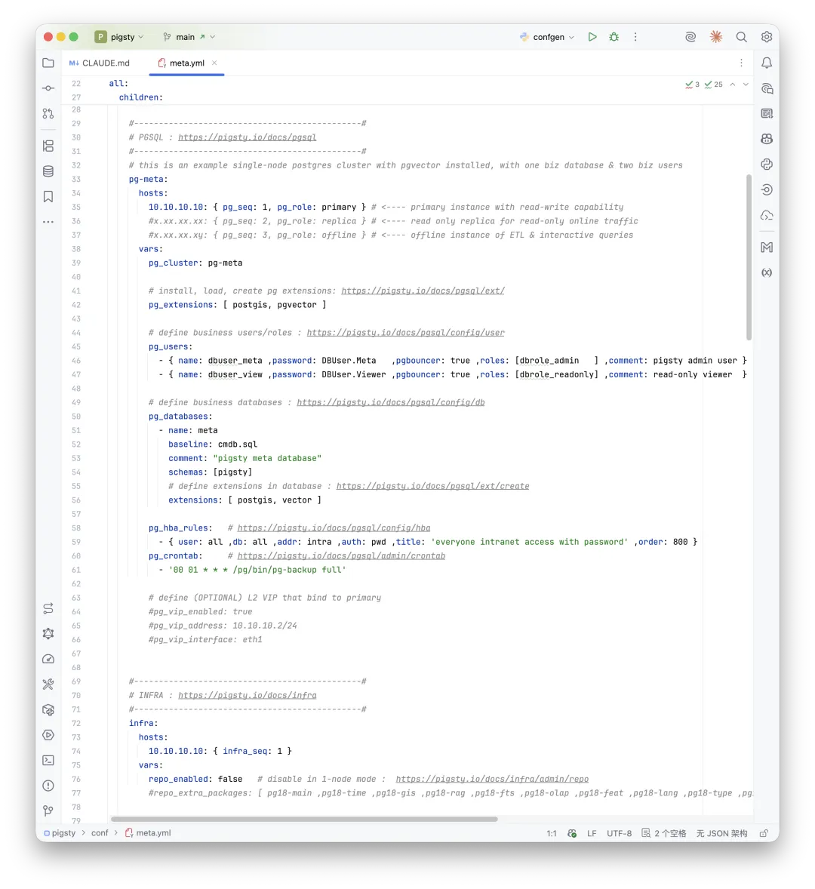

This inventory is not documentation written after the fact. It is the blueprint from which the entire environment is generated. Once the agent has the blueprint, it knows what the environment looks like. It is not guessing inside an unfamiliar world; it is reading that world's source code. This is IaC's real value to an agent: it makes the environment itself readable and condenses it into a single file.

### 25. Mastery Means Becoming One with the Tool

Now the pieces fit together. In Chinese martial-arts stories, the master swordsman becomes one with the sword. The same is true of a programmer and a keyboard, a veteran driver and a steering wheel, or a DBA and an environment.

A DBA's ability is not merely the database theory in their head. It comes from becoming one with the environment. Drop a world-class expert into an unfamiliar system, and they may perform worse than an ordinary administrator who has lived in that system for three years. The latter knows where the traps are, which machine is slow, which parameter must not be touched, and which application goes haywire every night.

Agents are no different. Drop Claude Code into a completely unfamiliar Linux environment and it will flounder. Place it inside a deterministic Pigsty Runtime, with the Inventory, monitoring, documentation, and CLI, and it can do a great deal.

### 26. Read-Only Advice Is Ready; Automatic Execution Requires Caution

That said, let me pour a little cold water on the idea. In a serious production environment, I do not recommend handing the database over to an agent in fully automatic mode from day one. The most credible model today is still a copilot: the agent gathers information, analyzes the problem, proposes a plan, and explains the risks; then a human confirms it. Either the human executes the plan or explicitly authorizes the agent to do so. Destructive and irreversible operations in particular must face hard constraints.

This takes us back to the beginning: AI cannot take the blame for you. Responsibility cannot be transferred, so operations must be confirmed by a human. That is why a DBA Agent should first become a solid copilot instead of leaping straight to aggressive Level 5 autonomy.

Today, a workflow of read-only recommendations from a DBA Copilot, followed by human execution, is mature enough for production. The next step is to make every stage of that workflow more reliable.

---

## Part IV: Extending the Idea—from DBA Agent to Dev Agent

### 27. Not Just for DBAs: piglet.run

So far I have discussed DBA Agents for enterprise deployments and large PostgreSQL clusters. But there is another audience: individual developers and small teams. They do not necessarily need a complex DBaaS management system. They need a development runtime that works out of the box.

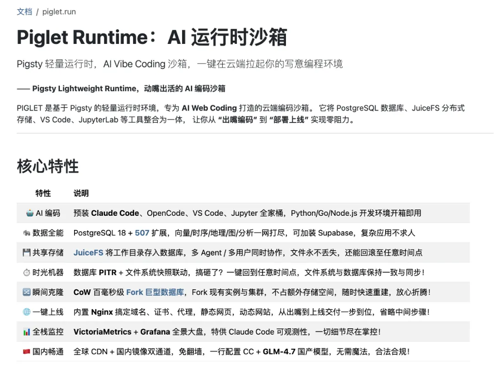

That is the problem piglet.run aims to solve: distill Pigsty's observable, controllable, and reversible capabilities into a development runtime for individuals and small teams. It takes a Linux virtual machine and configures PostgreSQL, Nginx, monitoring, development tools, Claude Code, Codex, Code Server, and everything else in one shot. Then Coding Agents can work directly inside that environment.

The Runtime prepared for a DBA Agent—an observable, controllable, reversible environment—works just as well for a Dev Agent, perhaps even better.

### 28. pg.center: A Small, Real Example

Here is one of my own examples. I recently built a small project called pg.center, an unofficial Chinese mirror of postgresql.org. In the past, building something like this was not a small job. You had to find the website repository, fetch content, translate it, generate pages, deploy them, and keep everything synchronized on a schedule.

Today the process is simple. I log in to a cloud server and bring up the Runtime with one command. Nginx, the database, monitoring, and the programming environment are all ready.

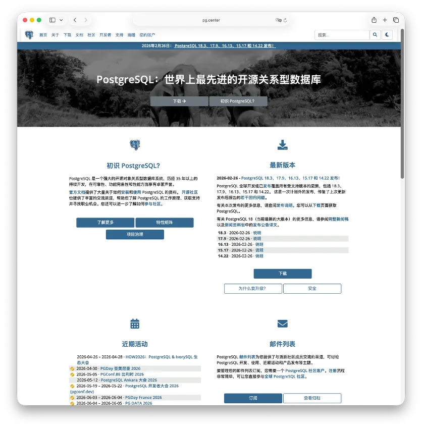

Then I open Claude Code and tell it: "I want to build a Chinese edition of the PostgreSQL website. Make a plan first, then execute it." About a day later, the site is up, with scheduled synchronization and updates.

That is the value of the Runtime. You do not write everything locally and deploy it afterward. You let the agent do the work directly inside a deterministic, production-grade environment.

### 29. A LAMP Stack for the New Era

This reminds me of the old LAMP stack: Linux, Apache, MySQL, and PHP. A generation of websites launched quickly on that foundation. Times have changed. The P no longer has to mean PHP; it might be Node.js, Go, Python, or whatever language an agent prefers. But several components remain constant: Linux, a database, a web entry point, and monitoring.

So here is another prediction: the agent era will produce a new foundational stack, designed not for traditional programmers but for Dev Agents.

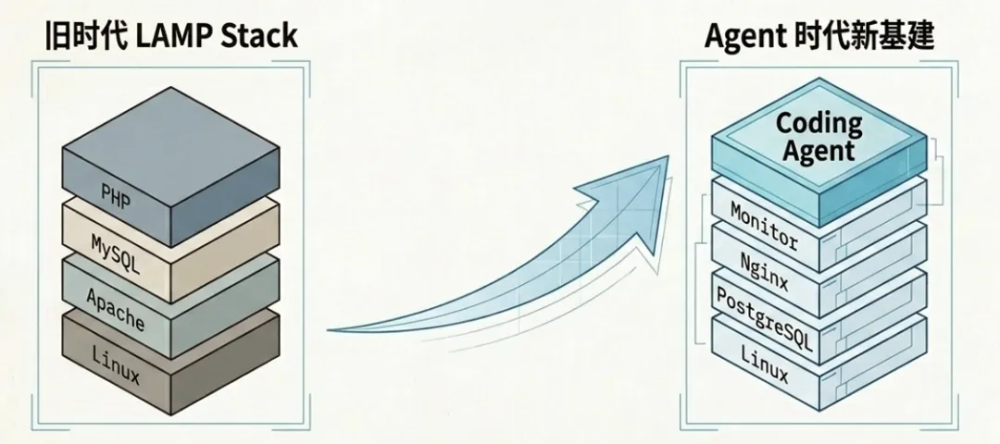

I call it the AI Agent LAMP stack: Linux, Agent, Monitoring, PostgreSQL. This is not a literal recreation of the original LAMP. It is a mnemonic for the agent era: Linux provides the environment, the agent provides execution, Monitoring provides the eyes, and PostgreSQL provides data and state. Pigsty can provide this entire stack.

With it, the barrier to building a website, portal, internal system, or data application falls dramatically. A developer may have only two things left to worry about: buying a domain and renting a server. The agent can handle the rest.

### 30. The Filesystem Should Be Reversible Too

There is one particularly interesting capability worth mentioning: time travel and environment sharing.

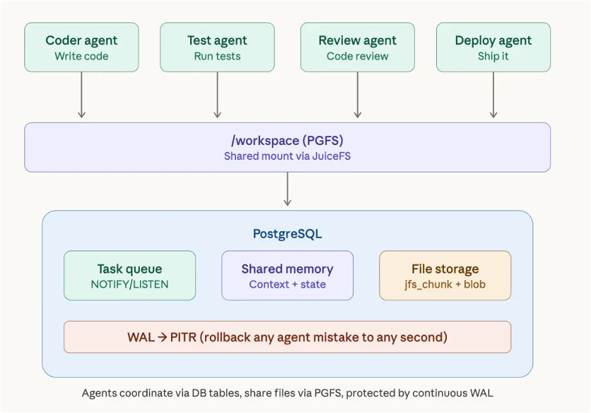

We used JuiceFS to put filesystem state into PostgreSQL. That means **your code, configuration, and database content now share a single backup and rollback system**. Did the agent make a mess? One-click PITR returns the entire environment, including the filesystem, to where it was five minutes ago. You can also mount the filesystem on Linux, Windows, and macOS, sharing one directory across people and devices.

This is extremely useful for agents. They can experiment freely and roll back with PITR when they get something wrong. What used to be a DBA's ultimate black magic is becoming available to ordinary users. It gives agents the confidence to experiment boldly.

---

## Part V: Giving the Body to the Community

### 31. Pigsty Is More Than a DBA Agent's Body

We can now condense the entire argument into one sentence: on the surface, Pigsty is a PostgreSQL distribution; in essence, it is an Agent Runtime. It places Linux, PostgreSQL, monitoring, backups, high availability, IaC, CLI, and documentation inside one deterministic world.

For a DBA Agent, it is the production environment. For a Dev Agent, it is the development environment. For a Coding Agent, it is an execution environment where it can experiment, verify, and roll back.

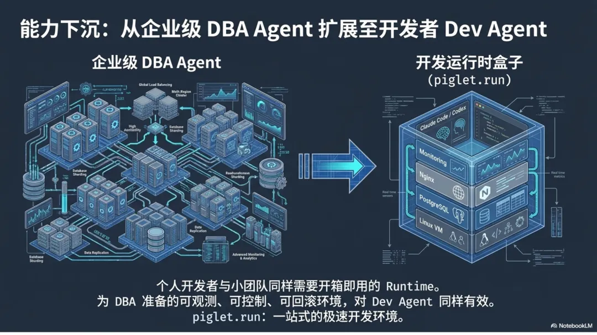

### 32. An Open Proving Ground—Come Play

I welcome anyone interested in building agents to come experiment with Pigsty. Think of it as an open proving ground. It has real PostgreSQL, real Linux, real monitoring, real backup and recovery, real high availability, and real configuration and management interfaces. You do not need to reinvent the wheel from scratch. Whether you are building a DBA Agent or a Dev Agent, Pigsty can serve as a convenient foundation.

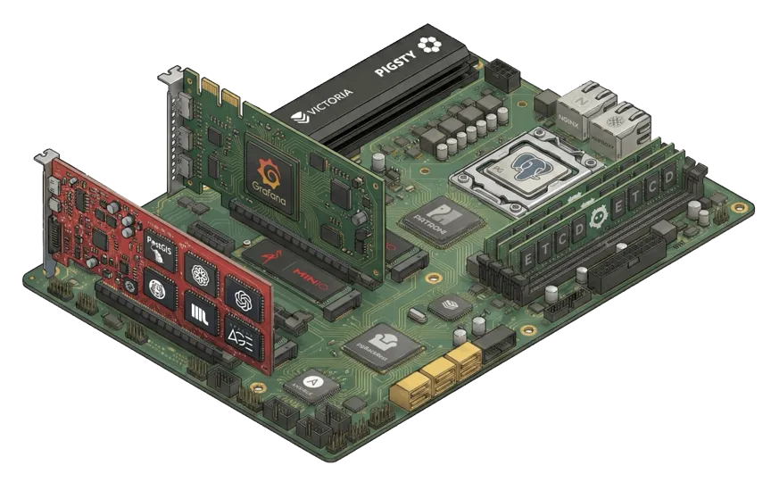

If you are an agent developer or user, you do not need to begin by assembling the low-level environment. Just run Claude Code or Codex inside it. Let the agent accumulate knowledge of the environment and distill that knowledge into memories and Skills. It will grow more familiar with the system and more capable over time.

### 33. An Open-Source, Shared Runtime

In the agent era, the truly valuable thing is not a prompt, a Skills file, or a clever-looking chat interface. All of those will be copied, absorbed, and rapidly commoditized. What is difficult to copy is a complete runtime environment that is stable, transparent, observable, controllable, and reversible.

That is what Pigsty wants to provide: an open-source PostgreSQL Runtime, a world that an agent can truly enter, understand, operate, verify, and learn from. It does not trap the agent in a web demo and ask it to perform. It puts the agent inside real Linux, real databases, real monitoring, real backups, real high availability, and a real operating environment, then tests it in the field.

The future will not have only one agent or one correct answer. Hundreds, then thousands, of agents will emerge in different directions. Every one of them will need a body and an environment in which it can act. Pigsty can become the skeleton of that body.

### 34. Giving Agents a Body Also Redefines the Human Role

We give agents bodies not to replace people, but to unleash productivity. DBAs should not waste their time repeatedly installing software, running the same health checks, checking the same metrics, or writing the same scripts. Developers should not waste their time configuring databases, Nginx, monitoring, and deployment pipelines again and again. Agents can do this work, and they will keep getting better at it.

That does not mean people become obsolete. Quite the opposite: the more work agents can do, the more humans must move up the stack. People define goals, design systems, judge risk, set boundaries, and bear responsibility. Humans are no longer the ones tightening every screw by hand. They decide how the machine should operate, who is accountable when it fails, and which decisions must never be left to the machine.

Model generations will turn over, and waves of agents will come and go. What endures is the runtime that is reproducible, auditable, reversible, and trustworthy. Pigsty wants to build that foundation.

Do not think of it as merely a PostgreSQL distribution. Put your agent in an observable, controllable, reversible environment. Let it run, experiment, and verify. Let it grow the body it needs to enter production for real.

Thank you.
