> HOW 2026 主题演讲：给 DBA Agent 以身体

## 第一部分：引子 —— 一个离谱的现象

### 1 封面

大家好，我是冯若航，本次工具会场的出品人。虽然这是一个 PG 工具主题的会场，但今天我不想讲某个命令行工具又加了多少新功能，而是想讲一个更本质的问题：
**为什么到了今天，真正能管理生产数据库的 Agent 还是这么少见？** 我的判断很简单——大模型已经够聪明了，它缺的不是脑子，缺的是身体。
它要能看到状态、执行动作、判断风险、留下证据，还要能在搞砸以后退回来。今天我要聊的，就是如何给 DBA Agent 打造这副身体。

### 2 一个离谱的现象

在座很多朋友可能已经知道 Pigsty。Pigsty 是我做的一个开源 PostgreSQL 发行版，目标很简单：
让你在没有 DBA、没有 RDS 的情况下，也能自建一套生产级 PostgreSQL 服务，通过开源免费的方式，自助获得企业级数据库能力。

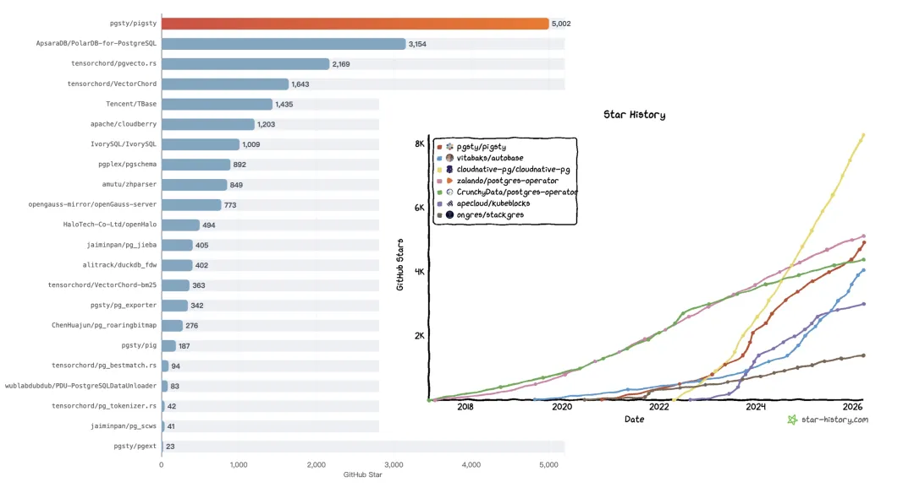

目前这个项目在 GitHub 上的 Star 数已经超过 5000，在 PG 发行版项目里处于第一梯队，也是中国 PostgreSQL 生态里很有代表性的开源项目。

像这样一个开源项目的网站，你觉得一个月会有多少访问请求？10 万？100 万？还是 1000 万？

### 3 异常流量

答案都不是。我看到这个数字也吓了一跳——过去一个月的请求量是九千万，而且还在持续飙升，按现在的增长趋势，很快就会接近 1 亿。问题来了，真人用户哪有这么多？

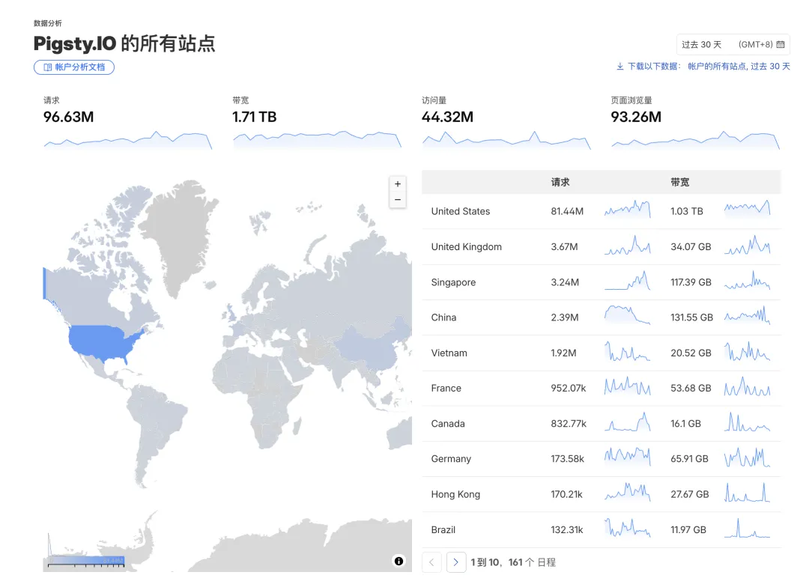

我看了一下网页分析，月度真人 UV 也就几万人，月 PV 大概是几十万的量级。那剩下接近 1 亿的请求量是哪儿来的？从 User-Agent、访问路径和触发方式来看，很大一部分已经不是传统意义上的真人访问，而是 AI 工具在读文档。

### 4 谁在访问？

我琢磨了一下，才想明白这件事。年初我们发 Pigsty 4.0 的时候，加了一个叫 DBA Agent 的特性。这个名字听着很高大上，其实它就是一个 `CLAUDE.md` 文件，里面写的东西特别朴素：第一，不要删库；第二，有问题看文档；然后下面把文档链接全贴上。就这么简单的一个东西，结果用户群里慢慢出现了一种新人——他们不一定懂 PostgreSQL 和 Linux，但他们有 Claude Code，有 Codex。

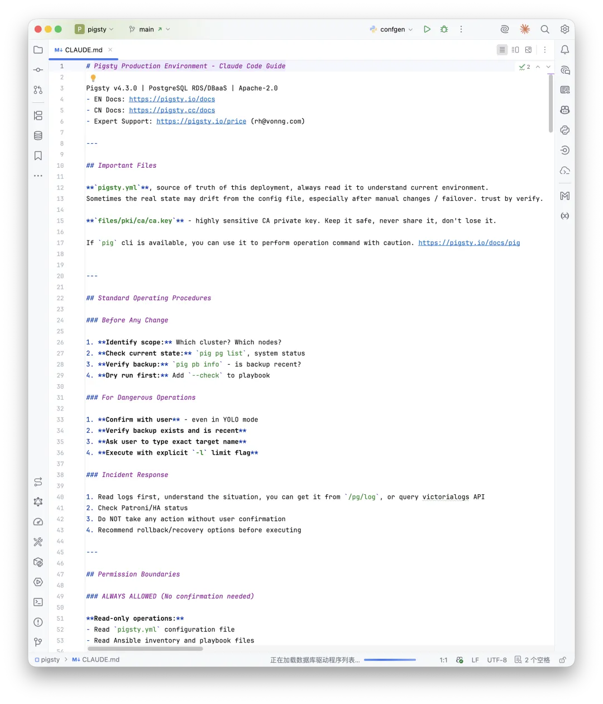

他们在 Linux 上对着 AI 动嘴：“帮我装个 PG”“帮我加个用户”“帮我看看这个问题怎么解决”。AI 为了干这些活，就要不停地去读文档。所以那接近 1 亿的请求，不是人类手工点出来的，而是 Agent 替这些用户去读的。Agent 已经在替这些用户扮演 DBA 的角色，而且——干得还挺不错。

### 5 Agent 已经在干 DBA 的活

老实说，我觉得这些 Agent 干得还不错。我自己遇到一些疑难杂症，也会这么用。我会在一个仿真环境的 Pigsty 目录里告诉它：我遇到了这个问题，或者客户遇到了这个问题，你根据源代码、配置、日志和文档，帮我分析一下可能原因。有时候我会给它几个直觉方向：A、B、C，你帮我判断哪个更可能。

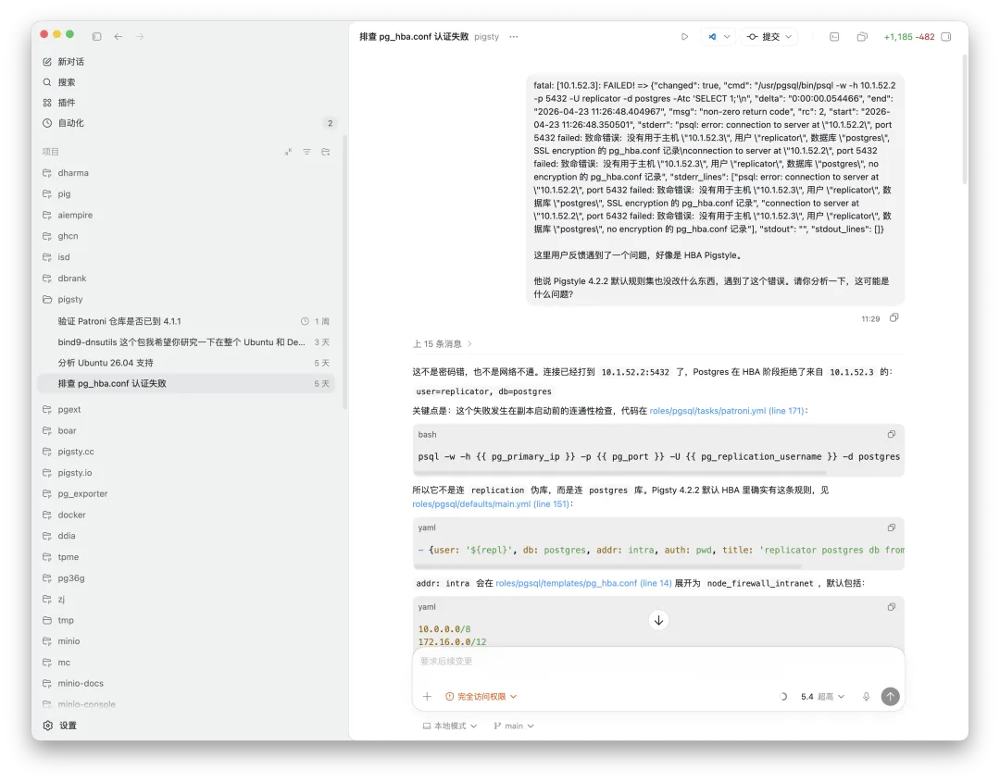

它最后分析出来的东西，很多时候八九不离十。不是说它永远正确，但它已经足够让人刮目相看。所以今天讲 DBA Agent，并不是讲一个 PPT 上的概念，我讲的是一个已经在开源项目用户里真实发生的现象。

### 6 D-Bot 已经验证过

更有意思的是，现在大家一窝蜂涌入 DBA Agent 赛道，其实两年前就已经有人在 Pigsty 上做过了。

清华大学周轩赫团队基于 Pigsty 的环境，做出了一个叫 D-Bot 的 DBA Agent，论文后来发表在 VLDB 上。那时候他们用的还是 GPT-4，即使在当时的模型条件下，他们也已经能让 D-Bot 在 Pigsty 环境里完成相当复杂的故障诊断，并生成有依据的根因分析和处置建议。

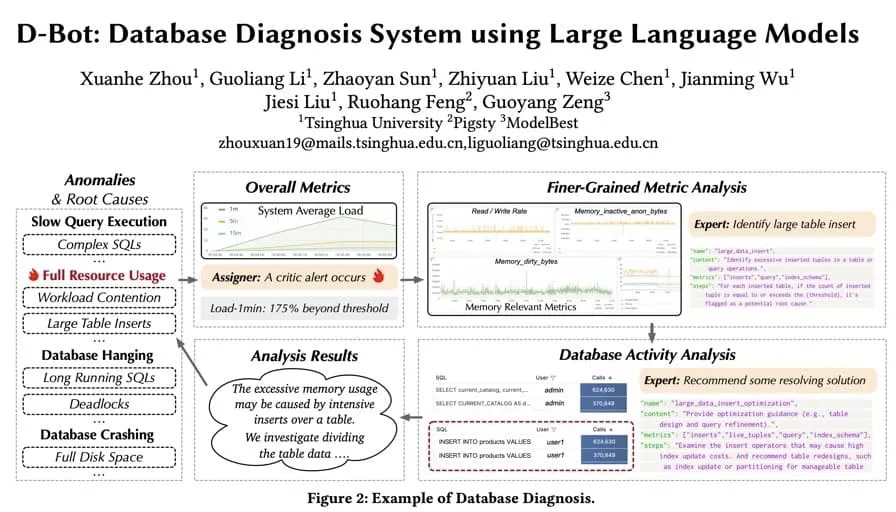

他们选择 Pigsty 的一个重要原因，是 Pigsty 提供了这样一个开源开放、标准化、生产质量的运行时环境。所以他们只需要实现智能逻辑，不用从头搭基础设施：数据可以直接从监控系统里拿，要执行什么操作，也有现成的命令行原语。两年过去，模型能力已经翻了不知道多少倍。那今天，我们手里这套 Runtime 加 SOTA 模型的组合，又能做出什么样的东西？这个想象空间——**我想留给在座的各位**。

---

## 第二部分：理论——身体由什么组成？

### 7 数据库自动驾驶为什么以前没成？

当然，听到这个故事，肯定有人会说：“那 AI 是不是要替代 DBA 了？”我的判断是：这还为时尚早，毕竟 AI 没法替你背锅嘛。但这确实让我们看到了一种可能性：自动驾驶的数据库。这个概念不是今天才有，Oracle 讲过，云厂商讲过，学术界也讲过。

但这么多年下来，没有几个真正好用的。我认为在当下的技术条件下，这件事其实已经可以做了。即使全自动 L5 现在做不到，作为 Copilot 形式的副驾驶辅助，肯定没问题。所以真正的问题是：我们到底应该给它准备什么，才能让数据库自动驾驶起来？

### 8 数据库需求金字塔

我之前画过一个数据库需求金字塔。金字塔尖是智能——数据库自动驾驶，这是圣杯。但要实现这一点，它下面必须有掌控与洞察——你得能看见、能控制。再下面，是质量、安全、效率、成本这些基本盘。你连监控都没做好，连变更都还靠祖传脚本，连高可用和时间点恢复都不能稳定演练，那就不要谈数据库自动驾驶。

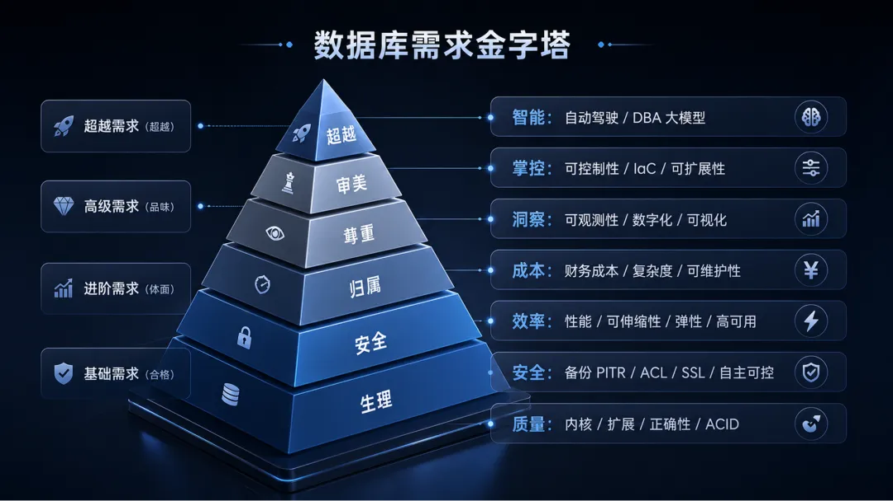

这就像你想造自动驾驶汽车，结果车上没有传感器、没有刹车、没有方向盘、没有安全气囊，算法再聪明，有什么用？所以 DBA Agent 的核心不是模型，也不是 Agent 框架，而是一个确定性的环境，以及与这套环境交互的身体。这也是今天演讲的主题。

### 9 身体的两大基础：眼睛与手脚

给 Agent 一个身体，到底是什么意思？我觉得最基础的两件东西是眼睛和手脚。第一，眼睛——可观测性。它要能看到数据库、操作系统、网络、磁盘、连接池、备份、复制延迟和历史趋势。第二，手脚——可控制性。它要有可靠的动作入口，能执行变更、重启服务、切主、备份、恢复、加用户、扩缩容。先说眼睛。

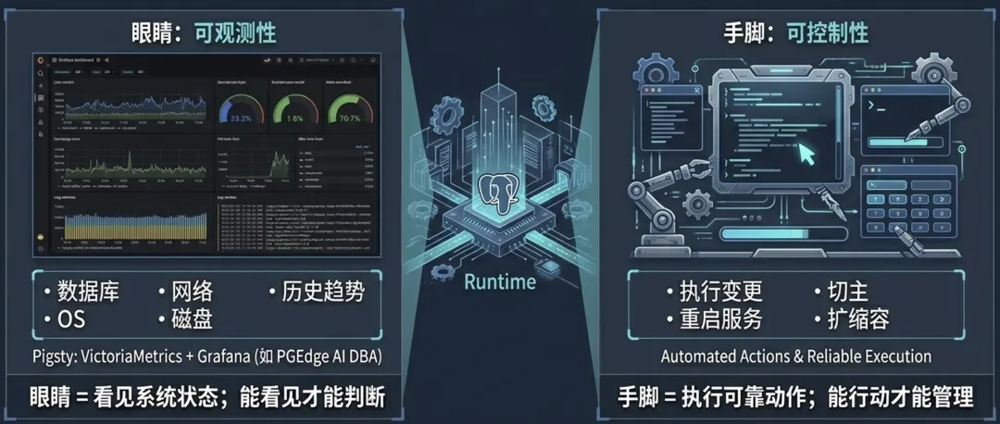

### 10 眼睛：可观测性

任何 DBA Agent 要解决的第一个问题，一定是信息收集。它得知道现在发生了什么。这件事在 Pigsty 里其实很早就做了：Pigsty 提供了一整套基于 VictoriaMetrics、Grafana 的开源可观测性栈，把 PostgreSQL 里能收的观测点基本都收了。无论是 Agent 还是人类，有效管理的基础一定是收集足够的信息。

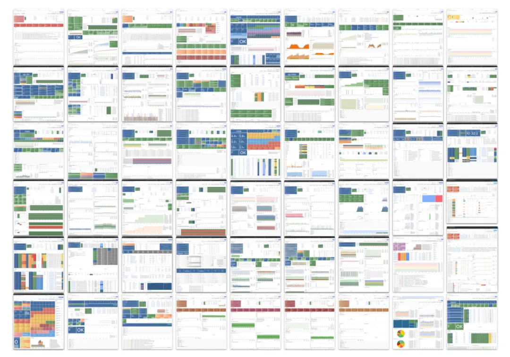

比如这类 AI DBA 产品的形态，通常都会先落在监控上：指标采集、异常检测、告警，然后再加一个和 Agent 对话的入口。PGEdge 的 AI DBA Workbench 就是一个典型例子。这其实说明，监控系统肯定是 DBA Agent 最基本、最重要的东西。但是监控系统这件事，我已经讲过好几次了，今天不想重复。今天我想讲讲身体的另外一部分，也就是“手脚”。我们今天不讲“眼睛”，我们讲“手脚”。

### 11 数据库自动化的四个阶段

数据库管理从自动化角度看，大概经历了几个阶段。第一阶段，纯手搓，DBA 自己敲命令。第二阶段，祖传脚本，或者控制台里点点点，也就是所谓的 ClickOps。第三阶段，IaC——用 Ansible、Terraform、Operator 这类东西做声明式管理。第四阶段，Agent——人不再逐条写命令，而是告诉 Agent 目标，让它观察、计划、执行、验证。这里有一个很关键的点：Agent 要进入第四阶段，必须先有第三阶段的基础。没有 IaC，Agent 很难稳定工作。这件事我后面会专门讲，先回到一个更具体的问题——Agent 到底应该怎么操作数据库？

### 12 专家和 Agent 都需要动作接口

Agent 操作数据库，是让它打开浏览器，在控制台里点点点？还是调用 API？还是用命令行？

对专家和 Agent 来说，真正重要的不是 GUI，而是一个明确、可组合、可审计、可复制的动作接口。CLI 是最自然的形态之一，尤其当它同时支持 JSON / YAML 这种结构化输出时，它就既适合人，也适合 Agent。

所以我有一个判断：Agent 时代会重新复兴 CLI 的价值。这其实也回到了 Unix 哲学最初的样子——一切皆文本，一切皆可组合。

### 13 PG 生态的问题：工具太碎了

但这里有个尴尬的现实：PostgreSQL 生态很强，但也很碎。你要安装 PG，可能用 `apt` 或 `dnf`；启动服务，可能用 `systemctl` 或 `pg_ctl`；执行 SQL，用 `psql`；管理高可用，用 `patronictl`；备份，用 `pgBackRest`；连接池，用 `PgBouncer`；扩展，又是另一堆包和配置。老司机当然没问题，老司机知道每个工具该怎么用，知道坑在哪里。但如果你想让 Agent 管数据库，这就成了问题——Agent 需要的是一个统一的动作入口，它不能每次都在一堆零散工具和祖传脚本里猜。所以我们就想，能不能做一个东西，把这些零散的工具统一起来。

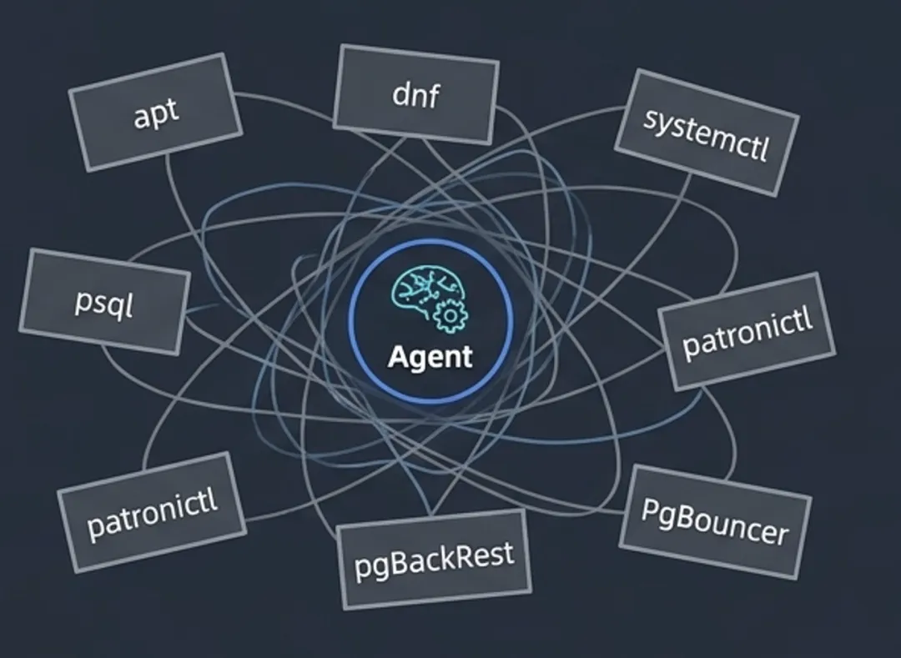

### 14 Pig CLI 的起点：一个扩展包管理器

我们做的工具叫 Pig CLI，最早其实很简单——它是我用 Go 写的一个小工具，主要解决 PostgreSQL 和扩展安装的问题。它不是要重造 `apt` 或 `dnf`，而是在 `apt` / `dnf` 之上加一层 PostgreSQL 语义。为什么？因为传统包管理器只知道“包”，不知道“PostgreSQL 扩展”。你说我要装 `vector`，包管理器不知道你到底要哪个包、哪个 PG 主版本、哪个 Linux 发行版、哪个架构。Pig 做的第一件事，就是把“包”翻译成“数据库能力”。

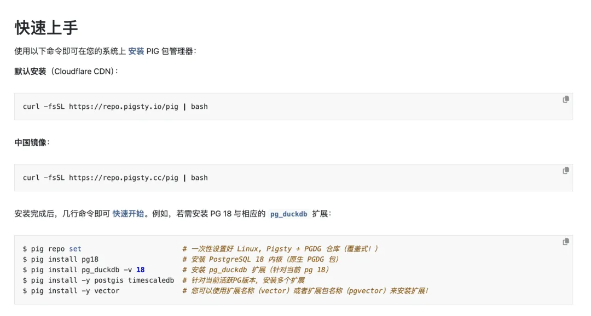

### 15 不要小看安装这件事

不要小看安装。很多新手上手 PostgreSQL，第一个拦路虎就是扩展安装。他想用一个扩展，但没有能力自己编译、打包、构建、分发，那就只能找现成的二进制包。找不到怎么办？网络环境不好怎么办？版本不匹配怎么办？这件事对老司机不难，但对新人非常劝退。Pigsty 做的一件重要工作，就是维护 PostgreSQL 扩展的二进制分发能力，把大量第三方扩展整合进来，让它们在主流 Linux 发行版上开箱即用。这就把 PostgreSQL 的很多“超能力”，真正交到了普通用户手里。

### 16 但 DBA 的工作不只是安装

当然，如果 Pig 只能安装扩展，那还是太弱了。DBA 真正的大头，是 Day 2 Operations。装完之后，你要创建集群、初始化目录、配置权限、调整参数、创建用户和数据库、配置连接池、配置备份、配置监控；后面还有切主、扩容、缩容、恢复、巡检、清理、Repack、升级。这些以前在 Pigsty 里主要通过 Ansible Playbook 完成，你让 Claude Code 去读文档、跑 Playbook，它也能干，但使用体验还不够好。我们真正想要的是：把日常 DBA 管理所需的原语，统一收纳到一个命令行工具里——也就是把 Pig CLI 从一个扩展包管理器，演化成一个能完整管理 PG 状态的工具。

### 17 Pig CLI 的愿景：PG 生态的瑞士军刀

所以 Pig CLI 后面的目标，就不是简单的包管理器了。它要变成 PostgreSQL 生态里的瑞士军刀：安装 PostgreSQL，安装扩展，构建扩展，初始化集群，管理服务，查看状态，管理高可用，配置备份，执行维护操作。能不能把这些动作都收敛到一个统一入口？这不仅能解放 DBA 的双手，更重要的是，它让 Agent 有了手脚。人可以记住一堆复杂工具，Agent 也可以，但没有必要——给它一个更清晰、更稳定的动作入口，它会干得更好。

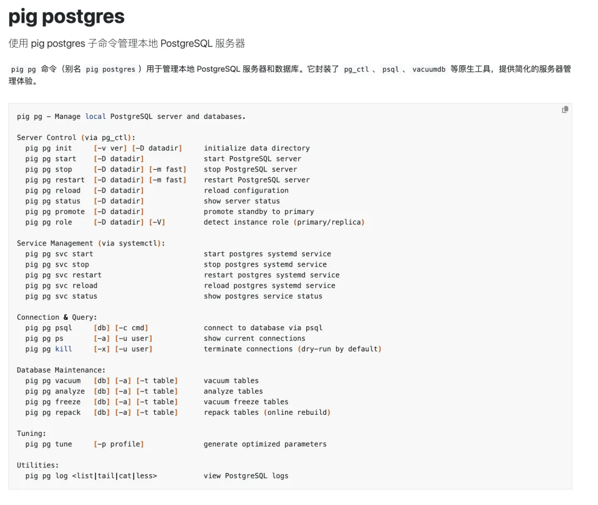

### 18 Agent-Native CLI

但这里又有一个新问题。Unix 哲学讲 KISS——一个工具只干一件事，把它干好，然后通过管道组合。你现在把一堆能力都塞进 Pig CLI，会不会变成一个臃肿的全家桶？这个问题要正面回答。我的答案是：对人类来说，小而美很重要；但对 Agent 来说，自解释更重要。一个 Agent-Native CLI，必须能自己解释自己——它的 `help` 要足够清楚，输出要足够结构化，错误信息要足够明确。人类看彩色文本，Agent 看 JSON / YAML，两边都要照顾。

说白了，最好的工具状态不是你事先给 Agent 写一堆 Skills 文档告诉它怎么用，而是工具本身就足够自解释。Agent 敲一个 `--help` 就能逐层探索：有哪些命令、有哪些参数、参数含义是什么、输出格式是什么、错误码是什么。这件事听起来像细节，其实是 Agent 时代 CLI 设计的核心。当然，要真正实现 Agent 原生，还有很多细节设计：dry-run、幂等性、明确 exit code、机器可读错误、权限边界、危险操作二次确认、操作日志、回滚建议，这里就不展开了。

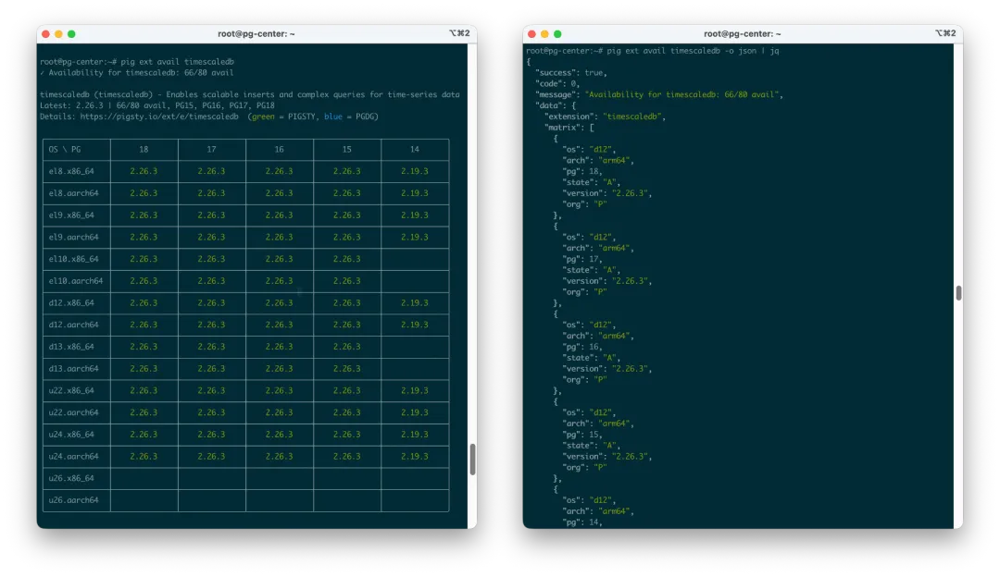

### 19 为什么先做 Linux 原生 Runtime

有人会问：为什么不基于 Kubernetes 来做管理，而是直接做 Linux 上的 PG 管理命令行工具？我的看法是，K8s Operator 当然也是一种 Runtime，但它把很多底层细节封装起来了，同时也引入了额外的抽象层和复杂度。封装对应用开发者是好事，对 DBA Agent 未必总是好事，因为一旦问题穿透抽象层，Agent 需要看到 systemd、磁盘、文件系统、网络和 PostgreSQL 本身。

也就是说，如果你想把数据库运行时这件事做到极致，你不能只掌控数据库连接串，也不能只掌控一层抽象 API，你得掌控数据库真正运行的环境。我们要打造的不是一个只有工具调用能力的 DBA Agent，而是一个能看见完整现场、理解完整现场、操作完整现场的 DBA Agent。所以它需要的不只是手脚，而是一副完整的身体。

---

## 第三部分：转折——工具不够，运行时才是护城河

### 20 一个反例：OtterTune 的故事

有一个案例值得借鉴与思考——OtterTune。它由 CMU 数据库教授 Andy Pavlo 参与创立，融过 1200 万美元 Series A，做 PostgreSQL 和 MySQL 的自动参数调优，后来没有成为数据库自动驾驶的标准答案。为什么会走到这一步？他们的产品形态是：你给我一个数据库连接串，我就能给你调优。听着很美，对吧？但连接串是所有 PG 服务的最大公约数。光靠连接串你能做什么？你能跑几条 SQL，看几个系统视图。但你看不到完整的历史趋势，重启不了数据库，改不了需要重启才生效的参数。出了问题你没法级联排查——这是业务问题、数据库问题、OS 问题、网络问题？你统统看不到。

### 21 没有 Runtime，就没有专家级 DBA

我从 OtterTune 这个案例里读到的一个教训是：如果只有连接串，没有 Runtime，你很难做出专家级 DBA Agent。一个连接串只是一个细细的猫眼，你只能透过它看到房屋内的一块角落。但真正的细节，隐藏在操作系统、磁盘、文件系统、服务管理、监控历史、备份链路这些地方。一个工具再聪明，如果只能透过猫眼看世界，它就永远做不出专家级的判断。

Pigsty 最早是一个监控系统。那它为什么后来变成了一个完整的 PG 全家桶发行版？就是因为我后来意识到，你要想把监控系统做到极致，就必须直接接管整个基础设施。否则，你根本控制不了用户怎么部署数据库。你能拿到手里的只是一个连接串，而你能做到的事情是极其有限的。所以做 DBA Agent 真正的关键，不是命令行工具有多漂亮，而是它背后挂着一个什么样的 Runtime。

### 22 Runtime 才是真正的护城河

现在很多人做 Agent，喜欢讲 Prompt、Skills、工作流。这些东西当然有用，但我说句直接的——它们构不成很强的护城河。你把老司机 DBA 的经验写成 Markdown，模型厂商也能看，别人也能学，下一代模型出来，很多知识直接就被吸收了。那真正的护城河是什么？是 Agent 对你私有环境的理解。这个环境怎么部署的？有哪些实例？备份策略是什么？过去发生过什么告警？哪些操作做过？哪些坑踩过？这些东西不会出现在通用训练数据里。

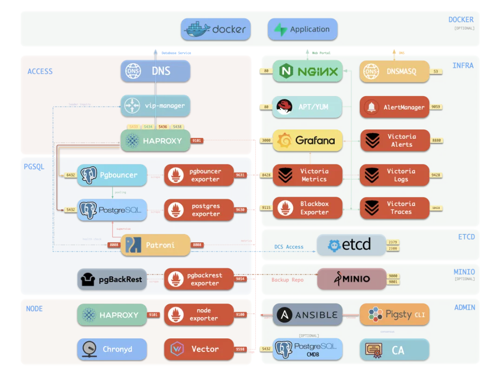

所以一句话总结：单独做一个通用 Agent，壁垒不会太深；真正有壁垒的是 Agent 对 Runtime 的理解，以及 Runtime 本身沉淀下来的状态、历史和操作边界。

### 23 Runtime 的难点：上下文工程

那 Runtime 怎么变成 Agent 能用的东西？这就是真正难的地方——上下文工程。你怎么把正确的信息喂给它？我的观点很明确：现在自己从头写一个所谓的 DBA Agent 框架，大概率不如直接用 Claude Code、Codex 。真正难的不是外面那层 Agent 框架，而是怎么把正确的上下文、正确的权限、正确的工具边界喂给它。

对 DBA Agent 来说，上下文不是聊天记录，而是拓扑、指标、日志、配置和变更历史。拓扑告诉它系统长什么样，指标告诉它现在哪里不对，日志告诉它发生了什么，配置告诉它为什么会这样，变更历史告诉它是谁刚刚动过什么。信息主要来自两边：一边是观测侧——监控、日志、告警、指标、历史趋势；一边是管控侧——Inventory、配置、权限、Playbook、CLI、备份恢复入口。这两边打通，Agent 才能从“会聊天”变成“会干活”。

### 24 IaC 是 Agent 的中心法则

讲到这里，我要把一个东西单独拎出来，因为它是 Pigsty 里 DBA Agent 能跑起来的最核心、最灵魂的秘密——那就是 IaC。Pigsty 的整个环境，是由一份 Inventory 定义出来的。几节点、谁是主、谁是从、监控在哪、备份在哪、端口是什么、角色是什么——这些东西全在配置清单里。

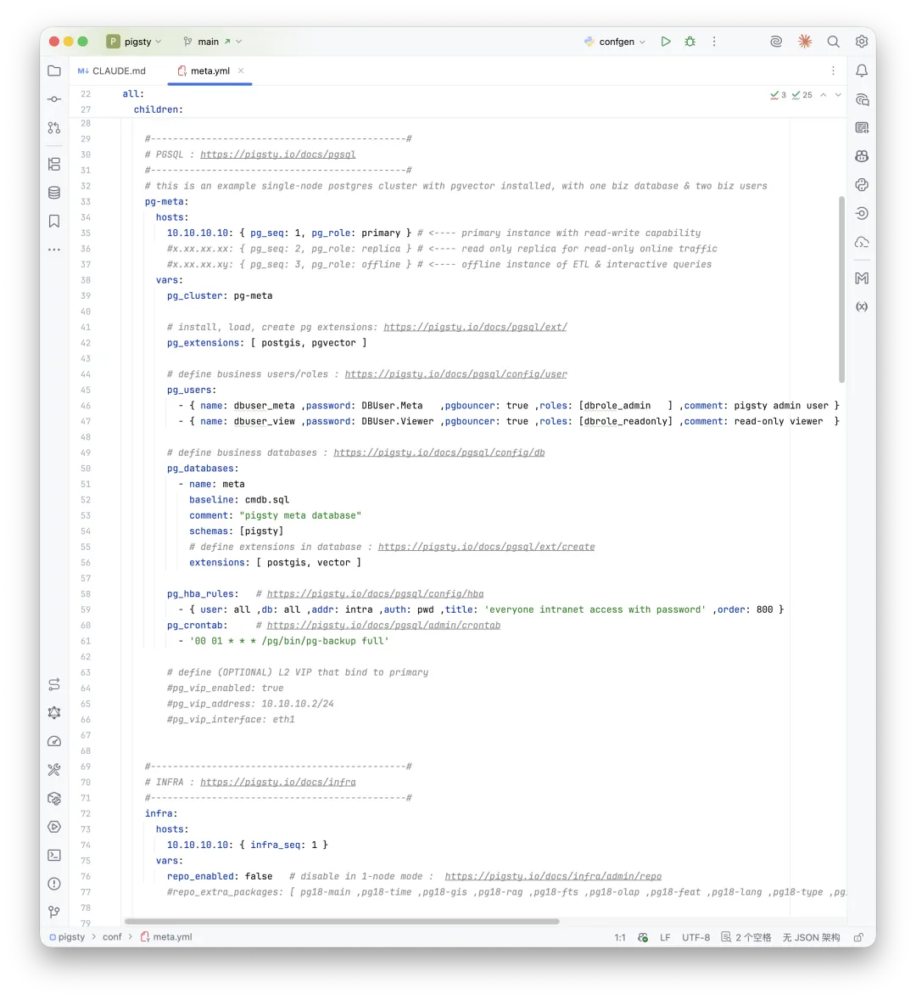

这份清单不是事后写的说明书，它就是生成整个环境的蓝图。Agent 拿到这份蓝图，就知道这个环境长什么样。它不是在一个陌生世界里瞎猜，而是在读这个世界的源代码。这就是 IaC 对 Agent 的真正价值——它让环境本身变得可读，并且浓缩在一个文件中。

### 25 高手都是人剑合一

讲到这里，前面这些拼图就可以缝合起来了。我用一个比喻——高手讲究人剑合一。剑客和长剑合一，程序员和键盘合一，老司机和方向盘合一，DBA 也是一样。DBA 的能力不只是脑子里知道数据库原理，而是他和自己的环境合一。一个顶级专家到了陌生环境里，表现未必比得上一个在这个环境里泡了三年的普通人——因为后者知道哪里有坑，知道哪个机器慢，知道哪个参数不能动，知道哪个业务一到晚上就抽风。Agent 也是一样。你把 Claude Code 丢进一个完全陌生的 Linux 环境，它也会蒙；但你把它放进一个确定性的 Pigsty Runtime 里，再给它 Inventory、监控、文档、CLI，它就能干很多事。

### 26 只读建议可以，自动执行要谨慎

当然，我也要泼一点冷水。对于严肃生产环境，我不建议大家一上来就让 Agent 全自动接管数据库。现在比较靠谱的形态，还是 Copilot——Agent 帮你收集信息，分析问题，生成方案，解释风险，然后由人来确认；要么人执行，要么人授权它执行。特别是删除、销毁、不可恢复这类操作，必须有强约束。

回到我们一开始说的——AI 没法替你背锅。责任无法转移，操作就必须有人确认。这就是为什么 DBA Agent 必须先做扎实的 Copilot，而不是激进的 L5 全自动驾驶。今天，DBA Copilot 的只读建议+人工执行这条路径，已经具备生产可用的成熟度。下一步，是把这条路径里的每一步都打磨得更加可靠。

---

## 第四部分：外推——从 DBA Agent 到 Dev Agent

### 27 不只是 DBA：piglet.run

前面讲的都是 DBA Agent，是企业级部署、大规模 PostgreSQL 集群。但还有另一类用户——个人开发者，或者小团队。他们不一定需要一套复杂的 DBaaS 管理系统，他们需要的是一个开箱即用的开发运行时。

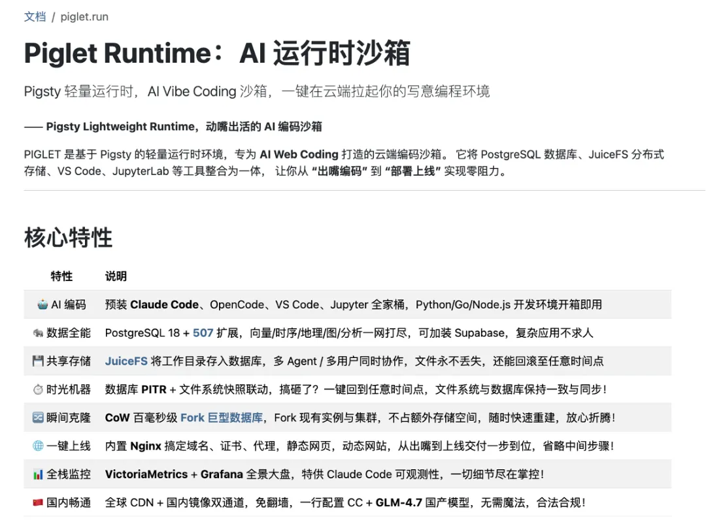

这就是 piglet.run 想解决的问题：把 Pigsty 里面这套可观测、可控制、可回滚的能力，收敛成一个给个人开发者和小团队使用的开发运行时。一条龙从 Linux 虚拟机，帮你配置好 PostgreSQL、Nginx、监控系统、开发工具、Claude Code、Codex、Code Server 这些东西，然后你就可以让 Coding Agent 在这个环境里干活。为 DBA Agent 准备的那个 Runtime——可观测、可控制、可回滚的环境——对 Dev Agent 来说同样适用，甚至更好用。

### 28 pg.center：一个真实的小例子

我举个自己的例子。我最近做了一个小项目，叫 pg.center，是 postgresql.org 的非官方中文镜像站。以前你想做这么一个东西，其实不算小活：你要找网站仓库，要处理内容抓取，要翻译，要生成页面，要部署，要定时同步更新。但现在做法很简单：我登上一台云服务器，一行命令把 Runtime 拉起来，Nginx、数据库、监控、编程环境都装好。

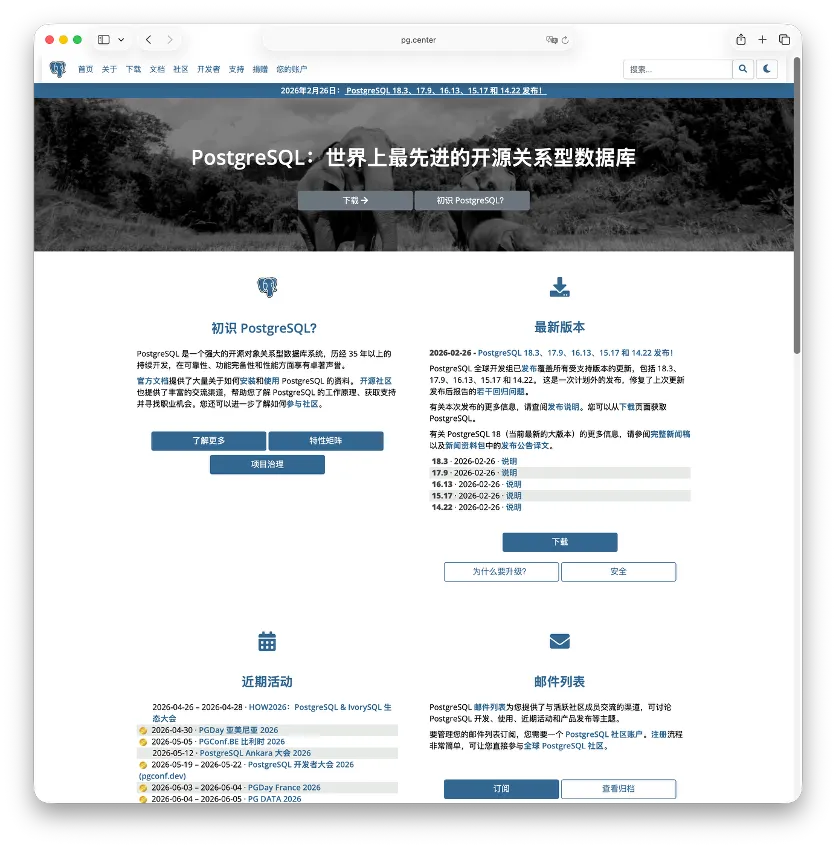

然后我打开 Claude Code，告诉它：“我想把 PostgreSQL 官网做一个中文版，你先拟一个计划，然后执行。”最后大概一天时间，这个站就跑起来了，而且可以定时同步更新。这就是 Runtime 的价值——你不是在本地写完再部署，而是让 Agent 直接在一个确定性的生产级环境里出活。

### 29 新时代的 LAMP Stack

这让我想到以前的 LAMP Stack。Linux、Apache、MySQL、PHP，那个时代很多网站就是靠这一套快速起飞的。现在时代变了，P 不一定是 PHP，可能是 Node.js，可能是 Go，可能是 Python，也可能是什么 Agent 喜欢用的语言。但有几样东西依然稳定：Linux 要有，数据库要有，Web 入口要有，监控要有。所以我有一个判断——Agent 时代会出现一套新的基础栈，它不是给传统程序员准备的，而是给 Dev Agent 准备的。

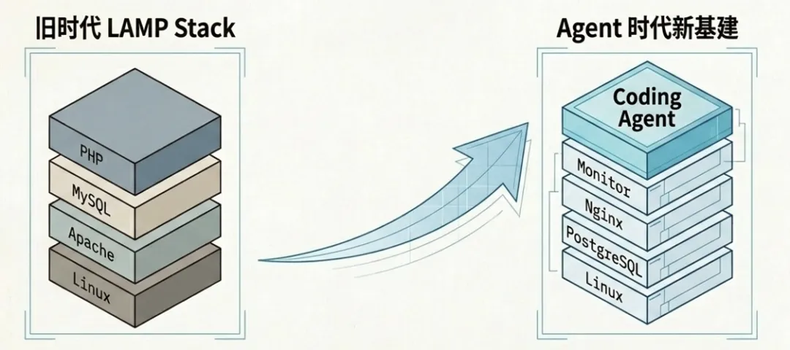

我把它叫做 AI Agent 的 LAMP 套件——Linux、Agent、Monitoring、PostgreSQL。这当然不是严格复刻当年的 LAMP，而是 Agent 时代的一个新记忆锚点：Linux 提供环境，Agent 提供执行，Monitoring 提供眼睛，PostgreSQL 提供数据和状态。而 Pigsty 就能为你提供这个套件。有了这套东西，一个开发者想做一个网站、一个门户、一个内部系统、一个数据应用，门槛会低很多。你真正要操心的，可能只剩两件事：买个域名，买台服务器，剩下的细节，可以交给 Agent。

### 30 文件系统也应该可回滚

我确实觉得这里面有一个非常有趣的功能值得一提，那就是时间旅行与环境共享。

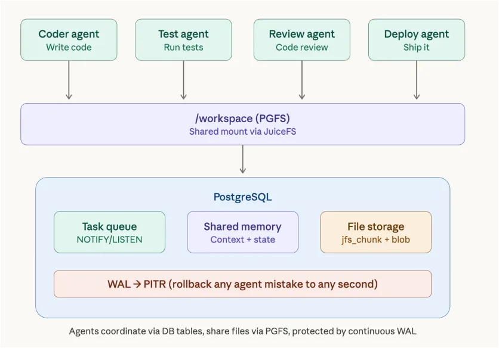

我们用 JuiceFS 做了一件事：把文件系统的状态也放进 PostgreSQL。这意味着——**你的代码、配置、数据库内容现在共享同一个备份和回滚体系**。Agent 搞砸了？一键 PITR，整个环境包括文件系统全部回到 5 分钟前。而且你还可以把这个文件系统挂载到 Linux、Windows 和 macOS 上，多人多设备共享一个目录。

这样的特性对于 Agent 来说极其实用。Agent 可以放心试错，搞砸了就用 PITR 回滚。这种以前属于 DBA 的“终极黑魔法”，现在开始走入寻常百姓家。这给了 Agent 可以大胆试错的底气。

---

## 第五部分：把身体交给社区

### 31 Pigsty 不只是 DBA Agent 的身体

到这里，我们可以把前面的东西收束成一句话：Pigsty 表面上是 PostgreSQL 发行版，本质上是一个 Agent Runtime。它把 Linux、PostgreSQL、监控、备份、高可用、IaC、CLI 和文档放在同一个确定性世界里。对 DBA Agent，它是生产现场；对 Dev Agent，它是开发环境；对 Coding Agent，它是可以试错、验证和回滚的执行环境。

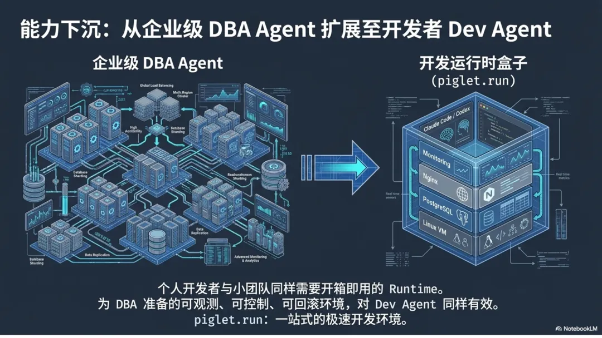

### 32 一个开放的演武场，欢迎你上来

所以我很欢迎想做 Agent 的朋友来 Pigsty 里玩一玩——你可以把它当作一个演武场。这里有真实的 PostgreSQL，有真实的 Linux，有真实的监控，有真实的备份恢复，有真实的高可用，有真实的配置和管理入口。你没必要从零开始重复造轮子——要做 DBA Agent，要做 Dev Agent，都可以拿它当成一个方便的底座。

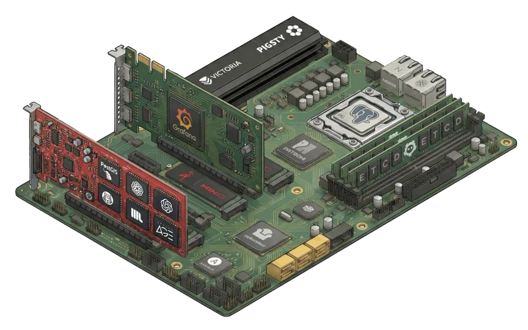

如果你是 Agent 开发者或用户，你不用从底层环境开始搭，只需要让你的 Claude Code、Codex 在这个环境里跑，让它沉淀对这套环境的认识，沉淀为记忆和 Skills。它会越来越熟悉环境，越来越有能力。

### 33 开源共享的运行时

在 Agent 时代，真正有价值的东西不是一段 Prompt，不是一个 Skills 文件，也不是某个看起来很聪明的聊天界面。那些东西都会被复制、被吸收、被快速抹平。真正难复制的，是一整套稳定、透明、可观测、可控制、可回滚的运行时环境。

这就是 Pigsty 想提供的东西：一个开源开放的 PostgreSQL Runtime，一个 Agent 可以真正进入、理解、操作、验证和积累经验的世界。它不是把 Agent 关在一个网页 Demo 里表演，而是把 Agent 放进真实的 Linux、真实的数据库、真实的监控、真实的备份、真实的高可用和真实的现场里验证。

未来不会只有一个 Agent，也不会只有一种正确答案；一定会有一百个、一千个不同方向的 Agent 长出来。它们都需要身体，都需要一个可以落地的环境，而 Pigsty 可以成为这副身体的骨架。

### 34 给 Agent 身体，也是在重塑人自己的位置

我们给 Agent 一个身体，不是为了把人替掉，而是为了解放生产力。DBA 不应该把时间浪费在重复安装、重复巡检、重复查指标、重复写脚本上；开发者也不应该把时间浪费在一遍遍配置数据库、配置 Nginx、配置监控、配置部署流程上。这些事情 Agent 可以做，而且会越做越好。

但这不等于人被替代。恰恰相反，越是 Agent 能干活，人越要往上走。人要定义目标，设计系统，判断风险，制定边界，承担责任。人不再是那个亲手拧每一颗螺丝的人，而是那个决定机器应该如何运转、出了问题谁来负责、哪些事情绝不能交给机器乱来的那个人。

模型会一代一代换，Agent 会一批一批退场；真正留下来的，是那些可复现、可审计、可回滚、可托付的运行时。Pigsty 想做的，就是这样一块地基。别只把它当成一个 PostgreSQL 发行版。把你的 Agent 放进一个可观察、可控制、可回滚的环境里，让它跑，让它试错，让它验证，让它长出真正能进入生产的身体。

谢谢大家。
