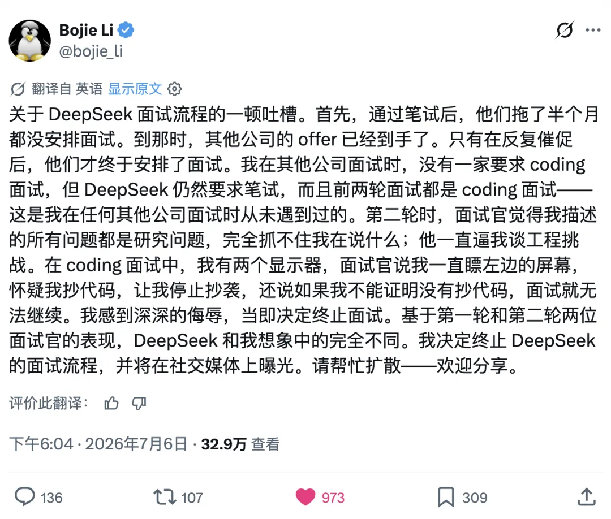
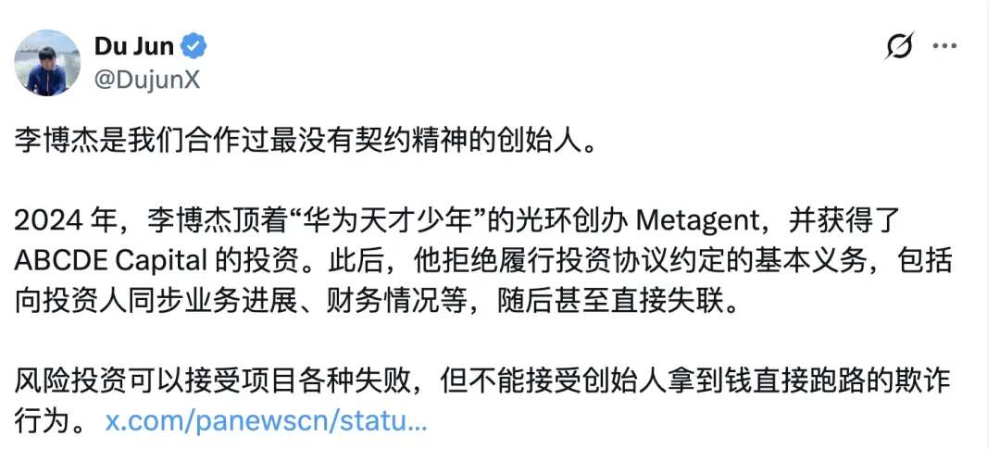
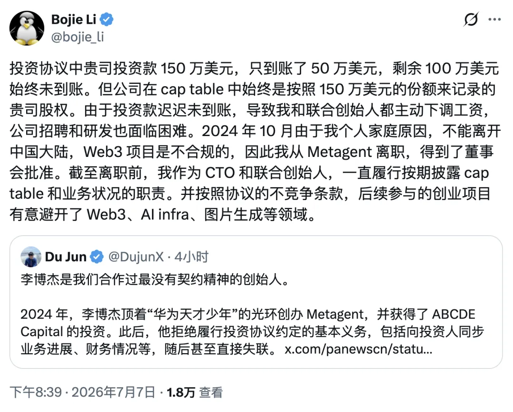

Today's biggest tech drama began when Bojie Li criticized DeepSeek's interview process on Twitter. In short, he went in for an interview, was asked to solve online-judge coding problems, and was then suspected of cheating. Add the DeepSeek name, and the story exploded.

The internet is full of wild speculation. I know a little about what happened, and my own judgment is that Li's account is probably accurate: DeepSeek's interview process really was... less than respectful to the candidate. DeepSeek is a good company, and Mr. Cui is a decent, sincere person. The charitable reading is that DeepSeek had previously recruited almost exclusively on campus and was only beginning to hire experienced people. It lacked experience and botched the process. That is understandable.

But interviews go both ways, and a bad interview is bad PR. This is especially true when hiring experienced people: if you want top talent, you cannot treat candidates like interchangeable new graduates waiting to be sorted. Their time is valuable too. Read the comments and you will find that quite a few people who actually interviewed there have complaints of their own.

From what I know, the process has problems, and that is not good for DeepSeek.

Then people piled on Li, often viciously. What followed was even harder to keep up with. One of Bojie Li's former investors came forward with accusations; Li fired back; and the whole affair turned into an ever-larger mud fight.

I do not know Li, and titles like Huawei's "Genius Youth" do nothing for me. But publicly pillorying someone for describing his own experience is wrong. I can understand why an expert with a proven body of work and reputation would feel insulted when a company subjects him to the same rote questions it uses for bulk résumé screening.

I also know that this was surely not DeepSeek's intention. DeepSeek is a good company, and I hope it does not become an untouchable "You-Know-Who" that nobody is allowed to criticize. That would be bad for DeepSeek itself. It cannot control every overzealous fan online, but it certainly can take candidates seriously and treat them with respect.

---

## How Should We Evaluate Talent in the AI Era?

Now that AI can reliably generate routine code of low to moderate complexity, I think evaluating people with LeetCode-style algorithm problems is pointless. Give those problems to Codex or Claude Code and they will knock out one every few minutes, better than almost anyone coding by hand.

Once the ability to write such code becomes universally available at nearly zero marginal cost, it is like calculating square roots by hand: no longer useful as an evaluation criterion. Nobody tests how quickly you can compute square roots or logarithms by hand—a cheap calculator will crush any human. What matters is the ability to discover, define, and decompose problems; technical taste and the judgment to validate results; and the basic competence to run the entire process end to end.

In my view, grinding online-judge problems is mostly for new grads. I used to do plenty of it myself and, at my peak, even won my company's coding contest. Ask me to do it now and I probably could not—rather like asking you to sit the chemistry section of China's college entrance exam today.

After all these years, databases, Postgres, and startups have long since filled my memory. That low-level coding material was swapped out ages ago. If forced, I could probably grind through a problem in an hour or two. But insisting on writing by hand what a single prompt can solve is simply a waste of time.

I do not think these useless OJ problems help identify talent. They are easy for people who know nothing but test prep to game, so the process ends up selecting a crowd of professional test takers. Just look at Shing-Tung Yau's mathematics program at Tsinghua: it too got reward-hacked.

A different evaluation would be far better. Give the candidate a terminal and have them figure out how to provision a virtual machine and configure Linux and Codex. Then give them a real task of moderate difficulty and watch how they direct Codex with prompts to get it done. Finally, have them submit the complete session and let an AI evaluate it.

When I interviewed at Apple eight years ago, the team lead gave me a problem drawn from the team's own work: they had a huge volume of data to load into Postgres. How fast could I make it? I thought that was a fascinating challenge. From parallel `COPY` and parallel `INSERT` to bulk loading and every trick in the book, I used quantitative analysis, profiling, and testing to choose the parameters. The entire process was interesting, challenging, and practical. It left an excellent impression.

There is another point. If someone already has public work and a reputation to vouch for them, making that person grind generic programmer puzzles while watching them like a suspected thief is not merely rude; it borders on humiliating. The canonical example is Google rejecting Homebrew's creator because he could not invert a binary tree by hand. Nobody thought, "Wow, Google's standards are impressively rigorous." They just laughed at how stupid the process was.

