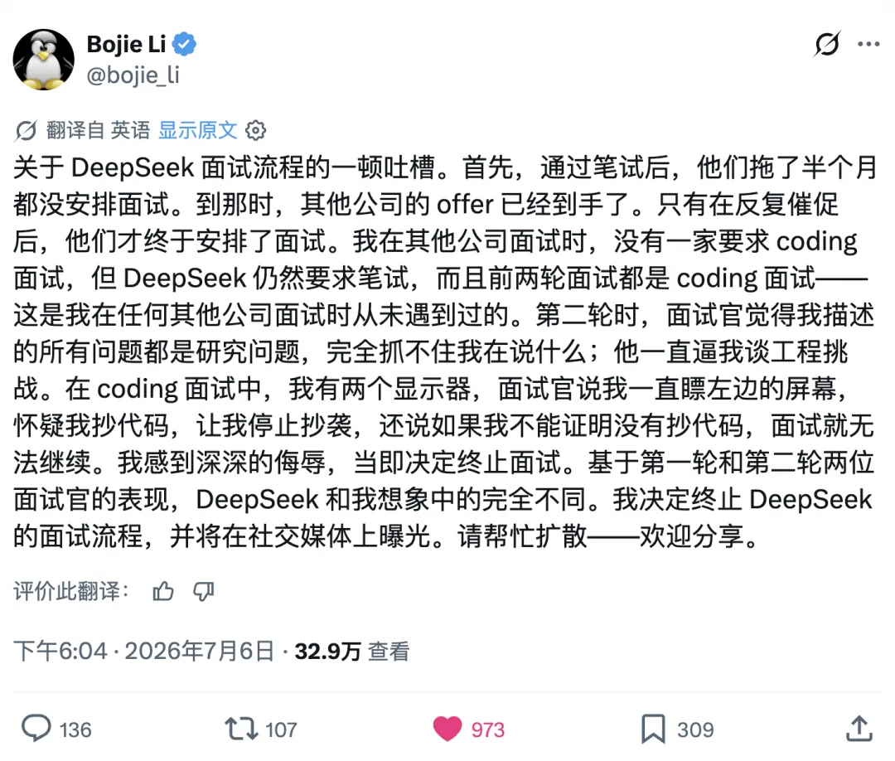
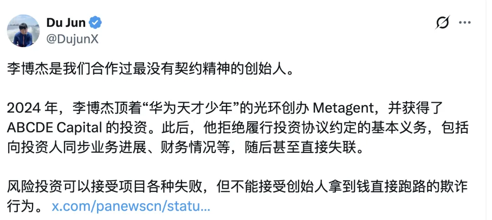
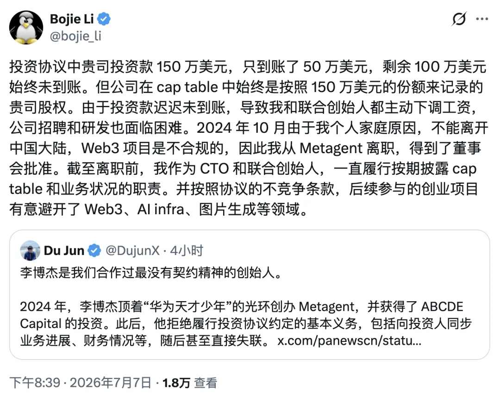
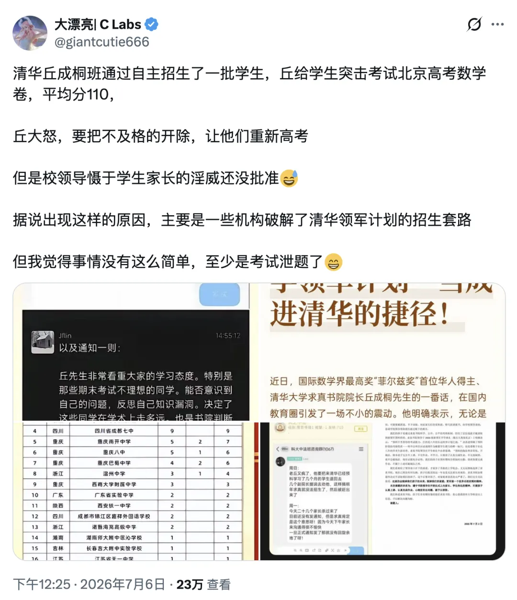

今天最大的瓜应该是李博杰在推特上批评 DeepSeek 引发的争议。大意就是他去面试，被要求刷 OJ Coding 题，然后被质疑作弊。然后一下子踩中 Deepseek 爆点出圈爆炸了。

网上都是各种瞎猜臆测，老冯知道一些情况，我自己的判断是，博杰说的大概率是事实，Deepseek 的面试流程确实 … 对面试者不太尊重。Deepseek 是很好的公司，崔老板也是很好很真诚的人。从友善的角度去看，这个事我觉得可能是他们一直都是纯校招，刚开始搞社招，没经验，玩砸了，可以理解。

但面试是双向的，一次糟糕的面试就是一次糟糕的 PR。特别是社招，你要找顶尖的人才，不是去学校挑选大白菜挑挑拣拣，别人的时间也很宝贵。去评论里看就知道，真正去面过的其实有不少都有微辞。

从我了解到的情况来看，这个流程是有问题的，而这对 DS 来说不是一件好事。

然后有很多人跳出来骂李博杰，骂的也挺难听。随后的事态就更加让人目不暇接了。包括 Bojie Li 的 前投资人 跳出来指控他，然后 Bojie Li 也跳出来反击，事情闹的越来越大，属实是惹了一身骚。

当然，我不认识李博杰，更是对华什么天才少年 title 一点都不感冒。但因为个人表达感受而被公众拎出来毒打，这不好。我能理解他作为一个已经有作品和声誉的专家，被企业用来海筛简历八股题羞辱的感觉。

当然，我也知道这肯定不是 DS 本意，DS 是一家很好的公司，我希望它不要变成那种 “说不得、碰不得” 的 “you know who”，这对它自己也不是好事。当然狂热网友也不是DS 自己能控制的了的，但至少认真对待并尊重面试者，是它自己肯定能做得到的事情。

---

## AI 时代如何考核人才？

老冯觉得，在 AI 已经能够可靠生成中低级代码的这个时代，考核什么立扣题目算法题已经没有任何意义了。那些题目你让 Codex 和 Claude Code 去做，几分钟一道，水平夯爆，吊打手搓。

当写这种代码的能力以几乎为零的边际成本普及，它就变成了像手算开根号这种性质的能力一样。失去考核的意义，就像现在没人会考核你手算开根号，手算对数的速度有多快一样 —— 几十块钱的计算器吊打人类。真正重要的是发现，定义，拆解问题的能力，技术品味与验收能力，以及把整套流程跑起来的基础能力。

在我看来，刷 OJ 基本是给应届码工准备的。老冯以前也刷过不少，巅峰时期还能在公司 Coding 大赛拿个第一。但你现在让我刷这个我也搞不来，就跟现在让你去做高考化学题一样。

这么多年过去，我的内存早就被数据库、PG、创业的内容给占满了。这些低层次写代码的东西，早就 swap out 了。现在要让我硬搞估计花一两个小时硬写也可以，但一行提示词解决的问题非要古法手写，那确实是浪费时间。

我自己的看法是，考核这些没啥用的 OJ，不仅起不到什么筛选人才的作用，反而很容易被光知道刷题的人给钻了空子，筛选出一堆做题家。看看丘成桐的清华数学班就知道了，人家照样被 Reward Hacking。

还不如换种考核方式。给你一个终端，你自己想办法拉起一台虚拟机，把 Linux 和 Codex 配置好。然后给一个中等难度的实际需求，看看你是怎么用提示词使唤 Codex 把这个活儿给做好的。最后把这个完整的 session 发过来，让 AI 评判一下。

8 年前老冯去苹果的时候，当时 TL 给了我一道面试题，就是他们自己遇到的实际问题：他们要把一大堆数据导入 PG，最快能做到多快？我觉得这就是很有意思的挑战题，从并行 COPY，并行 INSERT，到 bulkload，各种奇技淫巧，定量分析 profiling 测试决定参数，我觉得整个过程既有趣也有挑战，也很务实，观感就很好。

另外一个点是，如果一个人已经有了公开的作品和 Reputation 作为证明，再去让人家刷这种码农题，还跟防贼一样盯着，那就不是不礼貌，而近乎羞辱了。brew 的作者被 Google 因为不会手写反转二叉树给拒绝就是个很典的案例，大家不会觉得，啊 Google 标准好严啊好牛逼，只会嘲笑这也太 SB 了。

