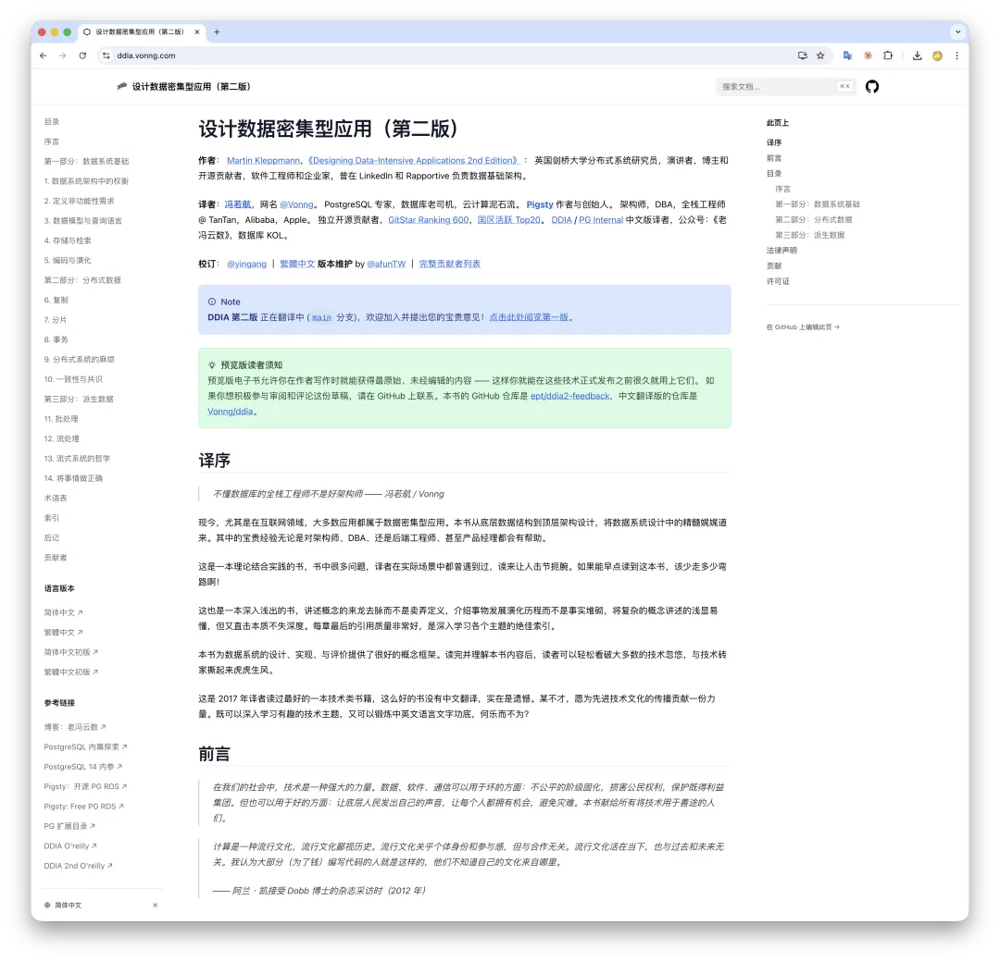
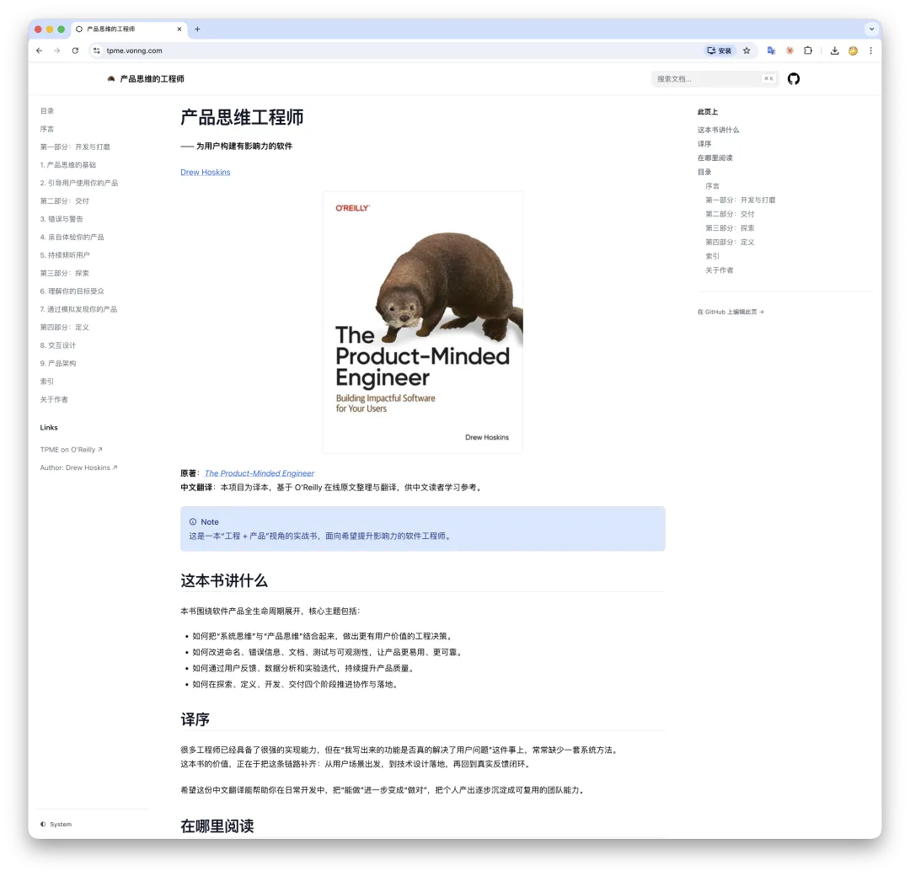
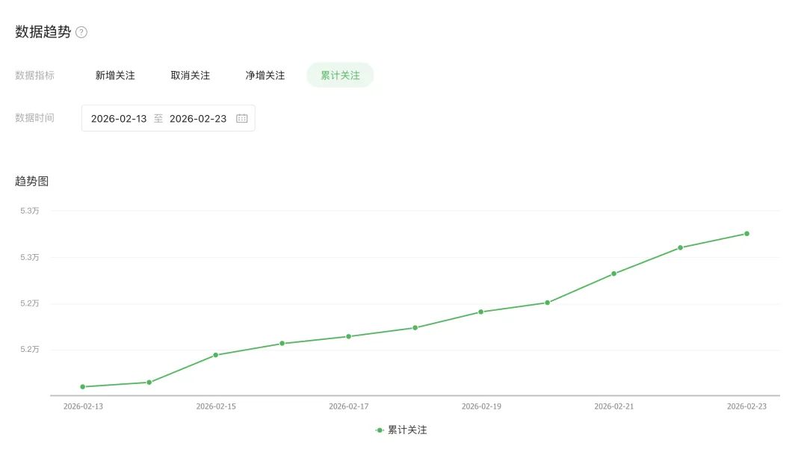
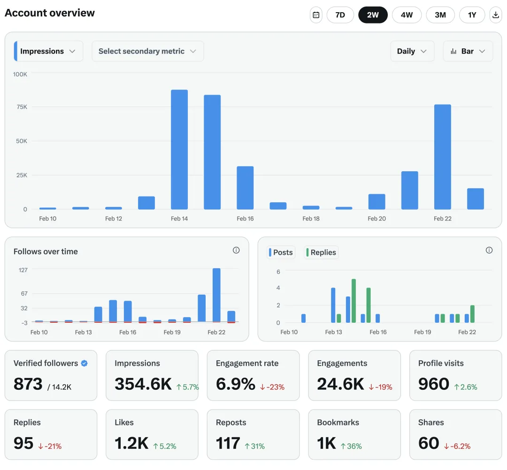
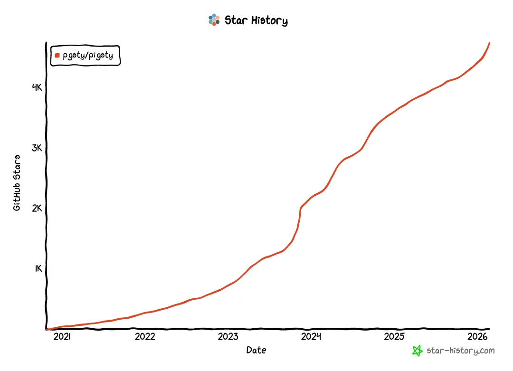
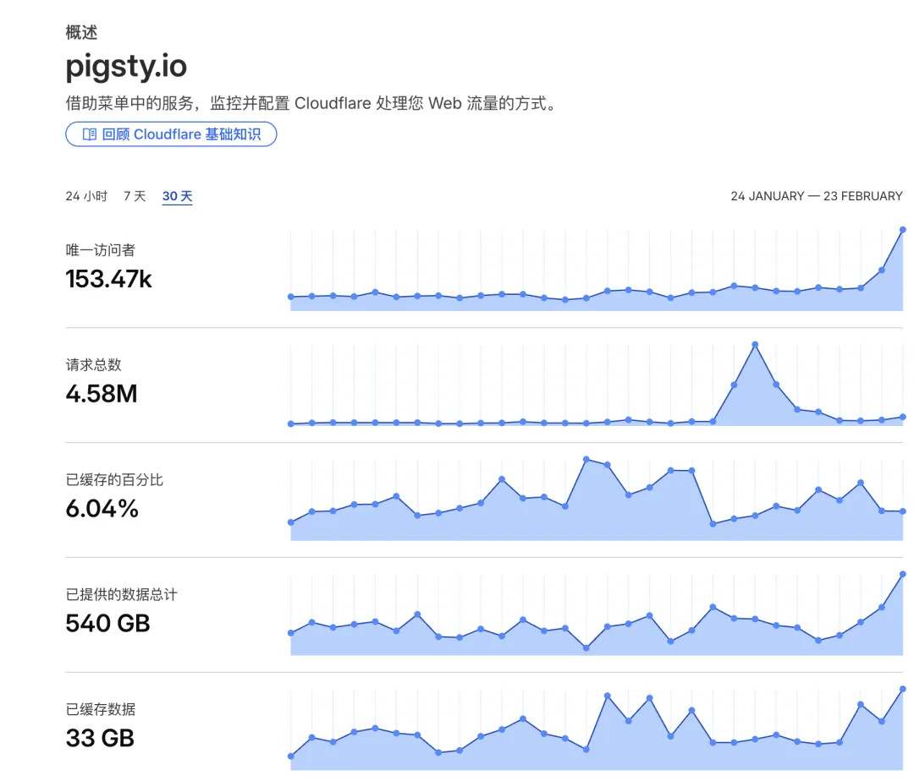
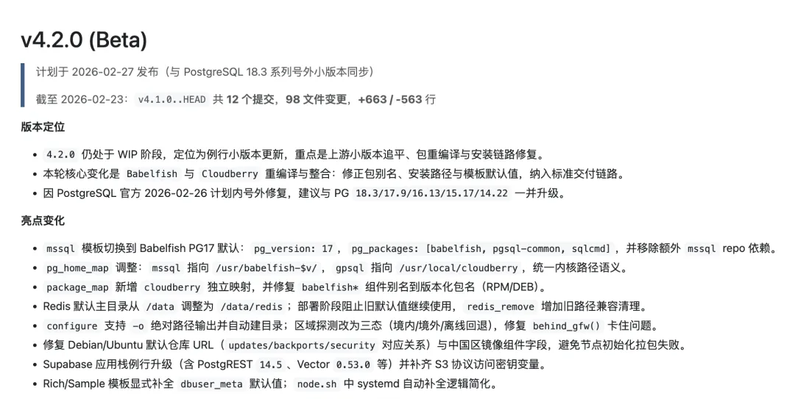
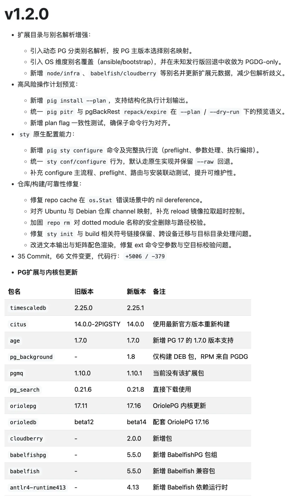
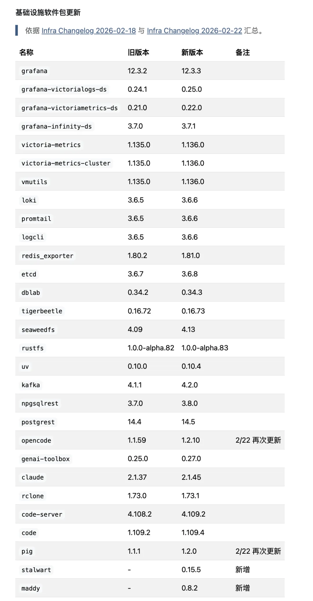

Once the public holiday ended and work officially resumed, I realized I had effectively been working through most of Spring Festival anyway.

From February 13 to February 23, I translated two O'Reilly books, wrote ten WeChat posts, forked MinIO, packaged Apache Cloudberry and Babelfish, updated a large batch of infra packages and PG extensions, shipped a Pigsty release, upgraded the `pig` package manager twice, prototyped a DBA UI called Boar, and kept maintaining Pigsty's Chinese and English docs.

That is a lot for one person. With coding agents, it no longer feels impossible.

## A quick tour

### DDIA v2, in one morning

The second edition of DDIA is one of the canonical books in databases and distributed systems. Translating it used to be a months-long effort. This time, most of the heavy lifting fit into a morning.

### TPME, also done at speed

The same workflow translated another serious technical book fast enough that I mostly kept it for my own reading.

That alone suggests something unsettling: with the right workflow, a single person could now translate a huge slice of technical publishing into readable Chinese at industrial speed.

## Content output did not slow down either

Despite all the engineering work, I still kept publishing nearly daily. Some posts hit especially hard, including the MinIO resurrection piece and the Palantir ontology critique.

Across platforms, that wave also pulled in a few thousand new followers and steady traffic growth.

## Pigsty kept accelerating

Pigsty also benefited directly. When I asked major models to search for the best self-hosted open-source PostgreSQL stack, Pigsty began showing up consistently in the recommendation set.

Then came release work:

The `pig` package manager also moved forward:

And behind that sat dozens of extension and infra package refreshes:

## Why this worked

The most important point is not that "AI writes everything for you." The important point is that once you can orchestrate multiple agents well, one person can move across writing, packaging, operations, documentation, and product work with far less switching cost than before.

That is why the popular notion of the **OPC**, the one-person company, suddenly feels much more concrete. A solo operator can now stack output that previously required a small team.

## A necessary caveat

This does not mean everyone instantly becomes 100x more productive. The effect depends heavily on context.

It works especially well when:

- you already have domain knowledge,
- your workflows are under your own control,
- communication overhead is low,
- and the time saved stays with you rather than being immediately converted into more corporate process.

That last point matters. In a traditional company, higher personal efficiency often just gets translated into more tasks and tighter deadlines.

## Closing

For me, this period made one thing very clear: coding agents do not just speed up programming. They compress the entire loop around programming: translation, packaging, documentation, release work, publishing, and infrastructure operations.

That is why the output jump feels so large. It is not just faster code generation. It is a faster operating system for a technical soloist.
