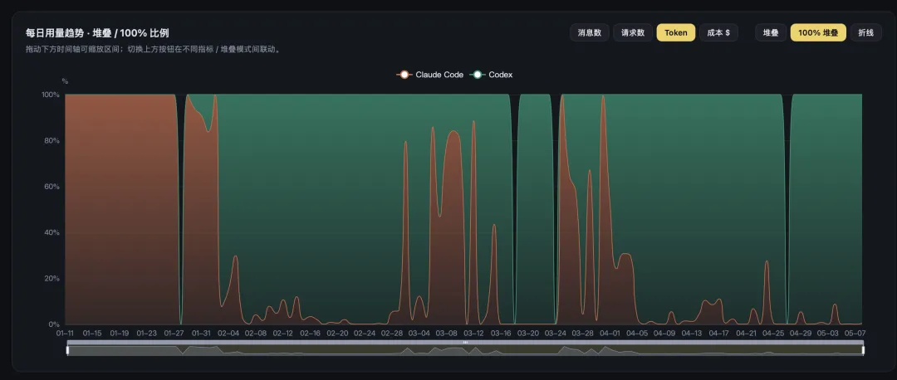
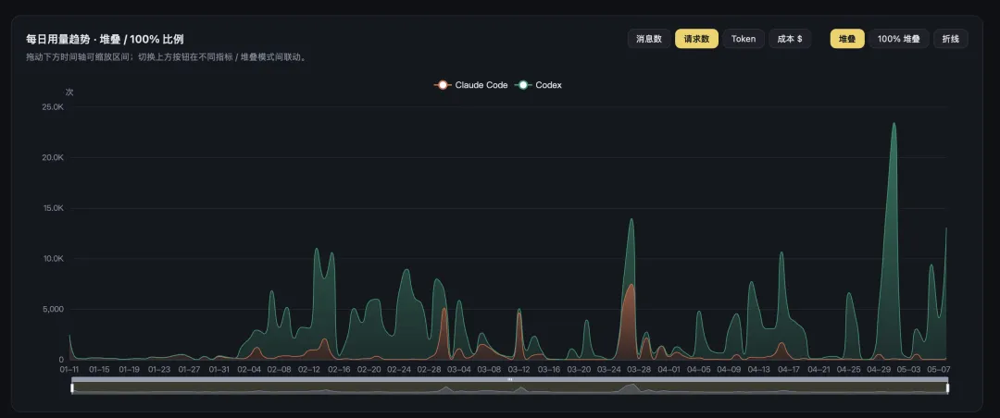

I have written several pieces about Claude Code before. Over the past few months, though, I have used it less and less. Codex is now my primary tool.

A few days ago, my $200 Claude Code Max subscription came up for renewal, so I canceled it and kept only a $20 account to see how things develop. I also registered another OpenAI account for a second $200 Codex subscription. That leaves me with two Codex subscriptions, one $20 Claude plan, and one $20 Google plan.

Tools like these belong on month-to-month subscriptions. The SOTA crown keeps changing hands. Claude was riding high a few months ago; over the past two months, GPT-5.5 has wiped the floor with it.

------

## Want to Know Which Is Better? Put Them to Work

OpenAI's Codex app and CLI have steadily matured, and the underlying models have genuinely overtaken Claude. GPT-5.4 and GPT-5.5 feel dependable on large, difficult jobs. On Anthropic's side, Opus 4.7 is actually a step backward from 4.6. The regression in everyday conversation is even more obvious: I still often have to switch back to Opus 4.6 with extended thinking to have a decent conversation.

The same goes for the surrounding engineering. My DBA Agent work assumed Claude by default, and its project files followed the `CLAUDE.md` convention. In the next release, I plan to switch the default to `AGENTS.md` plus Codex and make that combination the default AI integration stack.

------

## Why Codex

First, the capability gains are real. For large, difficult jobs, the contest is no longer close.

Second, the engineering keeps getting more polished. Codex's CLI, web interface, and automation workflows make the whole experience remarkably smooth. Much of my daily work now runs through automated pipelines: every morning, one produces a daily news brief; another syncs the Pigsty site; another checks for PostgreSQL extension updates and kicks off several downstream workflows whenever a new release appears. As long as my computer is on, it all runs by itself. The GUI app also makes it effortless to manage several tasks at once.

Third—and this matters a great deal to me—the Codex CLI is released under the Apache 2.0 license: plainly and unambiguously open source, unlike Claude Code. I have never been fond of Anthropic as a company. The moment an open-source alternative reaches feature parity, I will switch without hesitation.

------

## A Note on Subscriptions

Readers often message me asking how to pay for these overseas services. My advice is simple: do not overcomplicate it.

Right now, there is one clean route: a US Apple ID, PayPal, and a multicurrency Visa card. Link PayPal to the US Apple ID and subscribe directly through the App Store. Done. Tutorials are everywhere; a quick search will find one. Do not bother with resellers, account top-ups, or shared accounts. They are a tax on the gullible.

Why subscribe? The economics are simple: a $200 subscription buys usage that would cost well over $10,000 per month at API rates. Paying metered API prices for the same volume would mean lighting money on fire. The arithmetic is straightforward. If you know, you know.

Of course, the AI industry can turn upside down in a month or two. Anthropic might drop another major release next month—perhaps the near-mythical Mythos—and reclaim the SOTA crown. At that point, we may all switch back.

But right now, Codex is the best choice.
