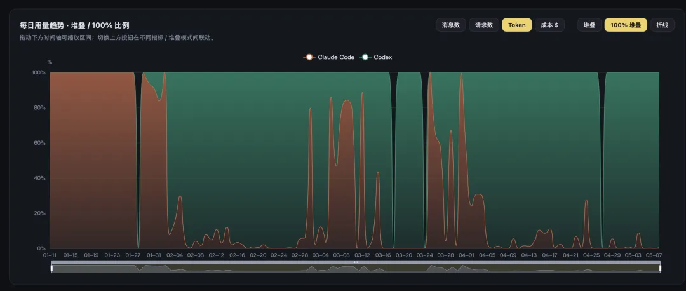
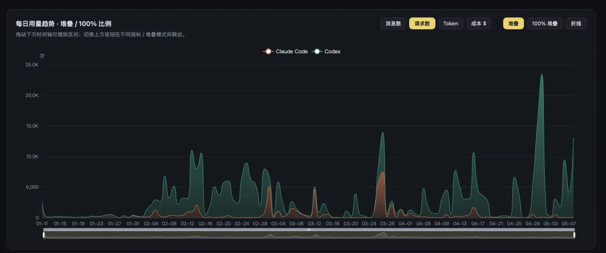

之前老冯写过几篇文章介绍 Claude Code。不过最近这几个月，我已经用得越来越少了，主力换成了 Codex。

前两天正好赶上 $200 的 Claude Code Max 订阅到期，干脆顺手退掉，只留一个 $20 的小号继续观察。同时新注册了一个 OpenAI 账号，准备再开一份 $200 的 Codex。现在手上是两份 Codex，加一个 $20 的 Claude，外带一个 $20 的 Google。

这种东西就得按月订阅。风水轮流转，SOTA 轮流当，你方唱罢我登场。前几个月还牛气哄哄的 Claude，这两个月已经被 GPT-5.5 按在地上摩擦。

------

## 谁强谁弱，干一票就知道

OpenAI 这边的 Codex App / CLI 越做越扎实，模型能力也实打实地反超了 Claude。做大活、做硬活的时候，5.4、5.5 给我的感觉就很稳。而 Claude 那边的 Opus 4.7，相对 4.6 反而是退步的；日常对话的退步更是肉眼可见。到现在，我经常还得切回 4.6 extended thinking，才能聊得顺。

模型如此，工程也如此。我之前在搞 DBA Agent，默认假设用户用 Claude，对应的文件也都是 `CLAUDE.md` 这套东西。下个版本，我准备直接把默认换成 `AGENTS.md` + Codex，让这套组合变成 AI 接入的默认载体。

------

## 为什么是 Codex

第一，能力是真的上来了。大活、硬活的较量，目前已经没什么悬念。

第二，工程做得越来越精致。Codex 的命令行工具、Web 端、自动化工作流，整套体验都非常顺手。我现在很多日常工作都接成了自动化流水线：每天早上自动出一份日报新闻，自动同步 Pigsty 的站点，自动巡检 PG 扩展更新，一旦有新版本就触发后续的多件工作流。电脑开着，它自己就在跑。而且在这个 GUI App 里面，同时控制多个任务非常轻松自如。

第三，也是老冯非常在意的一点：Codex CLI 是 Apache 2.0 协议开源的，光明正大开源，不像 Claude Code 那样遮遮掩掩。我对 Anthropic 这家公司一直没什么好感。哪天有功能对等的开源替代品出现，我会毫不犹豫换掉。

------

## 顺便说说订阅这件事

经常有读者私信问怎么订阅这种海外服务。老冯的建议只有两个字：别折腾。

目前最干净的路径就这一条：美区 Apple ID + PayPal + 一张全币种 Visa 卡。把 PayPal 绑到美区 Apple ID 上，从 App Store 里直接走订阅，完事。教程满地都是，搜一下就有。不要去搞那些什么中转站、代充、共享号，那些都是赚傻子钱的。

至于为什么要走订阅，逻辑很简单：你是在用 $200 撬动每月相当于上万美元 API 额度的使用量。要是真按 API 价格付，那就是纯纯大冤种了。这是基本原理，懂的人自然懂。

当然，AI 行业一两个月就会大变天。说不定下个月 Anthropic 又憋出一个大版本，比如把它那个“神话” Mythos 发布，把性能重新拉回 SOTA。那时候，大家伙说不定又切回去了。

但就现在而言，Codex 是最佳选择。
