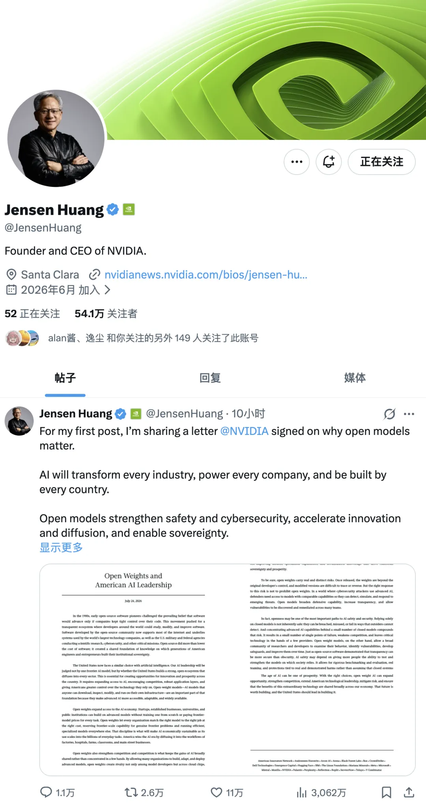
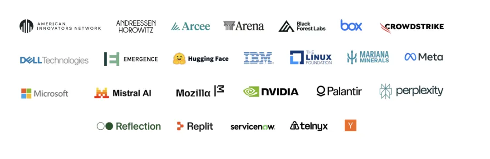
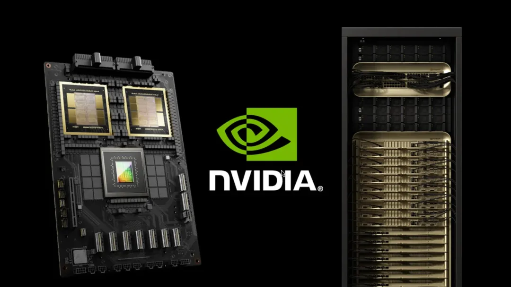
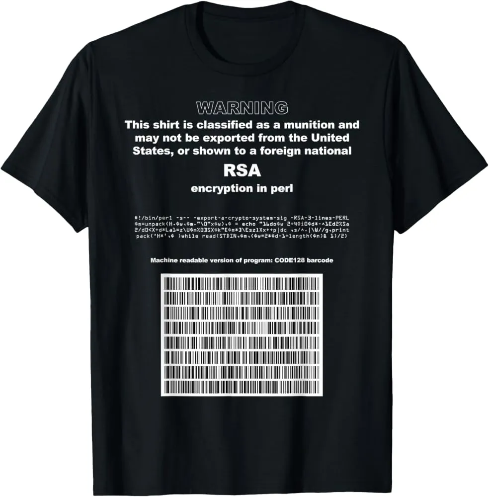

On July 24, Jensen Huang posted his first-ever tweet.

The account was brand-new. A man who has led the world's most valuable company for more than thirty years spoke on social media for the first time. He did not show off a GPU, tease a launch, or mention earnings. He dropped a PDF of an open letter titled *Open Weights and American AI Leadership*, with one line: the world needs both frontier closed models and frontier open-source models.

That same morning, Satya Nadella said the same thing on X. Y Combinator reposted it. Within hours, it had millions of views.

Twenty-five organizations signed the letter: NVIDIA, Microsoft, Meta, Palantir, IBM, Dell, ServiceNow, CrowdStrike, Mistral, Hugging Face, Mozilla, the Linux Foundation, a16z, Y Combinator, Replit, Perplexity, and others.

The three names missing from the list are even more revealing: OpenAI, Anthropic, and Google.

You do not actually need to read the letter. The list itself says everything.

---

## 1. The List Is the Argument

The popular takes online are "Silicon Valley rallies behind open source," "a battle of competing approaches," and "the showdown of the century." They are all correct, but too soft. They turn a business fight into a matter of faith. Read the list another way: next to each signatory, write down how much money it stands to make if open weights win.

| Signatory | What it gains if open weights win |
| --- | --- |
| NVIDIA | Inference demand spreads from a handful of hyperscale clusters to tens of thousands of organizations around the world buying their own GPUs |
| Microsoft | Hosting other companies' open models on Azure beats playing sublandlord to OpenAI |
| Meta | It does not sell a model API; it only needs the model layer to become a commodity |
| Hugging Face | The tollbooth on the open-weight distribution network |
| a16z / Y Combinator | Their portfolio startups cannot afford the API bills for frontier closed models |
| Palantir / IBM / Dell | The installation crews that move models into customers' own data centers |

**This is the compute and application layers joining forces against rent extraction by the model layer.**

Of course Jensen Huang did not post his first-ever tweet out of charity. Open-source models are the best demand-side subsidy NVIDIA could ask for. The closed-model giants are building their own TPUs, Trainium chips, and custom inference silicon, while the open-weight ecosystem has little choice but to buy GPUs. Every organization that downloads weights and decides to run them itself is an incremental customer for NVIDIA. Every enterprise that simply calls an API is merely another line in the logs of someone else's supercomputer.

That does not diminish the letter's significance. It strengthens it. In this case, **the interests of the most profitable layer in the value chain happen to align with those of nearly every user**. The combination that deserves real suspicion is: "We are taking away your control, but only for your safety." Right now, that is exactly what the three companies missing from the list are saying.

There is one more subtle point in the title. The letter is called *Open Weights and American AI Leadership*. The model it is actually defending right now is Chinese.

---

## 2. The Definition Fight Does Not Matter. Exit Is Enough

Whenever this subject comes up, someone inevitably points out that open weights are not open source.

That is true. Open-source software gives you source code that you can read, modify, and rebuild. Open weights give you a finished artifact. You do not get the training data, the data recipe, the training code, or a complete record of the months-long process that ran across tens of thousands of accelerators. You can download 2.8 trillion floating-point numbers, but you cannot recreate the model from scratch.

The better analogy, then, is not Linux but **free seeds**: they can be replicated, improved, and propagated, but you cannot reverse-engineer the entire process that created them.

The second objection is more direct: the essence of open source is collaboration. If all you do is dump the weights, the community cannot really collaborate. Upstream cannot accept patches, and nobody can modify the model itself. What kind of open source is that? The objection sounds strong, but it misses the target. Borrowing Albert Hirschman's framework, you may have two options when dealing with a supplier: **exit** and **voice**.

Open-source software gives you both. You can fork it, and you can submit a pull request upstream.

Open weights give you only one: **exit**.

So the real question becomes: which one do enterprises actually need? The answer is clear.

**No enterprise user is going to modify PostgreSQL's query planner.**

When a company buys software or chooses a technology stack, only one calculation ultimately matters: if you change the deal, can I leave?

**Exit is enough. Voice is a luxury.**

Once you see it this way, many of the arguments evaporate. Take the claim that "weights are an uninterpretable black box; you cannot audit 2.8 trillion floating-point numbers." That is technically correct but beside the point. If enterprises do not truly need a voice in upstream source code, they certainly do not need the even higher-order form of voice that comes from understanding the internal structure of the weights. An enterprise does not need to understand the model. It needs this: **the model runs inside my network, I control its egress, and my data cannot get out.**

So we can set the definition fight aside. It is an academic question, not a procurement question.

---

## 3. What Data Sovereignty Really Means: No One Can Press Pause

Most arguments about data sovereignty follow this chain: run locally, therefore data does not leave, therefore data sovereignty. The weak link is "data does not leave." That is not a binary switch; it has several levels.

1. Self-hosted bare metal with physical isolation;
2. Open weights deployed in a private cloud or VPC;
3. A dedicated instance of an open-weight model hosted by a cloud provider;
4. A closed API, plus a zero-data-retention promise, plus a DPA or BAA;
5. A closed API under the default terms.

Starting at level four, your data technically already "does not leave"—at least, that is what the contract says. For many enterprises, level four looks sufficient. The real issue is not technical. It is this:

**Can those guarantees be revoked unilaterally?**

Contract terms can change. Promises can evaporate after an acquisition. Prices can triple after you have wired your entire workflow into the service. Our industry has a long row of tombstones:

- MySQL was acquired by Sun, Sun was acquired by Oracle, and MariaDB began a fifteen-year odyssey;
- Redis changed its license, and the community forked Valkey;
- Elastic changed its license, and AWS forked OpenSearch;
- HashiCorp changed its license, and the Linux Foundation took over OpenTofu.

The script is always the same: you build your entire architecture during someone else's free trial, and one day the terms change.

**The real value of open source has never been "free of charge." It is irrevocability.** That right cannot be withdrawn unilaterally, either legally or physically. Even if the other side turns hostile, the copy in my hands still runs.

When you depend on a closed API, you depend on more than the vendor's commercial intentions. You also depend on:

- The political will of the vendor's country;
- The political will of your own country;
- The direction of relations between the two countries over the life of your contract.

Your procurement agreement controls none of those things. A copy of the weights on your own hard drive depends on none of them.

**That is the real substance of data sovereignty.**

It is not a privacy-compliance issue. It is a supply-chain irrevocability issue—the guarantee that no one can cut you off.

Not long ago, I asked a friend at a top law firm whether they used AI. He said they could not use OpenAI or Anthropic at work; he could use them only in a personal capacity. Legal data is sensitive: client identities, case details, negotiating positions, and transaction structures that have not yet been made public. Feeding any of that into a cloud model is not merely "risky." It is an outright violation of client compliance requirements.

Their current solution is to run a model on the internal network. He told me, "The Qwen model we run internally is basically brain-dead compared with Claude. It is not even close." That sentence captures the entire industry's dilemma: **what they are allowed to use is not good enough, and what is good enough they are not allowed to use.**

The real significance of K3 is not another benchmark victory. It is this:

**For the first time, the line marked "self-hostable" is beginning to overlap with the line marked "good enough."**

---

## 4. The Real Weakness: The Barrier to Self-Hosting

All of the arguments above rest on one premise: you can actually run the model.

This is the clearest weakness of open weights today. It deserves to be stated plainly, because it is radically different from our experience with traditional open source.

How low is the barrier to self-hosting conventional open source? You can run Linux on a Raspberry Pi, a decade-old laptop, or a used mini-PC bought for 100 yuan. You can run PostgreSQL on a cloud VM with one CPU core and 1 GB of memory for a few dozen yuan a month, or in a container on your laptop. The cost of learning it, trying it, and owning it is effectively zero.

That is the material foundation on which open-source software grew into what it is today: **any university student can own, on their own machine, the same complete technology stack used by the giants.**

Frontier open-weight models are a completely different story. Take Kimi K3: a 2.8-trillion-parameter mixture-of-experts model with 896 experts. It activates only 16 experts per token, for roughly 50 billion active parameters. Even at four-bit MXFP4 precision, the weights alone occupy about **1.4 TB**. No single accelerator has enough memory. Moonshot's official production recommendation is a **supernode with at least 64 accelerator cards**. This model needs not a server, but a rack.

This gives open-weight models a fundamentally different cost structure:

> From a **rental economy** to a **capital economy**.

Calling an API is renting. You pay by the token, without adding capital assets to your balance sheet. Self-hosting means buying: you have to purchase the capital goods before you can use the free weights. **That directly benefits the landlords**—the companies selling accelerators, memory, racks, and interconnects. This, in plain terms, is the economics behind Jensen Huang's tweet.

But I want to emphasize one point: **this is a hardware-cycle problem, not a flaw in the open-weight path.**

The real bottleneck is not compute but **system memory and VRAM**—both the most cyclical segment of the supply chain and the one currently attracting the most frantic investment. Capital expenditure on HBM and DRAM is expanding on a scale rarely seen in history. Yet the semiconductor industry's pattern has not changed in forty years:

**Every burst of capacity built to meet panic-driven demand eventually ends in a price collapse.**

Today's price of entry—a full rack—may look very different three years from now.

---

## 5. Why China? Two Completely Different Kinds of Open Source

Everyone is watching the same phenomenon: Chinese companies now lead much of the open-weight frontier—Zhipu with GLM, Moonshot with Kimi, DeepSeek with its namesake models, and Alibaba with Qwen.

Here is where K3 stands today. It ranks first in blind testing on Frontend Code Arena with a score of 1,679, ahead of Fable 5 at 1,631 and GPT-5.6 Sol at 1,618. It scores 57 on the Artificial Analysis Intelligence Index, ranking fourth among 189 models and trailing models from only two vendors.

**"Good enough, but not the best"**—with weights that are open, or at least promised to be.

Online explanations for "why China" range from institutions to culture to collectivism. I think they make the question too complicated. But "the underdog's strategy" is not a complete answer either, because **two fundamentally different things** have been lumped together under the same label.

### Type One: Vision-Driven Open Source

DeepSeek is the archetype. In a widely circulated document, Liang Wenfeng said that his goal was AGI; B2B and B2C businesses were small potatoes. The moat is not any particular set of weights. It is the team's iteration speed and its ability to engineer costs down to the limit.

This logic works only if AGI is genuinely your objective and the API is not your business. If the goal is AGI, open source is not a concession. It is the optimal path:

- It is **the most effective recruiting ad**. Top researchers go where they can understand the work, reproduce it, and build on it;
- It is **the fastest external feedback loop**. The entire world quantizes, adapts, red-teams, and evaluates your model for you;
- It is **the cheapest way to establish a standard**. The whole ecosystem grows around your architecture and interfaces.

It is also logically consistent. If you believe your core asset is "the ability to produce the next generation of models," the cost of releasing this generation's weights is nearly zero. Conversely, a team that keeps its weights under lock and key is really telling the world: I am not sure I can make another one.

This kind of open source will not reverse course once it takes the lead. It open-sources its work precisely because it wants to run faster.

### Type Two: Commercially Driven Open Source

This is the classic catch-up strategy, and its motives are easy to enumerate:

1. **Compute constraints**: if you cannot compete on scale, you have to compete on architectural efficiency and breadth of distribution;
2. **Constraints on overseas expansion**: selling an API abroad runs into both trust and policy barriers, but weights can travel—and once they do, they cannot be recalled;
3. **No profit in China's API price war**: instead of selling tokens, gain a place in the ecosystem, set standards, and attract talent;
4. **The brand value of becoming the default foundation**: worth far more than one extra year of API revenue.

This is perfectly rational business strategy, and there is nothing wrong with it. But it has a clear failure condition: once the company takes the lead, and once the API can make real money, this kind of open source will close its doors.

History offers no exceptions. Netscape went open source only because it was losing to Internet Explorer. IBM backed Linux aggressively to fight Windows NT. Sun open-sourced Java and Solaris while caught in a two-front squeeze. Meta open-sourced Llama because it does not sell a model API. Alibaba likewise keeps its strongest Qwen Max family API-only and monetizes it through its cloud business.

So if you want to judge whether an open-source ecosystem is reliable, do not look at its nationality or how generous it seems today.

**Ask whether its openness grew out of a vision or out of circumstances.**

The former will stay open. The latter will remain open only until it no longer needs to. For users, that means the right response is not to choose a camp. It is this:

**Always preserve your exit, including your exit from an open-source vendor.**

---

## 6. An Unenforceable Restriction—and the Funniest Line in the Letter

This open letter did not appear out of nowhere. U.S. Treasury Secretary Scott Bessent said the government was reviewing whether Chinese models had used stolen American intellectual property. White House adviser Michael Kratsios directly accused Moonshot of copying American models through distillation. That is the real background noise behind the letter.

Yet such a restriction is **technically impossible to enforce**.

This is not a new script. It is a replay of the United States' export controls on PGP encryption in the 1990s. The U.S. government treated strong encryption algorithms as munitions. In response, source code was printed in books and exported because books were protected by the First Amendment; RSA algorithms appeared on T-shirts; and *Bernstein v. U.S. Department of Justice* ultimately established in court that code was speech. The controls failed completely and, as a bonus, gave cryptography a constitutional shield.

Weights are just sequences of numbers. They can travel over BitTorrent, through mirror sites, or as split archives distributed from anywhere. A restriction can constrain law-abiding American companies. It cannot stop anyone else from downloading the files. The practical result would be:

**American companies cannot use the models, while the rest of the world does.**

That is what those startups are really panicking about. They are not afraid of competition. They are afraid their own government will block the cheap route while their competitors remain free to take it.

As for the ban itself, it has already accomplished one thing:

**It has awarded Chinese open-weight models the highest possible certification of capability.**

No one bans something that poses no threat.

Now for the funniest part. The letter devotes an entire paragraph to defending distillation. Its argument, in essence, is that training one model on another model's output is a widely used technique and reflects the long tradition of learning from, developing, and improving existing technologies. On the other side, Anthropic claims that Chinese companies stole from it by distilling its outputs.

Put the two statements together, and the translation is: I can scrape all of humanity's text, but you cannot scrape my output. That is more than a double standard. It reveals the true shape of the intellectual-property narrative:

**The boundary of property rights is drawn exactly where it benefits the party drawing it.**

Asserting upstream property rights would destroy the foundation of model training, so everything upstream must remain free. Relinquishing downstream property rights would destroy the moat, so everything downstream must be locked down.

---

## 7. The PostgreSQL Playbook—and Where the Analogy Breaks

Let me close with an analogy from the field I know best.

How did PostgreSQL eat the database market and beat Oracle?

1. **Good enough and free**: capture every net-new market and let time work in your favor;
2. **An extensible ecosystem**: grow capabilities that Oracle simply does not have;
3. **Cloud providers' managed services**: in turn become its largest distribution channel;
4. **Make the opponent's rent-extraction model a liability**: Oracle's greatest cost is not the license fee, but the feeling of being held hostage.

Open weights could follow exactly the same path. They do not have to outperform Fable 5. They only have to be **good enough and self-hostable**. K3's current position—first in blind testing despite a lingering gap in hands-on use, fourth in capability with free weights—places it right at the beginning of that path. But the analogy has a limit, and I believe that limit will decide the contest:

> **A database's definition of "good enough" is a fixed target. AI's is a moving target.**

Most applications do not need an ever-more-powerful database. CRUD requirements have barely changed in twenty years. PostgreSQL only had to catch up once to win permanently.

The capability ceiling for AI is still rising. Today, "good enough" means writing CRUD code and fixing bugs. Next year, it may mean delivering a module end to end. The year after that, it may mean maintaining an entire repository by itself. The line moves up every six months, and open weights have to catch it again every six months.

The entire debate can therefore be reduced to one question:

> **Whether open weights can win is fundamentally equivalent to whether growth in AI capability will slow down.**

- **If it slows down**: open weights will win, and win decisively. The script will be the same as in databases, except that twenty years will be compressed into two because the iteration cycles are entirely different. Frontier closed models will become a thin-margin business in bespoke high-end systems, much like selling Exadata today;
- **If it does not slow down**: frontier closed models will retain their premium, while open weights occupy the position of "last generation, but good enough."

And note that the second outcome is not really a loss. Always being one generation behind is where PostgreSQL stood relative to Oracle in 2005.

We all know what happened in the database world over the next twenty years.

---

## Conclusion

**"No one can unilaterally press pause" is a scarce technical asset in this era.**

Our industry spent thirty years clawing that right back from Oracle. Operating systems got Linux. Databases got PostgreSQL. With AI, the same script is playing out on a new stage, except that the challengers now have Chinese names.

I support open weights not because they are "free" and not out of sentimentality.

**I support them because only when the weights are in your hands and yours to take away do you get to negotiate.**

As for the barrier—a rack is too expensive, VRAM is too expensive, and frontier models still do not fit in a single machine—that is the reality today, and only today. Hardware prices will fall. Models will shrink. Quantization will improve. Once those two curves intersect, my lawyer friend will no longer have to choose between "brain-dead but safe" and "useful but forbidden."

That day is not far off.
