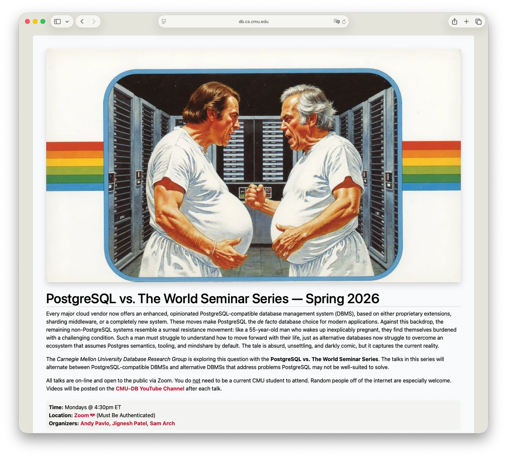
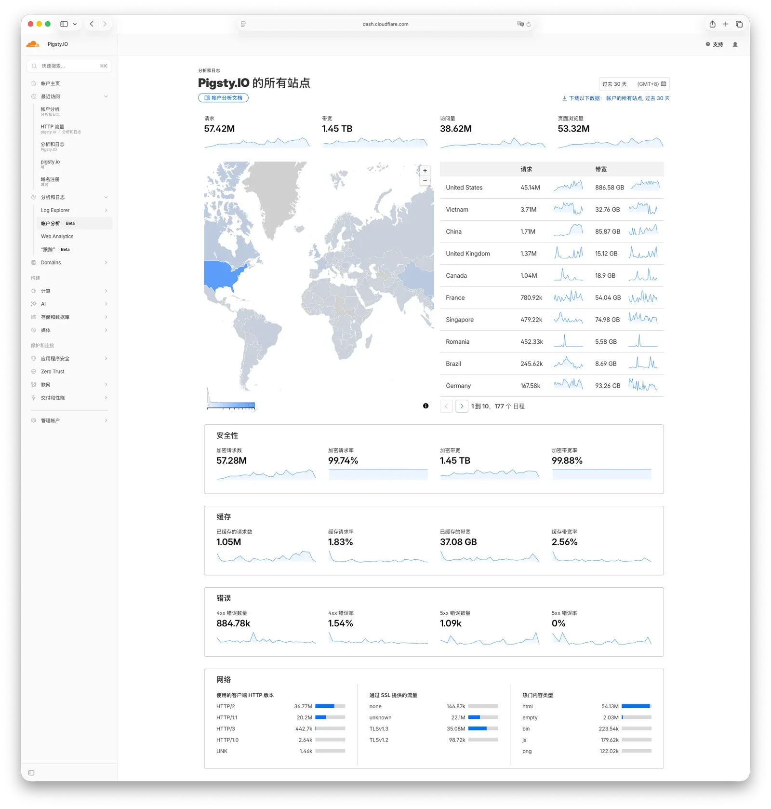

最近做了一场直(录) 播，聊了聊 PostgreSQL 与 AI 这个话题。直播里主持人问了很多好问题，老冯也做了些回答。

直播将在周二晚上放出，老冯这里把我（很多没说的）观点整理成文字稿，做了些展开和补充，希望对大家有所帮助。

-----

## PG 现在是什么状态？

> Q：PostgreSQL 当下在数据库世界里是什么状态？

**PostgreSQL 已经成为数据库世界的事实标准。** 它实现了类似 Linux 内核在操作系统领域的地位——整个生态正在不可逆地向 PostgreSQL 集中。引用 Andy Pavlo 在 CMU 数据库研讨会上半开玩笑的说法：“其他数据库现在的处境，就像一个 55 岁老汉一觉醒来发现自己怀孕了。”

面对这种局面，大家都在向 PG 靠拢：原本属于 MySQL 生态的厂商如 PlanetScale、Percona、TiDB 在尝试转型；RisingWave、GreptimeDB 等新数据库从诞生起就默认使用 PG 兼容协议；各种业务软件也都 default to PG。**PostgreSQL 就是当下的数据库之王。** 我不认为在未来一二十年里，这个位置会受到实质性的挑战。

而真正精彩的战斗，在 PG 发行版层面——无论你用的是 RDS / Aurora / Supabase 还是 EDB / CloudNativePG / Pigsty，底层虽然都是 PostgreSQL，但有着不同的风味和价值主张。这才是当下数据库世界实质性竞争发生的地方。

《[PostgreSQL 已主宰数据库世界](/pg/so2025-pg/)》

《[PGSQL vs MySQL：一场已经结束的战争](/pg/pg-vs-mysql-2026/)》

《[立足中国，面向全球的 PostgreSQL 发行版](/pg/forge-a-pg-distro/)》

《[PostgreSQL主宰数据库世界，而谁来吞噬PG？](/pg/proprity-pg/)》

《[CMU PostgreSQL vs. The World Seminar Series](https://db.cs.cmu.edu/seminars/spring2026/)》

-----

## PG 社区向 AI 的转向

> Q：过去一年，你观察到 PostgreSQL 社区最明显的“AI 转向”信号是什么？

**最明显的信号是资本层面的。** 2025 年 PostgreSQL 生态发生了超过 12.5 亿美元的收购——Databricks 10 亿美金买了 Neon，Snowflake 2.5 亿买了 Crunchy Data。这两笔收购传递的信息很清楚：AI 时代，数据库是值钱的基础设施。PG 生态的公司几乎拿下了数据库领域的所有融资。

Neon 提供了一个值得关注的数据信号：**他们 80% 的数据库实例是 AI Agent 创建的。** 当然要注意，Neon 的用户画像偏向独立开发者和 AI 早期采用者，这个比例不能简单外推到整个数据库市场。但趋势方向是清晰的：数据库的增量入口正在从人类开发者转向 AI Agent。

技术层面的 AI 转向信号也很密集：pgai、pg_vectorize 这类把 AI 能力直接嵌入 PostgreSQL 的扩展开始密集出现；Timescale 在推“Agentic PostgreSQL”；各种 MCP Server 让 Agent 可以直接跟 PostgreSQL 对话。整个社区的叙事正在从 LLM 时代的“PostgreSQL 也能做向量检索”，升级到 Agent 时代的“PostgreSQL 就是 Agent 的运行时环境”。

但我也要说明，很多对于 AI 的追捧与转向，更多是发生在厂商与发行版的层面上。在数据库内核层面，PostgreSQL 开发者社区依然保持着稳扎稳打、高度克制的状态，没有专门去凑热点去做什么 AI / Agent 数据库特性。例如在去年的 PG 大会上开发者投票环节，大家就对把 pgvector 向量扩展做进 PG 内核这件事兴趣乏乏。**这种克制本身就是一种信号——说明 PG 社区对“什么该进内核、什么该留给生态”有清醒的判断。**

《[Agent 的护城河：Runtime](/ai/agent-moat/)》

《[PGFS：将数据库作为文件系统](/pg/pgfs/)》

《[别争了，AI时代数据库已经尘埃落定](/db/db-for-ai/)》

-----

## PG 做对了什么？

> Q：为什么 PostgreSQL 在 AI 时代突然被重新发现？它做对了什么？

PostgreSQL 没有“突然”做对什么。它一直在做对的事——**可扩展性**。

这个观点我在 2023 年的《[PostgreSQL 正在吞噬数据库世界](/pg/pg-eat-db-world/)》中提出，后来逐渐成为 PG 社区的共识，社区大管家 Bruce Momjian 在演讲中也多次引申。PostgreSQL 30 年来坚持的那套可扩展架构，是其 Slogan 里“最先进”的真正体现。

举个例子：大约 8000 行代码的 pgvector 扩展，加上 170 万行代码的 PostgreSQL 内核，基本上覆盖了大多数应用场景对向量检索的需求。原因很简单：如果你要从零做一个完整的独立向量数据库，你得先解决高可用、备份恢复、ACID 事务和各种通用数据库基础设施问题——这本身就值百万行代码；而做向量扩展的团队可以站在巨人肩膀上，复用整个 PG 生态的能力，只需要专注几千行核心业务逻辑。

在全文检索、数据分析等领域，越来越多类似 pgvector 的扩展正在涌现，攻克一个又一个的数据库细分场景。这种繁荣的扩展生态，正是源于 PG 极致的可扩展性。反观 MySQL，即使到今天，社区版都没有一个成熟的向量检索能力，整体错过了这一波 AI 红利。

《[谁整合好DuckDB，谁赢得OLAP世界](/pg/pg-duckdb/)》

-----

## pgvector 与向量数据库赛道

> Q：pgvector 距离生产环境还缺什么？什么场景下你宁愿用专用向量数据库？

pgvector 在 ChatGPT 火起来之前就出现了——2021 年刚出来时是个人项目，但 2023 年 AI 浪潮起来之后，Neon、Supabase、AWS 先后下场推动，巨量资源投入下早已达到专业水准。
去年 PolarDB 大会上有人整活现场 Bench pgvector 和 milvus，跑在英特尔 AMX 指令集上的 pgvector 比 Milvus 快了一倍，怪幽默的。

更有意思的是，pgvector 已经发展出了自己的子扩展生态——扩展的扩展。比如 Timescale 的 pgvectorscale 提供了 DiskANN 能力，国内 TensorChord 的 VectorChord 扩展在 IVF+RaBitQ 架构上支持流式索引更新和高级量化。pgvector 在 HNSW 索引的大规模并发更新场景下确实还有优化空间，这也正是这些子扩展在努力解决的方向。

光谱两端可能还有一点细分生态位：如果你只需要一个嵌入式小向量库，可以看看 Qdrant 这类轻量方案；如果搞万亿规模以图搜图、淘宝拍图识物之类的场景，也可以评估 Milvus。但在光谱广阔的中间地带，现在 AI 新项目新应用的默认标配就是 PG + pgvector，这一点基本没有争议了。

《[专用向量数据库凉了吗？](/pg/vector-db-is-dead/)》

《[AI大模型与向量库 PGVector](/pg/llm-and-pgvector/)》

-----

## AI 需要数据库提供哪些能力？

> Q：最近 Agent 非常火爆，也出现了各种“Agent Native 数据库”与 Agent 记忆框架，怎么看？

坦率地说，现在市面上标榜“AI Native”或“Agent Native”的数据库，大多数还停留在概念营销阶段。你问他们到底什么是 Agent Native，很难得到一个技术上站得住的回答。好像加了向量支持就算“AI Native”了——跟之前“Cloud Native Database”如出一辙。

在老冯看来，这个问题应该分两层：核心需求与扩展需求。**因为你无法枚举 AI Agent 究竟需要哪些能力**——今天需要向量检索，明天可能需要图查询，后天又可能需要权重补丁，情绪向量——所以最好的策略不是显式堆砌功能，而是提供一种“**元能力**”：当新需求出现时，社区可以通过扩展机制自然地将新功能加载进来。

PG 就是这种范式的集大成者。它可以通过 pgvector 提供向量能力，通过 AGE 提供图查询能力，通过 pg_search/pg_textsearch 提供 BM25 全文检索能力，完整支持各类 JSON 操作，也支持 GIS、时序等各种数据模型。这些能力很多都是通过扩展加装进来的。

在数据库内核层面，其实不需要什么花里胡哨的 AI 原生能力，把一件事做好就行——**在满足安全可靠等非功能性需求的前提下，提供极致的可扩展性。** 功能性需求会自然在生态中成长出来。

这种方式演化出来的数据库还有一个巨大的附带优势：解决了原来 Polyglot 多元持久化带来的认知噩梦。以前你可能需要十几个不同的数据库拼接粘连才能解决的问题，现在可以在一个全栈超融合数据库内部，用统一的 SQL 语言解决。这极大减轻了 Agent 和人类的认知负担。

当然，同样具有良好可扩展性的另一个数据库是 DuckDB，SQLite 算半个。我认为具有这种特质的数据库才能真正称得上是“AI 时代的数据库”。能够提供敏捷并行探索、灵活组合功能、自由加载扩展、产出协同效应的数据平台，才是未来。

《[为什么 PG 将主宰 AI 时代的数据库](/pg/ai-db-king/)》

-----

## Agent 需要数据库提供哪些能力？

> Q：有人说“数据库是 Agent 的海马体”，你怎么看？

海马体是大脑中负责将短期记忆转化为长期记忆以及记忆检索的组件。如果非要类比大脑，数据库里的向量查询引擎勉强算是海马体，但数据库本身比这个大得多。数据库包含存储引擎、事务引擎、地理空间引擎、文档引擎等各种组件，负责不同功能。记忆也分很多种：工作记忆、长期记忆、情景记忆、语义记忆。海马体只是其中一个部分。

**与其说数据库是 AI 的海马体，不如说数据库是 Agent 的体外记忆系统（Exosomatic Memory）。** 就像人类发明文字和书籍来弥补大脑记忆的局限一样，Agent 同样需要一个持久化的事实记录系统来弥补 Context Window 的局限。

当然，广义上的“体外记忆”可以包括文件系统、对象存储等所有持久化层。但数据库之所以比文件系统更适合做 Agent 的核心记忆基础设施，关键在于两点。

**第一是结构化的关联查询能力。** Agent 在回溯记忆时，不仅仅需要“找到那段相似的话”（向量检索），更需要将那段记忆与用户画像、历史行为、时间线做 JOIN——这种关系推理是文件系统根本做不到的，却是关系数据库的看家本领。

**第二是结构化的管控能力。** 多租户权限隔离、细粒度的访问控制——管理员有权限修改哪些记忆，团队成员和外部不受信任的用户可以影响哪部分记忆——这些都可以在数据库的 RBAC 和行级安全策略（RLS）中优雅地解决。当然文件系统也有权限控制，但数据库提供的是表级、行级、列级的细粒度管控，这在多 Agent 协作场景下是质的区别。

现在 Agent 记忆框架确实是一个百花齐放的状态，但从技术壁垒的角度看，这些上层框架解决的更多是“记忆的组织策略”问题——什么该记、什么该忘、怎么检索——而底层的存储、检索、事务、权限控制，最终还是要落到数据库上。真正有持久壁垒的，是底下的数据库本身。

《[AI Agent 的操作系统时刻](/ai/agent-os/)》

《[Agent 需要什么样的数据库？](/db/agent-native-db/)》

-----

## PG 18 有什么 AI 相关特性？

> Q：PostgreSQL 18 为 AI 准备了哪些关键特性？

### 数据库克隆

PG 18 有两个特性跟 AI 关系密切。我认为最重要的是**数据库克隆（Database Cloning）**。这个功能可以基于 Copy-on-Write 机制瞬间克隆一个大型数据库，且不占用额外存储。你可以克隆多个副本，让 Agent 在克隆副本上做修改——这些修改都是增量的。等确认无误后，再把修改应用到生产数据库上。

**这给了 Agent 一种“反事实推演”的能力。** 人脑也有这种机制：做一件事之前先在脑中推演可能的后果，谋定而后动。Agent 不可能也不应该直接修改重要的生产数据库，数据库克隆给了它“先验证、再实施”的安全前提。

更进一步说，这给了 Agent 并行探索的能力——fork 多个分支、并行尝试、择优合并，类似代码世界里的 Git。现在 Coding Agent 通过 Git 来管理代码仓库状态，通过 worktree 来开分支并行探索，而数据库克隆等于在最棘手的数据层也补上了分支探索的能力。

《[Git for Data: 瞬间克隆PG数据库](/pg/pg-clone/)》

### OAuth 认证

另一个有趣但被低估的特性是——PG 18 支持 **OAuth 认证登录**。未来当我们进入多 Agent 网络、Agent 平台经济时代，Agent 可以直接通过 OAuth 认证登录数据库，这带来了很多想象空间。

已经有了一个早期概念验证案例——看看 Moltbook（小龙虾社交广场）——本质上就是一个 Supabase 实例，PG 套 RestAPI，Agent 直接连到数据库上读写数据进行交流。这个模式的终局*可能*是这样的：一个数据库放在那里，它本身就是一个应用平台。Agent 来到这个数据库，每个 Agent 对应一个用户。PG 18 支持 OAuth 了，Agent 直接登录，拥有自己的权限和私有状态表，也可以去公共广场表里发表信息。

我说“可能”，是因为目前这只是一个极简原型。从 Moltbook 这样的社交实验到真正的“数据库即业务架构”，中间还隔着**操作规约（Convention）**的缺失：Agent 如何发现一个数据库中有哪些核心表？语义如何自描述？如何做细粒度的资源配额管理？这些问题还没有标准答案。但 PG 已经提供了底层基石：身份认证、并发控制、访问控制、事务隔离——这些都是多 Agent 协作的必要条件。

《[数据库即业务架构](/db/db-is-the-arch/)》

-----

## Agent 的数据库选择权

> Q：在 Agent 时代，数据库的竞争维度会发生什么变化？大家会怎么选型？

这是一个被严重低估的趋势：**数据库的选择权正在从人类转移到 AI Agent。**

有些用户完全不懂数据库，他们只是跑 Claude Code，然后 Agent 搜索文档、评估方案，自主完成了整个数据库选型和部署。这引出了一个有趣的问题：**AI Agent 通过什么来“选择”数据库？**

我的直觉是可检索的文档。Agent 在做决策时会参考大量的文档、最佳实践和社区问答。如果某个数据库的文档最全、社区最活跃、最佳实践覆盖度最高，Agent 就会更倾向于推荐它。

**这意味着文档质量和社区密度可能会变成比性能更重要的竞争维度。**

这不仅仅是理论推演。我自己的数据就有一个有趣的现象：Pigsty 文档站的 Cloudflare 流量在过去一段时间以惊人的速度上涨。页面上的人类活跃用户也就不到十万（Google Analytics），但月 PV 达到了 5000 万量级。这些流量中很大一部分来自 AI Agent——不少新增用户只是让 CC 弄个 PG，CC 就自己把 Pigsty 拉起来了。而 Pigsty 目录里的 CLAUDE.md 放了整个文档索引，Agent 需要什么就会自己去查。

这就构成了一种 AI 时代的雪球效应：文档质量高 → Agent 更倾向于推荐你 → 更多人通过 Agent 使用你 → 产生更多实践反馈 → 更多最佳实践文档 → Agent 更“懂”你，推荐更精准。正反馈循环，赢家通吃。

PG 在这个维度上有巨大的先发优势——它拥有所有数据库中最全的文档和最活跃的社区。**这可能是未来数据库竞争中最重要、也最反直觉的维度。**

-----

## DBA 会被 AI 取代吗？

> Q：Agent 能做数据库选型，那能替代 DBA 吗？

DBA 这个群体其实包含两种截然不同的角色：

**第一种是 DA / 数据架构师 / 数据管理者** 很难被替代。他们的核心价值不仅在于判断力（Judgment），更在于问责能力（Accountability）——说白了就是能背锅。就像有了 AI 做账，最后还是得有个会计签字。在涉及数据安全、合规、架构决策的场景下，人类专家的判断和担责是不可替代的。

**第二种是运维型 DBA（Operational DBA）。** 这个角色面临的替代压力非常大，最后可能只有背锅价值了。在能力覆盖上，AI 可能已经做到了七八成。

这里有一个微妙的结构值得注意：**AI 冲击更多的是价值曲线的中段。** 顶尖专家受冲击较小，因为他们是 AI 的驾驭者，提供着不可替代的训练信号和决策判断；刚入行的新人则是一张白纸，反而可以直接拿着专家经验蒸馏出来的工具快速达到中级水准。被挤压最狠的反而是中间层——那些靠积累的操作经验吃饭、但还没有形成不可替代判断力的人。

但 DBA 有一个结构性优势常被忽略：AI 对价值曲线中段的冲击，**在前端和后端领域远比在数据库领域剧烈**。原因很简单：AI Agent 自己就需要使用数据库。在传统 IT 技术栈中，数据库始终是核心——DBA 已经对数据库有了深入理解，他们利用 AI Agent 去完成前后端工作，比前后端工程师利用 AI 来折腾数据库要容易得多。

**DBA 虽然也受冲击，但在这波浪潮中，转型的机会可能比很多技术岗位更大。** DBA 可以利用这种结构性优势，以更快的速度把自己武装成“全栈”。当然，这不是免死金牌。前后端工程师用来搞数据库的的门槛也在快速降低。**DBA 的结构性优势是一个时间窗口，不是一个永久护城河。** 能不能在这个窗口期完成转型，因人而异。

《[AI时代的数据库与DBA将何去何从](/db/ai-dba-job/)》

《[DBA会被云淘汰吗？](/cloud/dba-vs-rds/)》

《[AI撕掉了软件的皮](/db/saas-burn-pg-rise/)》

《[“软件世界大熔断：当翻译层被压扁”](/db/neo-software/)》

《[AI时代，软件从数据库开始](/db/ai-agent-era/)》

《[用AI当由头裁了4000人，但程序员的需求涨了11%](/ai/ai-sack/)》

-----

## 新入行的工程师怎么办？

> Q：初中级 DBA 被 AI Agent 取代，你有什么对入行新人的建议？

AI Agent 带来了一个严峻的问题：它正在把从学徒晋升到专家的传统通道切断。

以前的路径是跟着师傅学三五八年，在实战中培养直觉，最终成为专家。但现在这条路走不通了——因为中间层岗位在消失，新人缺少实战环境。那些能写出来的显性知识会被 AI 吞噬，而真正让专家不可替代的体感知识、隐性知识，只能在具体环境中沉淀，而现在这个环境对新人关闭了。

我给新人的建议是去学点 **真本事**——**软件工程能力 + 基础设施知识**，向下扎根，向上拥抱。

**软件工程能力**，不是指“会写代码”，而是指：怎么把一个模糊的需求变成可执行的方案？怎么设计一个可维护的系统？怎么在 AI 的帮助下构建复杂项目？这是一整套新的工程实践，和“会用 AI 聊天”是两回事。去学习如何驾驭 Claude Code 这样的 Coding Agent，掌握像 BMAD 这样的方法论框架，学会用 AI 做工程而不只是做对话。

**基础设施知识**，是指那些“离金属近”的东西：操作系统、数据库、网络、存储。这些东西变化慢、护城河深、受 AI 冲击小，在训练数据里稀疏但在生产里致命。AI 应用也好、Agent 也好，最后都得跑在基础设施上。找一个能让你直接触摸底层、看懂整个生态全貌的场域——比如深入 PostgreSQL 本身，而不是在中间件的抽象层里打转。

当你把这两端打通——向下理解基础设施，向上驾驭 AI 生产力——你就是新时代的“全栈”。

《[专家能被蒸馏吗？](/ai/tacit-knowledge/)》

《[AI时代，新程序员将何去何从？](/ai/ai-survival/)》

《[AI 时代生存指南：最大的红利在哪里？](/ai/ai-bonus/)》

-----

## 小结

老冯的个人观点：**PostgreSQL 已经成为 AI 时代数据世界的最大赢家。**

数据库这个行当已经存活了半个世纪。从层次模型到关系模型，从大机到分布式，从本地到云端，每一次范式转移都有人宣布“旧世界已死”。但真正死掉的从来不是数据库本身，而是那些试图用一种固定形态去回答所有问题的产品。

这就是技术世界最大的反讽：当所有人都在追逐“下一个新东西”的时候，真正撑起新时代的，往往是最朴素的基础设施。但 PostgreSQL 并不只是单纯的基础设施 —— 
它是能为上层演进提供敏捷适应力的基础设施。一个高度稳定克制的内核，加上一个繁荣疯长的扩展生态，调和两者的魔法叫做**可扩展性**。

从软件时代的 GIS，到互联网时代的 JSON 与全文检索，再到 AI 时代的向量——正是这种特质，让 PG 在每一次范式转移中都不是被淘汰的旧物种，而是承接新物种的底座。

AI 时代最稀缺的是**信任**。Agent 要信任它操作的数据不会丢，它做的修改可以回滚，它的权限边界是清晰的。这些听起来很无聊的特质——持久性、一致性、隔离性——恰好是关系数据库打磨了五十年的东西。而当新的需求出现时，不需要重写 PG，只需要长出一个新的扩展。

PostgreSQL 走到今天，不是因为它在任何单项上做到了最好，而是因为它从一开始就没有试图定义“最好”应该长什么样——它把这个定义权交给了生态，交给了 pgvector 的开发者、各种发行版的作者，以及未来某个我们还不知道名字的扩展。

这就是 PostgreSQL 最大的底气：它不需要预见未来，只需要让未来长在自己身上。

利益相关：老冯是 PostgreSQL 发行版 Pigsty 的创始人，观点带个人偏好，请读者自行校准。
