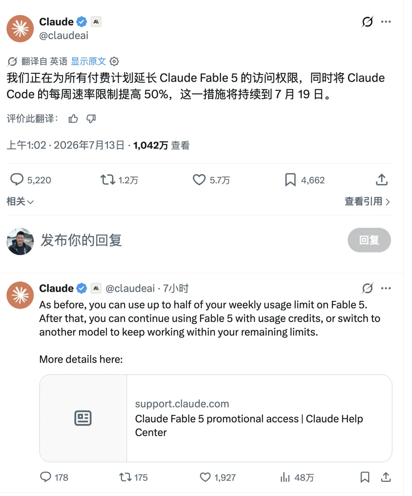
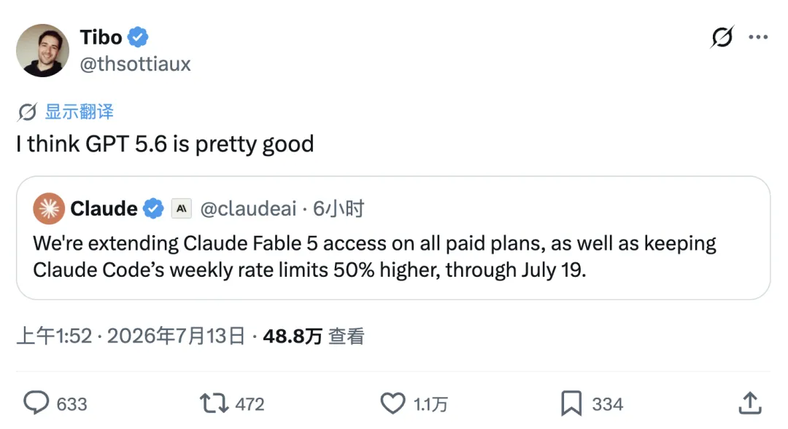
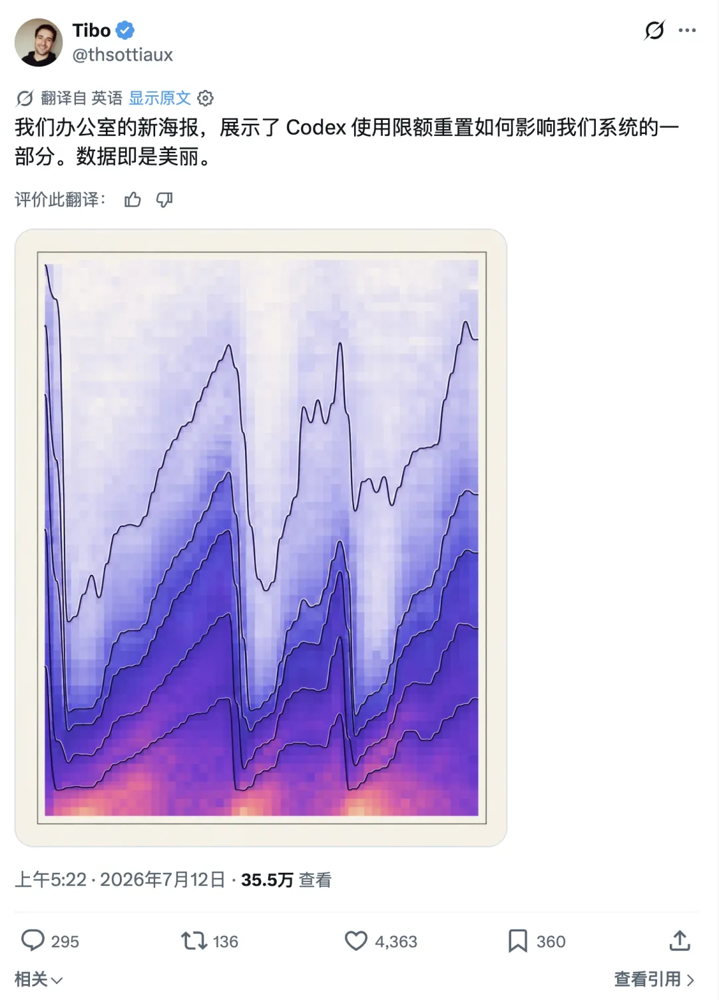
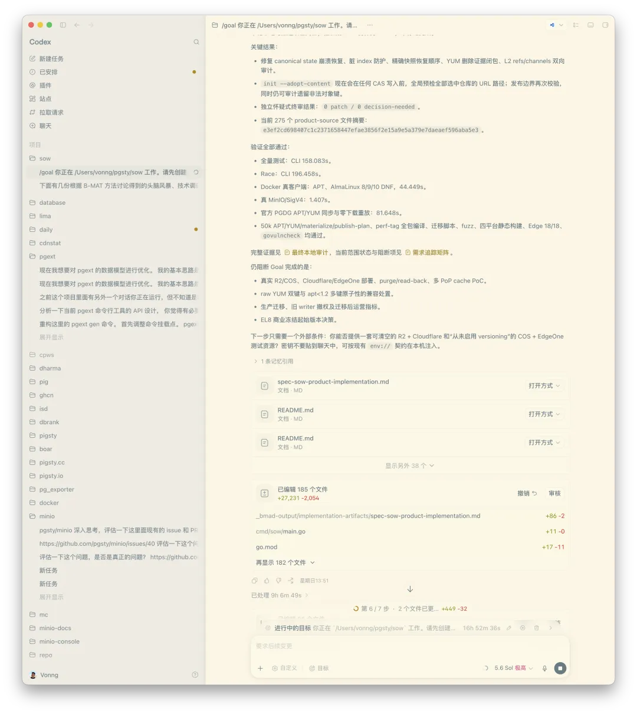
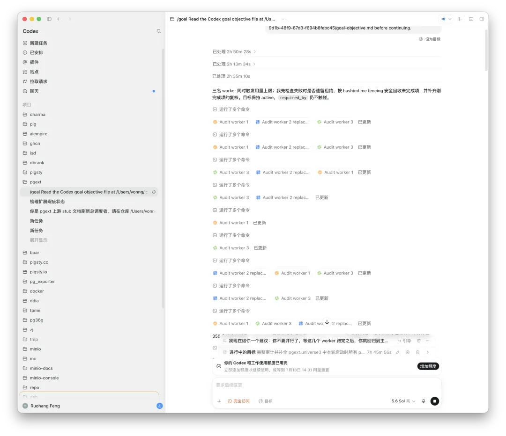

Two days ago, I wrote one line in [*Pedaling the Codex/Claude Bike Until the Wheels Smoke*](/en/ai/bicycle/): **use it or lose it**.

Last night, I had just burned through three $200-a-month subscriptions across Claude Fable and Codex. Then I woke up to the jackpot: Codex had reset my quota.

Claude was not about to sit still. It announced that Fable 5 access, originally due to end today, would once again be extended, this time through the 19th. This is the third Fable extension we have seen.

This round is about more than extending access. Codex removed its five-hour limit, leaving only the weekly cap. Claude Code, meanwhile, announced a 50 percent increase to its total weekly quota. The two announcements landed on X almost back to back—direct counterpunches that left users delighted.

This is competition doing its job.

Still, Claude's move looks a little stingy next to Codex. It extended Fable 5 access through the 19th, but unlike last time, it did not reset the quota users had already consumed.

I had already driven my Fable 5 usage to 100 percent last night. I still have access, but I have to wait for the quota to recover before I can use it again. Codex reset everything outright, so I woke up back at full charge.

Tibo, who leads Codex and ChatGPT, also announced on X that Codex's active-user count had passed six million. He even joked that they would be celebrating seven million tomorrow. That is an extraordinary growth figure.

Codex marketing can be gloriously uncomplicated: shower users with cash and quota, and they will canonize you. Claude Code is a strong product, but its strategy often feels like a series of experiments in how far it can push its users.

There are also reports that pressure from Codex has prompted Anthropic to consider making Fable a permanent part of its subscriptions.

This round demonstrates a simple truth once again: only competition delivers real benefits to users.

Give any vendor a monopoly and it will start imposing quotas, raising prices, and drip-feeding improvements. Only when the two sides genuinely fight do the limits loosen, the quotas grow, and users get a bargain.

---

## Codex Can Really Deliver

I have recently put my two Codex accounts to work on several major jobs.

One was collecting, organizing, and verifying detailed information on more than 1,600 extensions in the PostgreSQL ecosystem, including feature descriptions, documentation, installation instructions, and user guides.

I also built SOW, an APT/YUM repository management tool for my own use, and started a project to rewrite Patroni in Go. Add to that documentation fixes, bug fixes, issue and PR handling, extension packaging and builds, and assorted other tasks.

SOW, for example, follows a textbook two-model workflow.

I first used Claude Fable 5 with BMAD to handle requirements analysis, system architecture, and a PRD. Then I handed execution to Codex 5.6 Sol Ultra. Once the goal was set, Codex started pedaling and worked for more than 30 hours straight, blowing through the entire weekly quota.

Because the system tries to finish tasks already in progress, Codex kept running past the quota and produced an initial draft of roughly 27,000 lines of code.

Now that the quota has reset, it is back at full strength and ready to keep iterating.

From a pure execution standpoint, I am already extremely happy with Codex 5.6 Sol Ultra. It may not be quite as smart as Fable 5, but the gap is not large. For long-running execution, reliable delivery, and turning engineering plans into working systems, it is already a formidable productivity engine.

---

## Fable Thinks; Codex Executes

I no longer try to make one model do everything. I assign work by task type. For everyday thinking, article writing, open-ended ideation, and greenfield product design, I prefer Fable whenever I need stronger abstraction, creativity, and overall judgment.

Once the design is largely settled and the job calls for dependable execution, stable delivery, and hours of uninterrupted work, I hand it to Codex 5.6 Sol Max or Ultra.

I use a similar workflow for code review. I usually ask Codex to assemble the project context, conduct the first review, and produce a concrete issue list. Then the context and findings are automatically passed to Fable 5 for an adversarial second opinion. After two rounds of cross-review, the two sides usually converge on a remarkably reliable consensus.

I recently rescanned a batch of older projects this way and did find and fix problems that had previously gone unnoticed. This kind of adversarial two-model review is far more reliable than asking a single model to question and grade its own work.

Models should not be treated merely as substitutes for one another. The efficient pattern is to let the model that excels at design handle the design, let the model that excels at execution do the implementation, and then have another model challenge the result.

---

## Codex's “Last Task” Trick

Here is another Codex quota trick I have observed. To be clear, this is not an official promise. It is simply behavior I have seen repeatedly in real use, and the mechanism could change at any time.

When you run a task in Codex, as long as it starts before the weekly quota is exhausted, the system usually will not kill it the moment it crosses the quota line. Instead, it will make a best effort to finish the task in progress.

Suppose you have only 1 percent of your weekly quota left. If you start a sufficiently large task at that point, the compute it ultimately consumes can far exceed that remaining 1 percent. My own tests suggest that there is still a ceiling: the extra work I have seen approaches a full week's quota.

In other words, under ideal conditions, one quota reset can provide nearly two weeks' worth of actual usage.

When your weekly quota is nearly gone, do not grind away the final scraps on a series of tiny questions. Prepare one enormous task with a clear objective, complete context, and enough scope to run for a long time, then use the last of your quota to launch it.

That is a much more efficient use of the remaining allowance. I hear a recent Codex update has closed this loophole; if you want to test it, hold off on updating for now.

---

## A $200 Subscription Can Unlock Thousands of Dollars in Compute

Based on my actual usage, I estimate that a $200-per-month Coding Plan can unlock as much as $5,000 in compute at API list prices if you exhaust its quota, assuming a 95 percent cache hit rate.

If you also count the extra execution made possible by resets and the “last task,” the additional tokens from a single reset may be worth roughly RMB 15,000 to 20,000 at list prices. Across two accounts, that puts the total on the order of RMB 20,000 to 40,000.

Of course, this is compute value translated at list prices. It is not cash income, nor does it mean everyone can reliably reproduce the same level of usage. But it does establish one thing: these expensive Coding Plans are still in a heavily subsidized window.

A $200 subscription that unlocks thousands of dollars' worth of model calls at list prices is one of the clearest opportunities of the current AI era.

Burning tokens, however, does not automatically create productivity. Without a clear design, sensible task decomposition, complete context, and a rigorous review process, more tokens may simply generate more garbage. The real value comes from investing this compute in assets that compound over time: code, documentation, automation tools, knowledge bases, and reusable workflows.

Used well, tokens are a productivity lever. Used poorly, they are just expensive electricity and subscription bills.

The bottom line remains the same: use it or lose it.

This subsidy window will not stay open forever. While Codex and Claude are still fighting head-on, and while both sides are still willing to trade quota for users, convert as many of those tokens as possible into digital assets with lasting value.

For power users, this is the best leverage available and the best time to use it. I am already preparing to open my fourth $200-a-month subscription.
