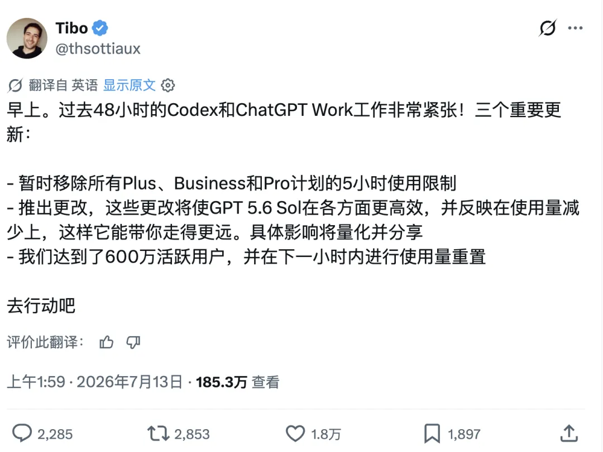
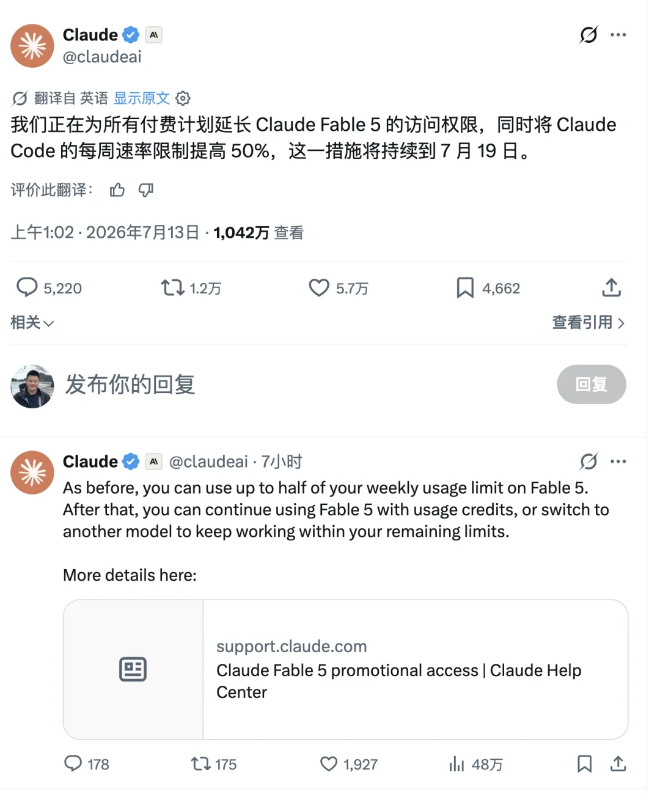
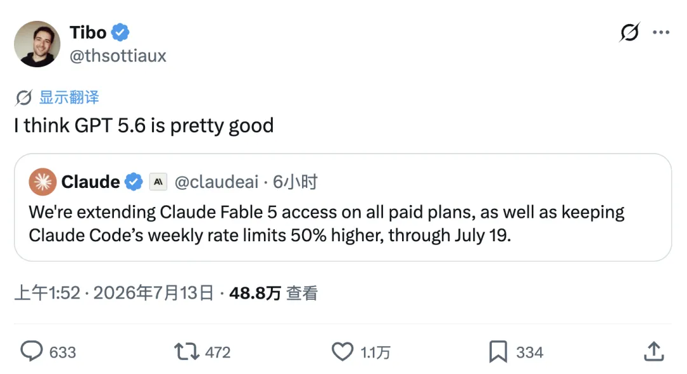
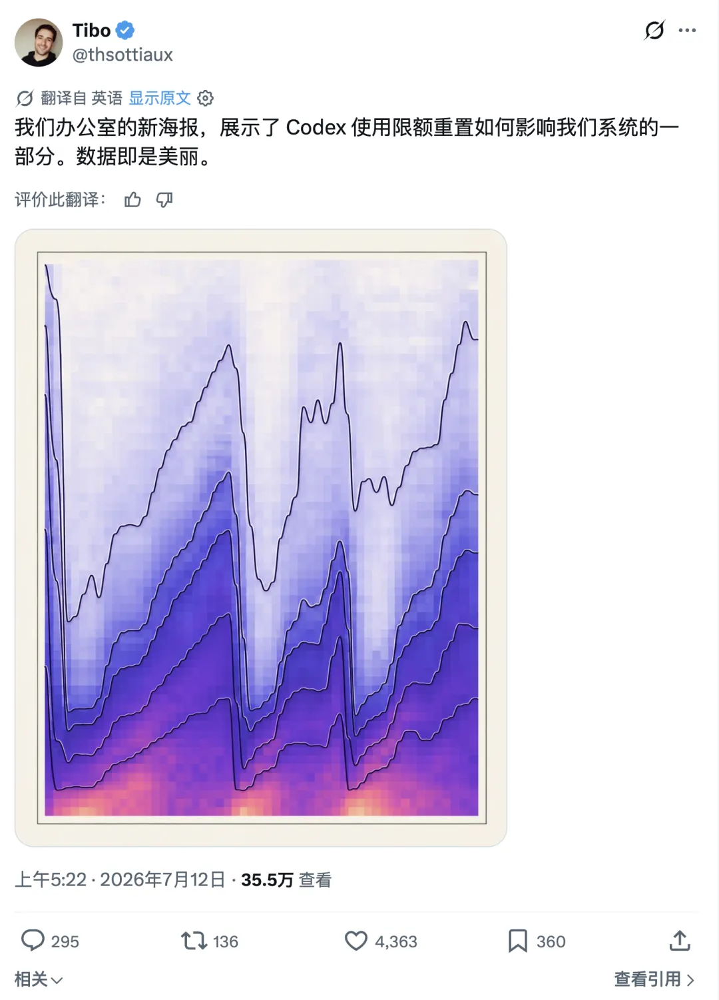
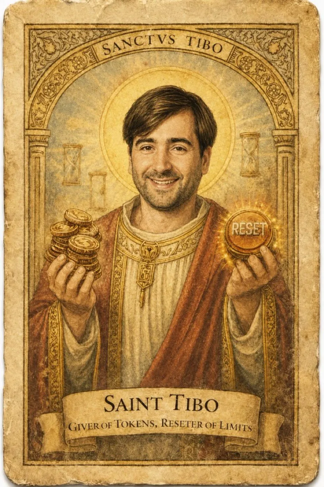
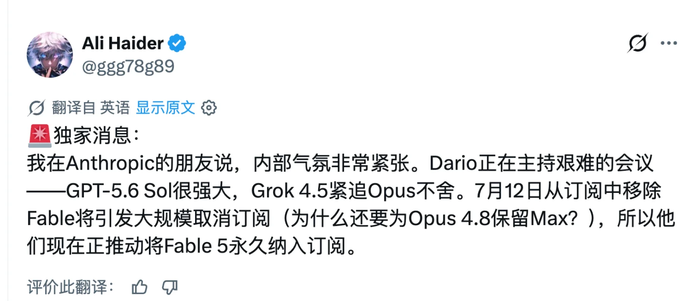
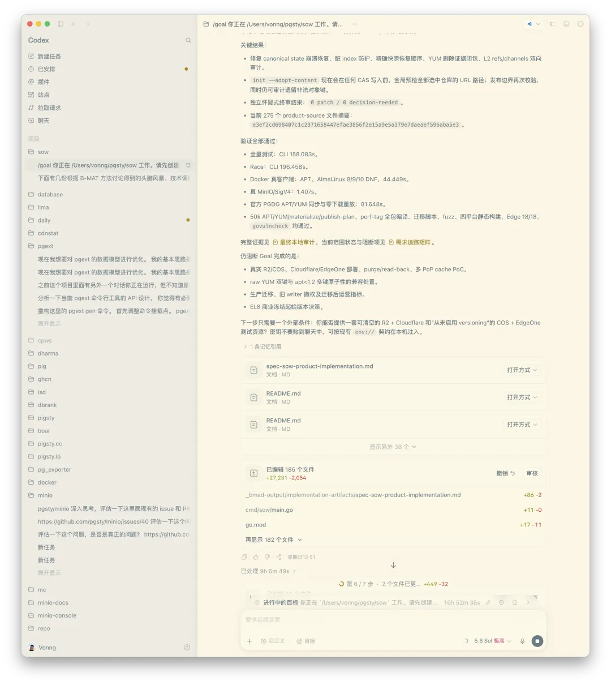
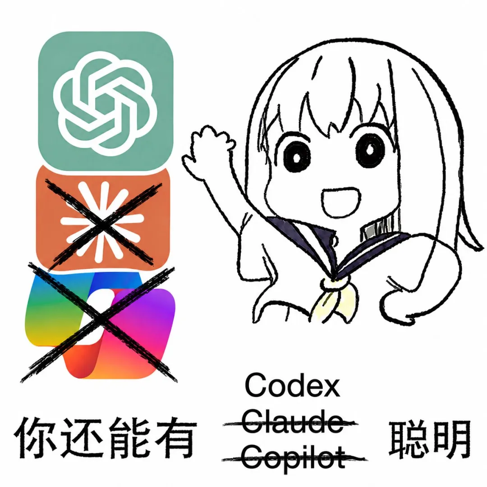
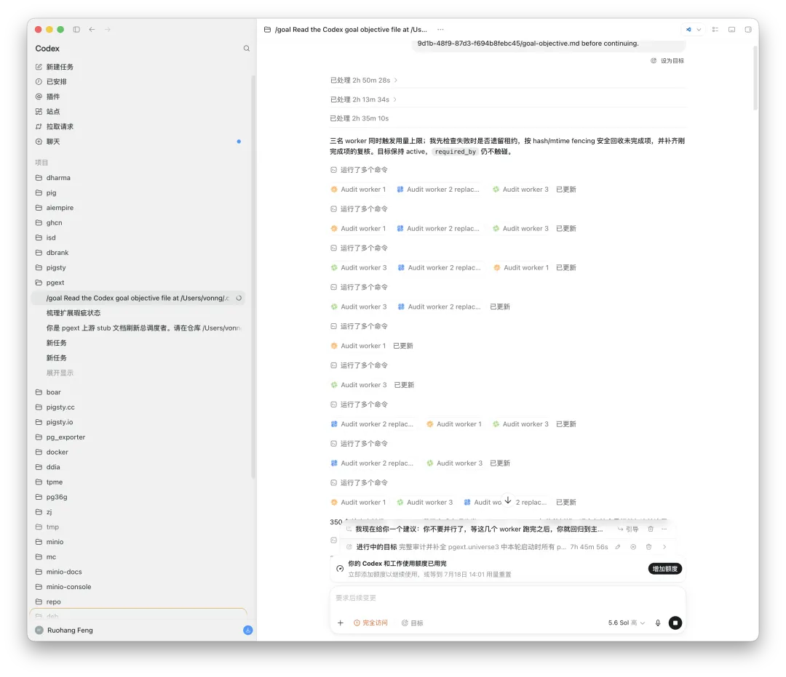

前两天，老冯在《[Codex／Claude 脚踏车要蹬冒烟了](/ai/bicycle/)》里说过一句话：**有水快流**。

昨天晚上，我刚把三个每月 200 美元的 Claude Fable 和 Codex 订阅烧得干干净净；今天一早，特大喜报就来了——Codex 额度重置了。

Claude 当然不甘示弱。官方宣布原定于今天结束的 Fable 5 访问期限再次延长至 19 日。这已经是我们第三次看到 Fable 访问延期了。

这轮竞争还不只是延长访问时间。Codex 宣布取消原有的 5 小时限额，目前只保留周限额；Claude Code 则宣布，将每周总使用额度上调 50％。双方几乎前后脚在 X 上发公告，针锋相对、贴脸开大，用户自然笑得合不拢嘴。

这才叫鹬蚌相争，渔翁得利。

不过，和 Codex 相比，Claude 这次多少还是显得有些抠抠搜搜：它只是把 Fable 5 的访问期限延长到了 19 日，却没有像上一次那样直接重置已经消耗掉的额度。

所以，老冯昨天晚上已经把 Fable 5 用到了 100％，虽然访问资格还在，却仍然得等额度恢复以后才能继续用。相比之下，Codex 这边直接重置，今天醒来又是满血复活。

Codex 与 ChatGPT 的负责人 Tibo 还在 X 上宣布，Codex 的活跃用户已经突破 600 万，甚至打趣说，明天就准备庆祝突破 700 万。这是一个相当夸张的增长数字。

不得不说，Codex 的营销有时候就是这么朴实无华：舍得大撒币、舍得发额度，用户自然会把你捧成圣徒。反观 Claude Code，产品能力虽然强，策略却总有一种反复试探用户底线的感觉。

也有消息说，受 Codex 压力影响，Anthropic 正在考虑将 Fable 永久加入到订阅中。

这轮竞争也再次说明了一个简单的道理：市场必须有竞争，用户才能得到真正的实惠。

任何一家形成垄断，最后都会开始限额、涨价、挤牙膏；只有两边真正打起来，限制才会放宽，额度才会增加，用户才有便宜可占。

--------

## Codex 非常能打

老冯最近用两个 Codex 账号，干了几件大活。

其中一件，是收集、整理并校对 PostgreSQL 扩展生态中 1600 多个扩展的详细信息，包括功能介绍、文档、安装方式和使用手册。

除此之外，我还做了一个自用的 APT／YUM 仓库管理工具 SOW，以及一个用 Go 重构 Patroni 的项目。加上各种文档修缮，Bug、Issue、PR 处理，扩展打包构建等各种工作。

拿 SOW 来说，这个项目采用的是一套非常典型的双模型协作流程。

我先用 Claude Fable 5 配合 BMAD 完成需求分析、架构设计和 PRD，再把具体执行交给 Codex 5.6 Sol Ultra。目标设定好以后，Codex 就开始蹬车，一口气连续干了 30 多个小时，直接把整周额度打爆。

最后，靠着“任务已经启动以后，系统会尽量执行完成”的机制，它硬是超额跑出了一版大约 2.7 万行代码的初稿。

今天额度一重置，马上又能满血复活，接着往下迭代。

从纯粹“干活”的角度来说，Codex 5.6 Sol Ultra 已经非常令我满意了。它未必有 Fable 5 聪明，但差得也不多，而且特别是在长时间执行、稳定交付和工程落地方面，已经具备了非常强的生产力。

--------

## Fable 负责想，Codex 负责干

老冯现在并不会用一个模型包打天下，而是根据任务类型进行分工。在日常思考、文章写作、创意发散，以及从零到一的产品设计中，当我需要更强的抽象能力、创造力和整体判断时，我更愿意使用 Fable。

但当设计已经基本确定，需要的是可靠执行、稳定交付和长时间连续工作时，我会把任务交给 Codex 5.6 Sol Max 或者 Ultra。

代码审查也是类似的工作流。我通常先让 Codex 汇总项目上下文，完成第一轮代码审查，并整理出明确的问题清单；随后，再把上下文和审查结果自动转交给 Fable 5，让它进行对抗性复核。两边通常经过两轮交叉审查，就能形成相当可靠的共识。

我最近顺手把过去的一批项目重新扫描了一遍，确实找出并修复了一些以前没有发现的问题。这种“双模型对抗审查”的效果，要比单独让一个模型自问自答可靠得多。

模型之间不应该只是简单替代关系。真正高效的用法，是让擅长设计的负责设计，让擅长执行的负责执行，再让另一个模型站在对立面进行复核。

--------

## Codex 的“最后一个任务”技巧

这里再分享一个我自己观察到的 Codex 配额技巧。先说清楚：这不是官方承诺，只是我在实际使用过程中反复观察到的现象，具体机制随时可能调整。

在 Codex 中运行任务时，只要任务是在周限额耗尽之前启动的，即使执行过程中越过了配额线，系统通常也不会立刻把任务掐断，而是会尽最大努力完成当前任务。

比如，你这周的额度只剩下 1％。这时候如果开启一个规模足够大的任务，最终能够继续消耗的算力，往往会远远超过剩下的这 1％。老冯自己测试，其实这个也有上限，我观察到额外跑出来的工作量，接近一整周的配额。

换句话说，在理想情况下，一次额度重置带来的实际可用量，接近两周配额。

所以，周额度快要见底的时候，不要再用零碎的小问题一点点把最后的额度磨光。合理的做法是提前准备好一个目标明确、上下文完整、能够长时间连续运行的巨无霸任务，然后用最后的额度把它启动起来。

这才是对剩余额度更高效的利用方式。听说最近 Codex 更新修掉了，可以晚点更新再试试。

--------

## 200 美元订阅，撬动数千美元算力

按照我的实际使用强度粗略估算，一个每月 200 美元的 Coding Plan，如果真正把额度打满，能够撬动的算力，按 API 列表价计算（95％ 缓存）可以达到 5000 美元。

如果再把重置和最后一个任务可能产生的额外执行量计算进去，一次重置带来的额外 Token，按列表价粗略折算，可能相当于 1.5 万至 2 万元人民币的算力。两个账号叠加，就是 2 万至 4 万元人民币量级。

当然，这里说的是“按列表价折算的算力价值”，并不等于现金收益，也不意味着所有人都能稳定复现同样的使用量。但它至少说明了一件事：目前这些高价 Coding Plan，仍然处在一个补贴力度巨大的红利期。

200 美元的订阅，能够撬动数千美元列表价的模型调用量，这本身就是当前 AI 时代最明显的红利。

不过，烧掉 Token 并不自动等于创造生产力。如果没有清晰的设计、合理的任务拆分、完整的上下文和严格的审查流程，再多的 Token 也可能只会生成更多垃圾。真正有价值的，是把这些算力投入能够长期沉淀的资产：代码、文档、自动化工具、知识库，以及可以反复复用的工作流。

Token 用得好，是生产力杠杆；用得不好，只是昂贵的电费和订阅费。

总的来说，还是那句话：有水快流，过期不候。

这种补贴窗口不会永远存在。趁着 Codex 和 Claude 还在贴脸竞争，趁着双方还愿意用额度换用户，尽可能把这些 Token 转化成真正有价值的数字资产。

但对于老司机来说，这是最好的杠杆与机会窗口。老冯已经准备开第四个每月 200 美元的订阅了。
