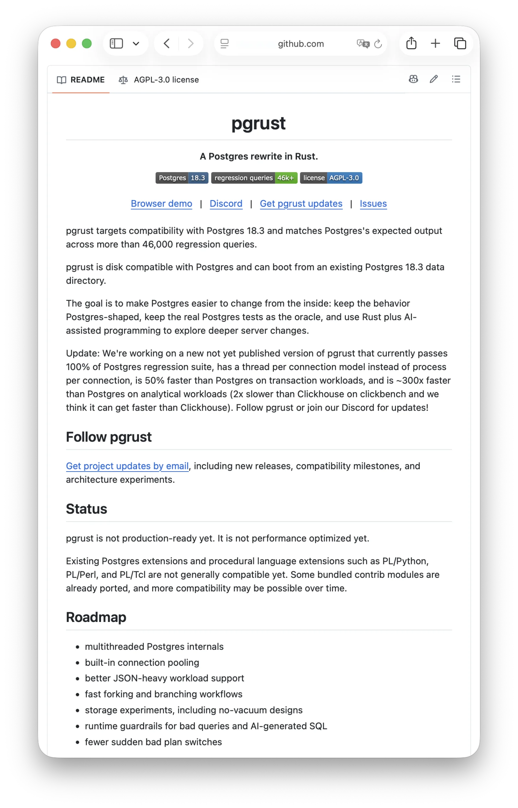
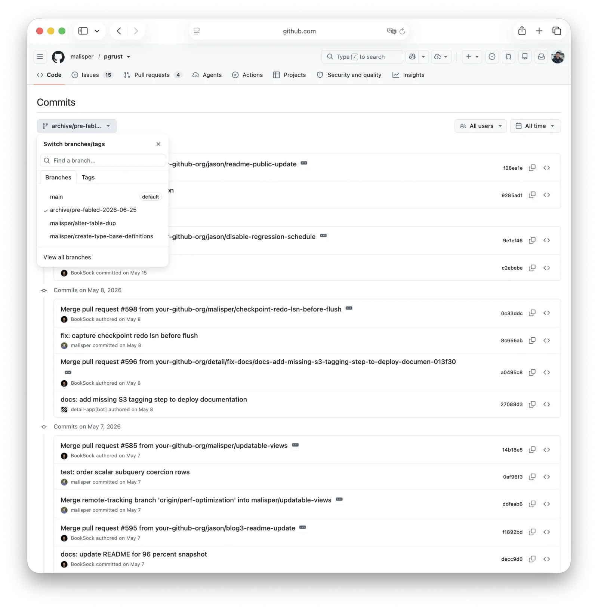

[pgrust](https://github.com/malisper/pgrust) recently hit the front page of Hacker News. With AI, its author had ported PostgreSQL to Rust and passed the core regression suite.

The obvious headline was: "AI rewrote PostgreSQL in Rust."

The repository tells a sharper story. A clean-room rewrite failed. A mechanical translation of PostgreSQL passed. In two months, pgrust demonstrated the value of the system it set out to replace.

## Two Attempts, Two Results

Michael Malis is not an outsider chasing a trend. He managed petabyte-scale Postgres clusters at Heap, wrote extensively about Postgres internals, later ran Freshpaint, and once built a Lisp interpreter with recursive CTEs. This was a serious experiment by someone with relevant experience and a substantial AI budget.

The project reached HN on July 9. At the time of writing, the [thread](https://news.ycombinator.com/item?id=48841676) had 688 points and more than 580 comments; the repository went from 122 to 1,499 stars in a day. Its README led with three claims:

- 46,066 queries from the PostgreSQL 18.3 core regression suite passed.
- An unreleased version ran TPC-C 50% faster than Postgres.
- Analytical workloads ran roughly 300x faster.

The first pgrust attempt began in April. Malis asked Codex to implement Postgres in Rust from scratch. In two weeks it produced 250,000 lines and passed about a third of the regression tests.

He then opened eight Codex accounts, spent $1,600 per month, and ran roughly a dozen to twenty agents in parallel. They merged 280 PRs in two weeks, reached 67% by late April, and announced 96% in early May.

On June 23, that codebase was archived under [`archive/pre-fabled-2026-06-23`](https://github.com/malisper/pgrust/commits/archive/pre-fabled-2026-06-25/). It has not moved since.

The second attempt had already started, using a different method. As Malis [explained on HN](https://news.ycombinator.com/item?id=48841676), c2rust first translated PostgreSQL's C source mechanically into Rust. The result was full of `unsafe`, but it could already run the core SQL regression suite. PostgreSQL was then split into roughly a thousand crates, which Claude rewrote and audited one by one. Generated components such as the parser retained more translated code and `unsafe`.

This version took 13 days: 7,103 commits from June 12 to June 24, including 1,419 on the busiest day. Michael Malis is credited with 6,264 commits, Claude Fable 5 with 832, and Jason Seibel with seven. The result is 2.4 million lines of Rust across 3,525 files and 1,464 crates.

When pgrust launched on June 25, it claimed to pass the PostgreSQL 18.3 core regression schedule and isolation tests. It could even boot from an existing PostgreSQL 18.3 data directory.

That is less mysterious than it sounds. pgrust behaves like PostgreSQL because it was translated from PostgreSQL.

**This is not a rewrite. It is code laundering.**

The comparison is the experiment's most useful result. An expert with ample AI compute tried a clean-room rewrite for two months and abandoned it. Translating PostgreSQL itself produced a passing result in 13 days. The first version discarded thirty years of accumulated behavior; the second imported it.

One licensing detail also deserves attention. When I checked, I could not find PostgreSQL copyright notices at the top of any `.rs` files. The only attribution I found was in a README under the test data directory. The project is licensed under AGPLv3. The code made the trip; its lineage largely did not.

## What the Tests Prove

pgrust's regression result appears genuine.

The repository includes the official PostgreSQL 18.3 test files. I had Claude compare 18 of them—including `parallel_schedule`, `join.out`, `numeric.out`, `select_parallel.out`, `plpgsql.out`, and the isolation schedule—byte for byte against the upstream `REL_18_3` tag. Every file matched, and all 230 entries from `parallel_schedule` were present.

I found no evidence of altered expected output. The runner is straightforward: clone the repository, build pgrust with Rust, and use a PostgreSQL 18 `psql` client. The score does not look padded.

It still has four important limits:

1. **The public runner is serial.** It executes roughly 230 SQL programs one by one. The real `pg_regress` runs parallel groups with around twenty concurrent sessions. The server also starts with `-F`, which disables fsync. That is normal for regression testing, but it verifies functional output—not concurrent behavior or durability.
2. **The public repository had no CI.** A passing run does not prove that every later commit still passes.
3. **The isolation suite is not on the default path.** Running it requires a separate PostgreSQL source tree.
4. **The performance claims refer to unreleased code.** The implementation, benchmark configuration, and hardware details were not public when I checked.

Malis said the new analytical version adds columnar storage, vectorized execution, parallelism, and faster hash tables. Its ClickBench result was about half the speed of ClickHouse.

That is plausible. Row-store Postgres is already two or three orders of magnitude slower than ClickHouse on ClickBench. Extensions that embed an analytical engine such as DuckDB can also beat stock Postgres by hundreds of times.

But this is not evidence that Rust is 300x faster than C. The storage layout, execution model, and parallel strategy all changed. Until the code and benchmark artifacts are public, the speedup cannot be attributed. It shows room to improve PostgreSQL's analytical architecture, not a 300x dividend from source translation.

PgCat author levkk asked the right question in the HN thread: was fsync enabled? Regression tests do not validate every I/O path.

To Malis's credit, the README is restrained: pgrust is not production-ready, has not been performance-tuned, and does not support existing extensions. Most of the hype came from secondhand retellings.

## Bun Is the Control Group

At almost the same time, Bun moved its JavaScript runtime from Zig to Rust. If Bun succeeded, why treat pgrust differently?

Bun is not a counterexample. It is the control group.

In its [migration retrospective](https://bun.com/blog/bun-in-rust), Bun says the port ran from May 3 to May 14. A clean rewrite would have frozen feature development for a year, so Claude first summarized recurring Zig-to-Rust patterns. The team then mapped each `.zig` file to an `.rs` file, initially producing translated-looking Rust and leaving idiomatic cleanup for later. Roughly 50 Claude Code workflows ran for 11 days.

The two projects are strikingly similar:

|             | Bun: Zig to Rust                        | pgrust: C to Rust                                |
|:------------|:----------------------------------------|:-------------------------------------------------|
| Method      | Mechanical port, then cleanup           | c2rust, then crate-by-crate cleanup              |
| Model       | Claude Fable 5 prerelease               | Claude Fable 5; 832 credited commits             |
| Time        | 11 days                                 | 13 days                                          |
| Scale       | 1.01M lines added; 6,778 commits        | 2.4M lines; 7,103 commits                        |
| Test oracle | Bun's language-neutral TypeScript suite | PostgreSQL's SQL regression and isolation suites |
| Ownership   | Its own production system               | A new implementation of upstream code            |
| Status      | Shipping; publicly validated by Prisma  | Not production-ready; no public deployments      |

The decisive difference is ownership.

Bun translated its own system. The language changed; the team, tests, users, brand, and accountability did not. The result went into the same production pipeline. Prisma retested real failure cases. When something broke, the same team fixed it and shipped the next release.

pgrust translated someone else's system. PostgreSQL's code came across; its developers, users, release process, and accountability did not.

Even Bun paid a substantial migration tax: 19 regressions and an estimated $165,000 in tokens at API prices. It also triggered a public dispute. Zig creator Andrew Kelley [argued](https://andrewkelley.me/post/my-thoughts-bun-rust-rewrite.html) that the reported performance gain came from LTO, which Zig already supported, and said Bun had admitted it had not fuzzed the runtime. Bun said it had run Fuzzilli against runtime APIs around the clock during the Zig era. The accounts do not align.

Someone on lobste.rs called this **vibe porting**.

Bun proves that AI can translate large codebases. It also shows who is best placed to do it: the original team, with the full test suite, users, and production environment. A fork detached from all three starts at a disadvantage.

## What Tests Cannot Carry

PostgreSQL's reliability knowledge lives in roughly four places:

1. **Tests.** The 46,066 regression queries encode thirty years of behavior and bug fixes. They are copyable and repeatable. pgrust carried this exam with it.
2. **Source code.** Redundant-looking checks, counterintuitive ordering, and old comments are fossils from past failures. Mechanical translation preserves many of them; a clean rewrite does not.
3. **History.** The reasons behind a fix, rejected alternatives, and important counterexamples live across decades of `pgsql-hackers` mail, commit messages, incident reports, and internal runbooks. Source translation does not carry causality.
4. **People.** Veteran reviewers remember old failure modes and recognize dangerous patterns. That intuition is absent from both code and tests.

This is the central problem. pgrust aims to make Postgres easier to change internally. The first two layers may be enough to make a database run. Safe evolution depends most on the last two—the layers translation cannot copy.

PostgreSQL's history shows why no test suite is complete. The 2018 fsyncgate incident exposed a twenty-year misunderstanding of Linux fsync error semantics. PostgreSQL 9.3's multixact corruption took more than a year of point releases to resolve. In 2020, [Jepsen found](https://jepsen.io/analyses/postgresql-12.3) a genuine G2-item counterexample under serializable isolation in PostgreSQL 12.3; the community fixed it within weeks.

PostgreSQL's strength is not only its existing tests. It is the process that keeps discovering failures, reconstructing causes, fixing code, and adding new tests. Under Hyrum's Law, enough users will depend on every observable behavior. For PostgreSQL, the ultimate specification is PostgreSQL itself.

SQLite pays the same validation bill differently. Its source is public domain, but its proprietary TH3 suite provides 100% MC/DC coverage; SQLite says its test code is roughly 600 times larger than the library. TH3 is a commercial product. [The code is free; the proof is not](https://www.sqlite.org/testing.html).

Full formal verification of a general-purpose DBMS is not yet a practical substitute. Verifying seL4, a kernel of roughly 10,000 lines, took on the order of twenty person-years.

## Extensions Are Contracts

The extension ecosystem is a more immediate barrier.

PostgreSQL's C extension surface includes the fmgr calling convention, hooks, shared memory, server headers, PGXS, and many effectively public symbols. PostgreSQL does not promise a stable ABI across major versions, but hundreds of C extensions depend on these interfaces. Every major release requires compatibility testing; many require patches.

A Rust implementation has two choices:

- Build a C compatibility layer and accept `unsafe` boundaries plus permanent compatibility work.
- Rewrite extensions and accept ecosystem fragmentation.

A hybrid chooses between those costs per extension. It does not remove them.

pgvector is manageable at roughly ten thousand lines. PostGIS is not: it contains one to two million lines plus a large dependency graph. GIS is also not an optional niche for many users.

pgrust has ported twelve `contrib` modules. The PostgreSQL ecosystem contains more than 1,600 extensions, including over 500 in practical use. Those counts are not directly comparable, but the gap is clear.

Migration cost may not remain the main objection. AI is rapidly reducing the labor cost of code. If one person can translate the PostgreSQL core in 13 days, translating PostGIS—or much of the extension ecosystem—may become feasible within a few model generations.

The durable question is what remains afterward: 2.4 million lines no human has read end to end, a permanent obligation to track upstream, and no production history or accumulated trust.

## Code Gets Cheaper. Trust Does Not

PostgreSQL compatibility does not confer PostgreSQL's reputation. Amazon Aurora succeeded not only because it is compatible, but because AWS stands behind it. Compatibility says the system will probably behave as expected. AWS answers the harder question: who supports it for the next decade, and who is accountable when it breaks?

Cloudberry shows how slowly trust moves. Former Greenplum developers started it from Greenplum 7 in 2022 and open-sourced it in 2023. After Broadcom archived Greenplum's public repository in 2024, Cloudberry inherited some users and developers and entered the Apache Incubator. Even with continuity in code and people, a new name and governance structure still had to [earn credibility](https://cloudberry.apache.org/blog/cloudberry-database-enters-the-apache-incubator/).

Every fork also faces a contradiction. If it does not diverge, why fork? But the further it diverges, the less compatibility and trust it inherits. pgrust's roadmap—threading, vacuum-free storage, and columnar storage—contains attractive ideas. Each also moves it farther from PostgreSQL.

The more successfully pgrust becomes its own system, the less it can rely on being the PostgreSQL successor.

## What pgrust Is Good For

pgrust does not need to become a product immediately. It may be more valuable as an experiment: a port large enough to measure how much of PostgreSQL's thirty years of knowledge is captured in source code and regression tests.

Passing every test is the starting point. If pgrust fails under a real workload where PostgreSQL does not, that failure reveals an implicit rule missing from the suite. Such a failure is more informative than another green run because it can become a new upstream test.

The code itself cannot flow back directly. pgrust uses AGPL-3.0. Without additional permission from the relevant rights holders, PostgreSQL cannot copy it into the main tree while retaining the PostgreSQL License. Discoveries can go upstream; the implementation cannot simply be pasted back.

There is a better job for AI hiding in plain sight. PostgreSQL has fixed countless bugs over thirty years without always leaving regression tests, especially for timing-sensitive failures. The reasoning is scattered across mailing lists and commit messages. As veteran developers retire, that context disappears with them.

AI could excavate `pgsql-hackers`, turn those lessons into regression tests and isolation specs, and encode veteran intuition as cases machines can run forever.

In [*The Karma of Open Source*](/en/ai/oss-karma/), I argued that the most valuable contribution in the agent era is a reproducible failure. Fixes are getting cheap; reproducible failures are scarce. **The successor to the pull request may be the failing test.**

A clean rewrite discards thirty years of tacit knowledge. Turning old failures into executable tests preserves it for the next thirty.

## Conclusion

pgrust is an expensive but unusually honest experiment. One person with AI produced 2.4 million lines of translated Rust in 13 days. PostgreSQL's thirty years of trust did not come along for the ride.

The author seems more clear-eyed than many observers. He stopped the clean-room attempt, anchored the second version to PostgreSQL's behavior, and graded it with PostgreSQL's tests. What worked was translation, not the spontaneous creation of another PostgreSQL.

That is still significant. pgrust shows that state-of-the-art models can translate a complex system at enormous scale. Translating PostgreSQL from C to Rust may be a dead end, but moving large Java or Python systems to Go or Rust can offer clear operational benefits.

One detail stands out: Claude Fable 5 is the author of 832 commits. An agent now has its own contribution record in Git. [*The Karma of Open Source*](/en/ai/oss-karma/) argues that AI agents will need persistent identities because reputation must attach to an account. Those commits suggest that process has begun.

AI can compress engineering time. It cannot compress the calendar required to earn trust.

**You can copy the exam. You cannot copy the examiners.**

## References

- [pgrust repository](https://github.com/malisper/pgrust)
- [Michael Malis's pgrust articles](https://malisper.me/)
- [Hacker News discussion](https://news.ycombinator.com/item?id=48841676)
- [Bun's Rust migration retrospective](https://bun.com/blog/bun-in-rust)
- [Andrew Kelley's response to Bun](https://andrewkelley.me/post/my-thoughts-bun-rust-rewrite.html)
- [Jepsen's analysis of PostgreSQL 12.3](https://jepsen.io/analyses/postgresql-12.3)
- [SQLite testing methodology](https://www.sqlite.org/testing.html)
- [Apache Cloudberry project history](https://cloudberry.apache.org/blog/cloudberry-database-enters-the-apache-incubator/)
- [The Karma of Open Source](/en/ai/oss-karma/)
