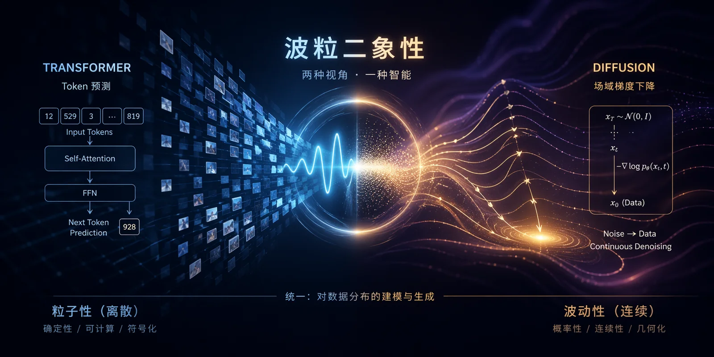

A friend recently wrote an essay titled "[Vision Is the Foundation of the World, Not a Plugin for Language](https://mp.weixin.qq.com/s/pQXCE1RdsHA73qQxTuyG2w)."
It prompted a conversation with Claude, which I have edited into the Socratic dialogue below.

## Language as the Foundation, Vision as an Add-On?

**Q:** The industry is debating the future of multimodal AI: will language dominate, or will vision? What do you think?

**A:** Before I answer, let me ask you this: why must either one dominate?

**Q:** Because there has to be a foundation. A house has to be built on something.

**A:** That is exactly what I want to question. "Foundation" is a metaphor. Have you considered that the metaphor itself may be misleading us?

**Q:** How so?

**A:** Look at language and vision. How do they coexist in humans? Is language built on top of vision? Or is vision subordinate to language?

**Q:** Neither, I suppose. They exist side by side.

**A:** Then let's look more closely. Close your eyes and imagine a painting. How do you do it?

**Q:** I just... picture it.

**A:** Do you start with the first stroke in the upper-left corner and work your way across, one stroke at a time?

**Q:** No. An overall feeling comes first—a tone, an atmosphere—and then the details gradually emerge.

**A:** Good. Now think about how you construct an argument.

**Q:** That is completely different. One step leads to the next; the premises lead to the conclusion. Put them in the wrong order and the whole argument collapses.

**A:** So you just described two kinds of thought. One is **continuous and parallel, with the whole preceding its parts**. The other is **discrete and sequential, with the parts composing the whole**.

**Q:** That's right.

**A:** They may not be the same kind of thing at all.

## Transformer and Diffusion

**Q:** What does this have to do with AI?

**A:** There is an interesting coincidence here. What are the two most successful AI architectures of the past few years?

**Q:** Transformer and Diffusion.

**A:** Right. Now think about what a Transformer does.

**Q:** It predicts the next token.

**A:** One step at a time?

**Q:** Yes. It is **autoregressive**.

**A:** And Diffusion?

**Q:** The whole image evolves and sharpens together, starting from noise.

**A:** Notice anything?

**Q:** Aren't those the two modes of thought I just described?

**A:** Exactly. Transformer is discrete, sequential, and symbolic. Diffusion is continuous, parallel, and field-state based. This is no coincidence. They are **two mathematically incompatible generative paradigms**, and they happen to correspond to two cognitively incompatible modes of thought.

**Q:** So that is why Transformer excels at language and Diffusion at vision?

**A:** It goes deeper than that. **The real distinction is not between language and vision, but between symbols and field states.** Language happens to be a symbolic signal; an image happens to be a field-state signal. The true divide is not modality, but computational paradigm.

> Strictly speaking, it is the distinction between **autoregression** and **field-state evolution**.

## Don't Merge Them; Preserve the Tension

**Q:** Are you saying the next generation of AI should combine these two architectures?

**A:** Let me ask you something: have physicists ever combined waves and particles into one?

**Q:** No.

**A:** How do they handle wave-particle duality?

**Q:** They keep both mathematical frameworks. To describe the same phenomenon, you need both; they cannot be collapsed into one.

**A:** Right. Because **both descriptions are true, and neither can be reduced to the other**.

**Q:** You think intelligence works the same way?

**A:** I do. A purely symbolic account of intelligence misses its field-state half. A purely field-state account misses its symbolic half. Both must coexist, and the **tension between them** must be preserved.

## MoE Is Not a Two-Hemisphere Brain

**Q:** If that is true, isn't MoE already doing this? After all, MoE lets multiple experts coexist.

**A:** Good question. Let me ask you: in today's MoE models, do the experts have the same architecture or different ones?

**Q:** The same architecture. In Mixtral, DeepSeek, and similar models, every expert is the same kind of FFN; only the parameters differ.

**A:** What part of the brain does that resemble: the two hemispheres, or something else?

**Q:** Probably not the hemispheres. The left and right hemispheres differ at the **structural** level.

**A:** Exactly. The "specialization" among MoE experts is a single structure differentiating into different uses during training. That does not give you a left brain and a right brain. It gives you **a hundred left brains dividing up the work**.

**Q:** Then what does it correspond to in the brain?

**A:** Cortical columns: the repeating units of the mammalian cerebral cortex. Their structures are highly similar, while their functions differentiate through learning. The brain's real organization is **heterogeneous at the hemisphere level and homogeneous at the cortical-column level**. Today's MoE has implemented only the second half.

## Differentiation Depends on Constrained Communication

**Q:** Then do we just need a heterogeneous MoE—say, half Transformer experts and half Diffusion experts?

**A:** That points in the right direction. But first I want to ask a more fundamental question: why can the brain's hemispheres remain differentiated?

**Q:** Because they have different functions.

**A:** But different functions are the **result**, not the **cause**. They did not begin fully differentiated. What stabilized that differentiation and kept them from collapsing into a homogeneous system?

**Q:** The corpus callosum?

**A:** Think again. What does the corpus callosum do?

**Q:** It connects the two hemispheres.

**A:** Does it connect them completely?

**Q:** Not really. The corpus callosum has limited bandwidth, and most of its connections are **inhibitory**.

**A:** What does that suggest?

**Q:** That the brain **deliberately limits** communication between the hemispheres?

**A:** A 2019 whole-brain atlas of lateralization published in *Nature Communications* reported a clear pattern: **the more functionally differentiated two brain regions are, the weaker their connections through the corpus callosum**. This finding supports a theory called the interhemispheric independence hypothesis.

**Q:** That is counterintuitive.

**A:** It is. **Differentiation depends on constrained communication.** If the hemispheres were fully interconnected, they would collapse into a homogeneous system and lose the advantages of differentiation.

## Tighter Communication May Destroy Differentiation

**Q:** What does that imply for MoE?

**A:** Look at what MoE research is pursuing today: top-2 routing, shared experts, soft routing, load balancing... All these improvements are doing the same thing: **reducing isolation among experts so information can flow more freely**.

**Q:** Wait.

**A:** Exactly.

**Q:** That is actively **undermining the conditions for differentiation**?

**A:** Yes. The industry is pursuing scaling efficiency through "tighter communication," while true heterogeneous differentiation requires communication to be harder. **These are not different points on a continuum. They point in opposite directions.**

**Q:** So today's MoE architectures cannot spontaneously evolve a left and right brain?

**A:** Their design works against differentiation. To grow true hemispheres, we must **design isolation deliberately**, not passively optimize for integration.

## What Is Scarce Is Controlled Heterogeneity

**Q:** What should the next state-of-the-art architecture look like, then?

**A:** Let me ask you first: are two hemispheres enough? Why not ten?

**Q:** Wouldn't more be better?

**A:** Have you ever seen an animal with nine brains?

**Q:** An octopus?

**A:** Exactly. An octopus has one central brain and a separate ganglion in each of its eight arms. What characterizes its intelligence?

**Q:** It is extraordinarily good at parallel spatial and tactile tasks, but it has neither abstract reasoning nor language.

**A:** What does that tell us?

**Q:** As the number of hemispheres rises, so does the coordination cost. The bottleneck consumes the gains from heterogeneity.

**A:** Right. That vertebrates settled on two is probably no accident. It may be the **Pareto optimum between symmetry and the minimum necessary differentiation**. Two is the minimum necessary differentiation; four may already be near the threshold. **Heterogeneity is not what is scarce. Controlled heterogeneity is.**

## Two Kinds of Knowledge: Episteme and Metis

**Q:** Fine. Suppose we have a Transformer hemisphere and a Diffusion hemisphere connected by a bandwidth-constrained bridge. What, exactly, are these hemispheres doing differently?

**A:** This is where I wanted us to arrive. Let me ask you: in how many ways can you "know" something?

**Q:** I can think of two. One is knowledge I can state, such as "water boils at 100 degrees Celsius." The other is something I know but cannot put into words, such as knowing that a piece of code has a bug without being able to explain why.

**A:** Exactly. Philosophy has two ancient terms for these: **episteme** and **metis**. Episteme is knowledge that can be stated, is universal, and concerns "why." Metis is wisdom that cannot be stated, is situated, and concerns "how."

**Q:** That sounds like explicit and tacit knowledge.

**A:** It does. Michael Polanyi put it this way: **"We can know more than we can tell."** His stronger claim was that all knowledge is either tacit or rooted in tacit knowledge. Explicit knowledge is only the afterimage left when tacit knowledge is squeezed into the framework of language.

## Paths and Terrain

**Q:** What does this have to do with Transformer and Diffusion?

**A:** Think about it. What does a Transformer learn?

**Q:** $P(x_{t+1} \mid x_{\leq t})$, a chain of conditional probabilities. Each decision is explicit and traceable, and can be unrolled into a chain of thought.

**A:** So a Transformer learns **paths**: how to get from here to there.

**Q:** What about Diffusion?

**A:** Diffusion learns the score function, the gradient of the log probability, $\nabla_x \log p(x)$. This object has a remarkable property: **it is not about "how to reason." It is about "what is plausible."**

**Q:** So what does it learn?

**A:** **Terrain.** The shape of the entire probability space: where the peaks and valleys are, and which way the slope runs.

**Q:** Wait. A chess expert's intuition when looking at a board...

**A:** Go on.

**Q:** It is a sense of where the position lies within the distribution of "plausible chess games." The expert is not reasoning through a path, but **feeling the terrain**.

**A:** Exactly. That is the phenomenological version of a score function. **The kind of object a Diffusion model learns is structurally isomorphic to tacit knowledge.**

## Understanding Is Not the Same as Explanation

**Q:** Does that mean Diffusion fundamentally cannot "understand" and can only rely on "intuition"?

**A:** I want to pause here, because that claim needs a finer distinction. It depends on what "understanding" means.

**Q:** What do you mean?

**A:** If "understanding" means **being able to provide an explicit chain of reasoning and answer "why,"** then yes, Diffusion cannot do it. Its generative process contains no structure corresponding to "because."

**Q:** What if "understanding" means something else?

**A:** If it means **grasping the internal structure of a domain, distinguishing what is plausible from what is not, and making sound judgments in situations never seen before**...

**Q:** ...

**A:** Then Diffusion offers exactly that: **understanding in a deeper sense**.

**Q:** You are saying...

**A:** Let me ask you a question. Who truly understands physics: the person who can recite every formula, or the one who **looks at a physical situation and immediately feels that something is wrong**?

**Q:** The latter.

**A:** Who truly understands code: the person who can explain every line, or the one who **looks at a piece of code and immediately smells a bug**?

**Q:** The latter.

**A:** When you ask these people why they made that judgment, they often cannot give a satisfying answer. They say, "It just feels wrong," or "I can't explain it, but I know."

**Q:** You mean...

**A:** **The deepest human understanding is often precisely what cannot be stated.** That is not a defect of understanding. It is its highest form.

**Q:** Then what we usually call "explanation" and "understanding"...

**A:** The entire AI industry currently treats "understanding" as synonymous with "the ability to explain." That may itself be a category error.

## The Benchmark Blind Spot

**Q:** That makes me think of something. What do all of today's benchmarks measure?

**A:** You tell me.

**Q:** Questions with standard answers. MMLU, GSM8K, HumanEval... They all ask whether the model can get the right answer.

**A:** Are they measuring episteme or metis?

**Q:** Episteme, all of them.

**A:** So when you say, "LLMs are approaching human experts on benchmarks," what are you actually saying?

**Q:** They are approaching human experts on the **half of knowledge that can be stated**.

**A:** And the half that actually makes an expert an expert?

**Q:** It is not being measured. Nor is it being trained.

**A:** This may be one reason scaling curves are flattening. The problem may not be insufficient data or compute, but **insufficient architectural dimensionality**. We have pushed one dimension to its limit, while today's architectures have **no container at all** for the other dimension of human intelligence.

## Translation Itself Is the Core Act of Intelligence

**Q:** Then what will the next breakthrough be?

**A:** I will not pretend to know. But I have a guess: **it will come when we engineer bidirectional translation between the two.**

**Q:** What do you mean?

**A:** Today's chain of thought is one-way: it squeezes more reasoning steps out of an LLM, but never leaves the dimension of episteme. The direction that truly matters may be **reverse CoT**: once a Diffusion-like field state has been evoked, how do we translate its intuition into explicit structures a Transformer can use?

**Q:** From terrain to path?

**A:** Exactly. Going from tacit to explicit is "expression"; going from explicit to tacit is "internalization." **Translation itself is the core act of intelligence.**

**Q:** So the way an expert becomes an expert...

**A:** Is precisely the result of repeatedly cycling in both directions. Beginners rely on explicit rules. Experts internalize those rules as intuition. Masters move freely between intuition and rules. **This is not a static structure of two modules placed side by side. It is a dynamical system.**

## The Corpus Callosum Is Not a Connection, but a Boundary

**Q:** So let's return to the original question: is language the foundation? Is vision the foundation?

**A:** What do you think?

**Q:** Neither. "Foundation" was the wrong question.

**A:** Then what lies underneath?

**Q:** Two incompatible computational paradigms, mutually calibrating through a bandwidth-constrained bottleneck. The brain spent hundreds of millions of years evolving this structure.

**A:** And these two paradigms correspond to two kinds of knowledge. One can be stated; the other cannot. Yet today's AI industry...

**Q:** Has inherited a tradition that values only what can be stated, beginning with Plato and Aristotle.

**A:** Right. Transformer is the technical embodiment of episteme. Everything must be tokenized, everything must be expressible, and everything must be unrolled into a chain of thought.

**Q:** Then what is Diffusion?

**A:** The architecture of metis. The other half suppressed by two thousand years of Western rationalism—the tacit, situated, ineffable half—**is not a decoration on intelligence. It is intelligence's foundation.**

**Q:** If you had to summarize today's discussion in one sentence, what would you say?

**A:** We may need to rethink many of our default assumptions about intelligence.

**Q:** Such as?

**A:** The metaphor of a "foundation." The meaning of "understanding." The belief that scale is enough. The intuition that more integration is always better.

**Q:** ...

**A:** Real intelligence does not grow out of integration. It grows out of **disciplined differentiation**.

**The corpus callosum is not a connection. It is a boundary.**

This is Part I—the right-brain thesis. Part II—the cerebellum thesis—is coming soon.
