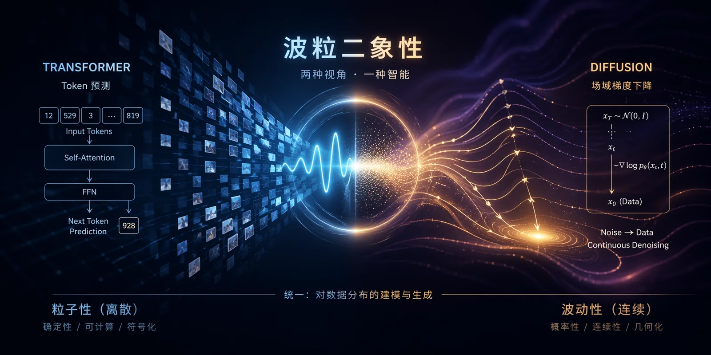

最近朋友写了一篇文章，《[视觉，本就是世界的基础，而不是语言的插件](https://mp.weixin.qq.com/s/pQXCE1RdsHA73qQxTuyG2w)》。
引发了我与 Claude 的一轮对话思考。将其整理为苏格拉底式问答，与大家分享。

## 语言是地基，视觉是外挂？

**问**：现在行业在争论一件事：多模态 AI 的未来，到底是语言为主，还是视觉为主？你怎么看？

**答**：在回答之前，我想先问你：你为什么觉得必须有一个“为主”？

**问**：因为总得有个地基吧。房子总要建在什么东西上面。

**答**：这正是我想追问的。“地基”是一个隐喻。你有没有想过，这个隐喻本身可能就在误导我们？

**问**：怎么说？

**答**：你看语言和视觉这两样东西。它们在人类身上是怎么共存的？是语言建立在视觉之上吗？还是视觉是语言的附属？

**问**：好像都不是。它们是并列的。

**答**：那如果我们看得更仔细一点。你闭上眼睛，想一幅画。你是怎么想的？

**问**：就是……想象出来。

**答**：是从左上角第一笔开始，一笔一笔往右推的吗？

**问**：不是。更像是先有一个整体的感觉、一个调性、一个氛围，然后细节慢慢浮出来。

**答**：好。现在再想一下：你怎么“想”一段论证？

**问**：那就完全不一样了。一步推一步，前提推出结论。顺序错了，整个论证就塌了。

**答**：所以你刚才做了两件事：一件是**连续的、并行的、整体先于局部**的思考，另一件是**离散的、序列的、局部构成整体**的思考。

**问**：确实。

**答**：这两件事，可能根本不是同一种东西。

## Transformer 与 Diffusion

**问**：那跟 AI 有什么关系？

**答**：这里有个有意思的巧合。这几年 AI 圈最成功的两种架构是什么？

**问**：Transformer 和 Diffusion。

**答**：对。现在请你想一想，Transformer 在做什么？

**问**：预测下一个 token。

**答**：一步一步预测？

**问**：对，**自回归**。

**答**：那 Diffusion 呢？

**问**：从噪声里，整张图一起演化、一起细化。

**答**：你发现什么没有？

**问**：这不就是我刚才说的那两种思考方式吗？

**答**：对。Transformer 是离散、序列、符号的；Diffusion 是连续、并行、场态的。这不是巧合。这是**两种在数学上就不兼容的生成范式**，恰好对应了两种在认知上就不兼容的思考方式。

**问**：所以 Transformer 擅长语言，Diffusion 擅长视觉，就是这个原因？

**答**：比这更深一点。**不是语言与视觉的差别，而是符号与场态的差别。** 语言恰好是符号信号，图像恰好是场态信号。真正的分野不在模态，而在计算范式。

> 严格来说，是 **自回归** 与 **场态演化** 的差别。

## 不要合并，要保持张力

**问**：那你是不是在说：下一代 AI 应该把这两个架构合起来？

**答**：我想反问：你见过物理学家把波和粒子合起来吗？

**问**：没有。

**答**：他们怎么处理波粒二象性？

**问**：让两套数学框架并存。描述同一个现象，必须同时保留两套，不能合并。

**答**：对。因为**真相就是两套都成立，而且互相不可化约**。

**问**：你的意思是智能也这样？

**答**：我觉得是。用纯符号系统描述智能，会漏掉场态的那一半；用纯场态系统描述，又会漏掉符号的那一半。两套必须并存，而且必须保持**互相的张力**。

## MoE 不是左右脑

**问**：如果是这样，那 MoE 算不算就是在做这件事？毕竟 MoE 就是多个专家并存。

**答**：好问题。我反问你：今天的 MoE 里，不同专家的**架构**是一样的，还是不一样的？

**问**：一样的。Mixtral、DeepSeek 这些，所有专家都是同一种 FFN，只是参数不同。

**答**：那你觉得这对应大脑里的什么？左右脑，还是别的？

**问**：好像不是左右脑。左右脑是**结构上**就不一样的。

**答**：对。MoE 的专家之间的“专业化”，是同一种结构在训练中分化出的不同用途。这不是左右脑，这是**一百个左脑在分工**。

**问**：那它对应大脑里什么？

**答**：皮层柱。哺乳动物大脑皮层的重复单元：结构高度相似，功能通过学习分化。大脑真正的组织结构是**半球级异质，加皮层柱级同质**。今天的 MoE 只做对了第二半。

## 分化依赖通信受限

**问**：那只要把 MoE 做成异质的就行了？比如一半专家是 Transformer，一半是 Diffusion？

**答**：这方向对。但我想先问你一个更基础的问题：为什么大脑的左右半球能保持分化？

**问**：因为它们功能不同。

**答**：但功能不同是**结果**，不是**原因**。它们一开始不是就分化的。是什么让这种分化稳定下来，没有塌缩成同质系统的？

**问**：胼胝体？

**答**：再想。胼胝体做了什么？

**问**：连接两个半球。

**答**：连接得充分吗？

**问**：好像不是很充分。胼胝体的带宽其实有限，而且大多数连接是**抑制性**的。

**答**：那你觉得这说明什么？

**问**：大脑**特意限制**了两个半球之间的通信？

**答**：Nature Communications 2019 年的全脑侧化图谱给出了一个很明确的观察：**脑区之间越是功能分化，通过胼胝体的连接反而越弱。** 这个发现支持一个叫“半球间独立假说”的理论。

**问**：这是反直觉的。

**答**：对。**分化依赖于通信受限。** 如果两个半球完全连通，它们会塌缩成一个同质系统，反而失去分化的优势。

## 更紧密的沟通，可能破坏分化

**问**：那这对 MoE 意味着什么？

**答**：你观察一下今天 MoE 研究在追求什么？Top-2 routing、shared experts、soft routing、load balancing……所有这些改进都在做同一件事：**降低专家之间的隔离，让信息更自由地流动**。

**问**：等等。

**答**：对。

**问**：这正好是在**破坏分化的条件**？

**答**：是。行业在用“更紧密的沟通”追求 scaling 效率，但真正的异质分化要求“更难的沟通”。**这两个方向不是渐变的，而是相反的。**

**问**：所以今天的 MoE 架构不可能自发演化出左右脑？

**答**：它的设计机制本身就在对抗分化。要长出真正的半球，必须**主动设计隔离**，而不是被动追求融合。

## 稀缺的是受控异质性

**问**：那下一代 SOTA 应该长什么样？

**答**：我先问你，两个半球够吗？为什么不是十个？

**问**：更多不是更好吗？

**答**：你见过有九个脑的生物吗？

**问**：章鱼？

**答**：对。章鱼有一个中央脑和八条腕各自的神经节。它的智能有什么特点？

**问**：它极其擅长并行的空间和触觉任务，但没有抽象推理，也没有语言。

**答**：这说明什么？

**问**：半球多了，协调成本也涨了。异质性带来的收益被瓶颈吃掉了。

**答**：对。脊椎动物选了“二”不是偶然，它很可能是**对称性和最小必要分化之间的 Pareto 最优**。二是最低必要分化，四可能已经接近临界。**稀缺的不是异质性，是受控的异质性。**

## 两种知识：Episteme 与 Metis

**问**：好，假设我们有一个 Transformer 半球和一个 Diffusion 半球，通过一个受限 bridge 连接。问题是：这两个半球到底在做什么不同的事？

**答**：这正是我想和你一起走到的地方。我问你：你“知道”一件事，可能有几种方式？

**问**：我能想到两种。一种是我能说出来的，比如“水在一百度沸腾”。一种是我知道但说不出来的，比如我知道这段代码有 bug，但我说不清为什么。

**答**：对。哲学里有两个古老的词：**episteme** 和 **metis**。Episteme 是可陈述的、普遍的、关于“为什么”的知识。Metis 是不可陈述的、情境的、关于“如何”的智慧。

**问**：听起来就是显性知识和默会知识。

**答**：对。Michael Polanyi 有一句话：**“我们知道的，比我们能说出来的多。”** 他的判断更狠：所有知识要么是默会知识，要么根植于默会知识。显性知识只是默会知识被挤进语言框架之后的残影。

## 路径与地形

**问**：这和 Transformer、Diffusion 有什么关系？

**答**：你想一下。Transformer 学的是什么？

**问**：$P(x_{t+1} \mid x_{\leq t})$，条件概率链。每一步的决策都是显式的、可追溯的、可以被 chain-of-thought 展开的。

**答**：所以 Transformer 学的是**路径**。从这里如何到那里。

**问**：Diffusion 呢？

**答**：Diffusion 学的是 score function，对数概率梯度 $\nabla_x \log p(x)$。这个对象有一个非常特殊的性质：**它不是关于“如何推理”的，它是关于“什么是合理的”的**。

**问**：所以它学的是？

**答**：**地形**。整个概率空间的形状。哪里是山峰，哪里是山谷，坡度朝向哪里。

**问**：等一下。一个专家看棋盘的直觉……

**答**：你说下去。

**问**：就是在感觉这个局面在“合理棋局分布”里处于什么位置。他不是在推理路径，他是在**感觉地形**。

**答**：对。这是 score function 的现象学版本。**Diffusion 模型学的那类对象，和默会知识的结构是同构的。**

## 理解不等于解释

**问**：那是不是可以说，Diffusion 本质上就是没法“理解”的，只能“直觉”？

**答**：我想在这里停一下，因为这个判断需要被切得更细。取决于“理解”是什么意思。

**问**：什么意思？

**答**：如果“理解”指的是**能给出显式的推理链、能回答“为什么”**，那么是的，Diffusion 做不到。它的生成过程里就不存在“因为”这种结构。

**问**：那如果“理解”指的是别的意思呢？

**答**：如果“理解”指的是**掌握一个领域的内部结构，能区分合理与不合理，能在未见过的情境里做出正确判断**……

**问**：……

**答**：那么 Diffusion 恰恰是**更深意义上的理解**。

**问**：你是在说……

**答**：我想问你一个问题。一个真正懂物理的人，是能背出所有公式的人，还是**看到一个物理情境立刻感觉到“这里不对”**的人？

**问**：后者。

**答**：一个真正懂代码的人，是能解释每一行的人，还是**看到一段代码立刻嗅到“这里有 bug”**的人？

**问**：后者。

**答**：这些人被问到“你为什么这么判断”的时候，很多时候给不出让人满意的答案。他们说“就是感觉”、“说不清但我知道”。

**问**：你的意思是……

**答**：**人类最深的理解，往往恰恰是不可陈述的。** 这不是理解的缺陷，是理解的顶点。

**问**：那我们平时说的“解释”、“理解”……

**答**：今天整个 AI 行业把“理解”默认等同于“能解释”。这可能本身就是一个范畴错误。

## Benchmark 的盲区

**问**：这让我想到一件事。今天所有的 benchmark 都在测什么？

**答**：你说。

**问**：都是有标准答案的题。MMLU、GSM8K、HumanEval……全都是“能不能答对”。

**答**：那它们测的是 episteme，还是 metis？

**问**：全都是 episteme。

**答**：所以当你说“LLM 在 benchmark 上接近人类专家”的时候，你真正在说什么？

**问**：它在**可陈述的那一半**知识上接近人类专家。

**答**：而人类专家真正让他成为专家的那一半呢？

**问**：没有被测。也没有被训练。

**答**：这可能就是为什么 scaling 曲线在走平的一个原因。不是数据不够，不是算力不够，而是**架构维度不够**。我们一直在一个维度上做到极致，但人类智能的另一个维度，在今天的架构里**根本没有容器去承载**。

## 转化本身，就是智能的核心动作

**问**：那下一代突破会是什么？

**答**：我不会假装我知道答案。但我有一个猜测：**它会出现在“双向转化”被工程化之后。**

**问**：怎么讲？

**答**：今天的 Chain-of-Thought 是单向的：从 LLM 挤出更多推理步骤，但始终在 episteme 维度内部打转。真正重要的方向，可能是**反向 CoT**：如何让一个 Diffusion-like 的场态被激发之后，把它的直觉“翻译”成可以被 Transformer 使用的显性结构。

**问**：从地形到路径？

**答**：对。从默会到显性是“表达”，从显性到默会是“内化”。**转化本身，就是智能的核心动作。**

**问**：一个专家是怎么成为专家的……

**答**：正是这两个方向反复循环的结果。初学者靠显性规则，高手能把规则内化成直觉，大师在直觉和规则之间自由切换。**这不是两个模块并列的静态结构，而是一个动力系统。**

## 胼胝体不是连接，是边界

**问**：所以回到最开始的问题：语言是地基吗？视觉是地基吗？

**答**：你觉得呢？

**问**：都不是。地基这个问法就错了。

**答**：那真正的底层是什么？

**问**：两种不兼容的计算范式，通过一个有限带宽的瓶颈，互相校准。大脑用了几亿年进化出这个结构。

**答**：更进一步，这两种范式对应两种知识。一种可陈述，一种不可陈述。而今天的 AI 行业……

**问**：继承了一个只看重可陈述知识的传统。从柏拉图、亚里士多德开始的。

**答**：对。Transformer 是 episteme 的技术化身。一切都要 token 化，一切都要可陈述，一切都要能被 chain-of-thought 展开。

**问**：那 Diffusion 是什么？

**答**：Metis 的架构。那个被西方理性主义传统压抑了两千年的另一半，默会的、情境的、不可言说的那一半，**不是智能的装饰，是智能的底座**。

**问**：如果让你用一句话总结今天的讨论，你会怎么说？

**答**：我们对智能的很多默认假设，可能都需要重新想一遍。

**问**：比如？

**答**：“地基”这个隐喻。“理解”这个概念。“scale 就够了”这个信仰。“越融合越好”这个直觉。

**问**：……

**答**：真正的智能，不是从融合里长出来的。它是**从有纪律的分化里长出来的**。

**胼胝体不是连接，是边界。**

本篇为上半部分 —— 右脑命题，下半部分 —— 小脑命题，敬请期待。

