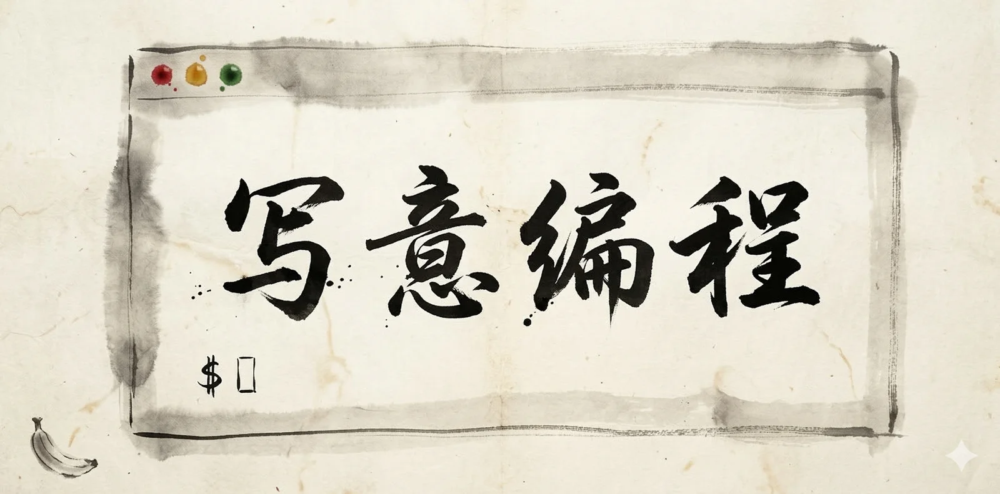

Andrej Karpathy 去年造了个词叫 Vibe Coding。大意是说，现在写代码可以完全凭感觉来了：
你把想法告诉 AI，AI 把代码吐出来，你看一眼觉得“差不多”就接受，细节懒得看，反正跑起来就行。

这个词火得很快，因为它确实精准地抓住了一种正在发生的变化：
写代码正在从 “精确控制每一行”，变成“描述意图，让 AI 去实现”。

但问题来了：**Vibe Coding 中文到底该叫什么？**

陆奇博士在一次演讲中聊到这个话题，说 Vibe Coding 目前没有一个好的中文翻译，所以他继续用英文原文。

这其实挺说明问题的。一个好的译名能让概念扎根生长，一个烂的译名让人皱皱眉，然后继续说英语。
“Vibe”本身就很微妙，不是一个有明确边界的概念，更像是一种氛围、感觉、态度。这让翻译变得有趣，也变得困难。

-------

## 先看看有哪些候选

**“氛围编程”**，最直译的方案。Vibe 的词典释义就是“氛围”嘛。问题是“氛围编程”听起来像在说编程环境，灯光柔和、音乐舒缓、咖啡续杯那种，意思全跑偏了。

**“随性编程”**，抓住了“不拘束”，但过了。随性暗示没有章法，像是乱写。Vibe Coding 不是乱写，你还是得清楚知道自己要什么，只是实现路径变了。

**“随想编程”**，比“随性”好一点，多了“思考”的意味。但“随想”一般指随笔式的思绪漫游，拿来形容编程，总觉得差点劲。

**“感觉编程”**，没毛病，但也没灵魂。就像把“Think Different”翻译成“想得不一样”一样，不能说错，但就是立不住。

**“直觉编程”**，有点意思，Vibe Coding 中确实有很强的直觉成分。但它太强调"判断"了，丢掉了那种创作的潇洒松弛感。

**“意念编程”**，听起来像是用脑电波控制电脑写代码，科幻感太强了。

**“意图编程”**，最接近本质的一个，但一个正确到毫无性格的定义与 Vibe Coding 那种 “管他呢先跑起来再说” 的松弛感背道而驰。
 而且跟已有的 Intent-Based Programming 概念翻译撞车了。

**“歪脖编程”**，谐音梗。画面倒是对的：程序员歪着脖子看 AI 吐出来的代码，似懂非懂，歪头想想“行吧” 就接受了，活灵活现。但它只能当个梗，而不是术语。

--------

## 为什么“写意编程”最好

中国画有“工笔”和“写意”两大路子。工笔精雕细琢，一根羽毛画几十笔；写意大笔挥洒，寥寥数笔传神韵。

传统编程就是工笔，逐行手写，字斟句酌，精确控制。Vibe Coding 就是写意，重意图表达，轻细节实现，要的是“神似”，不是“形似”。

这个对应不是硬凑的，它在结构上严丝合缝。

再说“写”这个字。“写意”的“写”是书写、描绘，“写代码”的“写”是同一个字。
这层双关让“写意编程”天然属于编程语境，既是艺术态度，也是编码方式。

然后是文化厚度。“写意”两个字自带几百年美学积淀，中文读者一看就懂：不追求工整精确，追求神韵意境。
你不需要解释它是什么意思，所有人都知道。这种即时的文化共鸣，是“氛围编程”“感觉编程”这些直译方案给不了的。

最后说格调。Karpathy 造出“Vibe Coding”这个词时，语气是轻松、自信、带点调侃的。
“写意编程”的气质也类似，不是干巴巴的技术术语，而是一个有态度、有画面感的表达。
你跟人说“我在写意编程呢”，那种挥洒自如的劲儿就出来了。

--------

## 结语

好的翻译不是逐字对应，而是在另一种语言里找到那个恰好在等你的词。

从工笔到写意，从手写到 AI，从控制到表达，编程方式的这次转变，中国美学传统里几百年前就有了现成的概念。

下次你打开 Cursor 或者 Claude Code，对着 AI 说出你的想法，看着代码自己长出来的时候，

你不是在 Vibe Coding，你是在 **写意编程**。

--------

## Credit

Vibe Coding 翻译成 “写意编程” 这个想法，老冯几个月前听陆奇演讲的时候就有了。在 Piglet.Run 发布的时候，我还特意用了它 —— “一键拉起你的写意编程环境”。

目前来看在互联网上没有搜到别人发过，应为老冯的原创首发。;)

