People keep asking what I have to show for pedaling seven $200-a-month Max subscriptions at once—including two comped through open-source programs. Honestly, I have lost count myself.

After I published [*The Codex Reset Party Is Over: No More Free Lunch*](/ai/codex-reset-end/), I said the next post would take inventory. Then Tibo handed out two resets in as many days, so I jumped back on the bike and set this article aside. I put out a couple of project announcements as placeholders instead. Today I am nearly out of quota again, so I can finally stop pedaling and make good on that promise.

I had Codex scan my token usage over the past two or three months. The total exceeded 100 billion tokens, and I used only top-tier models at their highest reasoning settings. But counting beans means nothing. The real question is whether those tokens became code, packages, documentation, releases, shippable products, or durable assets.

---

## The Short Version

Over the past month or so, the agents and I have mainly done the following:

- Shipped Silo, now the most active community fork of MinIO.
- Shipped Pigsty 4.4 and finished the work for 4.5, adding Kafka and MySQL modules. The MinIO module gained support for Silo and RustFS, the Redis module gained Valkey, and ClickHouse and K3s support entered pilot use.
- Expanded the PostgreSQL extension ecosystem to 572 packaged extensions, with metadata and bilingual documentation for more than 2,200 extensions. Built PGEXT.CLOUD into the largest and most comprehensive PostgreSQL extension directory.
- Took over build and distribution maintenance for 12 PostgreSQL kernel forks across 16 Linux platforms. Rebuilt the RPM and DEB packages for nearly 100 projects in the observability ecosystem. Kept PostgreSQL.org news synchronization, the daily tech digest, bilingual documentation, blog posts, and a steady stream of issues, pull requests, and packaging work moving. I will spare you the routine stuff.
- New project: Boar, a graphical management platform for Pigsty.
- New project: SOW, the enterprise APT/DNF artifact repository manager used by Pigsty.
- New project: OINK, a Hugo theme optimized for engineering documentation.
- New project: go-patroni, a Go rewrite of the PostgreSQL high-availability component Patroni, with the client SDK released.
- New project: snort, a Go overhaul of pg_exporter that lets one component collect all PostgreSQL metrics and logs.
- Visualization: a Pigsty digital twin, dashboards, and a Grafana panel plugin.
- Visualization: an interactive Pigsty motherboard model.
- New project: a native macOS app for CapsLock Enhancement, my keyboard remapping system.
- Translation: a fully proofread Chinese translation of *Designing Data-Intensive Applications*, Second Edition.
- Writing: a complete AI-generated first draft of *The Thirty-Six Stratagems of PostgreSQL*.
- Websites: nearly every project above now has its own site and documentation built with OINK.

Everything above is finished or close to it, though a few pieces have not been released yet. Pigsty 4.5 is due this week. The RustFS integration is done but will wait for Pigsty 5. K3s and ClickHouse remain private beta modules rather than official Pigsty deployment modules. Boar and CapsLock are still in active development. Everything else has public output you can inspect.

Here is the quick tour.

---

## Silo: From Fork to Full Product

The project that comes closest to creating a product from thin air is [Silo](https://silo.pgsty.com/) ([GitHub](https://github.com/pgsty/silo)). After the MinIO community edition effectively stopped being maintained, I took over the fork. By August, it was no longer a MinIO branch with a few bug fixes and packages. It had become an independent open-source project.

The Silo repository now has about **2,200 GitHub stars**, and its [Docker Hub image](https://hub.docker.com/r/pgsty/minio) has more than **520,000 pulls**. By the public numbers, it is the most active and fastest-moving community fork of MinIO.

I covered the story in more detail in [**Silo: A Maintained, MinIO-Compatible Object Store**](/en/db/long-live-silo/). We now have a live example of one person, properly equipped with agents, taking over a top-tier open-source project built over ten years by countless people at a cost of hundreds of millions of dollars. The absurdity still makes me laugh.

[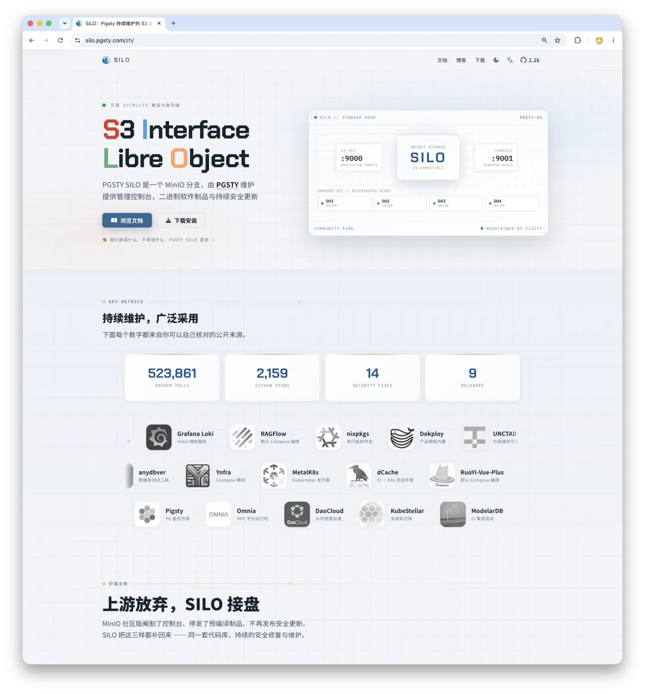](https://silo.pgsty.com/)

[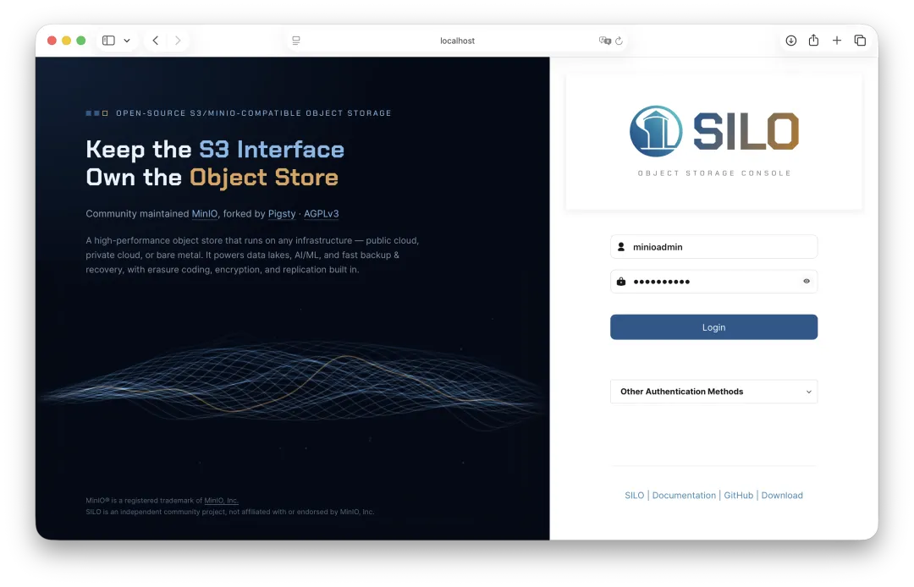](https://silo.pgsty.com/)

---

## Pigsty: The Distribution Machine

My baseline workload already includes [Pigsty](https://pigsty.io/), a large PostgreSQL distribution. It is not a single program but an entire batteries-included stack: kernels, extensions, backups, high availability, monitoring, service management, software repositories, and a long tail of surrounding components. All of it must work across 16 major Linux distribution releases and five active PostgreSQL major versions.

[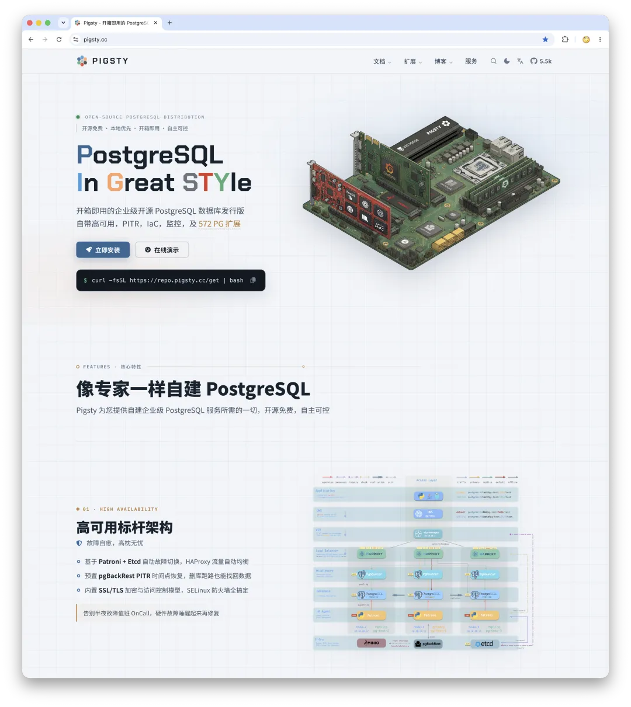](https://pigsty.io/)

Version 4.5 brings a lot of new machinery. One customer wanted Kafka inside Pigsty. I thought about it, spent two days building the integration with agents, and added support for dynamic Apache Kafka 4.1+ KRaft clusters, both single-node and multi-node.

Once Kafka was in, I figured I might as well add MySQL too. Pigsty can now manage standalone MySQL 8.4 LTS and three-node InnoDB Clusters, plus MySQL Router, TLS, XtraBackup, and monitoring dashboards.

The Redis module can now run either BSD-licensed Redis 7.2 or Valkey 9.1. The MinIO module can switch among upstream MinIO, my own Silo fork, and RustFS. An “engine slot” may look like one extra parameter, but a great deal of work sits behind it.

While building Valkey across every supported platform, I also found a packaging bug. Both Debian's packages and Valkey's official DEB packages were broken. I filed the issue, fixed it, and documented the story in [*A Packaging Patch Has Been Corrupting Valkey's Memory Accounting Since 2017*](/en/db/valkey-bug/).

Strictly speaking, Kafka and MySQL are still pilot modules. I also built K8s and K3s modules along the way. Pigsty is no longer merely a PostgreSQL distribution; it is an open-source database infrastructure PaaS. You can have PostgreSQL, MinIO, Redis, MySQL, Kafka, DuckDB, the full VictoriaMetrics observability stack, ClickHouse, and Kubernetes—the list goes on.

---

## PGEXT.CLOUD: The Extension Ecosystem

I also released a new version of [PGEXT.CLOUD](https://pgext.cloud/) for the PostgreSQL extension ecosystem.

If extensions are PostgreSQL's superpower, PGEXT.CLOUD is unquestionably the number-one directory and repository for them. It now catalogs an unprecedented 2,239 extensions and provides ready-to-use RPM and DEB packages for selected high-quality, useful projects.

[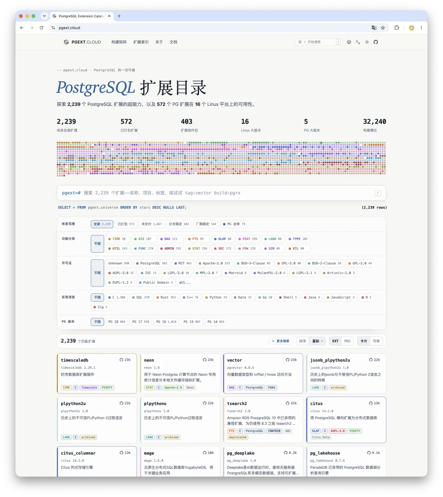](https://pgext.cloud/)

For perspective, the official PostgreSQL repositories provide 92 extension package groups. I provide another 340 on top of them, while also filling omissions and fixing defects in the official extension matrix. The result is full coverage with no gaps: 32,240 build combinations across 16 Linux platforms and five PostgreSQL major versions.

[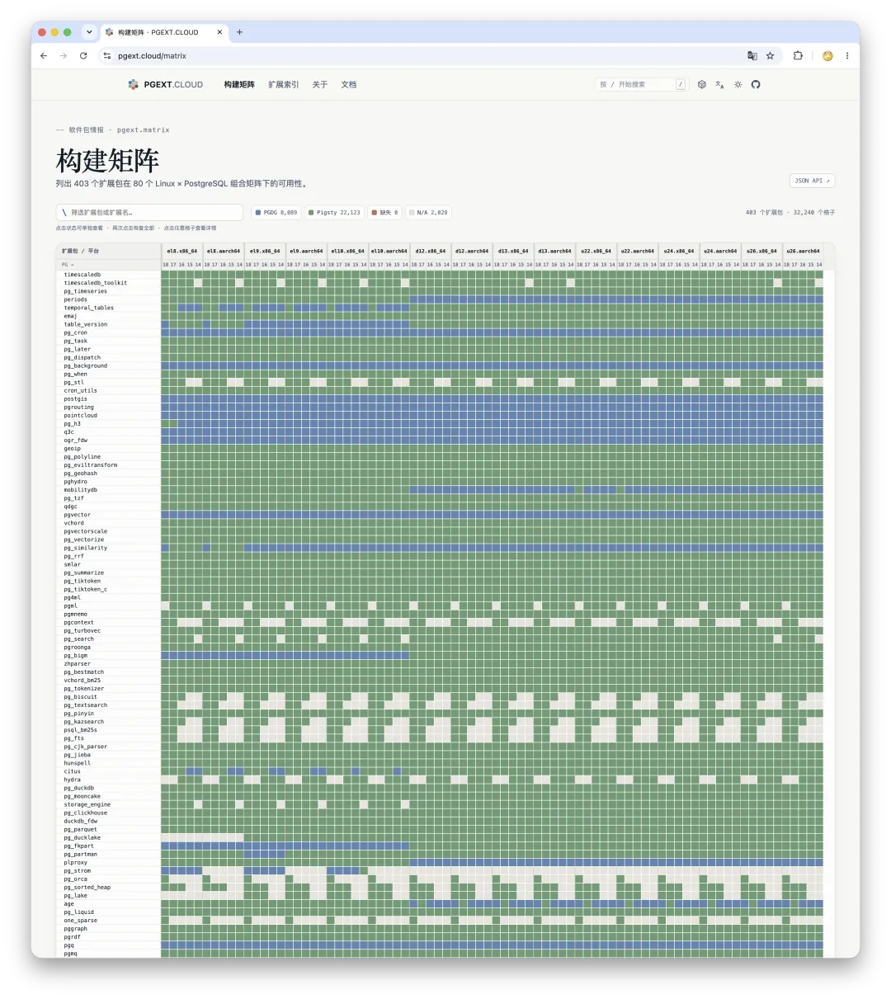](https://pgext.cloud/)

[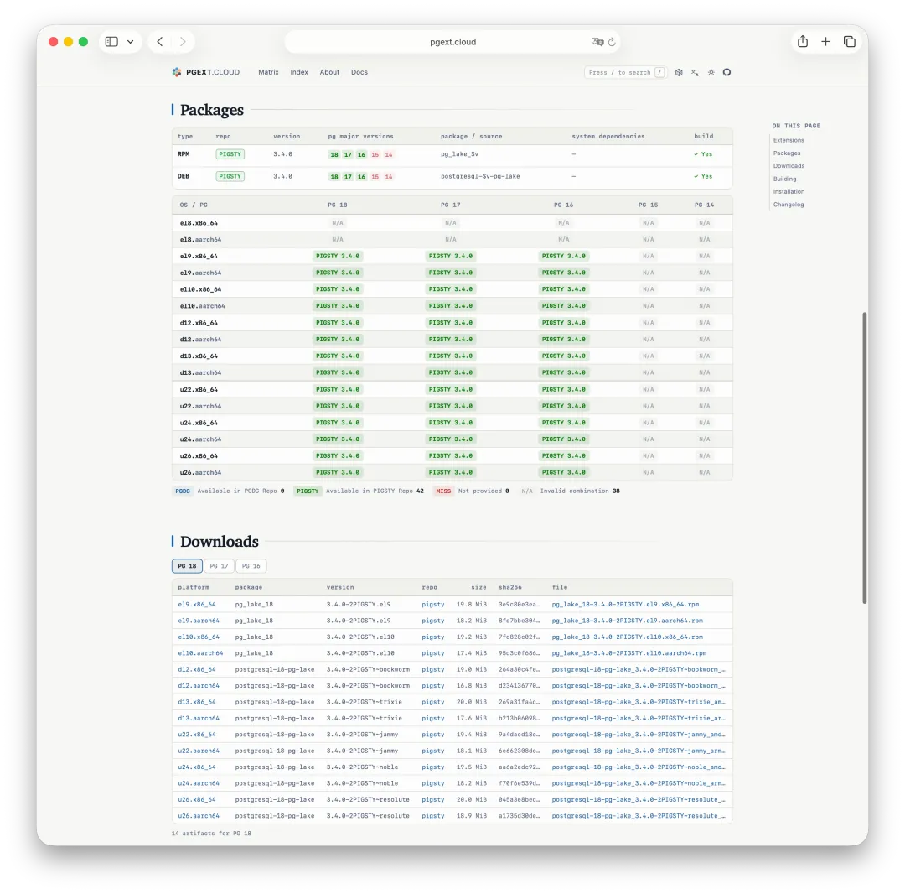](https://pgext.cloud/)

---

## Boar: Pigsty's Control Plane

Many users have long wanted a graphical management tool for Pigsty. I kept putting it off, mostly because I never had the time to build one.

With effectively unlimited tokens, it finally moved onto the schedule. Boar has not been formally released, but you can think of it as a combination of Grafana, ClusterControl, pgAdmin, and the useful parts of assorted consoles and control panels.

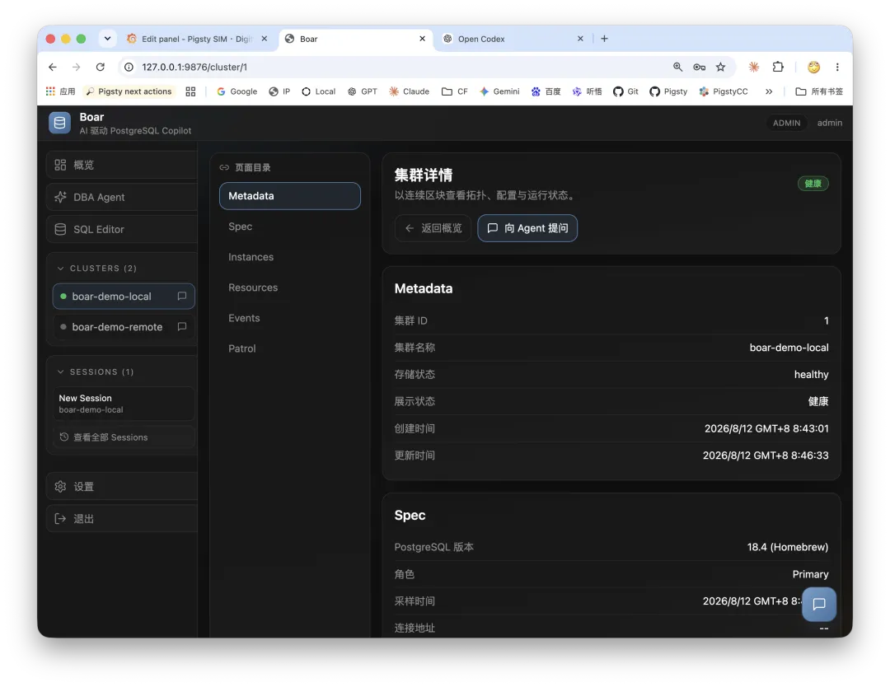

There is not much to say before release, so here is one small component inside it: the Pigsty digital twin ([live demo](https://pgsty.github.io/sim/) / [GitHub](https://github.com/pgsty/sim)).

[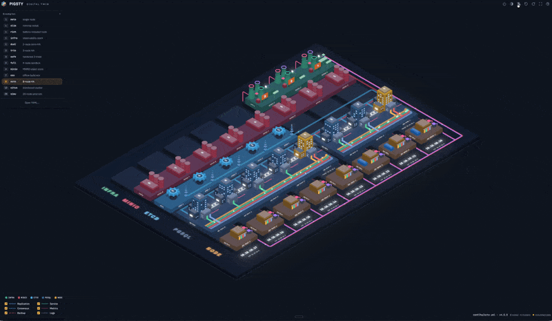](https://pgsty.github.io/sim/)

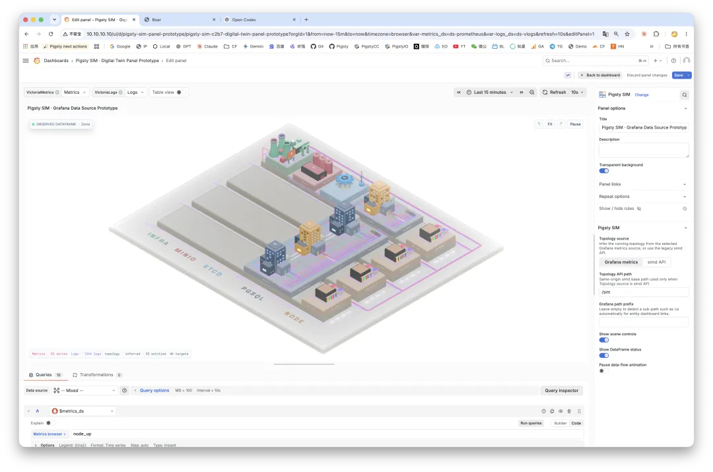

---

## SOW: The Repository Manager

The [SOW project site](https://sow.pgsty.com/) is live, and [I devoted an article to it yesterday](/en/db/sow/), so I will not repeat the whole story here. Its end goal is to rewrite APT, DNF, reprepro, createrepo_c, and aptly. That may sound like obscure plumbing to outsiders, but infrastructure people know what it means. Open source still has a real gap around cross-distribution enterprise package delivery and artifact repository management. Done well, SOW could become a standalone commercial service in the vein of PackageCloud or Copr.

Put simply, Pigsty needed an enterprise artifact repository, so I built one.

[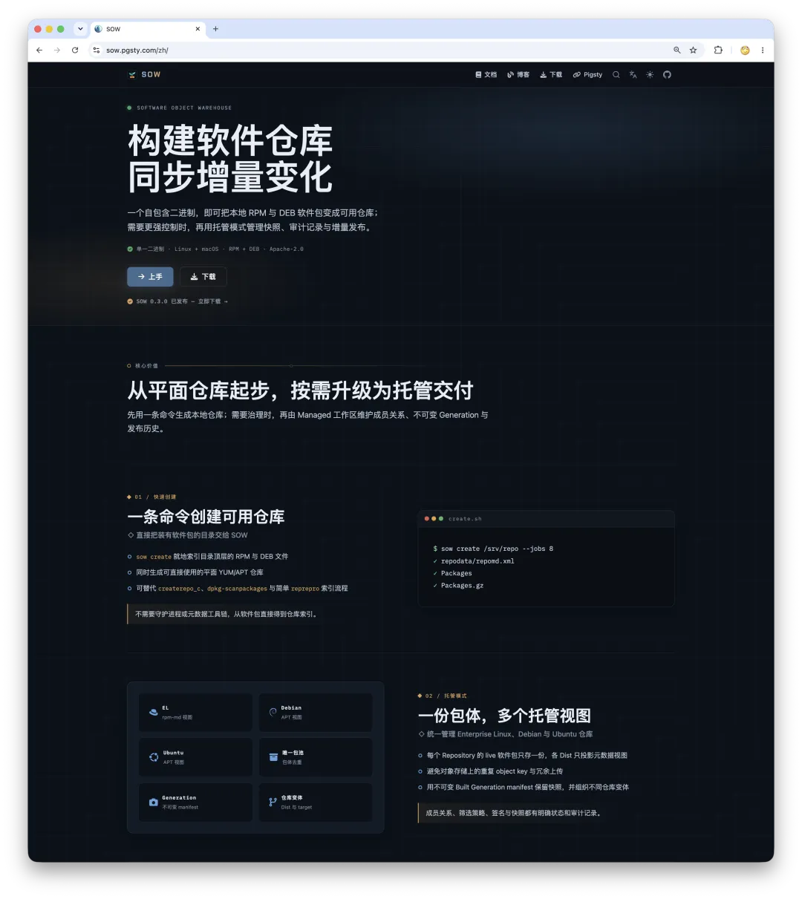](https://sow.pgsty.com/)

---

## OINK: The Documentation Theme

The [OINK project site](https://oink.pgsty.com/) is live. I introduced it a few days ago in [*OINK: After Six Years of Wrestling with Documentation Frameworks, Codex Finally Got Me Over the Line*](/en/db/oink-release/). OINK is a heavily customized derivative of Google's Docsy documentation framework. We suddenly had many new projects to release, each needing its own documentation. Rather than repeat the same work from scratch every time, I distilled it into a reusable framework. It combines the best parts of Docsy, Hextra, Nextra, and Fumadocs. Nearly all my sites have now moved to it.

[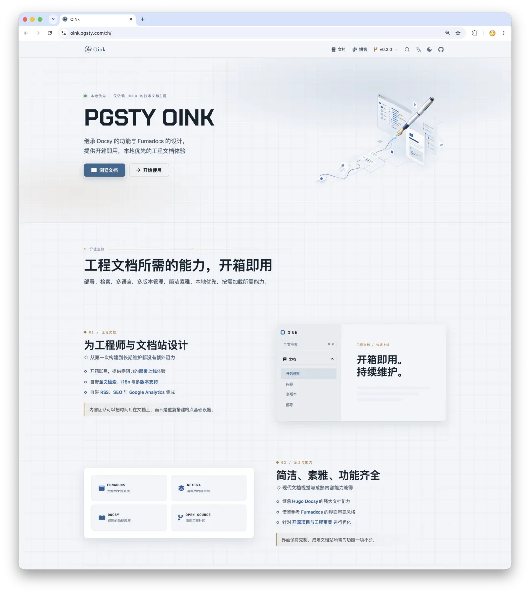](https://oink.pgsty.com/)

Here are the example sites:

- [pgsty.com](https://pgsty.com/), [pigsty.cc](https://pigsty.cc/), [pigsty.io](https://pigsty.io/)
- [silo.pgsty.com](https://silo.pgsty.com/), [oink.pgsty.com](https://oink.pgsty.com/)
- [sow.pgsty.com](https://sow.pgsty.com/), [pig.pgsty.com](https://pig.pgsty.com/), [exp.pgsty.com](https://exp.pgsty.com/)

---

## go-patroni

Rewriting PostgreSQL in Rust may be overkill, but rewriting an ecosystem component such as Patroni in Go has clear benefits. Still, it is easy to bite off too much at once. The rewrite is complete, but for now I have released only the client side as [go-patroni](https://github.com/pgsty/go-patroni).

Both the Boar control plane and the `pig` command-line tool need to talk to Patroni, so I open-sourced the shared foundation first. The [SDK](https://github.com/pgsty/go-patroni) also includes a complete `patronictl` implementation written in Go.

[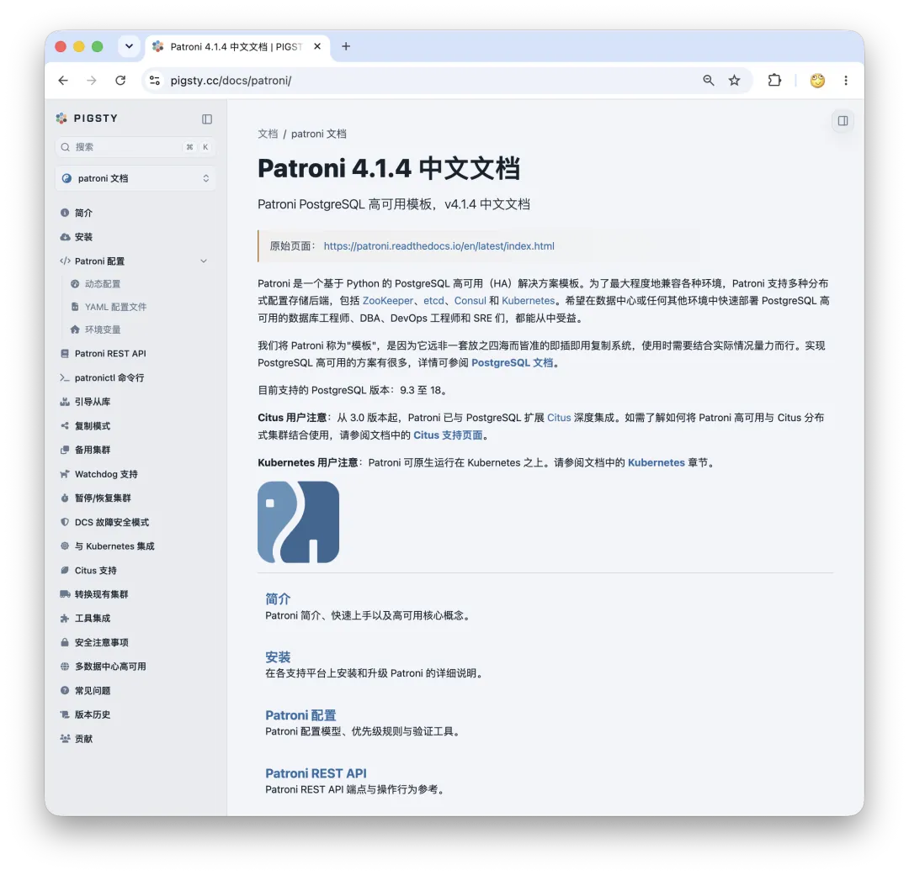](https://github.com/pgsty/go-patroni)

---

## snort

The PostgreSQL ecosystem has accumulated many components, each with its own monitoring tool, and the overall architecture has grown complicated. I kept asking whether one monitoring component could collect and process the metrics and logs from every PostgreSQL-related service, then send everything into the VictoriaMetrics stack. That is the goal of this round of work on [snort / PG Exporter](https://exp.pgsty.com/).

It now works and will probably land in Pigsty 5.0.

[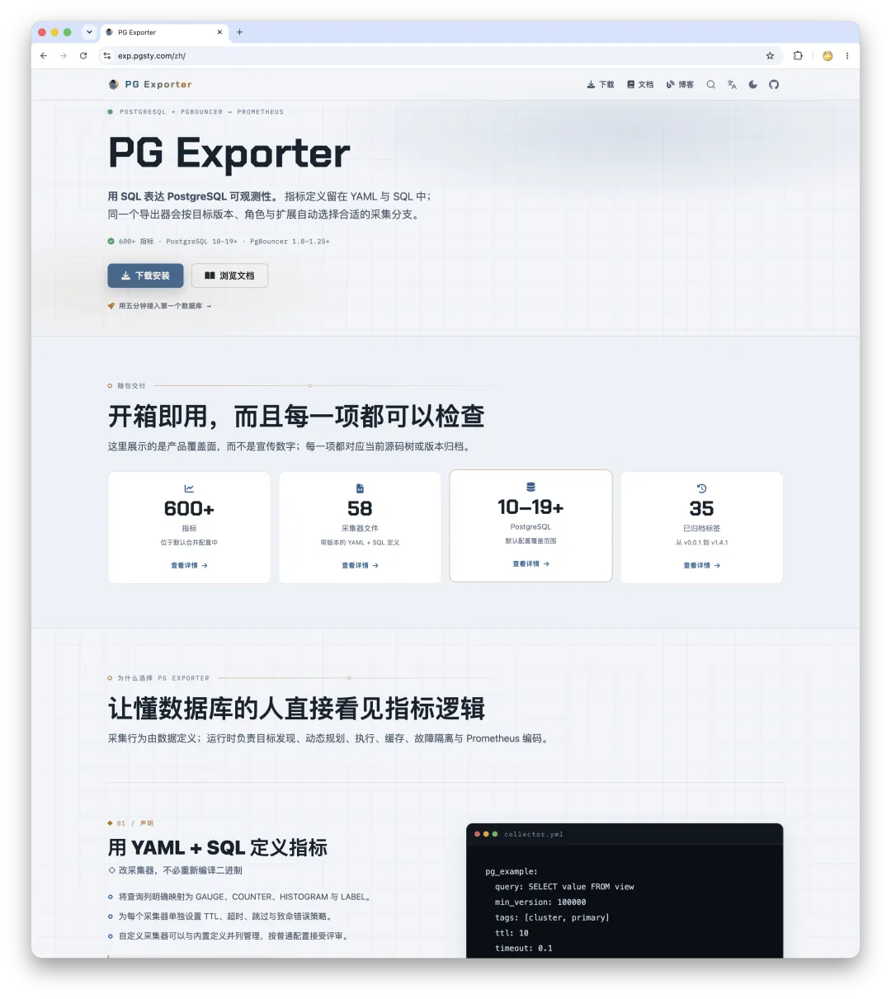](https://exp.pgsty.com/)

---

## CapsLock Enhancement

[CapsLock Enhancement](https://capslock.vonng.com/) is an open-source project I wrote more than a decade ago, now getting a second life. In short, it turns Caps Lock into a new modifier, giving you up to 16 entirely new control layers and putting almost every operation at your fingertips. This is not much of an exaggeration: the software, combined with a decade of muscle memory, makes me roughly ten times faster on a computer.

[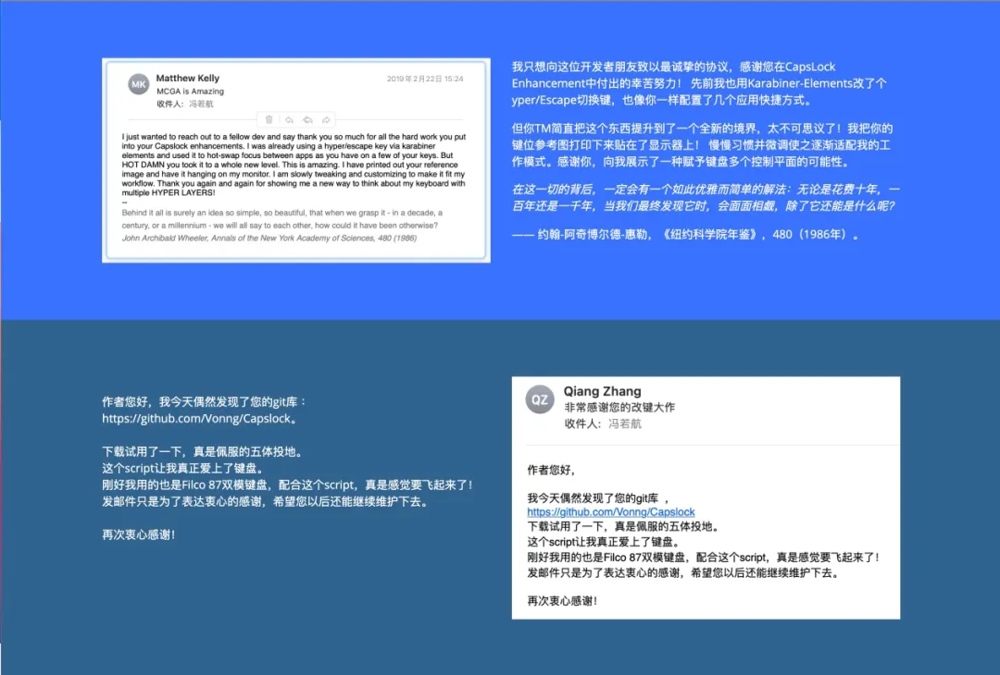](https://capslock.vonng.com/)

The decade-old version was simply a [Karabiner configuration](https://github.com/Vonng/Capslock). Plenty of people later borrowed the idea, and some even turned it into commercial software. I never cared enough to chase it. But now that I have tokens to spare, I do not mind building a native macOS app of my own. It is not formally released yet; I am still burning quota on it.

Think of it as Karabiner-style key remapping bundled with little conveniences such as keep-awake controls, window management, a clipboard, an app launcher, and an app switcher. It also solves my own annoyance with installing a grab bag of tiny utilities.

[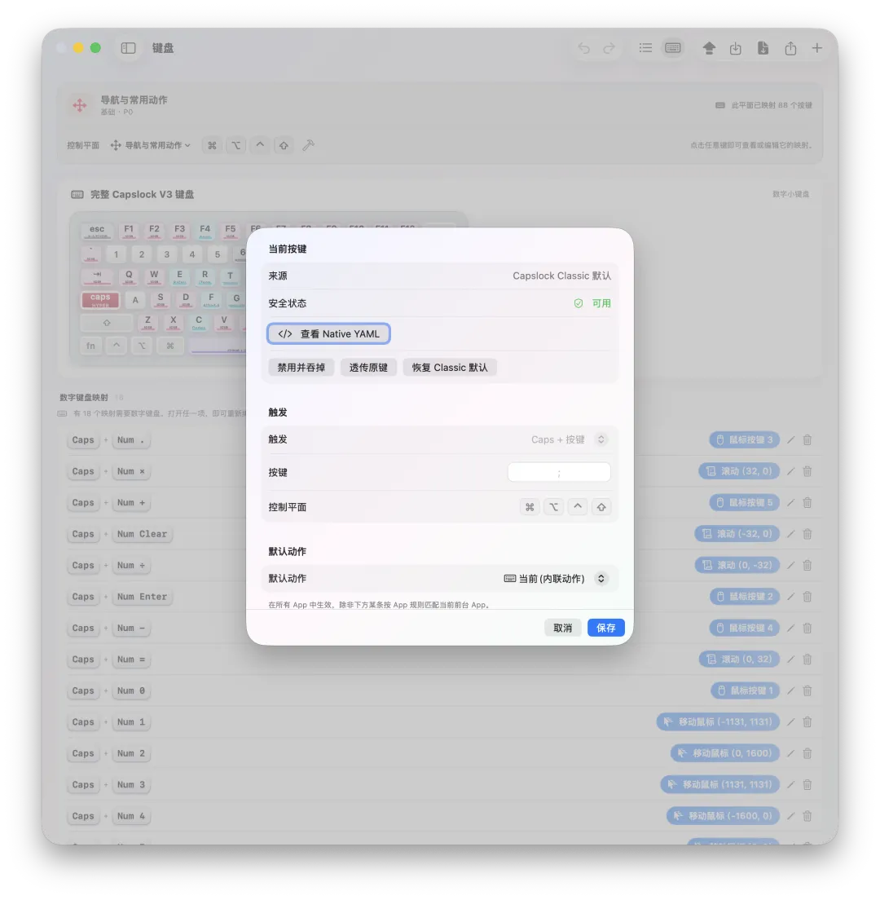](https://capslock.vonng.com/)

---

## AI Translation of DDIA v2

The second edition of *Designing Data-Intensive Applications* is out. Early this year, I translated it with 5.3; the result was readable, if unremarkable. I have now revised it with 5.6, SoMax, and Fable, matching the style of the first edition. I think this version is on par with a solid human translation, and [the new edition](https://ddia.vonng.com/) is now published.

[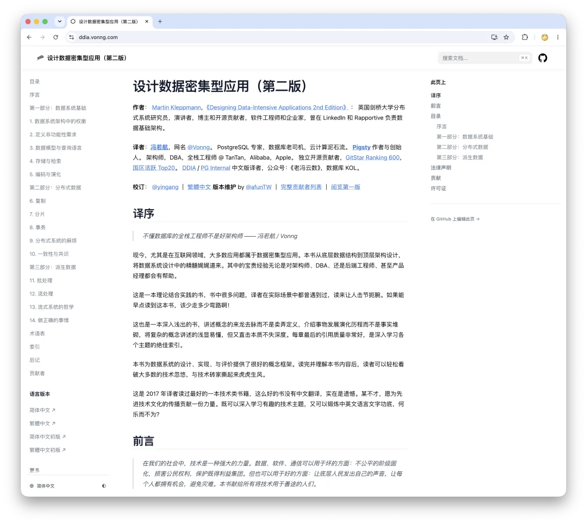](https://ddia.vonng.com/)

The translation business is well and truly dead. I no longer even bother counting how much documentation I have translated: the official PostgreSQL documentation, the PostgreSQL website, and Chinese documentation for more than 2,200 extensions. Whenever quota is about to expire and I cannot spend it all, I pick a project and translate its docs.

And if documentation is not enough, you can use the same quota to write a book. I had long meant to write [*The Thirty-Six Stratagems of PostgreSQL*](https://pg36g.vonng.com/) but never found the time, so I had AI produce a first draft. Since AI wrote it, I am not comfortable promoting or releasing it yet. I will publish it properly after human editing and review.

[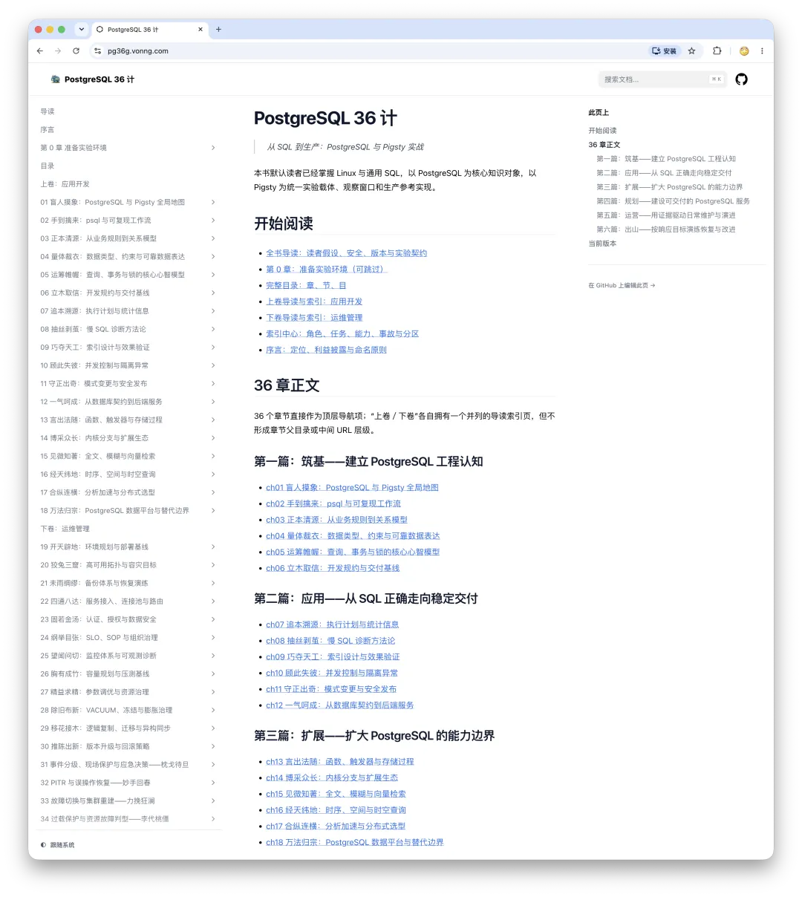](https://pg36g.vonng.com/)

---

## Takeaways

Those are some of the larger jobs from the past month. The bigger the job, the less impressive it can look from the outside. “Completed tens of thousands of missing builds across the PostgreSQL ecosystem” is one short sentence, but it implies QA for hundreds of thousands of artifacts.

The same goes for taking over a top-tier project such as MinIO. Rebranding alone means building an entire documentation site, redesigning and shipping the console, and running full QA. It is easy to summarize and a great deal of work to execute.

Yet for all my talk about pedaling until the bike smokes, I still have plenty of idle time. Seven subscriptions sound like a lot, but I burn through 1.5 to 2 subscriptions' worth of quota per day. With weekly resets, seven are not even enough; I have kept up only thanks to extra resets and banked quota. Most of those tokens go into large engineering jobs that run for one or two days, sometimes four or five. I spend two or three hours researching the problem and writing a solid product requirements document (PRD); after that, the agents need little from me.

Smaller jobs may run for twenty or thirty minutes before I need to review them. In between I can watch short-form dramas, read novels, or surf the web. I am honestly not that busy. If I were, I would never have bothered with CapsLock, a native macOS app, or project websites so far removed from my main business.

Of course, as a one-person company (OPC), I have plenty of other work: contracts, legal matters, sales follow-ups, consulting, support, and wrangling domains, VPS instances, websites, and repositories. I also run a WeChat Official Account and have to promote things on X and LinkedIn. There is always enough to fill the gaps.

That is why people have lately asked why my articles are starting to sound like AI. There is no mystery: I have too much to do and no time to write. I dictate the argument, let AI draft it, and often do not even have time for a final polish.

By the way, as this article went live, the WeChat Official Account reached 61,000 followers.

So if you ask whether an OPC—or even a one-person unicorn—is actually viable, I am a live example. I run a profitable one-person company around an enterprise PostgreSQL distribution. Any one contract easily pays for the AI subscriptions—and leaves enough work to run me into the ground. One person can direct a crew of agents, run a couple of Debian- or Nginx-class open-source projects, and still have room for side projects. I am very happy with this arrangement.

I am also relatively restrained: nearly everything I build relates to my main business or to a long-standing backlog. My friend Jiang is much more imaginative. He had Codex rewrite three databases in Rust and has now moved on to programming languages and operating systems. He burns tokens on things with no obvious use simply because it is fun. That deserves an article of its own next time.
