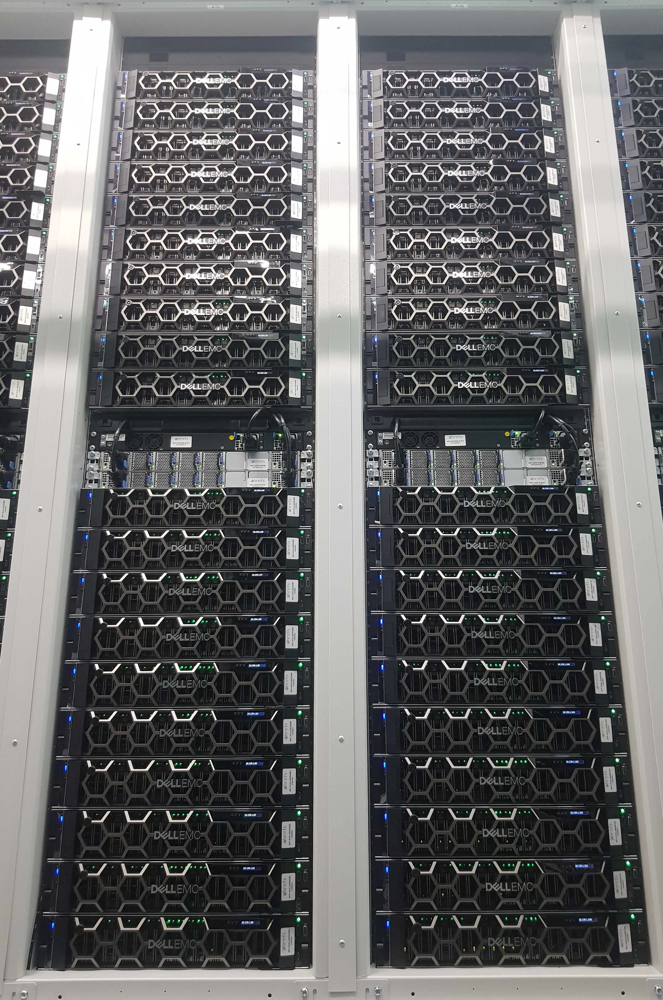

> Original: [How Ahrefs Saved US$400M in 3 Years by NOT Going to the Cloud](https://tech.ahrefs.com/how-ahrefs-saved-us-400m-in-3-years-by-not-going-to-the-cloud-8939dd930af8)

Cloud computing has been very popular in the IT infrastructure space recently, with going to the cloud becoming a trend. Infrastructure as a Service (IaaS) clouds do have many advantages: flexibility, agile deployment, easy scaling, instant availability in multiple regions worldwide, and so on.

Cloud service providers have become professional IT service outsourcing suppliers, offering convenient and easy-to-use services — through excellent marketing, conferences, certifications, and carefully selected use cases, they easily give the impression that cloud computing is the only reasonable choice for modern enterprise IT.

However, the cost of these outsourced cloud computing services can sometimes be ridiculously high — so high that we worry whether our business could still exist if our infrastructure were 100% dependent on cloud computing. This prompted us to make an actual comparison based on facts. Here are the results:

------

## Ahrefs' Own Hardware Overview

Ahrefs rents a colocation data center in Singapore — highly homogeneous standard infrastructure. We calculated all costs for this data center and allocated them to each server, then compared the costs with similar specifications in Amazon Web Services (AWS) cloud (we used AWS as the benchmark since it's the IaaS leader).

> Ahrefs servers

Our hardware is relatively new. The colocation contract began in mid-2020 — at the peak of the COVID-19 pandemic. All equipment was also newly purchased from that time. Our server configurations in this data center are basically consistent, with the only difference being two generations of CPUs but with the same number of cores. Each of our servers has a high core count, 2TB of memory, two 100G network interfaces, and for storage, an average of 16 × 15TB drives per server.

To calculate the monthly cost, we amortize all hardware to zero over five years, with continued use after five years considered a bonus. Therefore, the **startup costs** of this equipment are amortized over 60 months.

All **ongoing costs**, such as rent and electricity, are calculated at October 2022 prices. Although inflation would have an impact, including inflation here would be too complex, so we'll ignore the inflation factor.

Our colocation costs consist of two parts: **rent** and **actual electricity consumed**. Electricity prices have risen significantly since early 2022. We use the latest high electricity prices in our calculations rather than the average electricity price over the entire lease period, which gives AWS some advantage in the comparison.

Additionally, we pay for IP network transmission fees and dark fiber costs between the data center and our office (dark fiber: optical cables that have been laid but not put into use).

The table below shows our monthly expenses per server. Server hardware accounts for 2/3 of the overall monthly expenses, while data center rent and electricity (DC), Internet Service Provider (ISP) IP transmission fees, dark fiber (DF), and internal network hardware (Network HW) make up the remaining third.

| On-Premise Cost Item    | Monthly Cost ($) | Monthly Cost (¥) | Percentage |
|------------------------|------------------|------------------|------------|
| Server                 | $ 1,025          | ¥ 7,380          | 66%        |
| DC, ISP, DF, Network HW| $ 524            | ¥ 3,772.8        | 34%        |
| **On-Premise Total**   | **$ 1,550**      | **¥ 11,160**     | 100%       |

> Our on-premise hardware cost structure

------

## AWS Cost Structure

Since our colocation data center is in Singapore, we use AWS Asia Pacific (Singapore) region prices for comparison.

AWS's cost structure differs from colocation centers. Unfortunately, AWS doesn't provide EC2 server instances that match our server core count. Therefore, we found corresponding AWS instances with exactly half the CPU & memory, then compared the cost of one Ahrefs server with the cost of two such EC2 instances.

> Note: EC2 pricing is proportional to CPU and memory ratio, so this cost comparison is valid

We also considered long-term discounts, so we use the lowest EC2 instance price — three-year reserved, compared with our five-year amortized on-premise servers.

> Note: AWS EC2 three-year Reserved All Upfront provides the best discount

In addition to EC2 instances, we added Elastic Block Storage (EBS), which isn't a precise substitute for direct attached storage — as we use large capacity and fast NVMe drives in our servers. To simplify calculations, we chose the cheaper gp3 EBS (although these drives are much slower than ours). Its cost consists of two parts: storage size and IOPS fees.

> Note: EBS `gp3` latency is in the ms range, `io2` in the hundred microseconds range, local drives at 55/9µs

Since we keep two copies of data chunks on our servers, but only order usable space in EBS (which handles replication for us), we should consider the price of `gp3` storage size equal to half of our drives: (1TB + 16×15TB) / 2 ≈ 120TB per server.

We haven't included IOPS costs and have ignored various limitations of EBS gp3; for example, the maximum throughput per instance for gp3 cloud drives is **10GB/s**. A single PCIe Gen 4 NVMe drive performs at **6-7GB/s**, and we have 16 disks working in parallel, with much higher total throughput. Therefore, this is not a fair comparison on the same dimension. This comparison method significantly underestimates storage costs on AWS, further giving AWS an advantage in the comparison.

Regarding network traffic fees, unlike colocation facilities, AWS doesn't charge by bandwidth but by GB of egress traffic. Therefore, we roughly estimated the average egress traffic per server and calculated using AWS network billing methods.

Combining all three cost items, we get the cost distribution on AWS, as shown in the table below:

| AWS Cost Item      | Monthly Cost ($) | Monthly Cost (¥)    | Percentage |
|-------------------|------------------|---------------------|------------|
| EBS Cost          | $ 11,486         | ¥ 82,699.2          | 65%        |
| EC2 Cost          | $ 5,607          | ¥ 40,370.4          | 32%        |
| Data Transfer     | $ 464            | ¥ 3,340.8           | 3%         |
| **AWS Total**     | **$ 17,557**     | **¥ 126,410.4**     | 100%       |

> AWS cost structure

------

## On-Premise vs AWS Comparison

Combining the above two tables, it's easy to see that spending on AWS is much higher than imagined.

| On-Premise Cost Item    | Monthly $ | %    |      | AWS Cost Item   | Monthly $ | %    |
|------------------------|-----------|------|------|-----------------|-----------|------|
| Server                 | 1,025     | 66%  |      | EBS Cost        | 11,486    | 65%  |
| DC, ISP, DF, Network HW| 524       | 34%  |      | EC2 Cost        | 5,607     | 32%  |
|                        |           |      |      | Data Transfer   | 464       | 3%   |
| **On-Premise Total**   | **1,550** | 100% |      | **AWS Total**   | **17,557**| 100% |

> Our on-premise costs vs AWS EC2 monthly costs: One AWS server costs roughly equals 11.3 Ahrefs on-premise servers

The cost of a replacement EC2 instance with similar available SSD space on AWS is roughly equivalent to the cost of **11.3** servers in our colocation data center. Correspondingly, if we went to the cloud, our rack of 20 servers would only have about 2 servers left!

> The cost of 20 Ahrefs servers equals 2 AWS servers

When we calculate using the 850 servers we've actually used in our on-premise data center for two and a half years, the total cost figures show an extremely striking difference!

| On-Premise Servers    | Monthly Cost $  |        | AWS EC2 Instances | Monthly Cost $        |
|----------------------|-----------------|--------|-------------------|--------------------|
| 850 servers monthly  | 1,317,301       |        | 850 servers monthly| 14,923,154         |
| 30-month total       | 39,519,025      |        | 30-month total    | 447,694,623        |
|                      |                 |        |                   |                    |
|                      |                 |        | AWS - On-Premise  | **$ 408,175,598**  |

> Cost of 850 servers for 30 months: AWS vs On-Premise

Assuming we ran 850 servers during our actual 2.5 years of data center usage. After calculation, we can see a significant difference.

If we had chosen to use AWS in Singapore region in 2020 instead of building our own, we would have had to pay AWS **over $400 million** — an astronomical figure — just to get our infrastructure running!

Some might wonder, "Maybe Ahrefs can afford it?"

Indeed, Ahrefs is a profitable and self-sustaining company, so let's look at its revenue and do the math. Although we're a private company and don't have to disclose our financial data, some information about Ahrefs' revenue can be found in The Straits Times articles about Singapore's fastest-growing companies in [2022](https://www.straitstimes.com/fastest-growing-companies-2022) and [2023](https://www.straitstimes.com/fastest-growing-companies-2023). These articles provide Ahrefs' revenue data for 2020 and 2021.

We can also linearly extrapolate revenue for 2022. This is a rough estimate, but sufficient for us to draw some conclusions.

| Year | Type        | Revenue, SGD      | SGD/USD | Revenue, USD      |
|------|-------------|------------------|---------|------------------|
| 2020 | Actual      | SGD 86,741,880   | 0.7253  | USD 62,913,886   |
| 2021 | Actual      | SGD 115,335,291  | 0.7442  | USD 85,832,524   |
| 2022 | Extrapolated| ???              | 0.7265  | USD 108,751,162  |
|      |             |                  | Total   | USD 257,497,571  |

> Ahrefs 2020-2022 revenue estimate

From the table above, we can see that Ahrefs' **total revenue** over the past three years was approximately $257 million. But we also calculated that replacing **just one** on-premise data center with AWS would cost about $448 million. Therefore, the company's revenue wouldn't even cover the AWS usage costs for these 2.5 years.

This is a shocking result!

But where would our profits go?

As Dr. LJ Hart-Smith of Boeing stated in this [20-year-old report](https://www.documentcloud.org/documents/69746-hart-smith-on-outsourcing.html): "If the OEM or prime contractor cannot make a profit by outsourcing work, then who benefits? The subcontractor, of course."

Keep in mind that we've already given AWS every advantage in our calculations — using above-average electricity prices for on-premise data centers, calculating EBS storage prices for space only without IOPS, and ignoring that EBS is actually extremely slow. Moreover, this data center isn't our only cost center. We also have expenses for other data centers, servers, services, personnel, offices, and marketing activities.

Therefore, if our main infrastructure were on the cloud, Ahrefs could barely survive.

**Other Considerations**

This article doesn't consider other aspects that would make the comparison more complex. These aspects include personnel skills, financial control, cash flow, capacity planning based on load types, etc.

------

## Conclusion

Ahrefs saved approximately $400 million because our infrastructure wasn't 100% cloud-based over the past two and a half years. This figure is still growing because we've now set up another large colocation data center with new hardware in a new location.

Ahrefs leverages AWS's advantages to host our frontend around the world, but the vast majority of Ahrefs' infrastructure is hidden on our own hardware in colocation data centers. If our product completely relied on AWS, Ahrefs wouldn't be profitable or even able to exist.

If we adopted a cloud-only approach, our infrastructure costs would be more than 10 times higher. But because we didn't do this, we can use the saved funds for actual product improvements and development. This also brings faster and better results — because (considering cloud limitations), our servers are faster than what cloud computing can provide. Our reports generate faster and more comprehensively because each report takes less time.

Based on this, I recommend that CFOs, CEOs, and business owners interested in sustainable growth carefully consider and regularly re-evaluate the advantages and actual costs of cloud computing. While cloud computing is a natural choice for early-stage startups, or 100% so. But as the company and its infrastructure grow, complete reliance on cloud computing may put the company in a difficult position.

**And here's the dilemma:**

**Once you're in the cloud, leaving is complicated**. Cloud computing is convenient but brings vendor lock-in. And abandoning cloud infrastructure just because of higher costs may not be what engineering teams want. They might correctly think — cloud computing is easier and more flexible than traditional brick-and-mortar data centers and physical server environments.

For companies at more mature stages, [migrating from cloud to own infrastructure is difficult](https://world.hey.com/dhh/we-stand-to-save-7m-over-five-years-from-our-Cloud-Exit-53996caa). Keeping the company alive during migration is also a challenge. But this painful transition could be key to saving the company, as it can avoid paying an ever-increasing portion of revenue to cloud vendors.

Large companies, especially FAANG, have absorbed a lot of talent over the years. They've been hiring engineers to operate their massive data centers and infrastructure, leaving few opportunities for smaller companies. But the recent months of mass layoffs at big tech companies have brought opportunities to re-evaluate cloud computing — it's definitely worth considering hiring senior professionals in the data center field and migrating from the cloud.

If you're starting a new company, consider this approach: buy a rack and servers, put them in your basement. Maybe this can improve your company's sustainability from day one.

------

## Cloud-Exit Commentary by Feng

I'm delighted to see another major customer who can no longer tolerate the sky-high cloud rental prices stand up and launch a complaint against cloud vendors. Ahrefs' experience aligns with ours — the comprehensive cost of ownership for cloud servers is about 10 times that of on-premise infrastructure — even considering the best Saving Plans and deep discounts. DHH from 37 Signals provides [**another more representative cloud exit case**](/cloud/odyssey/).

In Ahrefs' cost accounting, we can easily see the structural differences in costs — on-premise storage costs are half of server costs, while cloud storage costs are double the server costs — I have an article specifically discussing this issue — [**Is Cloud Storage a Rip-off**](/cloud/ebs)?

In several key examples, cloud costs are extremely high — whether it's [**large physical database machines**](/cloud/rds), [**large NVMe storage**](/cloud/ebs), or just [**the latest and fastest computing power**](/cloud/ecs). In these use cases, cloud customers have to endure the humiliation of ridiculously high pricing — the money spent renting production team's donkeys is so high that a few months or even weeks of rent can equal the price of buying it outright. In this case, you should just buy the donkey directly instead of paying rent to cyber landlords!