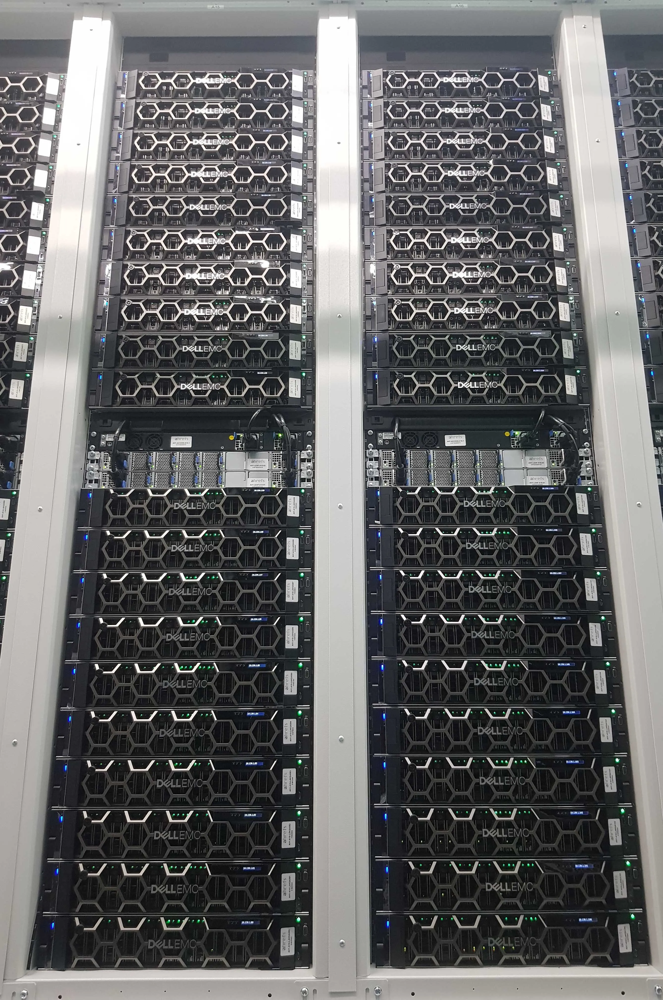
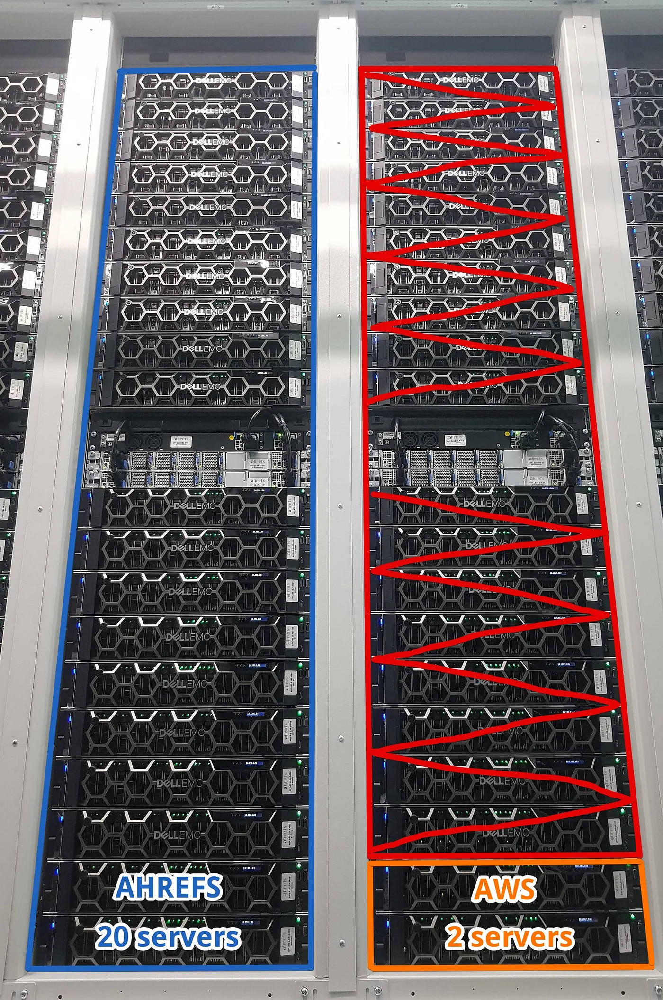

> 原文：[How Ahrefs Saved US$400M in 3 Years by NOT Going to the Cloud](https://tech.ahrefs.com/how-ahrefs-saved-us-400m-in-3-years-by-not-going-to-the-cloud-8939dd930af8)

最近云计算在 IT 基础设施领域非常流行，上云成为一种趋势。基础设施即服务云（IaaS）确实有很多优点：灵活、部署敏捷、伸缩简便、在全球多地区都能即时上线，等等等等。

云服务提供商已经成为专业的 IT 服务外包供应商，提供便捷且易用的服务 —— 通过出色的营销、会议、认证和精心挑选的使用案例，他们很容易让人以为，云计算是现代企业 IT 的唯一合理选择。

但是，这些外包云计算服务的成本，有时高到离谱，高到我们担心如果基础设施 100% 依赖云计算，我们的业务是否还能存在。这促使我们基于事实，进行实际的比较。以下是比较结果：

------

## Ahrefs 自有硬件概览

Ahrefs 在新加坡租用了一个托管数据中心 —— 高度同质化的标准基础设施。我们核算了这个数据中心的所有成本，并分摊到每台服务器上，然后与 Amazon Web Services (AWS) 云中进行类似的规格进行了成本对比（因为 AWS 是 IaaS 领导者，所以我们将其用作对比的标杆）

> Ahrefs 服务器

我们的硬件相对较新。托管合同始于 2020 年中 —— 即 COVID-19 疫情高峰期。所有设备也都是从那时候起新买的。我们在该数据中心的服务器配置基本都是一致的，唯一的区别是 CPU 有两种代际，但核数相同。我们每台服务器都有很高的核数，2TB 内存和两个 100G 网口，硬盘的话，平均每台服务器有16块 15TB 的硬盘。

为了计算每月成本，我们把所有硬件按五年摊销归零核算，超过五年后继续用算白赚。因此这些设备的 **启动成本**，会摊销到 60 个月中进行核算。

所有的 **持续性成本**，例如租金和电费，均以 2022 年 10 月的价格计算。尽管通货膨胀也会有影响，但这里把通胀算上就太复杂了，所以我们先忽略通胀因素。

我们的托管费用由两部分组成：**租金**，以及 **实际消耗的电费**。自 2022 年初以来，电价大幅上涨。我们计算的时候使用的是最新的高电价，而不是整个租赁周期的的平均电价，这样计算上会让 AWS 占些便宜。

此外，我们还要支付 IP 网络传输费用，和数据中心与我们驻地之间的暗光纤费用（暗光纤：已经铺设但是没有投入使用的光缆）。

下表显示了我们每台服务器的月度支出。服务器硬件占整体月度支出的 2/3，而数据中心租金和电费 (DC)、互联网服务提供商 (ISP) 的 IP 传输费用、暗光纤 (DF) 和内部网络硬件 (Network HW) 构成了剩余的三分之一。

| 自建成本项            | 每月成本（美元）    | 每月成本（人民币）    | 百分比  |
|------------------|-------------|--------------|------|
| 服务器              | $ 1,025     | ¥ 7,380      | 66%  |
| 数据中心、ISP、DF、网络硬件 | $ 524       | ¥ 3,772.8    | 34%  |
| **自建总成本**        | **$ 1,550** | **¥ 11,160** | 100% |

> 我们的自有本地硬件成本结构

------

## AWS 成本结构

由于我们托管的数据中心位于新加坡，所以我们使用 AWS 亚太地区（新加坡）区域的价格进行对比。

AWS 的成本结构与托管中心不同。不幸的是，AWS 没有提供与我们服务器核数相匹配的 EC2 服务器实例。因此，我们找到了CPU & 内存正好是一半的相应 AWS 实例，然后将一台 Ahrefs 服务器的成本，与两台这种 EC2 实例的成本进行对比。

> 译注：EC2 定价正比与核数与内存配比，这样成本对比没有问题

此外我们考虑了长期折扣，因此我们使用 EC2 实例的最低价格 —— 三年预留，与五年摊销的本地自建服务器进行对比。

> 译注：AWS EC2 三年 Reserved All Upfront 即提供最好的折扣

除了 EC2 实例外，我们还添加了弹性块存储 (EBS) ，它并不是直接附加存储的精准替代品 —— 因为我们在服务器中使用的是大容量且快速的 NVMe 盘。为了简化计算，我们选择了更便宜的 gp3 EBS（尽管这种盘速度比我们的慢很多）。其成本由两部分组成：存储大小和 IOPS 费用。

> 译注：EBS `gp3` 延迟在 ms 量级，`io2` 在百微秒量级，本地盘在 55/9µs 量级

We keep two copies of a data chunk on our servers. But we only order usable space in EBS that takes care of the replication for us. So we should consider the price of the *gp3* storage size equal to the size of our drives divided by 2: (1*1TB + 16*15TB)/2 ≈ 120TB per server.

因为我们自己用磁盘的时候会复制一份，但是买 EBS 的时候只买实际存储空间，EBS 替你处理数据复制。
所以在成本对比时，我们购买的 `gp3` 存储大小是本地磁盘的一半：(1TB + 15TB 16块) / 2 ≈ 每台服务器 120TB。

我们还没有把 IOPS 的成本算进来，也忽略了 EBS gp3 的各种限制；例如，gp3 云盘的最大吞吐量/实例为 **10GB/s**。而单个 PCIe Gen 4 NVMe 驱动器的性能为 **6-7GB/s**，而我们有 16 个并行工作的磁盘，总吞吐要大的多。因此，这完全不是一个维度上的公平比较。这种比较方法显著低估了 AWS 上的存储成本，并进一步让 AWS 在比较中占尽便宜。

关于网络流量费用，AWS 与托管机房不同，AWS 不是按照带宽来计费的，而是按每GB下行流量来收费。因此，我们大致估算了每台服务器的平均下行流量，然后使用 AWS 网络计费方法进行估算。

将所有三项成本组合起来，我们得到了 AWS 上的的成本分布，如下表所示

| AWS 成本项     | 每月成本（美元）     | 每月成本（人民币）       | 百分比  |
|-------------|--------------|-----------------|------|
| EBS 成本      | $ 11,486     | ¥ 82,699.2      | 65%  |
| EC2 成本      | $ 5,607      | ¥ 40,370.4      | 32%  |
| 数据传输        | $ 464        | ¥ 3,340.8       | 3%   |
| **AWS 总成本** | **$ 17,557** | **¥ 126,410.4** | 100% |

> AWS成本结构

------

## 自建与AWS对比

综合以上两个表格不难看出，AWS 上的支出比想象中要高得多。

| 自建成本项          | 月成本 \$    | 占比   |      | AWS 成本项目 | 月消 \$  | 占比   |
|----------------|-----------|------|------|----------|--------|------|
| 服务器            | 1,025     | 66%  |      | EBS 成本   | 11,486 | 65%  |
| DC、ISP、DF、网络硬件 | 524       | 34%  |      | EC2 成本   | 5,607  | 32%  |
|                |           |      |      | 数据传输     | 464    | 3%   |
| **本地总成本**      | **1,550** | 100% |      | AWS 总成本  | 17,557 | 100% |

> 我们的自建成本与 AWS EC2 月消费对比：一台 AWS 服务器成本粗略等于 11.3 台 Ahrefs 自建服务器

在 AWS 上一台具有相似可用 SSD 空间的替代 EC2 实例的成本，大致相当于托管数据中心中 **11.3** 台服务器的成本。相应来说，如果上了云，我们这 20 台服务器的机架就只能剩下大约 2 台服务器了！

> 20 台 Ahrefs 服务器的成本与 2 台 AWS 服务器相当

那么用我们在自建数据中心里实际使用了两年半的这 850 台服务器来计算，算出总成本数字后，不难看到极其惊人的差异！

| 自建本地服务器     | 每月成本 \$    |        | AWS EC2 实例   | 每月成本 \$           |
|-------------|------------|--------|--------------|-------------------|
| 850台服务器每月成本 | 1,317,301  |        | 850台服务器每月成本  | 14,923,154        |
| 30个月总成本     | 39,519,025 |        | 30个月总成本      | 447,694,623       |
|             |            |        |              |                   |
|             |            |        | AWS成本 - 自建成本 | **$ 408,175,598** |

> 850 台服务器用30个月的成本：AWS vs 自建

假设我们在实际的 2.5 年数据中心使用期间运行 850 台服务器。计算后可以看到显著的差异。

如果我们选择在 2020 年使用新加坡区域的 AWS，而不是自建，那我们需要向 AWS 支付 **超过 4 亿美元** 这样一笔天文数字 ，才能让自己的基础设施跑起来！

有人可能会想，“或许 Ahrefs 能付得起？”

确实，Ahrefs 是一家盈利且自给自足可持续的公司，所以让我们来看一下它的营收，并算一算。尽管我们是一家私有公司，不必公布我们的财务数据。但在《海峡时报》关于 [2022](https://www.straitstimes.com/fastest-growing-companies-2022) 年和 [2023](https://www.straitstimes.com/fastest-growing-companies-2023) 年新加坡增长最快的公司的文章中可以找到一些 Ahrefs 的收入信息。这些文章提供了 Ahrefs 在 2020 年和 2021 年的收入数据。

我们还可以线性外推出 2022 年的收入。这是一个粗略估计，但足以让我们得出一些结论了。

| 年份   | 类型 | 收入, 新币          | SGD/USD | 收入, 美元          |
|------|----|-----------------|---------|-----------------|
| 2020 | 实际 | SGD 86,741,880  | 0.7253  | USD 62,913,886  |
| 2021 | 实际 | SGD 115,335,291 | 0.7442  | USD 85,832,524  |
| 2022 | 外推 | ???             | 0.7265  | USD 108,751,162 |
|      |    |                 | 总计      | USD 257,497,571 |

> Ahrefs 2020 - 2022 营收估计

从上表可以看出，Ahrefs 在过去三年的**总收入**约为 2.57 亿美元。但我们也计算出，如果将**这样一个**自建数据中心替换为 AWS，成本约为 4.48 亿美元。因此，公司收入甚至无法覆盖这 2.5 年的 AWS 使用成本。

这是一个令人震惊的结果！

但是我们的利润会去哪儿呢？

正如波音公司 Dr. LJ Hart-Smith 在这份 [已有 20 年历史的报告](https://www.documentcloud.org/documents/69746-hart-smith-on-outsourcing.html)中所述：“如果原厂或总包商无法通过将工作外包来获利，那么谁会受益呢？当然是分包商。”

需要记住的是，我们已经在计算时让 AWS 占尽便宜了 —— 自建数据中心算电费时使用高于平均水平的电价，算EBS 云盘存储价格时只算了空间部分没算 IOPS，并无视了 EBS 其实非常拉垮的慢。而且，这个数据中心并不是我们唯一的成本中心。我们在其他数据中心、服务器、服务、人员、办公室、营销活动上也有支出。

因此，如果我们主要的基础设施放在云上，Ahrefs 几乎无法生存。

**其他考虑因素**

这篇文章没有考虑其他使比较更加复杂的方面。这些方面包括人员技能、财务控制、现金流、根据负载类型进行的容量规划等。

------

## 结论

Ahrefs 省下了约 4 亿美元，因为在过去的两年半中，基础设施没有 100% 上云。这个数字还在增加，因为目前我们又在一个新地方，用新硬件搞了另一个大型托管数据中心。

Ahrefs 利用 AWS 的优势，在世界各地托管我们的前端，但 Ahrefs 基础设施的绝大部分，隐藏在托管数据中心的自有硬件上。如果我们的产品完全依赖 AWS，Ahrefs 将无法盈利，甚至无法存在。

如果我们采用只用云的方式，我们的基础设施成本将高出 10 倍以上。但正因为我们没有这样做，我们可以将节省下来的资金，用于实际的产品改进和开发。而且也带来了更快、更好的结果 —— 因为（考虑到云上的限制），我们的服务器比云计算能提供的速度更快。我们的报表也生成得更快且更全面，因为每份报告所需的时间更短。

基于此，我建议那些对可持续增长感兴趣的 CFO、CEO 和企业主们，仔细考虑并定期重新评估云计算的优势与实际成本。虽然云计算是早期创业公司的自然选择，或者说 100% 吧。但随着公司及其基础设施的增长，完全依赖云计算可能会使公司陷入困境。

**而这里就出现了两难：**

**一旦上了云，想要离开是很复杂的**。云计算很方便，但会带来供应商锁定。而且，仅仅是出于更高的成本而放弃云计算基础设施，可能并不是工程团队想要的。他们可能会正确地认为 —— 云计算比传统的砖瓦数据中心和物理服务器环境更容易、更灵活。

对于更成熟阶段的公司，[下云迁移到自有基础设施是困难的](https://world.hey.com/dhh/we-stand-to-save-7m-over-five-years-from-our-cloud-exit-53996caa)。在迁移过程中保持公司生存也是一个挑战。但这种痛苦的转变可能是拯救公司的关键，因为它可以避免将收入越来越多的一部分不断支付给云厂商。

大公司，尤其是 FAANG 多年来吸走了大量人才。他们一直在招聘工程师来运营他们庞大的数据中心和基础设施，给小公司留下的机会很少。但最近几个月大科技公司的大规模裁员，带来了重新评估云计算的机会 —— 确实可以考虑一下招聘数据中心领域资深专业人士，并从云上搬迁下来。

如果你要创办一家新公司，考虑一下这种方案：买个机架和服务器，把它们放在你家的地下室。也许这样能从第一天起就提高你们公司的可持续性。

------

## 下云老冯评论

很高兴又看到一个难以忍受天价云租金的大客户站出来，发起对云厂商的控诉。 Ahrefs 的经验与我们一致 —— 云上服务器的综合持有成本在是本地自建的 10 倍左右 —— 即使考虑了最好的 Saving Plan 与深度折扣。37 Signal 的 DHH 则提供了[**另一个更有代表性的下云案例**](/cloud/odyssey/)。

同时在 Ahrefs 成本核算中我们不难看出成本的结构化差异 —— 自建的存储成本是服务器成本的一半，而云上的存储成本却是服务器成本的一倍 —— 我有一篇文章专门聊过这个问题 —— [**云盘是不是杀猪盘**](/cloud/ebs)？

在几个关键例子上，云的成本都极其高昂 —— 无论是[**大型物理机数据库**](/cloud/rds)、[**大型 NVMe 存储**](/cloud/ebs)，或者只是[**最新最快的算力**](/cloud/ecs)。在这些用例上，云上的客户不得不忍受高昂到荒诞的定价带来的羞辱 —— 租生产队的驴所花的钱是如此高昂，以至于几个月甚至几周的租金就能与直接购买它的价格持平。在这种情况下，你应该直接直接把这头驴买下来，而不是给赛博领主交租！

