My cousin messaged me today: she had been scammed on Xianyu, Alibaba's secondhand marketplace, while trying to buy a Switch 2. She lost RMB 2,300. My first instinct was to laugh. Your mother is a police detective—so much for anti-scam education at home. How did you still fall for one? Counterfeit goods? An off-platform payment? Let me see what happened.

Then I stopped laughing. I scanned the QR code with Xianyu and walked through the trap myself. Had I not known in advance that it was a phishing page, I probably would have fallen for it too. Even the officer handling the case tried it and admitted that, had he not been told it was a scam, he would have fallen for it too.

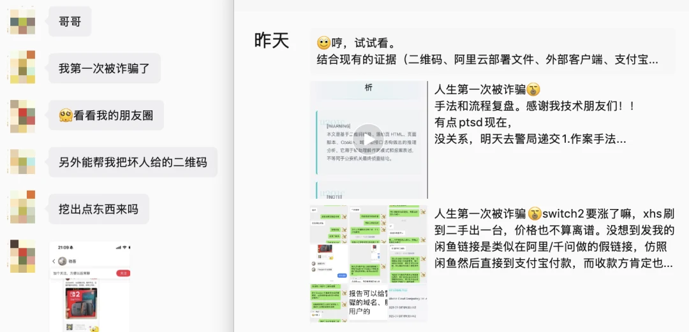

In short: it was a QR code presented as a Xianyu listing-share card. Scan it with Xianyu, and it opens Taobao, Alibaba's main shopping app; Taobao then opens Ant Group's Alipay wallet; Alipay's embedded browser loads a page impersonating Xianyu; and Alipay smoothly "completes a Xianyu transaction."
The entire journey stays inside apps from the broader Alibaba ecosystem—Xianyu, Taobao, and Alipay. Every domain shown along the way is a legitimate Alibaba-affiliated domain. There is never an external-link warning. **The phishing version of Xianyu appears seamlessly inside the Alipay app.**

My working theory is that the phishing site used a CDN domain belonging to Qianwen, Alibaba's official Qwen AI assistant, as cover. It exploited Alipay's whitelist trust in affiliated domains to slip past Alipay's own security checks.

Alibaba has spent years talking about one favorite word: "**empowerment**." Empower merchants, empower industries, empower every line of business.
This time, its full suite of official apps "**empowered**" a fraud ring. My cousin's RMB 2,300, along with money from other victims, traveled down a trust path paved by Xianyu, Taobao, Alipay, and Qianwen—and landed safely in the scammers' hands.

I doubt the money will ever come back. But publishing the case may at least keep others from falling into the same trap. It may also push the platforms to confront a fact: fraud rings are borrowing their identities, infrastructure, and trust relationships to do harm.

--------

## How It Happened

The story is simple. My cousin saw someone offering a used Switch 2 on RedNote (Xiaohongshu), a Chinese lifestyle and social-shopping platform. After they agreed on the deal, the seller sent her a QR code that looked like a shared Xianyu listing.

She had done some homework. She searched for the seller on Xianyu, found what appeared to be the relevant account, and saw an "**Excellent**" credit rating. That lowered her guard, so she scanned the code with the Xianyu app.

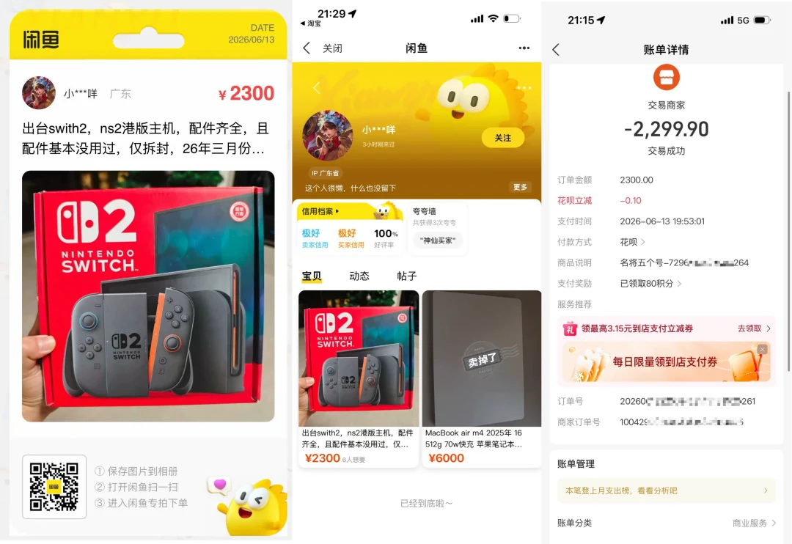

After Xianyu scanned it, the page passed through a Taobao short link and app-launch redirect, invoked an Alipay route, and finally landed on a highly convincing fake "Xianyu" page inside Alipay. The whole flow was polished, and none of the usual "not an Alipay link" warnings appeared.

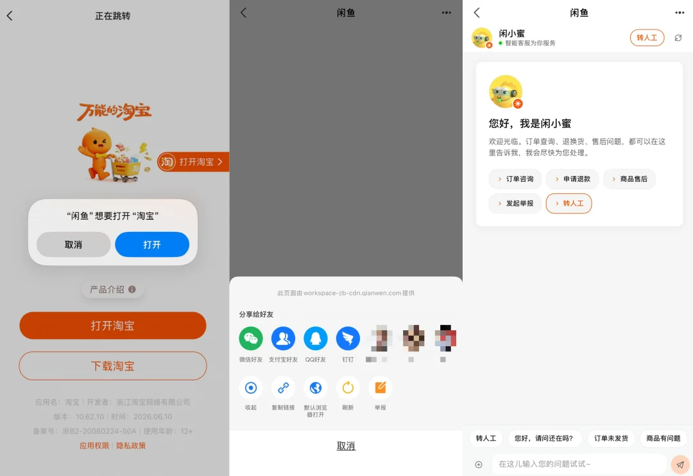

So she paid RMB 2,300.

The recipient's name looked wrong as soon as the payment went through. She returned to Xianyu, checked again, and realized she had been scammed. She immediately called Alipay support, hoping they could stop, freeze, or intercept the payment. Support gave her the runaround. She then reported it to the police, who opened a case and issued an acceptance receipt.

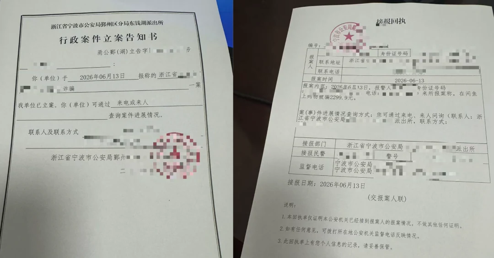

Even with that receipt in front of them, Alipay support kept stalling instead of solving the problem.

The police also told us that my cousin was not the only victim of this phishing system. This was not a one-off con. It was a reusable, carefully engineered fraud pipeline that was still running. This was not a "secondhand transaction dispute," but an organized transaction system built for telecom and online fraud.

--------

## When the Safety Signals Fail

Most anti-fraud education given to people of our generation rests on a few simple rules: do not visit unfamiliar websites; use official apps; check the official domain; look for HTTPS; verify the seller; use the platform's escrow instead of transferring money privately. Those rules are sound. In this chain, every one of them was bypassed.

**The entry point was not a naked link to some strange website. It was a Xianyu-style listing-share QR code.**

Some will say that Xianyu has long warned users that "any transaction that leaves the platform after scanning a code is a scam." But the scammer sent exactly what looked like Xianyu's official share card. Sharing a Xianyu link to another platform and scanning it to open the listing is a normal feature that Xianyu itself provides.
More importantly, my cousin used the Xianyu app itself to scan this Xianyu-looking code, and Xianyu showed no warning that anything was wrong.

**In the middle of the flow, she saw Taobao and Alipay—not a crude scam domain right away.**

Every app on the path was official, and every visible domain belonged to the same ecosystem: `taobao.com`, `alipay.com`, and `qianwen.com`, all with valid HTTPS. To an ordinary user, those are trust signals.
A jump from Xianyu to Tencent's WeChat Pay might look suspicious. A jump from Xianyu to Taobao and then Alipay feels like the normal checkout flow.

**Third, the "external link" warning that should have appeared never did.**

Almost every major app now warns when it opens an external page: "This page is not provided by this app. Proceed with caution," or something similar.
You have seen this annoying but necessary interstitial in Tencent's WeChat, in Alipay, and on Zhihu, China's Quora-like Q&A platform. Yet it never appeared anywhere along this chain of Alibaba-affiliated apps. That frictionless experience—green lights all the way, no warnings, still inside Alipay—was exactly what convinced the victim that everything was normal.

**The seller rating did not save her either.**

Before the scam, she could find a seller with an "Excellent" credit rating. Afterward, the account vanished. So how are accounts with "Excellent" credit cultivated in the first place?

The standard way to blame the victim is to say, "She had no scam awareness; she deserved it." But this was a college-educated young person, fluent with AI tools, with solid common sense and above-average vigilance. She completed the whole process inside official apps and saw nothing but "safety signals"—and was still defrauded.
Does an ordinary consumer have any realistic chance of spotting and avoiding a trap like this? Can these safety signals still be trusted?

--------

## How the Platforms Lent Out Their Trust

Decode the Xianyu QR code, and you get a Taobao short link. The full chain looks like this:

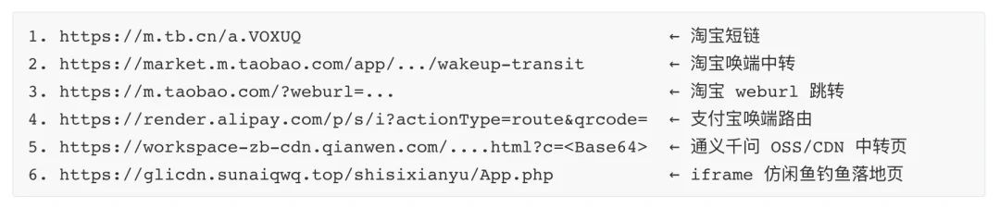

The first question is: **why would the scammers take such a long detour? Why not simply send the final `sunxxxxxx.top` phishing link to the victim?**

Because it would not get through. The embedded browsers in apps such as Alipay and WeChat have defenses against unfamiliar external pages. Drop in an unknown phishing domain directly, and Alipay shows a warning that the page is not official Alipay content, advises caution, and suggests copying the link into an external browser.

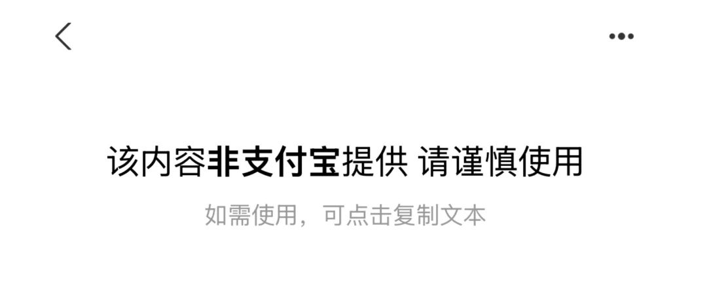

Behind that warning is a **domain whitelist**: domains on the list pass; everything else triggers an interstitial. Domains owned by Alibaba and Ant naturally make the list. A third-party merchant that wants its page to open normally inside Alipay without the warning must apply through the Alipay Open Platform to add its domain to a business whitelist[1].

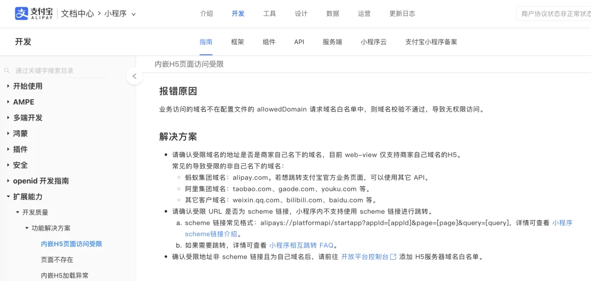

The most plausible technical explanation for the warning's absence is that every hop landed on one of Alibaba's own trusted domains. The system assumes its own domains need no scrutiny, so the warning that should have stopped the user never fires. **The entire point of this detour is to borrow Alibaba domains as a passport and defeat Alibaba's own security barrier.**

The key move comes on the fifth hop, when Alipay opens `workspace-zb-cdn.qianwen.com`, a Qianwen CDN domain. The certificate subject is "Alibaba (China) Network Technology Co., Ltd.," placing it naturally inside the trust boundary. Alipay therefore sees a user visiting a domain owned by a sibling product, and its warning logic silently waves the request through. **Xianyu trusts Taobao, Taobao trusts Alipay, Alipay trusts Qianwen—and a phishing page on the Qianwen CDN breaks the whole chain.**

This Qianwen page is not a normal redirect. It launches a shell page titled "Xianyu," then uses JavaScript to load the third-party phishing site in a full-screen iframe. **That is the technical pivot of the entire scam**: at the moment the user pays, Alipay evaluates the security context using the **outer**, whitelisted `qianwen.com` page. The real `sunaiqwq.top` site loaded inside the iframe fills the screen, while the visible URL continues to look like a Qianwen domain.

As an aside, the `sunaiqwq.top` scam domain itself was registered through Alibaba Cloud. Its DNS MX record even points to Tencent Cloud's enterprise email service (`mxbiz1.qq.com`). Brazen hardly begins to describe it.

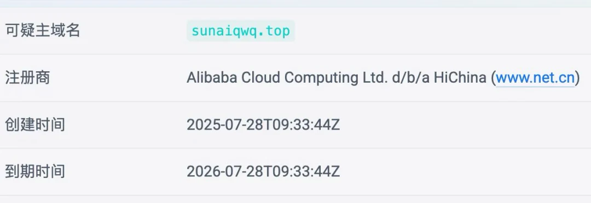

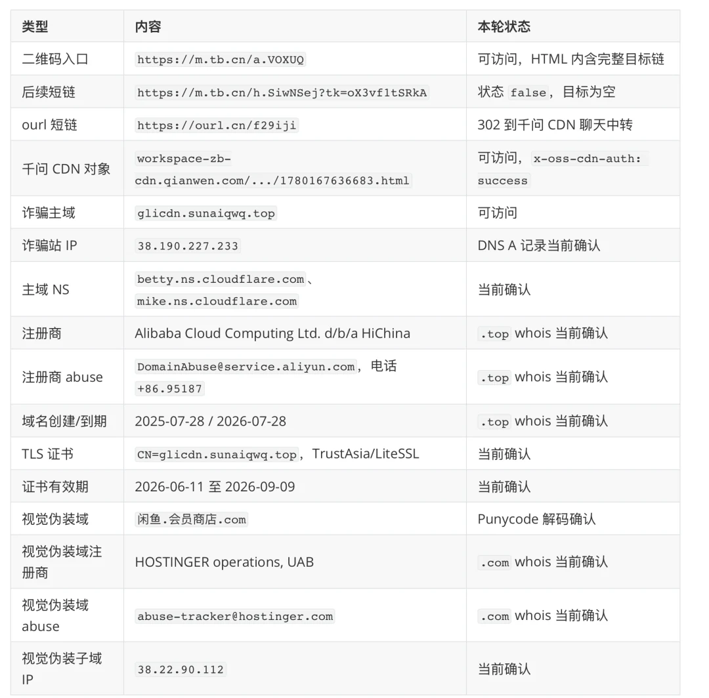

How did the phishing site's HTML get uploaded to a "trusted Qianwen CDN"? We do not know. Whatever the path, the fact remains: a third-party phishing shell was hosted under a Qianwen resource domain, publicly accessible, and no content review stopped it anywhere along this chain.

The black comedy writes itself: **Alibaba spent heavily on a foundation-model product and filled conference stages with talk of "AI empowering every industry." This time, Qianwen delivered equal-opportunity empowerment to the fraud industry. Its reputation defeated the defenses of another Alibaba-affiliated product—the left hand passed over the knife that stabbed the right.**

Ordinary users paid the price.

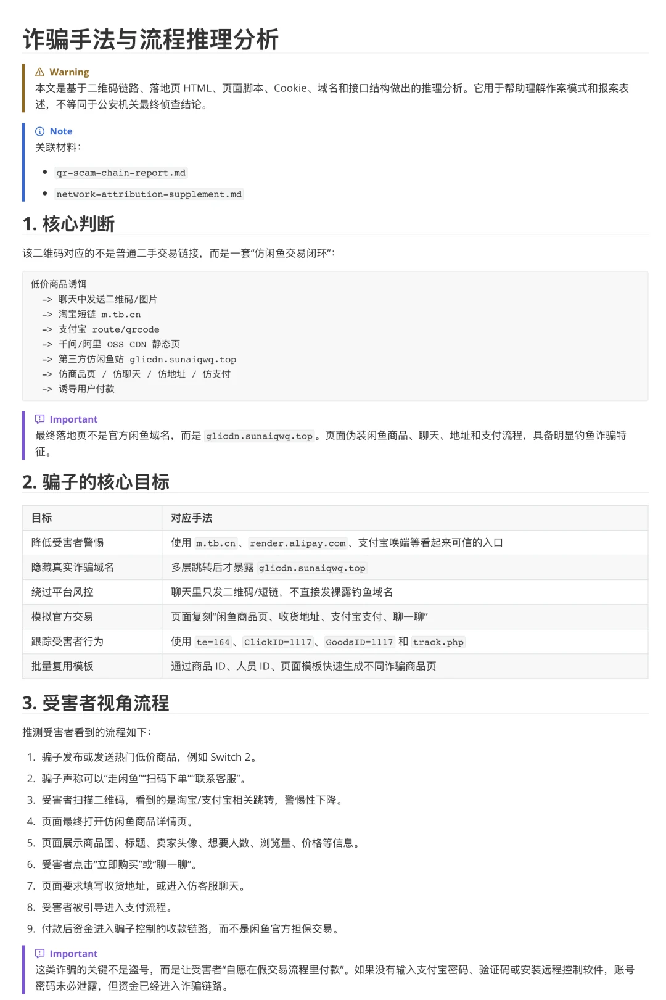

--------

## Why the Platforms Deserve the Blame

In this chain, the entry point was a **Xianyu** listing-share page. App launching and redirects ran through a **Taobao** short link and an **Alipay** route. The phishing shell lived on a **Qianwen** CDN and appeared inside Alipay's browser. Payment ran through **Alipay**. Nearly every trust signal at every key step came from the same ecosystem. The scammers barely exposed their own identity or infrastructure. They borrowed that ecosystem's reputation to execute a textbook fraud.

Walk through the chain one hop at a time.

**The scan.** When the result is not a Xianyu product page, why does Xianyu allow it through and kick the user into Taobao? The answer is simple: because the next stop is Taobao, one of its own.

**The payment—the chain's critical choke point.** Why does Alipay allow a fake Xianyu phishing site? Because it sees `qianwen.com`, a sibling domain, and waves it through. Xianyu trusts Taobao; Taobao trusts Alipay; Alipay trusts Qianwen. That circle of mutual trust was designed for efficiency—the "ecosystem" Alibaba is so proud of. But without cross-product validation and risk control across trusted domains, short links, app launches, payments, and cloud resources, it can easily become a trust-laundering channel for fraud rings.

Some will defend the platforms: embedded browsers use domain whitelists and deep links; WeChat and ByteDance's apps do the same; mutual trust among internal domains is standard mobile-internet practice. True. Ordinary mutual trust is mostly an efficiency question. But when one ecosystem contains a payment app, a marketplace, a short-link system, an AI/CDN resource domain, and an entire merchant-payment stack, that trust becomes **systemic risk**, not merely an optimization. Because this ecosystem can supply almost every critical piece of the chain, the shared trust among its products carries a higher duty of care than that of an ordinary standalone website.

Step back, and this is not simply "someone forgot one validation check." That would be a bug, an oversight, something an overnight patch could fix. The deeper problem is an assumption baked into the architecture's defaults: **our own get a free pass.** They are all in the family, so why defend one sibling from another? In normal times, that is ecosystem integration—highly efficient. But once an attacker enters through any trusted component, the whole chain turns green because it was never designed to distrust its own. It is another vindication of the "amateur hour" theory: pry open many systems that look impregnable, and inside you find a crude rule like "always allow sibling sites."

Ultimately, the ecosystem put a browser inside Alipay and tried to make it do everything, while also letting internal properties pass freely. The former built a door; the latter removed the lock. One product's reputation defeated another product's defenses—the left hand's knife stabbed the right. A scammer entered through one trusted gateway and drove straight through to the user's wallet.

--------

## This Is Not the First Warning

If this were a new vulnerability—a bug nobody knew about—then fine: fix it. But it is not new.

As early as 2023, the Chinese tech outlet Landian News published "Alipay's In-App Browser Is Being Used for Fraud; Don't Scan QR Codes During Xianyu Transactions"[2]. In 2025, someone on V2EX, a Chinese developer forum, publicly reproduced the "Alibaba Cloud OSS Domain Used for a Scam Website"[3] technique and explicitly showed that it could bypass the domain whitelists in the embedded browsers of Alipay and Taobao.
By 2026, the Innora AI security research team had [publicly disclosed risks involving Alipay deep links and WebView whitelist bypasses](https://innora.ai/zfb/). It reported that an open redirect on an Alipay-owned domain could deliver an external page into a trusted WebView. [The official response was: "**This is expected functionality, not a vulnerability.**"](https://linux.do/t/topic/1746089/26)

These public reports and community reproductions do not directly prove that every hop in this case has exactly the same origin. But they establish something important: **people have repeatedly identified the same underlying class of risk, at different times and in different forms.** Once is an accident. After repeated warnings, "we didn't know" becomes a difficult explanation. I will not claim that the platforms knowingly allowed it—but being warned again and again and still failing to close the door says plenty by itself.

A vulnerability is a broken component. Making a complete set of low-friction capabilities available to scammers, so they can get the job done without building the machinery themselves, is something else.
The redirects in this chain were not broken parts. They were product capabilities, deliberately built and left open to sibling services. Perhaps Alipay sees this not as a bug, but a feature.

And these are not merely moral expectations. Article 21 of the **Anti-Telecom and Online Fraud Law of the People's Republic of China** brings internet domain-name registration, server hosting, space rental, cloud services, and content-distribution services under real-name verification requirements.
Article 24 requires providers of domain-name resolution, domain-name forwarding, and URL-redirection services to verify that information is true and accurate, **properly regulate domain-name forwarding**, retain logs, and support traceability.
The second paragraph of Article 25 goes further: when network-resource services, promotion services, website or app development and maintenance, or payment and settlement services are used to support or facilitate fraud, providers must **fulfill the duty of reasonable care** by monitoring, identifying, and acting on it.

I want to point out one fact: "the duty of reasonable care" is written into the law. Short-link validation, keeping dangerous content off resource domains, and checking the real payee and order source before payment are dirty, expensive, unglamorous jobs. They do not drive growth or look good in financial statements. But every cent saved there is not truly saved; it is merely externalized—
onto my cousin, and onto every user whose trust in the safety of this payment system has fallen because of cases like hers.

--------

## There Is Still Time to Close the Barn Door

I do not expect my cousin's RMB 2,300 to be recovered through Alipay. But making one victim's story public can at least warn others away from the same trap. It can also push the platforms to face the fact that fraud rings are borrowing their identities, infrastructure, and trust relationships to do harm.

One piece of good news: the backend of this chain is dying, piece by piece. I had finished this article yesterday, June 14, 2026, and was ready to publish it. The police asked me to hold it so I would not tip off the suspects before they moved in. This morning, I learned that police in Hunan had already dismantled part of the fraud ring.

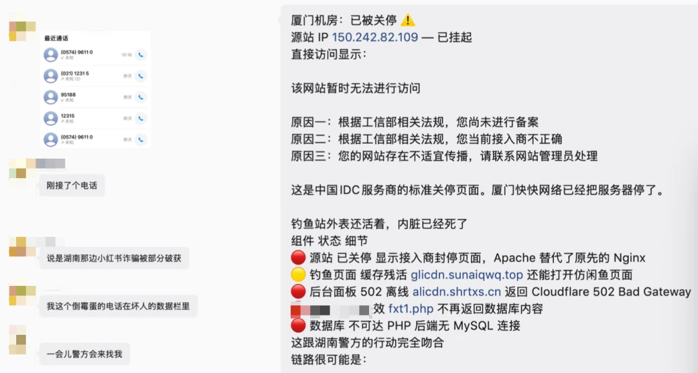

The scam site's server is now offline. I am told its database contained nearly a thousand victims. My cousin was never an isolated case; she was one row on a list, with many more people queued behind her on the same assembly line.

Here is the strange part: at the time of writing, the fake Xianyu phishing page itself **still opens in Alipay's browser**, thanks to the cache on Qianwen's CDN. The only thing pulled down was the scammer's origin server. Not one screw has moved in the trust chain that carried users all the way to it.

The backend died because of police action, not platform enforcement or security. Police can dismantle one ring, but they cannot dismantle a product chain. One origin can be shut down and one gang arrested, but as long as the rule remains "our own get a free pass," the next chain requires only a new shell, a new domain, and a new victim.

"**Make it easy to do business anywhere**" is a fine mission. But when people can borrow a platform's trust to commit fraud, and the door that should have closed remains open—then, at least from the outcome users can see, the company is moving ever farther from its founding purpose.

> **Disclaimer: The redirect chain, domains, certificates, and ownership information described in this article can all be independently verified through public sources. Statements about the case remain subject to information held by the investigating authorities and their final announcements. Please distinguish opinion from fact. My criticism of Alibaba-related entities is limited to negligence—specifically, infrastructure being abused and prevention and control obligations not being fulfilled—and does not allege intent. For readability, this article uses terms such as "Alibaba-affiliated" and "Alibaba ecosystem" to describe the ecosystem trust relationship formed by the products and services users encounter along the chain, including Xianyu, Taobao, Alipay, Qianwen, and Alibaba Cloud. It does not claim that these products necessarily belong to the same legally liable entity.**

--------

## References

1. [Alipay Open Platform: component-ext](https://opendocs.alipay.com/mini/component-ext)
2. [Alipay's In-App Browser Is Being Used for Fraud; Don't Scan QR Codes During Xianyu Transactions](https://www.landian.news/archives/98586.html)
3. [Alibaba Cloud OSS Domain Used for a Scam Website](https://v2ex.com/t/1137419)
