今天我表妹给我发消息：她在闲鱼上被骗了，买一台 Switch 2 被骗走 2300 元。我的第一反应是想笑：你老妈一个干刑警的，反诈工作不到位啊，怎么你还能中招？是买了假货还是场外支付？我来看看怎么个事。

看完我笑不出来了。我用闲鱼扫了一下这个二维码，把这套“上当流程”亲自走了一遍——如果不是事先知道这是个诈骗页，我自己大概率也会中招。就连办案民警试过之后也说了句实在话：要不是提前知道，他自己也得着道。

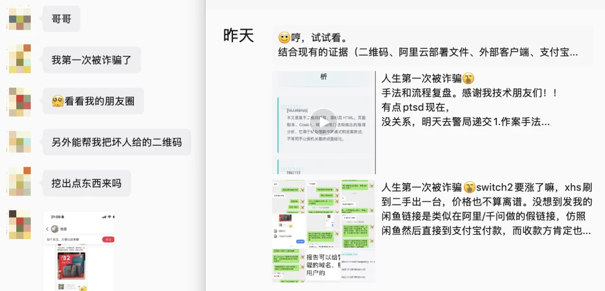

概括起来：这是一张闲鱼商品分享二维码，用闲鱼扫码，唤起淘宝，再唤起支付宝，在支付宝内置浏览器里打开一个伪装成闲鱼的页面，然后用支付宝丝滑地“完成了一笔闲鱼交易”。
全程都在阿里系 App 内部——闲鱼、淘宝、支付宝；一路看到的域名也都是合法有效的阿里系域名，整个过程没有外部链接风险提示：**最终的钓鱼版闲鱼，在支付宝 App 内部丝滑呈现**。

老冯推断这里的关键一环是：钓鱼网站利用通义千问的 CDN 域名作为掩护，利用支付宝对阿里系域名的白名单信任，骗过了支付宝自己的安全拦截。

阿里这些年在台上讲得最多的一个词，叫“**赋能**”。赋能商家，赋能产业，赋能千行百业。
这次，整套官方 App 全家桶却“**赋能**”了一个诈骗团伙。而我表妹的两千三百块还有其他受害者的钱，顺着闲鱼、淘宝、支付宝、千问铺好的信任路径，*被稳稳地接走了*。

我感觉这笔钱大概是找不回来了，但至少发出来能让更多人引以为鉴，不再上同样的当；也能督促平台正视一个事实：它的身份、基础设施和信任关系，正在被诈骗团伙借去作恶。

--------

## 故事的起因经过

故事并不复杂。我表妹在小红书上看到有人出二手 Switch 2，聊好之后，对方发来一张看起来像闲鱼商品分享页的二维码。

她不是完全没做功课。她特地去闲鱼搜了这个卖家，确实搜到了相关账号，信用还显示“**极好**”。于是她放下戒心，用闲鱼 App 扫了那个二维码。

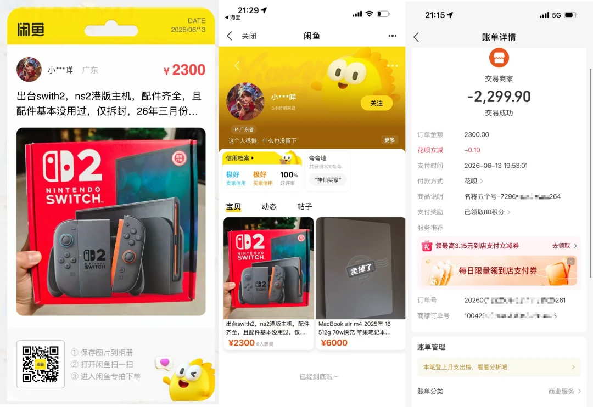

闲鱼扫码之后，页面先经过淘宝的短链和唤端中转，再唤起支付宝路由，随后落到一个支付宝内部高度仿真的“闲鱼”页面。一整套流程做得很完整，而且全程也没有往常外链那种“非支付宝链接”注意提醒。

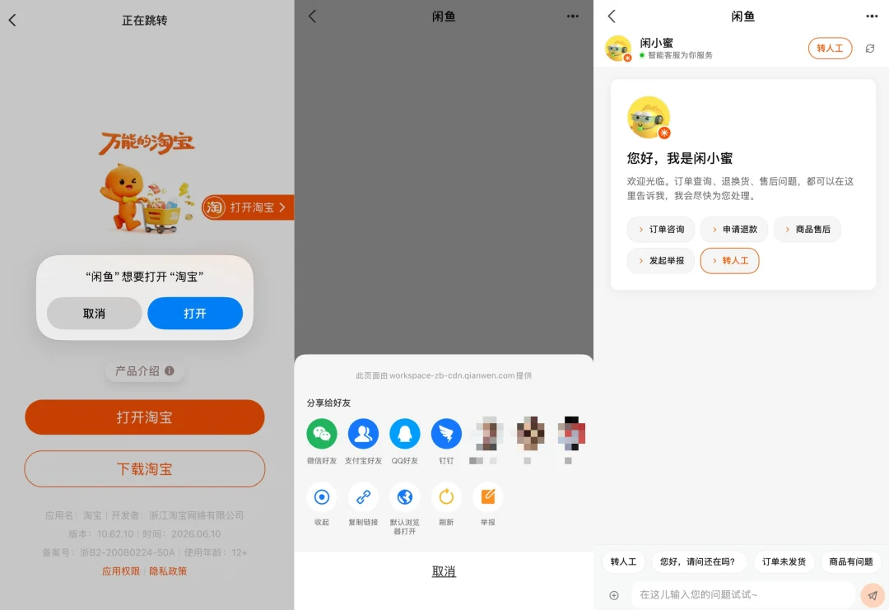

于是，她在那儿付了 2300 元。

付完款，她看到收款人就觉得不对劲，回闲鱼一查，发现上当了。她立刻打支付宝客服，希望止付、冻结、把钱拦回来——客服只能打太极。她又去派出所报案，案子立了，拿到了受案回执。

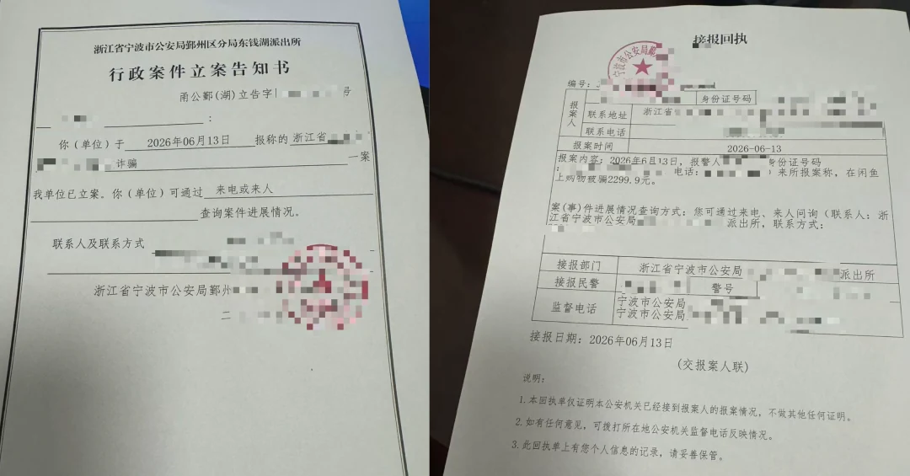

可即便把回执摆到客服面前，支付宝客服依然在扯皮，不解决问题。

而且从警方了解到的情况，被这套钓鱼系统骗到的，不止我表妹一个人。这不是一次个人诈骗，而是一条还在持续运转的可复用的精密诈骗流水线。这不是一桩“二手交易纠纷”，而是一套“有组织的电信诈骗交易系统”。

--------

## 失灵的安全信号

我们这代人接受的反诈教育，大多建立在几条朴素的规则上：别去陌生网站、认准官方 App、看清官方域名、认准 HTTPS、核验卖家、走平台担保交易别私下转账。这些规则没错。可在这条链路里，它们被逐个绕过。

**入口不是赤裸裸的陌生链接，而是一张闲鱼风格的商品分享二维码。**

有人会说，闲鱼不是早提醒过“扫码跳出平台交易即诈骗”吗？可骗子发来的，恰恰是一张闲鱼官方样式的分享卡片——把闲鱼链接分享到别的平台、再扫码打开，本就是闲鱼自己提供的正常功能。
何况，我表妹是用闲鱼 App 本身去扫这张闲鱼码，闲鱼也没有对这个伪造的闲鱼二维码提示任何异常。

**中途看到的是淘宝和支付宝，而不是一上来就跳到粗糙的诈骗域名。**

路径上全是阿里官方 App，域名全是阿里系的 `taobao.com`、`alipay.com`、`qianwen.com`，HTTPS 齐全。对普通用户来说，这些本身就是信任信号。
从闲鱼跳转到微信支付可能会让人觉得不对劲，但从闲鱼跳转到淘宝、再跳到支付宝，反而让人觉得 “这就是正常的流程啊”。

**第三，那道本应出现的“外部链接”提醒，这次没有出现。**

如今几乎所有主流 App 在打开外部页面时都会弹一句“该页面非本应用提供，请注意甄别”之类的提醒 —— 
你在微信、在支付宝、在知乎里都见过这个恼人但必要的拦截。可在这条阿里系 App 一路跳转的链路里，它自始至终没有出现。恰恰是这种“一路绿灯、零告警、还在支付宝 App 里”的丝滑体验，让受害者笃定一切正常。

**卖家信用也没救她。**

案发前能搜到“信用极好”的卖家，案发后人间蒸发。那这些“信用极好”的账号，又是怎么养出来的？

最常用来甩锅给受害者的话术是，“防骗意识太差，活该被骗”。可一个受过大学教育、会熟练使用各种 AI 工具、认知常识警戒心都在平均线以上的年轻人，在官方 App 里走完流程，看到的都是“安全信号”，可最后还是被骗了。
那么普通的消费者是否又真正有能力识别这些骗术并避免呢？这些安全信号还真的可信吗？

--------

## 信任如何被出借

把这个闲鱼二维码解码，得到的是一个淘宝短链。完整链路是这样走的：

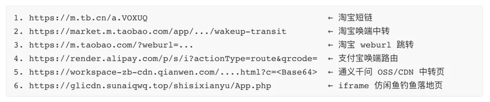

第一个问题是：**骗子为什么要绕这么一大圈？直接把最后那个 `sunxxxxxx.top` 的钓鱼链接发给受害者，不是更省事吗？**

因为发不出去。支付宝、微信这些 App 的内置浏览器，对陌生外部页面有防线——你直接甩一个没见过的钓鱼域名进去，支付宝会弹窗，告诉你这不是它的官方页面、提醒你谨慎访问，并建议你复制到外部浏览器再打开。

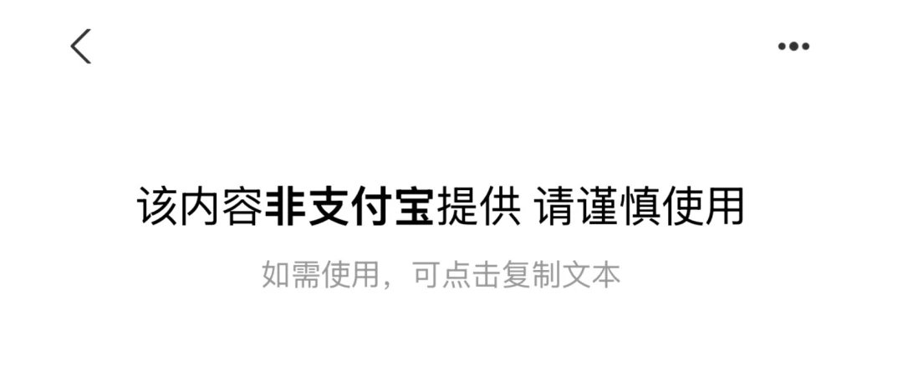

这背后有一套**域名白名单**机制：白名单之内放行，之外弹窗。阿里、蚂蚁自家域名理所当然在白名单里；而第三方商户若想去掉提示、在支付宝里被正常打开，得专门到支付宝开放平台申请，把域名加进业务白名单[1]。

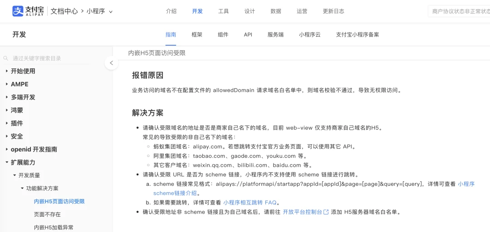

这道我们没少见的外链提醒，之所以在这条链路里全程缺席，最合理的技术解释是：每一跳停的都是阿里自己的可信域名，系统默认“自己人不必防自己人”，那道本该拦下用户的提醒就一直没触发。**骗子绕这一大圈的唯一目的，就是借阿里的域名当通行证，去骗过阿里自己的安全拦截**。

这里的关键一招是第五跳，在支付宝里打开 `workspace-zb-cdn.qianwen.com`，这是通义千问的 CDN 域名。证书 subject 显示为“阿里巴巴（中国）网络技术有限公司”，天然在信任域内。于是支付宝看到的是“用户在访问我自己兄弟产品的域名”，提示逻辑判定“自己人不必防”，静默放行。**闲鱼信任淘宝，淘宝信任支付宝，支付宝信任千问，然后在千问 CDN 放个钓鱼页面，破功了。**

这个千问页面并不是普通跳转：它启动了一个标题为“闲鱼”的壳页面，再用 JS 把一个 iframe 全屏加载到第三方钓鱼站上。**这一步是整个骗局的技术枢纽**——用户付款那一刻，支付宝判定安全上下文依据的是**外层**那个白名单内的 `qianwen.com`，而 iframe 里真正加载的 `sunaiqwq.top` 被全屏内容盖住，地址看上去始终落在千问域名上。

顺带一提，这个诈骗域名 `sunaiqwq.top` 本身也是在阿里云注册的，DNS MX 记录还挂着腾讯云企业邮箱（`mxbiz1.qq.com`），堪称大摇大摆。

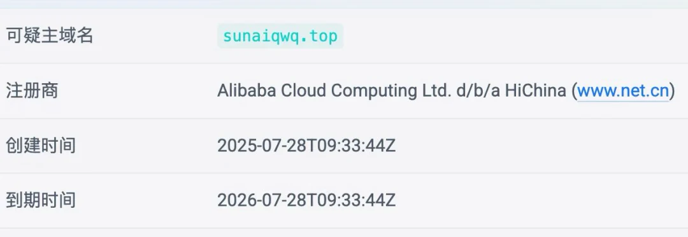

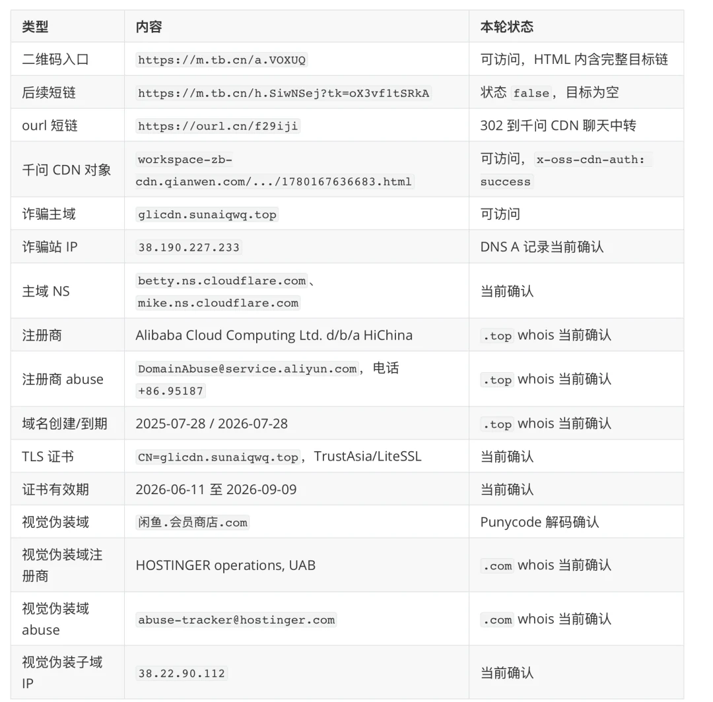

这个钓鱼网站 HTML 又是如何上传到“受信任的千问 CDN”里呢？我们无从得知，但不管这玩意是怎么进去的，事实是一个第三方的钓鱼壳页，被托管在了千问的资源域名下，对外公开可访问，且在这条链路里没有被任何内容审核拦下。

这简直是黑色幽默：**阿里花大价钱做大模型产品、天天在发布会上喊“AI 赋能千行百业”的那个通义千问，这次确实一视同仁地赋能了电诈行业；它用自己的信誉，攻破了自己另一个产品的防线，左手递了一把刀，捅了自己的右手。**

而这一刀的代价，落在了被骗的普通用户身上。

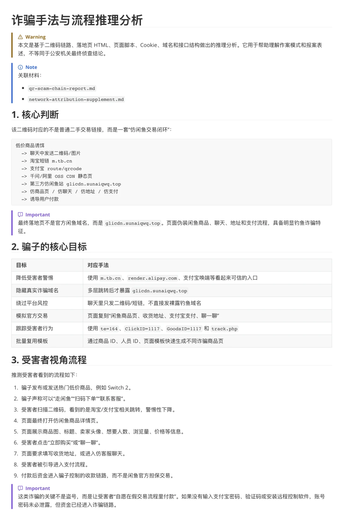

--------

## 为什么板子要打在平台身上

在这个链条里：入口，是**闲鱼**的商品分享页；唤端和跳转，靠的是**淘宝**短链和**支付宝**路由；钓鱼网站的壳，挂在**通义千问**的 CDN 上、呈现在支付宝的浏览器里；付款，走的是**支付宝**。用户在这条链路里**产生信任的每一个关键节点，凭证几乎全部来自同一个生态**。骗子从头到尾几乎没用过自己的真身，借着这个生态的信誉，完成了一次教科书式的诈骗。

不妨顺着链路，一跳一跳地问下去。

**扫码这一跳。** 当扫出来的并不是闲鱼自己的商品页时，闲鱼为什么还往下放行、把人一脚送进淘宝？答案很简单：因为后面跟着的是淘宝，自家的。

**支付这一跳，也就是整条链的命门。** 支付宝凭什么放行一个假闲鱼钓鱼站？因为它看到的是 `qianwen.com`，自家兄弟，直接放行。闲鱼信任淘宝，淘宝信任支付宝，支付宝信任千问——这一圈互信，本来是效率，是阿里引以为傲的“生态”。可一旦这些可信域、短链、唤端、支付、云资源之间缺了跨产品的验证与风控，它就很容易反过来，变成诈骗团伙“洗白信任”的通道。

有人会替平台辩护：内置浏览器有域名白名单、有 DeepLink，微信、字节也一样，“内部域名互信”是移动互联网的通行做法。没错。可普通的互信至多是效率问题；当一个支付 App、一个交易平台、一套短链系统、一片 AI/CDN 资源域、一整套商户收款体系都收在同一个生态里时，互信就不再只是效率工具，而是**系统性风险**。正因为这个生态几乎能凑齐整条链的全部关键拼图，链路上每个产品所共享的那份信任，就负有比单个普通网站更高的注意义务。

往后退一步看，这条链路暴露的，从来不是“某处忘了加一道校验”——那是漏洞，是疏忽，连夜能修。真正的问题，是一种写进架构默认值里的立场：**自己人，免检。** 反正都是自家的东西，谁会防着自己的兄弟？平时，这叫生态协同，效率极高；可一旦有人从某个被信任的环节钻进来，整条链就一路绿灯，因为它从设计上就没打算防自己人。这也是“草台理论”的又一次印证：很多看起来固若金汤的系统，扒开来，里面就是“兄弟站一律放行”这种粗糙实现。

说到底，是这个生态一边把浏览器塞进支付宝、想让它无所不能，一边又让生态内部彼此放行——前者造了门，后者拆了锁。它用自己一个产品的信誉，攻破了自己另一个产品的防线：左手的刀，捅的是右手。骗子从一个被信任的入口开进来，竟然就能一路畅通，直达用户的钱包。

--------

## 这不是问题第一次被提出

如果这是漏洞、是 bug、之前不知情，那修了就好。但它并不新鲜。

早在 2023 年，蓝点网就写过《支付宝内置浏览器被用于诈骗，在闲鱼交易时请勿扫码》[2]；2025 年，又有人在 V2EX 上公开复现了“阿里云 OSS 域名用于诈骗网站”[3] 这套手法，明确指出它能绕过支付宝、淘宝内置浏览器的域名白名单。
到了 2026 年，Innora AI 安全研究团队又 [公开披露了支付宝 DeepLink 与 WebView 白名单绕过的风险](https://innora.ai/zfb/)，称支付宝自有域名上的开放重定向可以把外部页面送进受信任的 WebView，[官方回复为“**这是正常功能特性，不是漏洞**”](https://linux.do/t/topic/1746089/26)。

这些是公开材料和社区复现，并不能直接证明本案的每一跳都与它们完全同源；但它们足以说明：**同一个根子上的风险，早就被不同的人、在不同时间、以不同形式反复点过名。** 一次，可以叫意外；反复被指出之后仍在原地，就很难再用“不知道”来解释。我不会说平台明知故纵——但“被反复提醒、却迟迟没把那扇门关上”，这件事本身就说明了不少问题。

漏洞，是某个零件坏了；而把一整套现成的能力、低门槛地开放给骗子，让他不必自己造轮子就能办成事 —— 那是另一回事。
这条链路上的跳转，都不是坏掉的零件，而是被做出来、并且对自己人敞开的产品能力。也许支付宝觉得这不是 Bug，而是 Feature。

何况，这些并不只是道义层面的要求。《反电信网络诈骗法》第二十一条把互联网域名注册、服务器托管、空间租用、云服务、内容分发服务纳入实名核验范围；
第二十四条要求提供域名解析、域名跳转、网址链接转换服务的主体核验信息真实准确、**规范域名跳转**、留存日志并支持溯源；
第二十五条第二款则进一步要求，对网络资源服务、推广服务、网站/App 技术制作维护服务、支付结算服务被用于涉诈支持帮助的情形，**履行合理注意义务**，进行监测识别和处置。

我只想指出一个事实：“合理注意义务”这六个字，是写进法律里的。这些事 —— 短链校验、资源域限制危险内容、支付前核对真实收款方与订单来源 —— 
是脏活累活、成本项，不性感、不增长、不好看进财报。但今天在这上面省下的每一分，都不是真省了，只是被转移了出去：
记在我表妹、以及每一个因此对“这套支付体系还安不安全”信任降级的人头上。

--------

## 亡羊补牢，时尤未晚

我表妹这 2300 块，我觉得通过支付宝是肯定追不回来了。但公开一个被骗的案例，至少可以提醒更多人别上同样的当，引以为鉴。也能督促平台正视一个事实：它的身份、基础设施和信任关系，正在被诈骗团伙借去作恶。

一个好消息是，那条链路的后端正在一截截死去。本来老冯昨天（2026-06-14）写完这篇准备发出。警察让我先不要发出来打草惊蛇，等他们收网了再发。今天早上就听到湖南警方已经部分破获此诈骗团伙。

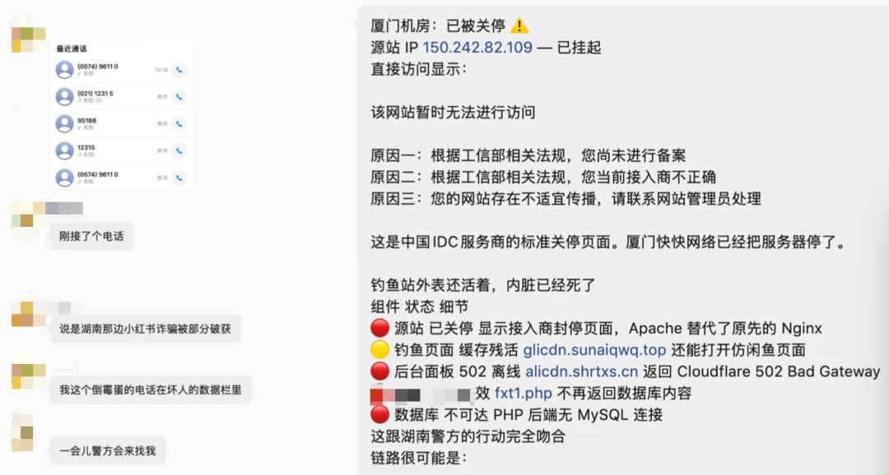

诈骗网站服务器已经下线关停，听说涉案数据库里受害者近千人。她从来不是一桩孤立的个案，而是一份名单上的一个条目；那条流水线上，还排着很多个“她”。

但真正吊诡的是：截至此刻，那个假闲鱼钓鱼页本身，**还能在支付宝的浏览器里打开**：靠的是千问 CDN 上的缓存。因为被拔掉的，只是骗子自己那台服务器；而把用户一路送到它面前的那条信任链，到现在，一颗螺丝都没动过。

杀死这条链路后端的，不是平台的封控与安全，而是警方的行动。可警方能端掉一个团伙，端不掉一条产品链路；一个源站可以封停，一个团伙可以收网，但只要“自己人免检”的逻辑不改，下一条链路，只需要换个壳、换个域名、换个受害者。

“**让天下没有难做的生意**”是很好的使命。但当平台的信任开始被人借去行骗，而那扇本该关上的门迟迟没关上——至少从用户能看到的结果看，它离自己的初心，是越走越远了。

> **声明：本文所述跳转链路、域名、证书与归属信息均可通过公开方式独立核验；文中案情相关信息等表述以办案机关掌握情况与最终公告为准；请注意区分观点与事实，对阿里相关主体的评价限于“基础设施被滥用、未尽防控义务”的过失层面，不涉及主观故意的指控。本文为便于叙述使用‘阿里系’‘阿里生态’等表述，指用户在链路中看到或接触到的闲鱼、淘宝、支付宝、通义千问、阿里云等产品和服务所形成的生态信任关系，并不主张上述产品必然属于同一法律责任主体**

--------

## 参考

1. [支付宝开放平台：component-ext](https://opendocs.alipay.com/mini/component-ext)
2. [支付宝内置浏览器被用于诈骗，在闲鱼交易时请勿扫码](https://www.landian.news/archives/98586.html)
3. [阿里云 OSS 域名用于诈骗网站](https://v2ex.com/t/1137419)
