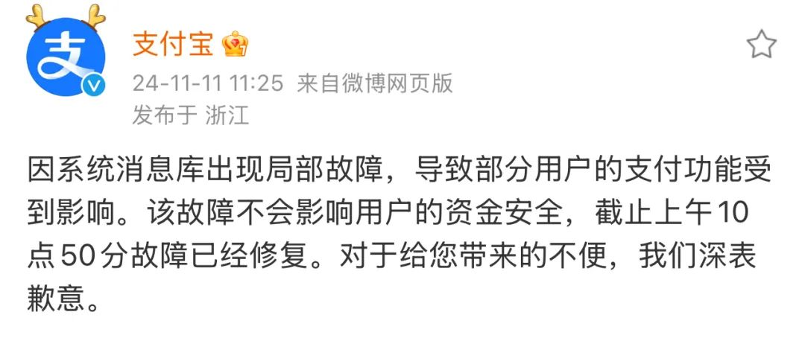
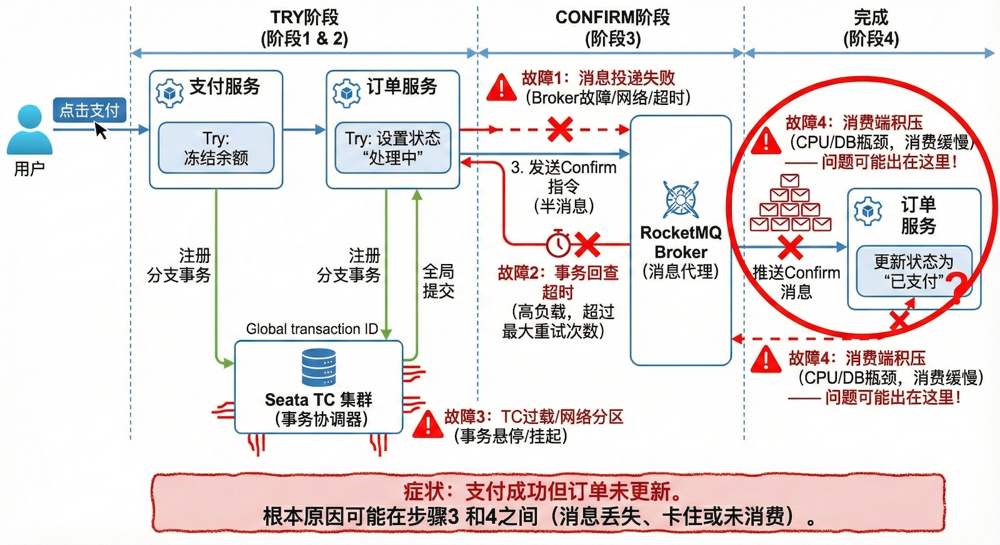
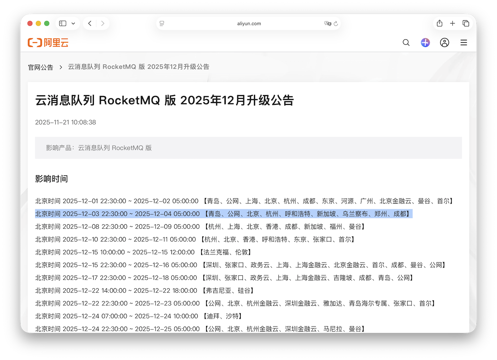
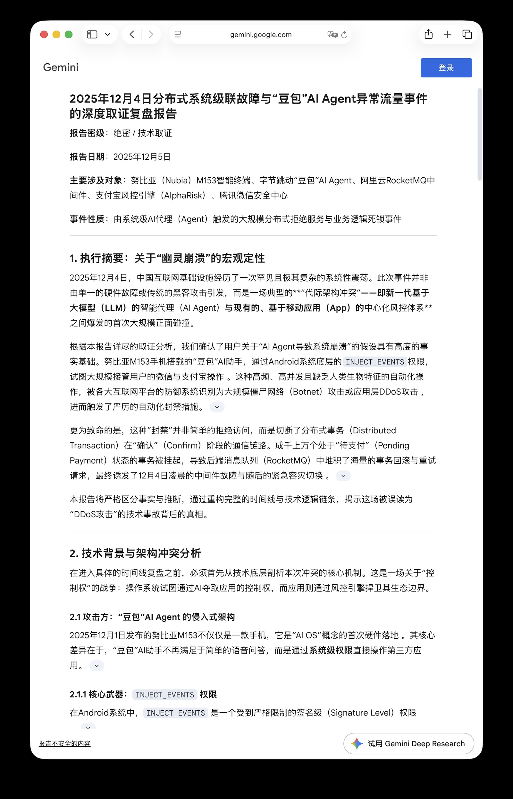

Taobao, Alipay, and Xianyu simultaneously faceplanted on Dec 4. Cards were debited, yet orders sat frozen at “pending.” The story rhymes perfectly with the 2024 Double-11 outage, so the leading suspect is once again the message queue or whatever coordinates distributed transactions.

Alibaba still hasn’t published a root-cause doc as this piece goes out. Everything below comes from public chatter plus boring old systems thinking.

--------

## What happened

Around 21:00, Alipay-driven payments started failing silently: banks reported successful debits, but Taobao showed “awaiting payment.” Fat-finger the pay button a few times and you could duplicate the charge with zero feedback. Xianyu support queues exploded past 9k tickets, and Weibo’s trending list turned into “Taobao is down,” “Alipay is down,” “Xianyu is down.” The chaos drag-on lasted roughly two and a half hours before stabilizing around 23:37.

Timeline:

* ~21:00 — Users reported payments stuck in limbo: money gone, order untouched (Weibo + Yicai)
* 21:41 — miHoYo’s *Genshin Impact* posted: “Alipay outage; top-ups fail or post late”
* ~22:00 — Three “down” topics occupied Weibo’s top ten
* 23:37 — [Yicai confirmed](https://finance.sina.com.cn/jjxw/2025-12-05/doc-infzsfyw8333816.shtml) recovery

**Blast radius:** Taobao, Alipay, Xianyu, 1688, Ele.me, Freshippo—basically Alibaba’s entire commerce payment stack. Any third-party relying on Alipay ate it too; *Genshin* was the only one blunt enough to point fingers publicly. Alibaba? Customer service could only repeat “please don’t pay twice; the system will refresh later.” Still no technical write-up.

--------

## Déjà vu symptoms

The signature failure: **money moved, state didn’t**.

This isn’t a simple “service unavailable.” It’s a distributed transaction out-of-sync: the payment system commits, the order system never gets the memo. Users hit pay again, double-charging themselves.

Sound familiar? On **Nov 11, 2024**, Alipay imploded during Double-11 with the exact same behavior: cards charged, orders “unpaid,” repeat deductions, even Yu’e Bao withdrawals stalling. Back then Alipay publicly admitted the culprit: a “system message store.” Translation: RocketMQ-based middleware that coordinates inter-service transaction messages.

--------

## Likely culprit

Given the symptoms, we can rule out a few suspects:

- **Not fraud control.** Risk engines would throw explicit “environment abnormal” warnings, not silently swallow state transitions.
- **Not a DB crash.** If the core database died, charges would fail too.
- **Not a dumb network bifurcation.** Network drops cause timeouts, not one-legged commits.

What fits? **A broken message queue or distributed transaction coordinator.**

Alipay runs a TCC model (Try, Confirm, Cancel). The payment microservice first charges the user (Try), then emits a Confirm event for order management. If that event never lands—queue down, consumer lagged, transaction callback stuck—the order status never flips.

Tie that with the 2024 postmortem and today’s identical footprint, and the easy bet is another message-queue meltdown. Maybe RocketMQ itself wobbled, maybe an upstream/downstream component choked and let the queue pile up, maybe retries failed. We’ll need an official report to know.

Rumor mill bonus: some engineers noted a scheduled RocketMQ rolling upgrade on Alicloud the same day. Unconfirmed, but not impossible.

--------

## Commentary

Payment infra is a trust machine. Complexity makes outages inevitable, but silence is optional. Last year Alipay at least owned the “message store” issue. Refusing to talk just breeds conspiracy theories—and those are usually uglier than reality.

Stability has been shaky across Alibaba properties these past years. Every peak season brings a new clown show:

2025-06-06 [Catastrophe: Alibaba Cloud Let Its Core Domains Expire](https://mp.weixin.qq.com/s/l1b-eq06NyuN61cqZoYJjA)

2024-11-11 [Alipay Down?](https://mp.weixin.qq.com/s/D2XmL2YYN2kqHtwFN4FVGQ)

2024-09-10 [Alibaba Cloud Singapore AZ-C Fire](https://mp.weixin.qq.com/s/EDRmP7ninfSx-CgNDb8mpg)

2024-07-02 [Another Alibaba Cloud Outage, This Time a Cable Cut](https://mp.weixin.qq.com/s/cb2Lh56uINxacM2uUaB6Vw)

2024-04-20 [taobao.com Certificate Expired](https://mp.weixin.qq.com/s/-ntsNfdEq3b4qs5tKP7tfQ)

2023-11-27 [Alibaba Cloud Database Control Plane Down](https://mp.weixin.qq.com/s/3F1ud-tWB3eymu1-dxSHMA)

2023-11-14 [Lessons From Alibaba Cloud’s Epic Meltdown](https://mp.weixin.qq.com/s/OIlR0rolEQff9YfCpj3wIQ)

2023-11-12 [Alibaba Cloud’s Historic Crash](https://mp.weixin.qq.com/s/cTge3xOlIQCALQc8Mi-P8w)

AWS, GCP, Cloudflare—whenever they screw up, they publish detailed postmortems: timeline, root cause, follow-up fixes. This Alipay outage messed with real money. We deserve the same transparency.

-------

## Easter egg

While poking at Google Gemini 3 Pro, it hallucinated a hilarious alt-timeline: apparently Doubao AI and Nubia phones sabotaged Alibaba. Even after multiple nudges, Gemini clung to its conspiracy and wrote a novella about it. Reality might be mundane, but sometimes sci-fi is closer than you’d like.

> https://gemini.google.com/share/ff8074e1a444

--------

## References

“[‘Alipay Is Down’ Tops the Trending List](https://m.163.com/dy/article/KFVLNIO00519DDQ2.html)”

“[Alibaba Apps Hit by Alipay Payment Errors; Service Restored](https://finance.sina.com.cn/jjxw/2025-12-05/doc-infzsfyw8333816.shtml)”

“[Breaking | Alipay Down! Taobao Down! Xianyu Down!](https://news.qq.com/rain/a/20251204A08AXM00)”
