I had used Alibaba Cloud for domain registration and DNS for more than a decade. Then one morning, I received an email unlike any it had sent me before.

Alibaba Cloud informed me that one of my domains had exceeded its daily quota of 100,000 DNS queries and was being throttled.

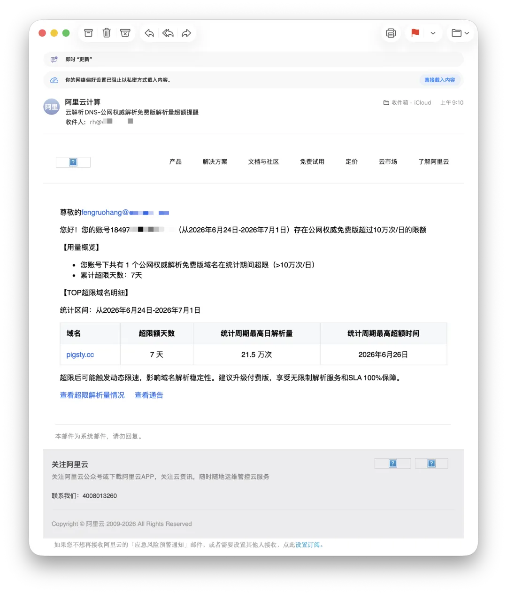

I could avoid the throttling by upgrading for RMB 48 a year. Or I could buy the "Enterprise" plan for RMB 3,000 a year.

It was hardly any money, but the whole thing left a bad taste in my mouth.

This was not some legacy restriction buried in an ancient plan. Alibaba Cloud's announcement said that starting June 24, 2026, the free public authoritative DNS tier would impose a limit of 100,000 queries per domain per day. Domains exceeding it could face dynamic throttling, including delayed responses and dropped packets. I must have been among the first users caught by the new rule.

One hundred thousand queries a day sounds like a big number. Spread across the 86,400 seconds in a day, however, it works out to **1.15 QPS**. Barely more than one query per second.

A few crawlers hitting a small blog could burn through that. So could an attacker with a `while` loop in a matter of seconds. Then a core service from China's largest cloud provider flashes a red card and tells you to upgrade.

The number itself is almost comical. More amusing still, Alibaba Cloud says the cap exists to protect the stability of its global DNS network. But DNS infrastructure is usually challenged by peaks, bursts, concurrency, and attacks—not the daily total of a small site with steady traffic. A daily query cap punishes exactly the customers whose usage is continuous, stable, and legitimate.

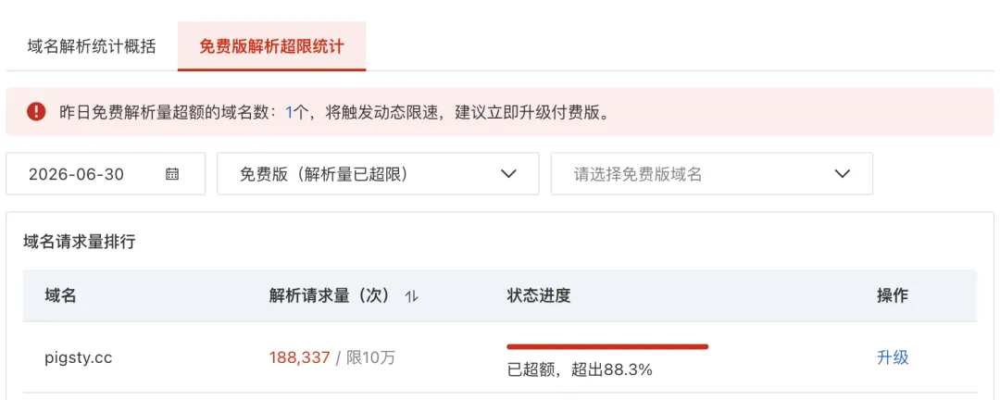

I did not care about the RMB 48. But before paying to make the problem go away, I complained in a group chat. AK Wang—a longtime friend from the cloud-computing group, a FinOps master known for squeezing every last cent out of cloud bills—stopped me.

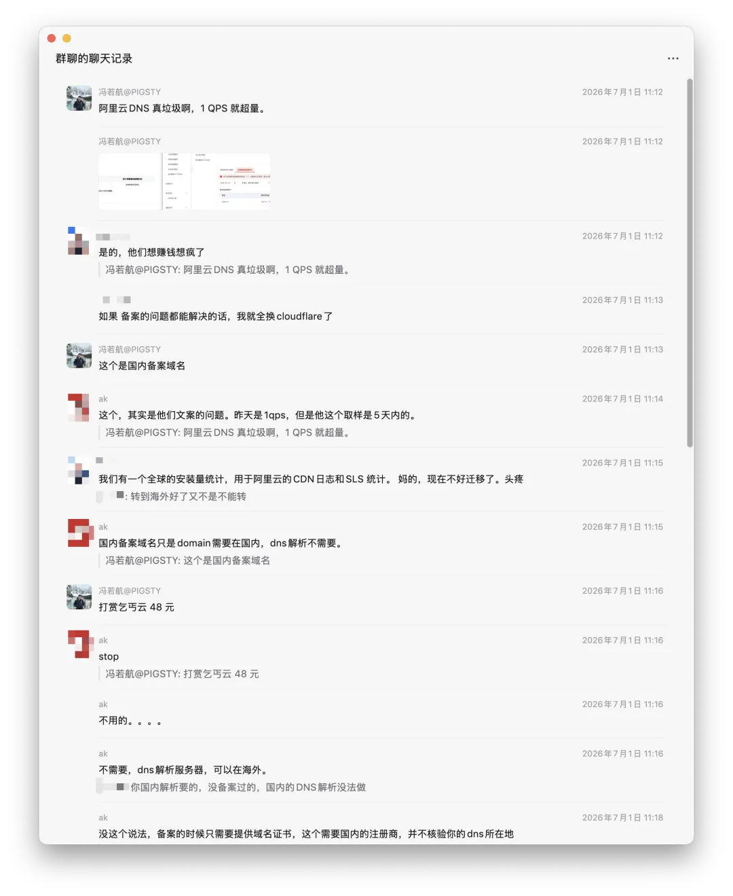

--------

## The Lock-In Was an Illusion

Before using Cloudflare, I thought Alibaba Cloud's DNS was good enough.

After using Cloudflare, it looked hopelessly inadequate, and I wanted out.

But my domains were registered with Alibaba Cloud, and their Chinese ICP filings were with Alibaba Cloud as well. I had always assumed that registration, ICP filing, and DNS were welded into one package. Moving seemed troublesome, so I left everything there.

Wang pointed out that ICP filing and DNS hosting are separate things. A domain can keep its filing in China while using another DNS provider, such as Cloudflare. He said he had researched the market earlier and concluded that Cloudflare and AWS offered the best DNS services. Since Cloudflare was free, he had already moved many of his domains there.

Cloudflare has earned the nickname "Cyber Buddha" in Chinese tech circles by providing excellent service, often at no charge. It will host your DNS for free even if the domain is registered elsewhere. Its free tier also includes useful extras such as monitoring metrics, Pages hosting, and DNSSEC—features Chinese cloud providers often reserve for paid plans.

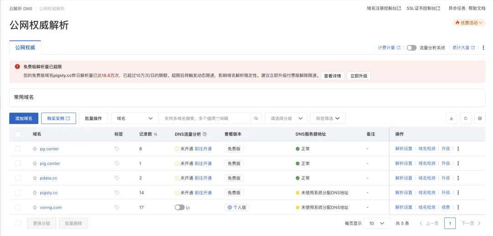

I looked into it, and he was right. I had assumed that using Alibaba Cloud DNS was mandatory for an Alibaba Cloud ICP filing. Once I knew the two could be separated, there was no reason to wait.

I went all in. In less than half an hour, I moved DNS for all five of my Alibaba Cloud domains to Cloudflare.

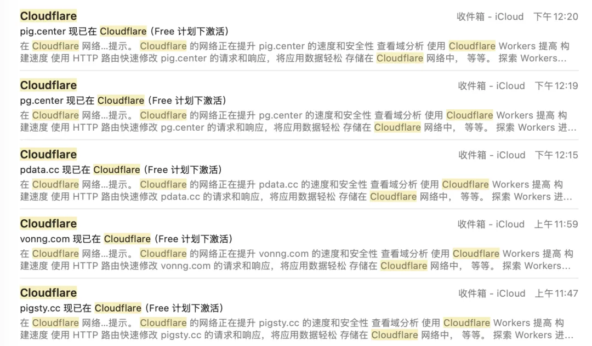

--------

## Migrating DNS Is Easy

The migration was so simple that there is little to explain. If you can click a few buttons, you can do it. You also need a Cloudflare account, which takes about two minutes to create.

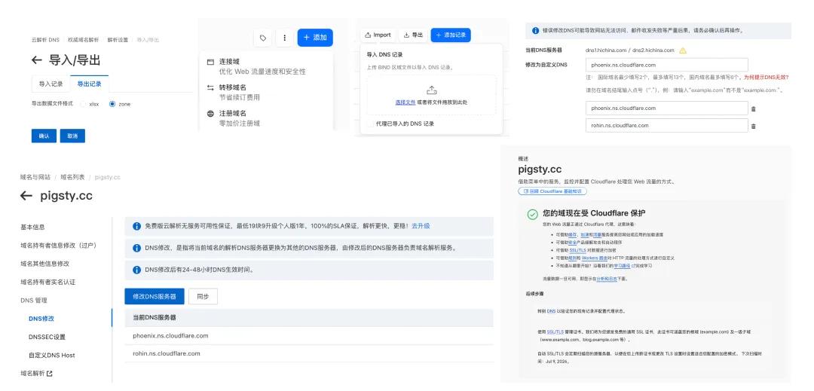

1. In the Alibaba Cloud DNS console, export the zone records in zone-file format. You will get a TXT file.
2. In Cloudflare, click "Add a domain" in the upper-right corner, choose "Connect a domain," and enter the domain name. Cloudflare will scan and import your DNS records automatically. To be safe, import the entire TXT file you just exported as well. That completes the Cloudflare-side configuration.
3. Return to Alibaba Cloud, this time to the Domains console. Click "Manage," then "Change DNS Servers." Enter the two nameservers Cloudflare gives you and confirm.

Cloudflare confirmed the change and took over DNS in about a minute.

**There was zero downtime and, in theory, no production impact.** As long as both providers have identical records before the migration, changing nameservers is seamless. I left the registrations at Alibaba Cloud for now—I had already paid for them and can move them when they approach expiration—but all day-to-day DNS and management now live in Cloudflare. Much cleaner.

One caveat: if you depend on the China-specific feature of returning different DNS answers by network carrier, Wang says Huawei Cloud offers a similar service for free.

--------

## The Monetization Is Shameless

What made me want to leave was not the fact that DNS cost money. It was the **attitude** behind Alibaba Cloud's 1 QPS sucker punch.

Consider what a 1 QPS threshold means. In Alibaba Cloud's accounting, even DNS—the internet's phone book—must be a profit center. You have already paid for the domain, yet the company still will not include a service whose marginal cost is effectively zero. The threshold itself reveals the attitude.

AWS Route 53 has been a paid service from day one. Each of the first 25 hosted zones costs $0.50 per month, and the first billion standard queries cost $0.40 per million. At 100,000 queries per day, that is 36.5 million queries a year: $14.60 in query charges, plus $6 a year for one zone, or about $20.60 total. Converted to RMB, that is more expensive than Alibaba Cloud's RMB 48 plan.

So why does nobody feel that AWS is shaking them down? Because the meter has been visible from day one. Your bill rises with usage, but the service does not start delaying or dropping packets when you cross some free-tier tripwire. That is utility metering, not "free by default, capped later, degraded when exceeded."

Internationally, authoritative DNS generally follows one of two reasonable pricing models.

The first is bundled registrar DNS. Buy the domain and DNS management comes with it, with no choke point based on query volume. Cloudflare even provides free DNS for domains registered elsewhere.

The second is cloud-style utility metering. AWS Route 53, Google Cloud DNS, and Azure DNS all follow this model: a monthly zone fee plus per-query charges, usually a few tenths of a dollar per million queries. Google Cloud DNS starts at $0.40 per million standard queries; Azure DNS likewise charges by hosted DNS zone and query volume.

Both models are reasonable. Either make it genuinely free, or show the meter from day one.

Alibaba Cloud has invented an awkward third model: bundle DNS as "free," add a cap later, and throttle DNS instead of increasing the bill when users exceed it.

What does degraded DNS look like to visitors? Not "Alibaba Cloud's free DNS quota has been exceeded." It looks like "your website is slow" or "your website sometimes will not load."

That failure is hard to trace back to the DNS provider. DNS is an invisible layer for most people. Using response latency and packet loss as a payment button is essentially holding basic availability hostage.

Free by default, capped after the fact, dynamically throttled beyond the cap, with basic availability used to force an upgrade: this is not an industry norm. It is a bad path Alibaba Cloud came up with on its own.

That is what disgusts me. Charging for DNS is fine. Charging this way is not.

--------

## The Comparison Is Brutal

Next to Cloudflare—the "Cyber Buddha"—Alibaba Cloud DNS looks downright ugly.

What does Cloudflare put in its free plan? DNS, monitoring, DNSSEC, DDoS protection, and a long list of value-added services. Its DNS is vastly better than Alibaba Cloud's: more capable, cleaner to operate, richer in metrics—and free.

It will provide top-tier global DNS at no charge even if you registered the domain somewhere else.

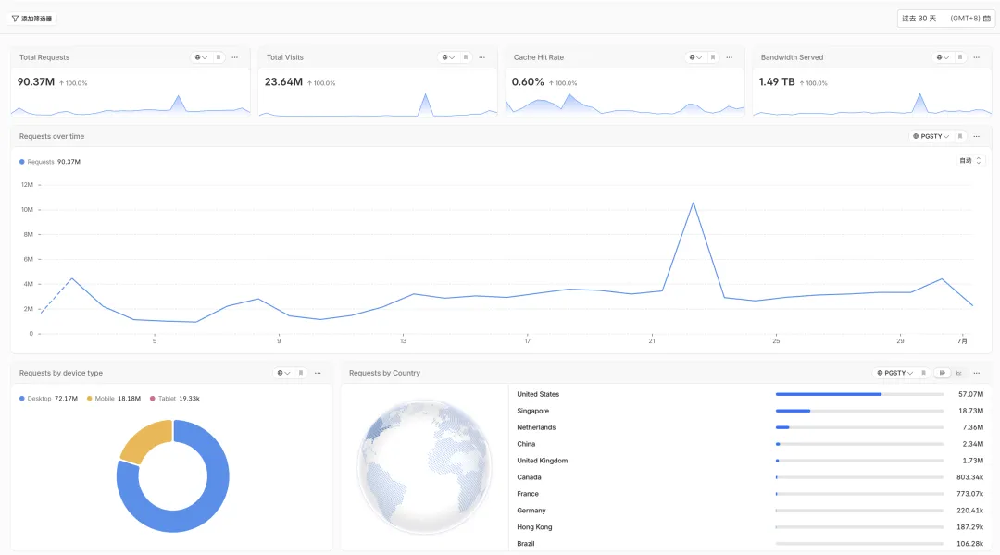

I send hundreds of millions of requests and terabytes of traffic through Cloudflare every month. It has never charged me a cent for that usage. My only actual cost at this scale is excess R2 storage, and even that comes to less than $1 a month.

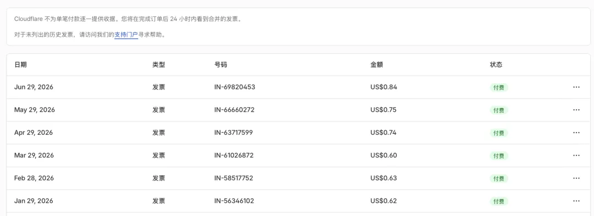

Cloudflare is both a "Cyber Buddha" and a shrewd business. It does not provide free authoritative DNS out of pure benevolence. DNS is the entry point.

Once you point your nameservers at Cloudflare, it gains the first foothold in the customer relationship. CDN, WAF, Pages, Workers, R2, and Zero Trust can follow naturally. Cloudflare does not need to make pocket change from DNS. It uses DNS to bring you onto its network.

Cloudflare has a $20-per-month Pro plan. Frankly, I do not need most of its Pro features, though a few additional monitoring metrics might be useful.

But I enjoy using Cloudflare and am happy with the service. Whether I need the features or not, I am willing to buy Pro just to support it. Its enterprise plan is not cheap, but if my company grows large enough, I would gladly buy that too.

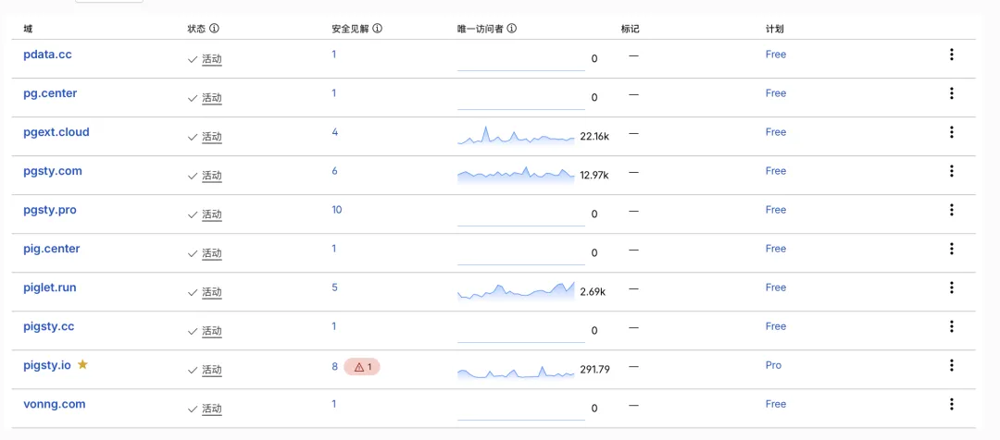

Alibaba Cloud's approach? More than 1 QPS? Sorry: throttled. Pay up. Want to see the most basic DNS monitoring? Sorry: pay up. And even paying is not enough—you need to enable yet another usage-based service just to see basic statistics. Every interaction feels monetized.

Alibaba Cloud tried to force me to pay RMB 48 a year by degrading the service. It was not much money; my first instinct was to throw it a few coins and make the nuisance go away.

Then I realized I could make it go away permanently. I would rather spend half an hour and be done with it.

Paying is not the problem. The bigger problem is that paying still buys you an inferior service.

--------

## Alibaba Cloud's Execution Is Sloppy

I have run into plenty of Alibaba Cloud bugs. Even in something as infrequently used as domain registration, I have hit several.

The most absurd happened at the beginning of the year. I added two domains, `pg.center` and `pig.center`, to my cart and checked out. Alibaba Cloud charged me for both but showed only one in my account.

I thought the missing purchase had failed, so I bought it again. I was charged again, and `pg.center` still did not appear. Customer support eventually had to retrieve it from the backend.

Strictly speaking, that was a domain-registration problem. But the DNS console has plenty of crude design choices too. It is just not a system I use often enough to complain about regularly.

Then there is the paid monitoring. Request count is the only metric it provides. Compared with Cloudflare, it is nothing.

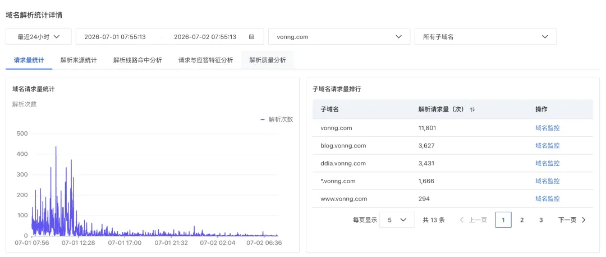

Alibaba Cloud calls itself China's leading cloud provider. Seeing it deliver one of the internet's most fundamental services this poorly is genuinely disappointing.

--------

## Epilogue

Here is a small coda from later that same day. My cousin had used Coze, ByteDance's AI app-building platform, to build herself an AI résumé. She wanted to publish it as a website and asked me how.

My first instinct was to tell her to buy a domain and an RMB 99 VPS from Alibaba Cloud, then let AI help her deploy it.

I stopped myself before the words came out.

Between wrangling Alibaba Cloud and completing an ICP filing, it could take ages. Instead, I told her to create Cloudflare and GitHub accounts. I gave her a few tutorial keywords: ask Doubao, ByteDance's consumer AI assistant, how to publish the project with GitHub Pages and attach a custom domain through Cloudflare. She had essentially no technical background, but after tinkering for an hour, she actually got it working.

Overseas infrastructure has evolved to become this simple, cheap, and accessible. Meanwhile, Chinese infrastructure providers still put up tollbooths and charge at every gate. It is painful to watch.

AI is erasing the barrier to creating things. Someone who cannot code can now ask AI to generate a page, adjust the styles, write the copy, handle the layout, and assemble a presentable personal website.

But what about the infrastructure barrier? Good infrastructure should feel like water, electricity, and gas. Open the tap and water flows. Flip the switch and the light comes on. DNS should be quiet, stable, cheap, and unobtrusive. Bad infrastructure constantly reminds you that it exists: upgrade here, activate a service there, pay for this metric, get throttled at that quota.

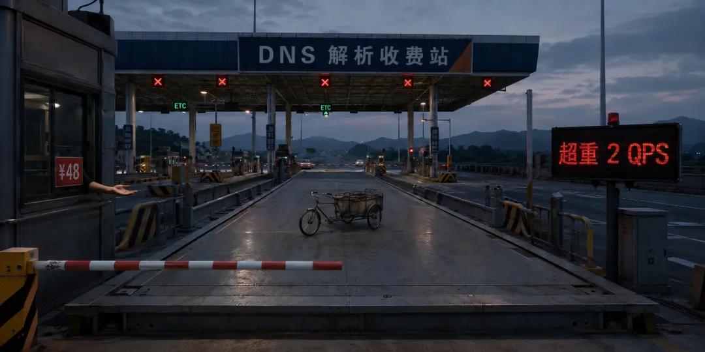

Alibaba Cloud increasingly feels like a row of tollbooths. Registration costs money. DNS costs money. Monitoring costs money. Logs cost money. It wants to charge for everything. Charging is not inherently wrong; commercial companies need to make money.

But you cannot deliver a crude basic experience while being exceptionally agile at monetization—baiting users with "free," then pulling the rug by degrading the service until they pay.

The biggest failure of Alibaba Cloud's email was not asking me for RMB 48. It was forcing me to make a purchasing decision.

Customers who stick with the defaults are the most profitable because they do not think, compare prices, or migrate. They quietly renew their domains every year and keep using the bundled DNS. But the moment you reach out for RMB 48, they stop and ask: why do I have to use you?

Once they ask that question, it is over. The alternative is Cloudflare: free and better.

Alibaba Cloud reminded me that I did not actually need it. It brought to mind a Chinese meme about pushy Taobao menswear sellers: I would have left well enough alone, but you had to come over, stick out your hand, and make a nuisance of yourself. Fine—I would rather spend the effort to move everything away.

If your domains are registered with Alibaba Cloud and still use its DNS, do not be a sucker. Create a Cloudflare account. You can leave the registrar and ICP-filing shell in China while moving the DNS control plane elsewhere. Export the zone, import it into Cloudflare, verify the records, and change the nameservers. It takes minutes, gives you a better service, and costs nothing.

We should vote with our feet whenever we can and reward better providers. Otherwise, once a bad design proves profitable, it becomes the new norm.

Thank you, Alibaba Cloud. With a 1.15 QPS red card and an RMB 48 bill, you reminded me that I did not actually need you.
