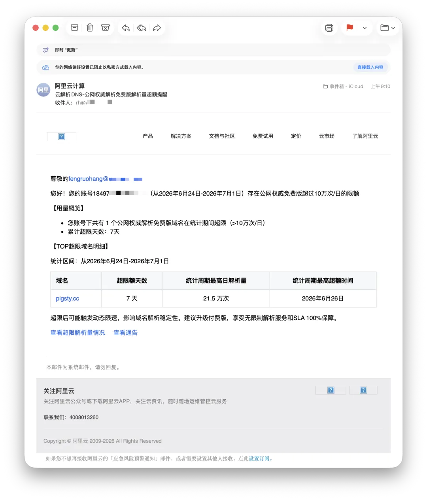
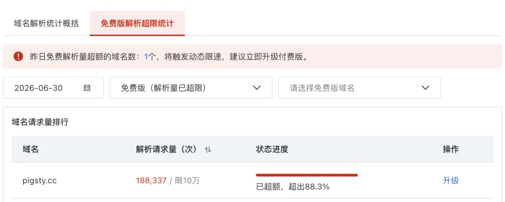
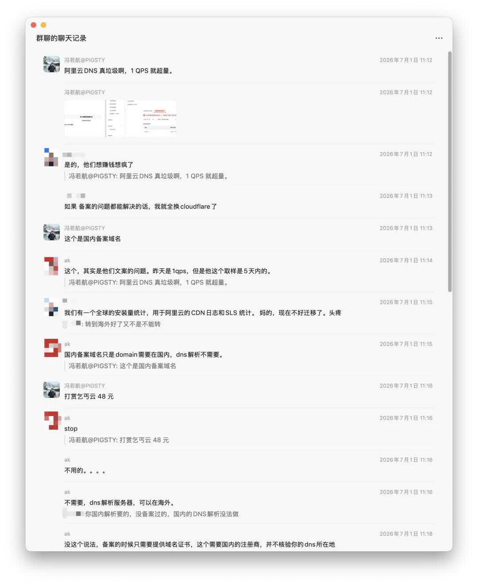
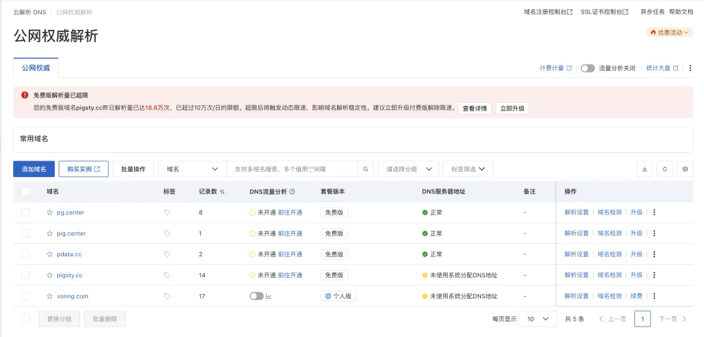
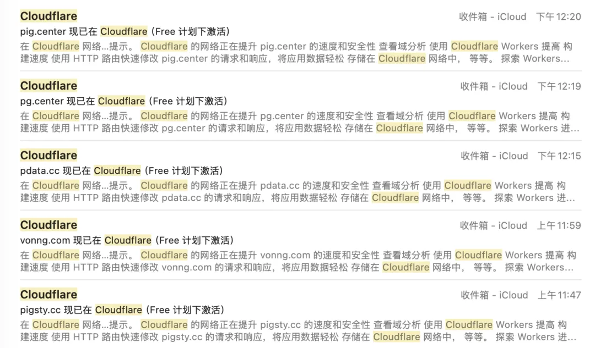
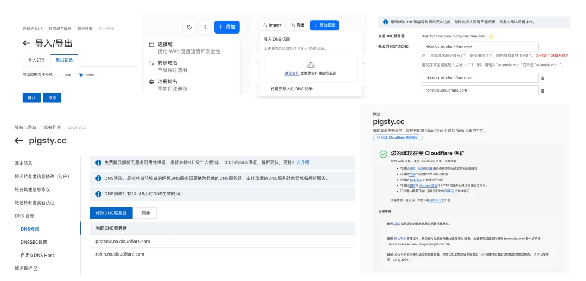
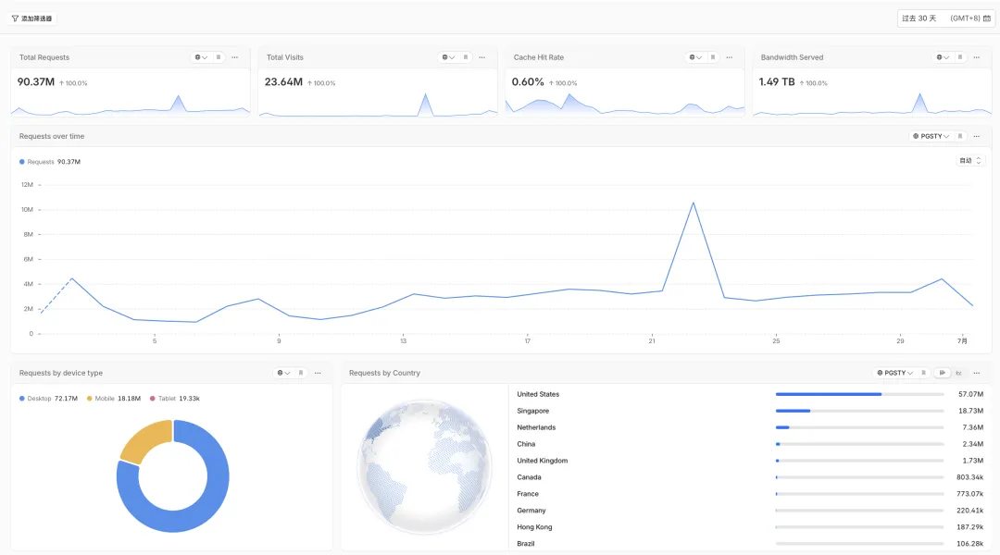
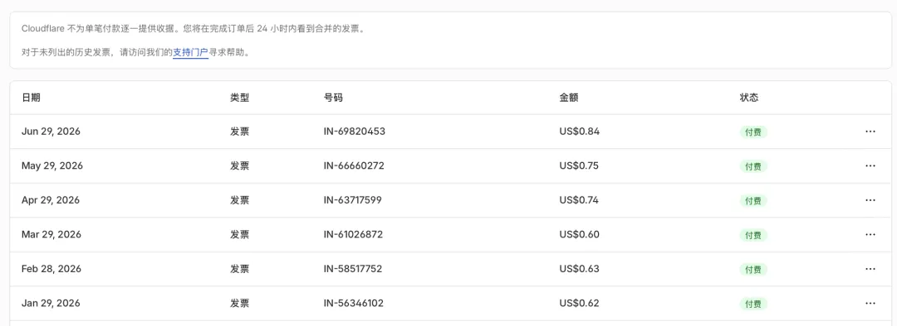
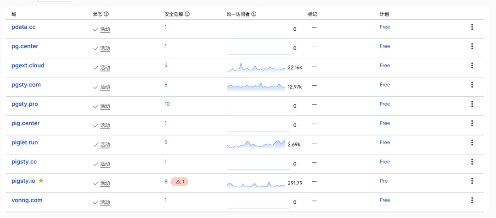
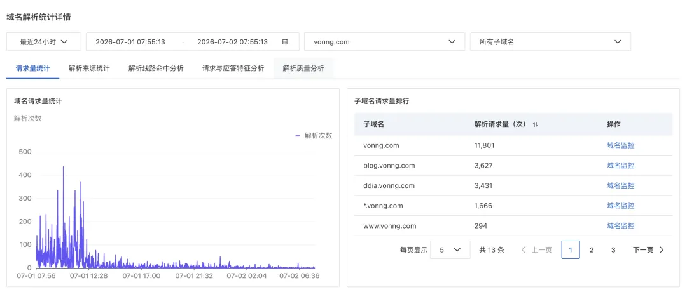

老冯用了十多年阿里云域名和 DNS 服务了，早上收到一封邮件，以前从来没见过的品种。

阿里云通知我，有一个域名的解析次数超过了每日 10 万次的限额，被限流了。

想不被限流也行，掏钱买 48 块钱一年的付费版。或者还有 3000 元/年的“企业版”。

没几个钱，但那一瞬间我的感觉就像吃了一只苍蝇。

这还不是哪个远古套餐的历史遗留问题。阿里云公告写着：从 2026 年 6 月 24 日起，
公网权威解析免费版新增单域名每日 10 万次解析量限额，超限后可能触发动态限速，包括响应延迟、丢包等。
老冯应该是第一波被这个新规则打中的用户。

每天 10 万次解析听上去是个挺唬人的数字。可你把它摊到每天的 86400 秒，QPS 是 **1.15**。 一秒钟一次多一点点，就这么点量。
随便一个博客小站被爬两下，或者攻击者写个 while 循环几秒就打没了。
然后国内云一哥的核心服务，啪一下就给你亮了红牌，然后提示你升级付费版。

这个数字本身就很有喜剧效果。更有意思的是，官方说这是为了保障全球解析链路稳定性。
但 DNS 基础设施的稳定性，核心问题通常是峰值、突发、并发、攻击流量，不是拿日总量去卡一个稳定小站。按“日解析量”封顶，惩罚的恰恰是持续、稳定、真实使用的小客户。

老冯不稀罕这 48 块钱。就在我花钱消灾之前，我先发到群里吐了个槽。云计算群老朋友——人称云计算铁公鸡的 FinOps 大师 AK 王喊停了我。

--------

## 锁定其实是幻觉

在没用过 Cloudflare 之前，老冯觉得阿里云这个 DNS 解析用着也还可以。

但是用过 Cloudflare 之后，就觉得这东西太拉胯了，很想搬走。

但是因为域名注册在阿里云上面，备案也在阿里云上面，我一直以为买域名这件事，注册、备案、解析是焊在一起的一整块，想着不太好搬，有些麻烦，所以就一直放在那儿。

王老板点醒我说，其实域名的备案和 DNS 解析是两回事。备案即便放在国内，解析也完全可以放在其他 DNS 上，比如 Cloudflare。王老板称他早前做过调研，DNS 做得最好的是 Cloudflare 和 AWS，而且 CF 不收钱，所以他早就把大量域名解析都切过去了。

Cloudflare 号称赛博佛祖，不仅服务质量好，而且分文不取。就算你的域名不是在 Cloudflare 上注册的，它也乐意帮你免费解析。而且就算免费档位，也提供许多实用的增值服务，比如监控指标、托管 Pages、DNSSEC 之类的，而国内这几个云通常是放在“收费版”里面的。

我研究了下，还真是这么回事，本来还以为要备案就必须用阿里云的解析，结果现在知道了可以拆开单独用别家的，那我还等什么？

一不做二不休，半个小时不到，俺就把阿里云上的五个域名解析都迁到了 Cloudflare 上。

--------

## 搬迁 DNS 很简单

搬迁 DNS 解析的过程简单到没什么好说的，有手就行。当然，还得有 Cloudflare 账号，两分钟一个。

1. 在阿里云 DNS 解析控制台里导出 Zone 格式的解析记录，就是一个 TXT 文件。
2. 在 Cloudflare 点右上角“添加域名”，选择“连接域名”，输入你的域名，它会自动扫描导入你的 DNS 记录。当然稳妥起见，你还是把刚才导出的 TXT 整个导入进去。好了，Cloudflare 这边的解析就配置好了。
3. 接下来要回到阿里云，这次是在“域名”的控制台里，点击“管理”，然后“修改 DNS 服务器”，把 Cloudflare 给你的两个 DNS 服务器名称填进去，确认就好了。

然后大概一分钟左右，Cloudflare 那边就确认完毕，接管域名解析了。

**零停机，理论上对生产没啥影响**，只要迁移前两边的解析记录保持一致，切换 NS 是无缝的。域名壳子我还先留在阿里云——钱都付过了，快到期了再搬走——但日常的解析和管理，现在全部收拢到 Cloudflare。清爽多了。

顺便提一嘴，如果你用依赖运营商分线路解析这类中国特色 DNS 解析功能，王老板说华为云提供类似的免费服务。

--------

## 吃相实在是太难看

真正让我动了搬家念头的，不是 DNS 收费，而是阿里云那记 1 QPS 闷棍背后的 **态度**。

想想 1 QPS 这个阈值意味着什么。它意味着在阿里云的账本里，连域名解析这种“互联网电话簿”级别的服务，都得是一个利润中心。你都已经掏了域名的钱了，连给个无限接近零成本的解析都不愿意。这个阈值本身，就是态度的体现。

AWS Route 53 从第一天起就是收费服务。Hosted Zone 前 25 个每月 0.5 美元一个，标准查询前 10 亿次每百万次 0.4 美元。按 10 万次/天算，一年是 3650 万次查询，查询费 14.6 美元，再加一个 zone 每年 6 美元，总计约 20.6 美元。折成人民币，比阿里云 48 块还贵。
可为什么没人觉得 AWS 在讹人？因为它的电表第一天就摆在明处。你用多少，账单多一点，服务不会因为你碰到某个免费档红线就开始延迟、丢包。它是公用事业计量，不是默认免费、事后封顶、超限劣化。

国际上 DNS 大致有两种正常收法。

第一种，是注册商附赠制。域名买了，DNS 管理跟着给你，不按解析次数掐脖子。Cloudflare 甚至给其他注册商的域名提供免费 DNS 解析。

第二种，是云厂商公用事业计量制。AWS Route 53、Google Cloud DNS、Azure DNS 都是这个路数：zone 月费加查询量计费，按百万次查询收几毛美元。Google Cloud DNS 的常规查询价格是每百万次 0.40 美元起，Azure DNS 的计费模型也是按托管 DNS zone 和 DNS queries 来算。

这两种模式都合理。要么真免费。要么电表从第一天就看得见。

阿里云这套尴尬在第三种：默认捆绑 “免费”，事后追加封顶，超限不是账单变大，而是 DNS 解析限速。
DNS 一旦劣化，用户看到的是什么？不是“阿里云 DNS 免费版超限”。而是“你的网站变慢了”。或者“你的网站偶发打不开”。
这个锅很难第一时间追到 DNS 服务商头上。对普通用户来说，DNS 是不可见层。你用解析延迟和丢包来做催缴按钮，本质上就是拿基础可用性当人质。

默认免费、事后加盖、超限动态限速、用基础可用性催缴，这不是行业惯例，这是阿里云自己试出来的一条坏路。

这才是我觉得恶心的地方。不是收费恶心。是这种收法太恶心。

--------

## 没有对比就没有伤害

看看号称 “赛博佛祖” 的 Cloudflare，阿里云 DNS 解析显得面目可憎。

Cloudflare 的免费 Plan 里塞了什么？解析、监控、DNSSEC、扛 DDoS，一大堆增值服务。解析比阿里云好得不是一星半点，功能更全面，界面更清爽，指标更全面，而且还免费。
甚至就连你的域名不是在它家买的，它都乐意免费为你提供全球范围内顶级质量的 DNS 解析服务。

老冯每个月从它那里走亿级请求、TB 级流量，一分钱都没收我的。我这么大用量，每个月实际开销也就是 R2 超量的存储，每个月 1 美元都不到。

Cloudflare 既是 “赛博佛祖”，也是一个精明的商人，它免费给你权威 DNS，不是因为它有菩萨心肠，而是因为 DNS 是入口。
你把 NS 切给它，它就拿到了客户关系的第一层入口。后面 CDN、WAF、Pages、Workers、R2、Zero Trust，都是顺水推舟。
它不靠 DNS 这一口小钱吃饭。它靠 DNS 把你带进它的网络。

Cloudflare 有个 20 美元/月的 Pro 档位，老实说，我也用不上什么 Pro 特性，多几个监控指标勉强能用上。
但我觉得 Cloudflare 的服务用得很开心，我觉得很满意，不管用得上用不上，买一个支持一下。
虽然那个企业版不便宜，但以后老冯公司做大了，也很乐意去买一个。

阿里云呢？请求量 1 QPS？对不起，限流，掏钱。想看个最基础的解析监控？
对不起，掏钱，掏钱还不行，看个基础统计还要额外开通个什么按量付费服务，整个掉到钱眼里了。

阿里云用服务劣化逼我交 48 元/年，确实没几块钱，叫花子来讹人了，赶紧打发走。
什么，还有给它彻底赶走的选项？那我宁愿花半小时一劳永逸摆脱你。

花钱不是问题，主要的问题是，掏了钱你买到的也是拉垮的服务。

--------

## 阿里云做得太糙了

老冯在阿里云已经踩过不少 BUG 了，就域名这种一个极低频系统，我都撞上过几次。

最离谱的一次是年初，我在阿里云买域名，一次选了两个 `pg.center` 和 `pig.center` 加入到购物车，结果结账完了扣了两个的钱却只显示一个。
我以为没买成功，又买了一次，又扣了一次款，还是没有出现（`pg.center` 这个），最后后台找客服才捞出来。
严格来说这是域名的部分，DNS 控制台里很多设计也很山炮，只是这种低频系统平时懒得骂。

然后这个付费才能看的监控，总共就这一个请求量监控。跟 Cloudflare 一比，啥也不是。

阿里云号称中国云计算一哥，但互联网最核心的基础服务做成这个样子，这让我感觉很遗憾。

--------

## 尾声

最后讲个小插曲，正好是今天这个事之后发生的。我表妹用扣子（Coze）给自己做了个 AI 简历，想弄成网站发布出来，问我怎么整。我本来的第一反应是让她去阿里云买个域名、买台 99 VPS，再让 AI 帮着部署

话到嘴边又咽回去了。

我想着在阿里云折腾这些，再加个什么备案，等你搞完都猴年马月去了。我说这样，你去注册个 Cloudflare + GitHub，我给你个教程关键词，就是让豆包教你怎么把这坨东西用 GitHub Pages 发布，然后绑定一个 Cloudflare 自定义域名。结果她这么一个基本零技术背景的纯小白折腾了一个小时，还真就搞定了。

当海外的基础设施已经进化到如此简单、便宜、普惠的时候，国内的基础设施厂商还是一副设卡收费的难看吃相，这实在是让人扼腕。

AI 正在把创造门槛抹平。不会写代码的人，现在也可以让 AI 帮她生成页面、改样式、写文案、做排版，最后拼出一个能看的个人网站。
但基础设施门槛呢？好的基础设施，应该像水电煤。水龙头打开就有水，电灯开关按下去就有光，DNS 解析就应该安静、稳定、便宜、不烦人。糟糕的基础设施，才会提醒你它的存在：这里要升级，那里要开通，这个指标要收费，那个额度要限流。

阿里云给我的感觉，则越来越像一排收费站。注册要收，解析要收，监控要收，日志要收，什么都想收。收钱本身没问题，商业公司当然要赚钱。

但你不能基础体验粗糙，收费动作却异常敏捷，靠免费钓鱼然后 Rug-Pull 服务劣化逼单。

阿里云这封邮件最失败的地方，不是想收 48 块钱。它真正失败的地方，是强迫我做了一次购买决策。

默认值里的用户最赚钱，因为他不思考、不比价、不迁移。你每年悄悄续费域名，他也就顺手继续用你的 DNS。可一旦你伸手讨 48 块钱，他就会停下来问一句：我为什么非得用你？

这一问，事情就结束了。因为对手是 Cloudflare：免费，而且更好。

是它提醒了我：我其实可以不用你。这件事让我想起淘宝男装的梗。本来你不提醒我还好，可你偏要跑过来，伸着手在我面前讨要，讨得人嫌。那我宁可花点功夫把所有东西全搬走。

如果你的域名也买在阿里云上，还在用这个 DNS 解析服务，可别去当冤大头了。注册个 Cloudflare 吧。备案域名的注册商壳子可以先留在国内，但 DNS 解析这层控制面，完全可以拆出去。导出 Zone，导入 Cloudflare，核对记录，改 nameserver，几分钟搞定，服务更好还不要钱。

大家还是应该力所能及地用脚投票，帮助良币驱逐劣币，这样才会有越来越好的服务环境。否则坏设计一旦跑通，就会变成新惯例。

谢谢阿里云。用一封 1.15 QPS 的红牌、48 块钱的账单，提醒了我：我其实可以不用你。

