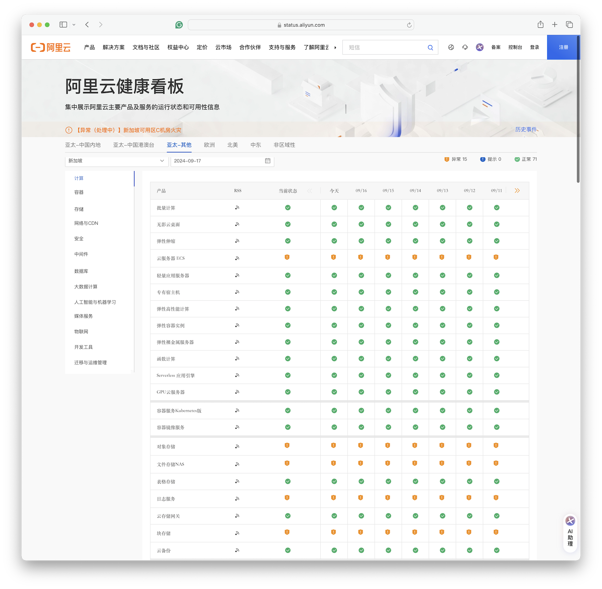
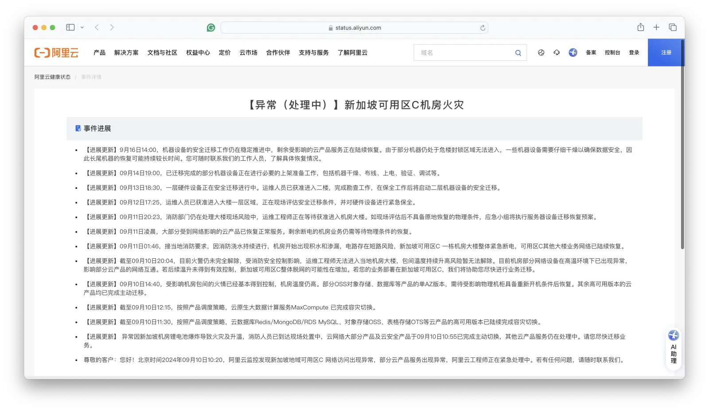
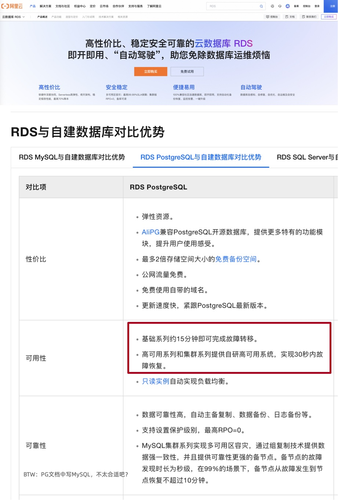
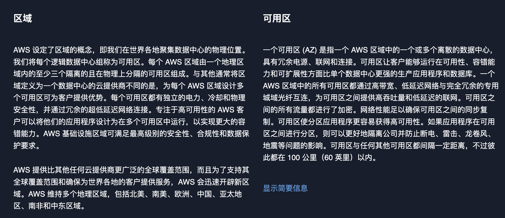
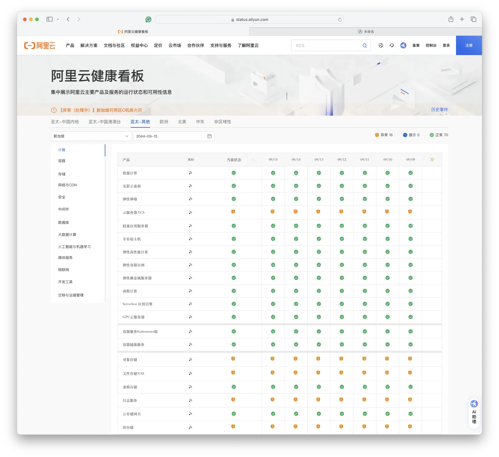

On September 10, 2024, Alibaba-Cloud's Singapore Availability Zone C data center experienced a fire caused by lithium battery explosion. It's been a week now and services have not been fully restored yet.
According to the monthly SLA availability calculation (7 days+/30 days≈75%), **service availability isn't even reaching one 8, let alone multiple 9s**, and it's still declining.
Of course, availability at 88% or 99% is now a minor issue — the real question is: can the data stored in a single availability zone be recovered?

> As of 09-17, key services like ECS, OSS, EBS, NAS, RDS are still in abnormal state

Generally speaking, if it's just a small-scale fire in the data center, the problem wouldn't be particularly severe since power and UPS are usually placed in separate rooms, isolated from server rooms.
But once fire suppression sprinklers are triggered, the problem becomes serious: once servers experience a comprehensive power outage, recovery time is basically measured in days;
If flooded, it's not just about availability anymore, but whether data can be recovered — a matter of **data integrity**.

According to current announcements, a batch of servers were removed on the evening of the 14th and were being dried, still not completed by the 16th. From this "drying" description, there's a high probability of water damage.
Although we cannot definitively state the facts before any official announcement, based on common sense, data consistency damage is highly probable — it's just a matter of how much is lost.
So the impact of this Singapore fire incident is estimated to be on the same scale or even larger than the [Hong Kong PCCW data center major failure](https://help.aliyun.com/noticelist/articleid/1061819219.html) at the end of 2022 and the [Double 11 global unavailability](/cloud/aliyun/) failure in 2023.

Natural disasters and human misfortunes are unpredictable. The probability of failures won't drop to zero. What's important is what experience and lessons we can learn from these failures?

--------

## Disaster Recovery Performance

Having an entire data center catch fire is very unfortunate. Most users can only rely on off-site cold backups to survive, or simply accept their bad luck. We could discuss whether lithium batteries or lead-acid batteries are better, or how UPS power should be laid out, but blaming Alibaba-Cloud for these issues is meaningless.

What is meaningful is: in this **availability zone level failure**, how did products that claim to be "**cross-availability zone disaster recovery high availability**", such as RDS cloud database, actually perform? **Failures give us an opportunity to verify the disaster recovery capabilities of these products with real performance.**

The core metrics of disaster recovery are **RTO** (Recovery Time Objective) and **RPO** (Recovery Point Objective), not some multiple 9s availability — the logic is simple: you can achieve 100% availability just by luck without failures. But what truly tests disaster recovery capability is the recovery speed and effectiveness after disasters occur.

| Configuration Strategy | RTO | RPO |
|:---|---|:---|
| Single + <i class="fa-solid fa-music text-danger"></i> Do nothing | <i class="fas fa-circle-xmark text-danger"></i> **Data permanently lost, unrecoverable** | <i class="fas fa-circle-xmark text-danger"></i> **All data lost** |
| Single + <i class="fa-solid fa-copy text-secondary"></i> Basic backup | <i class="fa-solid fa-triangle-exclamation text-secondary"></i> Depends on backup size & bandwidth (hours) | <i class="fa-solid fa-triangle-exclamation text-secondary"></i> Data after last backup lost (hours to days) |
| Single + <i class="fa-solid fa-copy text-primary"></i> Basic backup + <i class="fa-solid fa-clock-rotate-left text-primary"></i> WAL archiving | <i class="fa-solid fa-triangle-exclamation text-primary"></i> Depends on backup size & bandwidth (hours) | <i class="fa-solid fa-triangle-exclamation text-primary"></i> Last unarchived data lost (tens of MB) |
| Primary-Secondary + <i class="fa-solid fa-wrench text-secondary"></i> Manual failover | <i class="fa-solid fa-triangle-exclamation text-primary"></i> Ten minutes | <i class="fa-solid fa-circle-check text-primary"></i> Data in replication lag lost (about 100KB) |
| Primary-Secondary + <i class="fa-solid fa-infinity text-primary"></i> Automatic failover | <i class="fa-solid fa-circle-check text-primary"></i> Within one minute | <i class="fa-solid fa-circle-check text-primary"></i> Data in replication lag lost (about 100KB) |
| Primary-Secondary + <i class="fa-solid fa-infinity text-primary"></i> Automatic failover + <i class="fa-solid fa-rotate text-success"></i> Synchronous commit | <i class="fa-solid fa-circle-check text-success"></i> Within one minute | <i class="fa-solid fa-circle-check text-success"></i> No data loss |

After all, the multiple 9s availability metrics specified in [**SLA**](/cloud/sla/) are **not actual historical performance**, but promises to compensate with XX yuan vouchers if this level isn't achieved. To examine the real disaster recovery capability of products, we need to rely on drills or actual performance under real disasters.

But what about actual performance? In this Singapore fire, how long did the entire availability zone RDS service switchover take — multi-AZ high availability RDS services completed switching around 11:30, **taking 70 minutes** (failure started at 10:20), meaning **RTO < 70 minutes**.

This metric shows improvement compared to the **133** minutes for RDS switching in the 2022 Hong Kong Zone C failure. But compared to Alibaba-Cloud's own stated metrics (**RTO < 30 seconds**), it's still off by two orders of magnitude.

As for single availability zone basic RDS services, official documentation says **RTO < 15 minutes**, but the actual situation is: single availability zone RDS are approaching their seventh day memorial. **RTO > 7 days**, and whether RTO and RPO will become **infinity ∞** (completely lost and unrecoverable), we'll have to wait for official news.

--------

## Accurately Labeling Disaster Recovery Metrics

[Alibaba-Cloud official documentation](https://help.aliyun.com/zh/rds/product-overview/competitive-advantages-of-apsaradb-rds-instances-over-self-managed-databases) claims: RDS service provides multi-availability zone disaster recovery, "*High-availability series and cluster series provide self-developed high-availability systems, achieving failure recovery within **30 seconds**. Basic series can complete failover in about **15 minutes**.*"
That is, high-availability RDS has RTO < 30s, basic single-machine version has RTO < 15min, which are reasonable metrics with no issues.

I believe when a single cluster's primary instance experiences single-machine hardware failure, Alibaba-Cloud RDS can achieve the above disaster recovery metrics — but since this claims "**multi-availability zone disaster recovery**", users' reasonable expectation is that RDS failover can also achieve this when an entire availability zone fails.

Availability zone disaster recovery is a reasonable requirement, especially considering Alibaba-Cloud has experienced several availability zone-wide failures in just the past year (**[even one global/all-service level failure](/cloud/aliyun/)**.

> 2024-09-10 [**Singapore Zone C Data Center Fire**](https://status.aliyun.com/#/eventDetail?eventId=21)
>
> 2024-07-02 [**Shanghai Zone N Network Access Abnormal**](https://status.aliyun.com/#/eventDetail?eventId=20)
>
> 2024-04-27 [Zhejiang Region Access to Other Regions or Other Regions Access to Hangzhou OSS, SLS Service Abnormal](https://status.aliyun.com/#/eventDetail?eventId=19)
>
> 2024-04-25 [**Singapore Region Zone C Partial Cloud Product Service Abnormal**](https://status.aliyun.com/#/eventDetail?eventId=18)
>
> 2023-11-27 [**Alibaba-Cloud Partial Region Cloud Database Console Access Abnormal**](https://status.aliyun.com/#/eventDetail?eventId=17)
>
> 2023-11-12 [**Alibaba-Cloud Product Console Service Abnormal**](https://status.aliyun.com/#/eventDetail?eventId=16) ([Global Major Failure](/cloud/aliyun/))
>
> 2023-11-09 [Mainland China Access to Hong Kong, Singapore Region Partial EIP Inaccessible](https://status.aliyun.com/#/eventDetail?eventId=15)
>
> 2023-10-12 [Alibaba-Cloud Hangzhou Region Zone J, Hangzhou Financial Cloud Zone J Network Access Abnormal](https://status.aliyun.com/#/eventDetail?eventId=14)
>
> 2023-07-31 [Heavy Rain Affects Beijing Fangshan Region NO190 Data Center](https://status.aliyun.com/#/eventDetail?eventId=13)
>
> 2023-06-21 [**Alibaba-Cloud Beijing Region Zone I Network Access Abnormal**](https://status.aliyun.com/#/eventDetail?eventId=12)
>
> 2023-06-20 [Partial Region Telecom Network Access Abnormal](https://status.aliyun.com/#/eventDetail?eventId=11)
>
> 2023-06-16 [Mobile Network Access Abnormal](https://status.aliyun.com/#/eventDetail?eventId=10)
>
> 2023-06-13 [Alibaba-Cloud Guangzhou Region Public Network Access Abnormal](https://status.aliyun.com/#/eventDetail?eventId=9)
>
> 2023-06-05 [Hong Kong Zone D Certain Data Center Cabinet Abnormal](https://status.aliyun.com/#/eventDetail?eventId=8)
>
> 2023-05-31 [Alibaba-Cloud Access to Jiangsu Mobile Region Network Abnormal](https://status.aliyun.com/#/eventDetail?eventId=7)
>
> 2023-05-18 [Alibaba-Cloud Hangzhou Region ECS Console Service Abnormal](https://status.aliyun.com/#/eventDetail?eventId=6)
>
> 2023-04-27 [Partial Beijing Mobile (formerly China Tietong) Users Network Access Packet Loss](https://status.aliyun.com/#/eventDetail?eventId=5)
>
> 2023-04-26 [Hangzhou Region Container Registry ACR Service Abnormal](https://status.aliyun.com/#/eventDetail?eventId=4)
>
> 2023-03-01 [Shenzhen Zone A Partial ECS Access to Local DNS Abnormal](https://status.aliyun.com/#/eventDetail?eventId=3)
>
> 2023-02-18 [Alibaba-Cloud Guangzhou Region Network Abnormal](https://status.aliyun.com/#/eventDetail?eventId=2)
>
> 2022-12-25 [**Alibaba-Cloud Hong Kong Region PCCW Data Center Cooling Equipment Failure**](https://status.aliyun.com/#/eventDetail?eventId=1)

**So why can metrics achievable for single RDS cluster failures not be achieved during availability zone level failures?** From historical failures, we can **infer** — the infrastructure that database high availability depends on is likely single-AZ deployed itself. Including what was shown in the previous [Hong Kong PCCW data center failure](https://www.aliyun.com/noticelist/articleid/1061819219.html): single availability zone failures quickly spread to the entire Region — **because the control plane itself is not multi-availability zone disaster recovery**.

> Starting from 10:17 on December 18, some RDS instances in Alibaba-Cloud Hong Kong Region Zone C began showing unavailability alarms. As the scope of affected hosts in this zone expanded, the number of instances with service anomalies increased accordingly. Engineers initiated the database emergency switching plan process. By 12:30, most cross-availability zone instances of RDS MySQL, Redis, MongoDB, DTS had completed cross-availability zone switching. Some single availability zone instances and single availability zone high-availability instances, due to dependence on single availability zone data backup, only a few instances achieved effective migration. A small number of RDS instances supporting cross-availability zone switching didn't complete switching in time. **Investigation revealed these RDS instances depended on proxy services deployed in Hong Kong Region Zone C**. Due to proxy service unavailability, RDS instances couldn't be accessed through proxy addresses. We assisted relevant customers to recover by temporarily switching to using RDS primary instance addresses for access. As the data center cooling equipment recovered, most database instances returned to normal around 21:30. For single-machine instances affected by the failure and high-availability instances with both primary and secondary in Hong Kong Region Zone C, we provided temporary recovery solutions such as instance cloning and instance migration. However, due to underlying service resource limitations, some instance migration recovery processes encountered abnormalities and required longer time to resolve.
>
> The ECS control system has dual data center disaster recovery in zones B and C. After Zone C failure, Zone B provided external services. Due to many Zone C customers purchasing new instances in other Hong Kong zones, combined with traffic from Zone C ECS instance recovery actions, Zone B control service resources became insufficient. The newly expanded ECS control system depended on middleware services deployed in Zone C data center during startup, resulting in inability to expand for an extended period. The custom image data service that ECS control depends on **relied on single-AZ redundancy version OSS service in Zone C**, causing customer newly purchased instances to fail to start.

I suggest cloud products including RDS should be truthful and accurately label the RTO and RPO performance in historical failure cases, as well as actual performance under real availability zone disasters. Don't vaguely claim "***30 seconds/15 minutes recovery, no data loss, multi-availability zone disaster recovery***", promising things you can't deliver.

--------

## What Exactly is Alibaba-Cloud's Availability Zone?

In this Singapore Zone C failure, as well as the previous Hong Kong Zone C failure, one problem Alibaba-Cloud demonstrated is that single data center failures spread to the entire availability zone, and single availability zone failures affect the entire region.

In cloud computing, **Region** and **Availability Zone (AZ)** are very basic concepts that users familiar with AWS won't find unfamiliar.
According to [AWS's definition](https://aws.amazon.com/cn/about-aws/global-infrastructure/regions_az): a **Region** contains multiple availability zones, each availability zone is one or more independent data centers.

For AWS, there aren't many Regions - for example, the US has only four regions, but each region has [two or three availability zones](https://gist.github.com/karstenmueller/98381c897178a260be8c08f98ffe2c3e), and one availability zone (AZ) typically corresponds to multiple data centers (DC).
AWS's practice is to control DC scale at 80,000 hosts, with distances between DCs of 70-100 kilometers. This forms a three-tier relationship of Region - AZ - DC.

However, [Alibaba-Cloud](https://help.aliyun.com/document_detail/40654.html) seems different - they lack the key concept of **Data Center (DC)**.
Therefore, **Availability Zone (AZ)** seems to be a data center, while **Region** corresponds to AWS's upper level **Availability Zone (AZ) concept**.

They've elevated the original AZ to Region, and elevated the original DC (or part of a DC, one floor?) to availability zone.

We can't say what motivated Alibaba-Cloud's design. One possible speculation is: originally Alibaba-Cloud might have just set up North China, East China, South China, and Western regions domestically, but to make reports more impressive (look, AWS only has 4 Regions in the US, we have 14 domestically!), it became what it is now.

--------

## Cloud Vendors Have a Responsibility to Promote Best Practices

TBD

Can a cloud that provides single-az object storage services be evaluated as: either stupid or malicious?

Cloud vendors have a responsibility to promote good practices, otherwise when problems occur, it's still "all the cloud's fault"

If what you give others by default is local three-replica redundancy, most users will choose your default option.

It depends on whether there's disclosure. Without disclosure, that's malicious. With disclosure, can long-tail users understand? But actually many people don't understand.

You're already doing three-replica storage, why not put one replica in another DC or another AZ?
You're already charging hundreds of times markup on storage, why not spend a little more to do same-city redundancy? Is it to save on the data cross-AZ replication traffic fees?

--------

## Please Be Serious About Health Status Pages

TBD

I've heard of weather forecasts, but never failure forecasts. But Alibaba-Cloud's health dashboard provides us with this magical ability — you can select future dates, and future dates still have service health status data. For example, you can check service health status 20 years from now —

The future "failure forecast" data appears to be populated with current status. So services currently in failure state remain abnormal in the future. If you select 20 years later, you can still see the current Singapore major failure's health status as "abnormal".

**Perhaps** Alibaba-Cloud wants to use this subtle way to tell users: ***Data in Singapore region single availability zone is gone, Gone Forever, don't count on recovering it***. Of course, a more reasonable inference is: this isn't some failure forecast, this health dashboard was made by an intern. Completely without design review, without QA testing, without considering edge conditions, just slapped together and launched.

--------

## Cloud is the New Single Point of Failure, What to Do?

TBD

The three elements of information security CIA: Confidentiality, Integrity, Availability. Recently Alibaba has encountered major failures in all of them.

First there was [Alibaba-Cloud Drive's catastrophic BUG](https://mp.weixin.qq.com/s/C7XGgGmzvMjKJGbBGVmrzw) leaking private photos and breaking confidentiality;

Now this availability zone failure, shattering the multi-availability zone/single availability zone availability myth, even threatening the lifeline — data integrity.

--------

## Further Reading

[Is It Time to Abandon Cloud Computing?](/cloud/exit/)

[Cloud-Exit Odyssey](/cloud/odyssey/)

[The End of FinOps is Cloud-Exit](/cloud/finops/)

[Why Cloud Computing Isn't as Profitable as Digging Sand?](/cloud/profit/)

[Is Cloud SLA Just a Placebo?](/cloud/sla/)

[Is Cloud Storage a Pig Butchering Scam?](/cloud/ebs/)

[Is Cloud Database an IQ Tax?](/cloud/rds/)

[Paradigm Shift: From Cloud to Local First](/cloud/paradigm/)

[Tencent Cloud CDN: From Getting Started to Giving Up](/cloud/cdn/)

------

[【Alibaba】Epic Cloud Computing Disaster is Here](http://mp.weixin.qq.com/s?__biz=MzU5ODAyNTM5Ng==&mid=2247486452&idx=1&sn=29cff4ee30b90483bd0a4f0963876f28&chksm=fe4b3e2fc93cb739af6ce49cffa4fa3d010781190d99d3052b4dbfa87d28c0386f44667e4908#rd)

[Grab Alibaba-Cloud's Benefits While You Can, 5000 Yuan Cloud Server for 300](http://mp.weixin.qq.com/s?__biz=MzU5ODAyNTM5Ng==&mid=2247486438&idx=1&sn=b2c489675134d4e84fbc249089777cb4&chksm=fe4b3e3dc93cb72b5d0d90ef61011dda5a09e5f08d96c8cca87148706451c859777162bd18da#rd)

[How Cloud Vendors See Customers: Poor, Idle, and Love-Starved](http://mp.weixin.qq.com/s?__biz=MzU5ODAyNTM5Ng==&mid=2247486387&idx=1&sn=20ac92e33ed5a6b8e3120e99aefaf1cc&chksm=fe4b3e68c93cb77ed5b627c8caf78666cab9deafc18dacf528e51411682e616b4df1deab87f9&scene=21#wechat_redirect)

[Alibaba-Cloud's Failures Could Happen on Other Clouds Too, and Data Could Be Lost](http://mp.weixin.qq.com/s?__biz=MzkwODMyMDE2NQ==&mid=2247483770&idx=1&sn=723c865ff27fd0ceace1d8fb2c76ddca&chksm=c0ca8db0f7bd04a63f79aba185e093bbb0ab5763b1f91f58cfc86551daf7e47bd6627dd8c73b#rd)

[Chinese Cloud Services Going Global? Fix the Status Page First](http://mp.weixin.qq.com/s?__biz=MzkwODMyMDE2NQ==&mid=2247483764&idx=1&sn=8aebb4053257fac48f71b75a957153ad&chksm=c0ca8dbef7bd04a816feba238a2232abdc02b5ccdb405f32217455dc3bf3a1811bd4ff8815af#rd)

[Can We Trust Alibaba-Cloud's Failure Handling?](http://mp.weixin.qq.com/s?__biz=MzkwODMyMDE2NQ==&mid=2247483759&idx=1&sn=eb12dfe4df37c22aadd120676391f4cb&chksm=c0ca8da5f7bd04b3a024111b5c3be9f273c70087cc986937e72e12d7a0fe496753a88568afe9#rd)

[An Open Letter to Alibaba-Cloud](http://mp.weixin.qq.com/s?__biz=MzkwODMyMDE2NQ==&mid=2247483762&idx=1&sn=903405e0b64037f1b7d44b23f0c9b08d&chksm=c0ca8db8f7bd04ae55f719df891d811d05269dac3a8e0a894d23292e06674058c943712672f5#rd)

[Platform Software Should Be as Rigorous as Mathematics --- Discussion with Alibaba-Cloud RAM Team](http://mp.weixin.qq.com/s?__biz=MzkwODMyMDE2NQ==&mid=2247484048&idx=1&sn=b57839c9dc85fe3dc6eaac01ff37b995&chksm=c0ca8e5af7bd074ca5221de40c47b82378a8ca20f348ab1c80de7d244679733ee80e29cb3381#rd)

[Chinese Software Practitioners Beaten by the Pharmaceutical Industry](http://mp.weixin.qq.com/s?__biz=MzkwODMyMDE2NQ==&mid=2247484025&idx=1&sn=5c6f1b0035b7f9a657a5d24d68699943&chksm=c0ca8eb3f7bd07a550325dd691c5761cbf99a9b4644d14c9bbb512dc9ecd27033622bb83e58e#rd)

[Tencent's Typo Culture](http://mp.weixin.qq.com/s?__biz=MzkwODMyMDE2NQ==&mid=2247484019&idx=1&sn=5dbe25e5c8d39a67bf9e9573ba2e9b98&chksm=c0ca8eb9f7bd07af03f6d1228d73153fc37479a132a697c310851bfbffcf997ce991a7c2f010#rd)

[Why Cloud Can't Retain Customers — Using Tencent Cloud CAM as an Example](http://mp.weixin.qq.com/s?__biz=MzkwODMyMDE2NQ==&mid=2247484064&idx=1&sn=cedf630065c88b936133001f84690c75&chksm=c0ca8e6af7bd077c417aae032cc91281808e8768ea4f103dd1c71039986079c49bbd0aa03507#rd)

[Why Does Tencent Cloud Team Use Alibaba-Cloud's Service Names?](http://mp.weixin.qq.com/s?__biz=MzkwODMyMDE2NQ==&mid=2247483883&idx=1&sn=f2644e9ff54790b319d63a1ffb26e717&chksm=c0ca8d21f7bd0437b3be51f1d093ff45fac4e36552cdbf8b27c8d0ec5470e85ac46dd7f136a3#rd)

[Are Customers Terrible, or is Tencent Cloud Terrible?](http://mp.weixin.qq.com/s?__biz=MzkwODMyMDE2NQ==&mid=2247483846&idx=1&sn=9a2f3cd59147d2444b7432ecf50af9ba&chksm=c0ca8d0cf7bd041a3f56fcf0bb4adbde8434d81818009f9906c0fa3d1121017996f572b0237e#rd)

[Are Baidu, Tencent, and Alibaba Really High-Tech Companies?](http://mp.weixin.qq.com/s?__biz=MzkwODMyMDE2NQ==&mid=2247483694&idx=1&sn=618a3aa4f196c30eb9e89969643b06e9&chksm=c0ca8de4f7bd04f25b277942fb41da2092c073f3db55fb92020ba66f21e14522e823a8a3346c#rd)

[Cloud Computing Vendors, You've Failed Chinese Users](http://mp.weixin.qq.com/s?__biz=MzkwODMyMDE2NQ==&mid=2247483663&idx=1&sn=27f37af0dc4e755d7a64f341de6d8aad&chksm=c0ca8dc5f7bd04d3f4a4437a63958eb93be56722ed32c43385bf41631c86a869bdeada35af04#rd)

[Besides Discounted VMs, What Advanced Cloud Services Are Users Actually Using?](http://mp.weixin.qq.com/s?__biz=MzkwODMyMDE2NQ==&mid=2247483712&idx=1&sn=acdb5adf0d588d9617ed72b5ffca8dd3&chksm=c0ca8d8af7bd049c0a69cfebb950c07f599a807876a5d0748122e9a0b0528d216a8d5d968197#rd)

[Are Tencent Cloud and Alibaba-Cloud Really Doing Cloud Computing? -- From Customer Success Case Perspective](http://mp.weixin.qq.com/s?__biz=MzkwODMyMDE2NQ==&mid=2247483743&idx=1&sn=9f329de1649fac75f69e57270978d047&chksm=c0ca8d95f7bd0483d6af4940ca342e2544135e9de0b56fa1a6f299c887800aae04c11b0551bd#rd)

[Who Are Local Cloud Vendors Actually Serving?](http://mp.weixin.qq.com/s?__biz=MzkwODMyMDE2NQ==&mid=2247483828&idx=1&sn=e03403d98876700134be4d1127371fe2&chksm=c0ca8d7ef7bd0468677fc02cc47c530cdad242ac56ee485cb7b16667afafabc2339af0a995c6#rd)