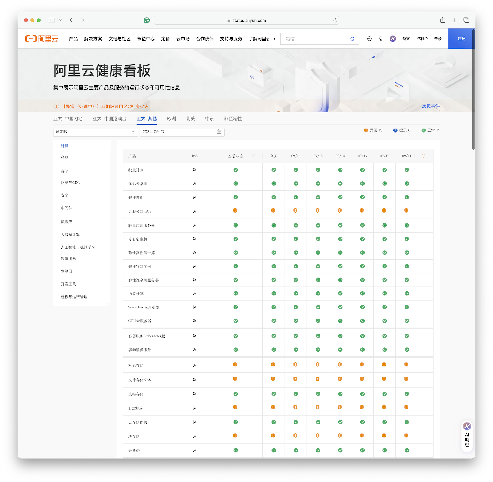
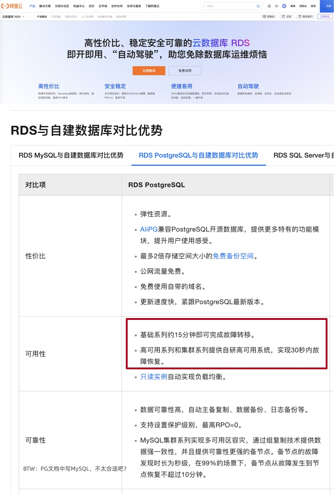
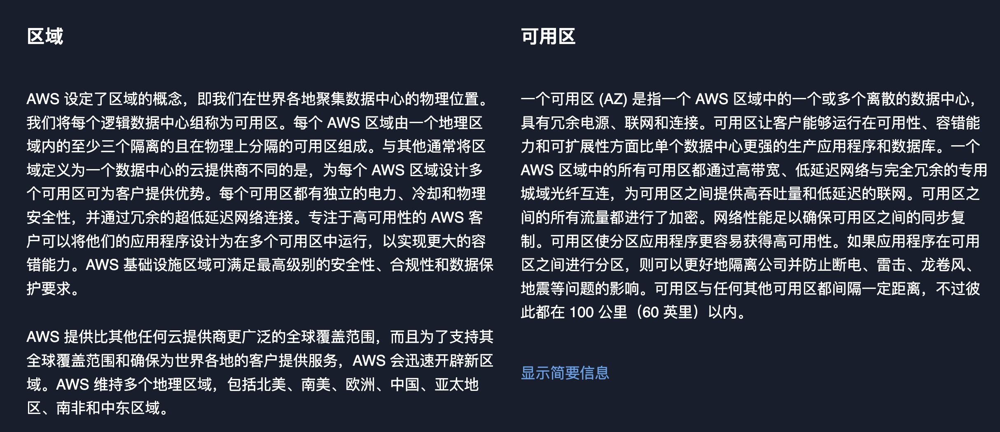

2024年9月10日，阿里云新加坡可用区C数据中心因锂电池爆炸导致火灾，到现在已经过去一周了，仍未完全恢复。
按照月度 SLA 定义的可用性计算规则（7天+/30天≈75%），**服务可用性别说几个9了，连一个8都不剩了**，而且还在进一步下降中。
当然，可用性八八九九已经是小问题了 —— 真正的问题是，放在单可用区里的数据还能不能找回来？

> 截止至 09-17，关键服务如 ECS, OSS, EBS, NAS, RDS 等仍然处于异常状态

通常来说，如果只是机房小范围失火的话，问题并不会特别大，因为电源和UPS通常放在单独房间内，与服务器机房隔离开。
但一旦触发了消防淋水，问题就大条了：一旦服务器整体性断电，恢复时间基本上要以天计；
如果泡水，那就不只是什么可用性的问题了，要考虑的是数据还能不能找回 —— **数据完整性** 的问题了。

目前公告上的说法是，14号晚上已经拖出来一批服务器，正在干燥、一直到16号都没干燥完。从这个“干燥”说法来看，有很大概率是泡水了。
虽然在任何官方公告出来前，我们无法断言事实如何，但根据常理判断，出现数据一致性受损是大概率事件，只是丢多丢少的问题。
所以目测这次新加坡火灾大故障的影响，基本与 2022 年底 [香港盈科机房大故障](https://help.aliyun.com/noticelist/articleid/1061819219.html) 与2023年[双十一全球不可用](/cloud/aliyun/) 故障在一个量级甚至更大。

天有不测风云，人有旦夕祸福。故障的发生概率不会降为零，重要的是我们从中故障能学到什么经验与教训？

--------

## 容灾实战战绩

整个数据中心着火是一件很倒霉的事，绝大多数用户除了靠异地冷备份逃生外，通常也只能自认倒霉。我们可以讨论锂电池还是铅酸电池更好，UPS电源应该怎么布局这类问题，但因为这些责备阿里云也没什么意义。

但有意义的是，在这次 **可用区级故障中**，标称自己为 “**跨可用区容灾高可用**” 的产品，例如云数据库 RDS，到底表现如何？**故障给了我们一次用真实战绩来检验这些产品容灾能力的机会。**

容灾的核心指标是 **RTO** （恢复耗时）与 **RPO**（数据损失），而不是什么几个9的可用性 —— 道理很简单，你可以单凭运气做到不出故障，实现 100% 的可用性。但真正检验容灾能力的，是灾难出现后的恢复速度与恢复效果。

| 配置策略                                                                                                                       | RTO                                                                             | RPO                                                                                  |
|:---------------------------------------------------------------------------------------------------------------------------|---------------------------------------------------------------------------------|:-------------------------------------------------------------------------------------|
| 单机 + <i class="fa-solid fa-music text-danger"></i> 什么也不做                                                                   | <i class="fas fa-circle-xmark text-danger"></i> **数据永久丢失，无法恢复**                 | <i class="fas fa-circle-xmark text-danger"></i> **数据全部丢失**                           |
| 单机 + <i class="fa-solid fa-copy text-secondary"></i> 基础备份                                                                  | <i class="fa-solid fa-triangle-exclamation text-secondary"></i> 取决于备份大小与带宽（几小时） | <i class="fa-solid fa-triangle-exclamation text-secondary"></i> 丢失上一次备份后的数据（几个小时到几天） |
| 单机 + <i class="fa-solid fa-copy text-primary"></i> 基础备份 + <i class="fa-solid fa-clock-rotate-left text-primary"></i> WAL归档 | <i class="fa-solid fa-triangle-exclamation text-primary"></i> 取决于备份大小与带宽（几小时）   | <i class="fa-solid fa-triangle-exclamation text-primary"></i> 丢失最后尚未归档的数据（几十MB）      |
| 主从 + <i class="fa-solid fa-wrench text-secondary"></i> 手工故障切换                                                              | <i class="fa-solid fa-triangle-exclamation text-primary"></i>  十分钟              | <i class="fa-solid fa-circle-check text-primary"></i> 丢失复制延迟中的数据（约百KB）               |
| 主从 + <i class="fa-solid fa-infinity text-primary"></i> 自动故障切换                                                              | <i class="fa-solid fa-circle-check text-primary"></i> 一分钟内                      | <i class="fa-solid fa-circle-check text-primary"></i> 丢失复制延迟中的数据（约百KB）               |
| 主从 + <i class="fa-solid fa-infinity text-primary"></i> 自动故障切换 + <i class="fa-solid fa-rotate text-success"></i> 同步提交       | <i class="fa-solid fa-circle-check text-success"></i> 一分钟内                      | <i class="fa-solid fa-circle-check text-success"></i> 无数据丢失                          |

毕竟，[**SLA**](/cloud/sla/) 中的规定的几个9 可用性指标**并非真实历史战绩**，而是达不到此水平就补偿月消费XX元代金券的承诺。要想考察产品真正的容灾能力，还是要靠演练或真实灾难下的实际战绩表现。

然而实际战绩如何呢？在这次在这次新加坡火灾中，整个可用区 RDS 服务的切换用了多长时间 —— 多AZ高可用的 RDS 服务在 11:30 左右完成切换，**耗时 70 分钟**（10:20 故障开始），也就是 **RTO < 70分**。

这个指标相比 2022 年香港C可用区故障 RDS 切换的的 **133** 分钟，有进步。但和阿里云自己标注的指标（**RTO < 30秒**）还是差了两个数量级。

至于单可用区的基础版 RDS 服务，官方文档上说 **RTO < 15分**，实际情况是：单可用区的RDS都要过头七了。**RTO > 7天**，至于 RTO 和 RPO 会不会变成 **无穷大 ∞** （彻底丢完无法恢复），我们还是等官方消息吧。

--------

## 如实标注容灾指标

[阿里云官方文档](https://help.aliyun.com/zh/rds/product-overview/competitive-advantages-of-apsaradb-rds-instances-over-self-managed-databases) 宣称：RDS 服务提供多可用区容灾， “*高可用系列和集群系列提供自研高可用系统，实现**30秒**内故障恢复。基础系列约**15分钟**即可完成故障转移*。”
也就是高可用版 RDS 的 RTO < 30s，基础单机版的 RTO < 15min，中规中矩的指标，没啥问题。

我相信在单个集群的主实例出现单机硬件故障时，阿里云 RDS 是可以实现上面的容灾指标的 —— 但既然这里声称的是 “**多可用区容灾**”，那么用户的合理期待是当整个可用区故障时，RDS 故障切换也可以做到这一点。

可用区容灾是一个合理需求，特别是考虑到阿里云在最近短短一年内出现过好几次整个可用区范围的故障（**[甚至还有一次全球/全服务级别的故障](/cloud/aliyun/)。

> 2024-09-10 [**新加坡可用区C机房火灾**](https://status.aliyun.com/#/eventDetail?eventId=21)
>
> 2024-07-02 [**上海可用区N网络访问异常**](https://status.aliyun.com/#/eventDetail?eventId=20)
>
> 2024-04-27 [浙江地域访问其他地域或其他地域访问杭州地域的OSS、SLS服务异常](https://status.aliyun.com/#/eventDetail?eventId=19)
>
> 2024-04-25 [**新加坡地域可用区C部分云产品服务异常**](https://status.aliyun.com/#/eventDetail?eventId=18)
>
> 2023-11-27 [**阿里云部分地域云数据库控制台访问异常**](https://status.aliyun.com/#/eventDetail?eventId=17)
>
> 2023-11-12 [**阿里云云产品控制台服务异常**](https://status.aliyun.com/#/eventDetail?eventId=16) （[全球大故障](/cloud/aliyun/)）
>
> 2023-11-09 [中国内地访问中国香港、新加坡地域部分EIP无法访问](https://status.aliyun.com/#/eventDetail?eventId=15)
>
> 2023-10-12 [阿里云杭州地域可用区J、杭州地域金融云可用区J网络访问异常](https://status.aliyun.com/#/eventDetail?eventId=14)
>
> 2023-07-31 [暴雨影响北京房山地域NO190机房](https://status.aliyun.com/#/eventDetail?eventId=13)
>
> 2023-06-21 [**阿里云北京地域可用区I网络访问异常**](https://status.aliyun.com/#/eventDetail?eventId=12)
>
> 2023-06-20 [部分地域电信网络访问异常](https://status.aliyun.com/#/eventDetail?eventId=11)
>
> 2023-06-16 [移动网络访问异常](https://status.aliyun.com/#/eventDetail?eventId=10)
>
> 2023-06-13 [阿里云广州地域访问公网网络异常](https://status.aliyun.com/#/eventDetail?eventId=9)
>
> 2023-06-05 [中国香港可用区D某机房机柜异常](https://status.aliyun.com/#/eventDetail?eventId=8)
>
> 2023-05-31 [阿里云访问江苏移动地域网络异常](https://status.aliyun.com/#/eventDetail?eventId=7)
>
> 2023-05-18 [阿里云杭州地域云服务器ECS控制台服务异常](https://status.aliyun.com/#/eventDetail?eventId=6)
>
> 2023-04-27 [部分北京移动(原中国铁通) 用户网络访问存在丢包现象](https://status.aliyun.com/#/eventDetail?eventId=5)
>
> 2023-04-26 [杭州地域容器镜像服务ACR服务异常](https://status.aliyun.com/#/eventDetail?eventId=4)
>
> 2023-03-01 [深圳可用区A部分ECS访问Local DNS异常](https://status.aliyun.com/#/eventDetail?eventId=3)
>
> 2023-02-18 [阿里云广州地域网络异常](https://status.aliyun.com/#/eventDetail?eventId=2)
>
> 2022-12-25 [**阿里云香港地域电讯盈科机房制冷设备故障**](https://status.aliyun.com/#/eventDetail?eventId=1)

**那么，为什么在实战中，单个RDS集群故障可以做到的指标，在可用区级故障时就做不到了呢？**从历史的故障中我们不难**推断** —— 数据库高可用依赖的基础设施本身，很可能就是单AZ部署的。包括在先前[香港盈科机房故障](https://www.aliyun.com/noticelist/articleid/1061819219.html)中展现出来的 ：单可用区的故障很快蔓延到了整个 Region —— **因为管控平面本身不是多可用区容灾的**。

> 12月18日10:17开始，阿里云香港Region可用区C部分RDS实例出现不可用的报警。随着该可用区受故障影响的主机范围扩大，出现服务异常的实例数量随之增加，工程师启动数据库应急切换预案流程。截至12:30，RDS MySQL与Redis、MongoDB、DTS等大部分跨可用区实例完成跨可用区切换。部分单可用区实例以及单可用区高可用实例，由于依赖单可用区的数据备份，仅少量实例实现有效迁移。少量支持跨可用区切换的RDS实例没有及时完成切换。**经排查是由于这部分RDS实例依赖了部署在香港Region可用区C的代理服务**，由于代理服务不可用，无法通过代理地址访问RDS实例。我们协助相关客户通过临时切换到使用RDS主实例的地址访问来进行恢复。随着机房制冷设备恢复，21:30左右绝大部分数据库实例恢复正常。对于受故障影响的单机版实例及主备均在香港Region可用区C的高可用版实例，我们提供了克隆实例、实例迁移等临时性恢复方案，但由于底层服务资源的限制，部分实例的迁移恢复过程遇到一些异常情况，需要花费较长的时间来处理解决。
>
> ECS管控系统为B、C可用区双机房容灾，C可用区故障后由B可用区对外提供服务，由于大量可用区C的客户在香港其他可用区新购实例，同时可用区C的ECS实例拉起恢复动作引入的流量，导致可用区 B 管控服务资源不足。新扩容的ECS管控系统启动时依赖的中间件服务部署在可用区C机房，导致较长时间内无法扩容。ECS管控依赖的自定义镜像数据服务，**依赖可用区C的单AZ冗余版本的OSS服务**，导致客户新购实例后出现启动失败的现象。

我建议在包括 RDS 在内的云产品应当实事求是，如实标注历史故障案例里的 RTO 和 RPO 战绩，以及真实可用区灾难下的实际表现。不要笼统地宣称 “***30秒/15分钟恢复，不丢数据，多可用区容灾***”，承诺一些自己做不到的事情。

--------

## 阿里云的可用区到底是什么？

在这次新加坡C可用区故障，包括之前香港C可用区故障中，阿里云表现出来的一个问题就是，单个数据中心的故障扩散蔓延到了整个可用区中，而单个可用区的故障又会影响整个区域。

在云计算中， **区域（Region）** 与 **可用区（AZ）** 是一个非常基本的概念，熟悉 AWS 的用户肯定不会感到陌生。
按照 [AWS的说法](https://aws.amazon.com/cn/about-aws/global-infrastructure/regions_az) ：一个 **区域** 包含多个可用区，每个可用区是一个或多个独立的数据中心。

对于 AWS 来说，并没有特别多的 Region，比如美国也就四个区域，但每个区域里 [两三个可用区](https://gist.github.com/karstenmueller/98381c897178a260be8c08f98ffe2c3e)，而一个可用区（AZ）通常对应着多个数据中心（DC）。
AWS 的实践是一个 DC 规模控制在八万台主机，DC之间距离在 70 ～ 100 公里。这样构成了一个 Region - AZ - DC 的三级关系。

不过 [阿里云](https://help.aliyun.com/document_detail/40654.html) 上似乎不是这样的，它们缺少了一个关键的 **数据中心（DC）** 的概念。
因此 **可用区（AZ）** 似乎就是一个数据中心，而 **区域（Region）** 与 AWS 的上一层 **可用区（AZ）概念** 对应。

把原本的 AZ 拔高成了 Region，把原本的 DC （或者DC的一部分，一层楼？）拔高成了可用区。

我们不好说阿里云这么设计的动机，一种可能的猜测是：本来可能阿里云国内搞个华北，华东，华南，西部几个区域就行，但为了汇报起来带劲（你看AWS美国才4个Region，我们国内有14个！），就搞成了现在这个样子。

--------

## 云厂商有责任推广最佳实践

TBD

提供单az对象存储服务的云，可不可以评价为：不是傻就是坏？

云厂商有责任推广好的实践，不然出了问题，也还是“都是云的问题”

你给别人默认用的就是本地三副本冗余，绝大多数用户就会选择你默认的这个。

看有没有告知,没告知，那就是坏，告知了，长尾用户能不能看懂？但其实很多人不懂的。

你都已经三副本存储了，为什么不把一个副本放在另一个 DC 或者另一个 AZ ？
你都已经在存储上收取了上百倍的溢价了，为什么就不不愿意多花一点点钱去做同城冗余，难道是扣数据跨 AZ 复制的那点流量费吗？

--------

## 做健康状态页请认真一点

TBD

我听说过天气预报，但从未听说过故障预报。但阿里云健康看板为我们提供了这一神奇的能力 —— 你可以选择未来的日期，而且未来日期里还有服务健康状态数据。例如，你可以查看20年后的服务健康状态 ——

未来的 “故障预报” 数据看上去是用当前状态填充的。所以当前处于故障状态的服务在未来的状态还是异常。如果你选择 20 年后，你依然可以看到当前新加坡大故障的健康状态为“异常”。

**也许** 阿里云是想用这种隐晦的方式告诉用户：***新加坡区域单可用区里的数据已经泡汤了，Gone Forever, 乃们还是不要指望找回了***。当然，更合理推断是：这不是什么故障预报，这个健康看板是实习生做的。完全没有设计 Review，没有 QA 测试，不考虑边际条件，拍拍脑袋拍拍屁股就上线了。

--------

## 云是新的故障单点，那怎么办？

TBD

信息安全三要素 CIA：机密性，完整性，可用性，最近阿里都遇上了大翻车。

前有 [阿里云盘灾难级BUG](https://mp.weixin.qq.com/s/C7XGgGmzvMjKJGbBGVmrzw) 泄漏隐私照片破坏机密性；

后有这次可用区故障故障，击穿多可用区/单可用区可用性神话，甚至威胁到了命根子 —— 数据完整性。

--------

## 参考阅读

[是时候放弃云计算了吗？](/cloud/exit/)

[下云奥德赛](/cloud/odyssey/)

[FinOps的终点是下云](/cloud/finops/)

[云计算为啥还没挖沙子赚钱？](/cloud/profit/)

[云SLA是不是安慰剂？](/cloud/sla/)

[云盘是不是杀猪盘？](/cloud/ebs/)

[云数据库是不是智商税？](/cloud/rds/)

[范式转移：从云到本地优先](/cloud/paradigm/)

[腾讯云CDN：从入门到放弃](/cloud/cdn/)

------

[【阿里】云计算史诗级大翻车来了](http://mp.weixin.qq.com/s?__biz=MzU5ODAyNTM5Ng==&mid=2247486452&idx=1&sn=29cff4ee30b90483bd0a4f0963876f28&chksm=fe4b3e2fc93cb739af6ce49cffa4fa3d010781190d99d3052b4dbfa87d28c0386f44667e4908#rd)

[阿里云的羊毛抓紧薅，五千的云服务器三百拿](http://mp.weixin.qq.com/s?__biz=MzU5ODAyNTM5Ng==&mid=2247486438&idx=1&sn=b2c489675134d4e84fbc249089777cb4&chksm=fe4b3e3dc93cb72b5d0d90ef61011dda5a09e5f08d96c8cca87148706451c859777162bd18da#rd)

[云厂商眼中的客户：又穷又闲又缺爱](http://mp.weixin.qq.com/s?__biz=MzU5ODAyNTM5Ng==&mid=2247486387&idx=1&sn=20ac92e33ed5a6b8e3120e99aefaf1cc&chksm=fe4b3e68c93cb77ed5b627c8caf78666cab9deafc18dacf528e51411682e616b4df1deab87f9&scene=21#wechat_redirect)

[阿里云的故障在其他云也可能发生,并且可能丢数据](http://mp.weixin.qq.com/s?__biz=MzkwODMyMDE2NQ==&mid=2247483770&idx=1&sn=723c865ff27fd0ceace1d8fb2c76ddca&chksm=c0ca8db0f7bd04a63f79aba185e093bbb0ab5763b1f91f58cfc86551daf7e47bd6627dd8c73b#rd)

[中国云服务走向全球？先把 Status Page 搞定](http://mp.weixin.qq.com/s?__biz=MzkwODMyMDE2NQ==&mid=2247483764&idx=1&sn=8aebb4053257fac48f71b75a957153ad&chksm=c0ca8dbef7bd04a816feba238a2232abdc02b5ccdb405f32217455dc3bf3a1811bd4ff8815af#rd)

[我们可以信任阿里云的故障处理吗?](http://mp.weixin.qq.com/s?__biz=MzkwODMyMDE2NQ==&mid=2247483759&idx=1&sn=eb12dfe4df37c22aadd120676391f4cb&chksm=c0ca8da5f7bd04b3a024111b5c3be9f273c70087cc986937e72e12d7a0fe496753a88568afe9#rd)

[给阿里云的一封公开信](http://mp.weixin.qq.com/s?__biz=MzkwODMyMDE2NQ==&mid=2247483762&idx=1&sn=903405e0b64037f1b7d44b23f0c9b08d&chksm=c0ca8db8f7bd04ae55f719df891d811d05269dac3a8e0a894d23292e06674058c943712672f5#rd)

[平台软件应该像数学一样严谨 --- 和阿里云RAM团队商榷](http://mp.weixin.qq.com/s?__biz=MzkwODMyMDE2NQ==&mid=2247484048&idx=1&sn=b57839c9dc85fe3dc6eaac01ff37b995&chksm=c0ca8e5af7bd074ca5221de40c47b82378a8ca20f348ab1c80de7d244679733ee80e29cb3381#rd)

[被医药业吊打的中国软件从业者](http://mp.weixin.qq.com/s?__biz=MzkwODMyMDE2NQ==&mid=2247484025&idx=1&sn=5c6f1b0035b7f9a657a5d24d68699943&chksm=c0ca8eb3f7bd07a550325dd691c5761cbf99a9b4644d14c9bbb512dc9ecd27033622bb83e58e#rd)

[腾讯的错别字文化](http://mp.weixin.qq.com/s?__biz=MzkwODMyMDE2NQ==&mid=2247484019&idx=1&sn=5dbe25e5c8d39a67bf9e9573ba2e9b98&chksm=c0ca8eb9f7bd07af03f6d1228d73153fc37479a132a697c310851bfbffcf997ce991a7c2f010#rd)

[云为什么留不住客户 — 以腾讯云 CAM 为例](http://mp.weixin.qq.com/s?__biz=MzkwODMyMDE2NQ==&mid=2247484064&idx=1&sn=cedf630065c88b936133001f84690c75&chksm=c0ca8e6af7bd077c417aae032cc91281808e8768ea4f103dd1c71039986079c49bbd0aa03507#rd)

[腾讯云团队为什么用阿里云的服务名？](http://mp.weixin.qq.com/s?__biz=MzkwODMyMDE2NQ==&mid=2247483883&idx=1&sn=f2644e9ff54790b319d63a1ffb26e717&chksm=c0ca8d21f7bd0437b3be51f1d093ff45fac4e36552cdbf8b27c8d0ec5470e85ac46dd7f136a3#rd)

[究竟是客户差劲，还是腾讯云差劲？](http://mp.weixin.qq.com/s?__biz=MzkwODMyMDE2NQ==&mid=2247483846&idx=1&sn=9a2f3cd59147d2444b7432ecf50af9ba&chksm=c0ca8d0cf7bd041a3f56fcf0bb4adbde8434d81818009f9906c0fa3d1121017996f572b0237e#rd)

[百度腾讯阿里真的是高科技企业吗？](http://mp.weixin.qq.com/s?__biz=MzkwODMyMDE2NQ==&mid=2247483694&idx=1&sn=618a3aa4f196c30eb9e89969643b06e9&chksm=c0ca8de4f7bd04f25b277942fb41da2092c073f3db55fb92020ba66f21e14522e823a8a3346c#rd)

[云计算厂商们，你们辜负了中国的用户](http://mp.weixin.qq.com/s?__biz=MzkwODMyMDE2NQ==&mid=2247483663&idx=1&sn=27f37af0dc4e755d7a64f341de6d8aad&chksm=c0ca8dc5f7bd04d3f4a4437a63958eb93be56722ed32c43385bf41631c86a869bdeada35af04#rd)

[除了打折虚拟机, 云计算用户究竟在用什么高阶云服务?](http://mp.weixin.qq.com/s?__biz=MzkwODMyMDE2NQ==&mid=2247483712&idx=1&sn=acdb5adf0d588d9617ed72b5ffca8dd3&chksm=c0ca8d8af7bd049c0a69cfebb950c07f599a807876a5d0748122e9a0b0528d216a8d5d968197#rd)

[腾讯云阿里云做的真的是云计算吗?--从客户成功案例的视角](http://mp.weixin.qq.com/s?__biz=MzkwODMyMDE2NQ==&mid=2247483743&idx=1&sn=9f329de1649fac75f69e57270978d047&chksm=c0ca8d95f7bd0483d6af4940ca342e2544135e9de0b56fa1a6f299c887800aae04c11b0551bd#rd)

[本土云厂家究竟在服务谁？](http://mp.weixin.qq.com/s?__biz=MzkwODMyMDE2NQ==&mid=2247483828&idx=1&sn=e03403d98876700134be4d1127371fe2&chksm=c0ca8d7ef7bd0468677fc02cc47c530cdad242ac56ee485cb7b16667afafabc2339af0a995c6#rd)