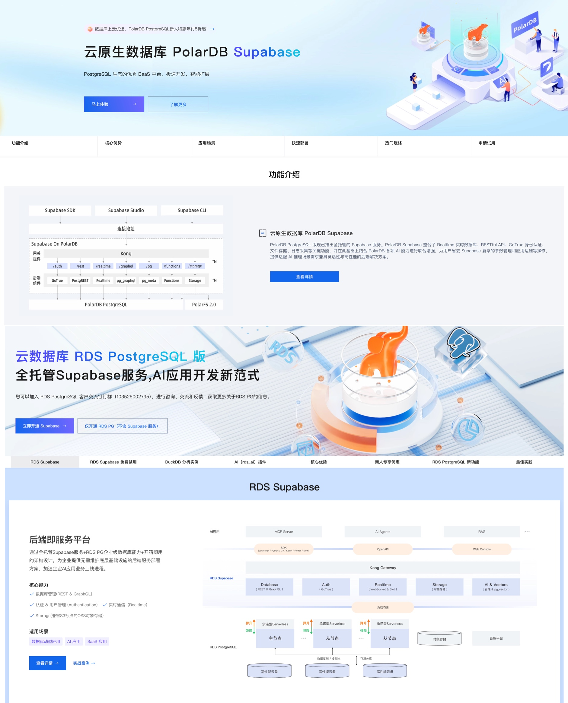
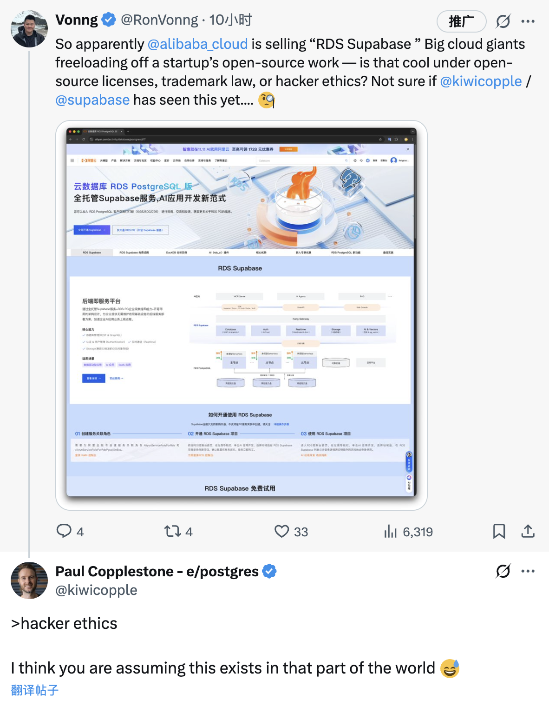
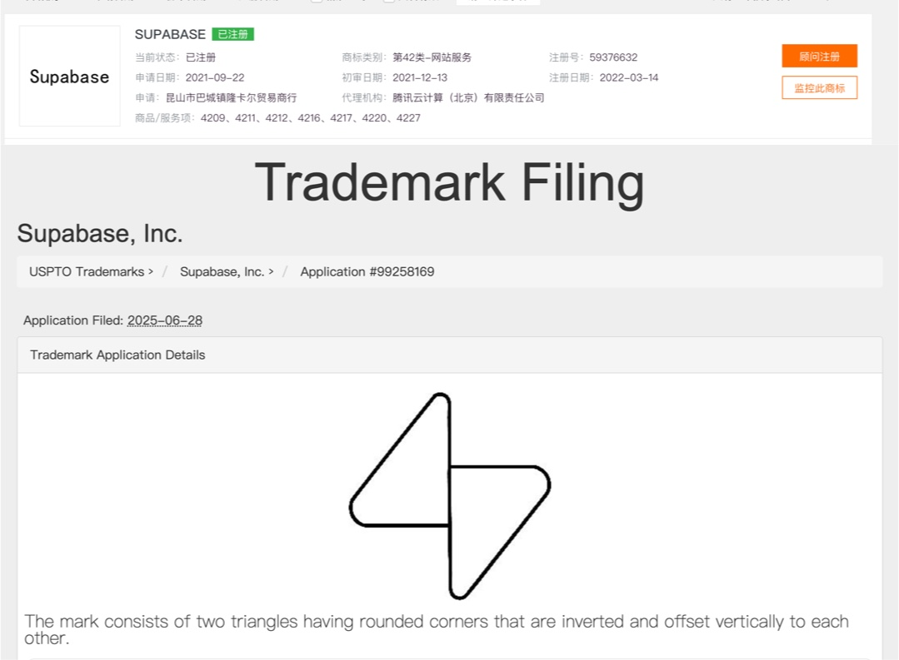
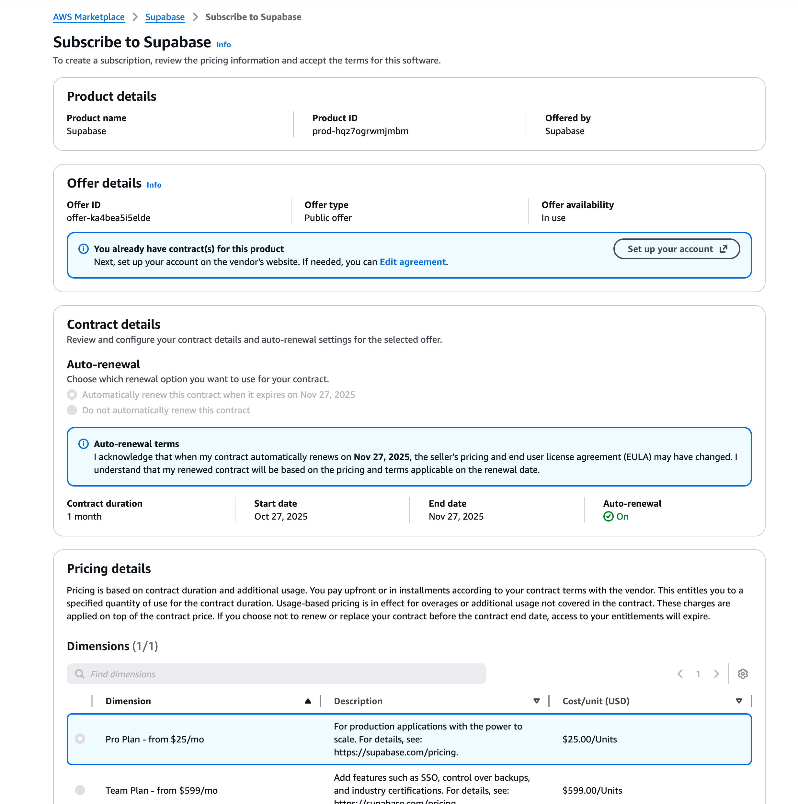

Chinese founders hear the nightmare scenario constantly: “What happens when Alibaba shows up?” Well, Alicloud RDS just shipped Supabase as a first-party feature. This is what it looks like when a hyperscaler parachutes into your niche.

## Supabase in a nutshell

Supabase is a BaaS built on PostgreSQL. You get auth, storage, realtime, edge functions—the whole backend stack out of the box. In the AI era it’s one of the hottest plays around databases.

Outside of PostgreSQL itself, the two products I’ve bet on for years are DuckDB and Supabase. Its popularity is insane: almost 90k GitHub stars, and I’ve heard ~80% of YC startups now prototype SaaS on Supabase.

Pigsty, my PostgreSQL distro, has shipped Supabase self-hosting support for two years. Supabase even recommends two official DIY paths: Ansible via Pigsty, or Kubernetes via StackGres. I also package the PG extensions Supabase needs, and the Supabase self-host guide on my site gets more traffic than the homepage. That’s how loud the demand is.

## Supabase, made in Hangzhou

Yesterday a friend pinged me: Alicloud RDS rolled out “Supabase.” Earlier this year they already exposed Supabase-style APIs inside AnalyticDB; now both RDS for PostgreSQL and reportedly PolarDB carry it too. Three teams racing to ship the same OSS stack—peak Internet involution.

So Supabase just became a native SKU in the Alicloud database portfolio. For domestic users this lowers friction: the official Supabase cloud targets overseas regions and is painful to reach behind the Great Firewall. Alicloud’s managed flavor is undeniably convenient.

For Supabase-the-startup, though, this is literally the founder nightmare: **“What if a giant cloud vendor sells your open-source product as their own?”** That question just walked out of the slide deck and into prod.

## What does Supabase think?

Maybe, optimists say, Alicloud worked out a partnership. I couldn’t find any public announcement, so I pinged Supabase CEO Paul Copplestone on X. His reply? “Hacker ethics, I think you are assuming this exists in that part of the world.”

He liked, retweeted, and replied. Translation: no partnership, just Alicloud freeloading. That comment stung. I *am* “that part of the world,” and I still couldn’t argue back. The evidence is the evidence.

## Is this legal?

Supabase uses a mix of Apache 2.0 and MIT licenses. Legally that gives Alicloud the green light: commercial use, modification, distribution, even running it as a managed service—all allowed, no royalties required.

The real restriction is **trademark**. Clause 6 of Apache 2.0 explicitly says the license does **not** grant rights to the licensor’s trade names, marks, or product names beyond nominative use. Alicloud can use the code; they’re not supposed to slap the Supabase mark on their product.

AWS famously tripped over this with Elasticsearch. They assumed “it’s OSS, let’s run it as a service,” then got smacked over the trademark and rebranded to OpenSearch. Same for DocumentDB and, more recently, Valkey. Alicloud clearly didn’t read the memo: they’re advertising RDS Supabase, PolarDB Supabase, AnalyticDB Supabase—logo and all.

Normally, if you want to sell something bearing someone else’s mark, you get permission. Otherwise it’s straight-up infringement or at least unfair competition. The wrinkle: Supabase only registered its trademark in the U.S. (USPTO 99258169) and never filed in China. China runs on “first to file,” not “first to use,” so unregistered foreign marks have no teeth unless they’re “well-known.” Jordan lost that fight; a five-year-old startup doesn’t stand a chance.

## The optics are ugly

Legality aside, this is just tacky. A giant cloud vendor hijacking a startup’s mark to boost its own SKU screams “brand squatting.” Unsuspecting users might think Supabase officially partnered with Alicloud. Worse, once Alicloud dominates the domestic market under that name, the original Supabase brand is diluted before it even enters the country.

From a contribution standpoint, Alicloud is free-riding years of Supabase R&D, dodging all the zero-to-one cost, yet offering zero code contributions, sponsorship, or community investment in return. It’s the classic “raise someone else’s kid, then snatch them away” play. No wonder people call this “eating the orphaned household”—take everything, leave nothing.

This mindset nukes ecosystems. Domestic clouds love to run monopoly plays: build everything themselves, starve out independent software vendors, and then wonder why the ecosystem stays barren. Alicloud’s Supabase land grab is just another data point.

Western hyperscalers get plenty of flak too, but AWS/Azure/GCP at least maintain huge partner markets. Many software vendors grow via their marketplaces or co-selling programs. AWS, for example, runs a revenue-sharing partnership with Supabase: Supabase entered the AWS Marketplace in 2024, counts toward enterprise spend commitments, and AWS Activate even throws in $300 of Supabase credits for startups. Users get convenience, the creator gets paid. Alicloud chose the other path: ignore the upstream, wrap the code, sell it as your differentiator, and **cut the original team out entirely**.

> The official Supabase SaaS listing inside AWS Marketplace

## Collateral damage to the ecosystem

This isn’t just one company’s overreach; it’s a sign of how fragile innovation becomes when a platform giant decides to harvest it. Chinese founders joke about the “soul question”: what if Alibaba/Tencent/Bytedance clones your product? Supabase is the hottest BaaS startup on the planet. It bet on open source, community, and transparency. Now that openness is being turned against it to block an entire market. **Loose licenses became a liability once hyperscalers realized they could monetize without sharing.**

Will this push more founders away from permissive licenses? Will we see even more projects adopt SSPL-style clauses or go fully commercial? That’s already happening: [Redis](https://mp.weixin.qq.com/s/W5kOLxeJCIHjnWbIHc1Pzw), [Elasticsearch](https://mp.weixin.qq.com/s/NdeeYn10qQ0xBPL-67IXdQ), [MongoDB](https://mp.weixin.qq.com/s/I3ug7Qv9jz3-uD3x_N1jKw), Grafana, MinIO—they’ve all tightened licenses or gone source-available to block exactly this behavior. Open source is turning into a salt flat because clouds keep draining the water table.

Alicloud’s “RDS Supabase” might look shiny on the billboard, but ethically it’s a gray-zone hustle and strategically it poisons the well. We should be building cooperative flywheels, not zero-sum heists. Respect innovation. Respect open source. Respect the small teams who actually shipped the thing. If giants keep carpet-bombing every promising project, the next generation simply won’t open source at all—and then we all lose.

To be fair, Alicloud used to have a decent reputation in open source. Qwen models scored them real goodwill. I’d rather see them stick to co-building than brand-squatting. Reputation is fragile; when the public mood turns, you end up like that Alibaba exec who tried to jump the line at Sam’s Club and got ratioed by the entire internet.

## Further reading

#### Supabase

[Stop Arguing. The AI Database Play Is Already Decided.](https://mp.weixin.qq.com/s/bChEvpXgXKi5njr6Kj5YGg)

[Database Watercooler: OpenAI Wants to Acquire Supabase?](https://mp.weixin.qq.com/s/RmU7RXl9ewwnpabjI4lw4Q)

[PG Ecosystem Wins Wall Street: Databricks Buys Neon, Supabase Raises $200M, Microsoft Earnings Name-Drop PG](https://mp.weixin.qq.com/s/skxFplC0ow0Hh9gqs_N4hQ)

[Supabase’s $80M Series C](https://mp.weixin.qq.com/s/fi_p3tTZTnwP5XDJrkVbQw)

[DIY Supabase for Going Global](https://mp.weixin.qq.com/s/HJDfcSC8XFL_PkDlxHbqRQ)

[Supabase’s $80M Series C (again)](https://mp.weixin.qq.com/s/fi_p3tTZTnwP5XDJrkVbQw)

[OrioleDB Is Coming](https://mp.weixin.qq.com/s/QG7_UyT08fNFiBj6qujSEA)

#### Alicloud

[Slap Fight Worth 30M? Alibaba vs. Xiaowangshen](https://mp.weixin.qq.com/s/O4LvUspOgrVBWHzmBvfmUA)

[Alicloud CDN Down—Remember to Claim SLA Credits](https://mp.weixin.qq.com/s/Y2PZiH63EAXRKP8gele8NQ)

[Catastrophe: Alibaba Cloud Lost Its Core Domains](https://mp.weixin.qq.com/s/l1b-eq06NyuN61cqZoYJjA)

[Alicloud Rotting From Top to Bottom](https://mp.weixin.qq.com/s/0pT7wb0Y6ohgvEltED93hA)

[Hardcoded Passwords Leak—What’s Wrong With Alicloud Engineering](https://mp.weixin.qq.com/s/43pIBxYvsszeBZGk7LU7_w)

[Paying to Suffer: Escape From Cloud Computing’s Myawaddy](https://mp.weixin.qq.com/s/zwJ2T2Vh_R7xD8IKPso31Q)

[Alipay Down Again During Double-11](https://mp.weixin.qq.com/s/D2XmL2YYN2kqHtwFN4FVGQ)

[Alicloud Billing a User 1,600 RMB After 32 Seconds of DCDN](https://mp.weixin.qq.com/s/0Wnv1B80Tk4J03X3uAm4Ww)

[Alicloud’s High-Availability Myth Is Dead](https://mp.weixin.qq.com/s/rXwEayprvDKCgba4m-naoQ)

[Predicting the Next Alicloud Outage: This One Might Last 20 Years](https://mp.weixin.qq.com/s/G41IN2y8DrC002FQ_BXtXw)

[Singapore AZ-C Fire](https://mp.weixin.qq.com/s/EDRmP7ninfSx-CgNDb8mpg)

[RDS Trainwreck](https://mp.weixin.qq.com/s/kOIw8uPjZUZ0-QisC1TBOA)

[Another Alicloud Outage—This Time a Fiber Cut](https://mp.weixin.qq.com/s/cb2Lh56uINxacM2uUaB6Vw)

[Cloud Is a Tax on Mediocrity](https://mp.weixin.qq.com/s/jYIqj94B07oTu9KC85bjtQ)

[Taobao’s Certificate Expired](https://mp.weixin.qq.com/s/-ntsNfdEq3b4qs5tKP7tfQ)

[Stop Worshipping Toothpaste Clouds](https://mp.weixin.qq.com/s/XZqe4tbJ9lgf8a6PWj7vjw)

[Luo Yonghao Can’t Save Alicloud](https://mp.weixin.qq.com/s/s_MCdaCByDBuocXkY1tvKw)

[The Lost Youth Stuck Inside Alicloud](https://mp.weixin.qq.com/s/w7YzdxSrAsIqk2gXBks9CA)

[Does Alicloud’s Price Cut Actually Cut Costs?](https://mp.weixin.qq.com/s/rp8Dtvyo9cItBJSsvfrKjw)

[From “Cost Cutting for Laughs” to Real Efficiency](https://mp.weixin.qq.com/s/FIOB_Oqefx1oez1iu7AGGg)

[Alicloud Weekly: Database Control Plane Down Again](https://mp.weixin.qq.com/s/3F1ud-tWB3eymu1-dxSHMA)

[Lessons From Alicloud’s Epic Failure](https://mp.weixin.qq.com/s/OIlR0rolEQff9YfCpj3wIQ)

[Another Epic Alicloud Crash](https://mp.weixin.qq.com/s/cTge3xOlIQCALQc8Mi-P8w)

[Hurry and Milk Alicloud’s Subsidies](https://mp.weixin.qq.com/s/Nh28VahZkQMdR8fDoi0_rQ)

[How Cloud Vendors See Customers: Broke, Bored, and Needy](https://mp.weixin.qq.com/s/y9IradwxTxOsUGcOHia1XQ)

#### Cloud & open source

[Elasticsearch Is “Open” Again?](https://mp.weixin.qq.com/s/NdeeYn10qQ0xBPL-67IXdQ)

[Redis Going Source-Available Is an Indictment of Clouds](https://mp.weixin.qq.com/s/W5kOLxeJCIHjnWbIHc1Pzw)

[Paradigm Shift: From Cloud-First to Local-First](https://mp.weixin.qq.com/s/Yp6L0hh4b4HuJQRPD3aJYw)
