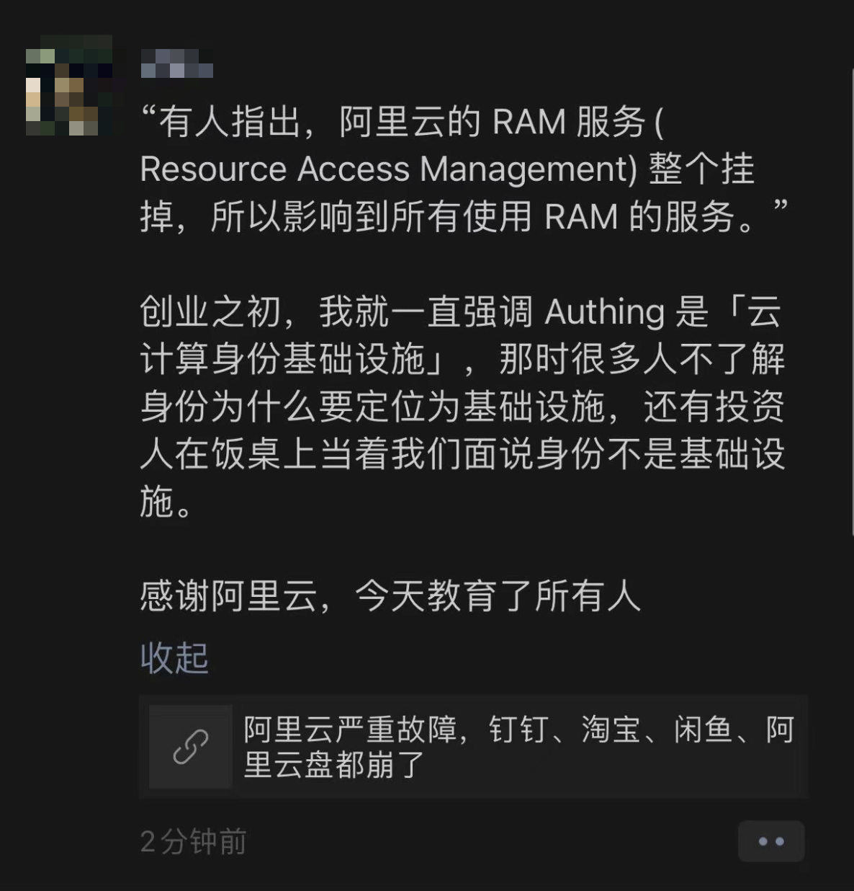

A year after the last major incident, Alibaba-Cloud suffered another massive outage, creating an unprecedented record in the cloud computing industry — **simultaneous failures across all global regions and all services**. Since Alibaba-Cloud refuses to publish a post-mortem report, I'll do it for them — how should we view this epic failure case, and what lessons can we learn from it?

- [What happened?](#what-happened)
- [What was the cause?](#what-was-the-cause)
- [What was the impact?](#what-was-the-impact)
- [Comments and opinions?](#comments-and-opinions)
- [What can we learn?](#what-can-we-learn)

------

## What happened?

On November 12, 2023, the day after Double 11, Alibaba-Cloud experienced an [epic meltdown](https://mp.weixin.qq.com/s/cTge3xOlIQCALQc8Mi-P8w). **All global regions simultaneously experienced failures**, setting an unprecedented industry record.

According to Alibaba-Cloud's official [status page](https://status.aliyun.com/#/), all global regions/availability zones ✖️ all services showed anomalies, spanning from 17:44 to 21:11, lasting three and a half hours.

> Alibaba-Cloud **Status Page**

[Alibaba-Cloud's announcement](https://help.aliyun.com/noticelist/articleid/1064981333.html) stated:

> "Cloud product consoles, management APIs and other functions were affected, OSS, OTS, SLS, MNS and other products' services were affected, while most products like ECS, RDS, networking etc. were not affected in their actual operations".

Numerous applications relying on Alibaba-Cloud services, including Alibaba's own suite of apps: Taobao, DingTalk, Xianyu, ... all experienced issues. This created significant external impact, with "app crashes" trending on social media.

Taobao couldn't load chat images, courier services couldn't upload proof of delivery, charging stations were unusable, games couldn't send verification codes, food delivery orders couldn't be placed, delivery drivers couldn't access systems, parking gates wouldn't lift, supermarkets couldn't process payments. Even some schools' smart laundry machines and water dispensers stopped working. Countless developers and operations staff were called in to troubleshoot during their weekend rest...

Even financial and government cloud regions weren't spared. Alibaba-Cloud should feel fortunate: the outage didn't occur on Double 11 itself, nor during government or financial sector working hours, otherwise we might have seen a post-mortem analysis on national television.

-------------------

## What was the cause?

Although Alibaba-Cloud has yet to provide a post-incident analysis report, experienced engineers can determine the problem location based on the blast radius — **Auth** (authentication/authorization/RAM).

Hardware failures in storage/compute or data center power outages would at most affect a single availability zone (AZ), network failures would at most affect one region, but something that can cause simultaneous issues across all global regions must be a cross-regional shared cloud infrastructure component — most likely **Auth**, with a low probability of other global services like billing.

> Alibaba-Cloud's incident progress announcement: the issue was with a certain underlying service component, not network or data center hardware problems.

The root cause being **Auth** has the highest probability, with the most direct evidence being: cloud services deeply integrated with **Auth** — Object Storage **OSS** (S3-like), Table Store **OTS** (DynamoDB-like), and other services heavily dependent on **Auth** — directly experienced availability issues. Meanwhile, cloud resources that don't depend on **Auth** for operation, like cloud servers **ECS**/cloud/ databases **RDS** and networking, could still "run normally", users just couldn't manage or modify them through consoles and APIs. Additionally, one way to rule out **billing service** issues is that during the outage, some users still successfully paid for [ECS deals](/cloud/ecs/).

While the above analysis is just inference, it aligns with leaked internal messages: **authentication** failed, causing all services to malfunction. As for how the authentication service itself failed, until a post-mortem report emerges, we can only speculate: **human configuration error** has the highest probability — since the failure wasn't during regular change windows and had no gradual rollout, it doesn't seem like code/binary deployment. But the specific configuration error — certificates, blacklists/whitelists, circular dependency deadlocks, or something else — remains unknown.

Various rumors about the root cause are flying around, such as "the permission system pushed a blacklist rule, the blacklist was maintained on OSS, accessing OSS required permission system access, then the permission system needed to access OSS, creating a deadlock." Others claim "during Double 11, technical staff worked overtime for a week straight, everyone relaxed after Double 11 ended. A newbie wrote some code and updated a component, causing this outage," and "all Alibaba-Cloud services use the same wildcard certificate, the certificate was replaced incorrectly."

If these causes led to **Auth** failure, it would truly be [amateur hour](https://mp.weixin.qq.com/s/y9IradwxTxOsUGcOHia1XQ). While it sounds absurd, such precedents aren't rare. Again, these street-side rumors are for reference only; please refer to Alibaba-Cloud's official post-mortem analysis report for specific incident causes.

-------------------

## What was the impact?

**Authentication/authorization** is the foundation of services. When such basic components fail, the impact is **global** and **catastrophic**. This renders the entire **cloud control plane** unavailable, directly impacting consoles, APIs, and services deeply dependent on **Auth** infrastructure — like another foundational public cloud service, Object Storage **OSS**.

From Alibaba-Cloud's announcement, it seems only "*several services (**OSS, OTS, SLS, MNS**) were affected, while most products like ECS, RDS, networking etc. were not affected in actual operations*". But when a foundational service like Object Storage **OSS** fails, the blast radius is unimaginable — it can't be dismissed as "individual services affected" — it's like a car's fuel tank catching fire while claiming the engine and wheels are still turning.

Object Storage **OSS** provides services through cloud vendor-wrapped HTTP APIs, so it necessarily depends heavily on authentication components: you need AK/SK/IAM signatures to use these HTTP APIs, and Auth failures render such services unavailable.

**Object Storage OSS is incredibly important** — arguably the "defining service" of cloud computing, perhaps the only service that reaches basic standard consensus across all clouds. Cloud vendors' various "upper-level" services depend on OSS directly or indirectly. For example, while ECS/RDS can run, ECS snapshots and RDS backups obviously depend heavily on OSS, CDN origin-pulling depends on OSS, and various service logs are often written to OSS.

From observable phenomena, Alibaba-Cloud Drive, with core functionality deeply tied to OSS, crashed severely, while services with little OSS dependency, like Amap, weren't significantly affected. Most related applications maintained their main functionality but lost image display and file upload/download capabilities.

Some practices mitigated OSS impact: public storage buckets without authentication — usually considered insecure — weren't affected; CDN usage also buffered OSS issues: Taobao product images via CDN cache could still be viewed, but real-time chat images going directly through OSS failed.

Not just OSS, other services deeply integrated with Auth dependencies also faced similar issues, like **OTS, SLS, MNS**, etc. For example, the DynamoDB alternative Table Store **OTS** also experienced problems. Here's a striking contrast: cloud database services like **RDS** for PostgreSQL/MySQL use the database's own authentication mechanisms, so they weren't affected by cloud vendor Auth service failures. However, OTS lacks its own permission system and directly uses IAM/RAM, deeply bound to cloud vendor Auth, thus suffering impact.

Technical impact is one aspect, but business impact is more critical. According to Alibaba-Cloud's **Service Level Agreement (SLA)**, the 3.5-hour outage brought monthly service availability down to 99.5%, falling into the middle tier of most services' compensation standards — compensating users with 25% ~ 30% of monthly service fees in **vouchers**. Notably, this outage's regional and service scope was **complete**!

> Alibaba-Cloud OSS SLA

Of course, Alibaba-Cloud could argue that while **OSS/OTS** services failed, their **ECS**/**RDS** only had **control plane** failures without affecting running services, so SLAs weren't impacted. But even if such compensation fully materialized, it's minimal money, more like a gesture of appeasement: compared to users' business losses, compensating 25% of monthly consumption in vouchers is almost **insulting**.

Compared to lost user trust, technical reputation, and commercial credibility, those voucher compensations are truly negligible. If handled poorly, this incident could become a **pivotal landmark event for public cloud**.

-------------------

## Comments and opinions?

Elon Musk's Twitter X and DHH's 37 Signal [saved millions in real money through cloud exit](/cloud/exit/), creating "cost reduction and efficiency improvement" miracles, making cloud exit a trend. Cloud users hesitate over bills wondering whether to leave the cloud, while non-cloud users are conflicted. Against this backdrop, such a major failure by Alibaba-Cloud, the domestic cloud leader, deals a heavy blow to hesitant observers' confidence. This outage will likely become a **pivotal landmark event for public cloud**.

Alibaba-Cloud has always prided itself on security, stability, and high availability, just last week boasting about extreme stability at their cloud conference. But countless supposed disaster recovery, high availability, multi-active, multi-center, and degradation solutions were simultaneously breached, shattering the N-nines myth. Such widespread, long-duration, broadly impactful failures set historical records in cloud computing.

This outage reveals the enormous risks of critical infrastructure: countless network services relying on public cloud **lack basic autonomous control** capabilities — when failures occur, they have no self-rescue ability except waiting for death. Even financial and government clouds experienced service unavailability. It also reflects the **fragility of monopolized centralized infrastructure**: the **decentralized** internet marvel now mainly runs on servers owned by a few large companies/cloud/ vendors — certain cloud vendors themselves become the biggest business single points of failure, which wasn't the internet's original design intent!

More severe challenges may lie ahead. Global users seeking monetary compensation is minor; what's truly deadly is that in an era where countries emphasize **data sovereignty**, if global outages result from misconfigurations in Chinese control centers (i.e., you really did grab others by the throat), many overseas customers will immediately migrate to other cloud providers: **this concerns compliance, not availability**.

According to Heinrich's Law, behind one serious accident lie dozens of minor incidents, hundreds of near-misses, and thousands of hidden dangers. Last December's Alibaba-Cloud Hong Kong data center major outage already exposed many problems, yet a year later brought users an even bigger "surprise" (shock!). Such incidents are absolutely fatal to Alibaba-Cloud's brand image and even **seriously damage the entire industry's reputation**. Alibaba-Cloud should quickly provide users with explanations and accountability, publish detailed post-mortem reports, clarify subsequent improvement measures, and restore user trust.

After all, failures of this scale can't be solved by "finding a scapegoat, sacrificing a programmer" — the CEO must personally apologize and resolve it. After Cloudflare's control plane outage earlier this month, the CEO immediately wrote a detailed [post-mortem analysis](https://blog.cloudflare.com/post-mortem-on-cloudflare-control-plane-and-analytics-outage/), recovering some reputation. Unfortunately, after several rounds of layoffs and three CEO changes in a year, Alibaba-Cloud probably struggles to find someone capable of taking responsibility.

-------------------

## What can we learn?

The past cannot be retained, the gone cannot be pursued. Rather than mourning irretrievable losses, it's more important to learn from them — and even better to learn from others' losses. So, what can we learn from Alibaba-Cloud's epic failure?

-------------------

**Don't put all eggs in one basket** — prepare Plan B. For example, business domain resolution must use a CNAME layer, with CNAME domains using different service providers' DNS services. This intermediate layer is crucial for Alibaba-Cloud-type failures, providing at least the option to redirect traffic elsewhere rather than sitting helplessly waiting for death with no self-rescue capability.

-------------------

**Prioritize using Hangzhou and Beijing regions** — Alibaba-Cloud failure recovery clearly has priorities. Hangzhou (East China 1), where Alibaba-Cloud headquarters is located, and Beijing (North China 2) recovered significantly faster than other regions. While other availability zones took three hours to recover, these two recovered in one hour. These regions could be prioritized, and while you'll still eat the failure, you can enjoy the same Brahmin treatment as Alibaba's own businesses.

-------------------

**Use cloud authentication services cautiously**: Auth is the foundation of cloud services, everyone expects it to work normally — yet the more something seems impossible to fail, the more devastating the damage when it actually does. If unnecessary, don't add entities; more dependencies mean more failure points and lower reliability: as in this outage, ECS/RDS using their own authentication mechanisms weren't directly impacted. Heavy use of cloud vendor AK/SK/IAM not only creates vendor lock-in but also exposes you to shared infrastructure single-point risks.

-------------------

**Use cloud services cautiously, prioritize pure resources**. In this outage, **cloud services** were affected while **cloud resources** remained available. Pure resources like ECS/ESSD, and RDS using only these two, can continue running unaffected by control plane failures. Basic cloud resources (ECS/EBS) are the **greatest common denominator** of all cloud vendors' services; using only resources helps users choose optimally between different public clouds and on-premises builds. However, it's hard to imagine not using object storage on public cloud — building object storage services with MinIO on ECS and expensive ESSD isn't truly viable, involving core secrets of public cloud business models: [cheap S3 customer acquisition](/cloud/s3), [expensive EBS cash grab](/cloud/ebs/).

-------------------

**Self-hosting is the ultimate path to controlling your destiny**: If users want to truly control their fate, they'll eventually walk the self-hosting path. Internet pioneers built these services from scratch, and doing so now is only easier: IDC 2.0 solves hardware resource issues, open-source alternatives solve software issues, mass layoffs release experts solving human resource issues. Bypassing public cloud middlemen and cooperating directly with IDCs is obviously more economical. For users with any scale, [money saved from cloud exit](/cloud/finops/) can hire several senior SREs from big tech companies with surplus. More importantly, when your own people cause problems, you can use rewards and punishments to motivate improvement, but when cloud fails, what do you get — a few cents in vouchers? — *"Who are you to deserve high-P attention?"*

-------------------

**Understand that cloud vendor SLAs are marketing tools, not performance promises**

In the cloud computing world, [**Service Level Agreements**](/cloud/sla/) (SLAs) were once viewed as cloud vendors' commitments to service quality. However, when examining these agreements composed of multiple 9s, we find they can't "backstop" as expected. Rather than compensating users, SLAs are more like "penalties" for cloud vendors when service quality falls short. Compared to experts who might lose bonuses and jobs due to failures, SLA penalties don't hurt cloud vendors — more like token self-punishment. If penalties are meaningless, cloud vendors lack motivation to provide better service quality. So SLAs aren't insurance policies backstopping users' losses. In worst cases, they block substantial recourse attempts; in best cases, they're emotional comfort placebos.

-------------------

**Finally, respect technology and treat engineers well**

Alibaba-Cloud has been aggressively pursuing "cost reduction and efficiency improvement" these past two years: copying Musk's Twitter mass layoffs, laying off tens of thousands while others lay off thousands. But while Twitter users grudgingly continue using despite outages, ToB businesses can't tolerate continuous layoffs and outages. Team instability and low morale naturally affect stability.

It's hard to say this isn't related to corporate culture: 996 overtime culture, endless time wasted on meetings and reports. Leaders don't understand technology, responsible for summarizing weekly reports and writing PowerPoint presentations; P9s talk, P8s lead teams, real work gets done by 5-6-7 levels with no promotion prospects but first in line for layoffs; truly capable top talent won't tolerate such PUA frustration and leave in batches to start their own businesses — environmental salinization: academic requirements rise while talent density falls.

An example I personally witnessed: a single independent open-source contributor's [**open-source RDS**](https://mp.weixin.qq.com/s/-E_-HZ7LvOze5lmzy3QbQA) for PostgreSQL can [**outperform**](https://mp.weixin.qq.com/s/LefEAXTcBH-KBJNhXNoc7A) dozens of RDS team members' product, while the opposing team lacks courage to defend or refute — Alibaba-Cloud certainly has capable product managers and engineers, but why can such things happen? This requires reflection.

As the domestic public cloud leader, Alibaba-Cloud should be a banner — so it can do better, not what it looks like now. As a former Alibaba employee, I hope Alibaba-Cloud learns from this outage, respects technology, works pragmatically, and treats engineers well. Don't get lost in [**cash grab quick money**](/cloud/profit/) schemes while forgetting original vision — **providing affordable, high-quality public computing services, making storage and computing resources as ubiquitous as water and electricity**.

## References

[Should We Give Up on Cloud Computing?](/cloud/exit/)

[Cloud-Exit Odyssey](/cloud/odyssey/)

[FinOps Ends in Cloud-Exit](/cloud/finops/)

[Why Doesn't Cloud Computing Make More Money Than Sand Mining?](/cloud/profit/)

[Are Cloud SLAs Just Placebos?](/cloud/sla/)

[Are Cloud Disks Just Scam Schemes?](/cloud/ebs/)

[Are Cloud Databases Just Intelligence Taxes?](/cloud/rds/)

[Paradigm Shift: From Cloud to Local-First](/cloud/paradigm/)

[Tencent Cloud CDN: From Getting Started to Giving Up](/cloud/cdn/)

------

[【Alibaba】Epic Cloud Computing Disaster Strikes](http://mp.weixin.qq.com/s?__biz=MzU5ODAyNTM5Ng==&mid=2247486452&idx=1&sn=29cff4ee30b90483bd0a4f0963876f28&chksm=fe4b3e2fc93cb739af6ce49cffa4fa3d010781190d99d3052b4dbfa87d28c0386f44667e4908#rd)

[Grab Alibaba-Cloud's Wool Quick, Get 5000 Yuan Cloud Servers for 300](http://mp.weixin.qq.com/s?__biz=MzU5ODAyNTM5Ng==&mid=2247486438&idx=1&sn=b2c489675134d4e84fbc249089777cb4&chksm=fe4b3e3dc93cb72b5d0d90ef61011dda5a09e5f08d96c8cca87148706451c859777162bd18da#rd)

[Cloud Vendors' View of Customers: Poor, Idle, and Starved for Love](http://mp.weixin.qq.com/s?__biz=MzU5ODAyNTM5Ng==&mid=2247486387&idx=1&sn=20ac92e33ed5a6b8e3120e99aefaf1cc&chksm=fe4b3e68c93cb77ed5b627c8caf78666cab9deafc18dacf528e51411682e616b4df1deab87f9&scene=21#wechat_redirect)

[Alibaba-Cloud's Failures Can Happen in Other Clouds Too, and They Might Lose Data](http://mp.weixin.qq.com/s?__biz=MzkwODMyMDE2NQ==&mid=2247483770&idx=1&sn=723c865ff27fd0ceace1d8fb2c76ddca&chksm=c0ca8db0f7bd04a63f79aba185e093bbb0ab5763b1f91f58cfc86551daf7e47bd6627dd8c73b#rd)

[Chinese Cloud Services Going Global? Fix the Status Page First](http://mp.weixin.qq.com/s?__biz=MzkwODMyMDE2NQ==&mid=2247483764&idx=1&sn=8aebb4053257fac48f71b75a957153ad&chksm=c0ca8dbef7bd04a816feba238a2232abdc02b5ccdb405f32217455dc3bf3a1811bd4ff8815af#rd)

[Can We Trust Alibaba-Cloud's Incident Handling?](http://mp.weixin.qq.com/s?__biz=MzkwODMyMDE2NQ==&mid=2247483759&idx=1&sn=eb12dfe4df37c22aadd120676391f4cb&chksm=c0ca8da5f7bd04b3a024111b5c3be9f273c70087cc986937e72e12d7a0fe496753a88568afe9#rd)

[An Open Letter to Alibaba-Cloud](http://mp.weixin.qq.com/s?__biz=MzkwODMyMDE2NQ==&mid=2247483762&idx=1&sn=903405e0b64037f1b7d44b23f0c9b08d&chksm=c0ca8db8f7bd04ae55f719df891d811d05269dac3a8e0a894d23292e06674058c943712672f5#rd)

[Platform Software Should Be as Rigorous as Mathematics --- Discussion with Alibaba-Cloud RAM Team](http://mp.weixin.qq.com/s?__biz=MzkwODMyMDE2NQ==&mid=2247484048&idx=1&sn=b57839c9dc85fe3dc6eaac01ff37b995&chksm=c0ca8e5af7bd074ca5221de40c47b82378a8ca20f348ab1c80de7d244679733ee80e29cb3381#rd)

[Chinese Software Professionals Outclassed by the Pharmaceutical Industry](http://mp.weixin.qq.com/s?__biz=MzkwODMyMDE2NQ==&mid=2247484025&idx=1&sn=5c6f1b0035b7f9a657a5d24d68699943&chksm=c0ca8eb3f7bd07a550325dd691c5761cbf99a9b4644d14c9bbb512dc9ecd27033622bb83e58e#rd)

[Tencent's Typo Culture](http://mp.weixin.qq.com/s?__biz=MzkwODMyMDE2NQ==&mid=2247484019&idx=1&sn=5dbe25e5c8d39a67bf9e9573ba2e9b98&chksm=c0ca8eb9f7bd07af03f6d1228d73153fc37479a132a697c310851bfbffcf997ce991a7c2f010#rd)

[Why Clouds Can't Retain Customers — Using Tencent Cloud CAM as Example](http://mp.weixin.qq.com/s?__biz=MzkwODMyMDE2NQ==&mid=2247484064&idx=1&sn=cedf630065c88b936133001f84690c75&chksm=c0ca8e6af7bd077c417aae032cc91281808e8768ea4f103dd1c71039986079c49bbd0aa03507#rd)

[Why Does Tencent Cloud Team Use Alibaba-Cloud Service Names?](http://mp.weixin.qq.com/s?__biz=MzkwODMyMDE2NQ==&mid=2247483883&idx=1&sn=f2644e9ff54790b319d63a1ffb26e717&chksm=c0ca8d21f7bd0437b3be51f1d093ff45fac4e36552cdbf8b27c8d0ec5470e85ac46dd7f136a3#rd)

[Are Customers Lousy, or Is Tencent Cloud Lousy?](http://mp.weixin.qq.com/s?__biz=MzkwODMyMDE2NQ==&mid=2247483846&idx=1&sn=9a2f3cd59147d2444b7432ecf50af9ba&chksm=c0ca8d0cf7bd041a3f56fcf0bb4adbde8434d81818009f9906c0fa3d1121017996f572b0237e#rd)

[Are Baidu, Tencent, and Alibaba Really High-Tech Companies?](http://mp.weixin.qq.com/s?__biz=MzkwODMyMDE2NQ==&mid=2247483694&idx=1&sn=618a3aa4f196c30eb9e89969643b06e9&chksm=c0ca8de4f7bd04f25b277942fb41da2092c073f3db55fb92020ba66f21e14522e823a8a3346c#rd)

[Cloud Computing Vendors, You've Failed Chinese Users](http://mp.weixin.qq.com/s?__biz=MzkwODMyMDE2NQ==&mid=2247483663&idx=1&sn=27f37af0dc4e755d7a64f341de6d8aad&chksm=c0ca8dc5f7bd04d3f4a4437a63958eb93be56722ed32c43385bf41631c86a869bdeada35af04#rd)

[Besides Discounted VMs, What Advanced Cloud Services Are Cloud Computing Users Actually Using?](http://mp.weixin.qq.com/s?__biz=MzkwODMyMDE2NQ==&mid=2247483712&idx=1&sn=acdb5adf0d588d9617ed72b5ffca8dd3&chksm=c0ca8d8af7bd049c0a69cfebb950c07f599a807876a5d0748122e9a0b0528d216a8d5d968197#rd)

[Are Tencent Cloud and Alibaba-Cloud Really Doing Cloud Computing? -- From Customer Success Case Perspective](http://mp.weixin.qq.com/s?__biz=MzkwODMyMDE2NQ==&mid=2247483743&idx=1&sn=9f329de1649fac75f69e57270978d047&chksm=c0ca8d95f7bd0483d6af4940ca342e2544135e9de0b56fa1a6f299c887800aae04c11b0551bd#rd)

[Who Exactly Are Domestic Cloud Vendors Serving?](http://mp.weixin.qq.com/s?__biz=MzkwODMyMDE2NQ==&mid=2247483828&idx=1&sn=e03403d98876700134be4d1127371fe2&chksm=c0ca8d7ef7bd0468677fc02cc47c530cdad242ac56ee485cb7b16667afafabc2339af0a995c6#rd)