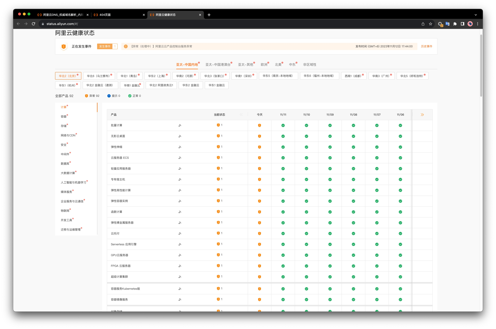
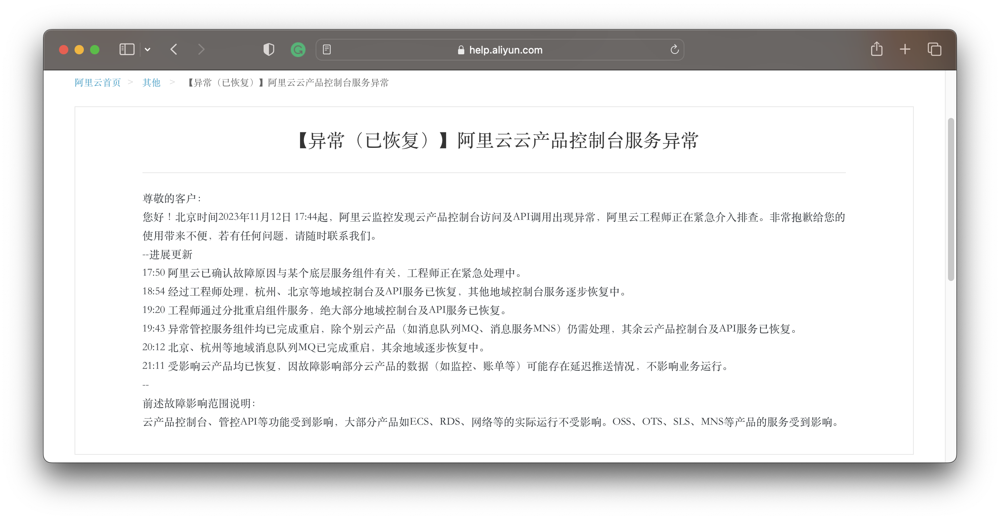
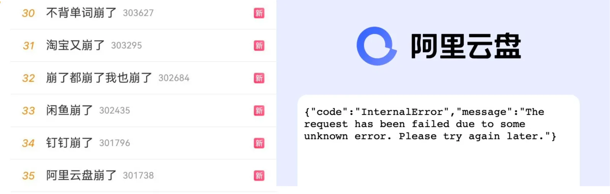
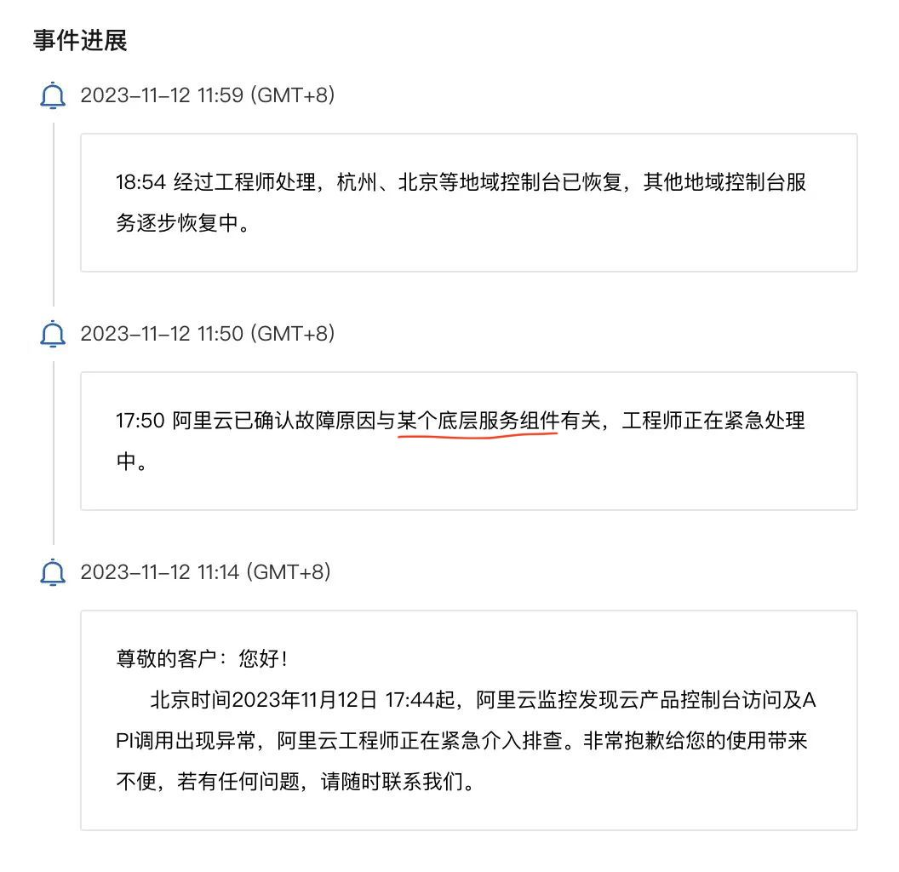
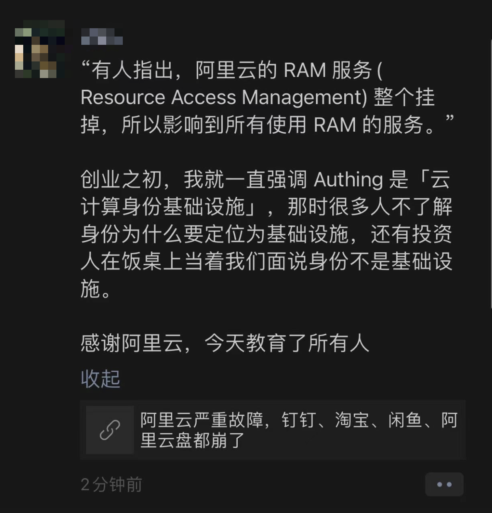
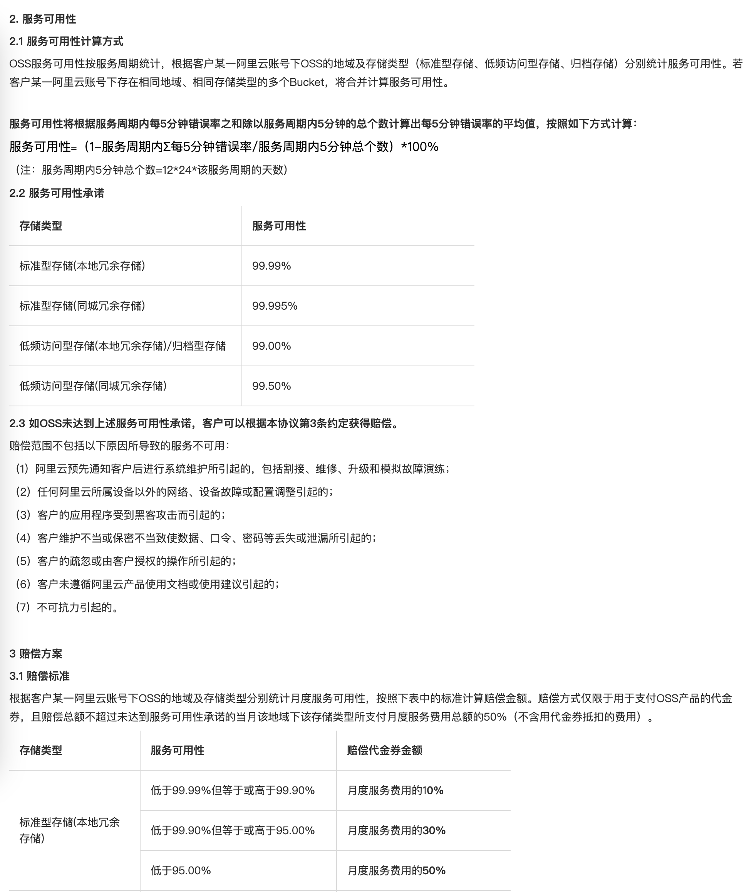
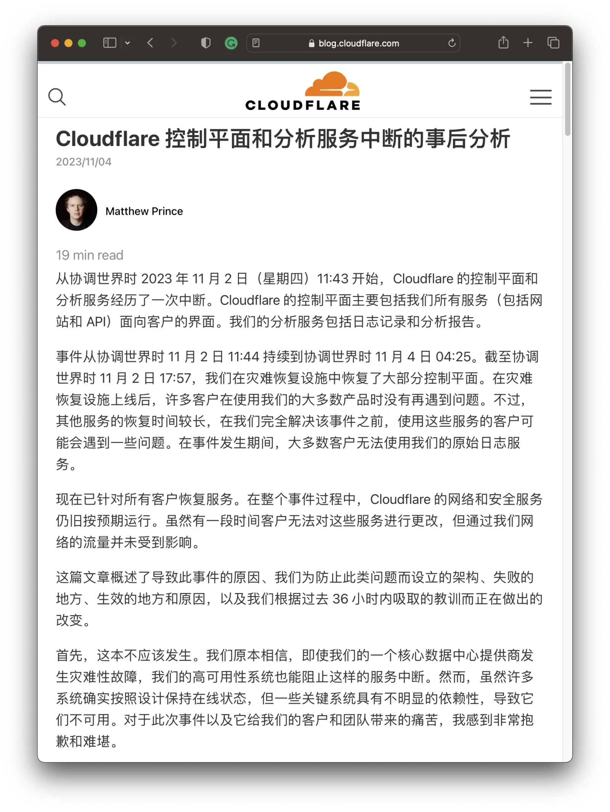

时隔一年阿里云又出大故障，并创造了云计算行业闻所未闻的新记录 —— 全球所有区域/所有服务同时异常。阿里云不愿意发布故障复盘报告，那我就来替他复盘 —— 我们应当如何看待这一史诗级故障案例，以及，能从中学习到什么经验与教训？

- [事实是什么？](#事实是什么)
- [原因是什么？](#原因是什么)
- [影响是什么？](#影响是什么)
- [评论与观点？](#评论与观点)
- [能学到什么？](#能学到什么)

------

## 事实是什么？

2023年11月12日，双十一后第一天，阿里云出了一场[史诗级大翻车](https://mp.weixin.qq.com/s/cTge3xOlIQCALQc8Mi-P8w)。**全球所有区域同时出现故障**，创造了闻所未闻的行业新记录。
根据阿里云官方的[服务状态页](https://status.aliyun.com/#/)，全球所有区域/可用区 ✖️ 所有服务全部出现异常，时间范围从 17:44 到 21: 11 ，共计三个半小时。

> 阿里云 **Status Page**

[阿里云公告](https://help.aliyun.com/noticelist/articleid/1064981333.html)称：

> “云产品控制台、管控API等功能受到影响，OSS、OTS、SLS、MNS等产品的服务受到影响，大部分产品如ECS、RDS、网络等的实际运行不受影响”。

大量依赖阿里云服务的应用 APP，包括阿里系自己的一系列应用：淘宝，钉钉，闲鱼，…… 都出现了问题。产生了显著的外部影响，APP崩了的新闻组团冲上了热搜。

淘宝刷不出聊天图片，闪送上传不了接单凭据，充电桩用不了，原神发不出验证码，饿了么下不了单，骑手进不了系统，点不了外卖、停车场不抬杆、超市无法结账。甚至有的学校因此无法用智能公共洗衣机和开水机。无数在周末休息中的研发与运维人员被喊起来加班排障……

包括金融云、政务云在内的区域也没有幸免。阿里云应该感到万幸：故障不是发生在双十一当天，也不在衙门与钱庄的工作时间段，否则大家说不定能上电视看故障复盘了。

-------------------

## 原因是什么？

尽管阿里云至今仍未给出一份事后故障复盘报告，但老司机根据爆炸半径，就足以判断出问题在哪里了 —— **Auth** （认证 / 鉴权 / RAM）。

存储计算硬件故障、机房断电这些问题最多影响单个可用区（AZ），网络故障最多影响一个区域（Region），能让全球所有区域同时出问题的肯定不会是这些问题，而是跨区域共用的云基础设施组件。 —— 极大概率是 **Auth**，低概率是其他诸如计量付费之类的全局性服务。

> 阿里云的事件进展公告：出问题的是某个底层服务组件，而不是网络、机房硬件的问题。

根因出在 **Auth** 上的可能性最大，最直接的证明就是：深度与 **Auth** 集成的云服务：对象存储 **OSS** （类 S3），表格存储 **OTS** （类 DynamoDB），以及其他深度依赖 **Auth** 的服务本身可用性直接受到影响。而本身运行不依赖 **Auth** 的云资源，比如云服务器 **ECS** / 云数据库 **RDS** 以及网络仍然可以“正常”运行，用户只是无法通过控制台与API对其进行管理与变更。此外，一个可以排除的**计量付费**服务出问题的现象是：故障期间还有用户成功付款[薅下了ECS的羊毛](/cloud/ecs/)。

尽管上面的分析过程只是一种推断，但它与流传出来的内部消息相吻合：**认证**挂了导致所有服务异常。至于认证服务本身到底是怎么挂的，在尸检报告出来前我们也只能猜测：**人为配置失误**的可能性最大 —— 因为故障不在常规变更发布窗口中，也没有灰度生效，不太像是代码/二进制发布。但具体是哪里配置失误：证书，黑白名单，循环依赖死锁，还是什么其他东西，就不知道了。

关于根因的小道消息也漫天飞舞，比如，有人说 ”权限系统推了个黑名单规则，黑名单规则维护在OSS上，访问OSS叉需要访问权限系统，然后权限系统又要访问OSS，就尬住了“。”。还有人说 “这次双11期间，技术人员连续一周加班加点，双11一过，大家都松懈了。有个新手写了一段代码，更新了组件，导致了本次的断网“，还有人说：”阿里云所有服务用的都是同一个通配符证书，证书换错了“。

如果是因为这些原因导致 **Auth** 挂掉，那可真是[草台班子](https://mp.weixin.qq.com/s/y9IradwxTxOsUGcOHia1XQ)到家了。尽管听上去很离谱，但这样的先例并不少。再次强调，这些路边社消息仅供参考，具体事故原因请以阿里云官方给出的复盘分析报告为准。

-------------------

## 影响是什么？

**认证/鉴权**是服务的基石，像这样的基础性组件一旦出现问题，影响是**全局性**、**灾难性**的。这会导致整个**云管控面**不可用，伤害会直接冲击控制台，API，以及深度依赖 **Auth** 基础设施的服务 —— 比如公有云上的另一个基石性服务，对象存储 **OSS**。

从阿里云公告上来看，好像只有 “*几个服务（ **OSS、OTS、SLS、MNS**）受到影响，大部分产品如ECS、RDS、网络等的实际运行不受影响* ”。但对象存储 **OSS** 这样的基石性服务出了问题，带来的爆炸半径是难以想象的，绝非“个别服务受到影响” 就能敷衍过去 —— 这就像汽车的油箱都着火了，说发动机和轮子仍然在转是没有意义的。

对象存储 **OSS** 这样的服务是通过云厂商包装的 HTTP API 对外提供服务的，因此必然深度依赖认证组件：你需要AK/SK/IAM 签名才能使用这些 HTTP API，而 Auth 故障将导致这类服务本身不可用。

**对象存储 OSS 实在是太重要了**，可以说是云计算的“定义性服务”，也许是唯一能在所有云上基本达成共识标准的服务。云厂商的各种“上层”服务或多或少都直接/间接地依赖 OSS，例如 ECS/ RDS 虽然可以运行，但 ECS 快照和 RDS 备份显然是深度依赖 OSS 的，CDN 回源是依赖 OSS 的，各个服务的日志往往也是写入 OSS 的。

从现象上看，核心功能跟 OSS 深度绑定的阿里云盘就挂的很惨烈，核心功能跟 OSS 关系不大的服务，比如高德地图就没听说有什么大影响。大部分相关应用的状态是，主体可以正常打开运行，但是和图片展示，文件上传/下载文件这类有关的功能就不可用了。

有一些实践减轻了对 OSS 的冲击：比如通常被认为是不安全的 —— 不走认证的 Public 存储桶就不受影响；CDN 的使用也缓释了 OSS 的问题：淘宝商品图片走 CDN 缓存还可以正常看到，但是买家聊天记录里实时发送的图片直接走 OSS 就挂了。

不仅仅是 OSS，其他深度集成依赖 Auth 的云服务也会有这样的问题，比如 **OTS，SLS，MNS** 等等。例如对标 DynamoDB 的表格存储服务 **OTS** 同样出现了问题。这里有一个非常鲜明的对比，像 **RDS** for PostgreSQL / MySQL 这样的云数据库服务使用的是数据库自身的认证机制，所以不受云厂商 Auth 服务故障影响。然而 OTS 没有自己的权限系统，而是直接使用 IAM/RAM，与云厂商的 Auth 深度绑定，因此受到了冲击。

技术上的影响是一方面，更重要的是业务影响。根据阿里云的 **服务等级协议（SLA）**，3个半小时的故障使得当月各服务可用性指标降至 99.5%。落入绝大多数服务赔偿标准的中间档位上，也就是赔偿用户月度服务费用 25% ~ 30% 的**代金券**。特殊的是这一次故障的区域范围和服务范围是**全部**！

> 阿里云 OSS SLA

当然阿里云也可以主张说虽然 **OSS / OTS** 这些服务挂了，但他们的 **ECS**/**RDS** 只挂了**管控面**，不影响正在运行的服务,所以不影响 SLA。不过这种补偿即便真的全部落地也没几个钱，更像是一种安抚性的姿态：**毕竟**和用户的业务损失比，赔个服务月消 25%代金券简直就是一种**羞辱**。

比起用户信任、技术声望以及商誉折损而言，赔的那点代金券真的算不上三瓜两枣。这次事件如果处理不当，会成为**公有云拐点级别的标志性事件**。

-------------------

## 评论与观点？

马斯克的推特 X 和 DHH 的 37 Signal [通过下云省下了千万美元真金白银](/cloud/exit/)，创造了降本增效的“奇迹”，让下云开始成为一种潮流。云上的用户在对着账单犹豫着是否要下云，未上云的用户更是内心纠结。在这样的背景下，作为本土云领导者的阿里云发生如此重大故障，对于犹豫观望者的信心无疑是沉重的打击。恐怕此次故障会成为公有云**拐点级别的标志性事件**。

阿里云一向以安全稳定高可用自居，上周还刚在云栖大会上吹极致稳定性之类的牛逼。但是无数所谓的的灾备，高可用，多活，多中心，降级方案，被一次性全部击穿，打破了N个9神话。如此大范围、长时间、影响面如此广的故障，更是创下了云计算行业的历史记录。

这次故障揭示出关键基础设施的巨大风险，大量依托于公有云的网络服务**缺乏最基本的自主可控**能力：当故障发生时没有任何自救能力，除了等死做不了别的事情。甚至包括金融云和政务云在内也同样出现了服务不可用。同时，它也反映出了**垄断中心化基础设施的脆弱性**：互联网这个**去中心化**的世界奇观现在主要是在少数几个大公司/云厂商拥有的服务器上运行 —— 某个云厂商本身成为了最大的业务单点，这可不是互联网设计的初衷！

更为严峻的挑战恐怕还在后面，全球用户追索赔钱事还小，真正要命的是在各个国家都在强调**数据主权**的时候，如果因为在中国境内的某个控制中心配置失当导致全球故障的话，（即：你真的卡了别人的脖子）很多海外客户会立即采取行动迁移到别的云供应商上：**这关乎合规性，与可用性无关**。

根据海恩法则，一次严重故障的背后有几十次轻微事故，几百起未遂先兆，以及上千条事故隐患。去年十二月阿里云香港机房的大故障已经暴露出来许多问题，然而一年后又给了用户一个更大的惊喜（吓！）。这样的事故对于阿里云的品牌形象绝对是致命打击，甚至**对整个行业的声誉都有严重的损害**。阿里云应该尽快给用户一个解释与交代，发布详细的故障复盘报告，讲清楚后续改进措施，挽回用户的信任。

毕竟这种规模的故障，不是“找个临时工背锅，杀个程序员祭天” 能解决的事，CEO 得亲自出面道歉解决。Cloudflare 月初的管控面故障后，CEO 立即撰写了详细的[事后复盘分析](https://blog.cloudflare.com/post-mortem-on-cloudflare-control-plane-and-analytics-outage/)，挽回了一些声誉。可不幸的是，阿里云经过了几轮裁员，一年连换三轮 CEO ，恐怕已经难有能出来扛事背责的人了。

-------------------

## 能学到什么？

往者不可留，逝者不可追，比起哀悼无法挽回的损失，更重要的是从损失中吸取教训 —— 要是能从别人的损失中吸取教训那就更好了。所以，我们能从阿里云这场史诗级故障中学到什么？

-------------------

**不要把鸡蛋放在同一个篮子里**，准备好 PlanB，比如，业务域名解析一定要套一层 CNAME，且 CNAME 域名用不同服务商的解析服务。这个中间层对于阿里云这样的故障非常重要，用另外一个 DNS 供应商，至少可以给你一个把流量切到别的地方去的选择，而不是干坐在屏幕前等死，毫无自救能力。

-------------------

**区域优先使用杭州与北京**，阿里云故障恢复明显有优先级，阿里云总部所在地的杭州（华东1）和北京（华北2）故障修复的速度明显要比其他区域快很多，别的可用区故障恢复用了三个小时，这两个可用区一个小时就修复了。这两个区域可以考虑优先使用，虽然同样是吃故障，但你可以和阿里自家业务享受同种婆罗门待遇。

-------------------

**谨慎使用需要云认证的服务**：Auth 是云服务的基石，大家都期待它可以始终正常工作 —— 然而越是人们感觉不可能出现故障的东西，真的出现故障时产生的杀伤力就越是毁天灭地。如无必要，勿增实体，更多的依赖意味着更多的失效点，更低的可靠性：正如在这次故障中，使用自身认证机制的 ECS/RDS 本身就没有受到直接冲击。深度使用云厂商提供的 AK/SK/IAM 不仅会让自己陷入供应商锁定，更是将自己暴露在公用基础设施的单点风险里。

-------------------

**谨慎使用云服务，优先使用纯资源**。在本次故障中，**云服务**受到影响，但**云资源**仍然可用。类似 ECS/ESSD 这样的**纯资源**，以及单纯使用这两者的 RDS，可以不受管控面故障影响可以继续运行。基础云资源（ECS/EBS）是所有云厂商的提供服务的**最大公约数**，只用资源有利于用户在不同公有云、以及本地自建中间择优而选。不过，很难想象在公有云上却不用对象存储 —— 在 ECS 和天价 ESSD 上用 MinIO 自建对象存储服务并不是真正可行的选项，这涉及到公有云商业模式的核心秘密：[廉价S3获客](/cloud/s3)，[天价EBS杀猪](/cloud/ebs/)

-------------------

**自建是掌握自身命运的终极道路**：如果用户想真正掌握自己的命运，最终恐怕早晚会走上自建这条路。互联网先辈们平地起高楼创建了这些服务，而现在做这件事只会容易得多：IDC 2.0 解决硬件资源问题，开源平替解决软件问题，大裁员释放出的专家解决了人力问题。短路掉公有云这个中间商，直接与 IDC 合作显然是一个更经济实惠的选择。稍微有点规模的用户[下云省下的钱](/cloud/finops/)，可以换几个从大厂出来的资深SRE 还能盈余不少。更重要的是，自家人出问题你可以进行奖惩激励督促其改进，但是云出问题能赔给你几毛代金券？ —— *“你算老几能让高P舔你？”*

-------------------

**明确云厂商的 SLA 是营销工具，而非战绩承诺**

在云计算的世界里，[**服务等级协议**](/cloud/sla/)（SLA）曾被视为云厂商对其服务质量的承诺。然而，当我们深入研究这些由一堆9组成的协议时，会发现它们并不能像期望的那样“兜底”。与其说是 SLA 是对用户的补偿，不如说 SLA 是对云厂商服务质量没达标时的“惩罚”。比起会因为故障丢掉奖金与工作的专家来说，SLA 的惩罚对于云厂商不痛不痒，更像是自罚三杯。如果惩罚没有意义，云厂商也没有动力去提供更好的服务质量。所以，SLA 对用户来说不是兜底损失的保险单。在最坏的情况下，它是堵死了实质性追索的哑巴亏；在最好的情况下，它才是提供情绪价值的安慰剂。

-------------------

**最后，尊重技术，善待工程师**

阿里云这两年在大力搞“降本增效”：学人家马斯克推特大裁员，人裁几千你裁几万。但人家推挂来挂去用户捏着鼻子继续凑合用，ToB 业务跟着连环裁员连环挂，企业用户可忍得了这个？队伍动荡，人心不稳，稳定性自然会受到影响。

很难说这跟企业文化没有关系：996 修福报，大把时间内耗在无穷的会议汇报上。领导不懂技术，负责汇总周报写PPT 吹牛逼，P9 出嘴；P8 带队，真正干活的都是567，晋升没指望，裁员先找你；真正能打的顶尖人才根本不吃这一套 PUA 窝囊气，成批成批地出来创业单干 —— 环境盐碱地化：学历门槛越来越高，人才密度却越来越低。

我亲自见证的例子是，一个独立开源贡献者单人搞的 [**开源 RDS**](https://mp.weixin.qq.com/s/-E_-HZ7LvOze5lmzy3QbQA) for PostgreSQL，可以[**骑脸输出**](https://mp.weixin.qq.com/s/LefEAXTcBH-KBJNhXNoc7A)几十人 RDS 团队的产品，而对方团队甚至连发声辩白反驳的勇气都没有 —— 阿里云确实不缺足够优秀的产品经理和工程师，但请问这种事情为什么可能会发生呢？这是应该反思的问题。

阿里云作为本土公有云中的领导者，应当是一面旗帜 —— 所以它可以做的更好，而不应该是现在这幅样子。作为曾经的阿里人，我希望阿里云能吸取这次故障的教训，尊重技术，踏实做事，善待工程师。更不要沉迷于[**杀猪盘快钱**](/cloud/profit/)而忘记了自己的初心愿景 —— **提供物美价廉的公共计算服务，让存算资源像水电一样普及**。

## 参考阅读

[是时候放弃云计算了吗？](/cloud/exit/)

[下云奥德赛](/cloud/odyssey/)

[FinOps的终点是下云](/cloud/finops/)

[云计算为啥还没挖沙子赚钱？](/cloud/profit/)

[云SLA是不是安慰剂？](/cloud/sla/)

[云盘是不是杀猪盘？](/cloud/ebs/)

[云数据库是不是智商税？](/cloud/rds/)

[范式转移：从云到本地优先](/cloud/paradigm/)

[腾讯云CDN：从入门到放弃](/cloud/cdn/)

------

[【阿里】云计算史诗级大翻车来了](http://mp.weixin.qq.com/s?__biz=MzU5ODAyNTM5Ng==&mid=2247486452&idx=1&sn=29cff4ee30b90483bd0a4f0963876f28&chksm=fe4b3e2fc93cb739af6ce49cffa4fa3d010781190d99d3052b4dbfa87d28c0386f44667e4908#rd)

[阿里云的羊毛抓紧薅，五千的云服务器三百拿](http://mp.weixin.qq.com/s?__biz=MzU5ODAyNTM5Ng==&mid=2247486438&idx=1&sn=b2c489675134d4e84fbc249089777cb4&chksm=fe4b3e3dc93cb72b5d0d90ef61011dda5a09e5f08d96c8cca87148706451c859777162bd18da#rd)

[云厂商眼中的客户：又穷又闲又缺爱](http://mp.weixin.qq.com/s?__biz=MzU5ODAyNTM5Ng==&mid=2247486387&idx=1&sn=20ac92e33ed5a6b8e3120e99aefaf1cc&chksm=fe4b3e68c93cb77ed5b627c8caf78666cab9deafc18dacf528e51411682e616b4df1deab87f9&scene=21#wechat_redirect)

[阿里云的故障在其他云也可能发生,并且可能丢数据](http://mp.weixin.qq.com/s?__biz=MzkwODMyMDE2NQ==&mid=2247483770&idx=1&sn=723c865ff27fd0ceace1d8fb2c76ddca&chksm=c0ca8db0f7bd04a63f79aba185e093bbb0ab5763b1f91f58cfc86551daf7e47bd6627dd8c73b#rd)

[中国云服务走向全球？先把 Status Page 搞定](http://mp.weixin.qq.com/s?__biz=MzkwODMyMDE2NQ==&mid=2247483764&idx=1&sn=8aebb4053257fac48f71b75a957153ad&chksm=c0ca8dbef7bd04a816feba238a2232abdc02b5ccdb405f32217455dc3bf3a1811bd4ff8815af#rd)

[我们可以信任阿里云的故障处理吗?](http://mp.weixin.qq.com/s?__biz=MzkwODMyMDE2NQ==&mid=2247483759&idx=1&sn=eb12dfe4df37c22aadd120676391f4cb&chksm=c0ca8da5f7bd04b3a024111b5c3be9f273c70087cc986937e72e12d7a0fe496753a88568afe9#rd)

[给阿里云的一封公开信](http://mp.weixin.qq.com/s?__biz=MzkwODMyMDE2NQ==&mid=2247483762&idx=1&sn=903405e0b64037f1b7d44b23f0c9b08d&chksm=c0ca8db8f7bd04ae55f719df891d811d05269dac3a8e0a894d23292e06674058c943712672f5#rd)

[平台软件应该像数学一样严谨 --- 和阿里云RAM团队商榷](http://mp.weixin.qq.com/s?__biz=MzkwODMyMDE2NQ==&mid=2247484048&idx=1&sn=b57839c9dc85fe3dc6eaac01ff37b995&chksm=c0ca8e5af7bd074ca5221de40c47b82378a8ca20f348ab1c80de7d244679733ee80e29cb3381#rd)

[被医药业吊打的中国软件从业者](http://mp.weixin.qq.com/s?__biz=MzkwODMyMDE2NQ==&mid=2247484025&idx=1&sn=5c6f1b0035b7f9a657a5d24d68699943&chksm=c0ca8eb3f7bd07a550325dd691c5761cbf99a9b4644d14c9bbb512dc9ecd27033622bb83e58e#rd)

[腾讯的错别字文化](http://mp.weixin.qq.com/s?__biz=MzkwODMyMDE2NQ==&mid=2247484019&idx=1&sn=5dbe25e5c8d39a67bf9e9573ba2e9b98&chksm=c0ca8eb9f7bd07af03f6d1228d73153fc37479a132a697c310851bfbffcf997ce991a7c2f010#rd)

[云为什么留不住客户 — 以腾讯云 CAM 为例](http://mp.weixin.qq.com/s?__biz=MzkwODMyMDE2NQ==&mid=2247484064&idx=1&sn=cedf630065c88b936133001f84690c75&chksm=c0ca8e6af7bd077c417aae032cc91281808e8768ea4f103dd1c71039986079c49bbd0aa03507#rd)

[腾讯云团队为什么用阿里云的服务名？](http://mp.weixin.qq.com/s?__biz=MzkwODMyMDE2NQ==&mid=2247483883&idx=1&sn=f2644e9ff54790b319d63a1ffb26e717&chksm=c0ca8d21f7bd0437b3be51f1d093ff45fac4e36552cdbf8b27c8d0ec5470e85ac46dd7f136a3#rd)

[究竟是客户差劲，还是腾讯云差劲？](http://mp.weixin.qq.com/s?__biz=MzkwODMyMDE2NQ==&mid=2247483846&idx=1&sn=9a2f3cd59147d2444b7432ecf50af9ba&chksm=c0ca8d0cf7bd041a3f56fcf0bb4adbde8434d81818009f9906c0fa3d1121017996f572b0237e#rd)

[百度腾讯阿里真的是高科技企业吗？](http://mp.weixin.qq.com/s?__biz=MzkwODMyMDE2NQ==&mid=2247483694&idx=1&sn=618a3aa4f196c30eb9e89969643b06e9&chksm=c0ca8de4f7bd04f25b277942fb41da2092c073f3db55fb92020ba66f21e14522e823a8a3346c#rd)

[云计算厂商们，你们辜负了中国的用户](http://mp.weixin.qq.com/s?__biz=MzkwODMyMDE2NQ==&mid=2247483663&idx=1&sn=27f37af0dc4e755d7a64f341de6d8aad&chksm=c0ca8dc5f7bd04d3f4a4437a63958eb93be56722ed32c43385bf41631c86a869bdeada35af04#rd)

[除了打折虚拟机, 云计算用户究竟在用什么高阶云服务?](http://mp.weixin.qq.com/s?__biz=MzkwODMyMDE2NQ==&mid=2247483712&idx=1&sn=acdb5adf0d588d9617ed72b5ffca8dd3&chksm=c0ca8d8af7bd049c0a69cfebb950c07f599a807876a5d0748122e9a0b0528d216a8d5d968197#rd)

[腾讯云阿里云做的真的是云计算吗?--从客户成功案例的视角](http://mp.weixin.qq.com/s?__biz=MzkwODMyMDE2NQ==&mid=2247483743&idx=1&sn=9f329de1649fac75f69e57270978d047&chksm=c0ca8d95f7bd0483d6af4940ca342e2544135e9de0b56fa1a6f299c887800aae04c11b0551bd#rd)

[本土云厂家究竟在服务谁？](http://mp.weixin.qq.com/s?__biz=MzkwODMyMDE2NQ==&mid=2247483828&idx=1&sn=e03403d98876700134be4d1127371fe2&chksm=c0ca8d7ef7bd0468677fc02cc47c530cdad242ac56ee485cb7b16667afafabc2339af0a995c6#rd)