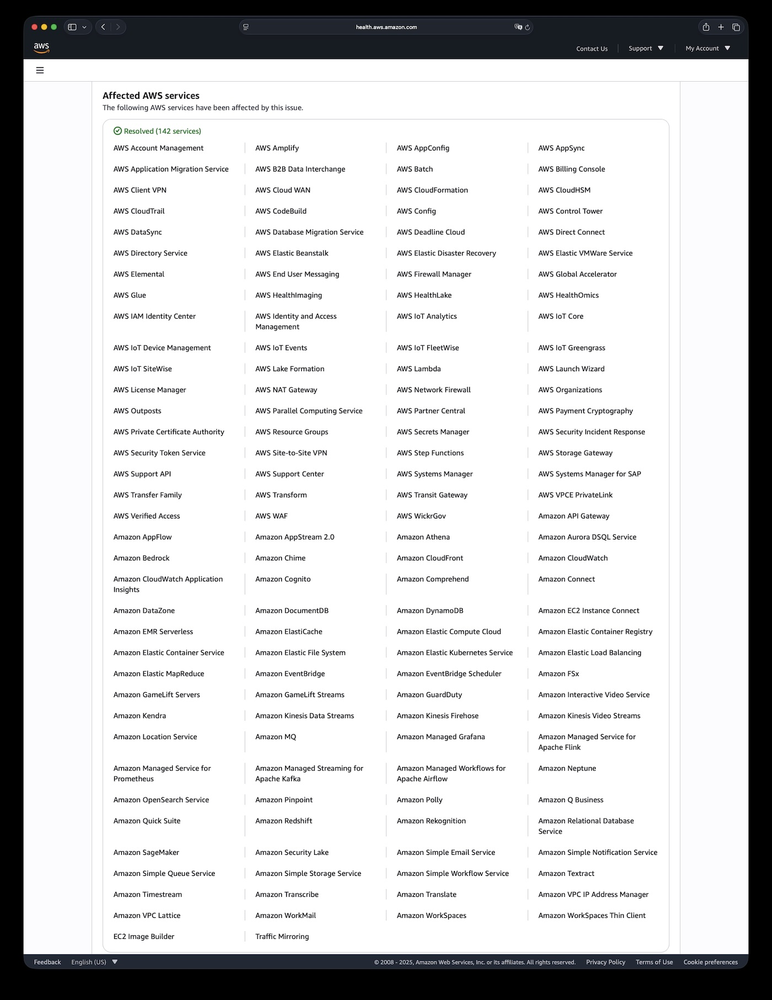

On Oct 20, 2025, AWS’s crown jewel region us-east-1 spent fifteen hours flailing. More than a thousand companies went dark worldwide. The root cause? An internal DNS entry that stopped resolving.

From the moment DNS broke, DynamoDB, EC2, Lambda, and 139 other services quickly degraded. Snapchat, Roblox, Coinbase, Signal, Reddit, Robinhood—gone. Billions evaporated in half a day. This was a cyber earthquake.

The most alarming part: us-east-1 hosts the control plane for every commercial AWS region. Customers running in Europe or Asia still got wrecked, because their control traffic routes through Virginia. A single DNS hiccup turned into a multi-billion dollar blast radius. This isn’t a “skills” problem; it’s architectural hubris. us-east-1 became the nervous system of the internet, and nervous systems seize up.

## Cyberquake math: billions torched in hours

Catchpoint’s CEO estimated the damage somewhere between “billions” and “hundreds of billions.”

Finance bled first. Robinhood was offline through the entire NYSE session; millions of traders were locked out. Coinbase’s outage froze crypto markets in the middle of volatility. Venmo logged 8,000 outage reports—imagine a whole society losing its wallet mid-day.

Gaming giants cratered. Roblox’s hundred-million DAUs were suddenly ejected. Fortnite, Pokémon GO, Rainbow Six—all silent. For engagement-driven platforms, each downtime hour is permanent churn.

UK government portals, tax systems, customs, banks, and several airlines reported disruptions. Even Amazon’s own empire stopped: amazon.com, Alexa, Ring doorbells, Prime Video, and AWS’s own ticketing tools failed. Turns out even the company that built us-east-1 can’t escape its single point of failure.

## Root cause: DNS butterflies

11:49 PM PDT, Oct 19: error rates in us-east-1 spiked. AWS didn’t confirm until 22 minutes later, and the mess dragged on until 3:53 PM Oct 20—a 16-hour saga.

AWS’s [status post](https://health.aws.amazon.com/health/status?eventID=arn:aws:health:us-east-1::event/MULTIPLE_SERVICES/AWS_MULTIPLE_SERVICES_OPERATIONAL_ISSUE/AWS_MULTIPLE_SERVICES_OPERATIONAL_ISSUE_BA540_514A652BE1A) reads like slapstick: an internal DNS lookup failed. That single failure cut DynamoDB off from everything else. DynamoDB underpins IAM, EC2, Lambda, CloudWatch—the entire control plane.

DNS got patched in 3.5 hours, but the backlog triggered a retry storm that clobbered DynamoDB again. EC2, load balancers, and Lambda all depend on DynamoDB, and DynamoDB depends right back on them. The ouroboros locked up. AWS had to manually throttle EC2 launches and Lambda/SQS polling to stop the cascade, then inch the fleet back online.

## Cascading amplification: the Achilles heel

us-east-1 isn’t just another datacenter—it’s the **central nervous system** of AWS. Excluding China, GovCloud, and the EU’s sovereign region, every control-plane call funnels through Virginia.

Translation: even if you run workloads in Tokyo or Frankfurt, IAM auth, S3 configuration, DynamoDB global tables, Route 53 updates—all still go to us-east-1. That’s why the UK government, Lloyds Bank, and Canada’s Wealthsimple all went down: invisible dependencies bite just the same.

us-east-1 holds this power because it’s the oldest region. Nineteen years of layers, debt, and special cases piled up. Refactoring it would touch millions of lines, thousands of services, and untold customer assumptions. AWS chose to live with the risk. Incidents like this remind us of that price.

## Technical autopsy: how a papercut becomes an ICU stay

From 2017 to 2025, every us-east-1 catastrophe exposed the same anti-patterns. Nobody learned.

| **Aspect** | **2017 S3 Outage** | **2020 Kinesis Outage** | **2025 DNS Outage** |
|-----------|--------------------|-------------------------|---------------------|
| Trigger | Human error (fat finger) | Scaling limit (thread caps) | DNS resolution failure |
| Core service | S3 | Kinesis | DynamoDB |
| Duration | ~4 hours | 17 hours | 16 hours |
| Cascade path | S3 → EC2 → EBS → Lambda | Kinesis → EventBridge → ECS/EKS → CloudWatch → Cognito | DNS → DynamoDB → IAM → EC2 → NLB → Lambda / CloudWatch |
| Recovery pain | Massive subsystem restarts | Gradual reboots & routing rebuild | Retry storms, backlog drain, NLB health rebuild |
| Monitoring blind spots | Service Health Dashboard down | CloudWatch degraded | CloudWatch & SHD impaired |
| Blast radius | us-east-1 (plus dependents) | us-east-1 | Global (IAM/global tables) |
| Economic impact | $150M for S&P 500 firms | N/A | Billions to hundreds of billions |

**Looped dependencies, death-spiral edition.** AWS microservices are a hairball. IAM, EC2 management, ELB—all lean on DynamoDB; DynamoDB leans on them. Complexity hides inside layers of abstraction, making diagnosis painfully slow. We’ve seen the exact same story at [Alicloud](https://mp.weixin.qq.com/s/OIlR0rolEQff9YfCpj3wIQ), [OpenAI](https://mp.weixin.qq.com/s/ze4y9x7VpPmibitH7tAGMQ), and [Didi](https://mp.weixin.qq.com/s/FIOB_Oqefx1oez1iu7AGGg): circular dependencies kill you the day something hiccups.

**Centralized single points of failure.** After the 2020 Kinesis collapse, AWS evangelized its “cell-based” design and said it was migrating services to it. Yet us-east-1 still anchors the global control plane. Six availability zones mean nothing when DNS—the ultimate shared service—goes sideways. Multi-region fantasies crumble in the face of one supernode.

**Monitoring eating its tail.** AWS’s monitoring stacks run on AWS. Datadog does too. When us-east-1 went dark, everything that would’ve sounded the alarm went dark with it. Seventy-five minutes in, the AWS status page still showed “all green.” Not malice—just blindness.

**Circuit breakers MIA.** AWS preaches breakers everywhere, but internal meshes apparently ignore that advice. Once DynamoDB glitched, every upstream service hammered it harder. The retry wave did more damage than the initial failure. Eventually AWS engineers had to rate-limit systems by hand. “Automate all the things” devolved into babysitting.

## Organizational amnesia

Ops folks have a meme: ***It’s always DNS.*** Any veteran SRE would start there. AWS wandered in the dark for hours, then flailed with manual throttles for five more hours. When you hollow out your expert teams, this is what you get.

Amazon laid off 27k people between 2022 and 2025. Internal docs show “regretted attrition” at 69–81%—meaning most departures were folks the company wanted to keep. The forced return-to-office push drove even more seniors out. [Justin Garrison predicted](https://justingarrison.com/blog/2023-12-30-amazons-silent-sacking/) in 2023 that major outages would follow. He was optimistic.

> “Regretted attrition” = employees the company didn’t want to lose but lost anyway.

You can’t replace institutional memory. The engineers who knew which microservice relied on which shadow API are gone. New hires don’t have the scar tissue to debug cascading chaos. You can’t document that intuition; it only comes from years of firefights. So the next edge case hits, and the on-call team spends a hundred times longer fumbling toward the fix.

Cloud economist Corey Quinn put it plainly in [The Register](https://www.theregister.com/2025/10/20/aws_outage_amazon_brain_drain_corey_quinn/): “Lay off your best engineers and don’t be shocked when the cloud forgets how DNS works. The next catastrophe is already queued; the only question is which understaffed team trips over which edge case first.”

## A colder future: designing for fragility

A few months ago a [Google IAM outage](https://mp.weixin.qq.com/s/yZOUzoEHQdBuNFrSIXVB9w) took down half the internet. Less than half a year later, AWS repeated the feat with DNS. When a single DNS record inside one hyperscaler can disrupt tens of millions of lives, we need to admit the obvious: **cloud convenience bought us systemic fragility.**

Three U.S. companies control 63% of global cloud infrastructure. That’s not just a tech risk; it’s geopolitical exposure. Convenience vs. concentration is a lose-lose paradox.

Marketing promises “four nines,” “global active-active,” and “enterprise-grade reliability.” Stack AWS/Azure/GCP’s actual outage logs and the myth disintegrates. [Cherry Servers’ 2025 report](https://www.cherryservers.com/blog/cloud-outages) lays out the numbers:

| Cloud Provider | Incidents (2024.08–2025.08) | Avg Duration |
|:---------------|:----------------------------|:-------------|
| AWS | 38 | 1.5 hours |
| Google Cloud | 78 | 5.8 hours |
| Microsoft Azure | 9 | 14.6 hours |

> Headline numbers from the study

“Leaving the cloud” used to sound heretical. Now it’s just risk management. Elon Musk’s X (formerly Twitter) ran fine through this AWS outage because it operates its own datacenters. Musk spent the downtime roasting AWS on X. 37signals decided in 2022 to yank Basecamp and HEY off public clouds, [projecting eight figures of savings over five years](https://mp.weixin.qq.com/s/mknFXO5DSfxw7st8hhxjBQ). Dropbox started rolling its own hardware back in 2016. That’s not regression; it’s diversification.

For teams with resources, **hybrid deployment** makes sense: keep the crown jewels under your control, burst to cloud for elastic needs. Ask whether every workload truly belongs on a hyperscaler. Can your critical systems keep the lights on if the cloud disappears for a day?

**Build resilience inside fragility. Maintain autonomy inside dependence.** us-east-1 will fail again—not if, but when. The real question is whether you’ll be ready next time.

## References

[AWS: Update – services operating normally](https://www.aboutamazon.com/news/aws/aws-service-disruptions-outage-update)

[AWS Health: Operational issue – Multiple services (N. Virginia)](https://health.aws.amazon.com/health/status?eventID=arn:aws:health:us-east-1::event/MULTIPLE_SERVICES/AWS_MULTIPLE_SERVICES_OPERATIONAL_ISSUE/AWS_MULTIPLE_SERVICES_OPERATIONAL_ISSUE_BA540_514A652BE1A)

[HN: AWS multiple services outage in us-east-1](https://news.ycombinator.com/item?id=45640838)

[CNN: Amazon says systems are back online after global internet outage](https://edition.cnn.com/business/live-news/amazon-tech-outage-10-20-25-intl)

[The Register: Brain drain finally sends AWS down the spout](https://www.theregister.com/2025/10/20/aws_outage_amazon_brain_drain_corey_quinn/)

[Converge: DNS failure triggers multi-service AWS disruption](https://convergedigest.com/aws-reports-major-outage-in-us-east-1-region/)

--------

## Incident log

**12:11 AM PDT** – Investigating elevated error rates and latency across multiple services in us-east-1 (N. Virginia). Next update in 30–45 minutes.

**12:51 AM PDT** – Multiple services confirmed impacted; Support Center/API also flaky. Mitigations underway.

**1:26 AM PDT** – Significant errors on DynamoDB endpoints; other services affected. Support ticket creation remains impaired. Engineering engaged; next update by 2:00.

**2:01 AM PDT** – Potential root cause identified: DNS resolution failures for DynamoDB APIs in us-east-1. Other regional/global services (IAM updates, DynamoDB global tables) also affected. Keep retrying. Next update by 2:45.

**2:22 AM PDT** – Initial mitigations deployed; early recovery signs. Requests may still fail; expect higher latency and backlogs needing extra time.

**2:27 AM PDT** – Noticeable recovery; most requests should now succeed. Still draining queues.

**3:03 AM PDT** – Most impacted services recovering. Global features depending on us-east-1 also coming back.

**3:35 AM PDT** – DNS issue fully mitigated; most operations normal. Some throttling remains while CloudTrail/Lambda drain events. EC2 launches (and ECS) still see elevated errors; refresh DNS caches if DynamoDB endpoints still misbehave. Next update by 4:15.

**4:08 AM PDT** – Working through EC2 launch errors (including “insufficient capacity”). Mitigating elevated Lambda polling latency for SQS event-source mappings. Next update by 5:00.

**4:48 AM PDT** – Still focused on EC2 launches; advise launching without pinning an AZ so EC2 can pick healthy zones. Impact extends to RDS, ECS, Glue. Auto Scaling groups should span AZs. Increasing Lambda polling throughput for SQS; AWS Organizations policy updates also delayed. Next update by 5:30.

**5:10 AM PDT** – Lambda event-source polling for SQS restored; draining queued messages.

**5:48 AM PDT** – Progress on EC2 launches; some AZs can start new instances. Rolling mitigations to remaining AZs. EventBridge and CloudTrail backlogs continue to drain without new delays. Next update by 6:30.

**6:42 AM PDT** – More mitigations applied, but EC2 launch errors remain high. Throttling new launches to aid recovery. Next update by 7:30.

**7:14 AM PDT** – Significant API and network issues confirmed across multiple services. Investigating; update within 30 minutes.

**7:29 AM PDT** – Connectivity problems impacting multiple services; early recovery signals observed while root cause analysis continues.

**8:04 AM PDT** – Still tracing connectivity issues (DynamoDB, SQS, Amazon Connect, etc.). Narrowed to EC2’s internal network. Mitigation planning underway.

**8:43 AM PDT** – Further narrowed: internal subsystem monitoring Network Load Balancer (NLB) health is misbehaving. Throttling EC2 launches to help recovery.

**9:13 AM PDT** – Additional mitigation deployed; NLB health subsystem shows recovery. Connectivity and API performance improving. Planning next steps to relax EC2 launch throttles. Next update by 10:00.

**10:03 AM PDT** – Continuing NLB-related mitigations; network connectivity for most services improving. Lambda invocations still erroring when creating new execution environments (including Lambda@Edge). Validating an EC2 launch fix to roll out zone by zone. Next update by 10:45.

**10:38 AM PDT** – EC2 launch fix progressing; some AZs show early recovery. Rolling out to remaining zones should resolve launch and connectivity errors. Next update by 11:30.

**11:22 AM PDT** – Recovery continues; more EC2 launches succeed, connectivity issues shrink. Lambda errors dropping, especially for cold starts. Next update by noon.

**12:15 PM PDT** – Broad recovery observed. Multiple AZs launching instances successfully. Lambda functions calling other services may still see intermittent errors while network issues clear. Lambda-SQS polling was reduced earlier; rates now ramping back up. Next update by 1:00.

**1:03 PM PDT** – Continued improvement. Further reducing throttles on new EC2 launches. Lambda invocation errors fully resolved; event-source polling for SQS restored to pre-incident levels. Next update by 1:45.

**1:52 PM PDT** – EC2 throttles continue to ease across all AZs; ECS/Glue etc. recover as launches succeed. Lambda is healthy; queued events should clear within ~two hours. Next update by 2:30.

**2:48 PM PDT** – EC2 launch throttling back to normal; residual services wrapping up recovery. Incident closed by 3:53 PM.

--------

## Extra reading

### Outage & failure stories

- [Shanghai’s “Gongjiao e Line” Lost Its App Because Tencent Cloud Missed a ¥2 Bill](https://mp.weixin.qq.com/s/Gz_Y2qyByg1y17eWILJsLw)
- [AWS Tokyo AZ Outage Hit 13 Services](https://mp.weixin.qq.com/s/4no4Raj26u6GbUiHECBAjA)
- [Shopify’s April Fool’s Outage](https://mp.weixin.qq.com/s/9352Km9U-mnv8dmsHhSdMg)
- [Oracle Cloud: 6M Users’ Auth Data Leaked](https://mp.weixin.qq.com/s/5z3jUV8CrKPinUYzOnlC6g)
- [OpenAI Global Outage Postmortem: K8s Circular Dependency](https://mp.weixin.qq.com/s/ze4y9x7VpPmibitH7tAGMQ)
- [Alipay Down Again During Double-11](https://mp.weixin.qq.com/s/D2XmL2YYN2kqHtwFN4FVGQ)
- [Apple Music Certificate Expired](https://mp.weixin.qq.com/s/eawgZ3hE63b3fRfrJ1sqfw)
- [Alicloud’s High-Availability Myth Shattered](https://mp.weixin.qq.com/s/rXwEayprvDKCgba4m-naoQ)
- [Predicting an Alicloud Outage Lasting 20 Years](https://mp.weixin.qq.com/s/G41IN2y8DrC002FQ_BXtXw)
- [Alicloud Drive Bug Leaked Everyone’s Photos](https://mp.weixin.qq.com/s/C7XGgGmzvMjKJGbBGVmrzw)
- [Alicloud Singapore AZ-C Fire](https://mp.weixin.qq.com/s/EDRmP7ninfSx-CgNDb8mpg)
- [This Time WPS Crashed](https://mp.weixin.qq.com/s/BLHaiMYGpUTjMhP7msGHhA)
- [Alicloud RDS Trainwreck](https://mp.weixin.qq.com/s/kOIw8uPjZUZ0-QisC1TBOA)
- [What We Learned From the NetEase Cloud Music Outage](https://mp.weixin.qq.com/s/tmlP1ol9qP2SIxB9VbvpEg)
- [GitHub Went Down Again—Database Flipped the Car](https://mp.weixin.qq.com/s/nOzSFkULOJeuQ4NChGxE5w)
- [Global Windows Blue Screen: Both Sides Were Clown Cars](https://mp.weixin.qq.com/s/s7i7bSYzNY8mrcpfkHPjOg)
- [Another Alicloud Outage—Was It a Fiber Cut?](https://mp.weixin.qq.com/s/cb2Lh56uINxacM2uUaB6Vw)
- [Google Cloud Nuked a Giant Fund’s Entire Account](https://mp.weixin.qq.com/s/eH5HBbL7cQhjQY8rm1gFLQ)
- [Dark Forest of the Cloud: Exploding Your Bill With an S3 Bucket Name](https://mp.weixin.qq.com/s/35ScjtPjC1GNGKaSArJhcA)
- [taobao.com Certificate Expired](https://mp.weixin.qq.com/s/-ntsNfdEq3b4qs5tKP7tfQ)
- [Tencent Cloud Outage Lessons](https://mp.weixin.qq.com/s/SpxKyjSb1luCrJ8xIFjylg)
- [Cloud SLAs: Comfort Blanket or Toilet Paper?](https://mp.weixin.qq.com/s/mgkOybNeEH3LO0gRa1rQBQ)
- [Tencent Cloud’s Embarrassing Circus](https://mp.weixin.qq.com/s/PgduTGIvWSUgHZhVfnb7Bg)
- [Tencent’s Epic Cloud Crash, Round Two](https://mp.weixin.qq.com/s/5F2YgVtfpXoe7A1MoSoKLg)
- [The Ragtag Bands Behind Internet Outages](https://mp.weixin.qq.com/s/OxhhJ4U1P43di_eaE1uGPw)
- [From “Save Costs, Crack Jokes” to Actual Efficiency Gains](https://mp.weixin.qq.com/s/FIOB_Oqefx1oez1iu7AGGg)
- [Alicloud Weekly: Control Plane Down Again](https://mp.weixin.qq.com/s/3F1ud-tWB3eymu1-dxSHMA)
- [Lessons From Alicloud’s Epic Outage](https://mp.weixin.qq.com/s/OIlR0rolEQff9YfCpj3wIQ)
- [Alicloud’s Epic Crash, Again](https://mp.weixin.qq.com/s/cTge3xOlIQCALQc8Mi-P8w)

### Cloud economics & resources

- [Paying to Suffer: Escape From Cloud Myawaddy](https://mp.weixin.qq.com/s/zwJ2T2Vh_R7xD8IKPso31Q)
- [Is a Cloud Database Just a Tax on IQ?](https://mp.weixin.qq.com/s/LefEAXTcBH-KBJNhXNoc7A)
- [Is Cloud Storage a Pig-Butchering Scam?](https://mp.weixin.qq.com/s/UxjiUBTpb1pRUfGtR9V3ag)
- [The Real Cost of Cloud Compute](https://mp.weixin.qq.com/s/rp8Dtvyo9cItBJSsvfrKjw)
- [Peeling Back Object Storage: From Discounts to Price Gouging](https://mp.weixin.qq.com/s/HathxpQ_KUuqxyrtyCDzWw)
- [Garbage Tencent Cloud CDN: From Hello World to Rage Quit](https://mp.weixin.qq.com/s/ANFnbDXwuhKI99fgYRZ9ug)
- [Alicloud DCDN Cost a User ¥1,600 in 32 Seconds](https://mp.weixin.qq.com/s/0Wnv1B80Tk4J03X3uAm4Ww)
- [Cloud SLA: Comfort Blanket or Toilet Paper?](https://mp.weixin.qq.com/s/mgkOybNeEH3LO0gRa1rQBQ)
- [FinOps Ends With Leaving the Cloud](https://mp.weixin.qq.com/s/Yp_PU8nmyK-NVq0clD98RQ)
- [Why Haven’t Domestic Clouds Learned to Print Money?](https://mp.weixin.qq.com/s/2w0bLJI7TvUNp1tzLYbvsA)
- [Is a Cloud SLA Just Comfort Food?](https://mp.weixin.qq.com/s/LC5jAhuVObRcrTLxI1FUQA)
- [Paradigm Shift: Cloud to Local-First](https://mp.weixin.qq.com/s/Yp6L0hh4b4HuJQRPD3aJYw)

### The “leave the cloud” chronicles

- [Paying to Suffer: Escape From Cloud Myawaddy](https://mp.weixin.qq.com/s/zwJ2T2Vh_R7xD8IKPso31Q)
- [Alicloud RDS Trainwreck](https://mp.weixin.qq.com/s/kOIw8uPjZUZ0-QisC1TBOA)
- [DHH: One Day Late Leaving S3 Cost $40k](https://mp.weixin.qq.com/s/yQbtyDv1mc-r_bn9RNCSRA)
- [DHH: Leaving the Cloud Saved Nine Figures](https://mp.weixin.qq.com/s/mknFXO5DSfxw7st8hhxjBQ)
- [Optimize Carbon-Based BIO Cores Before Silicon](https://mp.weixin.qq.com/s/Yxyir8kjRDUZwkkE_dscZQ)
- [Single-Tenant SaaS Is the New Paradigm](https://mp.weixin.qq.com/s/jKv9l_ro6rWei4QnXck-zw)
- [No, Complexity Isn’t a Religion—You Can Leave the Cloud and Stay Stable](https://mp.weixin.qq.com/s/yIVal-9U6_TXX-dZpVtjBg)
- [Leaving the Cloud Saved Millions in Six Months: FAQ](https://mp.weixin.qq.com/s/xaa079P4DRCz0hzNovGoOA)
- [Is It Time to Abandon Cloud Computing?](https://mp.weixin.qq.com/s/CicctyvV1xk5B-AsKfzPjw)
- [Downcloud Odyssey](https://mp.weixin.qq.com/s/H2S3TV-AsqS43A5Hh-XMhQ)
