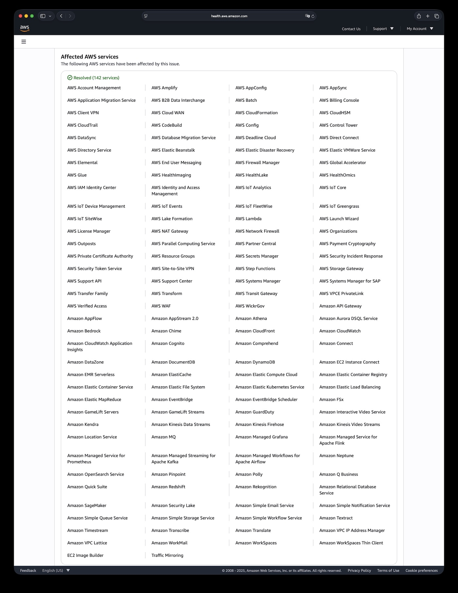
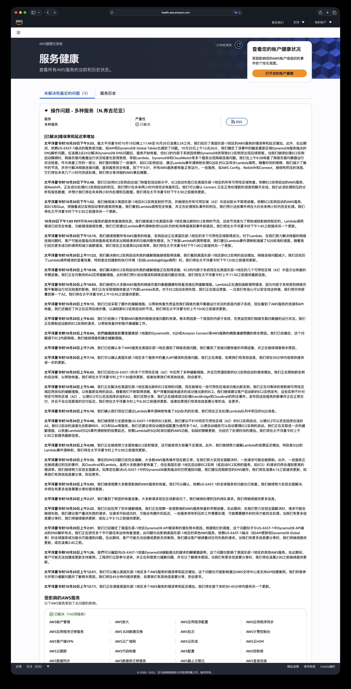
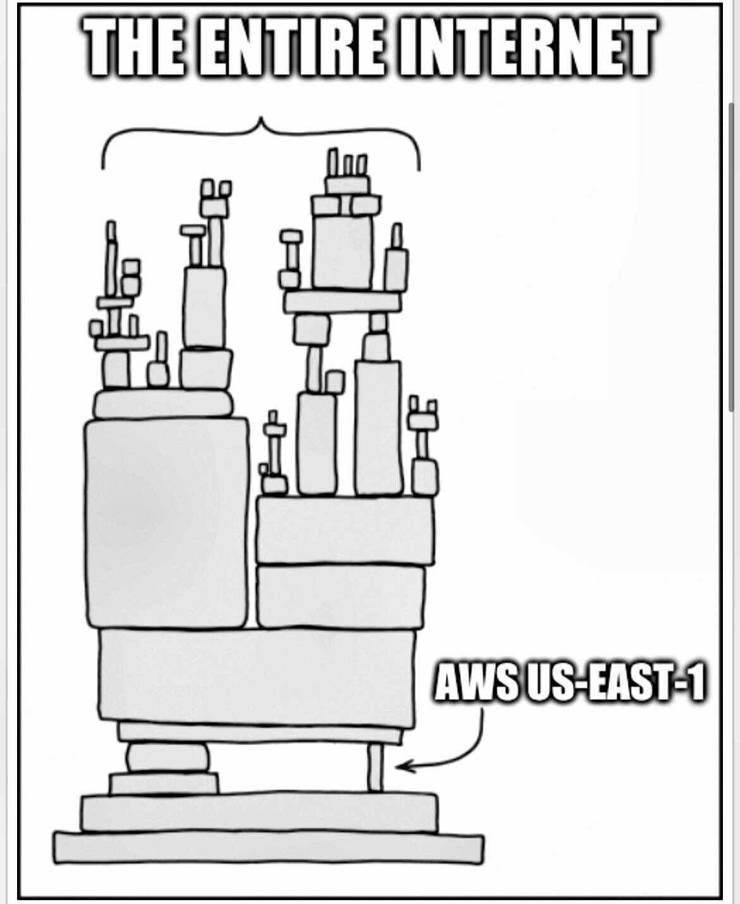

2025年10月20日，AWS最关键的 us-east-1 区域发生了一场持续 15 小时的重大故障，导致全球超过 1000 家企业服务中断。
而这场故障背后的根因，竟然仅仅是一条 AWS 内部 DNS 解析失效。

从凌晨的 DNS 解析失效开始，AWS DynamoDB、EC2、Lambda 等 142 项服务相继受到影响，进而导致全球互联网的大部分功能停转。
Snapchat、Roblox、Coinbase、Signal、Reddit、Robinhood 等热门应用离线，数十亿美元在半天内蒸发，这不啻于一场赛博世界的地震。

更令人警惕的是，因为 us-east-1 是所有 AWS 区域的公共控制平面所在地，即使工作负载部署在欧洲或亚洲的企业也未能幸免。
这场故障暴露了云计算时代最根本的脆弱性：**一条损坏的 DNS 就能引发数十亿美元的经济损失**。
这不是技术能力问题，而是架构哲学的失败 —— us-east-1 成了全球互联网依赖的中枢神经系统，而这个系统现在已经证明，它会定期失灵。

## 赛博地震：数十亿美元在半天内蒸发

这场持续15小时的故障，在全球数字经济中掀起了一场"赛博地震"。Catchpoint CEO 预估经济损失达"数十亿到数千亿美元"。

金融服务首当其冲。Robinhood 在美东交易时段完全离线，数百万散户投资者被锁在账户之外；
Coinbase 的宕机让加密货币交易者在市场波动中束手无策；
Venmo 收到8000份故障报告，用户的数字钱包瞬间"消失"。在现代无现金社会，这相当于所有人同时失去了钱包。

游戏行业损失同样惨重。上亿日活的 Roblox 用户被迫下线，虚拟经济瞬间停摆；
Epic Games 的 Fortnite、任天堂的 Pokémon GO、育碧的彩虹六号集体失声。
对这些依赖用户粘性的平台而言，每小时的宕机都可能意味着永久的用户流失。

英国的政府网站，税务，海关，银行系统受到影响，多家航空公司内部系统受损导致部分航班运营混乱。
更讽刺的是，Amazon 自家产品全线翻车 —— 购物网站、Alexa、Ring 门铃、Prime Video，甚至 AWS 自己的工单系统都未能幸免。
这充分说明：**即使是 AWS 的创造者，也无法避免对 us-east-1 的单点依赖**。

## 故障根因：DNS失效引发的蝴蝶效应

太平洋夏令时2025年10月19日晚11:49，us-east-1 区域的多个服务错误率突然攀升。
直到22分钟后，AWS 才在健康仪表板发布第一条确认。截止到10月20日下午3:53分结束，整个故障持续了近 16 小时。

根据 [AWS 发布的故障公告](https://health.aws.amazon.com/health/status?eventID=arn:aws:health:us-east-1::event/MULTIPLE_SERVICES/AWS_MULTIPLE_SERVICES_OPERATIONAL_ISSUE/AWS_MULTIPLE_SERVICES_OPERATIONAL_ISSUE_BA540_514A652BE1A)，根因看似简单：AWS 内部系统的一条 DNS 解析失败。但这个"小故障"却触发了惊人的级联效应。
DynamoDB 无法访问，而它恰恰是 AWS 控制平面的基石 —— IAM、EC2、Lambda、CloudWatch 等关键服务全部依赖它。

AWS 花了三个半小时修复 DNS，以为万事大吉，却没想到积压的请求产生了"重试风暴"，再次压垮了 DynamoDB。
EC2、负载均衡器、Lambda 与 DynamoDB 之间的循环依赖让系统陷入死局。
AWS 被迫采用手工限流的方式，通过限制启动 EC2 实例，限流 Lambda/SQS 轮询来缓解压力，直到下午才逐渐恢复。

## 级联放大：互联网的阿喀琉斯之踵

us-east-1 不是普通的数据中心，它是 AWS 全球基础设施的**中枢神经系统**。
除了独立运营的国区、美国政务云和欧盟主权云，其他所有 AWS 区域的全局性控制平面都在这个区域里。

这意味着什么？即使你的应用部署在东京或法兰克福，当需要进行 IAM 认证、配置 S3、访问 DynamoDB 全局表、调用 Route 53 时，请求仍要路由到 us-east-1。
这次故障中，英国政府网站、Lloyds 银行、加拿大 Wealthsimple —— 这些看似与美东无关的服务，都因这种隐性依赖而瘫痪。

us-east-1 的特殊地位源于历史 —— 作为 AWS 的第一个区域，19年的演进让它积累了大量技术债务。
重构它？数百万行代码、数千个微服务、难以计数的客户依赖，任何改动都可能引发更大灾难。
于是 AWS 选择了维持现状，直到故障再次提醒我们这个选择的代价。

## 技术解剖：小故障如何演变为大灾难

从2017年到2025年，us-east-1 的每次重大故障都暴露了相同的架构反模式，而 AWS 似乎从未真正吸取教训。

| **维度**   | **2017 S3故障**              | **2020 Kinesis故障**                                   | **2025 DNS 故障**                                        |
|----------|----------------------------|------------------------------------------------------|--------------------------------------------------------|
| **触发因素** | 人为错误 (胖手指)                 | 扩容 (线程限制)                                            | DNS解析失败 (原因未披露)                                        |
| **核心服务** | S3                         | Kinesis                                              | DynamoDB                                               |
| **持续时间** | ~4小时                       | 17小时                                                 | 16小时                                                   |
| **级联机制** | S3 → EC2 → EBS → Lambda    | Kinesis → EventBridge → ECS/EKS → CloudWatch→Cognito | DNS → DynamoDB → IAM → EC2 → NLB → Lambda / CloudWatch |
| **恢复挑战** | 大规模子系统重启                   | 渐进式服务器重启，路由映射重建                                      | 重试风暴，积压处理，NLB健康检查恢复                                    |
| **监控失明** | Service Health Dashboard宕机 | CloudWatch 降级                                        | CloudWatch 和 服务健康看板受影响                                 |
| **全局影响** | US-EAST-1,但影响依赖服务          | US-EAST-1区域                                          | 全球(IAM、全局表依赖)                                          |
| **经济影响** | $1.5亿(S&P 500公司)           | 未公开估计                                                | 数十亿～数千亿美元                                              |

**循环依赖的死亡螺旋**
: AWS 各项基础服务深度耦合，各项基础服务（IAM，EC2管理，ELB）依赖 DynamoDB，DynamoDB 又依赖这些服务 —— 这种循环依赖会导致架构复杂度指数增长，
系统复杂度被隐藏在微服务的层层抽象之下，极大拉高故障分析定位，处理解决的难度与时长。平时岁月静好，故障时却成为死亡陷阱。
我们已经在 [阿里云](https://mp.weixin.qq.com/s/OIlR0rolEQff9YfCpj3wIQ) ，[OpenAI](https://mp.weixin.qq.com/s/ze4y9x7VpPmibitH7tAGMQ)，[滴滴](https://mp.weixin.qq.com/s/FIOB_Oqefx1oez1iu7AGGg) 这些公司的翻车案例中见过太多类似的例子了。

**中心化的单点故障**
: 在2020年 Kinesis 故障后，AWS 大力推广蜂窝架构（Cell-Based），并公开称将自己的服务迁往这种新 Cell 架构。
但从目前来看，us-east-1 区域依然是整个 AWS 全球全局控制平面的单点，牵一发而动全身，故障爆炸半径巨大。
尽管 AWS 声称在 us-east-1 部署了六个可用区提供冗余，但遇到 DNS 这种全局基础服务故障时，依然形同虚设。
这揭示了一个残酷真相：**再精妙的多区域设计，也敌不过一个单点依赖**。

**监控系统的自我失明**
: 最荒谬的是，AWS 自己的监控工具也依赖被监控的服务。当故障发生时，监控系统也随之失明。这创造了一个悖论：最需要监控数据的时候，恰恰是监控系统最不可用的时候。
外部监控平台如 Datadog 同样托管在 AWS 上，形成了"自己监控自己"的闭环。 故障发生75分钟后，AWS 状态页面仍然是 “万里江山一片绿” —— 也许不是他们在撒谎，而是监控系统自己也瘫痪了。

**断路器的集体缺席**
: 尽管 AWS 发布了大量关于实施断路器的最佳实践指南，但这次故障显示出，**AWS 自己的内部服务网格可能并没有实施这些机制**。
断路器本应在检测到下游服务故障时自动"熔断"，停止发送请求，避免雪崩。但实际情况是，当 DynamoDB 出现问题，所有依赖服务继续疯狂重试，形成"重试风暴"。
AWS 最终被迫手动介入，通过人工限流来控制局面 —— 这种原始的应对方式，与其宣扬的"自动化一切"理念形成鲜明对比。

## 知识流失：组织功能障碍的技术表现

在运维圈里有句名言 —— “***It’s always DNS***” 。任何经验丰富的 SRE 遇到这种事都会优先检查 DNS。
但 AWS 团队却在黑暗中摸索了两个多小时，然后又在断路限流的路上挣扎了五个小时。精锐尽失的团队难堪大任，这无疑是草台班子理论的又一例证。

2022-2025年间，亚马逊裁员超过27000人。内部文件显示，各个级别 "不希望流失的人才" （Regretted Attrition）的流失率高达69-81%。
强制返回办公室政策进一步推动高级人才离职。[Justin Garrison 在2023年离职时就预言会有更多大规模故障](https://justingarrison.com/blog/2023-12-30-amazons-silent-sacking/) —— 事实证明他还是太乐观。

> Regretted Attrition：**即企业本不希望他们离职、但他们仍主动离开的员工**。 即在所有离职员工中，有 69–81% 属于公司不希望失去的人。

**组织记忆的流失是不可逆的**。那些知道系统隐秘依赖关系的老工程师走了，留下的新人即使再努力，也缺乏诊断复杂级联故障的直觉。
这种隐性知识无法通过文档传承，只能通过多年的事故响应经验积累。当下一个"边缘案例"出现时，缺乏经验的团队只能眼睁睁看着系统崩溃，并花费老司机几十上百倍的时间去摸索定位与笨拙处理。

云经济学家 Corey Quinn 在《[亚马逊人才流失终于导致 AWS 走向衰落](https://www.theregister.com/2025/10/20/aws_outage_amazon_brain_drain_corey_quinn/)》中辛辣评论道：
“当你炒掉最优秀的工程师时，就别惊讶云厂商会忘记 DNS 是怎么工作的” —— "**下一次大故障已经在酝酿中，只是哪个人手不足的团队率先被哪个边缘案例绊倒的问题而已**。"

## 冷峻未来：应对云计算带来的脆弱性

在几个月前，[Google IAM 故障带崩半个互联网](https://mp.weixin.qq.com/s/yZOUzoEHQdBuNFrSIXVB9w)；仅半年不到，AWS DNS 故障再次把全球互联网拉下水。
当一家云厂商内部的一条 DNS 记录损坏，就能让全球数千万用户的生活陷入混乱；当一个区域的数据中心网络故障，能让遍布五大洲的企业同时瘫痪，
我们必须承认：**云计算在带来便利的同时，也创造了前所未有的系统性脆弱性。**

更何况，当三家美国公司控制全球63%的云基础设施，这已经不仅是技术问题，更是地缘政治风险和数字主权挑战。单一供应商的便利性与全球性的脆弱性构成了一个危险的悖论。

在云服务商的营销话术中，“99.99% 可用性”、“全球多活冗余”、“企业级可靠性”是标配承诺。
但将 AWS、Azure、Google Cloud 近年的实际故障记录摆在一起，云可靠性的神话开始动摇。
[Cherry Servers 在 2025 年发布的研究](https://www.cherryservers.com/blog/cloud-outages) 揭示了残酷的数据：
过去一年 AWS 发生了 38 次故障，平均恢复时间 1.5 小时；Google Cloud 发生了 78 次，平均 5.8 小时；Azure 虽仅 9 次，但平均时长高达 14.6 小时

| Cloud Provider  | Incidents (2024.08 – 2025.08)     | Average Duration |
|:----------------|:----------------------------------|:-----------------|
| AWS             | 38                                | 1.5 hours        |
| Google Cloud    | 78                                | 5.8 hours        |
| Microsoft Azure | 9                                 | 14.6 hours       |

> Headline Numbers: Incidents Summary

“下云” 正从异端想法变成现实选项。在此次 AWS 宕机中，马斯克旗下的社交平台 **X（原推特）因使用自己的数据中心运营而安然无恙**。老马在 X 对 AWS 发出多次嘲讽与揶揄。
知名 SaaS 厂商 37signals 则早在 2022 年就决定将 Basecamp 和 HEY 邮件服务迁出公有云，[预计五年内节省约超过千万万美元云开支](https://mp.weixin.qq.com/s/mknFXO5DSfxw7st8hhxjBQ)。
Dropbox 更是在 2016 年便开始逐步减少对 AWS 的依赖，重返自建数据中心。这并不是技术倒退，而是对过度集中化风险的理性校正。

对于有能力的企业来说，**混合部署**——将核心系统自主可控部署，本地掌握底线，而将弹性扩展需求交给云端处理，可能是更明智的选择。
每一家依赖云的公司都需要认真思考：是否所有工作负载都必须上云？那些关键系统是否应该保留独立运行的能力，以在云崩溃时维持最基本的服务？

**在脆弱性中构建韧性，在依赖与集中化中保持独立自主** —— 这不是技术选择，而是生存哲学。
us-east-1 还会再次故障 —— 不是是否，而是何时。所以真正的问题是：下一次故障发生时，你是否已经准备好了？

## 参考阅读

[AWS: Update - AWS services operating normally](https://www.aboutamazon.com/news/aws/aws-service-disruptions-outage-update)

[AWS: Service Health, Operational issue - Multiple services (N. Virginia)](https://health.aws.amazon.com/health/status?eventID=arn:aws:health:us-east-1::event/MULTIPLE_SERVICES/AWS_MULTIPLE_SERVICES_OPERATIONAL_ISSUE/AWS_MULTIPLE_SERVICES_OPERATIONAL_ISSUE_BA540_514A652BE1A)

[HackerNews: AWS multiple services outage in us-east-1](https://news.ycombinator.com/item?id=45640838)

[CNN: Amazon says systems are back online after global internet outage](https://edition.cnn.com/business/live-news/amazon-tech-outage-10-20-25-intl)

[Register: Today is when the Amazon brain drain finally sent AWS down the spout](https://www.theregister.com/2025/10/20/aws_outage_amazon_brain_drain_corey_quinn/)

[Converge: DNS Failure Triggers Multi-Service AWS Disruption in US-EAST-1](https://convergedigest.com/aws-reports-major-outage-in-us-east-1-region/)

--------

## 故障公告

12:11 AM PDT
我们正在调查美国东部（弗吉尼亚北部，US‑EAST‑1）区域多个 AWS 服务的错误率和时延升高问题。我们将在 30–45 分钟内提供下一次更新。

12:51 AM PDT
我们已确认 US‑EAST‑1 区域内多个 AWS 服务出现错误率和时延升高。该问题也可能影响通过 AWS Support Center 或 Support API 创建支持工单。我们正积极推进缓解并定位根因。我们将在 45 分钟内更新；如有新增信息将更早发布。

1:26 AM PDT
我们确认 US‑EAST‑1 区域内针对 DynamoDB 端点的请求出现显著错误率升高，且该问题同时影响该区域的其他 AWS 服务。在此期间，客户可能无法创建或更新支持工单。工程团队已第一时间介入，正同时推进缓解和根因分析。我们将持续更新进展，或最迟于 2:00 AM 前更新。

2:01 AM PDT
我们已识别出导致 US‑EAST‑1 区域内 DynamoDB API 错误率升高的潜在根因。根据调查，问题与该区域 DynamoDB API 端点的 DNS 解析有关。我们正多路并行推进以加速恢复。该问题同样影响 US‑EAST‑1 的其他 AWS 服务；依赖该区域端点的全局服务或功能（如 IAM 更新、DynamoDB 全局表）也可能受影响。在此期间，客户可能无法创建或更新支持工单。建议客户持续重试失败请求。我们将持续更新，或最迟于 2:45 AM 前更新。

2:22 AM PDT
我们已实施初步缓解措施，部分受影响服务出现早期恢复迹象。在全面恢复前，请求仍可能失败，建议重试失败请求。随着请求逐步成功，时延可能暂时升高，且部分服务存在积压任务，需要额外时间处理。我们将持续更新，或最迟于 3:15 AM 前更新。

2:27 AM PDT
我们观察到明显恢复迹象。多数请求现在应已成功。我们仍在消化排队中的请求，并将继续提供后续信息。

3:03 AM PDT
大部分受影响的 AWS 服务持续恢复。依赖 US‑EAST‑1 的全局服务和功能也已恢复。我们将继续推进全面恢复，并在有更多信息时更新。

3:35 AM PDT
底层 DNS 问题已完全缓解，多数 AWS 服务操作现已正常。为推进全面恢复，部分请求可能仍会被限流。同时，部分服务（如 AWS CloudTrail 与 AWS Lambda）仍在处理事件积压。尽管多数操作已恢复，在 US‑EAST‑1 区域启动新的 EC2 实例（或依赖 EC2 启动的服务，如 Amazon ECS）的请求错误率仍偏高。我们将继续推进全面恢复。若您在解析 US‑EAST‑1 的 DynamoDB 服务端点时仍有问题，建议刷新本地 DNS 缓存。我们将于 4:15 AM 前更新，或在有新增信息时更早发布。

4:08 AM PDT
我们正继续推进 EC2 启动错误的全面恢复，其中可能表现为“容量不足错误”（Insufficient Capacity Error）。此外，我们也在缓解 Lambda 的轮询延迟升高，尤其是面向 SQS 的 Lambda 事件源映射（Event Source Mappings）。我们将于 5:00 AM PDT 前更新。

4:48 AM PDT
我们仍在全力恢复 US‑EAST‑1 的新建 EC2 启动。建议在发起 EC2 实例启动时不指定具体可用区（AZ），以便 EC2 能选择合适的 AZ。新建 EC2 启动的受损同样影响 RDS、ECS、Glue 等服务。我们也建议将 Auto Scaling 组配置为多 AZ，以便自动管理实例启动。我们正采取进一步缓解措施以恢复 Lambda 针对 SQS 的轮询速度。依赖 Lambda 对 SQS 轮询能力的 AWS 功能（例如 AWS Organizations 策略更新）也出现处理时间升高。我们将于 5:30 AM PDT 前更新。

5:10 AM PDT
通过 Lambda 事件源映射处理 SQS 队列的能力已恢复。我们正处理 Lambda 队列中积压的 SQS 消息。

5:48 AM PDT
US‑EAST‑1 区域新建 EC2 实例启动问题的恢复取得进展，现已可在部分 AZ 成功启动新实例。我们正将类似缓解措施应用于其余受影响的 AZ，以恢复新实例启动。随着恢复推进，客户将看到成功启动的实例数逐步增加。我们仍建议不要将新建 EC2 实例固定到特定 AZ。我们也在持续处理 EventBridge 与 CloudTrail 的事件积压；新发布到这些服务的事件已正常交付且未出现额外延迟。我们将于 6:30 AM PDT 前更新，或在有新增信息时更早发布。

6:42 AM PDT
我们已在 US‑EAST‑1 的多个 AZ 应用了多项缓解，但新建 EC2 实例启动的错误仍高于常态。为助力恢复，我们正在对新实例启动实施限流。我们将于 7:30 AM PDT 更新，或在有新增信息时更早发布。

7:14 AM PDT
我们确认 US‑EAST‑1 区域内多项服务出现显著的 API 错误与网络连通性问题。我们正在调查，将在 30 分钟内提供进一步更新，或更早发布。

7:29 AM PDT
我们已确认 US‑EAST‑1 区域内多项 AWS 服务受到网络连通性问题影响。针对该连通性问题已出现早期恢复迹象，我们仍在调查其根因。

8:04 AM PDT
我们继续调查影响 US‑EAST‑1 区域（如 DynamoDB、SQS、Amazon Connect 等服务）的网络连通性问题根因。我们已识别问题源自 EC2 内部网络。我们将继续调查并制定缓解措施。

8:43 AM PDT
我们进一步缩小了影响 AWS 服务的网络连通性问题源头：根因为一个用于监控网络负载均衡器（NLB）健康状况的内部底层子系统。我们正对新建 EC2 实例启动进行限流以协助恢复，并积极推进缓解。

9:13 AM PDT
我们已采取额外缓解步骤，以帮助恢复负责 NLB 健康监控的内部子系统，现正观察到各服务的连通性与 API 恢复。我们也已识别并正应用下一步措施，以缓解对新建 EC2 实例启动的限流。我们将于 10:00 AM PDT 前更新。

10:03 AM PDT
我们持续对 NLB 健康相关问题采取缓解，并在恢复大多数 AWS 服务的网络连通性。由于内部子系统受 NLB 健康检查影响，Lambda 目前出现函数调用错误；我们正采取措施恢复该内部 Lambda 系统。针对 EC2 实例启动失败，我们正在验证修复方案，一旦确认安全，将首先在一个 AZ 内部署。我们将于 10:45 AM PDT 前更新。

10:38 AM PDT
解决新建 EC2 实例启动失败的缓解措施正在推进，US‑EAST‑1 区域内的部分 AZ 已出现 EC2 内部子系统恢复的早期迹象。我们正将缓解措施扩展至其余 AZ，届时预计启动错误与网络连通性问题将逐步缓解。我们将于 11:30 AM PDT 前更新。

11:22 AM PDT
解决新建 EC2 启动失败的缓解继续推进；US‑EAST‑1 区域内新建 EC2 实例的成功启动在增加，网络连通性问题在减少。Lambda 调用错误显著改善，尤其是在创建新的执行环境（包括 Lambda@Edge 调用）时。我们将于 12:00 PM PDT 前更新。

12:15 PM PDT
我们在所有 AWS 服务上持续观察到恢复，US‑EAST‑1 区域内多个 AZ 的实例启动已成功。针对 Lambda，在我们处理残余网络连通性问题期间，发起对其他服务或系统的网络请求的函数可能间歇性报错。为恢复 Lambda 的调用，我们曾降低通过 Lambda 事件源映射对 SQS 的轮询速率；随着调用成功率提升与函数错误减少，我们正提高该轮询速率。我们将于 1:00 PM PDT 前再次更新。

1:03 PM PDT
各 AWS 服务的恢复持续改善。我们正在进一步降低此前为减轻影响而对 US‑EAST‑1 新建 EC2 实例启动采取的限流力度。Lambda 调用错误已完全恢复，函数错误继续改善。我们已将通过 Lambda 事件源映射对 SQS 队列的轮询速率恢复至事件前水平。我们将于 1:45 PM PDT 前再次更新。

1:52 PM PDT
我们继续降低 US‑EAST‑1 区域 EC2 实例启动的限流，并在所有可用区向事件前水平推进。依赖 EC2 实例启动的服务（如 ECS、Glue）会随着启动成功率的提升而逐步恢复。Lambda 调用已完全恢复，我们正在处理排队事件的积压，预计在接下来约两小时内处理完毕。我们将于 2:30 PM PDT 前再次更新。

2:48 PM PDT
我们已将 EC2 实例启动的限流恢复至事件前水平，US‑EAST‑1 区域所有可用区的 EC2 启动失败已恢复。依赖 EC2 启动的服务（如 Redshift）正成功处理其积压的实例启动，预计将在接下来两小时内完成全面恢复。我们确认 Connect 能正常处理新的语音与聊天会话。分析与报表数据存在积压，预计将在接下来两小时内处理完毕。我们将于 3:30 PM PDT 前更新。

3:53 PM PDT
在 10 月 19 日 11:49 PM 至 10 月 20 日 2:24 AM（均为 PDT）期间，US‑EAST‑1 区域的 AWS 服务出现错误率和时延升高。此期间，依赖 US‑EAST‑1 端点的服务或功能（如 IAM、DynamoDB 全局表）也受到影响。我们于 10 月 20 日 12:26 AM 将事件触发因素定位为区域内 DynamoDB 服务端点的 DNS 解析问题。2:24 AM 解决该 DNS 问题后，各服务开始恢复，但由于 EC2 的相关内部子系统依赖 DynamoDB，我们随后在负责启动 EC2 实例的内部子系统上出现新的受损。随着我们继续处理 EC2 启动受损问题，网络负载均衡器（NLB）健康检查也出现受损，导致多项服务（如 Lambda、DynamoDB、CloudWatch）出现网络连通性问题。我们于 9:38 AM 恢复了 NLB 健康检查。作为恢复的一部分，我们临时对部分操作实施限流（如 EC2 实例启动、通过 Lambda 事件源映射处理 SQS 队列、以及异步 Lambda 调用）。随后我们逐步降低限流，并并行解决网络连通性问题，直至服务完全恢复。到 3:01 PM，所有 AWS 服务已恢复至正常运行状态。AWS Config、Redshift、Connect 等少数服务仍有消息积压，将在接下来的数小时内处理完毕。我们将分享更为详尽的事件后总结。

--------

## 相关专栏

### **云故障**

- [AWS最大区域故障，带崩多项服务](https://mp.weixin.qq.com/s/hBMaPrqoMHQOf56G5fV-ag)
- [知乎挂了：证书问题还是CDN翻车？](https://mp.weixin.qq.com/s/-nRq0HM56Uxn1Yc9RSdUbg)
- [阿里云故障，CDN挂了，记得申请SLA赔付](https://mp.weixin.qq.com/s/Y2PZiH63EAXRKP8gele8NQ)
- [Apple,Google,FB,TG 160亿登录信息泄露](https://mp.weixin.qq.com/s/TiY1pDQQhxY-z_RoDTAoyw)
- [带瘫全球互联网，Google云/Cloudflare全球故障](https://mp.weixin.qq.com/s/yZOUzoEHQdBuNFrSIXVB9w)
- [大故障：阿里云核心域名被拖走了](https://mp.weixin.qq.com/s/l1b-eq06NyuN61cqZoYJjA)
- [深度分析：迪奥数据泄露事件，云配置失当的锅？](https://mp.weixin.qq.com/s/TBdgm8pnZPCyysAKW7SsEw)
- [10万用户的软件，因腾讯云欠费2元灰飞烟灭？](https://mp.weixin.qq.com/s/Gz_Y2qyByg1y17eWILJsLw)
- [AWS 东京可用区故障：影响13项服务](https://mp.weixin.qq.com/s/4no4Raj26u6GbUiHECBAjA)
- [Shopify：愚人节真的翻车了](https://mp.weixin.qq.com/s/9352Km9U-mnv8dmsHhSdMg)
- [Oracle云大翻车：6百万用户认证数据泄漏](https://mp.weixin.qq.com/s/5z3jUV8CrKPinUYzOnlC6g)
- [OpenAI全球宕机复盘：K8S循环依赖](https://mp.weixin.qq.com/s/ze4y9x7VpPmibitH7tAGMQ)
- [支付宝崩了？双十一整活王又来了](https://mp.weixin.qq.com/s/D2XmL2YYN2kqHtwFN4FVGQ)
- [草台回旋镖：Apple Music证书过期服务中断](https://mp.weixin.qq.com/s/eawgZ3hE63b3fRfrJ1sqfw)
- [阿里云：高可用容灾神话的破灭](https://mp.weixin.qq.com/s/rXwEayprvDKCgba4m-naoQ)
- [阿里云故障预报：本次事故将持续至20年后？](https://mp.weixin.qq.com/s/G41IN2y8DrC002FQ_BXtXw)
- [阿里云盘灾难级BUG：能看别人照片？](https://mp.weixin.qq.com/s/C7XGgGmzvMjKJGbBGVmrzw)
- [阿里云新加坡可用区C故障，网传机房着火](https://mp.weixin.qq.com/s/EDRmP7ninfSx-CgNDb8mpg)
- [这次轮到WPS崩了](https://mp.weixin.qq.com/s/BLHaiMYGpUTjMhP7msGHhA)
- [草台班子唱大戏，阿里云RDS翻车记](https://mp.weixin.qq.com/s/kOIw8uPjZUZ0-QisC1TBOA)
- [我们能从网易云音乐故障中学到什么？](https://mp.weixin.qq.com/s/tmlP1ol9qP2SIxB9VbvpEg)
- [GitHub全站故障，又是数据库上翻的车？](https://mp.weixin.qq.com/s/nOzSFkULOJeuQ4NChGxE5w)
- [全球Windows蓝屏：甲乙双方都是草台班子](https://mp.weixin.qq.com/s/s7i7bSYzNY8mrcpfkHPjOg)
- [阿里云又挂了，这次是光缆被挖断了？](https://mp.weixin.qq.com/s/cb2Lh56uINxacM2uUaB6Vw)
- [删库：Google云爆破了大基金的整个云账户](https://mp.weixin.qq.com/s/eH5HBbL7cQhjQY8rm1gFLQ)
- [云上黑暗森林：打爆云账单，只需要S3桶名](https://mp.weixin.qq.com/s/35ScjtPjC1GNGKaSArJhcA)
- [taobao.com证书过期](https://mp.weixin.qq.com/s/-ntsNfdEq3b4qs5tKP7tfQ)
- [我们能从腾讯云故障复盘中学到什么？](https://mp.weixin.qq.com/s/SpxKyjSb1luCrJ8xIFjylg)
- [云SLA是安慰剂还是厕纸合同？](https://mp.weixin.qq.com/s/mgkOybNeEH3LO0gRa1rQBQ)
- [腾讯云：颜面尽失的草台班子](https://mp.weixin.qq.com/s/PgduTGIvWSUgHZhVfnb7Bg)
- [【腾讯】云计算史诗级二翻车来了](https://mp.weixin.qq.com/s/5F2YgVtfpXoe7A1MoSoKLg)
- [互联网故障背后的草台班子们](https://mp.weixin.qq.com/s/OxhhJ4U1P43di_eaE1uGPw) 马工
- [从降本增笑到真的降本增效](https://mp.weixin.qq.com/s/FIOB_Oqefx1oez1iu7AGGg)
- [阿里云周爆：云数据库管控又挂了](https://mp.weixin.qq.com/s/3F1ud-tWB3eymu1-dxSHMA)
- [我们能从阿里云史诗级故障中学到什么](https://mp.weixin.qq.com/s/OIlR0rolEQff9YfCpj3wIQ)
- [【阿里】云计算史诗级大翻车来了](https://mp.weixin.qq.com/s/cTge3xOlIQCALQc8Mi-P8w)

### **云资源**

- [花钱买罪受的大冤种：逃离云计算妙瓦底](https://mp.weixin.qq.com/s/zwJ2T2Vh_R7xD8IKPso31Q)
- [云数据库是不是智商税](https://mp.weixin.qq.com/s/LefEAXTcBH-KBJNhXNoc7A)
- [云盘是不是杀猪盘？](https://mp.weixin.qq.com/s/UxjiUBTpb1pRUfGtR9V3ag)
- [剖析云上算力真实成本](https://mp.weixin.qq.com/s/rp8Dtvyo9cItBJSsvfrKjw)
- [扒皮对象存储：从降本到杀猪](https://mp.weixin.qq.com/s/HathxpQ_KUuqxyrtyCDzWw)
- [垃圾腾讯云CDN：从入门到放弃](https://mp.weixin.qq.com/s/ANFnbDXwuhKI99fgYRZ9ug)
- [记一次阿里云 DCDN 加速仅 32 秒就欠了 1600 的问题处理](https://mp.weixin.qq.com/s/0Wnv1B80Tk4J03X3uAm4Ww) 转
- [云SLA是安慰剂还是厕纸合同？](https://mp.weixin.qq.com/s/mgkOybNeEH3LO0gRa1rQBQ)
- [FinOps终点是下云](https://mp.weixin.qq.com/s/Yp_PU8nmyK-NVq0clD98RQ)
- [本土云计算为啥还没挖沙子赚钱？](https://mp.weixin.qq.com/s/2w0bLJI7TvUNp1tzLYbvsA)
- [云SLA是不是安慰剂？](https://mp.weixin.qq.com/s/LC5jAhuVObRcrTLxI1FUQA)
- [范式转移：从云到本地优先](https://mp.weixin.qq.com/s/Yp6L0hh4b4HuJQRPD3aJYw)

### **下云记**

- [花钱买罪受的大冤种：逃离云计算妙瓦底](https://mp.weixin.qq.com/s/zwJ2T2Vh_R7xD8IKPso31Q)
- [草台班子唱大戏，阿里云RDS翻车记](https://mp.weixin.qq.com/s/kOIw8uPjZUZ0-QisC1TBOA)
- [DHH下云：S3晚搬一天，就多花四万](https://mp.weixin.qq.com/s/yQbtyDv1mc-r_bn9RNCSRA)
- [DHH：下云超预期，能省一个亿](https://mp.weixin.qq.com/s/mknFXO5DSfxw7st8hhxjBQ)
- [先优化碳基BIO核，再优化硅基CPU核](https://mp.weixin.qq.com/s/Yxyir8kjRDUZwkkE_dscZQ)
- [单租户时代：SaaS范式转移](https://mp.weixin.qq.com/s/jKv9l_ro6rWei4QnXck-zw)
- [拒绝用复杂度自慰，下云也保稳定运行](https://mp.weixin.qq.com/s/yIVal-9U6_TXX-dZpVtjBg)
- [半年下云省千万：DHH下云FAQ答疑](https://mp.weixin.qq.com/s/xaa079P4DRCz0hzNovGoOA)
- [是时候放弃云计算了吗？](https://mp.weixin.qq.com/s/CicctyvV1xk5B-AsKfzPjw)
- [下云奥德赛](https://mp.weixin.qq.com/s/H2S3TV-AsqS43A5Hh-XMhQ)

