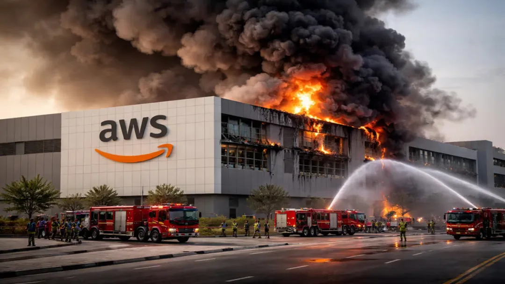
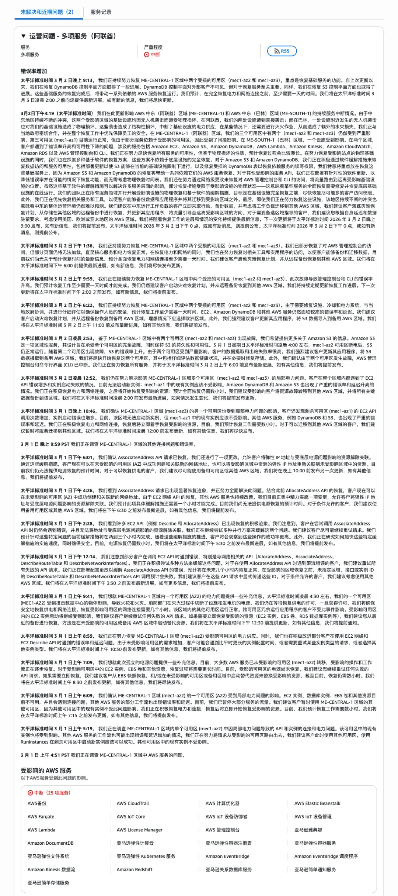
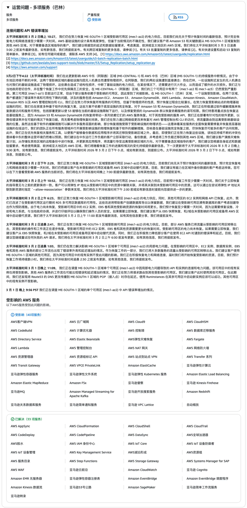

2026 年 3 月 1 日，伊朗无人机击中 AWS 阿联酋与巴林数据中心。这可能是公开报道中第一次有大型云厂商的数据中心遭到军事打击并瘫痪。以前可能有人觉得战争离软件工程很远，现在看，只隔着一层机柜门。

## 发生了什么？

2026年3月1日，中东冲突升级后，伊朗对阿联酋和巴林境内的多个目标实施了无人机/导弹打击，并对美国在中东资产展开报复。

在这波打击中，AWS位于阿联酋和巴林的数据中心被无人机直接命中。是的，不是断电，不是光缆被挖，不是空调故障，是 **无人机物理命中了数据中心建筑**，引发了火灾和结构性损坏。

这可能是 **公开报道中第一次有超大规模云厂商的数据中心因军事行动而物理瘫痪**。

AWS一开始还遮遮掩掩，在状态页面上写的是“有**不明物体**撞击数据中心，产生火花和火焰”。好家伙，无人机在措辞里成了“不明物体”。直到3月3日凌晨，AWS才正式确认：这是无人机打击（drone strikes）。

------

## 打了多少？

先看AWS在中东的家底。中东一共3个 Region 投入运营，共计 **9个可用区（AZ）**：

此次遭受打击的情况：

9个AZ挂了3个，中东整体 **33%的可用区瘫痪**。阿联酋区域更惨 —— 3个可用区挂了2个，多AZ 高可用直接停摆。精心设计的跨AZ容灾架构？在无人机面前跟没有一样。以色列区域倒是毫发无损——至少在现有公开通报中未见直接物理影响。

------

## 影响面有多大？

**阿联酋区域**：**38项 AWS 服务**受到影响，核心服务全线中断 —— EC2、Lambda、EKS、VPC、RDS、CloudFormation、S3，该有的一个不少。

**巴林区域**：更夸张，**46项 AWS 服务**出现故障，电力和网络连接中断。

综合两个区域的影响：

（注：上表分级统计口径有重叠，不能简单相加。）

区域客户首当其冲：已有报道提到 Snowflake 在中东的部署受到AWS故障影响，部分本地企业也报告业务中断。

而AWS官方的建议更是史无前例 —— 他们建议受影响客户“立即从远程备份恢复到其他 AWS 区域，理想情况下是欧洲区域”。你什么时候见过AWS官方主动建议客户“赶紧跑”的？这基本上等于官方承认：短期内别指望恢复了。

截至3月3日，被无人机直接命中的 `mec1-az2` 仍然处于 **物理离线** 状态 —— 消防和安全部门还没批准工程师重新进入建筑。你连进都进不去，更别提修了。

------

## AI 全线遭殃

在AWS中东机房被炸的同一个周末，全球主要的AI服务几乎全部出现了不同程度的故障：

**Claude / Claude Code** 在3月2日出现了全球范围的大面积故障，用户疯狂刷到“Claude will return soon”和 HTTP 529 过载错误。根据 Anthropic 状态页更新，这次故障一度表现为登录/会话路径问题，后续也提到“部分 API 方法异常”；

因此，现有公开信息不足以证明这次故障由AWS中东数据中心受损直接导致。老冯会另写一篇分析。《Claude 全球大宕机复盘》

**Gemini / GPT** 也在同期出现了服务波动。是否与AWS中东事件存在直接因果关系，现有公开信息并不充分。但推断应该是由 Claude 故障导致的级联影响。

总之这个周末，搞 AI 的不好过。

------

## 云计算的阿喀琉斯之踵

回头看这件事，技术层面其实没什么好说的 —— 物理层面的毁灭，什么软件架构都扛不住。多AZ、多Region、自动故障转移，在导弹面前统统是纸糊的。这件事真正值得思考的是另一个维度：

**数据中心的选址，从此多了一个新的变量 —— 它会不会被炸。** 以往云厂商选址数据中心，考虑的无非是电价、网络、气候、政策、人才。从今天开始，“地缘政治风险”和“军事打击概率”要正式写进选址评估报告了。

AWS 的多 Region 架构在这次事件中其实表现算符合预期 —— **区域间的故障隔离确实生效了**。[不像之前 us-east-1 单 AZ 打爆全球服务](/cloud/aws-dns-failure/)。全局控制平面（IAM、CloudFront、Route 53）全部部署在美国本土区域，中东的Region并不承载任何全局服务的控制平面角色。所以虽然中东炸了，但全球其他地方的AWS客户几乎没受影响。

这恰恰说明了一个道理：**真正的容灾，不是同城双活，不是同Region跨AZ，而是跨Region甚至跨云**。你的业务如果重度依赖某个特定Region，那么当这个Region因为任何原因（不管是自然灾害还是军事打击）挂了的时候，你就是等死。对于依赖中东AWS的企业来说，这次事件是一个血淋淋的教训。

------

## 尾声

过去几十年，科技行业有一个隐含的假设：数据中心是“平民基础设施”，不会成为军事打击目标。这个假设在2026年3月1日被无人机炸碎了。

以后的云架构评审会上，可能会多出这样一个灵魂拷问：

> “如果这个Region被炸了怎么办？”

别笑，这不再是一个荒谬的问题了。毕竟人家真是瞄着 AWS 数据中心去打的。有时候你自己找个小 IDC 租几台服务器反而没事 —— 谁稀得来炸它呢？

声明：本文碳基智力含量约为 20%。

### References

`[1]` AWS Health Dashboard Status:*https://status.aws.amazon.com/*
`[2]`AWS Health Dashboard RSS:*https://status.aws.amazon.com/rss/all.rss*
`[3]`AWS says drones hit two of its datacenters in UAE - The Register:*https://www.theregister.com/2026/03/02/amazon_outages_middle_east/*
`[4]`Two AWS Middle East availability zones down - Computing.co.uk:*https://www.computing.co.uk/news/2026/two-aws-middle-east-availability-zones-down-after-datacentre-impacted-by-objects*
`[5]`AWS UAE suffers AZ outage - Data Center Dynamics:*https://www.datacenterdynamics.com/en/news/aws-uae-outage-after-objects-struck-the-data-center-cause-fire-amid-iran-attacks/*
`[6]`AWS Middle East Outage - Data Center Knowledge:*https://www.datacenterknowledge.com/outages/aws-middle-east-outage-after-data-center-hit-by-unidentified-objects*
`[7]`Anthropic Status:*https://status.claude.com/*
`[8]`OpenAI Status: *https://status.openai.com/*
