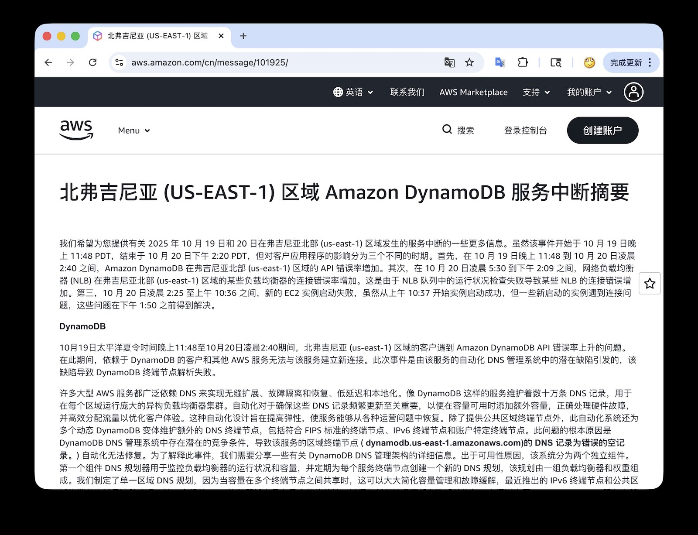

AWS just released the official postmortem for the [Oct 20 us-east-1 meltdown](https://mp.weixin.qq.com/s/sCAOwNva__0L_iMP1QHngQ). It’s one of the rare times we get first-hand detail, so I translated it to Chinese and sprinkled in commentary. Here’s the English recap with my notes.

> Incident page: https://aws.amazon.com/cn/message/101925/

## Amazon DynamoDB outage summary

The event hit us-east-1 between **23:48 PDT Oct 19** and **14:20 PDT Oct 20**. AWS breaks the impact into three phases:

1. **23:48–02:40** – DynamoDB API error rates spiked; anything relying on DynamoDB couldn’t establish new connections.
2. **05:30–14:09** – Network Load Balancers (NLB) saw rising connection errors because their health checks failed.
3. **02:25–10:36** – New EC2 instance launches failed entirely. Launches resumed gradually after 10:37, but networking on the newly launched nodes was flaky until 13:50.

### DynamoDB

DynamoDB’s DNS automation contains a race condition. The automation manages hundreds of thousands of records per region, including public, FIPS, IPv6, and account-specific endpoints. Two independent components handle it:

- **DNS Planner** tracks load balancer health/capacity and emits unified plans for all endpoints, keeping shared pools in sync.
- **DNS Enactor** runs three copies across different AZs. Each enactor watches for new plans and applies them via Route 53 transactions. The design assumes enactors can run independently and still converge on the same state.

On Oct 19 a rare interaction between two enactors exposed the race: one enactor got stuck updating a few endpoints (high latency), retried repeatedly, and by the time it looked at the regional endpoint `dynamodb.us-east-1.amazonaws.com`, the other enactor had raced ahead with a newer plan. Because the lagging enactor’s state verification happened only once, it tried to apply the stale plan anyway—overwriting the DNS record with a blank set. All three enactors eventually converged on “empty,” and the automation never backfilled it.

In short, the control plane deleted its own A records.

AWS engineers tried to patch around it by forcing Route 53 updates manually, but the propagation rules and the lack of a consistent view made that slow. Customers saw elevated error rates for almost three hours while the DNS plan was rebuilt.

### EC2 launches and the DWFM mess

The next domino was DWFM (the orchestration workflow that hosts EC2, EBS, and Networking control planes). When DNS broke, DWFM lost its dependencies and tore itself apart. New EC2 instances could not launch between **02:25** and **10:36**.

To make matters worse, the automation that was supposed to refill compute capacity tried to spin up fresh EC2 hosts — but the EC2 control plane was down, so the autoscaler sat there retrying forever. AWS’s mitigation was to block customers from launching more EC2 instances, then reboot DWFM fleets in waves to purge the retry queues.

This part is baffling: where’s the exponential backoff? Where’s the circuit breaker? AWS even admits, “There was no pre-existing playbook for this scenario, so engineers acted cautiously.” Translation: they debated for 100 minutes before deciding to reboot the workflow managers, then needed 74 more minutes for the restarts to actually work. Rebooting usually fixes 90% of problems, but it shouldn’t take three hours to say “turn it off and on again.”

### NLB failures

Just as EC2 was coming back, Network Load Balancers started failing health checks. Without fresh configuration pushes, the health monitors kicked nodes out of rotation, which then rippled back into DynamoDB, CloudWatch, and Lambda.

AWS “fixed” it by disabling the automatic health-check failover logic for the NLB clusters. Detection at 06:52, manual failover override at 09:36—another two and a half hours to make a call.

The DynamoDB/EC2/NLB trifecta triggered dozens of secondary failures: Support Center, STS, IAM, Redshift, you name it. IAM in particular deserves more focus. IAM stores policies in DynamoDB. Between 23:51 and 01:25, IAM was degraded, which is likely the main vector that let the fault fan out to 142 AWS services. AWS glossed over it in the write-up.

### My takeaways

Some AWS customers told me after the incident that they were disillusioned: turns out the “cloud leader” also operates like a circus troupe. To AWS’s credit, at least they published technical details—many vendors pretend nothing happened.

But the story is the same as every other hyperscaler screwup lately: the core asset isn’t hardware, it’s the veteran engineers. Those folks are expensive, they don’t show up as “growth” on quarterly calls, so they get chopped. Amazon laid off tens of thousands, a big chunk of them the exact people who remember the weird dependency graphs. What’s left are newcomers with no clue how the Rube Goldberg machine fits together, plus “75% of the code was generated by AI.” The result: nobody can smell a cascading failure early, and nobody wants to make a hard call when everything burns.

Scale-driven complexity is starting to eat the clouds alive. Fires and power cuts aren’t the big outages anymore; control-plane bugs and fat-fingered configs are. Sometimes the sanest architecture is the boring one: two racks in your own datacenter, a couple of databases, some Docker hosts, offsite object-storage backups. Most companies could ride that to an IPO. If you don’t have Amazon- or Google-scale complexity, but you insist on adopting their infrastructure patterns, you’re paying not just sky-high bills but also a risk tax. Incidents like this prove it.

When a single DNS entry inside a provider can wreak global havoc, you’re not buying resilience, you’re buying systemic risk. That’s not what the internet was supposed to be.

Maybe the endgame is regulation: split hyperscalers the way the FCC split AT&T. Turn public IaaS hardware into regulated infrastructure (think power grids), and let PaaS/SaaS bloom above it via countless vendors. Because right now, one race condition in Virginia is all it takes to remind us how fragile the cloud really is.
